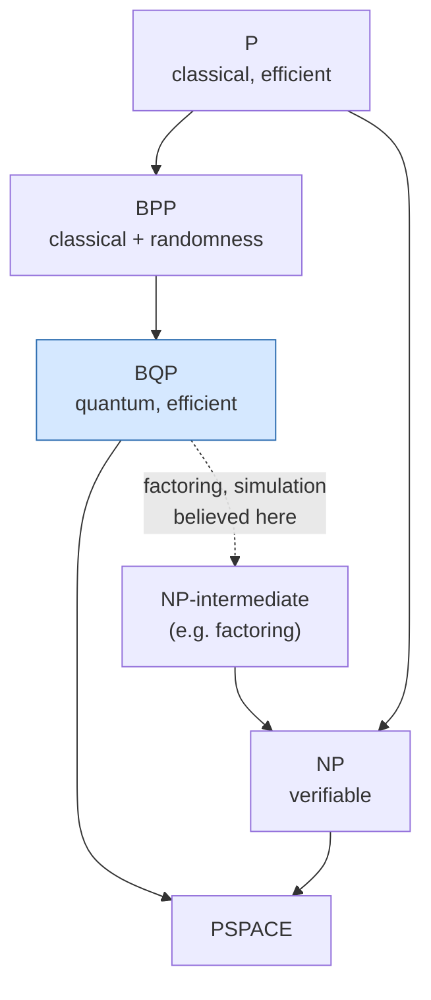
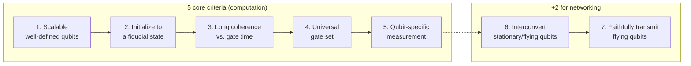

# Quantum Computing — Overview, Strategic Context, and the Path to Utility

> **Scope.** This file is the entry point to a technical knowledge database aimed at hardware and algorithm engineers. It frames *why* quantum computing matters, *what it is and is not good for*, the complexity-theoretic foundations that make the field rigorous rather than speculative, the historical arc from Feynman to the fault-tolerant era, the DiVincenzo criteria that every physical platform is measured against, and the structure of the industry and government landscape. Subsequent files drill into each topic at working-engineering depth. Where a claim concerns a fast-moving empirical fact (current qubit counts, latest fidelity records), it is flagged for re-verification, because the field's press-release cadence outruns any static document.

---

## 1. Why Quantum Computing — and Why Not

Quantum computing is frequently mis-sold as a general-purpose accelerator: a faster computer that will speed up "everything." This framing is wrong, and getting it right is the single most important calibration an engineer entering the field can make. A quantum computer is a special-purpose device that offers dramatic speedups for a **narrow, well-characterized set of problems** whose mathematical structure happens to align with the operations a quantum system performs naturally — interference of complex probability amplitudes, and the manipulation of an exponentially large state space using a polynomial number of physical operations.

### 1.1 Problems with proven or conjectured quantum advantage

There are, after roughly four decades of research, only a handful of problem classes for which a meaningful quantum speedup is either proven or strongly conjectured:

- **Integer factorization and discrete logarithms (Shor, 1994).** Shor's algorithm factors an *n*-bit integer in time polynomial in *n* (roughly O(*n*²–*n*³) depending on the arithmetic implementation), versus the best known classical algorithm, the general number field sieve, which runs in sub-exponential but super-polynomial time exp(O(*n*^{1/3} log^{2/3} *n*)). This is the canonical **exponential** speedup, and because the security of RSA, Diffie–Hellman, and elliptic-curve cryptography rests on the classical hardness of exactly these problems, Shor's algorithm is the single most consequential result in the field for policy and security (see File 13 for the algorithm and File 21 for the post-quantum cryptography response).
- **Unstructured search (Grover, 1996).** Grover's algorithm finds a marked item among *N* in O(√*N*) queries versus O(*N*) classically — a **quadratic**, provably optimal speedup for the black-box model. Quadratic speedups are real but far less dramatic than exponential ones, and (as File 13 discusses) the constant-factor and error-correction overheads frequently erase the advantage at realistic problem sizes.
- **Quantum simulation (Feynman, 1982).** Simulating the dynamics and ground states of quantum many-body systems — molecules, strongly correlated materials, lattice gauge theories — is exponentially hard classically because the Hilbert space dimension grows as 2ⁿ for *n* particles/modes. A quantum computer's own state space grows the same way, making it the natural substrate. This is widely regarded as the most scientifically defensible *medium-term* application (Files 13 and 17).
- **Certain optimization and linear-algebra subroutines (conjectured).** Algorithms such as QAOA for combinatorial optimization (Farhi et al., 2014) and HHL for linear systems (Harrow–Hassidim–Lloyd, 2009) are widely studied, but their *practical* advantage over the best classical heuristics is **contested and unproven** — a point this database returns to repeatedly and honestly (Files 13, 17).

### 1.2 What quantum computers are *not* good at

Equally important is the negative space. Quantum computers offer **no general speedup** for the overwhelming majority of classical workloads:

- They do not speed up arbitrary arithmetic, databases, web serving, video encoding, or most of what a data center actually does.
- Reading classical data *into* a quantum state ("state preparation" / the QRAM bottleneck) can itself cost time linear in the data size, which silently destroys many claimed speedups (the HHL caveat, File 13).
- Reading the *answer out* collapses the quantum state and yields only a sample, not the full amplitude vector — so algorithms that produce a quantum state encoding an exponentially large answer often cannot extract that answer efficiently.
- For problems where the best classical algorithm is already polynomial with a small exponent, even a quadratic quantum speedup rarely beats classical hardware once the enormous per-operation overhead of error-corrected quantum gates is included.

The honest one-line summary: **quantum computers are accelerators for problems with hidden algebraic/periodic structure or intrinsic quantum structure, not faster classical computers.**

---

## 2. Complexity-Theoretic Framing


**Where quantum speedups live — the complexity landscape:**



*BQP (what a scalable quantum computer solves efficiently) is believed to strictly
contain BPP but not to contain all of NP — quantum computers are not "faster at everything."*

What separates quantum computing from perpetual-motion-style hype is that its central claims are anchored in computational complexity theory.

### 2.1 BQP and its neighbors

**BQP** (Bounded-error Quantum Polynomial time) is the class of decision problems solvable by a quantum computer in polynomial time with error probability bounded below 1/3 (amplifiable to exponentially small by repetition). It is the quantum analogue of **BPP** (Bounded-error Probabilistic Polynomial time), the class of problems solvable by a classical randomized computer in polynomial time.

The known and believed relationships:

- **P ⊆ BPP ⊆ BQP.** Anything a classical (deterministic or randomized) computer can do efficiently, a quantum computer can also do efficiently — quantum computers are at least as powerful.
- **BQP ⊆ PSPACE** (and more tightly, BQP ⊆ PP ⊆ P^{#P}). Quantum computers cannot solve problems requiring super-polynomial space; they are not magic. In particular, **it is not known and not believed that BQP contains NP** — quantum computers are *not* expected to solve NP-complete problems efficiently. Grover's quadratic speedup is the generic best for unstructured NP search, which is nowhere near enough to make NP-complete problems tractable.
- The relationship between **BQP and NP** is believed to be one of *incomparability*: there are problems in BQP believed to be outside NP's efficient reach and vice versa.

### 2.2 Why factoring is the load-bearing example

Integer factorization is the foundational motivating result precisely because of where it sits:

- Factoring (as a decision problem, FACTOR) is in **NP ∩ co-NP**, and is in **BQP** (Shor).
- It is **not known to be in P**, and is **not believed to be NP-complete** (if it were, the polynomial hierarchy would collapse under plausible assumptions).

So factoring is a problem that is (a) believed *classically* hard, (b) *quantumly* easy, and (c) of immense practical importance. It is the cleanest existence proof that BQP ⊋ BPP would have real-world teeth — and the entire post-quantum cryptography migration (File 21) is a multi-billion-dollar bet that this gap is real.

### 2.3 Supremacy vs. advantage vs. utility — precise definitions

These three terms are routinely conflated in media coverage. Precise working definitions:

- **Quantum supremacy** (Preskill's 2012 coinage): a quantum device performs *any* well-defined computational task that is infeasible for the best available classical computers, *regardless of whether that task is useful*. Google's 2019 Sycamore random-circuit-sampling experiment claimed supremacy on a deliberately contrived sampling task. The term emphasizes a threshold-crossing demonstration, not utility.
- **Quantum advantage**: often used interchangeably with supremacy, but increasingly reserved for a quantum device outperforming classical methods on a task that has at least *some* practical relevance, even if narrow. The boundary is fuzzy and disputed.
- **Quantum utility** (popularized by IBM, 2023): a quantum computer producing reliable results for a problem of genuine scientific or commercial interest at a scale where classical brute force is hard — *without* necessarily claiming the classical methods are *impossible*, only that the quantum approach is a credible tool. IBM's 2023 "utility before fault tolerance" paper (File 10) is the flagship and contested example.

The crucial honest point, returned to in Files 10, 14, and 17: **every one of these claims is defined relative to the best classical method available at the time of the claim**, and classical methods are a moving target. Several headline supremacy/advantage claims have been substantially eroded by subsequent classical algorithm improvements. An engineer should treat any single advantage claim as provisional and track the classical rebuttals as carefully as the original claim.

---

## 3. Timeline of the Field

### 3.1 Theoretical origins (1980s)

- **Paul Benioff (1980)** described a quantum-mechanical model of a Turing machine, showing computation could in principle be performed by a quantum system.
- **Richard Feynman (1981 talk, published 1982), "Simulating Physics with Computers."** Feynman's argument: simulating quantum systems on classical computers seems to require exponential resources, so perhaps we should build computers *out of* quantum mechanical elements to simulate quantum mechanics efficiently. This is the founding motivation for quantum simulation, still the most defensible application class.
- **David Deutsch (1985)** formalized the **universal quantum computer** (the quantum Turing machine) and the quantum circuit model, and gave the first example of a problem (the Deutsch problem, later generalized to Deutsch–Jozsa) where a quantum algorithm beats any deterministic classical one. Deutsch established that a quantum computer could in principle simulate any physical process — the "quantum Church–Turing thesis" in spirit.

### 3.2 Algorithmic breakthroughs (1990s)

- **Peter Shor (1994)**: polynomial-time quantum algorithms for factoring and discrete logarithm. This transformed quantum computing from a theoretical curiosity into a field with national-security implications and serious funding.
- **Lov Grover (1996)**: quadratic speedup for unstructured search.
- **Shor (1995) and Steane (1996)**: the first **quantum error-correcting codes**, proving that quantum information could be protected against decoherence despite the no-cloning theorem — the conceptual breakthrough without which scalable quantum computing would be impossible.
- **Threshold theorem (Aharonov–Ben-Or, Kitaev, Knill–Laflamme–Zurek, late 1990s)**: if physical error rates are below a constant threshold, arbitrarily long quantum computations are possible with polylogarithmic overhead. This is the theoretical license for the entire fault-tolerant roadmap (File 9).

### 3.3 The DiVincenzo era and physical implementations (2000s)

- **David DiVincenzo (2000)** articulated the criteria (Section 4) a physical system must satisfy to be a viable quantum computer, giving experimentalists a checklist.
- The 2000s saw the first small-scale demonstrations across modalities: NMR (Shor's algorithm factoring 15, 2001 — later understood to lack genuine entanglement at useful scale), trapped ions (Wineland, Blatt groups), and the invention of the **transmon** superconducting qubit (Koch et al., 2007; File 3), which became the dominant superconducting design.

### 3.4 The NISQ era (2018–present, overlapping)

- **John Preskill (2018), "Quantum Computing in the NISQ Era and Beyond" (arXiv:1801.00862)** coined **NISQ — Noisy Intermediate-Scale Quantum** — to describe the then-current and near-future regime: devices with 50–1000+ physical qubits, *without* full error correction, where noise limits circuit depth. Preskill's framing was deliberately sober: NISQ devices might demonstrate quantum advantage on contrived tasks and *might* find niche applications, but were not the endgame.
- **Google Sycamore (2019)**: the first quantum-supremacy claim (random circuit sampling), and the subsequent classical-simulation back-and-forth (File 14).

### 3.5 The fault-tolerant roadmap era (2023–present)

The field's framing shifted decisively around 2023–2024 from "how many physical qubits?" to "**how many *logical* (error-corrected) qubits, and at what logical error rate?**":

- **Google's "below threshold" demonstration (2024, arXiv:2408.13687)**: increasing surface-code distance from *d*=3 to 5 to 7 *monotonically decreased* the logical error rate — the first convincing experimental confirmation that the threshold theorem works in practice at scale (File 9).
- **IBM's bivariate bicycle qLDPC codes (2024, arXiv:2308.07915)**: dramatically lower physical-to-logical overhead than the surface code, reshaping resource-estimate expectations (Files 9, 18).
- **QuEra/Harvard 48-logical-qubit neutral-atom demonstration (2023, arXiv:2312.03982)** (Files 5, 9).

The current era is defined by the transition from *demonstrating* error correction to *scaling* it.

---

## 4. The DiVincenzo Criteria in Detail


**The five DiVincenzo criteria (plus two for networking) as a readiness checklist:**



*No platform aces all five effortlessly; each modality trades one criterion against another
(e.g. ions win on coherence, superconductors win on gate speed).*

DiVincenzo's five criteria (plus two networking criteria) remain the standard rubric against which every modality in Files 3–7 is evaluated.

1. **A scalable physical system with well-characterized qubits.** "Well-characterized" means the qubit's Hamiltonian — energy levels, coupling to control fields, and to other qubits — is known precisely. "Scalable" means adding qubits does not require physically impossible resources. This criterion is where modalities diverge sharply: superconducting and spin qubits are fabricated (lithographically scalable but each needs control wiring, File 11); trapped ions and neutral atoms are identical-by-nature (no fabrication variation) but scale against optics/laser/vacuum limits (Files 4, 5).
2. **The ability to initialize the qubit state** to a simple fiducial state such as |00…0⟩, with high fidelity. Trapped ions and neutral atoms initialize via optical pumping (>99.9%); superconducting qubits initialize by passive thermalization or active reset.
3. **Long relevant decoherence times**, much longer than the gate operation time. The figure of merit is the ratio T₂/t_gate (coherence time over gate time) — the number of operations possible before the qubit forgets its state. This ratio, not raw T₂, is what matters, and it is why trapped ions (very long T₂, slow gates) and superconducting qubits (short T₂, fast gates) can be competitive despite vastly different absolute numbers (Files 2, 3, 4).
4. **A universal set of quantum gates.** Any quantum computation must be decomposable into the available gates. In practice this means a set of single-qubit rotations plus one entangling two-qubit gate (the Clifford+T set for fault tolerance, File 2).
5. **A qubit-specific measurement capability** — the ability to read out the state of individual qubits with high fidelity. Superconducting qubits use dispersive readout via a resonator (File 3); ions/atoms use state-dependent fluorescence (Files 4, 5).

Plus two **networking criteria** (relevant to quantum communication and modular/distributed computing, File 15):

6. **The ability to interconvert stationary and flying qubits** — to map a processing (matter) qubit's state onto a photon and back.
7. **The ability to faithfully transmit flying qubits** between specified locations.

These last two are the foundation of quantum networking (File 15) and of modular scaling architectures (Files 4, 6).

---

## 5. Current State of the Field

> **Verification note.** The specific numbers below reflect the knowledge cutoff and the field's documented trajectory through 2024–2025. Qubit counts and fidelity records change on a months-long cadence via press release; re-verify via web search before quoting any specific figure in 2026+.

### 5.1 Qubit counts across modalities (order-of-magnitude, current era)

- **Superconducting**: hundreds to ~1000+ physical qubits on a single chip (IBM Condor, 1121 qubits; Google Willow, ~105 qubits but optimized for error-correction quality over count). The trend after 2023 is toward *quality and modularity* rather than monolithic count (File 19).
- **Trapped ion**: tens of very-high-fidelity qubits per module (Quantinuum H2, ~56 qubits; IonQ systems quoting "algorithmic qubits" rather than raw counts, File 22), with modular/networked scaling as the path beyond single-chain limits.
- **Neutral atom**: the **largest raw arrays** — 1000+ atoms (Atom Computing's 1,225-atom array, 2023; QuEra's reconfigurable arrays) — because adding atoms is largely an optics/laser-power scaling problem (File 5).
- **Photonic**: special-purpose sampling machines (Xanadu Borealis, USTC Jiuzhang) and the long-horizon PsiQuantum million-qubit fusion-based bet (File 6).
- **Spin (silicon)**: small qubit counts (single digits to low tens in academic/industrial demos) but the strongest claim to eventual *semiconductor-foundry* manufacturability (File 7).

### 5.2 Error rates

Best-demonstrated **two-qubit gate fidelities** by modality (approximate, leading-edge): trapped ion and neutral atom >99.5–99.9%; superconducting ~99.5–99.9% on best devices; silicon spin >99% (above threshold demonstrated 2022). Single-qubit gate fidelities routinely exceed 99.9% across the leading modalities. These numbers sit *near or just below* surface-code thresholds (~1% circuit-level), which is why below-threshold demonstrations (File 9) are now possible but margins remain thin.

### 5.3 The NISQ vs. fault-tolerant dichotomy

- **NISQ devices** run circuits directly on physical qubits, with no error correction. Noise accumulates with circuit depth, capping useful depth at a few hundred to low-thousands of two-qubit gates. NISQ relies on **error mitigation** (File 10) — classical post-processing to estimate noise-free expectation values, at exponential sampling cost. NISQ is explicitly *not* a path to fault tolerance.
- **Fault-tolerant devices** encode each *logical* qubit in many *physical* qubits via an error-correcting code (File 9), actively measuring error syndromes and correcting, suppressing the logical error rate exponentially in code distance. This is the regime where Shor's algorithm and large quantum-chemistry simulations become possible — but it requires thousands to millions of physical qubits (File 18).

### 5.4 Why logical qubits differ fundamentally from physical qubits

A **physical qubit** is a single two-level quantum system with a raw error rate of ~0.1–1% per gate. A **logical qubit** is a collective, error-corrected degree of freedom encoded across many physical qubits, with an error rate that can be driven arbitrarily low by increasing the code distance (and hence the physical-qubit count). A logical qubit at distance *d* on the surface code requires roughly 2*d*²–1 physical qubits, so a single high-quality logical qubit might cost ~1000 physical qubits. **A 1000-physical-qubit machine is therefore not a 1000-logical-qubit machine — it might be a *single-digit* logical-qubit machine.** This distinction is the most important quantitative reality check in the entire field, and it is why "qubit count" headlines (File 22) are nearly meaningless without the fidelity and code-overhead context (Files 9, 18).

---

## 6. Industry Structure Overview


**The quantum computing value chain (bottom = physics, top = end users):**

```text
   ┌───────────────────────────────────────────────────────────┐
   │  END USERS: pharma, finance, materials, logistics, gov     │
   ├───────────────────────────────────────────────────────────┤
   │  ALGORITHMS & APPLICATIONS: chemistry, optimization, ML    │
   ├───────────────────────────────────────────────────────────┤
   │  SOFTWARE / COMPILERS: Qiskit, Cirq, TKET, Q#, Braket      │
   ├───────────────────────────────────────────────────────────┤
   │  ERROR CORRECTION / CONTROL: decoders, calibration, FPGAs  │
   ├───────────────────────────────────────────────────────────┤
   │  QPU HARDWARE: superconducting, ion, atom, photonic, spin  │
   ├───────────────────────────────────────────────────────────┤
   │  ENABLING TECH: dilution fridges, lasers, cryo-CMOS, fab   │
   └───────────────────────────────────────────────────────────┘
```

The commercial and research ecosystem (detailed in Files 19–24) can be partitioned into layers:

### 6.1 Hardware companies by modality

- **Superconducting**: IBM, Google Quantum AI, Rigetti, IQM (Finland), Origin Quantum (China), Alice & Bob (cat qubits, File 7).
- **Trapped ion**: IonQ, Quantinuum (Honeywell), Alpine Quantum Technologies, Universal Quantum, Oxford Ionics, eleQtron.
- **Neutral atom**: QuEra, Pasqal, Atom Computing, Infleqtion (ColdQuanta).
- **Photonic**: PsiQuantum, Xanadu, ORCA Computing, PsiQuantum.
- **Spin**: Intel, Diraq (Australia), Quantum Motion (UK), plus academic anchors (Delft/QuTech, UNSW).
- **Annealing**: D-Wave (a distinct, non-gate-model paradigm; Files 17, 19).

### 6.2 Software / algorithms companies

Qiskit (IBM), Cirq (Google), PennyLane (Xanadu), Q#/Azure QDK (Microsoft), TKET (Quantinuum), plus pure-software firms: Q-CTRL (control engineering), Classiq (circuit synthesis), Zapata (wound down 2024), QC Ware, Quantum Machines (control hardware). See File 12.

### 6.3 National labs and government programs

US DOE National QIS Research Centers (Q-NEXT, C²QA, SQMS, QSC, QSA), NIST (trapped-ion and metrology leadership), academic anchors worldwide (Delft/QuTech, USTC, Innsbruck, Maryland/JQI, Yale, Harvard/MIT). See File 21.

### 6.4 Cloud access providers

- **IBM Quantum Network / Platform**: direct access to IBM's superconducting fleet via Qiskit Runtime.
- **AWS Braket**: hardware-agnostic marketplace (IonQ, Rigetti, QuEra, IQM) plus AWS's own cat-qubit research.
- **Microsoft Azure Quantum**: marketplace (Quantinuum, IonQ, Pasqal, Rigetti, Atom Computing) plus Microsoft's topological program.
- **Google Quantum AI**: primarily research access, not a broad commercial cloud product.

### 6.5 Investment landscape

The sector saw a wave of **SPAC public listings (2021–2022)**: IonQ (NYSE: IONQ), Rigetti (Nasdaq: RGTI), D-Wave (NYSE: QBTS), followed by high share-price volatility largely decoupled from technical milestones. Private mega-rounds (PsiQuantum's >$1B raised including Australian sovereign co-investment) and large government programs increasingly rival private VC as the dominant capital source. The sober reality (File 24): total *recurring production* revenue across the industry remains very small relative to valuations; most "revenue" is R&D services, government contracts, and pilot programs.

---

## 7. Key Organizations and National Initiatives

- **IEEE Quantum** — standards and community (e.g., the IEEE P7130 quantum-terminology standard).
- **Quantum Economic Development Consortium (QED-C)** — a US industry consortium (NIST-anchored) coordinating standards, workforce, and supply-chain efforts across hundreds of member companies.
- **IBM Quantum Network** — a consortium of corporations, labs, universities, and startups with privileged access to IBM hardware.
- **Quantum Internet Alliance** — a European consortium pursuing a continental quantum-network testbed (File 15).
- **US National Quantum Initiative Act (2018)** — coordinated US federal funding across NSF, DOE, and NIST, authorizing >$1.2B over five years and establishing the DOE research centers (File 21).
- **EU Quantum Flagship** — a €1B, decade-long (2018–2028) coordinated European research program spanning computing, communication, simulation, and sensing.
- **China's quantum investment** — large-scale, state-directed funding anchored at USTC (Jiuzhang photonic and Zuchongzhi superconducting supremacy programs); headline figures are widely cited but not transparently disclosed (File 21).
- **UK National Quantum Technologies Programme (2014–onward)** — one of the earliest sustained national programs, anchoring a diverse startup ecosystem (Oxford Ionics, Universal Quantum, ORCA).
- **National programs** also in Germany (substantial post-2021 funding), France (national strategy anchoring Pasqal and Alice & Bob), Canada, Australia (PsiQuantum co-investment, Silicon Quantum Computing), Japan, South Korea, and India.

---

## 8. How to Read This Database

This database is organized so that an engineer can either read linearly or follow a role-specific path (the README provides explicit reading paths). The throughline across all 25 files is a commitment to **technical honesty**: every advantage claim is paired with its caveats, every roadmap with its track record, and every "headline number" with the context that makes it meaningful or meaningless.

- **Physics foundations**: File 2 (the formalism every later file assumes).
- **Hardware modalities**: Files 3 (superconducting), 4 (trapped ion), 5 (neutral atom), 6 (photonic), 7 (spin, topological, bosonic), with shared infrastructure in Files 11 (cryogenics/control) and 23 (materials/fabrication).
- **Software and algorithms**: Files 8 (compilation), 12 (software stack), 13 (algorithms), 14 (classical simulation).
- **Error correction and resource estimation**: Files 9 (QEC), 10 (mitigation), 18 (resource estimation), 22 (benchmarking).
- **Applications and networking**: Files 15 (networking), 16 (sensing), 17 (NISQ applications).
- **Business, roadmaps, and geopolitics**: Files 19 (roadmaps), 20 (vendors), 21 (national programs), 24 (market/investment).
- **Frontiers**: File 25 (open problems and the next decade).

The recurring meta-lesson — stated here and reinforced throughout — is that quantum computing is a field where rigorous theory (complexity classes, threshold theorems, resource estimates) coexists with intense commercial hype, and the engineer's job is to hold both in view: to take the genuine, proven results seriously while subjecting every "advantage" claim to the same skeptical, classically-benchmarked scrutiny that the field's own best practitioners apply.

---

*Cross-references: complexity theory and algorithms (File 13); error correction and the threshold theorem (File 9); resource estimation translating algorithms to physical qubits (File 18); the honesty/due-diligence throughline (Files 10, 14, 17, 22); national programs and post-quantum cryptography (File 21).*

---

## Appendix — Navigating the Database

This overview opens a 25-file database (plus the README index). The recurring throughline is **honest, technical, evidence-based assessment** — every advantage claim paired with its caveats, every roadmap with its track record, every headline number with its context. Three navigational notes:

- **The physical-vs-logical distinction (§5.4) is the most important quantitative reality check** in the field, and it recurs throughout (Files 9, 18, 22): a machine's usefulness is set by its *logical* qubits and error rate, not its physical qubit count. A 1000-physical-qubit machine may host only a handful of logical qubits.
- **The honesty/due-diligence files (10, 14, 17, 19, 22)** form a cross-cutting "skeptical" reading path (see README) — mitigation limits, classical simulation, NISQ applications, roadmap credibility, and benchmarking — that instills the disciplined evaluation of quantum-advantage claims the database models.
- **Resource estimation (File 18)** is the quantitative capstone that composes the hardware (Files 3–7), error correction (File 9), algorithms (File 13), and infrastructure (File 11) into the concrete physical-qubit counts and timelines that define the path to utility — the honest answer to "what would it take, and when?"

The synthesized view, developed across the files: quantum computing is a **real, transformative technology** with **proven but specific** exponential speedups and **validated below-threshold error correction**, whose **broadly-useful realization is plausibly a 2030s-and-beyond development** gated by interconnected research frontiers (File 25) — neither the imminent revolution of hype nor the impossibility of dismissal, but the disciplined, quantitatively-grounded middle. Proceed to File 02 for the formalism every later file assumes, or follow one of the README's role-specific reading paths.

### Extended note: the arc from impossibility to demonstration

The field's defining arc (developed in Files 1, 9) runs from Feynman's 1982 motivation and the 1994 objection that "decoherence makes quantum computing impossible" (Landauer and others), through the 1995–1998 discovery of quantum error correction and the threshold theorem (File 9) that refuted the impossibility, to the 2024 experimental demonstration of *below-threshold* error correction (Google Willow, File 9) that validated the threshold theorem in practice. This ~30-year arc — from "impossible" to "demonstrated" — is one of the great sustained research programs in physics and computer science, and it grounds the disciplined optimism the database models: the *principle* of fault tolerance is now experimentally validated (File 9), the *path* to useful machines is quantified (resource estimation, File 18), and the remaining work is *scaling and engineering* (the interconnected frontiers, File 25) over a long but bounded timeline (plausibly 2030s-and-beyond for broad utility, File 18). The arc also cautions against both extremes: the impossibility objection was *wrong* (error correction works), but the transformative applications remain *years away* (File 18) — so the honest posture credits the genuine, hard-won progress while maintaining realistic timeline expectations, the calibrated middle this database maintains from this overview through the frontiers of File 25.

### One-line orientation

Quantum computing offers proven-but-specific exponential speedups (factoring, simulation, File 13) for structured problems — not a general speedup — realized through the DiVincenzo criteria on competing hardware modalities (Files 3–7), protected by error correction (File 9), and quantified by resource estimation (File 18), with broadly-useful realization plausibly a 2030s-and-beyond development gated by interconnected frontiers (File 25) — the disciplined middle between hype and dismissal that this database maintains throughout.
