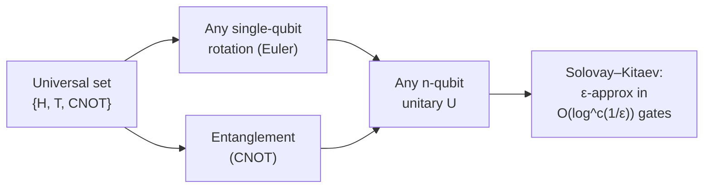
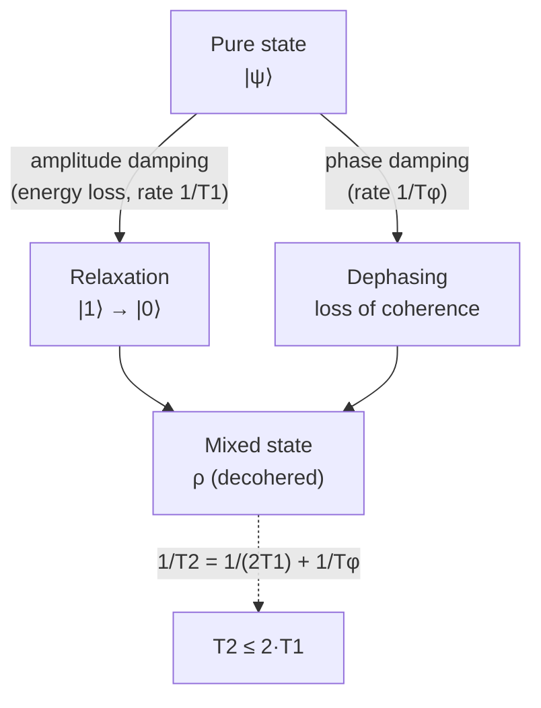

# Quantum Mechanics Foundations for Quantum Computing

> **⭐ PRIMARY FILE.** This is the mathematical bedrock for every later file. It develops the qubit formalism, gates and universality, decoherence and noise, and the key information-theoretic theorems — at the level of detail a hardware or algorithm engineer needs to *reason quantitatively*, not merely recognize the words. Every modality file (3–7), the compilation file (8/12), the algorithms file (13), and the error-correction file (9) assume fluency with the contents here. Notation: |·⟩ denotes a ket (column state vector), ⟨·| a bra (its conjugate transpose), ⟨φ|ψ⟩ an inner product, |ψ⟩⟨φ| an outer product, ⊗ a tensor product, † the conjugate transpose, Tr the trace.

---

## Part I — Qubit Formalism


**The Bloch sphere — geometric picture of a single qubit:**

```text
                 |0>   (north pole, +z)
                  |
                  |     . |psi> = cos(θ/2)|0> + e^{iφ} sin(θ/2)|1>
                  |    /
                  |   /  θ  (polar angle -> amplitude)
                  |  /
                  | /
    -x ___________|/_____________ +x
                 /|
                / |
               /  |   φ (azimuth -> relative phase)
              /   |
           +y     |
                  |
                 |1>   (south pole, -z)
```

*Pure states live on the surface (radius 1); mixed states live inside; the fully
mixed state I/2 sits at the center. Gates are rotations of this sphere.*

### 1. State vectors and Hilbert space

A single qubit's pure state lives in a two-dimensional complex Hilbert space ℋ ≅ ℂ². The computational basis states are

|0⟩ = (1, 0)ᵀ,  |1⟩ = (0, 1)ᵀ,

and a general pure state is a normalized complex superposition

|ψ⟩ = α|0⟩ + β|1⟩,  α, β ∈ ℂ,  |α|² + |β|² = 1.

The coefficients α and β are **probability amplitudes**: upon measurement in the computational basis, the outcome is 0 with probability |α|² and 1 with probability |β|² (the Born rule, Section 9). Normalization |α|² + |β|² = 1 enforces that these probabilities sum to one. The amplitudes are complex, and it is the *phase* relationships between amplitudes — not just their magnitudes — that distinguish quantum from classical probability and enable interference, the engine of all quantum speedups.

A subtle but important point: the overall (global) phase of a state vector is physically unobservable. The states |ψ⟩ and e^{iγ}|ψ⟩ yield identical measurement statistics for *every* possible measurement, so they represent the same physical state. What matters physically are the *relative* phases between basis components. This means the true state space of a single qubit is not all of ℂ² with |α|²+|β|²=1 (which would be a 3-sphere S³ in ℝ⁴), but the quotient by global phase, which is the 2-sphere S² — the Bloch sphere.

### 2. The Bloch sphere

Because a single qubit has two complex amplitudes (four real parameters) subject to normalization (one constraint) and global-phase irrelevance (one more), it has exactly **two real degrees of freedom**. These can be parameterized as two angles, giving the celebrated **Bloch sphere** representation:

|ψ⟩ = cos(θ/2) |0⟩ + e^{iφ} sin(θ/2) |1⟩,  θ ∈ [0, π], φ ∈ [0, 2π).

Here θ is the polar angle and φ the azimuthal angle of a point on the unit sphere. Geometric correspondences:

- The north pole (θ=0) is |0⟩; the south pole (θ=π) is |1⟩.
- Points on the equator (θ=π/2) are equal-magnitude superpositions (|0⟩ + e^{iφ}|1⟩)/√2; for example +x is |+⟩ = (|0⟩+|1⟩)/√2, −x is |−⟩ = (|0⟩−|1⟩)/√2, +y is |+i⟩ = (|0⟩+i|1⟩)/√2.
- **Antipodal points are orthogonal states.** Note that physically orthogonal states (which differ by 90° in Hilbert space) are 180° apart on the Bloch sphere — the factor-of-two (θ/2 in the parameterization) is the signature of the spin-½ / SU(2) structure.

The Bloch vector is **r** = (sin θ cos φ, sin θ sin φ, cos θ), and the state's density matrix (Section 5) is ρ = (I + **r**·**σ**)/2, where **σ** = (X, Y, Z) are the Pauli matrices. Pure states have |**r**| = 1 (surface of the sphere); mixed states have |**r**| < 1 (interior); the maximally mixed state ρ = I/2 sits at the center.

**Single-qubit gates as rotations.** Every single-qubit unitary is, up to global phase, a rotation of the Bloch sphere about some axis **n̂** by some angle. This geometric picture is indispensable for intuition: a Hadamard gate is a 180° rotation about the axis (x+z)/√2; a Z gate is a 180° rotation about z; an R_z(λ) gate is a rotation by λ about z. Hardware control pulses (Files 3, 4, 5, 11) are literally engineered to implement specified Bloch-sphere rotations, and pulse imperfections manifest as over/under-rotations or axis errors.

### 3. Density matrices and mixed states

Pure-state vectors are insufficient to describe realistic qubits, which are entangled with their environment and subject to classical uncertainty. The general description is the **density matrix** (density operator) ρ, a Hermitian, positive-semidefinite operator with unit trace:

ρ = Σᵢ pᵢ |ψᵢ⟩⟨ψᵢ|,  pᵢ ≥ 0, Σᵢ pᵢ = 1.

This represents a *statistical ensemble*: with probability pᵢ the system is in pure state |ψᵢ⟩. Key properties:

- **Hermiticity**: ρ = ρ†.
- **Unit trace**: Tr(ρ) = 1 (probabilities sum to one).
- **Positivity**: ⟨φ|ρ|φ⟩ ≥ 0 for all |φ⟩ (no negative probabilities).

**Pure vs. mixed.** A state is **pure** if ρ = |ψ⟩⟨ψ| for some single |ψ⟩ — equivalently if ρ² = ρ (ρ is a projector) — and **mixed** otherwise. The **purity** is

γ = Tr(ρ²),

which equals 1 for a pure state and 1/d for the maximally mixed state of a d-dimensional system (1/2 for a single qubit). Purity is a basis-independent scalar that quantifies how "spread out" the state is; it decreases under decoherence. The closely related **linear entropy** is S_L = 1 − Tr(ρ²), and the **von Neumann entropy** is S(ρ) = −Tr(ρ log ρ), which vanishes for pure states and equals log d for maximally mixed states.

**Why density matrices are essential.** Three distinct physical situations all require ρ rather than a state vector: (1) *classical uncertainty* — we prepared one of several states with classical probabilities; (2) *entanglement with an inaccessible environment* — the reduced state of a subsystem of a larger entangled pure state is generally mixed (Section 4, 7); (3) *decoherence* — the dynamical process by which (2) arises over time, turning pure states into mixed ones (Part III). A transmon qubit coupled to lossy two-level-system defects, or a trapped ion whose motional mode is thermally excited, must be described by a density matrix. The entire theory of noise channels (Section 11) and error correction (File 9) is formulated in terms of density matrices.

**Bloch-ball geometry of mixed states.** For a single qubit, ρ = (I + **r**·**σ**)/2 with |**r**| ≤ 1. The eigenvalues of ρ are (1 ± |**r**|)/2, so purity is γ = (1 + |**r**|²)/2. Decoherence shrinks |**r**| toward 0 (T₁, T₂ processes literally contract the Bloch vector toward the center or the z-axis; Section 10).

### 4. Multi-qubit systems and tensor products

The state space of *n* qubits is the tensor product of *n* single-qubit spaces:

ℋ_n = ℂ² ⊗ ℂ² ⊗ ⋯ ⊗ ℂ² = ℂ^{2ⁿ}.

The dimension is **2ⁿ** — exponential in the number of qubits. The computational basis states are labeled by *n*-bit strings: |x₁x₂…xₙ⟩ = |x₁⟩ ⊗ |x₂⟩ ⊗ ⋯ ⊗ |xₙ⟩, and a general *n*-qubit pure state is

|ψ⟩ = Σ_{x ∈ {0,1}ⁿ} c_x |x⟩,  Σ_x |c_x|² = 1,

a superposition over all 2ⁿ basis strings, requiring 2ⁿ complex amplitudes to specify. For *n*=300 qubits, 2³⁰⁰ exceeds the number of atoms in the observable universe — this is the *source of quantum computational power* (a 300-qubit register can be in a superposition over more configurations than there are atoms in the universe) and *simultaneously the source of classical simulation difficulty* (storing the state vector on a classical computer requires 2ⁿ complex numbers; ~50 qubits already exhausts the memory of the largest supercomputers, File 14).

**Tensor product mechanics.** For operators, (A ⊗ B)(|ψ⟩ ⊗ |φ⟩) = (A|ψ⟩) ⊗ (B|φ⟩). A gate acting on qubit *k* of an *n*-qubit register is I ⊗ ⋯ ⊗ G ⊗ ⋯ ⊗ I (G in the *k*-th slot). The Kronecker product gives the explicit matrix: e.g., for two qubits, X ⊗ I is a 4×4 matrix flipping the first qubit.

A crucial conceptual point: **not every multi-qubit state is a product of single-qubit states.** States that *can* be written |ψ₁⟩ ⊗ |ψ₂⟩ ⊗ ⋯ are called **product** (separable, for pure states) states; the rest are **entangled**. The exponential gap between the dimension of ℋ_n (2ⁿ) and the dimension of the manifold of product states (~2n) is precisely the room in which entanglement lives.

### 5. Entanglement

**Definition.** A pure bipartite state |ψ⟩_AB is **entangled** if it cannot be written as a product |ψ⟩_A ⊗ |φ⟩_B. For mixed states, ρ_AB is **separable** if it can be written as a convex combination of product states Σ_i p_i ρ_A^{(i)} ⊗ ρ_B^{(i)}, and entangled otherwise.

**Bell states.** The four maximally entangled two-qubit states (the Bell basis):

- |Φ⁺⟩ = (|00⟩ + |11⟩)/√2
- |Φ⁻⟩ = (|00⟩ − |11⟩)/√2
- |Ψ⁺⟩ = (|01⟩ + |10⟩)/√2
- |Ψ⁻⟩ = (|01⟩ − |10⟩)/√2 (the singlet, the unique rotationally invariant two-qubit state)

For |Φ⁺⟩, measuring either qubit yields 0 or 1 with probability ½, but the two outcomes are *perfectly correlated*: if Alice measures 0, Bob is guaranteed 0. No product state reproduces these correlations. Bell states are generated in circuits by a Hadamard followed by a CNOT (Section 8), and they are the fundamental resource for teleportation, superdense coding, entanglement-based QKD (File 15), and lattice surgery in error correction (File 9).

**Schmidt decomposition.** Any pure bipartite state can be written, after appropriate local basis choices, as

|ψ⟩_AB = Σ_k λ_k |u_k⟩_A ⊗ |v_k⟩_B,  λ_k ≥ 0, Σ_k λ_k² = 1,

with orthonormal Schmidt bases {|u_k⟩}, {|v_k⟩}. The number of nonzero λ_k is the **Schmidt rank**; rank 1 means product (unentangled), rank >1 means entangled. The Schmidt coefficients are the singular values of the coefficient matrix c_{ij} (where |ψ⟩ = Σ c_{ij}|i⟩|j⟩) and are the square roots of the eigenvalues of the reduced density matrix ρ_A = Tr_B(|ψ⟩⟨ψ|).

**Reduced density matrices and the partial trace.** Given a joint state ρ_AB, the state of subsystem A alone is obtained by **partial trace** over B: ρ_A = Tr_B(ρ_AB). For an entangled pure state, ρ_A is *mixed* even though the global state is pure — this is the formal statement that "the part is uncertain even when the whole is fully known," and it is the mechanism by which decoherence (entanglement with an environment) produces mixedness (Part III).

**Entanglement entropy.** The **entanglement entropy** of a pure bipartite state is the von Neumann entropy of either reduced state, E = S(ρ_A) = −Σ_k λ_k² log λ_k². It is 0 for product states and log d (maximal) for maximally entangled states. Entanglement entropy is central to tensor-network classical simulation (File 14): circuits that generate only limited entanglement (bounded Schmidt rank across any cut) are efficiently simulable by matrix product states, whereas high-entanglement circuits defeat such methods — the entanglement structure literally determines classical hardness.

**Non-separability and the CHSH inequality.** That entangled correlations cannot be reproduced by any *local hidden variable* (classical) theory is the content of **Bell's theorem**. The experimentally testable form is the **CHSH inequality** (Clauser–Horne–Shimony–Holt). Define correlators E(a,b) = ⟨A_a B_b⟩ for measurement settings a, b ∈ {0,1} on the two parties, with outcomes ±1. The CHSH quantity is

S = E(a₀,b₀) + E(a₀,b₁) + E(a₁,b₀) − E(a₁,b₁).

Any local hidden-variable theory obeys |S| ≤ 2. Quantum mechanics, for an appropriate entangled state and measurement angles, achieves |S| = 2√2 ≈ 2.828 — the **Tsirelson bound**. Loophole-free Bell tests (Hensen et al. 2015 with NV centers; Giustina et al. and Shalm et al. 2015 with photons) confirmed the violation, ruling out local realism. For an engineer, the CHSH test is also a practical *entanglement witness and benchmark*: measuring S > 2 certifies genuine entanglement was produced by the hardware.

**No superluminal signaling.** Despite the "spooky action," entanglement cannot transmit information faster than light. The **no-communication theorem** guarantees that local operations on subsystem A cannot change the *measurement statistics* of subsystem B (the reduced state ρ_B is unaffected by any operation Alice performs on A alone). The correlations are only revealed when the two parties compare results via a classical channel. This is a non-negotiable consistency condition with relativity and underlies why QKD security arguments (File 15) never imply FTL communication.

---

## Part II — Quantum Gates and Universality


**From a universal gate set to any unitary:**



| Gate | Matrix action | Role |
|------|---------------|------|
| X, Y, Z | Pauli rotations by π | bit/phase flips |
| H | \|0⟩→(\|0⟩+\|1⟩)/√2 | basis change |
| S, T | phase π/2, π/4 | non-Clifford (T = magic) |
| CNOT | flips target if control=1 | entangling |

### 6. Single-qubit gates

A single-qubit gate is a 2×2 **unitary** matrix U (U†U = I), preserving normalization. The most important gates:

**Pauli gates** (the Pauli group generators):

- X = [[0,1],[1,0]] — bit flip; X|0⟩=|1⟩, X|1⟩=|0⟩. A 180° rotation about the x-axis (up to phase).
- Y = [[0,−i],[i,0]] — bit-and-phase flip; Y = iXZ.
- Z = [[1,0],[0,−1]] — phase flip; Z|0⟩=|0⟩, Z|1⟩=−|1⟩. A 180° rotation about z.
- I = [[1,0],[0,1]] — identity.

The Paulis are Hermitian, unitary, square to the identity (X²=Y²=Z²=I), anticommute pairwise ({X,Y}=0 etc.), and satisfy XY=iZ (cyclic). They form a basis for all 2×2 Hermitian matrices, so any single-qubit Hamiltonian and any single-qubit density matrix can be expanded in {I, X, Y, Z}. The Pauli group on *n* qubits (tensor products of Paulis with phases ±1, ±i) is the backbone of the stabilizer formalism (File 9).

**Hadamard**: H = (1/√2)[[1,1],[1,−1]]. It maps Z-basis to X-basis: H|0⟩=|+⟩, H|1⟩=|−⟩, and is its own inverse (H²=I). The Hadamard creates superposition from a basis state and is the first gate in nearly every algorithm (it builds the uniform superposition Σ_x|x⟩/√(2ⁿ) when applied to all qubits of |0…0⟩). Geometrically a 180° rotation about (x̂+ẑ)/√2.

**Phase gates**: S = [[1,0],[0,i]] (= √Z, a 90° rotation about z) and T = [[1,0],[0,e^{iπ/4}]] (= √S, a 45° rotation about z). The T gate is the crucial **non-Clifford** resource (Section 7). S = T².

**Rotation gates**: continuous rotations about the three axes,

- R_x(θ) = exp(−iθX/2) = cos(θ/2) I − i sin(θ/2) X,
- R_y(θ) = exp(−iθY/2) = cos(θ/2) I − i sin(θ/2) Y,
- R_z(θ) = exp(−iθZ/2) = diag(e^{−iθ/2}, e^{+iθ/2}).

These are the *native* parameterized gates of most hardware: a calibrated microwave or laser pulse of controlled amplitude, phase, and duration implements a rotation of chosen axis and angle (Files 3, 4, 11). Variational algorithms (File 13) tune the angles θ as their optimization parameters.

**Euler-angle (Z–Y–Z) decomposition.** Any single-qubit unitary U ∈ U(2) can be written, up to a global phase e^{iα}, as a product of three rotations:

U = e^{iα} R_z(β) R_y(γ) R_z(δ).

Equivalently a Z–X–Z decomposition exists. This is the basic *synthesis* result that lets a compiler express an arbitrary requested single-qubit operation in terms of the hardware's rotation primitives. On hardware where R_z is "virtual" (implemented by a frame change / phase bookkeeping at zero cost and zero error, as in superconducting systems), the Z–Y–Z form is especially efficient: only the R_y rotations consume physical pulse time.

### 7. Two-qubit gates and entangling power

Single-qubit gates alone can never create entanglement — they map product states to product states. **Entangling two-qubit gates** are therefore essential for universality. The standard ones:

- **CNOT (controlled-X)**: flips the target qubit iff the control is |1⟩. Matrix (control = first qubit): diag-block [[I, 0],[0, X]] = [[1,0,0,0],[0,1,0,0],[0,0,0,1],[0,0,1,0]]. CNOT|x,y⟩ = |x, x⊕y⟩. Applied to |+⟩|0⟩ it produces the Bell state |Φ⁺⟩.
- **CZ (controlled-Z)**: applies a Z to the target iff control is |1⟩; symmetric in the two qubits, CZ = diag(1,1,1,−1). Related to CNOT by Hadamards on the target: CNOT = (I⊗H) CZ (I⊗H).
- **SWAP**: exchanges the two qubits, SWAP|x,y⟩ = |y,x⟩. SWAP = three CNOTs. Not entangling by itself, but central to *routing* on limited-connectivity hardware (File 8).
- **iSWAP**: like SWAP but with an i phase on the swapped |01⟩↔|10⟩ amplitudes; a natural gate for capacitively/inductively coupled superconducting qubits and a "half" version √iSWAP is directly native to some hardware.

**Entangling power** quantifies how much a two-qubit gate can entangle an initially product input, averaged over inputs. CNOT, CZ, iSWAP are *maximally* entangling (a single application can produce a Bell state); √iSWAP is "half" entangling (two applications needed for maximal entanglement). The **KAK (Cartan) decomposition** shows any two-qubit unitary is, up to single-qubit gates, characterized by three "interaction" parameters and can be realized with at most three CNOTs (or three √iSWAPs) — the basis for optimal two-qubit synthesis in compilers (File 12).

**Native gates differ by modality** — a recurring theme:

- **Superconducting**: CZ (via tunable couplers, Google) or the cross-resonance ZX interaction → CNOT (IBM fixed-frequency), and parametric iSWAP-family gates (File 3).
- **Trapped ion**: the **Mølmer–Sørensen (MS)** gate, generating an XX (Ising) interaction via the shared motional mode (File 4).
- **Neutral atom**: the **Rydberg CZ** gate via the Rydberg blockade (File 5).

A compiler must *transpile* an algorithm's abstract CNOTs/CZs into whatever the target hardware actually supports — a central systems problem (File 8).

### 8. Universal gate sets

A set of gates is **universal** if any unitary on any number of qubits can be approximated to arbitrary precision by a finite circuit of gates from the set. Foundational facts:

- **Single-qubit rotations + any entangling two-qubit gate (e.g., CNOT) are universal.** Any *n*-qubit unitary decomposes into single-qubit gates and CNOTs (though generically with exponentially many gates — universality says it's *possible*, not *efficient*).
- For *fault-tolerant* computation, gates must come from a *discrete* set (continuous rotations cannot be implemented exactly fault-tolerantly). The standard discrete universal set is **Clifford + T**.

**The Clifford group** is generated by {H, S, CNOT}. Clifford gates map Pauli operators to Pauli operators under conjugation (they normalize the Pauli group). They are exactly the gates that can be implemented *transversally* and cheaply in many error-correcting codes (File 9).

**The Gottesman–Knill theorem.** Any circuit consisting *only* of Clifford gates, applied to a computational-basis input and followed by computational-basis measurement, can be **simulated efficiently (in polynomial time) on a classical computer** via the stabilizer formalism (File 14). The profound consequence: **Clifford gates alone cannot provide quantum advantage.** A purely Clifford "quantum computer" is no more powerful than a classical one. Entanglement is necessary but *not sufficient* for quantum speedup — Clifford circuits can produce massive entanglement (Bell states, GHZ states, error-correcting code states are all Clifford-generated) yet remain classically simulable.

**The T gate is the necessary non-Clifford resource.** Adding the T gate (a π/4 phase rotation) to the Clifford group yields a universal set. The "amount of non-Cliffordness" in a circuit — measured by its **T-count** or, more refined, its **magic** (stabilizer Rényi entropy, stabilizer rank) — is what makes a circuit classically hard. This is why fault-tolerant resource estimation (File 18) obsesses over T-count: T gates require expensive **magic state distillation** (File 9), often dominating the total qubit and time budget of a fault-tolerant algorithm.

**The Solovay–Kitaev theorem.** Any single-qubit unitary can be approximated to precision ε using O(log^c(1/ε)) gates from *any* fixed discrete universal single-qubit set (with c ≈ 2–4 depending on the construction; the algorithm is constructive and runs in time polynomial in log(1/ε)). This guarantees that the discreteness of the Clifford+T set costs only a *polylogarithmic* overhead in precision — small enough that fault-tolerant computation remains efficient. Modern optimal synthesis (e.g., the Ross–Selinger algorithm for z-rotations) achieves near-optimal T-counts of ~3 log₂(1/ε) for single-qubit z-rotations, a result with direct resource-estimation impact (File 18).

### 9. Measurement

**The Born rule.** Measuring a qubit in state |ψ⟩ = α|0⟩ + β|1⟩ in the computational basis yields outcome 0 with probability |α|² and 1 with probability |β|². More generally, for a state ρ and a measurement described by an orthogonal projector P_m onto outcome *m*, the probability is p(m) = Tr(P_m ρ), and the post-measurement state is P_m ρ P_m / p(m).

**Projective (von Neumann) measurement.** Defined by a Hermitian observable A = Σ_m a_m P_m with eigenvalues a_m and orthogonal projectors P_m. Measuring A returns eigenvalue a_m with probability Tr(P_m ρ) and projects the state onto the corresponding eigenspace. Measuring in the computational basis is projective measurement of Z (eigenvalues +1 for |0⟩, −1 for |1⟩).

**Measurement collapse and irreversibility.** Measurement is the one *non-unitary*, irreversible operation in quantum mechanics. It destroys superposition: a state α|0⟩+β|1⟩, once measured as 0, becomes |0⟩, and the original amplitudes are unrecoverable. This irreversibility is why quantum algorithms must arrange for the *useful* information to appear in the measurement statistics (typically via interference concentrating amplitude on the right answers, as in Shor and Grover) before any measurement, and why error-correction syndrome measurements (File 9) are carefully designed to extract *error information without measuring the logical data*.

**POVMs (Positive Operator-Valued Measures).** The most general measurement is described by a set of positive operators {E_m} (the POVM elements) with Σ_m E_m = I. The probability of outcome *m* is p(m) = Tr(E_m ρ). POVMs generalize projective measurements (the E_m need not be orthogonal projectors and there can be more outcomes than the Hilbert-space dimension) and arise naturally when measuring a system jointly with an ancilla. They are the right framework for, e.g., unambiguous state discrimination and for modeling realistic detectors.

**Weak and continuous (dispersive) measurement.** In superconducting circuit QED (File 3), the qubit is *not* measured projectively in a single instant. Instead it is **dispersively** coupled to a readout resonator whose frequency shifts by ±χ depending on the qubit state; a probe tone reflected off the resonator accumulates a qubit-state-dependent phase. A *weak*, continuous measurement gradually extracts information, and integrating the signal over the readout time (200–1000 ns) yields a high-fidelity, **quantum non-demolition (QND)** readout — QND meaning the measurement projects onto and *preserves* the Z-eigenstate, so a repeated measurement gives the same result. Weak measurement also enables measurement-based feedback and is the physical basis for continuous quantum error correction research.

---

## Part III — Decoherence and Noise


**How an ideal qubit degrades — the two clocks T1 and T2:**



*T1 (energy relaxation) and T2 (phase coherence) set the budget: a gate of duration
tg is only useful while tg ≪ T2. Everything in error correction exists to beat this clock.*

This is the part an engineer cannot afford to treat lightly: *noise is the adversary the entire field is organized against*. Every modality (Files 3–7), the error-correction theory (File 9), mitigation (File 10), and resource estimation (File 18) is ultimately a response to the contents of this section.

### 10. Open quantum systems and the Lindblad equation

A real qubit is never isolated; it is coupled to an uncontrolled **environment** (bath) with enormously many degrees of freedom — phonons, photons, two-level-system defects, nuclear spins, electromagnetic fluctuations. The qubit+environment evolves unitarily, but tracing out the inaccessible environment yields *non-unitary*, irreversible **dissipative** dynamics for the qubit alone.

Under the standard Born–Markov approximation (weak coupling, short bath correlation time), the qubit density matrix obeys the **Lindblad master equation**:

dρ/dt = −(i/ℏ)[H, ρ] + Σ_k γ_k ( L_k ρ L_k† − ½{L_k† L_k, ρ} ),

where H is the system Hamiltonian (the coherent part, generating the desired gate dynamics), the L_k are **Lindblad (jump) operators** describing decoherence channels, γ_k ≥ 0 their rates, and {·,·} the anticommutator. The first term is reversible Schrödinger evolution; the dissipator (the sum) is the irreversible part that drives pure states toward mixed states. For a single qubit, the canonical jump operators are:

- L = σ₋ = |0⟩⟨1| with rate γ₁ = 1/T₁ — **energy relaxation** (spontaneous emission of energy to the bath, |1⟩→|0⟩).
- L = Z with rate γ_φ/2 — **pure dephasing** (random phase accumulation, no energy exchange).

### 11. T₁, T₂, and the relaxation/dephasing distinction

**T₁ — energy relaxation (amplitude damping) time.** The characteristic time for the excited state population to decay: ⟨1| population ∝ e^{−t/T₁}. Physically, the qubit dumps its excitation energy into the bath (emitting a photon into a lossy mode, exciting a phonon, etc.). On the Bloch sphere, T₁ relaxation contracts the z-component of the Bloch vector toward its thermal value (≈ the north pole at mK temperatures). For superconducting transmons, T₁ is limited by dielectric loss from two-level-system defects, the Purcell effect (decay through the readout resonator), and quasiparticles (Files 3, 23); typical current values 50–300 μs, with research devices >1 ms.

**T₂ — phase coherence (dephasing) time.** The characteristic time over which the *relative phase* between |0⟩ and |1⟩ is preserved — i.e., the decay of the off-diagonal density-matrix elements (the Bloch vector's x,y components). Dephasing arises from low-frequency fluctuations of the qubit frequency (flux noise, charge noise, photon-number fluctuations in the readout cavity).

**The fundamental relation T₂ ≤ 2T₁.** Because energy relaxation *also* destroys phase coherence (when the qubit decays, the phase information is lost too), the total dephasing rate is 1/T₂ = 1/(2T₁) + 1/T_φ, where 1/T_φ is the *pure* dephasing rate. If pure dephasing is negligible (T_φ → ∞), T₂ reaches its ceiling of 2T₁; in practice T₂ is usually well below 2T₁ because pure dephasing dominates.

**The T₂ family** — distinctions that matter experimentally:

- **T₂\*** (free induction decay / Ramsey T₂): measured by a Ramsey experiment (π/2 — wait — π/2). Includes *inhomogeneous broadening* — slow, quasi-static frequency fluctuations and run-to-run drift — so T₂* is typically the *shortest* and most pessimistic measure.
- **T₂ (Hahn echo)**: measured with a refocusing π pulse in the middle (π/2 — wait/2 — π — wait/2 — π/2). The echo pulse *reverses* the phase accumulated from quasi-static noise, canceling slow (low-frequency) dephasing and revealing a longer T₂. The echo isolates the qubit's sensitivity to noise near the echo frequency.
- **T₂ (CPMG)**: a Carr–Purcell–Meiboom–Gill sequence applies *many* refocusing π pulses, filtering out progressively higher-frequency noise and yielding still-longer coherence — the basis of **dynamical decoupling** (Section 13, File 10).

These distinctions are not pedantic: a vendor quoting "T₂ = 200 μs" must specify *which* T₂, since Ramsey, echo, and CPMG values can differ by integer factors, and the relevant figure for a given algorithm depends on the circuit's noise-filtering properties.

### 12. Noise channels and the Kraus representation

The most general (completely-positive, trace-preserving, CPTP) evolution of a density matrix is a **quantum channel** ℰ, expressible in **Kraus (operator-sum) form**:

ℰ(ρ) = Σ_k K_k ρ K_k†,  with Σ_k K_k† K_k = I,

where the K_k are **Kraus operators**. This is the workhorse representation for noise. The key single-qubit channels:

**Depolarizing channel** (the simplest worst-case model): with probability p, replace the state with the maximally mixed state; equivalently apply a random Pauli:

ℰ(ρ) = (1−p) ρ + (p/3)(XρX + YρY + ZρZ).

It is the standard "average error rate" model used in error-correction threshold calculations (File 9) and in randomized benchmarking analysis (Section 14), because its single parameter *p* captures an isotropic, structure-free error.

**Amplitude damping channel** (models T₁ energy loss). Kraus operators:

K₀ = [[1,0],[0,√(1−γ)]],  K₁ = [[0,√γ],[0,0]],

where γ = 1 − e^{−t/T₁} is the decay probability. K₁ is the actual |1⟩→|0⟩ "jump"; K₀ is the no-jump back-action. Amplitude damping is *not* symmetric (it drives toward |0⟩) and is the physically dominant T₁ process. Its asymmetry is exactly what **biased-noise** qubits (cat qubits, File 7) exploit and what generic depolarizing models *fail* to capture.

**Phase damping (dephasing) channel** (models T₂ pure dephasing). Kraus operators K₀ = √(1−λ/2) I, K₁ = √(λ/2) Z (one common parameterization), with λ related to e^{−t/T_φ}. It shrinks the off-diagonal elements (x,y Bloch components) while leaving populations untouched — no energy is lost, only phase. Physically it corresponds to elastic scattering / random frequency wandering.

**General Pauli channel**: ℰ(ρ) = Σ_{P∈{I,X,Y,Z}} p_P P ρ P, a probabilistic mixture of Pauli errors. Pauli channels are the natural "digitized" error model because, remarkably, error correction reduces *any* CPTP error to an effective Pauli error via syndrome measurement (the "digitization of errors," File 9). Twirling techniques (randomized compiling, Pauli twirling) deliberately convert realistic coherent noise into Pauli channels to make it correctable and benchmarkable.

**Measuring the channels.** T₁ is measured by preparing |1⟩ and watching exponential population decay; T₂* by Ramsey fringes; T₂ by Hahn echo; CPMG for the noise spectrum. Full **quantum process tomography** reconstructs the entire channel (all Kraus operators / the χ-matrix) but costs O(4ⁿ) measurement settings for *n* qubits — intractable beyond ~3 qubits — motivating the scalable benchmarking methods below.

### 13. Crosstalk, leakage, and correlated errors

Real devices violate the convenient assumption that each qubit experiences independent, Markovian noise. The deviations are where much of the engineering difficulty lives:

- **ZZ crosstalk** (superconducting): an always-on residual ZZ coupling between neighboring transmons causes each qubit's frequency to depend on its neighbor's state, producing conditional phase errors that accumulate during idle periods and during gates on *other* qubits. Tunable couplers (File 3) are deployed specifically to null this ZZ term.
- **Leakage**: real qubits are not perfect two-level systems. A transmon is a weakly anharmonic oscillator with higher levels |2⟩, |3⟩, … only ~200–300 MHz away (the anharmonicity). Fast or imperfect pulses can drive population *out* of the computational {|0⟩,|1⟩} subspace into |2⟩ — **leakage**. Leakage is especially pernicious for error correction because the leaked state is outside the codespace and is not corrected by standard Pauli-error decoders; it requires dedicated **leakage reduction units (LRUs)** and leakage-aware decoding (File 9). DRAG pulse shaping (Derivative Removal by Adiabatic Gate, File 8) suppresses single-qubit-gate leakage by adding a quadrature component proportional to the pulse derivative.
- **Spectator and correlated errors**: a two-qubit gate on a pair can disturb nearby "spectator" qubits via residual couplings; simultaneously driven gates can interfere. These produce *spatially correlated* errors.
- **Non-Markovian noise**: 1/f flux and charge noise have long correlation times, so the bath "remembers" — the Markov approximation underlying the Lindblad equation fails. Slow drift requires periodic recalibration (File 8).

**Why correlated/non-Markovian noise threatens error correction.** The threshold theorem (File 9) is proven under assumptions of *independent* (or weakly correlated) and *Markovian* errors. Spatially or temporally correlated errors — a cosmic-ray strike causing a burst of correlated qubit errors across a whole chip, ZZ-crosstalk linking neighbors, leakage that persists across cycles — can violate these assumptions and degrade or break the threshold guarantee. This is a central reason that real below-threshold demonstrations (File 9) are harder than the idealized theory suggests, and why characterizing and suppressing *correlated* noise (not just improving average single-gate fidelity) is a frontier concern (File 25).

### 14. Scalable characterization: randomized and cross-entropy benchmarking

Because full process tomography is exponentially expensive and conflates state-prep/measurement (SPAM) errors with gate errors, the field relies on **scalable benchmarking** protocols:

**Randomized benchmarking (RB).** Apply random sequences of Clifford gates of increasing length *m*, ending with the inverting Clifford that should return the system to its initial state, and measure the survival probability. Averaging over random sequences yields an exponential decay F(m) = A·p^m + B, where the **depolarizing parameter** *p* gives the average error per Clifford r = (1−p)(1−1/2ⁿ). RB's great virtues: it is *SPAM-robust* (state-prep and measurement errors fold into the constants A, B, not the decay rate), and its cost scales polynomially, not exponentially. **Interleaved RB** isolates the fidelity of a *specific* gate by interleaving it into the random sequences. **Cycle benchmarking** and **simultaneous RB** extend the idea to characterize crosstalk and parallel-gate fidelities. RB-derived two-qubit gate fidelities (>99%) are the headline numbers quoted across Files 3–7, and (File 22) are arguably the most apples-to-apples cross-vendor comparison available.

**Cross-entropy benchmarking (XEB).** Used in Google's supremacy experiments (Files 1, 14): run random circuits, sample output bitstrings, and compute the cross-entropy between the observed sample distribution and the ideal (classically computed) distribution. The **linear XEB fidelity** F_XEB ≈ ⟨2ⁿ p_ideal(x)⟩ − 1 estimates the probability that the whole circuit ran without error. XEB is the metric in which "quantum supremacy" was quantified — and the metric the classical-simulation rebuttals (File 14) had to match.

---

## Part IV — Key Quantum Information Theorems

### 15. The no-cloning theorem

**Statement.** There is no unitary operation U that copies an arbitrary unknown quantum state: there is no U with U(|ψ⟩ ⊗ |0⟩) = |ψ⟩ ⊗ |ψ⟩ for all |ψ⟩.

**Proof sketch.** Suppose such a U existed for two distinct non-orthogonal states |ψ⟩ and |φ⟩: U(|ψ⟩|0⟩) = |ψ⟩|ψ⟩ and U(|φ⟩|0⟩) = |φ⟩|φ⟩. Taking inner products of the two input equations and the two output equations, unitarity (which preserves inner products) requires ⟨ψ|φ⟩ = ⟨ψ|φ⟩². This forces ⟨ψ|φ⟩ ∈ {0, 1}: the states are either identical or orthogonal. So no *single* device can clone *arbitrary* (in particular, non-orthogonal) states. The root cause is the **linearity** of quantum mechanics: a cloner would have to act nonlinearly on superpositions.

**Implications.**
- **For error correction (File 9):** you cannot protect quantum information by simply copying it three times and majority-voting, as in the classical repetition code. QEC must instead spread information *non-locally* across an entangled codeword via the stabilizer formalism — a far subtler construction that no-cloning makes necessary.
- **For cryptography (File 15):** an eavesdropper cannot copy quantum states in transit without disturbing them, which is exactly what makes eavesdropping *detectable* in QKD (BB84). No-cloning is the physical security foundation of quantum key distribution.

**Related theorems.** The **no-deleting theorem** (the time-reverse: you cannot delete one of two copies of an unknown state into a standard blank), and the **no-broadcasting theorem** (a generalization of no-cloning to mixed states: a set of non-commuting mixed states cannot be broadcast). Together these delimit what is and isn't possible when handling unknown quantum information, and they are why quantum information must be *moved* (e.g., teleported, File 15) rather than copied.

### 16. The Quantum Fourier Transform (QFT)

The QFT is the quantum analogue of the discrete Fourier transform and the engine of the most important exponential-speedup algorithms. On the computational basis of an *n*-qubit register (dimension N = 2ⁿ):

QFT |j⟩ = (1/√N) Σ_{k=0}^{N−1} e^{2πi jk/N} |k⟩.

It transforms a state's amplitudes by a DFT. The crucial fact: although the DFT of a length-N vector classically costs O(N log N) = O(n 2ⁿ) with the FFT, the **QFT can be implemented with only O(n²) quantum gates** (Hadamards and controlled-phase rotations) via a product-form factorization:

QFT |j₁…jₙ⟩ = (1/√N) ⊗_{ℓ=1}^{n} ( |0⟩ + e^{2πi 0.j_{n−ℓ+1}…jₙ} |1⟩ ),

a tensor product of single-qubit states whose phases encode binary fractions of the input. The circuit applies a Hadamard to each qubit followed by controlled-R_k phase rotations conditioned on the lower-significance qubits, then reverses the qubit order. With O(n²) gates the QFT is *exponentially* cheaper than the classical FFT in gate count — though one must remember the output is a quantum state, not a readable list of Fourier coefficients (the amplitudes cannot be directly read out, so the QFT is useful only as a *subroutine* that feeds into interference and measurement, as in Shor's algorithm and phase estimation). Approximate QFT (dropping the smallest phase rotations) reduces the gate count to O(n log n) with negligible error — a useful optimization in resource estimates (File 18).

### 17. Quantum Phase Estimation (QPE)

QPE is the most important *subroutine* in quantum computing, underpinning Shor's algorithm, HHL, and quantum-chemistry ground-state energy estimation. **Problem:** given a unitary U and an eigenstate |u⟩ with U|u⟩ = e^{2πiϕ}|u⟩, estimate the phase ϕ ∈ [0,1).

**Structure.** Use two registers: a *t*-qubit ancilla "counting" register initialized to |0…0⟩ and Hadamard-transformed to a uniform superposition, and the eigenstate register holding |u⟩. Apply *controlled-U^{2^j}* operations (the *j*-th ancilla qubit controls U raised to the 2^j power), which "kicks back" the phase 2^j ϕ onto the *j*-th ancilla via phase kickback. The ancilla register is left in a state whose amplitudes encode ϕ in binary; applying the **inverse QFT** to the ancilla and measuring yields the best *t*-bit estimate of ϕ.

**Precision/ancilla trade-off.** To estimate ϕ to *t* bits of precision with success probability ≥ 1−ε requires t = n + ⌈log(2 + 1/2ε)⌉ ancilla qubits (where *n* is the desired bits of accuracy) and O(2^t) controlled-U applications. The dominant cost is implementing the controlled-U^{2^j}, which for Shor's algorithm is controlled modular exponentiation — the resource bottleneck (File 13, 18).

**Role as a subroutine.** In **Shor's algorithm**, U is modular multiplication and the estimated phase yields the period (File 13). In **quantum chemistry**, U = e^{−iHt} is time evolution under the molecular Hamiltonian, and QPE estimates the eigenvalue (energy) of an approximate ground state — the *fault-tolerant* route to ground-state energy (contrast the NISQ-era VQE, File 13). QPE is a primary consumer of T-gates (through the controlled-U arithmetic) and thus a primary driver of magic-state cost in resource estimates (File 18).

### 18. The Holevo bound

**Statement.** If Alice encodes a classical symbol *x* (drawn with probability p_x) into a quantum state ρ_x and sends it to Bob, the **accessible information** — the maximum mutual information Bob can extract about *x* by any measurement — is bounded by the **Holevo quantity** χ:

I(X:Y) ≤ χ = S(Σ_x p_x ρ_x) − Σ_x p_x S(ρ_x),

where S is the von Neumann entropy. **Consequence:** *n* qubits can carry at most *n* bits of *accessible* classical information (when the ρ_x are pure orthogonal states, χ = n bits; otherwise less). Despite the 2ⁿ-dimensional state space, you cannot *read out* more than *n* classical bits from *n* qubits.

**Relevance.** The Holevo bound is a crucial reality check against naïve "exponential information storage" claims: a quantum state's exponentially many amplitudes are *not* exponentially many readable bits. This is why algorithms whose output is "a quantum state encoding the answer" (e.g., HHL, File 13) deliver advantage only when one needs a *summary statistic* (an expectation value, a sample), not the full exponential output. It also sets the ultimate capacity limits for quantum communication channels (File 15) and clarifies why quantum advantage comes from *interference structuring which few bits you read*, not from reading exponentially many.

---

## Synthesis: How These Foundations Propagate Through the Database

- The **Bloch sphere and rotation gates** (Sections 2, 6) are realized as physical control pulses in Files 3 (superconducting microwave drives), 4 (trapped-ion lasers/microwaves), 5 (Rydberg lasers), and 8/11 (pulse-level control).
- **Density matrices and noise channels** (Sections 3, 10–14) are the language of every fidelity number, every coherence time, and every error budget in Files 3–7, and the input assumptions to error correction (File 9) and resource estimation (File 18).
- **Universality and the Clifford+T / Gottesman–Knill divide** (Section 8) determine what is classically simulable (File 14), what makes a circuit "hard," and why T-count dominates fault-tolerant cost (Files 9, 18).
- **No-cloning** (Section 15) forces the entire architecture of quantum error correction (File 9) and underwrites QKD security (File 15).
- **QFT and QPE** (Sections 16–17) are the subroutines that give Shor's algorithm its exponential speedup (File 13) and ground-state estimation its fault-tolerant route.
- **Entanglement entropy** (Section 5) sets the boundary of efficient tensor-network classical simulation (File 14), and the **Holevo bound** (Section 18) disciplines claims about quantum information capacity throughout.

An engineer who internalizes Parts I–IV can read any later file and immediately situate its claims — a fidelity number as a noise-channel parameter, a gate as a Bloch rotation, an algorithm as an interference pattern over a 2ⁿ-dimensional amplitude vector, and an error-correction scheme as a stabilizer-formalism response to the no-cloning theorem.

---

*Cross-references: superconducting qubit physics and dispersive readout (File 3); trapped-ion MS gates and motional modes (File 4); Rydberg blockade gates (File 5); the stabilizer formalism and error digitization (File 9); Clifford-circuit and tensor-network classical simulation (File 14); QFT/QPE-based algorithms and complexity (File 13); T-count-driven resource estimation (File 18); benchmarking metrics built on RB/XEB (File 22).*

---

## Part V — Worked Examples, Extended Derivations, and Additional Primitives

The preceding parts established the formalism; this part exercises it with explicit calculations and extends it with the additional primitives (teleportation, superdense coding, the rotating frame, Hamiltonian engineering, entanglement measures, and the stabilizer preview) that an engineer meets in practice. The goal is to make the symbols *compute*, not merely parse.

### 19. Worked example: generating and verifying a Bell state

Start from |00⟩ and apply a Hadamard to qubit 0, then a CNOT with qubit 0 as control:

1. Initial: |00⟩ = (1,0,0,0)ᵀ in the basis order {|00⟩,|01⟩,|10⟩,|11⟩}.
2. Apply H⊗I to qubit 0: H|0⟩ = (|0⟩+|1⟩)/√2, so the state becomes (|00⟩ + |10⟩)/√2.
3. Apply CNOT (control 0, target 1): the |10⟩ term flips its target → |11⟩, while |00⟩ is unchanged. Result: (|00⟩ + |11⟩)/√2 = |Φ⁺⟩.

**Density matrix and reduced state.** ρ = |Φ⁺⟩⟨Φ⁺| = ½(|00⟩⟨00| + |00⟩⟨11| + |11⟩⟨00| + |11⟩⟨11|). Tracing out qubit 1: ρ₀ = Tr₁(ρ) = ½(|0⟩⟨0| + |1⟩⟨1|) = I/2 — the **maximally mixed** single-qubit state, with Bloch vector **r** = 0 and purity ½. This explicitly demonstrates the central lesson of Section 5: the global state is pure (purity Tr(ρ²)=1) yet each *part* is maximally mixed (purity ½). The "missing" information resides entirely in the correlations.

**Verification by CHSH.** To certify this entanglement on hardware, measure the four correlators E(a,b) with Alice's settings a₀ = Z, a₁ = X and Bob's settings b₀ = (Z+X)/√2, b₁ = (Z−X)/√2. For |Φ⁺⟩ each correlator equals ±1/√2, and S = 2√2, saturating Tsirelson's bound. A measured S above 2 (after accounting for statistical error bars) certifies genuine entanglement; a value pulled below 2√2 toward 2 quantifies the decoherence and gate infidelity in the preparation.

### 20. Worked example: the three-qubit QFT circuit

For n=3 (N=8), the QFT maps |j⟩ → (1/√8) Σ_k e^{2πi jk/8} |k⟩. The circuit, in terms of the product form of Section 16:

- Hadamard on q₂ (most significant), then controlled-S (R₂ = phase π/2) from q₁, then controlled-T (R₃ = phase π/4) from q₀.
- Hadamard on q₁, then controlled-S from q₀.
- Hadamard on q₀.
- Finally swap q₀ ↔ q₂ to reverse bit order.

Gate count: 3 Hadamards + 3 controlled-phase gates + 1 swap. In general the QFT on n qubits uses n Hadamards and n(n−1)/2 controlled-phase rotations — the O(n²) scaling of Section 16. The smallest controlled-phase rotations (angle π/2^{k}) contribute negligibly when 2^{−k} is below the algorithm's precision target; dropping them yields the **approximate QFT** with O(n log n) gates and an error bounded by the omitted phases — a standard resource-estimation optimization (File 18). Note that controlled-phase rotations with tiny angles are extremely expensive to synthesize fault-tolerantly (each non-Clifford rotation costs ~3 log(1/ε) T gates via Ross–Selinger), so the approximate QFT's reduction in *small-angle* rotations is doubly valuable in the fault-tolerant setting.

### 21. Quantum teleportation as an information-handling primitive

No-cloning forbids copying an unknown state, but it does **not** forbid *moving* one. **Quantum teleportation** transfers an unknown qubit state |ψ⟩ = α|0⟩+β|1⟩ from Alice to Bob using one shared Bell pair and two classical bits. Protocol:

1. Alice and Bob pre-share |Φ⁺⟩_{AB}.
2. Alice performs a Bell-basis measurement on her unknown qubit and her half of the pair (implemented as CNOT then Hadamard, then computational-basis measurement), obtaining two classical bits (m₁, m₂).
3. Alice sends (m₁, m₂) to Bob over a classical channel.
4. Bob applies a correction X^{m₂} Z^{m₁} to his qubit, recovering |ψ⟩ exactly.

The unknown state is destroyed at Alice's side (consistent with no-cloning — only one copy ever exists) and reconstructed at Bob's. Teleportation is not science fiction transport; it is a *protocol*, and it is foundational for three reasons relevant to this database: (a) it is the mechanism of **quantum repeaters and entanglement swapping** (File 15); (b) **gate teleportation** is how non-transversal gates (notably the T gate) are injected fault-tolerantly in many error-correcting architectures (File 9 — magic-state injection is gate teleportation); (c) it demonstrates the interchangeability of entanglement + classical communication with quantum communication, a resource-theoretic equivalence underlying distributed quantum computing (File 15).

### 22. Superdense coding: the dual primitive

Teleportation sends one qubit using one ebit (Bell pair) + two classical bits. **Superdense coding** is the dual: it sends *two classical bits* using one ebit + the transmission of *one qubit*. Alice, holding half of a shared |Φ⁺⟩, applies one of {I, X, Z, XZ} to her qubit to rotate the pair into one of the four orthogonal Bell states, then sends her single qubit to Bob, who performs a Bell measurement to read off two bits. Together, teleportation and superdense coding establish the exchange rate between qubits, ebits, and classical bits — the foundational "currency" of quantum information theory and a useful sanity check (consistent with the Holevo bound, Section 18: Bob extracts two classical bits, matching the two qubits — his original half plus the one Alice sent — that he ultimately holds).

### 23. The rotating frame and how gates are actually driven

A physical qubit (transmon, ion, atom) has a large bare energy splitting ℏω₀ (GHz scale for superconducting, optical or hyperfine for ions/atoms). Control is applied by a near-resonant drive at frequency ω_d. The lab-frame Hamiltonian for a driven qubit is

H = −(ℏω₀/2) Z + ℏΩ(t) cos(ω_d t + φ) X,

where Ω(t) is the (slowly varying) drive amplitude (Rabi frequency) and φ the drive phase. Transforming to the **rotating frame** at the drive frequency and applying the **rotating-wave approximation** (dropping fast-oscillating counter-rotating terms at 2ω_d), the effective Hamiltonian becomes time-independent on resonance:

H_rot ≈ (ℏΔ/2) Z + (ℏΩ/2)(cos φ · X + sin φ · Y),

with detuning Δ = ω₀ − ω_d. On resonance (Δ=0), this generates a rotation about an axis in the x–y plane set by the drive phase φ, by an angle θ = ∫Ω(t) dt (the pulse area). This is precisely how the rotation gates of Section 6 are realized physically: **the rotation axis is controlled by the drive phase, and the rotation angle by the pulse area (amplitude × duration).** A π pulse (area π) implements X (or Y, depending on φ); a π/2 pulse implements √X. The detuning Δ adds a z-rotation, which is why frequency miscalibration produces axis errors. Virtual-Z gates (File 8) exploit the fact that changing φ is equivalent to a frame rotation about z, implementable in software at zero cost. This rotating-frame picture is the bridge from the abstract gates of Part II to the pulse-level control of Files 3, 4, 11.

### 24. Hamiltonian engineering and the origin of two-qubit gates

Two-qubit gates arise from *engineered interactions*. A generic two-qubit interaction Hamiltonian, e.g., an exchange/Ising coupling H_int = ℏJ Z⊗Z (or X⊗X for the MS gate), generates an entangling unitary exp(−iH_int t/ℏ) = exp(−iJt Z⊗Z). For Jt = π/4 this is (up to single-qubit phases) equivalent to a CZ/CNOT. The different modalities engineer different interaction forms:

- **ZZ / cross-resonance (superconducting, IBM):** driving qubit A at qubit B's frequency generates an effective ZX interaction; echo sequences cancel unwanted IX, ZI terms, leaving a clean ZX → CNOT (File 3).
- **Tunable-coupler ZZ (superconducting, Google):** a flux-tunable coupler brings |11⟩ and |02⟩ into near-resonance, accumulating a conditional phase → CZ (File 3).
- **XX Ising (trapped-ion MS gate):** a bichromatic laser couples the qubits' spins through a shared motional mode, generating exp(−iχ XX) (File 4).
- **Rydberg blockade (neutral atom):** conditional excitation produces a controlled phase → CZ (File 5).

The unifying lesson: a two-qubit gate is the time-integral of an engineered coupling Hamiltonian, and gate fidelity is limited by how cleanly that coupling can be turned on, held, and turned off without leaking to unwanted states or coupling to spectators (Section 13).

### 25. Quantitative coherence budgeting: a worked error model

Consider a superconducting qubit with T₁ = 100 μs, T₂ (echo) = 120 μs, a single-qubit gate time t₁q = 25 ns, and a two-qubit gate time t₂q = 300 ns. Estimate the *coherence-limited* gate error (the error floor set purely by decoherence, before adding control errors):

- The decoherence error per gate scales roughly as ε ≈ (t_gate)/T_φ-effective. For a two-qubit gate, a common rule of thumb is ε₂q ≈ (1 − e^{−t₂q/T₁})·(weight) + (1 − e^{−t₂q/T₂})·(weight) ≈ t₂q (1/(2T₁) + 1/(2T₂)) for small ratios.
- Numerically: t₂q/(2T₁) = 300 ns / 200 μs = 1.5×10⁻³; t₂q/(2T₂) = 300 ns / 240 μs = 1.25×10⁻³. Summed and weighted over the two qubits gives a coherence-limited error of order a few ×10⁻³ — i.e., a fidelity ceiling around 99.5–99.7%, *consistent with the best reported superconducting two-qubit fidelities* (File 3). This is why pushing T₁/T₂ upward (materials work, File 23) and gate times downward (faster couplers, File 3) both directly raise the fidelity ceiling, and why a 10× improvement in coherence is worth more than a 10× increase in qubit count for crossing error-correction thresholds (File 18).

The same arithmetic for a trapped ion with T₂ > 1 s and t₂q ≈ 100 μs gives a coherence-limited error of ~10⁻⁴ or below — explaining (Section of File 4) why ions hold the gate-fidelity records: their T₂/t_gate ratio (the DiVincenzo figure of merit, File 1) is enormous even though absolute gate speed is slow. The architecture-level trade-off — fast gates with short coherence (superconducting) vs. slow gates with long coherence (ions) — nets out to comparable *operations-before-decoherence*, which is the quantity that actually matters.

### 26. Noise spectroscopy and the filter-function picture

The CPMG/dynamical-decoupling distinction (Section 11) is made precise by the **filter-function formalism**. A pulse sequence acts as a band-pass filter F(ω) on the environmental noise power spectral density S(ω); the coherence decay is

χ(t) = (1/π) ∫₀^∞ S(ω) F(ω)/ω² dω,  with coherence ∝ e^{−χ(t)}.

- **Ramsey (free evolution)** has a filter function peaked at ω→0, so it is maximally sensitive to low-frequency (quasi-static) noise — hence the short T₂*.
- **Hahn echo** places a notch at ω=0, suppressing DC noise and pushing the filter's peak to ω ≈ π/t — hence the longer echo-T₂.
- **CPMG with N pulses** sharpens and shifts the passband to higher frequency (ω ≈ Nπ/t), filtering out an ever-wider band of low-frequency noise — hence the further-extended coherence.

By varying the inter-pulse spacing and inverting this relation, one *measures the noise spectrum S(ω)* — **noise spectroscopy** — which feeds directly into materials and control engineering (Files 11, 23): if S(ω) is dominated by a 1/f tail, the cure is reducing flux/charge noise sources; if by a peak at a TLS frequency, the cure is materials/fabrication changes. This is the quantitative engine behind "improving coherence," turning a vague goal into a measured spectrum with identifiable culprits.

### 27. Entanglement measures beyond entropy

For *pure* bipartite states, entanglement entropy (Section 5) fully quantifies entanglement. For *mixed* states and multipartite systems, several inequivalent measures are used:

- **Concurrence** (Wootters): a closed-form entanglement measure for two-qubit mixed states, C(ρ) = max(0, λ₁−λ₂−λ₃−λ₄) where λᵢ are sorted eigenvalues of a specific matrix built from ρ and (Y⊗Y)ρ*(Y⊗Y). The **entanglement of formation** is a monotonic function of concurrence. Useful because it is computable in closed form for any two-qubit ρ, making it a practical experimental witness.
- **Negativity / logarithmic negativity**: based on the **PPT (positive partial transpose) criterion** — a separable state remains positive under partial transposition, so negative eigenvalues of the partial transpose ρ^{T_B} *certify* entanglement (Peres–Horodecki). The negativity sums the absolute values of these negative eigenvalues. PPT is necessary-and-sufficient for separability only in 2×2 and 2×3 systems; in higher dimensions, "bound entangled" PPT states exist (entangled yet undistillable), an important subtlety.
- **Multipartite entanglement**: genuinely many-body entanglement (GHZ vs. W states) is not captured by any single bipartite measure; GHZ states |0…0⟩+|1…1⟩ are maximally fragile (one lost qubit destroys all entanglement) whereas W states are robust — relevant to the choice of logical-state encodings and to characterizing large entangled resource states (File 6's cluster states).

These measures matter operationally: certifying *how much* and *what kind* of entanglement a device produces is a benchmark (File 22) and a prerequisite for trusting that a "quantum" computation is genuinely exploiting quantum resources rather than mimicking a classically simulable (e.g., low-entanglement or Clifford) circuit (File 14).

### 28. Stabilizer formalism preview (full treatment in File 9)

Because so much of practical quantum computing — error correction, Clifford simulation, benchmarking — runs on the **stabilizer formalism**, a preview is warranted here as it ties together Sections 8, 14, and the no-cloning discussion.

A **stabilizer state** of *n* qubits is the simultaneous +1 eigenstate of *n* independent commuting Pauli operators (the **stabilizer generators**), which generate an abelian subgroup *S* of the Pauli group not containing −I. The state is *uniquely determined* by its stabilizer group. Examples: |0⟩ is stabilized by Z; |+⟩ by X; the Bell state |Φ⁺⟩ by {XX, ZZ}; the GHZ state by {XXX, ZZI, IZZ}.

Key facts that recur throughout the database:

- **Compact description.** An *n*-qubit stabilizer state is specified by *n* generators, each a Pauli string of *n* symbols + a sign — O(n²) bits total, versus 2ⁿ amplitudes. This compression is exactly why **Clifford circuits are efficiently classically simulable** (Gottesman–Knill, Sections 8 and File 14): Clifford gates map stabilizer generators to stabilizer generators, so one tracks O(n²) data through the circuit instead of an exponential amplitude vector.
- **Error correction.** A stabilizer *code* fixes a subgroup of stabilizers and uses the remaining freedom to encode logical qubits; **syndrome measurement** measures the stabilizer generators to detect errors *without* measuring (and hence without collapsing) the logical information — the resolution to the tension that no-cloning (Section 15) creates for error correction (File 9 develops this fully).
- **Error digitization.** Because the Pauli group spans all single-qubit operators, measuring stabilizers projects an arbitrary continuous error onto a *discrete* Pauli error, which the code then corrects — turning the continuum of possible physical errors into a finite, correctable set (File 9).

This preview closes the loop: the no-cloning theorem (Section 15) makes naive copying impossible, the stabilizer formalism provides the non-cloning-compatible alternative (encode information non-locally, measure error syndromes), and the same formalism delimits the classical-simulability boundary (Section 14). Parts I–V together furnish every concept the rest of the database builds upon.

### 29. Summary of key formulas (quick reference)

- Qubit state: |ψ⟩ = cos(θ/2)|0⟩ + e^{iφ}sin(θ/2)|1⟩; Bloch vector **r** = (sinθcosφ, sinθsinφ, cosθ).
- Density matrix: ρ = (I + **r**·**σ**)/2; purity Tr(ρ²) = (1+|**r**|²)/2.
- Pauli matrices satisfy XY = iZ (cyclic), {Pᵢ,Pⱼ}=2δᵢⱼ I.
- Rotation gates: R_n̂(θ) = cos(θ/2) I − i sin(θ/2)(n̂·**σ**).
- Coherence relations: 1/T₂ = 1/(2T₁) + 1/T_φ, hence T₂ ≤ 2T₁.
- Lindblad equation: dρ/dt = −(i/ℏ)[H,ρ] + Σ_k γ_k(L_k ρ L_k† − ½{L_k†L_k, ρ}).
- Kraus form: ℰ(ρ) = Σ_k K_k ρ K_k†, Σ_k K_k†K_k = I.
- RB decay: F(m) = A p^m + B; average error per Clifford r = (1−p)(1−1/2ⁿ).
- QFT: |j⟩ → (1/√N) Σ_k e^{2πijk/N}|k⟩, O(n²) gates.
- QPE precision: t = n + ⌈log(2+1/2ε)⌉ ancilla qubits for n-bit accuracy at success ≥ 1−ε.
- CHSH bound: classical |S| ≤ 2; quantum (Tsirelson) |S| ≤ 2√2.
- Holevo bound: accessible information ≤ S(Σ p_x ρ_x) − Σ p_x S(ρ_x) ≤ n bits for n qubits.

These are the formulas an engineer returns to constantly; the rest of the database can be read as their physical realization (Files 3–7, 11, 23), algorithmic exploitation (Files 8, 12, 13), protection (Files 9, 10, 18), and commercial/strategic context (Files 19–24).

---

## Part VI — Distance Measures, Pictures of Dynamics, Process Characterization, and Glossary

This final part supplies the quantitative tools used to *compare* quantum states and operations (fidelity, trace distance, diamond norm), the two equivalent "pictures" of time evolution, the formal circuit-model bookkeeping (depth/width/volume), the characterization hierarchy (tomography → GST → RB), and a working glossary. These are the everyday instruments of the experimental and software engineer.

### 30. Comparing states: fidelity and trace distance

Engineers constantly need to quantify "how close" a produced state is to a target, or how much a noise channel degrades a state. Two measures dominate:

**Fidelity.** For a pure target |ψ⟩ and an actual (possibly mixed) state ρ, the fidelity is F = ⟨ψ|ρ|ψ⟩ — the probability of passing a projective test for |ψ⟩. For two general mixed states ρ and σ, the (Uhlmann) fidelity is F(ρ,σ) = (Tr√(√ρ σ √ρ))², ranging from 0 (orthogonal) to 1 (identical). Fidelity is the most-quoted figure of merit for state preparation and gates: "99.9% gate fidelity" means the implemented operation overlaps the ideal at the 0.999 level, averaged over input states (the **average gate fidelity**). The relation between average gate fidelity F_avg and the entanglement fidelity / process fidelity F_pro for a *d*-dimensional system is F_avg = (d·F_pro + 1)/(d + 1), a conversion used constantly when translating RB results (which report F_avg) into error-correction inputs (which want the process/Pauli error).

**Trace distance.** D(ρ,σ) = ½ Tr|ρ−σ| = ½ Σ|eigenvalues of (ρ−σ)|. It has an operational meaning: ½(1 + D) is the maximum probability of correctly distinguishing ρ from σ in a single measurement (the Helstrom bound). Trace distance is a true metric (satisfies the triangle inequality) and is *contractive* under any quantum channel (D(ℰ(ρ),ℰ(σ)) ≤ D(ρ,σ)) — channels can never increase distinguishability, a fact underlying many security and no-signaling arguments. Fidelity and trace distance are related by the Fuchs–van de Graaf inequalities 1−F ≤ D ≤ √(1−F²), so they are qualitatively interchangeable as closeness measures.

**Diamond norm.** To compare *channels* (operations) rather than states, the **diamond-norm distance** ‖ℰ−ℱ‖_◇ gives the worst-case distinguishability of two channels even when they may act on half of an entangled state. The diamond norm is the rigorous figure of merit for the **threshold theorem** (File 9): fault-tolerance proofs bound the logical error in diamond norm. It is harder to estimate experimentally than RB's average fidelity, which is one reason average-fidelity numbers (easy to measure) and worst-case diamond-norm numbers (what the theorems use) can differ — a subtlety when comparing experimental fidelities against theoretical thresholds (File 18).

### 31. Schrödinger vs. Heisenberg pictures

Two mathematically equivalent descriptions of dynamics:

- **Schrödinger picture:** states evolve, operators are fixed. |ψ(t)⟩ = U(t)|ψ(0)⟩, or ρ(t) = U(t)ρ(0)U†(t). This is the default in circuit diagrams (the state flows left to right through gates).
- **Heisenberg picture:** states are fixed, operators evolve. A(t) = U†(t) A U(t). Expectation values agree: ⟨A⟩(t) = ⟨ψ(t)|A|ψ(0)⟩_Schrödinger = ⟨ψ(0)|A(t)|ψ(0)⟩_Heisenberg.

The Heisenberg picture is not a mere curiosity: the **stabilizer formalism** (Section 28, File 9) is fundamentally Heisenberg — it tracks how Pauli *operators* (stabilizers) transform under Clifford gates, which is why it is efficient (O(n²) operators vs. 2ⁿ amplitudes). Error-propagation analysis in fault-tolerant circuits ("how does an X error on qubit 3 propagate through this CNOT network?") is Heisenberg-picture reasoning: conjugate the error operator through the gates and see where it lands. Fluency in switching pictures is essential for reasoning about error correction.

### 32. The circuit model: depth, width, volume, and connectivity

Formal bookkeeping for circuits, used throughout compilation (File 8/12), benchmarking (File 22), and resource estimation (File 18):

- **Width** = number of qubits (including ancillas).
- **Depth** = number of *layers* of gates that must execute sequentially; gates on disjoint qubits in the same layer execute in parallel ("moments" in Cirq's terminology). Depth, not gate count, sets the wall-clock runtime and the decoherence exposure (a qubit idle during deep circuits accumulates dephasing).
- **Gate count / T-count** = total gates / total non-Clifford T gates. T-count is the fault-tolerant cost driver (File 18).
- **Circuit volume** ≈ width × depth, a rough proxy for total computational work and for the "quantum volume" benchmark (File 22).
- **Connectivity graph** = which physical qubit pairs admit a native two-qubit gate. Sparse fixed connectivity (superconducting, degree ≤ 4) forces **SWAP insertion** to route distant logical interactions, inflating depth; all-to-all connectivity (trapped ions within a module) avoids this; reconfigurable connectivity (neutral atoms) sits between (File 8).

The interplay of these quantities is the heart of compilation: a logically shallow circuit can become physically deep after routing on a poorly connected device, and the extra depth (more decoherence + more gates) can erase a NISQ algorithm's hoped-for advantage (Files 8, 17).

### 33. The characterization hierarchy: tomography, GST, RB

A practical ladder of methods for "what is my device actually doing," in increasing scalability and decreasing detail:

- **State tomography:** reconstruct an unknown ρ from measurements in a complete (informationally complete) set of bases. Cost O(4ⁿ) measurement settings; feasible only for ~3 qubits. Gives the full state but conflates SPAM errors.
- **Process tomography (QPT):** reconstruct a channel's full χ-matrix; O(16ⁿ) experiments. Even more expensive; also SPAM-sensitive.
- **Gate Set Tomography (GST):** self-consistently characterizes an entire gate set *and* SPAM simultaneously, without assuming any operation is perfect (it bootstraps from the gate set itself). More rigorous than QPT for extracting true gate error including coherent (systematic) errors, but expensive and complex; used for high-stakes characterization of small gate sets.
- **Randomized benchmarking (RB) and variants** (Section 14): scalable, SPAM-robust, but reports only an *averaged* error rate, hiding the error's structure (coherent vs. stochastic, correlated vs. independent). Cycle benchmarking and simultaneous RB recover some structure (crosstalk).

The engineer's practical workflow uses RB for routine, scalable monitoring (is the device healthy today?), GST for deep-dive debugging of a specific bad gate (is the error coherent — fixable by recalibration — or stochastic — requiring hardware work?), and tomography only for small, well-controlled subsystems. Choosing the right tool for the question is itself a skill (Files 8, 22).

### 34. Coherent vs. stochastic errors — why the distinction is operationally decisive

A 0.1% gate error is not a single kind of thing. Two extremes:

- **Stochastic (incoherent) error:** a random Pauli applied with some probability. Errors add *linearly* — N gates at error p give total error ≈ Np. This is the benign case that error-correction thresholds assume.
- **Coherent (systematic) error:** a small *unitary* over- or under-rotation (e.g., every gate rotates by π+δ instead of π). Coherent errors can add *coherently* — amplitudes, not probabilities, accumulate — so N gates can give error ≈ (Nδ)², which for adversarial alignment grows *quadratically* and is far worse than the stochastic estimate. Worse, coherent errors can conspire across a circuit.

The infidelity reported by RB (∝ δ² per gate for a coherent error) can drastically *understate* the worst-case (diamond-norm) impact of coherent errors in a deep circuit. This is why **randomized compiling / Pauli twirling** (File 10) is valuable: it deliberately converts coherent errors into stochastic Pauli errors (by randomizing the Pauli frame around each gate), trading a worst-case quadratic accumulation for a benign linear one — at no fidelity cost and often improving real algorithm performance. The coherent/stochastic distinction is one of the most practically important and frequently underappreciated points in the whole noise discussion, with direct consequences for whether a device's RB-measured fidelity actually predicts its algorithmic performance (Files 17, 22).

### 35. The quantum–classical boundary, restated

Pulling Parts I–VI together, the boundary between "classically easy" and "quantumly hard" is governed by three intertwined resources:

1. **Entanglement** (Section 5): necessary for speedup, and its *structure* (entanglement entropy across cuts) bounds tensor-network simulation cost (File 14). But entanglement alone is insufficient — Clifford circuits are massively entangled yet classically easy.
2. **Magic / non-Cliffordness** (Section 8): the T-gate resource is what lifts a circuit out of the efficiently-simulable stabilizer class. Quantified by T-count, stabilizer rank, and stabilizer Rényi entropy. The dominant fault-tolerant cost (File 18).
3. **Interference** (Section 1): the constructive/destructive combination of complex amplitudes that concentrates measurement probability onto useful answers (Shor, Grover, File 13). Without structured interference, a quantum state is just an expensive sampling device.

A genuine quantum advantage requires all three: enough entanglement to span an exponential space, enough magic to escape classical stabilizer simulation, and enough interference structure to extract a useful (Holevo-bounded, Section 18) answer. Any "quantum" demonstration lacking one of these is either classically simulable (File 14) or extracting nothing useful — the analytical checklist a skeptical engineer applies to advantage claims (Files 14, 17, 22).

### 36. Working glossary (foundations)

- **Amplitude:** complex coefficient of a basis state; its squared magnitude is a probability (Born rule).
- **Anharmonicity:** the energy difference between the |1⟩→|2⟩ and |0⟩→|1⟩ transitions; nonzero anharmonicity is what lets a multi-level system act as a qubit (File 3).
- **Bloch sphere:** geometric representation of a single-qubit state as a point in/on the unit ball.
- **Clifford gates:** the group {H, S, CNOT}; map Paulis to Paulis; classically simulable alone (Gottesman–Knill).
- **Coherence (T₁, T₂):** energy-relaxation and phase-coherence times; the DiVincenzo figure of merit is T₂/t_gate.
- **Decoherence:** loss of quantum coherence via entanglement with an uncontrolled environment.
- **Density matrix (ρ):** the general state description; required for mixed and open-system states.
- **Diamond norm:** worst-case channel-distinguishability metric; the figure of merit in threshold proofs.
- **Entanglement:** non-separable correlations; necessary (not sufficient) for quantum speedup.
- **Fidelity:** overlap-based closeness measure between states or operations; the standard gate-quality number.
- **Kraus operators:** the operator-sum representation of a quantum channel.
- **Lindblad equation:** the Markovian master equation for open-system (dissipative) qubit dynamics.
- **Magic / T-gate:** the non-Clifford resource enabling universality and classical hardness.
- **No-cloning theorem:** arbitrary unknown states cannot be copied; forces the architecture of QEC.
- **Pauli group:** tensor products of {I,X,Y,Z} with phases; the backbone of the stabilizer formalism.
- **POVM:** the most general measurement formalism.
- **QFT / QPE:** Quantum Fourier Transform and Phase Estimation — the key exponential-speedup subroutines.
- **Randomized benchmarking (RB):** scalable, SPAM-robust gate-fidelity characterization.
- **Stabilizer state/code:** a state/code defined as the +1 eigenspace of commuting Paulis; basis of QEC and Clifford simulation.
- **Trace distance:** metric quantifying single-shot state distinguishability (Helstrom bound).
- **Universal gate set:** a set (e.g., Clifford+T) from which any unitary can be approximated efficiently (Solovay–Kitaev).

This glossary, the formula reference (Section 29), and Parts I–V together constitute the working foundation for the entire database. Every subsequent file can be read as the application of these concepts to a specific physical platform, software layer, algorithm, error-correction scheme, or commercial/strategic question.

---

## Part VII — The Variational Principle, Adiabatic Theorem, POVM Worked Examples, and Symmetries

This appendix develops four further pillars that recur in algorithms (File 13), annealing (File 17), and error correction (File 9): the variational principle (the engine of VQE), the adiabatic theorem (the engine of quantum annealing and a lens on QAOA), explicit POVM constructions, and the role of symmetries and conserved quantities.

### 37. The variational principle

For any Hamiltonian H with ground-state energy E₀, and *any* normalized trial state |ψ(θ)⟩,

E(θ) = ⟨ψ(θ)|H|ψ(θ)⟩ ≥ E₀,

with equality iff |ψ(θ)⟩ is the true ground state. Proof: expand |ψ(θ)⟩ = Σ_k c_k|E_k⟩ in the energy eigenbasis; then E(θ) = Σ_k |c_k|² E_k ≥ E₀ Σ_k |c_k|² = E₀, since each E_k ≥ E₀ and the weights sum to one. This one inequality is the entire theoretical justification for the **Variational Quantum Eigensolver (VQE)** (File 13): parameterize a trial state with a quantum circuit U(θ)|0⟩, measure ⟨H⟩ on the quantum computer, and let a classical optimizer minimize over θ. The minimum found is a rigorous *upper bound* on the ground-state energy — it can never undershoot, so a lower variational energy is unambiguously a better answer. The catch (developed in File 13) is that the *optimization landscape* can be plagued by **barren plateaus** (exponentially vanishing gradients) and local minima, so reaching the true E₀ is not guaranteed; the variational principle guarantees only that whatever you reach is an honest upper bound. The same principle, applied to excited states with orthogonality constraints, yields excited-state VQE variants.

**Measuring ⟨H⟩.** A molecular or model Hamiltonian is written as a sum of Pauli strings H = Σ_a h_a P_a (via Jordan–Wigner or Bravyi–Kitaev mapping, File 13). Since each Pauli expectation ⟨P_a⟩ is measured by rotating into that Pauli's eigenbasis and sampling, ⟨H⟩ = Σ_a h_a ⟨P_a⟩ requires measuring each term — and the number of terms grows as O(n⁴) for electronic-structure Hamiltonians, making *measurement overhead* a dominant practical cost of VQE. Grouping commuting Pauli terms into simultaneously measurable sets is an active optimization (File 13), directly reducing the shot budget.

### 38. The adiabatic theorem and quantum annealing

The **adiabatic theorem** states: if a system begins in the ground state of a time-dependent Hamiltonian H(t) and H(t) is varied *slowly enough*, the system remains in the instantaneous ground state throughout. "Slowly enough" is quantified by the **minimum spectral gap** Δ_min between the ground and first excited states along the path: the required evolution time scales as T ≳ 1/Δ_min² (up to matrix-element factors). This theorem grounds **adiabatic quantum computation (AQC)** and its commercial relative **quantum annealing** (D-Wave, Files 17, 19):

- Initialize in the easily prepared ground state of a simple Hamiltonian H_initial (e.g., a transverse field, ground state = uniform superposition).
- Slowly interpolate H(s) = (1−s)H_initial + s·H_problem, where H_problem (typically an Ising Hamiltonian Σ J_ij Z_i Z_j + Σ h_i Z_i) encodes the optimization problem's cost function as its ground-state energy.
- End in the ground state of H_problem — which is the optimization solution, read out by measuring all qubits.

AQC is **polynomially equivalent** to the gate model (Aharonov et al.) — neither is more powerful — but the *practical* annealing implementations (D-Wave) are restricted (stoquastic Hamiltonians, limited connectivity, finite temperature, no error correction), and whether they deliver genuine advantage over classical simulated annealing or specialized solvers is the **contested** question of File 17. The crucial vulnerability is the gap: many hard problems have an exponentially small Δ_min along the path (a first-order quantum phase transition), forcing exponential runtime and erasing any advantage. QAOA (File 13) can be viewed as a *discretized, finite-depth* relative of adiabatic evolution, inheriting both its intuition and its uncertain advantage status.

### 39. POVM worked examples

POVMs (Section 9) are abstract; two concrete constructions make them tangible.

**Unambiguous state discrimination.** Suppose you are given one of two non-orthogonal states |ψ₀⟩, |ψ₁⟩ and must identify which, with *zero* error allowed but "I don't know" permitted. No projective measurement can do this, but a three-outcome POVM {E₀, E₁, E_?} can: E₀ ∝ |ψ₁^⊥⟩⟨ψ₁^⊥| (fires only on |ψ₀⟩, never on |ψ₁⟩), E₁ ∝ |ψ₀^⊥⟩⟨ψ₀^⊥| (fires only on |ψ₁⟩), and E_? = I − E₀ − E₁ (the inconclusive outcome) absorbs the remaining probability. The price for never being wrong is a nonzero "don't know" rate, lower-bounded by the overlap |⟨ψ₀|ψ₁⟩|. This is exactly the structure exploited in some QKD security analyses (File 15) and in heralded operations.

**SIC-POVMs.** A *symmetric informationally complete* POVM on a qubit consists of four sub-normalized projectors onto states forming a regular tetrahedron inscribed in the Bloch sphere, E_k = ½|φ_k⟩⟨φ_k| with |⟨φ_j|φ_k⟩|² = 1/3 for j≠k. A single such measurement is *informationally complete* — its four outcome probabilities uniquely determine the full density matrix ρ — making SIC-POVMs the theoretically optimal single-setting tomography and a tool in shadow-tomography and randomized-measurement protocols increasingly used for scalable state characterization (File 22).

**Naimark dilation.** Any POVM is realizable as a projective measurement on a larger space: append an ancilla, apply a joint unitary, and measure projectively. This is *how* POVMs are implemented on real hardware — there is no exotic "POVM device," only ancilla + unitary + standard readout. Mid-circuit measurement with ancillas (File 4's Quantinuum capability, File 9's syndrome extraction) is precisely Naimark dilation in practice.

### 40. Symmetries and conserved quantities

Symmetries pervade both the physics and the algorithms:

- **Conservation laws as error checks.** Many physical Hamiltonians conserve particle number, total spin, or parity. When such a Hamiltonian is simulated (File 13), the conserved quantity provides a *free error-detection check*: any measured state violating the symmetry (wrong particle number) signals an error and can be post-selected away — **symmetry verification**, a lightweight error-mitigation technique (File 10).
- **Fermion-to-qubit mappings and symmetry.** The Jordan–Wigner transformation maps fermionic creation/annihilation operators to Pauli strings while preserving anticommutation; the Bravyi–Kitaev transformation does so with only O(log n) Pauli weight per operator (vs. O(n) for Jordan–Wigner), reducing circuit depth — a symmetry-aware encoding choice with direct hardware consequences (File 13).
- **Gauge symmetry and codes.** The stabilizer group of an error-correcting code (Section 28, File 9) is a kind of gauge symmetry: logical operations must commute with (preserve) the stabilizers, and the code's protection is the statement that local errors break the symmetry detectably. Subsystem and gauge codes (File 25) generalize this further.
- **Noether-style thinking in control.** Designing gates and pulse sequences that respect a system's symmetries (e.g., dynamically decoupling sequences that exploit time-reversal symmetry of the noise) yields more robust operations — the filter-function design of Section 26 is symmetry engineering in the time domain.

Symmetry is thus not decorative: it provides error checks (mitigation), efficient encodings (algorithm depth), the structural backbone of codes (correction), and robust control (gates). An engineer who looks first for the conserved quantities of a problem often finds the cheapest path to both efficiency and error resilience.

### 41. Closing note on the role of these foundations

The combined content of Parts I–VII is deliberately more than a glossary: it is the *computational* foundation an engineer uses daily — to convert a fidelity number into a noise-channel parameter and an error budget (Sections 12, 25, 30), to read a control pulse as a Bloch rotation in the rotating frame (Sections 6, 23), to recognize when a circuit is secretly classically simulable (Sections 8, 28, 35), to bound an algorithm's resource cost via its T-count and QPE precision (Sections 8, 17), and to apply the right characterization tool to the right question (Sections 14, 33). The remaining files specialize these foundations to physical platforms (Files 3–7), shared infrastructure (Files 11, 23), the software and algorithmic stack (Files 8, 12, 13, 14), error correction and resource estimation (Files 9, 10, 18, 22), networking and sensing (Files 15, 16), applications (File 17), and the commercial, strategic, and frontier landscape (Files 19–21, 24, 25). Return here whenever a later claim needs to be grounded in first principles.

### 42. A note on units, conventions, and common pitfalls

A few conventions and traps that cause real bugs and miscommunications:

- **Qubit ordering / endianness.** Frameworks disagree on whether |q₀q₁…⟩ lists the most- or least-significant qubit first (Qiskit uses little-endian: the rightmost is q₀; many textbooks use big-endian). A QFT or arithmetic circuit copied between frameworks without fixing endianness silently produces bit-reversed results. Always check the convention before trusting a ported circuit (File 12).
- **Global vs. relative phase.** Simulators report global phases that are physically meaningless for a final state but *crucial* for a sub-circuit that will be controlled on (a controlled-U cares about U's global phase). Many "my circuit is wrong" bugs are spurious global-phase mismatches; many real bugs are dropped *relative* phases.
- **Rotation-angle factor of two.** R_z(θ) = diag(e^{−iθ/2}, e^{+iθ/2}) rotates the Bloch sphere by θ but multiplies amplitudes by θ/2. Confusing the two halves the rotation; this is the single most common single-qubit-gate bug.
- **ħ = 1 conventions.** Theory papers usually set ħ = 1, so energies and frequencies are interchanged freely; experimental papers keep ħ and quote frequencies in Hz. A "detuning of 300 MHz" and an "anharmonicity of 2π×300 MHz" must be reconciled when porting numbers (angular vs. ordinary frequency, a factor of 2π) — another frequent source of order-unity errors in pulse calibration (Files 3, 11).
- **Fidelity definitions.** "99.9% fidelity" may be average gate fidelity, process fidelity, or state fidelity, related but not equal (Section 30). When comparing vendors or feeding a number into a threshold calculation, confirm which fidelity is meant (File 22).

These conventions are not pedantry — they are the difference between a circuit that works and one that fails silently, and they recur in every hands-on file (8, 11, 12, 13). With the formalism of Parts I–VII and these conventions in hand, the reader is equipped to engage the physical-platform and engineering chapters that follow.
