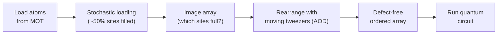
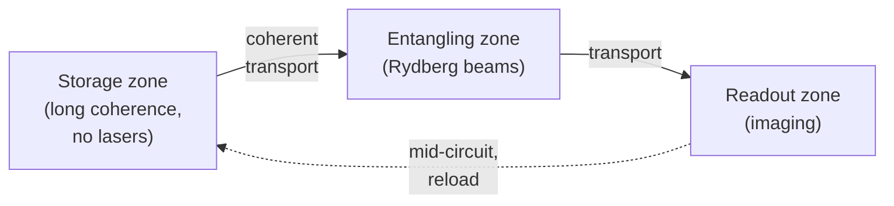

# Neutral Atom Qubits — Optical Tweezers, Rydberg Gates, and Reconfigurable Architectures

> **⭐ PRIMARY FILE.** Neutral-atom quantum computing has, in a few years, gone from a physics curiosity to a front-runner on two axes simultaneously: **raw qubit count** (the largest arrays of any modality, 1000+ atoms) and **reconfigurable connectivity** (atoms physically moved during a computation, enabling flexible, long-range, and highly parallel gate patterns). It is the platform behind the landmark 2023 demonstration of dozens of error-corrected logical qubits. This file develops the optical-tweezer trapping physics, the Rydberg-state interactions and blockade that provide entangling gates, the reconfigurable and zoned architectures, and the named leading systems (QuEra, Pasqal, Atom Computing, Infleqtion) with published specifications. It shares much laser-cooling and optical-control DNA with trapped ions (File 4) and complements Files 9 (neutral-atom QEC), 11 (laser/control infrastructure), and 16 (cold-atom sensing).

---

## Part I — Optical Tweezer Trapping


**Assembling a defect-free atom array with optical tweezers:**



### 1. Why neutral atoms, and why optical (not electromagnetic) trapping

A neutral-atom qubit is a single neutral atom (rubidium, cesium, strontium, or ytterbium) held in vacuum by focused laser light, with quantum information stored in two long-lived internal states. Like trapped ions (File 4), neutral atoms are **identical by nature** — no fabrication variation, no material defects — giving excellent reproducibility and coherence. Unlike ions, neutral atoms **carry no net charge**, which has two profound consequences:

1. They **cannot be trapped by electromagnetic (Paul) traps** — there is no charge for an electric field to grip. Instead they are trapped by the **optical dipole force** (the AC Stark shift from focused laser light). This is why the enabling technology is the **optical tweezer**, not the RF trap.
2. Being neutral, they **do not interact via Coulomb forces** — two ground-state neutral atoms a micron apart barely feel each other. This means there is no always-on interaction (an advantage: no crosstalk, atoms can be packed densely and idle independently) but also **no natural entangling mechanism** — the entangling interaction must be *switched on* by exciting atoms to strongly interacting **Rydberg states** (Part II). The neutral atom's lack of charge is thus simultaneously the reason for optical trapping and the reason for Rydberg-based gates.

### 2. The optical dipole trap

A far-off-resonant laser beam creates a conservative potential for a neutral atom via the **AC Stark shift** (light shift): the oscillating laser field induces an atomic dipole that interacts with the field, shifting the atom's energy by an amount proportional to the local laser intensity. For a laser **red-detuned** from the atomic transition, the light shift is *negative* (attractive), so the atom is drawn toward the region of highest intensity — the focus of a tightly focused beam. A single tightly focused beam (an **optical tweezer**, NA ~ 0.5, waist ~1 μm) thus creates a microscopic trap holding **exactly one atom** at its focus (the "**collisional blockade**" regime — light-assisted collisions eject pairs, so a tweezer holds either zero or one atom, never more). Trap depths are typically ~1 mK (in temperature units), and the atoms are pre-cooled by laser cooling to ~10 μK so they sit near the trap bottom.

The optical dipole potential is U(r) = −(1/2ε₀c)·Re(α)·I(r), where α is the atomic polarizability and I(r) the intensity — the atom sits where I is largest (for red detuning). The trap is conservative (no scattering, since it is far off resonance) except for a small residual photon-scattering rate that must be minimized (it heats and decoheres the atom), driving the choice of large detuning and specific "magic" wavelengths (Section 6).

### 3. Atom species and their qubit encodings

- **⁸⁷Rb (rubidium):** the most common (QuEra, Pasqal). Qubit encoded in two **ground-state hyperfine levels** of the 5S₁/₂ manifold (F=1 and F=2, split ~6.8 GHz), long coherence, driven by microwaves or two-photon Raman transitions. Rydberg excitation via two-photon (420 + 1013 nm) or single-photon UV paths.
- **¹³³Cs (cesium):** similar alkali structure, hyperfine qubit (~9.2 GHz splitting).
- **Alkaline-earth(-like) atoms — ⁸⁸Sr, ¹⁷¹Yb:** these have two valence electrons and a richer level structure enabling **nuclear-spin qubits** (encoding the qubit in the nuclear spin of the ground state, which is extremely well-isolated from the electronic structure and thus exceptionally long-lived and insensitive to magnetic/electric noise). **Atom Computing uses ¹⁷¹Yb nuclear-spin qubits**, reporting coherence times of tens of seconds. Alkaline-earth atoms also offer clock transitions (the same physics as optical lattice clocks, File 16) and convenient readout/cooling schemes. This is a major reason the field is shifting interest toward alkaline-earth species: nuclear-spin qubits combine the neutral-atom scaling advantages with ion-like coherence.

### 4. Spatial light modulators and acousto-optic deflectors

Creating and controlling *arrays* of tweezers is the enabling optical technology:

- A **Spatial Light Modulator (SLM)** — a programmable liquid-crystal or MEMS device that imprints a computed phase pattern on a laser wavefront — generates a *static* array of many tweezers (hundreds to thousands) in an arbitrary 2D (or 3D) geometry by holographic beam-shaping. The SLM sets the *target* trap layout.
- **Acousto-Optic Deflectors (AODs)** — devices that deflect a laser beam by an angle set by an applied RF frequency (the same physics as the AOMs/AODs used in ion traps, File 4) — generate *movable* tweezers whose positions are steered in real time by changing the RF drive. A pair of crossed AODs (x and y) can address and move any position in the plane, and multi-tone RF drives create *multiple* movable tweezers simultaneously.

Together, the SLM (static array) and AODs (movable tweezers) provide the ability to create large arrays *and* to reposition atoms dynamically — the foundation of reconfigurable architectures (Part III).

### 5. Loading and rearrangement into defect-free arrays

A critical practical problem: each tweezer loads an atom only **stochastically**, with ~50–60% probability per trap (the collisional-blockade regime gives 0 or 1 atom, but *whether* a given trap is filled is random). A freshly loaded array is therefore ~half-empty in a random pattern — useless for a computation needing a specific geometry. The **breakthrough** (Barredo/Browaeys and Endres/Lukin, ~2016) is **real-time rearrangement**:

1. Load the array stochastically (~50% filled).
2. **Image** the array (fluorescence, single-shot) to detect which traps are filled.
3. Compute an assignment moving atoms from filled traps to fill a defect-free target sub-array.
4. Use movable AOD tweezers to **physically pick up and move** atoms one by one (or in parallel) from their loaded positions into the target geometry, producing a **defect-free** array.

This rearrangement — sometimes called "atom assembly" or "sorting" — turns a stochastic ~50%-filled array into a deterministic, defect-free array of the desired size and shape, and is now standard across the industry (QuEra, Pasqal). It is what makes large, deterministic neutral-atom arrays possible, and it is *the* reason neutral atoms scale to 1000+ qubits: adding more atoms is primarily a matter of more laser power and larger optical fields of view, not more fabricated control wiring per qubit (contrast superconducting, File 3).

### 6. Array geometries and dimensionality

Because the trap array is defined by *light* (SLM holography) rather than by fabricated structures, neutral-atom arrays offer **arbitrary, reconfigurable geometry**:

- **1D chains, 2D lattices** (square, triangular, kagome, honeycomb), and **fully arbitrary 2D patterns** — not restricted to a fixed lattice (unlike a superconducting chip's fixed wiring). This geometric freedom is invaluable for **analog quantum simulation** (matching the array to the lattice of the model being simulated, Section 13) and for **error-correcting-code layouts** (arranging atoms to match a code's connectivity graph, File 9).
- **3D arrays:** extending tweezers into the third dimension (via SLM holography or stacked trap planes) for higher qubit density — an active research direction (Atom Computing, academic groups) that could pack thousands of atoms compactly.

The combination of arbitrary geometry, dynamic reconfigurability, and stochastic-load-plus-rearrangement is unique to neutral atoms and underlies both their scaling and their architectural flexibility.

---

## Part II — Rydberg State Physics and Entangling Gates


**Rydberg blockade — the mechanism behind neutral-atom entanglement:**

```text
   Two atoms, spacing R:

   |r>  ___                     ___  |r>       Excite BOTH to Rydberg?
        excite                 excite
   |1>  ___    <-- R < R_b -->  ___  |1>       Interaction V(R) ~ C6/R^6
   |0>  ___                     ___  |0>

   If R < blockade radius R_b:  the strong van der Waals shift V(R)
   detunes the doubly-excited state |rr> out of resonance ->
   only ONE atom can be excited = conditional logic = CZ gate.
```

### 7. Rydberg states: exaggerated everything

A **Rydberg state** is an atomic state with a large principal quantum number n (typically n ≈ 50–100), in which the valence electron orbits far from the nucleus. Rydberg atoms have wildly exaggerated properties that scale steeply with n:

- **Orbital radius ∝ n²** — a Rydberg atom is enormous, up to ~μm-scale for high n (thousands of times larger than a ground-state atom).
- **Dipole moment ∝ n²** — huge, because the electron is far from the core.
- **Polarizability ∝ n⁷**, **radiative lifetime ∝ n³** (Rydberg states live ~μs–100 μs, long by atomic standards but far shorter than ground states), and crucially
- **van der Waals interaction coefficient C₆ ∝ n¹¹** — the interaction between two Rydberg atoms scales as an astonishing eleventh power of n.

This last scaling is the key: two ground-state neutral atoms a few μm apart barely interact, but two *Rydberg* atoms at the same separation interact enormously strongly (MHz–GHz interaction energies) because of their giant dipoles. The Rydberg interaction is the **switchable strong interaction** that neutral atoms otherwise lack (Section 1) — turn it on by exciting atoms to a Rydberg state, turn it off by returning them to the ground state.

### 8. The Rydberg blockade

The **Rydberg blockade** is the physical mechanism of neutral-atom entangling gates. Consider two atoms within a **blockade radius** R_b (set by where the van der Waals interaction V(R) = C₆/R⁶ equals the excitation laser's Rabi frequency/linewidth). If one atom is excited to a Rydberg state, the strong Rydberg–Rydberg interaction **shifts the energy** of the second atom's Rydberg transition out of resonance with the excitation laser — so the laser **cannot excite the second atom** while the first is Rydberg. The two atoms are "blockaded": at most one can be in the Rydberg state at a time. This conditional, collective behavior (the pair behaves as an effective two-level system that can hold zero or one Rydberg excitation but not two) is exactly the nonlinearity needed for an entangling gate. The blockade radius is typically ~5–10 μm, comfortably larger than the ~few-μm atom spacing, so nearby atoms blockade each other while distant atoms do not — giving a *distance-dependent* interaction that the array geometry controls.

### 9. Rydberg CZ gate protocols

The **Rydberg CZ gate** uses the blockade to accumulate a conditional phase:

- The **original proposal (Jaksch et al., 2000)** used a sequence of laser pulses addressing the two atoms; the blockade makes the phase accumulated depend on whether both atoms are in the states that can be Rydberg-excited, realizing a controlled-phase (CZ) gate.
- **Modern implementations (Levine et al., 2019, arXiv:1806.04682)** use a **global two-pulse protocol**: a single global laser pulse (addressing both atoms simultaneously) with an optimized phase profile drives the atoms through Rydberg states and back, accumulating exactly the conditional π phase of a CZ when the blockade is active, and returning atoms to the ground state at the end (so the short-lived Rydberg state is only transiently occupied during the ~100 ns–1 μs gate). This global protocol is elegant because it needs no individual addressing for the gate itself — the blockade physics does the conditioning.
- **Fidelity progression:** early demonstrations (2010s) reached ~97–98%; state-of-the-art (2023–2024, Harvard/QuEra, Caltech, and others) reach **>99.5%** two-qubit Rydberg-gate fidelity, rapidly closing the gap with superconducting and trapped-ion benchmarks. Fidelity is limited by Rydberg-state decay during the gate, laser phase/intensity noise, atomic motion (finite temperature causing Doppler and position spread), and imperfect blockade.

### 10. Local addressing vs. global gates — the parallelism advantage

A defining neutral-atom feature is the interplay of **global** and **local** control:

- **Global Rydberg pulses** address *all* atoms in the array simultaneously. Combined with the blockade, a single global pulse can execute entangling gates on *many atom pairs at once* — every pair within a blockade radius entangles in parallel. This **massive parallelism** is unique: one laser pulse performs O(N) gates simultaneously across the array, whereas superconducting and ion systems generally drive gates more locally/sequentially.
- **Local addressing** (via focused, AOD-steered beams applying local light shifts) selects *which* atoms participate in a given global operation — e.g., shifting some atoms out of resonance so they don't respond to the global pulse, or applying single-qubit rotations to individual atoms. Local addressing plus global gates gives the control needed for arbitrary circuits while retaining the parallelism.

This global-plus-local paradigm is especially powerful for **error correction** (File 9): syndrome extraction requires many identical entangling operations across a code lattice simultaneously, which global Rydberg pulses execute in parallel — a structural advantage neutral atoms exploited in the 2023 logical-qubit demonstration (Section 12).

### 11. Qubit encoding choices and their trade-offs

- **Ground-state hyperfine qubits** (⁸⁷Rb, Cs): long-lived, read out by state-selective fluorescence (push out / "blow away" one hyperfine state with resonant light, then image which atoms remain to infer the state). Coherence ~seconds. The excitation to Rydberg for gates is via these ground states.
- **Nuclear-spin qubits** (¹⁷¹Yb, Atom Computing): the qubit lives in the nuclear spin, decoupled from the electronic structure, giving exceptional coherence (tens of seconds demonstrated) and insensitivity to magnetic-field and light-shift noise. Readout and gates use the electronic structure while the nuclear spin stores information — an ion-clock-like strategy adapted to neutral atoms.

The encoding choice mirrors the trapped-ion hyperfine-vs-optical distinction (File 4): pick the most isolated, longest-lived states for storage, and use auxiliary transitions for gates and readout. Nuclear-spin qubits in alkaline-earth atoms are increasingly favored for combining scaling with ion-like coherence.

---

## Part III — Reconfigurable Connectivity and Architectural Flexibility


**Zoned neutral-atom architecture (storage / entangling / readout):**



*Because atoms are moved rather than wired, connectivity is programmable — any atom
can be brought adjacent to any other, unlike fixed superconducting lattices.*

### 12. Mid-circuit atom movement and zoned architectures

The most distinctive neutral-atom capability is **moving atoms during the computation**, not just at initialization:

- Using AOD-steered tweezers, atoms can be **physically transported** while preserving their quantum state (coherent transport — the qubit's internal state is undisturbed by the motion if done adiabatically and in the right internal state). This enables a **"shuttling" model of connectivity**: to entangle two distant atoms, *move them adjacent*, apply a Rydberg gate, then move them apart — giving effective **long-range, reconfigurable connectivity** without the fixed nearest-neighbor limitation of superconducting chips or the SWAP-network overhead of File 8. Any atom can be brought next to any other.
- **Zoned architectures** partition the array into functional regions — a **storage zone** (atoms idle, no gates), an **entangling zone** (Rydberg gates applied), and a **readout zone** (state measurement) — with atoms shuttled between zones as the algorithm requires. This is directly analogous to the trapped-ion QCCD architecture (File 4), realized with optical tweezers instead of electrode voltages. The **Harvard/MIT/QuEra** groups demonstrated exactly such a zoned, reconfigurable architecture for error correction, physically moving logical-qubit constituent atoms between storage and entangling zones to implement syndrome extraction and logical gates.

This reconfigurability — arbitrary, dynamically-changeable connectivity — combined with global-gate parallelism, is the neutral-atom platform's signature architectural advantage, and it is particularly well-suited to the flexible connectivity that low-overhead qLDPC codes and lattice surgery require (File 9).

### 13. The 2023 logical-qubit demonstration

The landmark result (**Bluvstein et al., "Logical quantum processor based on reconfigurable atom arrays," Nature 626, 58 (2024); arXiv:2312.03982**, Harvard/MIT/QuEra) demonstrated:

- Up to **48 logical qubits** encoded in a few hundred physical ⁸⁷Rb atoms, using surface codes and color codes.
- **Transversal logical gates** executed in parallel across many logical qubits via global Rydberg pulses (exploiting the parallelism advantage, Section 10).
- **Reconfigurable, zoned operation**: atoms shuttled between storage and entangling zones to implement logical operations, with mid-circuit readout.
- Execution of logical **algorithms** (including a scrambling circuit) with error rates improving as code distance increased.

This was a watershed: it showed that neutral atoms could implement *many* logical qubits and *logical algorithms*, leveraging the platform's parallelism and reconfigurability, and it vaulted neutral atoms to the forefront of the error-correction race alongside Google's superconducting below-threshold result (File 9). The demonstration is a recurring reference point across Files 9, 18, and 19 as evidence of neutral atoms' fault-tolerant potential.

### 14. Why reconfigurability suits error correction

Error correction (File 9) needs: (a) *many identical entangling operations in parallel* (syndrome extraction across a code lattice), which global Rydberg gates provide; (b) *flexible connectivity* to implement lattice surgery, transversal gates between distant code patches, and qLDPC codes' non-local checks, which atom shuttling provides; and (c) *mid-circuit measurement* of ancilla/syndrome qubits, which zoned readout provides. Neutral atoms offer all three natively, which is why the platform achieved a many-logical-qubit demonstration so quickly. The trade-offs are the *time* cost of atom movement (shuttling takes ~100 μs, slow compared to gates) and *atom loss* during transport and over the computation (atoms can be lost from tweezers, requiring reloading or loss-tolerant protocols) — the neutral-atom analogues of the QCCD "shuttling tax" (File 4).

---

## Part IV — Leading Neutral-Atom Systems

> **Verification note.** Specifications reflect the documented 2023–2024 trajectory; re-verify for current claims (File 22).

### 15. QuEra Computing

- **Origin/technology:** spun out of the Harvard/MIT Lukin/Lukin-adjacent groups; ⁸⁷Rb atoms; the company behind (with its academic collaborators) the 48-logical-qubit demonstration (Section 13).
- **Aquila:** a **256-qubit analog quantum simulator** (not gate-based) available on **AWS Braket**, used for programmable analog Hamiltonian evolution (Ising-model simulation via Rydberg interactions) — a genuine, publicly-accessible near-term product for quantum simulation and certain optimization mappings.
- **Roadmap:** transition from analog (Aquila) to **digital, gate-based** systems (Gemini-class) with active error correction, building on the logical-qubit results (File 19).
- **Positioning:** strong **academic-paper-driven credibility** (the Nature logical-qubit paper) as much as commercial product marketing; a leader in demonstrated error correction (File 20).

### 16. Pasqal

- **Origin/technology:** France-based, spun from Institut d'Optique (Browaeys/Lukin-lineage, Alain Aspect co-founder); ⁸⁷Rb atoms; both **analog and digital** neutral-atom processors.
- **Focus:** optimization and quantum simulation applications; a **partnership/co-development commercialization model** (industrial pilot programs with named enterprise partners in energy, finance, and materials) rather than pure cloud access.
- **Positioning:** the leading European neutral-atom company, anchoring France's national quantum strategy alongside Alice & Bob (Files 20, 21).

### 17. Atom Computing

- **Technology:** **nuclear-spin qubits in ¹⁷¹Yb** (alkaline-earth-like), for very long coherence (tens of seconds demonstrated).
- **Milestone:** announced a **1,225-atom array (2023)** — at the time the largest qubit array of any modality, a headline demonstration of neutral-atom scaling (though raw atom count, as always, is not the same as logical or even high-fidelity qubit count; File 1, File 22).
- **Microsoft partnership:** collaborating with Microsoft on error-corrected logical-qubit demonstrations (2024), combining Atom Computing's hardware with Microsoft's qubit-virtualization/error-correction software (Files 7, 19, 20).

### 18. Infleqtion (ColdQuanta) and others

- **Infleqtion (formerly ColdQuanta):** US-based, with a broad **cold-atom technology portfolio** spanning quantum computing (Rydberg-based), quantum sensing, atomic clocks, and timing (File 16) — a diversified cold-atom company where computing is one of several product lines.
- **Others:** planqc (Germany, ⁸⁷Sr), M Squared, and academic anchors (Harvard/MIT-Lukin, Institut d'Optique-Browaeys, Caltech-Endres, Wisconsin-Saffman, and others) that seed the field's talent and results (File 20).

---

## Part V — Performance Characteristics and Trade-offs

### 19. Coherence times

- **Ground-state hyperfine coherence** (⁸⁷Rb, Cs): can exceed **1 second** with appropriate operation.
- **Nuclear-spin coherence** (¹⁷¹Yb, Atom Computing): **tens of seconds** demonstrated — approaching trapped-ion coherence.
- **Rydberg-state lifetime:** much shorter (~μs–100 μs), but this matters only *during* the brief (~100 ns–1 μs) gate when atoms are transiently in the Rydberg state, not for idle storage — the qubit spends almost all its time in long-lived ground/nuclear states.

### 20. Gate speed

Rydberg gates take **~100 ns–1 μs** — *intermediate* between superconducting (ns–100s ns, faster) and trapped ion (μs–ms, slower). Combined with the *global parallelism* of Rydberg gates (many pairs entangled per pulse), the *effective* throughput for parallel operations (as in error-correction syndrome extraction) can be high despite the per-gate time, because O(N) gates execute per pulse. The main *slow* operations are **atom movement** (~100 μs per shuttling step) and **array reloading**, which set the practical cycle time for reconfigurable operation.

### 21. Fidelity frontier

Two-qubit Rydberg-gate fidelities reach **>99.5%** in leading 2023–2024 demonstrations (Harvard/QuEra, Caltech), rapidly improving and closing on the >99.9% of ions and best superconducting. Limiting factors — Rydberg decay, laser noise, atomic motion/temperature, imperfect blockade — are known and attackable (better lasers, colder atoms, improved pulse protocols, cavity-enhanced or single-photon Rydberg excitation).

### 22. The scalability advantage

Neutral atoms have demonstrated the **largest raw qubit counts of any modality** (1000+ atoms) because scaling is primarily an **optics and laser-power** problem — bigger SLM fields of view, more laser power, larger vacuum chambers — rather than requiring **new fabricated control wiring per qubit** (as superconducting does, File 3, 11). A single global laser can control the whole array; individual addressing uses steerable beams, not per-qubit wires. This "optics scaling" is qualitatively easier than "wiring scaling" for reaching thousands of qubits, and is the core of the neutral-atom scaling argument. The counterpoints (Files 1, 22): raw atom count is not high-fidelity-qubit count or logical-qubit count, atom loss and reloading impose overhead, and the laser/optical control system has its own scaling limits (File 11) — so neutral atoms' scaling advantage is real but must be qualified by fidelity, loss, and control-complexity considerations.

---

## Part VI — Synthesis and Cross-References

Neutral atoms occupy the **large-scale, reconfigurable, room-temperature-apparatus** corner of the modality trade-space (File 7's table): the largest raw qubit counts (1000+), arbitrary and dynamically reconfigurable connectivity (atom shuttling), massively parallel global entangling gates (Rydberg blockade), and long coherence (seconds for hyperfine, tens of seconds for nuclear-spin qubits) — with intermediate gate speed (~100 ns–1 μs), rapidly-improving fidelity (>99.5% and rising), and the practical burdens of atom loss/reloading and slow atom movement. Like trapped ions (File 4), the qubits need **no cryogenics** (atoms are laser-cooled in room-temperature vacuum), replaced by the parallel challenge of a complex **laser/optical control system** (File 11) — SLMs, AODs, Rydberg-excitation lasers, cooling and readout lasers — that is the neutral-atom analogue of superconducting's wiring bottleneck and trapped ions' laser bottleneck.

The platform's signature — arbitrary reconfigurable connectivity plus global-gate parallelism plus large scale — makes it especially well-suited to **error correction** (many parallel syndrome extractions, flexible connectivity for qLDPC and lattice surgery, mid-circuit measurement via zoned readout), which is why neutral atoms achieved the field's first *many-logical-qubit* demonstration (48 logical qubits, 2023) so quickly. The open problems are: **raising two-qubit fidelity** to >99.9% (better lasers, colder atoms, cavity-enhanced Rydberg excitation); **mitigating atom loss** (loss-tolerant codes, mid-circuit reloading, continuous atom-source operation); **taming the laser/optical control complexity** at scale; and **speeding up atom movement and array cycling**. Whether neutral atoms' large scale and reconfigurability, or trapped ions' record fidelity, or superconducting's speed and fabrication base, proves the winning combination for useful fault tolerance is the strategic question of Files 18–20 — and neutral atoms, having leapt to the front of the logical-qubit race on the strength of their parallelism and reconfigurability, are firmly among the leaders.

*Cross-references: formalism, Rydberg-blockade-as-conditional-nonlinearity, and coherence figures of merit (File 2); trapped-ion sister platform sharing laser-cooling/optical control (File 4); cross-modality comparison table (File 7); compilation benefiting from reconfigurable connectivity (File 8); neutral-atom error correction and the 48-logical-qubit demonstration (File 9); laser/optical control systems (File 11); resource estimation with parallel global gates (File 18); QuEra/Pasqal/Atom Computing roadmaps (File 19) and competitive positioning (File 20); benchmarking (File 22); cold-atom sensing and clocks sharing the technology base (File 16); vacuum-system and optical-access fabrication (File 23).*

---

## Part VII — Extended Rydberg Physics and Gate Engineering

### 23. The dipole force and trap parameters, quantitatively

The optical dipole potential depth for a red-detuned Gaussian tweezer of power P, waist w₀, and detuning Δ from an atomic transition of linewidth Γ is approximately

U₀ ≈ (ℏΓ²/8Δ) · (I₀/I_sat),  with peak intensity I₀ = 2P/(πw₀²),

so a ~1 mK-deep trap for ⁸⁷Rb at 1064 nm (far red of the 780 nm D2 line) requires a few mW focused to a ~1 μm waist. The trap frequencies (radial ω_r, axial ω_z) set the vibrational level spacing; atoms cooled to ~10 μK occupy the lowest few vibrational levels. The residual **photon scattering rate** Γ_sc ∝ Γ³/Δ² · (I/I_sat) must be kept low (large detuning) because each scattered photon heats the atom and can decohere the qubit — the reason for far-detuned trapping and for **magic-wavelength** trapping (Section 24). The atom's finite temperature (~μK) causes position spread (~tens of nm) and Doppler shifts that contribute to gate infidelity (Section 21), so colder atoms (via improved cooling, or trapping in the vibrational ground state) directly improve fidelity — a key fidelity-improvement lever.

### 24. Magic wavelengths and differential light shifts

A subtlety: the trapping light shifts the two qubit states (and the Rydberg state) by generally *different* amounts (differential light shift), which dephases the qubit (the qubit frequency depends on the local trap intensity, which varies with the atom's thermal motion). The fix is a **magic wavelength** — a trap wavelength at which the two qubit states experience *equal* light shifts (their differential shift vanishes), decoupling the qubit frequency from trap-intensity fluctuations and dramatically improving coherence (the same trick used in optical lattice clocks, File 16). For Rydberg gates, a further complication is that the Rydberg state is *anti-trapped* by the red-detuned tweezer (the nearly-free Rydberg electron sees a repulsive ponderomotive potential), so the trap is often **momentarily turned off** during the Rydberg gate (the atom is in free flight for the ~100 ns–1 μs gate, then re-trapped) — requiring the gate to be fast relative to the atom's escape, and motivating magic-wavelength or "Rydberg-magic" trapping schemes that trap the Rydberg state too. These light-shift details are central to achieving high fidelity and long coherence simultaneously, and are a major focus of alkaline-earth (nuclear-spin qubit) work, where the electronic clock states offer favorable magic-wavelength options.

### 25. Rydberg excitation schemes

Exciting a ground-state atom to a Rydberg state (n~50–100) requires bridging a large energy gap (UV-scale). Two approaches:

- **Two-photon excitation:** two lasers (e.g., 420 nm + 1013 nm for Rb, via an intermediate 6P state) whose combined energy reaches the Rydberg level. Advantages: uses more convenient wavelengths and allows the intermediate detuning to be tuned. Disadvantage: scattering from the intermediate state (an error source), and the need for two stabilized lasers.
- **Single-photon (direct UV) excitation:** a single UV laser (~297 nm for Rb) drives the ground→Rydberg transition directly, avoiding intermediate-state scattering — cleaner in principle but requiring UV laser technology (harder, as in trapped-ion Yb⁺, File 4). Single-photon excitation with high-power UV and cavity enhancement is a route to higher-fidelity gates.

Laser **phase noise** on the Rydberg-excitation lasers is a leading gate-fidelity limit (it dephases the ground-Rydberg superposition during the gate), so ultra-low-phase-noise, stabilized lasers (locked to reference cavities) are essential — the same laser-stability demands as trapped-ion optical qubits (File 4), and a key part of the laser bottleneck (File 11).

### 26. Beyond CZ: multi-qubit and native gates

The Rydberg blockade naturally enables **multi-qubit gates** beyond two-qubit CZ. If several atoms sit within one blockade radius, at most one can be Rydberg-excited — a collective constraint that directly implements **multi-controlled gates** (e.g., a Toffoli/CCZ) in a single operation, without decomposing into two-qubit gates. This native multi-qubit capability can reduce gate counts for certain circuits (e.g., the multi-controlled operations in Grover's diffusion operator or in error-correction ancilla preparation). Combined with global addressing, neutral atoms can execute **many multi-qubit gates in parallel** — a distinctive capability with no clean analogue in superconducting or trapped-ion hardware, and one that compilers (File 8) and error-correction schemes (File 9) are only beginning to fully exploit.

### 27. The blockade radius and array geometry as a connectivity knob

Because the interaction V(R) = C₆/R⁶ falls steeply with distance, the array geometry *is* the connectivity graph: atoms within the blockade radius R_b interact (can be entangled by a global pulse); atoms outside it do not. By choosing the lattice spacing relative to R_b (tunable via the Rydberg level n, since R_b ∝ n^{11/6}), the designer sets which atoms couple. This gives a *geometrically programmable* connectivity — nearest-neighbor by placing atoms just inside R_b, or longer-range by exciting to higher n (larger R_b). Combined with atom shuttling (Section 12), this yields connectivity that is both *geometrically tunable* (via spacing and n) and *dynamically reconfigurable* (via movement) — the richest connectivity control of any modality, and a major reason neutral atoms suit flexible codes and analog simulation.

---

## Part VIII — Analog Quantum Simulation with Neutral Atoms

### 28. The Rydberg Hamiltonian as an analog simulator

Before (and alongside) gate-model computing, neutral-atom arrays are premier **analog quantum simulators**. Driving all atoms with a global Rydberg-excitation laser (Rabi frequency Ω, detuning δ) realizes the **Rydberg Hamiltonian**:

Ĥ = (Ω/2) Σ_i σ_x^{(i)} − δ Σ_i n_i + Σ_{i<j} V_{ij} n_i n_j,

where n_i = |r⟩⟨r|_i projects onto the Rydberg state of atom i and V_{ij} = C₆/R_{ij}⁶ is the van der Waals interaction. This maps directly onto a **quantum Ising / Rydberg-blockade model** with programmable geometry (the array layout sets V_{ij}) and tunable transverse field (Ω) and longitudinal field (δ). By ramping these parameters, one prepares and studies exotic quantum phases (antiferromagnetic and density-wave orders, quantum spin liquids on frustrated lattices, symmetry-protected topological phases) and non-equilibrium dynamics (quantum many-body scars — the famous Rydberg "scarred" dynamics observed by the Harvard group). QuEra's **Aquila** (256 qubits, on AWS Braket) and Pasqal's analog systems are commercial realizations. Analog simulation is one of the most scientifically credible near-term applications (Files 13, 17), and the arbitrary-geometry, tunable-interaction Rydberg platform is arguably the most flexible analog simulator available — complementing trapped-ion analog simulation (File 4) and superconducting/digital approaches.

### 29. Analog optimization and the MIS mapping

Rydberg arrays natively encode certain **combinatorial optimization** problems. The **maximum independent set (MIS)** problem on a "unit-disk graph" (vertices connected iff within a distance) maps directly onto a Rydberg array: the blockade constraint (no two adjacent atoms both Rydberg-excited) is exactly the independent-set constraint, and the ground state of the Rydberg Hamiltonian (maximizing the number of excitations subject to blockade) is the maximum independent set. QuEra and collaborators demonstrated MIS optimization on Aquila-class hardware (Ebadi et al., Science 2022; arXiv:2202.09372), an example of an optimization problem with a *native* hardware encoding. The honest caveat (File 17): whether this yields genuine advantage over classical MIS solvers for practically relevant instances is contested, as with all near-term optimization claims — the native encoding is elegant but does not by itself prove a speedup. Still, it illustrates the neutral-atom platform's distinctive ability to map certain problems directly onto its physics.

---

## Part IX — The Laser and Optical Control System (Handoff to File 11)

### 30. The neutral-atom control stack

Like trapped ions, neutral atoms face a **laser/optical control** scaling challenge (File 11). A neutral-atom system requires:

- **Cooling lasers** (magneto-optical trap and further cooling to μK).
- **Trapping laser(s)** (the far-detuned tweezer light, shaped by the SLM into the array; often a high-power 1064/850 nm laser).
- **AOD-driven movable tweezers** for rearrangement and shuttling (RF-controlled beam steering).
- **Rydberg-excitation lasers** (one or two stabilized, low-phase-noise beams; UV or blue+IR).
- **Local-addressing beams** (AOD-steered, for single-qubit gates and selective operations).
- **Imaging/readout system** (a camera collecting fluorescence for single-shot, atom-resolved detection).

The optical complexity is substantial, but a crucial difference from per-qubit wiring (superconducting) is that **much of the control is global or shared**: one SLM defines the whole array, one global Rydberg laser drives all gates, one camera images all atoms. Individual addressing uses steerable beams, not dedicated per-qubit hardware. This "shared/global optics" is why neutral atoms scale to 1000+ qubits with a fixed-complexity optical system — the scaling is in laser power and field of view, not in a linearly-growing wire count. The remaining challenges: laser power (more atoms need more total trapping/Rydberg power), optical aberrations across a large field of view, phase noise on Rydberg lasers, and the speed of SLM/AOD reconfiguration.

### 31. Vacuum, cooling, and atom sources

Neutral atoms are held in **ultra-high vacuum** (like ions, File 4) to avoid background-gas collisions that eject atoms and limit array lifetime. Atoms are supplied from a **magneto-optical trap (MOT)** loaded from a background vapor or atomic beam, then transferred into the tweezer array. **Continuous reloading** — replenishing atoms lost during a long computation without disturbing the running qubits — is an active development (Atom Computing and others have demonstrated continuous operation / reloading), important because atom loss (from background collisions, Rydberg-decay-induced loss, and transport) would otherwise cap computation length. The vacuum and cooling apparatus is room-temperature (no cryogenics for the atoms), though it is a substantial optical/vacuum system. Optical access — many precisely aligned viewports for the numerous laser beams and the imaging system — is a key vacuum-chamber design constraint (File 23).

---

## Part X — Worked Examples and History

### 32. Worked example: blockade radius

For ⁸⁷Rb excited to n=70, the van der Waals coefficient C₆ ≈ 2π × 870 GHz·μm⁶ (C₆ ∝ n¹¹ grows enormously with n). With a Rydberg-excitation Rabi frequency Ω ≈ 2π × 2 MHz, the blockade radius (where V(R_b) = ℏΩ) is R_b = (C₆/Ω)^{1/6} = (870,000/2)^{1/6} μm ≈ (435,000)^{1/6} ≈ 8.7 μm. So atoms spaced ~4–5 μm apart (typical array spacing) are well within the blockade radius and blockade each other, while atoms ~15+ μm apart do not — confirming Section 8's picture and showing how the choice of n and spacing sets the connectivity. Exciting to higher n increases C₆ and thus R_b, extending the interaction range — the geometric connectivity knob of Section 27.

### 33. Worked example: gate-time vs. Rydberg-decay error

A Rydberg CZ gate of duration t_gate ≈ 0.5 μs, with the atoms spending roughly half that time in a Rydberg state of lifetime τ_Ryd ≈ 100 μs, incurs a decay-induced error ≈ (t_gate/2)/τ_Ryd ≈ 0.25 μs / 100 μs ≈ 2.5×10⁻³ — a leading contribution to the ~10⁻³ total gate error, and the reason higher-n states (longer lifetime, but requiring more laser power and larger arrays) and faster gates (higher Ω, requiring more power) are pursued. This trade-off — faster gates reduce decay error but need more power and risk other errors — is the neutral-atom analogue of the trapped-ion speed/fidelity and superconducting coherence/speed tensions, and it frames the fidelity-improvement roadmap.

### 34. Historical arc

- **1990s–2000s:** neutral-atom trapping in optical lattices and dipole traps; the Jaksch et al. (2000) Rydberg-gate proposal; early Rydberg-blockade observations (2009, Saffman/Wisconsin and Grangier/Institut d'Optique — first demonstration of blockade between two atoms).
- **2010s:** single-atom tweezer arrays; the **2016 rearrangement breakthrough** (Barredo/Browaeys, Endres/Lukin) enabling defect-free arrays; Rydberg-gate fidelities climbing from ~97% toward 99%.
- **2017–2021:** large analog simulators (51-atom Rydberg simulator, Bernien et al./Lukin 2017, arXiv:1707.04344, observing quantum phase transitions and scars); companies form (QuEra 2018, Pasqal 2019, Atom Computing 2018).
- **2022:** high-fidelity (>99.5%) Rydberg gates (Levine et al. lineage; Evered et al. 2023, Nature, arXiv:2304.05420, reporting 99.5%+); MIS optimization on 289-atom arrays (Ebadi et al. 2022).
- **2023:** Atom Computing's 1,225-atom array; the **48-logical-qubit demonstration** (Bluvstein et al., Section 13) — the field's leap to many logical qubits.
- **2024:** continued fidelity and scale improvements; Microsoft/Atom Computing and QuEra logical-qubit progress; transition from analog to digital gate-based error-corrected roadmaps (File 19).

This is the fastest rise of any modality: from first two-atom blockade (2009) to 48 logical qubits (2023) in under 15 years, driven by the rearrangement breakthrough (deterministic large arrays) and the parallelism/reconfigurability that suit error correction. It is why neutral atoms are now considered a co-leader (with superconducting and trapped ions) for the path to fault tolerance.

---

## Part XI — Error Correction, Readout, and Atom-Loss Handling

### 35. Readout by fluorescence imaging

Neutral-atom readout, like trapped-ion readout (File 4), is by **state-dependent fluorescence imaging**. For hyperfine qubits, a common scheme is **push-out (blow-away) readout**: a resonant laser ejects atoms in one qubit state from their traps (or heats them out), then a fluorescence image reveals which traps still hold atoms — a bright atom means one state, a missing atom means the other. Alternatively, state-selective fluorescence (scattering photons only from the bright state) with a camera images each atom's state in parallel. **Camera-based imaging** gives naturally **atom-resolved, parallel readout** of the entire array in a single shot (~10–100 ms exposure), a scaling advantage (one camera reads all qubits). Readout fidelities exceed 99% and are improving; the main error is **atom loss during readout** (the readout process can eject atoms) and background-light discrimination. For nuclear-spin qubits (alkaline-earth), more sophisticated readout using the electronic clock states enables high-fidelity, sometimes **non-destructive** measurement — important for mid-circuit measurement in error correction.

### 36. The atom-loss problem and its mitigations

A distinctive neutral-atom challenge (absent in superconducting and largely in trapped ions) is **atom loss**: atoms are lost from tweezers due to background-gas collisions, Rydberg-decay-to-untrapped-states, imperfect transport, and finite trap lifetime. Over a long computation, atoms simply *disappear* from the array. This is both a nuisance (fewer qubits) and, importantly, a *detectable* error (a missing atom is a **leakage/erasure error** at a known location). Mitigations and, cleverly, *exploitations*:

- **Erasure conversion:** because a lost atom's location is *known* (imaging reveals which traps are empty), atom loss can be treated as an **erasure error** — an error whose location is known — which is far easier to correct than an unknown Pauli error. Error-correcting codes correct roughly *twice* as many erasures as unknown errors (an erasure "uses up" only one code distance unit instead of two). Some neutral-atom (and alkaline-earth) schemes deliberately **convert dominant errors into erasures** (e.g., using metastable qubit states where the dominant decay leaves the atom in a detectable state), turning a liability into a QEC advantage — the "erasure qubit" concept (Wu, Kolkowitz, Puri, Thompson 2022; arXiv:2201.03540), an important idea reducing effective error-correction overhead (Files 9, 18).
- **Mid-circuit reloading:** replenishing lost atoms from a reservoir MOT during the computation (Atom Computing's continuous operation), maintaining the array over long runs.
- **Loss-tolerant protocols and shuttling redundancy.**

The atom-loss/erasure story is a good example of turning a modality-specific weakness into a QEC-specific strength through clever encoding — a recurring theme (cf. trapped-ion mid-circuit measurement, cat-qubit biased noise) where a platform's particular error structure is matched to a tailored code (File 9).

### 37. Neutral-atom error correction in depth

The 48-logical-qubit demonstration (Section 13) leveraged several neutral-atom-specific advantages for error correction:

- **Transversal gates via global pulses:** applying a logical gate as the same physical gate on every physical qubit of a code block, executed in parallel by a global Rydberg pulse — efficient and fast.
- **Reconfigurable connectivity for code layout and lattice surgery:** shuttling atoms to bring code patches together for joint operations, or to rearrange between different code layouts, implementing logical two-qubit gates and code deformation flexibly.
- **Zoned operation:** storage, entangling, and readout zones with atoms moved between them, isolating measurement from computation.
- **Suitability for qLDPC and high-rate codes:** the flexible, long-range, reconfigurable connectivity natively supports codes whose checks are non-local (unlike nearest-neighbor superconducting hardware), potentially enabling the low-overhead qLDPC codes (File 9) that dramatically reduce physical-qubit requirements (File 18).

These advantages make neutral atoms arguably the best-suited *near-term* platform for demonstrating many logical qubits and flexible codes — the reason the platform leapt to the front of the logical-qubit-count race. The costs (slow atom movement, atom loss, fidelity still catching up to ions) temper this, but the architectural fit to error correction is genuine and is a central theme of Files 9 and 19.

---

## Part XII — Practitioner's FAQ and Glossary

### 38. FAQ

**Q: Do neutral atoms need cryogenics?** No — atoms are laser-cooled in room-temperature ultra-high vacuum. This is a shared advantage with trapped ions and a contrast with superconducting/spin qubits' dilution refrigeration (File 11). The trade is a complex laser/optical system.

**Q: Why can neutral atoms scale to 1000+ qubits when superconducting struggles past ~1000?** Because neutral-atom scaling is an *optics* problem (bigger fields of view, more laser power, one shared global control) rather than a *per-qubit-wiring* problem. There is no dedicated control wire per atom; a global laser drives all gates, a camera reads all atoms. Adding atoms mostly adds laser power and optical field of view, which scales more gracefully than wiring (File 3, 11).

**Q: What's the catch with the big qubit counts?** Raw atom count ≠ high-fidelity-qubit count ≠ logical-qubit count (File 1, 22). Not all atoms in a 1000+ array are simultaneously usable at high fidelity in a deep circuit; atom loss, fidelity, and control constraints reduce the *effective* usable count. Neutral atoms' large scale is real and important but must be qualified — the same discipline applied to every "qubit count" headline.

**Q: Why is reconfigurable connectivity a big deal?** It eliminates the SWAP-network overhead that plagues fixed-connectivity superconducting chips (File 8) and natively supports flexible codes (qLDPC, lattice surgery) that need non-local connectivity (File 9). Any atom can be brought next to any other, and global gates entangle many pairs in parallel — a combination unique to neutral atoms.

**Q: What limits gate fidelity today, and how will it improve?** Rydberg-state decay, laser phase/intensity noise, atomic motion/temperature, and imperfect blockade. Improvements: colder atoms (ground-state cooling), lower-phase-noise and higher-power Rydberg lasers (single-photon UV, cavity enhancement), higher-n states (longer Rydberg lifetime), and better pulse protocols. Fidelity has climbed from ~97% (2010s) to >99.5% (2023–2024) and is expected to continue toward >99.9%.

**Q: Analog or gate-based?** Both. Analog Rydberg simulators (QuEra Aquila, Pasqal) are commercially available now for quantum simulation and certain optimization mappings (Sections 28–29); gate-based digital systems with error correction are the roadmap direction (File 19). The same hardware can often do both.

**Q: How do neutral atoms compare to trapped ions?** They share laser-cooling/optical-control DNA and room-temperature operation, and both offer long coherence and flexible connectivity. Neutral atoms win on **raw scale** (1000+ vs. tens per module) and **global-gate parallelism**; trapped ions win on **fidelity** (>99.9% vs. >99.5%) and **maturity of mid-circuit measurement**. Both use shuttling for connectivity (AOD tweezers vs. electrode voltages). They are the two leading *high-coherence, flexible-connectivity, room-temperature* modalities, differing mainly in scale-vs-fidelity emphasis (File 7).

### 39. Glossary

- **Optical tweezer:** a tightly focused laser beam trapping a single neutral atom via the dipole (AC Stark) force.
- **Collisional blockade:** the effect that a tweezer holds either 0 or 1 atom (light-assisted collisions eject pairs).
- **SLM / AOD:** spatial light modulator (static array holography) / acousto-optic deflector (movable, steerable tweezers).
- **Rearrangement:** moving atoms from a stochastically-loaded array into a defect-free target geometry.
- **Rydberg state:** highly excited atomic state (n~50–100) with giant dipole and van der Waals interaction (C₆ ∝ n¹¹).
- **Rydberg blockade:** one Rydberg excitation shifts a nearby atom's Rydberg transition out of resonance, preventing double excitation — the entangling mechanism.
- **Blockade radius R_b:** the distance within which two atoms blockade each other (∝ n^{11/6}); sets connectivity.
- **Magic wavelength:** a trap wavelength giving equal light shifts to the two qubit states, decoupling the qubit from trap-intensity noise.
- **Nuclear-spin qubit:** qubit encoded in the nuclear spin of an alkaline-earth(-like) atom (¹⁷¹Yb), very long coherence.
- **Erasure conversion:** exploiting the known location of atom loss to treat errors as (easier-to-correct) erasures.
- **Zoned architecture:** storage/entangling/readout zones with atoms shuttled between them.
- **Key numbers:** array size 100s–1000+ atoms; 2q Rydberg gate fidelity >99.5%; gate time ~100 ns–1 μs; hyperfine T₂ ~1 s, nuclear-spin T₂ tens of s; readout >99%; shuttling ~100 μs; room-temperature UHV.

---

## Part XIII — Quantitative Scaling, Cross-Modality Positioning, and Frontier Problems

### 40. Quantitative scaling analysis

The neutral-atom scaling argument rests on the observation that the control system's complexity grows far more slowly than the qubit count:

- **Trapping:** one high-power laser + one SLM defines the entire array. Adding atoms requires more laser power (linear) and a larger field of view (limited by optical aberrations and available power), but *not* more control channels. Current arrays reach 1000+ atoms; scaling to ~10,000 is primarily a laser-power and optical-engineering problem (higher-power lasers, better optics, possibly multiple stacked planes or 3D arrays).
- **Gates:** one global Rydberg laser drives all gates in parallel. The *number of laser channels does not grow with qubit count* — a fundamental difference from superconducting's per-qubit control lines (File 11). Local addressing scales with the number of *simultaneously individually-addressed* atoms (AOD channels), not the total count.
- **Readout:** one camera images all atoms in parallel. Readout hardware is fixed-complexity.

Contrast the superconducting wiring bottleneck (File 3, 11): each superconducting qubit needs dedicated drive, flux, and (shared) readout lines, each carrying heat into a fixed cryogenic budget, capping the count per fridge. Neutral atoms have no such per-qubit wiring; their scaling limit is set by laser power, optical field of view/aberrations, atom-loss/reloading rates, and the speed of SLM/AOD reconfiguration — softer, more-engineerable limits. This is the quantitative core of the claim that neutral atoms have the most favorable *raw-count* scaling of any modality, and the reason they hold the qubit-count records.

The counterweights, made quantitative: (i) **effective clock speed** is limited by atom movement (~100 μs per shuttle) when reconfigurable connectivity is used, so deep circuits with much rearrangement are slow; (ii) **atom loss** (a few percent per second of trap lifetime, plus per-operation loss) caps computation length without continuous reloading; (iii) **fidelity** (>99.5%, catching up) still trails ions, so the physical-to-logical overhead (File 18) is somewhat higher per qubit than for ions — partly offset by erasure conversion (Section 36) reducing effective overhead. The net picture: neutral atoms trade some per-qubit fidelity and clock speed for the largest scale, the most flexible connectivity, and the best global-gate parallelism — a profile especially favorable for *many-logical-qubit* error correction (File 9).

### 41. Cross-modality positioning (preview of File 7's table)

| Property | Neutral atom | Trapped ion (File 4) | Superconducting (File 3) |
|---|---|---|---|
| 2q gate fidelity (best) | >99.5% | >99.9% | 99.5–99.9% |
| Coherence T₂ | ~1 s (hyperfine), tens of s (nuclear) | s–minutes | ~100 μs |
| Gate time | ~100 ns–1 μs | μs–ms | ns–100s ns |
| Raw qubit count | 1000+ (largest) | tens/module | 100s–1000+ |
| Connectivity | reconfigurable, global-parallel | all-to-all (intra-module) | fixed nearest-neighbor |
| Operating temp (qubit) | room temp, UHV | room temp, chip ~4–10 K | ~10 mK |
| Scaling bottleneck | laser power, atom loss, movement speed | lasers, shuttling, networking | wiring, cryogenics, connectivity |
| Distinctive strength | scale + reconfigurability + parallel global gates | fidelity + all-to-all + mid-circuit meas. | speed + fabrication base + surface-code fit |
| Distinctive weakness | atom loss, fidelity catching up, slow movement | slow gates, single-chain limit | short coherence, wiring wall, SWAP overhead |
| Leading players | QuEra, Pasqal, Atom Computing, Infleqtion | IonQ, Quantinuum, AQT | IBM, Google, Rigetti, IQM |

The three high-coherence/flexible modalities (neutral atom, trapped ion, and — with caveats — superconducting) each lead on a different axis: neutral atoms on **scale and reconfigurability**, ions on **fidelity and connectivity maturity**, superconducting on **speed and fabrication/investment base**. Which combination wins for useful fault tolerance is the strategic question of Files 18–20.

### 42. Connection to cold-atom sensing and clocks (preview of File 16)

Neutral-atom quantum computing shares its technology base — laser cooling, optical trapping, Rydberg physics, and (for alkaline-earth atoms) clock transitions — with **optical lattice clocks** (the most precise clocks ever built, fractional uncertainty <10⁻¹⁸; File 16) and **cold-atom sensors** (atom-interferometry gravimeters and accelerometers; File 16). Infleqtion (Section 18) explicitly spans computing, sensing, and timing on this shared base. As with trapped ions (File 4), this shared lineage partly de-risks the *control* technology: precision cold-atom control is proven and commercially deployed in metrology; what remains for computing is *scaling* it to many-qubit, error-corrected processors. The alkaline-earth (⁸⁸Sr, ¹⁷¹Yb) atoms increasingly favored for nuclear-spin qubits are the *same* atoms used in optical lattice clocks — a direct technology transfer that accelerates neutral-atom computing's maturation.

### 43. Frontier problems (neutral-atom-specific)

Cross-referenced with File 25's broader discussion, the neutral-atom-specific open problems are:

1. **Two-qubit fidelity to >99.9%:** via colder atoms (ground-state cooling), lower-phase-noise/higher-power Rydberg lasers (single-photon UV, cavity enhancement), higher-n states, and improved pulse protocols — closing the remaining gap to trapped ions.
2. **Atom-loss mitigation and continuous operation:** robust mid-circuit reloading, loss-tolerant/erasure-converted codes, and longer trap lifetimes, to sustain deep, long computations.
3. **Faster reconfiguration:** speeding atom movement and array cycling (currently ~100 μs/shuttle) to raise the effective clock speed for reconfigurable-connectivity circuits.
4. **Scaling the optical system:** higher-power lasers, larger aberration-free fields of view, 3D arrays, and efficient local-addressing optics to push from 1000+ toward 10,000+ atoms.
5. **High-fidelity mid-circuit measurement and feed-forward:** for real-time error correction, developing non-destructive, zone-isolated readout with fast classical feedback (File 11) — where trapped ions currently lead.
6. **Exploiting parallelism and reconfigurability for low-overhead fault tolerance:** realizing qLDPC and high-rate codes (File 9) that the platform's flexible connectivity uniquely enables, potentially reaching many logical qubits with far lower overhead than nearest-neighbor modalities.

Progress on these determines whether neutral atoms' large scale, reconfigurability, and global-gate parallelism — which already delivered the field's first many-logical-qubit demonstration — carry through to the hundreds-to-thousands of high-fidelity logical qubits that useful algorithms require (File 18).

### 44. Closing assessment

Neutral-atom quantum computing has risen faster than any other modality, from the first two-atom Rydberg blockade (2009) to defect-free arrays (2016), high-fidelity gates (>99.5%, 2022–2024), the largest qubit arrays of any platform (1,225 atoms, 2023), and the field's first demonstration of dozens of error-corrected logical qubits (48 logical qubits, 2023). Its distinctive combination — optical-tweezer trapping (scale via optics, not wiring), Rydberg-blockade gates (switchable strong interaction with native multi-qubit and global-parallel operation), reconfigurable connectivity (atom shuttling for flexible, long-range coupling), long coherence (seconds for hyperfine, tens of seconds for nuclear-spin qubits), and room-temperature operation (no cryogenics) — makes it a co-leader with superconducting and trapped ions for the path to fault tolerance, and arguably the best-suited near-term platform for demonstrating *many* logical qubits and flexible, low-overhead codes. Its open problems — fidelity catching up to ions, atom loss, movement speed, and optical-system scaling — are real and are the focus of the commercial roadmaps (QuEra, Pasqal, Atom Computing, Infleqtion; File 19) and the cold-atom research community. The reader should carry the three-way high-coherence-modality comparison (neutral atom vs. trapped ion vs. superconducting) into File 6 (photonics — the room-temperature *flying-qubit* platform with a fundamentally different, measurement-based computing model), File 7 (the consolidated cross-modality table plus spin, topological, and bosonic qubits), and Files 9, 18, and 19–20, where these hardware properties feed error correction, resource estimation, and the competitive landscape.

*Cross-references: formalism and coherence figures of merit (File 2); trapped-ion sister platform (File 4); superconducting contrast (File 3); consolidated cross-modality table and other modalities (File 7); reconfigurable-connectivity compilation (File 8); neutral-atom error correction, erasure conversion, and the 48-logical-qubit result (File 9); laser/optical control systems (File 11); cold-atom sensing and optical clocks (File 16); resource estimation with global-parallel gates and erasure conversion (File 18); QuEra/Pasqal/Atom Computing roadmaps (File 19); competitive positioning (File 20); benchmarking (File 22); vacuum and optical-access fabrication (File 23); analog quantum simulation applications (Files 13, 17).*

---

## Part XIV — Advanced Rydberg Physics, Dual-Species Arrays, and Additional Worked Examples

### 45. Quantum defects and Rydberg energy levels

Rydberg energy levels follow a modified Rydberg formula E_{n,ℓ} = −Ry/(n − δ_ℓ)², where δ_ℓ is the **quantum defect** — a correction (largest for low angular momentum ℓ, where the electron penetrates the ionic core) that shifts the levels from the hydrogenic value. Quantum defects are species- and ℓ-dependent (tabulated precisely for Rb, Cs, Sr, Yb) and matter because they determine the exact excitation-laser frequencies and the level structure available for gates. The choice of Rydberg state (n and ℓ) sets the interaction strength (C₆ ∝ n¹¹ for van der Waals) and the state's lifetime (∝ n³) — the designer picks n to balance interaction strength (favoring high n for large blockade radius) against lifetime and laser-power requirements (favoring not-too-high n). Typical choices n ≈ 53–75 give MHz-GHz interactions at μm spacings with ~100 μs lifetimes, the sweet spot for current gates.

### 46. Förster resonances and dipolar interactions

Beyond the isotropic van der Waals (C₆/R⁶) interaction, Rydberg atoms can interact via **resonant dipole–dipole (C₃/R³)** interactions when a **Förster resonance** is tuned — a condition where two Rydberg-state pairs are near-degenerate, allowing resonant excitation exchange. Förster resonances (tunable with electric fields) provide stronger, longer-range, and sometimes anisotropic interactions, useful for engineering specific gate types and for analog simulation of dipolar spin models (XY models, where excitation hopping realizes spin exchange). The ability to switch between van der Waals (C₆) and resonant dipolar (C₃) regimes, and to tune Förster resonances with electric fields, adds another layer of interaction engineering unique to the Rydberg platform — exploited in both gate design and quantum simulation (Section 28).

### 47. Dual-species neutral-atom arrays

As in trapped ions (File 4), **dual-species neutral-atom arrays** (two atomic species co-trapped) enable functional specialization:

- One species as **data/memory qubits** (long coherence), another as **ancilla/measurement qubits** — allowing ancilla measurement (for syndrome extraction) *without* the measurement light disturbing the data qubits (different species are addressed by different wavelengths). This is a route to **non-destructive mid-circuit measurement** for error correction, addressing a key neutral-atom challenge (Section 35).
- Sympathetic cooling and readout isolation, analogous to trapped-ion dual-species operation.

Dual-species (and dual-isotope) neutral-atom arrays are an active research direction (e.g., Rb + Cs, or two Yb isotopes) precisely because they offer the measurement isolation that error correction needs, complementing the erasure-conversion and zoned-architecture approaches. The cost, as with ions, is doubled laser/control complexity.

### 48. Additional worked examples

**(i) Trap laser power for a large array.** A single ⁸⁷Rb tweezer at 1064 nm needs a few mW for a ~1 mK trap. A 1000-atom array therefore needs a few watts of trap laser power distributed by the SLM (plus overhead for SLM inefficiency and rearrangement tweezers) — achievable with a ~10–50 W laser, confirming that scaling to thousands of atoms is a laser-power engineering problem (Section 40), not a per-qubit-wiring problem. Scaling to 10,000 atoms needs ~10× the power (tens to ~100 W) and a correspondingly larger, aberration-corrected optical field of view — demanding but tractable.

**(ii) Rearrangement time.** Rearranging a stochastically-loaded (~50% filled) 2N-trap array into a defect-free N-atom target requires moving ~N/2 atoms, each taking ~1 ms of AOD transport (accelerate, move, decelerate to avoid heating/loss). Parallelized across multiple AOD tweezers, the full rearrangement takes ~10–100 ms — a one-time (per-shot) overhead before the computation. This is why neutral-atom experiments have a duty cycle dominated by loading/rearrangement/imaging (~100s of ms) rather than by the fast gates — a throughput consideration (File 22) distinct from the gate-level speed.

**(iii) Erasure-conversion overhead reduction.** A code correcting t errors corrects ~2t erasures (erasures cost half a distance unit each). If atom loss (an erasure) is the dominant error and is converted to a known erasure, the effective code distance needed to reach a target logical error rate is roughly halved relative to treating losses as unknown Pauli errors — cutting the physical-qubit overhead (∝ d²) by up to ~4×. This is the quantitative payoff of erasure conversion (Section 36) and a concrete example of matching a code to a platform's error structure to reduce resource requirements (Files 9, 18) — one of the more important recent ideas for lowering neutral-atom (and alkaline-earth) fault-tolerance overhead.

### 49. Analog vs. digital: the platform's dual identity

Uniquely among the leading modalities, neutral atoms have a strong, *commercially deployed* analog identity (QuEra Aquila, Pasqal analog systems) alongside their digital, gate-based, error-corrected roadmap. The **analog** mode (Section 28) programs the Rydberg Hamiltonian directly — ramping Ω, δ, and the array geometry to evolve a many-body state — and is available now for quantum simulation and certain optimization mappings (MIS, Section 29), with hundreds of qubits but no error correction and limited programmability (only the Rydberg-Ising Hamiltonian family). The **digital** mode applies discrete gates (Rydberg CZ, local single-qubit gates) for universal, error-correctable computation, the direction of QuEra's Gemini-class and Pasqal's digital roadmaps (File 19). Many systems can run both on the same hardware. This dual identity gives neutral atoms a *near-term revenue/utility* path (analog simulation, available today) while pursuing the *long-term* fault-tolerant digital goal — a strategic advantage in bridging the NISQ-to-fault-tolerant gap (Files 17, 19), and a reason neutral atoms feature prominently in near-term quantum-simulation applications (File 13) as well as long-term error-correction roadmaps (File 9).

### 50. Business and commercial context (preview of File 20)

- **QuEra** (privately held, Harvard/MIT spin-off): analog product (Aquila on AWS Braket) plus error-corrected digital roadmap; academic-paper-driven credibility (the 48-logical-qubit Nature paper); a leader in demonstrated error correction.
- **Pasqal** (France): analog and digital; partnership/co-development commercialization (industrial pilots); anchors France's national strategy (Files 20, 21).
- **Atom Computing** (US): ¹⁷¹Yb nuclear-spin qubits; 1,225-atom array; Microsoft partnership for logical-qubit demonstrations.
- **Infleqtion** (US, formerly ColdQuanta): diversified cold-atom company (computing + sensing + timing).

The neutral-atom sector's distinctive commercial feature is the *analog-simulation near-term product* (a genuine, publicly-accessible offering with real users in quantum simulation) alongside the digital fault-tolerant roadmap — giving these companies a near-term utility story that pure gate-model NISQ vendors lack, tempered by the same honest caveats about proven advantage that apply across the field (File 17). The full competitive analysis is in File 20; the roadmap credibility assessment in File 19.

---

## Part XV — Deeper Engineering: Cooling to the Motional Ground State, Coherent Transport, and Parallel Control

### 51. Cooling atoms to the motional ground state

Just as trapped-ion gate fidelity depends on motional-ground-state cooling (File 4), neutral-atom gate fidelity improves dramatically when the atoms are cooled not just to μK temperatures but to the **motional ground state of the tweezer** (n̄ ≪ 1 in the trap's vibrational levels). Residual thermal motion causes two errors: **position spread** (the atom's location fluctuates, changing the Rydberg interaction and the local light shift) and **Doppler dephasing** (the atom's velocity Doppler-shifts the Rydberg-excitation laser). **Raman sideband cooling** in the tweezer — analogous to trapped-ion sideband cooling — cools the atom to the vibrational ground state (n̄ < 0.05 demonstrated), substantially reducing these errors and enabling the >99.5% gate fidelities of the current frontier. Cooling to the ground state before gates, then holding the atom there (or in a magic-wavelength trap that decouples motion from the qubit), is a key ingredient of the highest-fidelity demonstrations. Improved cooling is one of the most direct fidelity-improvement levers (Section 21), and progress here — alongside better lasers — is what will carry two-qubit fidelities from >99.5% toward >99.9%.

### 52. Coherent transport: moving qubits without decohering them

The reconfigurable-connectivity paradigm (Section 12) depends on **coherent atom transport** — physically moving an atom (in a movable AOD tweezer) from one location to another *without disturbing its internal qubit state*. This is nontrivial: acceleration and deceleration can heat the atom's motion (approaching the trap depth risks loss), and any state-dependent force during transport would dephase the qubit. The Harvard/QuEra demonstrations (Section 13) showed that atoms can be moved over hundreds of μm, and rearranged between zones, while preserving qubit coherence — provided the transport is smooth (limited acceleration to avoid motional heating) and the qubit is in a state insensitive to the transport (e.g., a magic-wavelength-trapped state or a nuclear-spin state decoupled from the motion). Coherent transport takes ~100 μs per move (limited by the smooth-acceleration requirement), setting the effective clock speed for reconfigurable circuits and motivating research into faster, lower-heating transport (Section 43). It is the neutral-atom analogue of trapped-ion shuttling (File 4), realized optically rather than electrostatically, and it is what turns a fixed array into a dynamically-connected processor.

### 53. Parallel control and the addressing hierarchy

Neutral-atom control operates through a hierarchy of increasingly parallel operations, which is key to understanding the platform's throughput:

- **Fully global operations** (one laser, all atoms): global single-qubit rotations (a global microwave/Raman pulse) and global Rydberg pulses (entangling all in-range pairs simultaneously). Maximally parallel — O(N) operations per pulse.
- **Row/column or sub-array addressing** (via 1D AOD sweeps or SLM patterns): applying operations to a selected subset — semi-parallel.
- **Individual addressing** (steered AOD beams applying local light shifts or gates): selecting individual atoms — the least parallel, used sparingly for single-qubit gates and for "hiding" atoms from a global pulse.

Efficient neutral-atom compilation (File 8) exploits this hierarchy — expressing a circuit to maximize global operations (which are fast and parallel) and minimize individual addressing (slower, serial). Error-correction syndrome extraction is a natural fit because it applies the *same* entangling operation to every code block, executable as a global Rydberg pulse — the parallelism advantage (Section 10) that made the 48-logical-qubit demonstration feasible. Understanding and exploiting this addressing hierarchy is central to getting good performance out of neutral-atom hardware, and it is a qualitatively different compilation problem from the gate-by-gate scheduling of superconducting and trapped-ion systems (File 8).

### 54. Comparison of the shuttling-based modalities

Both trapped ions (QCCD, File 4) and neutral atoms use **physical qubit transport** for connectivity, a shared architectural paradigm worth comparing directly:

- **Transport mechanism:** ions move by electrode voltage sequencing (electrostatic); atoms move by AOD tweezer steering (optical). Both preserve qubit coherence during smooth transport.
- **Connectivity:** both achieve effective all-to-all/reconfigurable connectivity by moving qubits together for gates.
- **Parallelism:** neutral atoms have an edge via global Rydberg gates (many pairs entangled per pulse); ion gates are more local.
- **Scale:** neutral atoms move within a large 2D array (1000+ sites); ions shuttle within a smaller multi-zone chip (tens of ions).
- **Loss:** neutral atoms suffer atom loss (mitigated by erasure conversion and reloading); ions rarely lose ions but must re-cool after transport.
- **Speed:** both transport operations are ~10–100 μs, slow relative to gates — the "shuttling tax" common to both.

This shared shuttling paradigm — reconfigurable connectivity via physical qubit movement — distinguishes the cold-atom modalities (ions, neutral atoms) from the fixed-connectivity solid-state modalities (superconducting, spin), and is a major reason both cold-atom platforms suit flexible, low-overhead codes (qLDPC, lattice surgery) that fixed-connectivity hardware struggles to support natively (File 9). It is one of the deepest architectural divides in the field, and it maps onto the strategic question of whether reconfigurable connectivity (cold atoms) or fabrication-scalable fixed connectivity (solid state) is the better foundation for fault tolerance.

### 55. Summary and forward pointer

Neutral-atom quantum computing realizes File 2's abstract qubit as a single laser-trapped atom, entangled via the Rydberg blockade's switchable strong interaction, arranged in reconfigurable optical-tweezer arrays that scale via optics rather than wiring. Its signature capabilities — the largest raw qubit counts (1000+), arbitrary and dynamically reconfigurable connectivity (coherent atom transport), massively parallel global entangling gates (Rydberg blockade), long coherence (seconds to tens of seconds), room-temperature operation, a commercially-deployed analog-simulation mode, and error-structure advantages like erasure conversion — make it a co-leader for the path to fault tolerance and the platform behind the field's first many-logical-qubit demonstration. Its open problems — fidelity catching up to ions (>99.5% → >99.9%), atom loss and continuous operation, reconfiguration speed, and optical-system scaling — are the focus of the commercial roadmaps and the cold-atom research community. Together with superconducting (fast, fabrication-scalable, cryogenic; File 3), trapped ions (highest fidelity, all-to-all, room-temperature; File 4), and the platforms of Files 6–7 (photonic, spin, topological, bosonic), neutral atoms define a hardware landscape in which no single modality dominates every axis — and the strategic art (Files 18–20) is matching each application's bottleneck (qubit count, fidelity, speed, connectivity, or scale) to the modality that best relieves it. Proceed to File 6 for photonic quantum computing, the room-temperature *flying-qubit* platform whose measurement-based and fusion-based computing models, silicon-photonics manufacturability, and networking-native character make it the most architecturally distinct approach of all.

---

## Appendix — Representative Parameters, Reader's Takeaway, and Extended Numerics

### Representative parameter ranges (current era; re-verify per File 22)

| Parameter | Typical / best value |
|---|---|
| Atom species | ⁸⁷Rb, ¹³³Cs (hyperfine); ⁸⁸Sr, ¹⁷¹Yb (nuclear-spin) |
| Tweezer waist / spacing | ~1 μm waist; ~3–6 μm spacing |
| Trap depth | ~0.5–2 mK |
| Atom temperature (after cooling) | ~1–10 μK; ground state n̄<0.05 with sideband cooling |
| Array size | 100s – 1000+ atoms (record 1,225) |
| Rydberg principal quantum number n | ~53–75 |
| Blockade radius R_b | ~5–10 μm |
| C₆ (scales as n¹¹) | ~2π × 100s of GHz·μm⁶ |
| Rydberg lifetime | ~50–150 μs |
| 2q Rydberg gate time | ~100 ns – 1 μs |
| 2q gate fidelity (best) | >99.5% |
| 1q gate fidelity | >99.9% |
| Coherence T₂ (hyperfine) | ~1 s |
| Coherence T₂ (nuclear-spin) | tens of seconds |
| Readout fidelity | >99% (camera, parallel) |
| Atom-transport (shuttle) time | ~100 μs per move |
| Rearrangement / load / image cycle | ~10s–100s ms |
| Operating temperature | room temperature, UHV |

### Reader's takeaway for File 5

When evaluating a neutral-atom claim, decompose along the axes this file established: the **species and encoding** (hyperfine vs. nuclear-spin, and the coherence/laser implications); the **gate mechanism** (Rydberg blockade, its n-dependent interaction and blockade radius, and dominant errors — Rydberg decay, laser phase noise, atomic motion); the **connectivity** (reconfigurable via atom transport, and global-gate parallelism — no SWAP overhead); the **scale claim** (raw atom count vs. high-fidelity vs. logical-qubit count — always qualify the headline number, File 1); the **atom-loss handling** (reloading, erasure conversion — a weakness turned into a QEC strength); and the **analog-vs-digital** mode (analog simulation available today vs. digital error-corrected roadmap). Then ask the File 22 question: does the metric predict performance on *your* workload? For many-logical-qubit error correction, flexible codes, and analog simulation, neutral atoms' scale, reconfigurability, and parallelism are genuine advantages; for the highest per-gate fidelity or fastest throughput, they currently trail ions and superconducting respectively. Holding both in view — the fastest-rising modality with the largest arrays and best QEC-suited architecture, alongside its still-catching-up fidelity, atom-loss overhead, and slow reconfiguration — is the disciplined assessment this database aims to instill.

### Extended worked example: physical qubits per logical qubit with erasure conversion

Consider a neutral-atom surface-code logical qubit at physical two-qubit error rate p ≈ 3×10⁻³ (fidelity 99.7%). Without erasure conversion, reaching a logical error rate of 10⁻¹⁰ might require code distance d ≈ 15–19, i.e., ~2d²−1 ≈ 450–720 physical qubits per logical qubit. If atom loss (the dominant error) is converted to erasures (Section 36), the effective threshold roughly doubles and the required distance drops substantially (perhaps to d ≈ 11–13), cutting the physical-qubit overhead by ~2× (since overhead ∝ d²). For a 100-logical-qubit machine, that is the difference between ~45,000–72,000 and ~24,000–34,000 physical atoms — a decisive factor given that neutral-atom arrays are already in the 1000+ range and scaling toward 10,000+. This calculation, elaborated in File 18, is why erasure conversion and high-fidelity gates are the twin levers that most directly determine whether neutral atoms reach useful fault tolerance with achievable atom counts — and why the platform's combination of large scale, reconfigurable connectivity for flexible codes, and erasure-conversion-friendly error structure positions it strongly for the many-logical-qubit regime that useful algorithms require (Files 9, 18).

This closes the neutral-atom chapter. The optical-tweezer trapping, Rydberg-blockade gates, reconfigurable and zoned architectures, named systems, and worked calculations together equip the reader to evaluate any neutral-atom claim and to situate the modality — the field's fastest-rising, largest-scale, most-reconfigurable platform — within the full hardware landscape of Files 3–7.

---

## Appendix B — Physics Details and Extended Discussion

### The AC Stark shift, derived

The optical dipole trap (Section 2) rests on the **AC Stark shift**. A two-level atom (ground |g⟩, excited |e⟩, transition frequency ω₀, linewidth Γ) in a laser field of frequency ω and intensity I experiences a light shift of its ground state, computed by second-order perturbation theory (or the dressed-state picture), of

ΔE_g ≈ (3πc²/2ω₀³) · (Γ/Δ) · I,  with detuning Δ = ω − ω₀,

where for **red detuning** (Δ < 0) the shift is negative (the ground state is lowered where intensity is highest), producing an attractive potential toward the focus. The potential depth is thus proportional to intensity/detuning, and the residual **scattering rate** scales as Γ_sc ∝ (Γ/Δ)² I — so scattering falls faster (1/Δ²) than the trap depth (1/Δ) as detuning increases, which is why traps are operated far off resonance (large |Δ|): one gets a deep conservative trap with minimal decohering scattering. This same physics — light shifts of atomic levels — underlies optical lattice clocks (where magic wavelengths null the *differential* shift between clock states; File 16) and is the reason neutral-atom computing and optical-clock metrology share so much technology (Section 42). Understanding the AC Stark shift is the single most important piece of physics for neutral-atom trapping, cooling, magic-wavelength engineering, and the anti-trapping of Rydberg states during gates (Section 24).

### Why neutral atoms rose so fast: a synthesis

The neutral-atom platform's meteoric rise (Section 34) can be attributed to a confluence of enabling advances, each of which removed a specific bottleneck:

1. **Single-atom tweezers** (2000s) gave deterministic single-atom trapping (the collisional blockade).
2. **Rydberg blockade** (demonstrated 2009) provided the switchable strong interaction neutral atoms otherwise lack.
3. **Array rearrangement** (2016) solved the stochastic-loading problem, enabling defect-free arrays of arbitrary size — the key scaling enabler.
4. **High-fidelity gate protocols** (2019–2024, Levine/Evered lineage) pushed gate fidelity from ~97% to >99.5%.
5. **Coherent atom transport and zoned architectures** (2022–2023) enabled reconfigurable connectivity and error correction.
6. **Nuclear-spin qubits and erasure conversion** (alkaline-earth atoms, ~2022) brought ion-like coherence and QEC-friendly error structure.

The result: from a two-atom physics demonstration to 48 error-corrected logical qubits in under 15 years. No other modality compressed the arc from proof-of-principle to many-logical-qubit demonstration so tightly, and the reasons — optics-based scaling (not wiring), global-gate parallelism, reconfigurable connectivity suited to error correction, and rapid fidelity gains — are precisely the properties that make neutral atoms a co-leader for fault tolerance. The open question (Files 18–19) is whether the remaining gaps (fidelity to >99.9%, atom loss, reconfiguration speed, optical scaling) close as quickly as the earlier bottlenecks did.

### Final cross-modality reflection

Neutral atoms and trapped ions together demonstrate that **atomic qubits** — identical particles controlled by lasers in room-temperature vacuum — offer a fundamentally different scaling story from **solid-state qubits** (superconducting, spin): no fabrication variation, no material-defect loss, long intrinsic coherence, and reconfigurable connectivity via physical transport, but at the cost of a complex laser/optical control system and (for reconfigurable connectivity) a slow shuttling overhead. The solid-state modalities offer fast gates and semiconductor-fabrication leverage but face material-defect coherence limits, fixed connectivity, and (superconducting) a cryogenic wiring wall. Photonic qubits (File 6) offer a third path — room-temperature flying qubits with a measurement-based computing model and silicon-photonics manufacturability, but no natural photon-photon interaction. The genius of the field's current moment is that *multiple* modalities have crossed into the error-correction era from these different starting points, and the cross-modality comparison (File 7) — not any single platform's roadmap — is the essential strategic map. Neutral atoms, having arrived at the many-logical-qubit frontier fastest and at the largest scale, are a central part of that map, and their trajectory over the coming years will be one of the most important signals of which architectural bets are paying off.

### One more worked example: analog simulation resource comparison

To ground the analog-simulation value proposition (Section 28): simulating the ground state or quench dynamics of a 2D quantum Ising model on ~256 spins is classically hard for a general lattice (the state lives in a 2²⁵⁶-dimensional space; tensor-network methods struggle with 2D area-law-violating entanglement, File 14). QuEra's Aquila realizes exactly this Hamiltonian *natively* on 256 atoms in a programmable geometry, evolving the physical system in real time (μs timescales) with no gate decomposition — a direct analog computation. Whether this constitutes a rigorous *advantage* over the best classical tensor-network or Monte Carlo methods for a given instance is contested (File 17) and depends on the lattice, the entanglement generated, and the observable of interest — but the platform's ability to *directly instantiate* a 256-spin quantum Hamiltonian with tunable geometry and interactions is a genuine scientific tool, used in published studies of quantum phase transitions, spin liquids, and many-body scars (Section 28). This is the clearest example in the whole database of a quantum device being used *today* for a scientifically meaningful computation that is at least hard classically — with the honest caveat (Files 14, 17) that "hard classically" is a moving target requiring case-by-case, benchmarked comparison, never assumed from the Hilbert-space dimension alone. It is a fitting note on which to close the neutral-atom chapter: a modality whose analog mode already delivers scientific utility, whose digital mode already demonstrated dozens of logical qubits, and whose scaling, connectivity, and error-structure advantages make it a leading contender for the fault-tolerant future — evaluated, as always, with the disciplined skepticism this database applies to every claim.

> **Reader's final note for File 5.** Neutral atoms compress the entire arc — trapping, entangling, scaling, and error-correcting — into an optical system whose complexity grows far more slowly than its qubit count. That single structural fact (optics scaling, not wiring scaling) is why they hold the raw-count records; the Rydberg blockade is why they entangle in parallel; coherent transport is why they connect flexibly; and erasure conversion plus nuclear-spin encodings are why their error structure suits low-overhead correction. Carry those four facts — optics scaling, blockade parallelism, transport reconfigurability, and erasure-friendly errors — as the compact summary of why this modality matters, and test every neutral-atom claim against them and against the File 22 benchmarking discipline.
