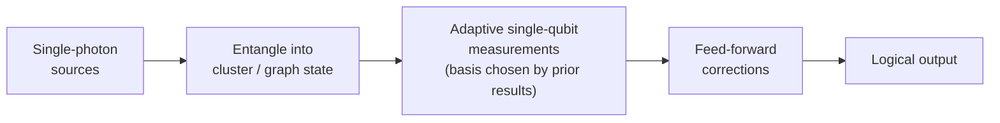

# Photonic Quantum Computing — Linear Optics, Measurement-Based, and Continuous-Variable Approaches

> This file covers the most architecturally distinct modality: photonic quantum computing, where the qubits are **photons** (light) rather than matter. Photons are the natural "flying qubit" (File 15's networking), operate at (or near) room temperature, and are manufacturable on silicon-photonics foundry processes — but they have **no natural photon–photon interaction**, forcing a fundamentally different, *measurement-based* computing model. This file develops discrete- and continuous-variable encodings, the KLM linear-optics result, measurement-based and fusion-based computing, the PsiQuantum and Xanadu approaches, boson sampling, and the dominant challenge of photon loss. It complements Files 2 (formalism), 7 (cross-modality comparison), 15 (networking), and 23 (photonic fabrication).

---

## Part I — Why Photons

Photonic quantum computing begins from a distinctive set of advantages and one crippling disadvantage:

**Advantages:**
- **Room-temperature qubits.** The photonic qubits themselves require no dilution refrigerator (contrast superconducting, File 3; though single-photon *detectors* often need cryogenics, Section 3). Photons propagate through waveguides and fibers at room temperature.
- **Natural flying qubits.** Photons are the *only* practical carrier of quantum information over distance — the basis of quantum networking, QKD, and modular/distributed quantum computing (File 15). A photonic quantum computer and a quantum network speak the same physical language.
- **Manufacturability.** Photonic circuits can be fabricated on **silicon-photonics** platforms using mature semiconductor foundry processes (File 23) — waveguides, beamsplitters, phase shifters, and interferometers patterned lithographically, potentially enabling wafer-scale manufacturing (PsiQuantum's central bet, partnering with GlobalFoundries).
- **Low decoherence in transit.** Photons interact weakly with the environment, so a photon's quantum state is well-preserved as it propagates (the same weak interaction that makes them great flying qubits).

**The crippling disadvantage:**
- **No natural photon–photon interaction.** Photons in linear optical media simply pass through each other; there is no strong, deterministic two-photon gate analogous to the Rydberg blockade or the Josephson coupling. Building an entangling gate requires either **measurement-induced nonlinearity** (KLM, Section 4) — which is *probabilistic* — or exotic strong optical nonlinearities (not practically available at the single-photon level). This single fact dictates the entire architecture: because deterministic two-photon gates are unavailable, photonic quantum computing adopts a **measurement-based** model where computation proceeds via measurements on pre-prepared entangled states, and the probabilistic operations are made effectively deterministic through **massive multiplexing** (generating many attempts and using the ones that succeed).

Photon **loss** — a photon simply vanishing (absorbed, scattered, or undetected) — is the dominant error mechanism, and unlike a dephased matter qubit, a lost photon *removes* the information carrier entirely. This shapes the error-correction strategy (Section 8).

---

## Part II — Discrete-Variable Photonic Qubits

### 1. Encodings

A discrete-variable (DV) photonic qubit encodes information in a two-dimensional degree of freedom of a single photon:

- **Polarization encoding:** |0⟩ = horizontal, |1⟩ = vertical polarization. Simple and common in free-space and fiber QKD (File 15), manipulated by waveplates.
- **Path (dual-rail) encoding:** the photon is in one of two waveguides/paths; |0⟩ = "in path A," |1⟩ = "in path B." Natural for integrated photonics, manipulated by beamsplitters and phase shifters. Dual-rail is the workhorse for on-chip photonic computing.
- **Time-bin encoding:** |0⟩ = early time bin, |1⟩ = late time bin. Robust for fiber transmission (insensitive to polarization drift), used in long-distance QKD.

Single-qubit gates in these encodings are *easy and deterministic* — beamsplitters, phase shifters, and waveplates implement arbitrary single-qubit unitaries with near-unit fidelity. It is the *two-qubit* (entangling) gates that are hard (Section 4).

### 2. Single-photon sources

Generating single photons on demand is a central challenge:

- **Spontaneous parametric down-conversion (SPDC):** a nonlinear crystal (or waveguide) probabilistically splits a pump photon into two lower-energy photons; detecting one "heralds" the other. SPDC is *probabilistic* (a given pump pulse usually produces zero pairs, occasionally one, rarely more) and the photon number is not deterministic — a fundamental limitation requiring multiplexing. SPDC photons can have excellent purity and indistinguishability.
- **Quantum-dot single-photon sources:** a semiconductor quantum dot in a cavity emits single photons on demand (deterministically, when excited) with high brightness and indistinguishability — a more scalable route, though requiring good spectral control and often cryogenic operation. Companies (Quandela, France) build quantum-dot-based photonic systems.
- **The trade-offs:** single-photon sources are judged on **brightness** (photons per second), **purity** (probability of exactly one photon, not two), and **indistinguishability** (whether photons are identical — essential for the quantum interference that gates rely on). No source is perfect on all three, and the imperfections propagate into gate errors (Section 4).

### 3. Single-photon detectors

Detecting single photons with high efficiency and low noise is equally critical:

- **Superconducting nanowire single-photon detectors (SNSPDs):** a superconducting nanowire biased near its critical current; an absorbed photon creates a resistive hotspot producing a voltage pulse. SNSPDs achieve **>95% detection efficiency**, sub-ns timing jitter, and very low dark counts — the best single-photon detectors available. The catch: they operate at **~1–4 K**, requiring cryogenics (a partial, not complete, escape from the cooling burden — the qubits are room-temperature but the detectors are cold). SNSPD fabrication and cryogenic integration with photonic chips is a key engineering area (File 23).
- **Transition-edge sensors (TES):** photon-number-resolving detectors (can count how many photons arrived), operating at even lower temperatures, used in continuous-variable and boson-sampling experiments.

The reliance on cryogenic detectors means photonic quantum computing is not entirely cryogenics-free, though the cooling requirement (~1–4 K for detectors) is far milder than superconducting qubits' ~10 mK.

---

## Part III — Linear Optical and Measurement-Based Computing


**Measurement-based (one-way) quantum computing — compute by measuring a cluster state:**



*Unlike the circuit model, MBQC front-loads all entanglement into a resource state;
computation is then just a schedule of measurements — well matched to photonics,
where entangling gates are hard but measurement is easy and fast.*

### 4. Linear optical quantum computing (KLM)

The foundational result is **KLM (Knill–Laflamme–Milburn, 2001, Nature)**: *universal quantum computation is possible using only single photons, linear optical elements (beamsplitters, phase shifters), and measurement with feedforward* — despite the absence of any photon–photon interaction. The trick is **measurement-induced nonlinearity**: by interfering the computational photons with ancilla photons on beamsplitters and *measuring* the ancillas, one induces an effective nonlinear (entangling) operation on the computational photons — but only *probabilistically* (the gate succeeds only for certain measurement outcomes, "heralded" success). The naive two-qubit gate success probability is low (e.g., 1/4 or less), and boosting it toward 1 requires additional ancilla photons and heralding, at rapidly growing resource cost. KLM proved universality *in principle* but implied enormous overhead — the starting point that later models (MBQC, FBQC) sought to make practical.

### 5. Measurement-based (one-way) quantum computing

**Measurement-based quantum computing (MBQC)**, the **Raussendorf–Briegel one-way quantum computer** (2001), reorganizes computation to suit photonics:

1. **Prepare a large, highly entangled "cluster state"** (a "graph state" — qubits entangled according to a lattice graph) *up front*, offline.
2. **Compute purely by adaptive single-qubit measurements** on the cluster state: measure qubits one by one in bases chosen (adaptively, via classical feedforward from earlier outcomes) to enact the desired logic. The measurement pattern *is* the program.

MBQC is a perfect fit for photonics because: (a) the hard part — generating entanglement — is done *offline* in the cluster-state preparation (which can be built up probabilistically, retrying until it succeeds, then stored/used); and (b) the computation itself proceeds by *single-qubit measurements*, which photonics does superbly (fast, high-fidelity detection). It converts the problem from "perform deterministic two-qubit gates on demand" (which photonics can't) to "prepare a big entangled state, then measure" (which photonics can). The cluster state can be generated by probabilistically fusing small entangled resource states, with multiplexing to overcome the probabilistic success — the basis of the fusion-based approach.

### 6. PsiQuantum: fusion-based quantum computing

**PsiQuantum's approach** is **fusion-based quantum computing (FBQC)** (Bartolucci et al., 2021), a refinement of MBQC tailored for manufacturable silicon photonics:

- Generate many small **entangled photonic resource states** (e.g., a few-photon graph state) from single-photon sources — probabilistically, with multiplexing to guarantee supply.
- Combine them via **"fusion" measurements** — a type of joint (Bell-type) measurement on photons from adjacent resource states that "fuses" them into a larger entangled structure *and simultaneously performs error correction* (the fusion outcomes provide error-syndrome information). The cluster state and the error correction are built together from fusions.
- **Silicon-photonics fabrication:** PsiQuantum partners with **GlobalFoundries** to fabricate photonic chips on standard semiconductor processes, betting that *manufacturability at wafer scale* is the key to reaching the millions of components a fault-tolerant photonic machine needs. This is a distinctive strategy: rather than perfecting few-qubit demonstrations, PsiQuantum aims directly at a large fault-tolerant machine, arguing that photonics' foundry-manufacturability is the only route to the required scale.
- **Multiplexing** (spectral, temporal, spatial) overcomes the probabilistic nature of photon generation and fusion: generate many attempts in parallel, use the successes, and switch them into place — turning probabilistic components into effectively deterministic ones at the cost of component overhead.

PsiQuantum's public communication (File 19) emphasizes a **single large future milestone** (a utility-scale, million-qubit-class machine) funded by large private and government capital, with comparatively little intermediate benchmarking — a high-risk/high-reward roadmap distinct from the incremental gate-model incumbents.

---

## Part IV — Continuous-Variable Photonics


**Two photonic encodings compared:**

```text
   DISCRETE-VARIABLE (DV)              CONTINUOUS-VARIABLE (CV)
   qubit = single photon              qubit = squeezed light / GKP mode
   |0> = |horizontal>                 information in field quadratures (x,p)
   |1> = |vertical> (polarization)    measured by homodyne detection
   photon loss = catastrophic         loss = finite squeezing degradation
   Xanadu (GKP), PsiQuantum uses      Xanadu Borealis / CV cluster states
   dual-rail DV photons
```

### 7. Xanadu: continuous-variable and GKP encoding

**Xanadu's approach** uses **continuous-variable (CV)** quantum computing, encoding information not in discrete single photons but in the *continuous quadratures* (the amplitude and phase, position-and-momentum-like observables) of the electromagnetic field:

- **Squeezed light and CV states:** Xanadu uses **squeezed-light sources** (light with reduced quantum noise in one quadrature) and manipulates the field quadratures with beamsplitters, phase shifters, and homodyne/heterodyne detection.
- **Gottesman–Kitaev–Preskill (GKP) encoding:** to build an effective *qubit* within the CV framework, Xanadu targets the **GKP code** (Gottesman–Kitaev–Preskill, 2001), which encodes a qubit in periodically-structured CV states (grid states in phase space) with *built-in error-correcting structure* against small shifts in the quadratures. GKP states are hard to prepare (a major research challenge) but are theoretically powerful, bridging CV and discrete error correction, and are relevant also to bosonic codes in superconducting cavities (File 7).
- **Borealis and X-series processors:** Xanadu's photonic processors; Borealis demonstrated a Gaussian-boson-sampling advantage claim (Section 9).
- **PennyLane software:** Xanadu's open-source **PennyLane** framework (File 12) for differentiable quantum programming and quantum machine learning is a major, separate contribution to the whole ecosystem — arguably as influential as Xanadu's hardware, providing cross-platform ecosystem value (like Qiskit for IBM).

CV photonics offers deterministic Gaussian operations (squeezing, beamsplitters) and needs only a non-Gaussian element (like GKP state preparation or photon-number measurement) for universality — a different decomposition of the "hard part" than DV photonics.

### 8. Photon loss: the dominant error

Across all photonic approaches, **photon loss** is the dominant error mechanism, and it is qualitatively different from matter-qubit decoherence:

- A lost photon *removes the information carrier*, rather than merely dephasing or flipping it. In DV encoding, a lost photon is often *detectable* (a heralded absence) — which makes it an **erasure error** (a loss at a *known* location, easier to correct than an unknown Pauli error, cf. neutral-atom erasure conversion, File 5) — but it still destroys the computation if not corrected.
- **Loss accumulates** with every optical component and every meter of waveguide/fiber. Achieving the very low per-component loss that fault tolerance requires (waveguide loss, coupling loss, detector inefficiency all count) is the central engineering challenge (File 23), and loss thresholds for photonic fault tolerance are demanding (typically requiring per-component loss well below 1%).
- **Multiplexing** overcomes probabilistic *generation* but not *loss* — a photon lost mid-computation is gone. So photonic fault tolerance couples loss-tolerant codes (exploiting the erasure nature of detected loss) with aggressive per-component loss reduction.

Photon loss is to photonic computing what TLS loss is to superconducting (File 3) or atom loss is to neutral atoms (File 5): the modality-defining error that the entire architecture is organized to combat.

### 9. Boson sampling

**Boson sampling** (Aaronson–Arkhipov, 2011) is a *restricted, non-universal* photonic computational task: send single photons through a large linear-optical interferometer and sample the output photon-number distribution. Computing this distribution classically requires evaluating **matrix permanents** (a #P-hard problem), so boson sampling is believed classically intractable at scale — making it a candidate for demonstrating *quantum advantage* on a specific sampling task (analogous to random-circuit sampling for superconducting, File 14). Key points:

- **Jiuzhang (USTC, China):** a series of Gaussian-boson-sampling experiments claiming quantum advantage on this specific sampling task, using squeezed light and large interferometers.
- **Xanadu Borealis:** a programmable Gaussian-boson-sampling advantage claim.
- **The caveats (File 14):** boson sampling is *not universal computation* — it cannot run Shor's or Grover's algorithm, and has no known practical use beyond the advantage demonstration itself. Its advantage claims are subject to the same "moving target" classical-simulation scrutiny as all sampling-based supremacy claims — classical spoofing algorithms and improved simulations have contested specific claims, and the practical significance of boson sampling is debated. It is a physics demonstration of computational complexity, not a useful computer.

---

## Part V — Challenges, Assessment, and Cross-References

### 10. The photonic challenge summary

Photonic quantum computing's challenges, collected:

- **Photon loss** (Section 8): the dominant error, demanding ultra-low-loss components and loss-tolerant codes.
- **Probabilistic sources and gates:** overcome only by massive **multiplexing** (spectral/temporal/spatial), which imposes large component overhead — a photonic fault-tolerant machine needs *enormous* numbers of sources, switches, and detectors, betting on foundry manufacturability to supply them.
- **Source imperfections:** brightness/purity/indistinguishability trade-offs (Section 2) that degrade the interference gates rely on.
- **Cryogenic detectors:** SNSPDs need ~1–4 K, a partial (not complete) escape from cryogenics.
- **Integration and packaging:** combining sources, waveguides, switches, and detectors on-chip with low loss and good yield (File 23).

The photonic bet is that these challenges are *manufacturing* problems solvable by semiconductor-foundry scale (PsiQuantum's thesis), rather than fundamental physics limits — a genuinely different theory of how to reach fault tolerance than the matter-qubit modalities, which face physics limits (coherence, connectivity) attacked one qubit at a time.

### 11. Assessment and positioning

Photonic quantum computing is the field's **highest-variance** bet: if the manufacturability thesis holds, silicon-photonics foundries could in principle produce the millions of components a fault-tolerant machine needs faster than matter-qubit modalities can scale their cryogenic/laser systems — and the same technology natively supports quantum networking (File 15). If loss and multiplexing overhead prove intractable, the approach struggles. The modality's distinctive strengths — room-temperature qubits, foundry manufacturability, networking-native flying qubits, and the offline-entanglement MBQC/FBQC model that sidesteps the missing photon–photon interaction — are real and unique. Its distinctive weaknesses — photon loss as an unforgiving error, probabilistic components requiring massive multiplexing, cryogenic detectors, and (for PsiQuantum) a roadmap with little intermediate benchmarking — are equally real. In the cross-modality comparison (File 7), photonics is the outlier: not a faster or more coherent matter qubit, but a fundamentally different architecture betting on manufacturing scale and measurement-based computation. Its progress — and PsiQuantum's and Xanadu's roadmaps (File 19) — should be tracked as a distinct, high-stakes experiment in *how* to reach fault tolerance, complementary to and competitive with the matter-qubit approaches.

*Cross-references: qubit formalism, measurement, and cluster states (File 2); cross-modality comparison and GKP/bosonic codes (File 7); loss-tolerant and MBQC-based error correction (File 9); PennyLane software (File 12); classical simulation of boson sampling and advantage claims (File 14); quantum networking and flying qubits (File 15); PsiQuantum/Xanadu roadmaps (File 19) and competitive positioning (File 20); silicon-photonics and SNSPD fabrication (File 23).*

---

## Part VI — Extended Topics, Companies, and Worked Discussion

### 12. Multiplexing in depth: turning "probably" into "certainly"

The single deepest engineering idea in photonic computing is **multiplexing** — converting probabilistic components into effectively deterministic ones by parallelism and switching. Because a single-photon source (SPDC) or a fusion gate succeeds only with probability p < 1 on any given try, a photonic machine cannot rely on any one attempt. Instead:

- **Spatial multiplexing:** run many sources in parallel; when one succeeds (heralded), an optical switch routes its photon to the needed location. With N parallel sources each succeeding with probability p, the probability that *at least one* succeeds is 1 − (1−p)^N → 1 for modest N.
- **Temporal multiplexing:** run one source repeatedly in successive time bins, storing successful photons in a delay line (a loop of fiber/waveguide) until enough have accumulated, then release them synchronously. Trades hardware count for time and delay-line loss.
- **Spectral multiplexing:** generate photons across many frequency modes and frequency-convert the successes to a common frequency.

The cost is **switch and delay-line loss** (every switch and every meter of delay adds loss, Section 8) and enormous **component counts** — a fault-tolerant photonic machine may need millions of sources, switches, and detectors. This is precisely why *manufacturability* (silicon-photonics foundry fabrication) is PsiQuantum's central thesis: the architecture trades the matter-qubit modalities' physics problems (coherence, connectivity) for a *manufacturing* problem (make millions of low-loss components cheaply and reproducibly), betting that semiconductor foundries can win that trade. Whether switch/delay loss can be pushed low enough while multiplexing depth stays manageable is the crux of photonic fault-tolerance feasibility.

### 13. Fusion-based error correction, a bit deeper

In FBQC (Section 6), the resource states and fusions are chosen so that the *pattern of fusion outcomes* directly yields error-correction syndromes. A common target is a topological cluster state (a 3D graph state whose measurement pattern implements the surface code, File 9). Fusions play the role of stabilizer measurements: successful fusions build the entangled fabric and report syndrome bits; failed fusions (a fusion can fail probabilistically, or a photon can be lost) create *known-location* erasures in the cluster, which the topological code tolerates up to a threshold. The scheme's beauty is that computation, entanglement generation, and error correction are unified into one repeated primitive (generate resource states → fuse → interpret outcomes). Its demands are stringent: the fusion success probability and per-photon loss must sit below the code's thresholds, requiring both good components and enough multiplexing to boost fusion success. FBQC reframes the entire fault-tolerance problem in photonic-native terms, and its viability rests on the loss and multiplexing engineering of Section 12.

### 14. The broader photonic company landscape

Beyond PsiQuantum and Xanadu (File 20 has the full competitive treatment):

- **Quandela (France):** builds photonic systems around **quantum-dot single-photon sources** (deterministic, bright, indistinguishable photons — Section 2), offering an alternative to SPDC's probabilistic sources; cloud-accessible photonic processors.
- **ORCA Computing (UK):** photonic systems using **quantum memories** (atomic-vapor-based) and time-multiplexing, with a focus on near-term photonic processing and integration with classical HPC/ML.
- **Nu Quantum (UK):** photonic networking components (single-photon sources/detectors) and interconnects, positioning at the networking/modular-computing intersection (File 15).
- **QuiX Quantum (Netherlands):** photonic processors based on low-loss integrated waveguide chips.
- **Academic anchors:** Bristol (Jeremy O'Brien, integrated quantum photonics — PsiQuantum's roots), USTC (Jiuzhang boson sampling; File 21), and others.

The photonic ecosystem is notable for its overlap with **quantum networking** (File 15) — many photonic components (sources, detectors, memories, interconnects) serve both computing and communication, a synergy no matter-qubit modality shares to the same degree.

### 15. Worked discussion: why offline entanglement is the key insight

The single most important conceptual move in photonic computing is doing entanglement **offline**. In a matter-qubit machine (Files 3–5), entangling gates happen *during* the computation, on demand, deterministically — which photonics cannot do (no photon–photon interaction). MBQC/FBQC sidesteps this by generating all the entanglement *before* the logical computation, probabilistically and with retries, storing the resulting entangled cluster state, and then computing purely by measurement. Concretely: rather than needing a two-photon gate to fire reliably at circuit time t, the machine spends the earlier time building (via many probabilistic fusions, retried and multiplexed until they succeed) a large entangled state, and then the "computation" is just a sequence of single-photon measurements with classical feedforward — operations photonics performs excellently and deterministically. This is why a modality with *no deterministic entangling gate* can nonetheless be universal: it never needs a deterministic entangling gate *at computation time*, only a pre-built entangled resource and fast measurements. Internalizing this — that MBQC converts "deterministic two-qubit gates on demand" into "offline probabilistic entanglement plus deterministic measurement" — is the key to understanding why photonics is architecturally viable despite its missing interaction, and why loss (which destroys the pre-built entanglement irrecoverably) is the error that matters most.

### 16. Comparison to matter qubits (preview of File 7)

| Property | Photonic | Matter qubits (SC/ion/atom) |
|---|---|---|
| Qubit temperature | room temperature | mK (SC) or room-temp vacuum (ion/atom) |
| Detector/aux cryogenics | ~1–4 K (SNSPDs) | integral to modality |
| Two-qubit gate | probabilistic (measurement-induced) | deterministic (physical interaction) |
| Computing model | measurement-based / fusion-based | circuit (gate) model |
| Dominant error | photon loss (often heralded → erasure) | decoherence, gate error, leakage |
| Entanglement | generated offline, probabilistically | generated on demand, deterministically |
| Scaling thesis | foundry manufacturability of many components | per-qubit coherence/connectivity/wiring |
| Networking fit | native (photons are flying qubits) | requires matter–photon transduction |
| Leading players | PsiQuantum, Xanadu, Quandela, ORCA | IBM/Google (SC), IonQ/Quantinuum (ion), QuEra/Pasqal (atom) |

Photonics is the outlier: not a better matter qubit but a different computing paradigm, betting manufacturing scale against the matter modalities' physics-limited per-qubit progress, and uniquely unifying computing with networking.

### 17. History and glossary

**Brief history:** SPDC single photons (1980s–90s); the KLM linear-optics universality result (2001); MBQC/one-way computer (Raussendorf–Briegel 2001); integrated quantum photonics on chip (Bristol, 2000s–2010s); boson sampling proposal (2011) and demonstrations (Jiuzhang 2020–2021, Borealis 2022); PsiQuantum founded (2016) betting on silicon-photonics fault tolerance; FBQC framework (2021). The field's trajectory has been from tabletop bulk-optics demonstrations toward integrated, foundry-fabricated chips at ever-larger component counts.

**Glossary:**
- **Flying qubit:** a photon — a mobile qubit ideal for transmission (File 15).
- **Dual-rail encoding:** qubit encoded in which of two waveguides a photon occupies.
- **KLM:** Knill–Laflamme–Milburn — proof that linear optics + measurement is universal (probabilistically).
- **MBQC / one-way computer:** computation by adaptive single-qubit measurements on a pre-built cluster (graph) state.
- **FBQC:** fusion-based quantum computing — building the cluster and error correction from fusion measurements of small resource states (PsiQuantum).
- **Cluster/graph state:** a large entangled state, the substrate for MBQC.
- **Fusion:** a Bell-type joint measurement combining resource states.
- **Multiplexing:** using parallel/temporal/spectral redundancy to make probabilistic sources/gates effectively deterministic.
- **CV / GKP:** continuous-variable computing / the Gottesman–Kitaev–Preskill code encoding a qubit in field quadratures (Xanadu).
- **Boson sampling:** a non-universal sampling task (matrix permanents) used for advantage demonstrations.
- **SPDC / quantum-dot source:** probabilistic / deterministic single-photon sources.
- **SNSPD:** superconducting nanowire single-photon detector (>95% efficiency, ~1–4 K).
- **Photon loss:** the dominant error; detected loss becomes a (correctable) erasure.

### 18. Summary

Photonic quantum computing is the most architecturally distinct modality: room-temperature photonic qubits, foundry-manufacturable silicon-photonics chips, and native networking compatibility, but no photon–photon interaction — forcing the measurement-based/fusion-based model in which entanglement is generated offline and probabilistically, made deterministic by massive multiplexing, and computation proceeds by fast single-photon measurements. Photon loss is the dominant, architecture-defining error, partly tamed by treating detected loss as an erasure and attacked by ultra-low-loss components. Xanadu's continuous-variable/GKP approach and PennyLane software, PsiQuantum's fusion-based silicon-photonics bet, and the boson-sampling advantage demonstrations (Jiuzhang, Borealis) span the field's diversity. The photonic thesis — that fault tolerance is a *manufacturing* problem for foundries to solve, not a per-qubit physics problem — makes it the highest-variance approach in the field: potentially the fastest path to the millions of components fault tolerance needs, or a dead end if loss and multiplexing overhead prove intractable. Either way, its deep synergy with quantum networking (File 15) ensures photonic technology's relevance regardless of the computing outcome. The reader should carry photonics' outlier status — different model, different error, different scaling thesis — into File 7's consolidated cross-modality comparison and the roadmap/competitive analyses of Files 19–20.

---

## Part VII — Loss Thresholds, CV Details, and Networking Synergy

### 19. Worked example: why loss thresholds are so demanding

Consider a fusion-based architecture where a logical operation involves a photon passing through, say, 10 optical components (sources coupling, switches, waveguide segments, detectors) before measurement. If each component transmits with efficiency η_c, the end-to-end survival probability is η_c^10. To keep total loss per logical step below a fault-tolerance threshold of, say, ~1% (a representative loss threshold for good photonic codes), one needs η_c^10 ≥ 0.99, i.e., η_c ≥ 0.99^{0.1} ≈ 0.999 — **each component must have loss below ~0.1%**. Achieving 0.1%-level loss in every source coupling, switch, waveguide bend, and detector simultaneously, across millions of components, is the central manufacturing challenge (File 23). This calculation makes concrete why photonics is a *manufacturing* bet: the physics works (KLM, MBQC, FBQC prove universality and fault tolerance are possible), but only if per-component loss is driven to and held at fractions of a percent at wafer scale — exactly the kind of yield/uniformity problem semiconductor foundries are built to solve, which is why PsiQuantum's GlobalFoundries partnership is strategically central (Files 19, 20, 23). Detected loss becoming an *erasure* (Section 8) relaxes the threshold somewhat (erasures are easier to correct), which is why loss-tolerant codes exploiting the heralded nature of photon loss are a key research thread.

### 20. Continuous-variable physics in a bit more detail

CV photonics (Section 7) works with the quadrature operators x̂ = (â + â†)/2 and p̂ = (â − â†)/2i of an optical mode (analogous to position and momentum), satisfying [x̂, p̂] = i/2. **Gaussian operations** — squeezing (reducing noise in one quadrature at the expense of the other), displacement, beamsplitting, and phase rotation — are all deterministic and easy in optics, and **homodyne detection** measures a chosen quadrature. But Gaussian states and operations alone are *efficiently classically simulable* (a CV analogue of the Gottesman–Knill theorem, File 14) — so a **non-Gaussian** resource is required for universality and quantum advantage. That resource is typically **GKP state preparation** (grid states, Section 7) or photon-number-resolving measurement (which is non-Gaussian). GKP states encode a qubit in a periodic phase-space grid so that small quadrature shifts (the CV analogue of small errors) can be detected and corrected by measuring the deviation from the grid — an elegant built-in error correction that also connects to superconducting bosonic cat/GKP codes (File 7). The practical bottleneck is that high-quality GKP states are extremely hard to generate; producing them (via measurement-based "breeding," or in superconducting cavities) is an active frontier. Xanadu's roadmap centers on generating GKP qubits from squeezed light and using them in a fault-tolerant CV cluster-state architecture — a distinct but theoretically well-founded path to photonic fault tolerance.

### 21. The networking synergy, made explicit

No other modality shares photonic computing's deep overlap with quantum **networking** (File 15). The very components photonic computing develops — single-photon sources, SNSPDs, low-loss waveguides, photonic switches, and quantum memories (ORCA) — are exactly the components a quantum internet needs. A photonic quantum computer *is* a quantum network node in embryo: its qubits are already flying qubits, requiring no matter-to-photon transduction (the interface that trapped-ion and superconducting modular architectures must solve, Files 4, 15). This means (a) photonic technology advances quantum networking regardless of whether photonic *computing* wins, ensuring the modality's relevance; (b) distributed/modular photonic computers can be linked by the same photonic fabric that carries the computation, without a transduction bottleneck; and (c) photonic computing and QKD/quantum-repeater research reinforce each other's component development. This dual-use character — every photonic-computing advance is also a networking advance — is a structural hedge that de-risks investment in the modality's underlying technology even amid uncertainty about the computing endgame, and it is a recurring point in the networking (File 15) and competitive (File 20) discussions.

### 22. Final assessment recap

Photonics bets that fault tolerance is a manufacturing problem (millions of low-loss, foundry-fabricated components) rather than a per-qubit physics problem, using an offline-entanglement measurement-based model to sidestep the missing photon–photon interaction, with photon loss (partly tamed as erasure) as the defining error. It is the highest-variance modality — potentially the fastest route to fault-tolerant scale if manufacturability delivers, or a dead end if loss and multiplexing overhead don't yield — and it is uniquely hedged by its networking dual-use. That combination of high variance and structural hedge makes photonics one of the most important modalities to track, and the clearest example of the field's diversity of *theories about how to reach fault tolerance*, not just different qubits. It closes the survey of the "big three plus photonics" and sets up File 7's consolidated comparison and the spin/topological/bosonic alternatives.
