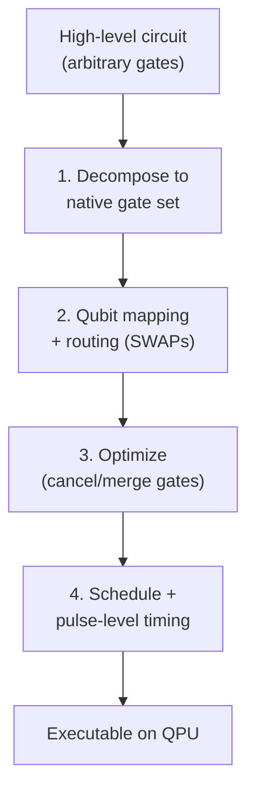

# Quantum Circuits, Gate Decomposition, and Hardware-Aware Compilation

> This file covers how an abstract quantum algorithm becomes physical operations on real hardware: gate-set decomposition, the circuit-to-hardware mapping and routing problem, gate scheduling, pulse-level control and calibration, circuit optimization, noise-aware compilation, and the classical control architecture. Compilation ("transpilation" in Qiskit terminology) is where the clean abstractions of algorithms (Files 2, 13) collide with the messy realities of hardware (Files 3–7, 11). It complements File 12 (the software stack that implements these steps) and File 9 (fault-tolerant compilation).

---

## Part I — Gate-Set Decomposition and the Compilation Problem


**The compilation pipeline: from abstract algorithm down to hardware pulses:**



### 1. Why compilation is necessary

An algorithm is expressed in *abstract* gates (arbitrary single-qubit rotations, CNOTs, multi-controlled gates, arbitrary unitaries). Real hardware supports only a small **native gate set** — a few calibrated single-qubit rotations plus *one* entangling gate, which differs by modality (File 2, Section 7): CZ/cross-resonance (superconducting, File 3), Mølmer–Sørensen (trapped ion, File 4), Rydberg CZ (neutral atom, File 5). The compiler must **decompose** every abstract operation into the native set, **map** logical qubits to physical qubits, **route** interactions across a limited-connectivity graph, **schedule** gates for parallelism, and **optimize** the result — all while respecting the hardware's noise structure. This is called **transpilation** in Qiskit (IBM's terminology) and is the central systems problem bridging algorithms and hardware.

### 2. Universal decomposition

By the universality results (File 2, Section 8), any unitary decomposes into single-qubit rotations and CNOTs — but generically with *exponentially* many gates. Practical compilation exploits structure:

- **Single-qubit synthesis:** any single-qubit unitary → Z–Y–Z Euler rotations (File 2, Section 6); on hardware with virtual-Z gates (free frame changes), only the Y-rotations cost pulse time.
- **Two-qubit synthesis:** any two-qubit unitary → at most 3 CNOTs (or 3 native entangling gates) plus single-qubit gates, via the **KAK/Cartan decomposition** (File 2, Section 7) — the optimal decomposition, computing the three "interaction" parameters and realizing them with minimal entangling gates.
- **Fault-tolerant synthesis:** for Clifford+T hardware (File 9), arbitrary rotations → Clifford+T sequences via **Solovay–Kitaev** or optimal number-theoretic synthesis (Ross–Selinger), minimizing **T-count** (the fault-tolerant cost driver, File 18).

### 3. Virtual-Z gates: free rotations

A crucial hardware optimization (superconducting, File 3): an R_z(λ) rotation can be implemented not by a physical pulse but by *shifting the phase reference* of all subsequent pulses on that qubit — a "virtual Z" gate that costs **zero time and zero error**. Because any single-qubit unitary is Z–Y–Z, and the Z rotations are free, only the Y rotations (two per arbitrary single-qubit gate, and often reducible to X±90° pulses) consume real resources. Compilers aggressively push Z rotations into virtual gates, dramatically reducing physical pulse counts — a standard, high-impact optimization exploiting the rotating-frame physics of File 2, Section 23.

---

## Part II — The Circuit-to-Hardware Mapping Problem


**Routing: inserting SWAPs when connectivity is limited:**

```text
   Circuit wants CNOT(q0,q3)         Hardware connectivity (line):
                                        q0 - q1 - q2 - q3
   q0 and q3 are NOT adjacent  ->  insert SWAPs to move them together:

     SWAP(q0,q1) ; SWAP(q1,q2) ; CNOT(q2,q3) ; (undo)
     Each SWAP = 3 CNOTs -> routing overhead can DOMINATE circuit depth
     on sparse hardware. This is why connectivity is a headline metric.
```

### 4. Connectivity graphs and the routing problem

Hardware connectivity — which physical qubit pairs admit a native two-qubit gate — varies drastically by modality (File 7's table):

- **Superconducting:** sparse, fixed, nearest-neighbor (degree ≤ 4; heavy-hex is degree ≤ 3, File 3).
- **Trapped ion:** all-to-all within a module (File 4) — *no routing needed intra-module*.
- **Neutral atom:** reconfigurable (atoms moved to become adjacent, File 5) — routing by physical transport.

When an algorithm needs a two-qubit gate between logical qubits mapped to *non-adjacent* physical qubits, the compiler must **route** — insert **SWAP gates** to move the logical qubit states along the connectivity graph until they are adjacent, apply the gate, and (optionally) swap back. Each SWAP is 3 CNOTs, so routing inflates gate count and depth substantially. The **SWAP routing problem** — finding the SWAP insertions that minimize added gates/depth — is **NP-hard** in general, solved heuristically in production compilers.

### 5. SABRE and routing heuristics

The standard production routing heuristic is **SABRE (SWAP-based Bidirectional heuristic search, Li–Ding–Xie 2019, arXiv:1809.02573)**: it searches for SWAP insertions using a cost function that looks ahead at upcoming gates (favoring SWAPs that help not just the immediate gate but future ones), and runs *bidirectionally* (forward and reverse passes) to also optimize the *initial* qubit placement. SABRE (and its variants/improvements) is the default router in Qiskit and many other stacks. Other approaches: **lookahead** routing with deeper search, and **exact** routing via SAT-solver or constraint-programming formulations (optimal but exponentially scaling, used only for small circuits or benchmarking heuristic routers). For all-to-all-connected trapped ions, routing is trivial (a major compilation advantage, Files 4, 22); for reconfigurable neutral atoms, "routing" becomes an atom-movement scheduling problem with its own optimization.

### 6. Initial qubit placement

Before routing, the compiler must choose the **initial mapping** of logical to physical qubits — a choice that strongly affects total routing overhead. Good placement puts frequently-interacting logical qubits on well-connected, high-fidelity physical qubits. Heuristics use the circuit's interaction graph and the device's connectivity + calibration data; SABRE's reverse pass refines the initial placement. Poor placement can multiply the SWAP overhead, so placement and routing are tightly coupled and jointly optimized.

---

## Part III — Scheduling, Pulses, and Calibration

### 7. Gate scheduling and parallelism

After decomposition and routing, the compiler **schedules** gates into time layers, identifying commuting/independent gates that can execute *simultaneously* (in parallel on disjoint qubits) to minimize circuit **depth** (File 2, Section 32) — depth sets wall-clock time and decoherence exposure. Scheduling respects hardware constraints: shared control resources (a microwave source driving several qubits), crosstalk between simultaneously-driven nearby qubits (File 2, Section 13), and per-modality parallelism limits (neutral atoms' global gates are massively parallel, File 5; superconducting parallelism is limited by crosstalk). The scheduler also inserts **dynamical decoupling** sequences (File 2, Section 26; File 10) on idle qubits to suppress dephasing during waits.

### 8. Pulse-level control and gate calibration

Below the logical-gate abstraction, every gate is a **calibrated analog control pulse** — a shaped microwave envelope (superconducting, File 3), a laser pulse sequence (trapped ion/neutral atom, Files 4, 5). Pulse-shaping techniques:

- **Gaussian and DRAG envelopes** (File 3): DRAG suppresses leakage to non-computational states.
- **GRAPE (Gradient Ascent Pulse Engineering):** numerical optimal-control optimization of pulse shapes to maximize gate fidelity or minimize duration, given a system model.
- **Calibration:** each gate's pulse parameters (amplitude, phase, duration, DRAG coefficient) are tuned by automated routines (File 3, Section 32) and **drift over time** (TLS spectral diffusion, flux drift, temperature), requiring periodic recalibration — a major operational reality that makes device performance time-varying and complicates benchmarking (File 22).

### 9. Optimal control and pulse-level compilation

Beyond decomposing into fixed calibrated gates, **pulse-level compilation** directly synthesizes an optimal analog pulse for a *target multi-qubit unitary* — bypassing the gate abstraction to achieve higher fidelity or shorter duration than a gate-by-gate decomposition would. Tools like **Qiskit Pulse** expose pulse-level control, and research systems perform direct pulse-level program synthesis (e.g., compiling a whole sub-circuit into one optimized pulse via GRAPE-like optimization). This is powerful but requires an accurate hardware model and per-device calibration, and it breaks the clean gate abstraction — a trade-off between performance and portability (File 12).

---

## Part IV — Optimization and Noise-Awareness

### 10. Circuit optimization passes

Compilers apply **optimization passes** to reduce gate count and depth:

- **Gate cancellation:** consecutive inverse gates (e.g., two adjacent Hadamards, or X·X) cancel.
- **Commutation-based reordering:** commuting gates are reordered to expose further cancellations or better scheduling.
- **Template matching / peephole optimization:** recognizing sub-circuit patterns and replacing them with cheaper equivalents.
- **ZX-calculus simplification:** representing the circuit in the **ZX-calculus** (a graphical rewrite system for quantum circuits) and applying graph-rewrite rules to simplify, then re-extracting a circuit — used by **PyZX** and Quantinuum's **TKET** (File 12), especially effective for reducing T-count and two-qubit gate count.
- **Approximate synthesis:** trading a small, bounded fidelity loss for a shorter circuit (e.g., approximate QFT, File 2; approximate rotation synthesis) — often worthwhile on noisy hardware where a shorter circuit's reduced decoherence outweighs the approximation error.

### 11. Noise-aware compilation

Because real devices have *heterogeneous* noise (some qubits/gates far better than others, and drifting), production compilers are **noise-aware**: routing and placement decisions consult per-qubit/per-gate **calibration data** (T₁/T₂, gate fidelities, readout errors, updated regularly) to favor higher-fidelity qubits and links and avoid bad ones. This "leaky abstraction" — exposing physical noise up through the compilation stack rather than hiding it — is a defining feature distinguishing quantum from classical compilation (File 12), where hardware details are cleanly abstracted away. Noise-aware compilation can substantially improve real-circuit fidelity by steering computation onto the device's best resources.

### 12. Randomized compiling and error-structure shaping

Compilers can also *shape the error structure* to make it more benign (File 2, Section 34; File 10): **randomized compiling / Pauli twirling** inserts random Pauli gates around each two-qubit gate (compiled away in the ideal case) that convert *coherent* errors into *stochastic* Pauli errors — trading a worst-case quadratic error accumulation for a benign linear one, at no fidelity cost and often improving deep-circuit performance. This is a compilation-level error-mitigation technique, increasingly standard in NISQ workflows (File 10).

---

## Part V — Classical Control Architecture and Cross-References

### 13. The classical control stack

Below pulse-level compilation lies the **classical control system** (detailed in File 11): FPGA-based real-time controllers generating the analog waveforms via **arbitrary waveform generators (AWGs)** and processing readout signals. The control stack spans from the high-level circuit description down to physical voltage/laser waveforms. For **mid-circuit measurement and adaptive circuits** (feed-forward, error correction), the control system must provide **low-latency feedback** — measure, classically process (decode), and conditionally act, all within the coherence budget (sub-μs to μs; File 11). This real-time constraint shapes compilation for adaptive circuits: the compiler must respect feedback latency and schedule classical processing alongside quantum operations. FPGA implementations of fast decoders (Union-Find, MWPM variants for error correction, File 9) are an active hardware–software co-design area (File 11).

### 14. The compilation pipeline, end to end

A typical pipeline: **algorithm** → **circuit** (abstract gates) → **optimization** (cancellation, ZX simplification) → **initial placement** (logical→physical mapping) → **routing** (SWAP insertion, noise-aware) → **native-gate decomposition** (to CZ/MS/Rydberg + rotations) → **scheduling** (parallelism, DD insertion) → **pulse-level compilation/calibration** (to analog waveforms) → **classical control** (AWG waveforms, readout). Each stage exposes the physical noise/connectivity constraints upward (the "leaky" stack), and each is a research and engineering discipline in itself. For **fault-tolerant** compilation (File 9), the pipeline gains additional layers: logical-gate synthesis (Clifford+T with minimal T-count), magic-state-injection scheduling, and lattice-surgery routing — where the T-count from synthesis directly determines the magic-state-factory cost and thus the machine's resource requirements (File 18).

### 15. Summary

Compilation is where quantum computing's abstractions meet hardware reality. Gate-set decomposition (universal, two-qubit KAK, fault-tolerant Clifford+T), the NP-hard circuit-to-hardware mapping and SWAP-routing problem (SABRE and heuristics, trivial for all-to-all ions, physical-transport-based for neutral atoms), gate scheduling for parallelism, pulse-level control and drifting calibration, circuit optimization (cancellation, ZX-calculus, approximate synthesis), noise-aware compilation (the defining "leaky abstraction" exposing physical noise upward), and error-structure shaping (randomized compiling) together transform an algorithm into physical operations. The overhead this introduces — especially SWAP-routing on sparse connectivity — is a central NISQ-era performance tax (favoring high-connectivity modalities, Files 4, 5, 22) and a key input to whether a given algorithm beats classical methods on real hardware (Files 14, 17). The software tools implementing this pipeline are the subject of File 12; the fault-tolerant extensions feed Files 9 and 18.

*Cross-references: gates, universality, KAK decomposition, virtual-Z, and the coherent/stochastic error distinction (File 2); native gates by modality and calibration (Files 3, 4, 5); the software stack implementing compilation — Qiskit transpiler, TKET, etc. (File 12); fault-tolerant compilation, T-count, magic states, lattice surgery (File 9); randomized compiling and dynamical decoupling as mitigation (File 10); classical control electronics and real-time feedback (File 11); resource estimation driven by T-count (File 18); connectivity's effect on benchmarks (File 22).*

---

## Part VI — Worked Examples, Deeper Techniques, and Glossary

### 16. Worked example: SWAP-routing overhead

Consider a QFT on 5 qubits (File 2, Section 20), which requires controlled-phase gates between *every* pair of qubits — a fully-connected interaction pattern. On a **linear** connectivity (each qubit adjacent only to its neighbors, degree ≤ 2), the non-adjacent controlled-phase gates require SWAP routing. Routing an all-to-all interaction pattern onto a line costs O(n) SWAP layers, so the 5-qubit QFT's ~10 two-qubit interactions balloon by a factor of several once SWAPs (3 CNOTs each) are inserted — potentially tripling or quadrupling the two-qubit gate count and depth. On a **trapped-ion** all-to-all device (File 4), the *same* QFT compiles with *zero* routing overhead — every controlled-phase gate applies directly. This is the concrete mechanism behind trapped ions' high quantum volume (File 22) and the reason connectivity is a first-class architectural property: for interaction-dense algorithms (QFT in Shor, full-connectivity chemistry ansätze), sparse connectivity can multiply the effective gate count by integer factors, eroding NISQ advantage (File 17) and inflating fault-tolerant runtimes (File 18). Compilers fight this with good placement and lookahead routing, but they cannot eliminate the topological mismatch between a dense interaction graph and a sparse hardware graph.

### 17. Worked example: T-count and fault-tolerant cost

For fault-tolerant compilation (File 9), the dominant cost metric is **T-count** — the number of non-Clifford T gates — because each T gate consumes a distilled **magic state** produced by an expensive magic-state factory (File 9), often dominating the total qubit/time budget (File 18). Consider compiling an arbitrary single-qubit z-rotation R_z(θ) to precision ε using the Ross–Selinger optimal synthesis (File 2, Section 8): the T-count is approximately **3·log₂(1/ε) + O(1)**. For a quantum-chemistry algorithm needing thousands of such rotations at ε ~ 10⁻¹⁰, that is ~100 T gates *per rotation* × thousands of rotations = ~10⁵–10⁶ T gates total — and each T gate's magic state costs hundreds of physical qubits and many cycles in the factory (File 18). This is why compilation for fault tolerance obsesses over **T-count reduction**: approximate synthesis with looser ε where tolerable, ZX-calculus T-count optimization, and algorithm-level restructuring to reduce the number of non-Clifford operations. A 2× T-count reduction can roughly halve the magic-state-factory footprint, which often *dominates* the machine's physical-qubit count (File 18) — so T-count optimization at compile time has outsized leverage on the hardware requirements.

### 18. ZX-calculus in a bit more depth

The **ZX-calculus** represents a quantum circuit as a graph of "spiders" (Z-spiders and X-spiders, corresponding to the two Pauli bases) connected by wires, with a set of **rewrite rules** that preserve the represented linear map. Its power: many circuit identities that are tedious to prove with matrices become simple local graph rewrites, and the calculus is *complete* (any true equality of quantum maps is provable by the rules) for important fragments. In compilation, a circuit is translated to a ZX-diagram, simplified by rewrites (fusing spiders, eliminating identities, reducing the number of non-Clifford "phase" spiders that correspond to T gates), and then a circuit is *extracted* from the simplified diagram. TKET (Quantinuum, File 12) and PyZX use ZX-based passes especially effectively for **T-count reduction** and two-qubit gate reduction. The main challenge is *circuit extraction* — converting a simplified ZX-diagram back into an efficient gate circuit is nontrivial (and can reintroduce gates) — an active research area. ZX-calculus also underlies reasoning about lattice surgery and measurement-based computing (Files 6, 9), making it a unifying graphical language across compilation, error correction, and photonic MBQC.

### 19. Pulse calibration and drift management in practice

The gap between a compiled *gate* and a working *pulse* is calibration (File 3, Section 32). In practice a device runs continuous background calibration: periodic single-qubit fidelity checks (RB), two-qubit gate re-tuning, readout-discriminator retraining, and frequency/flux drift tracking. Compilation interacts with this in two ways: (1) the compiler consumes the *latest* calibration data for noise-aware decisions (Section 11), so a circuit compiled against morning calibration may be sub-optimal by afternoon; and (2) some workflows **re-compile or re-calibrate per batch** to track drift. For cloud-accessed hardware (File 12), users typically receive the device's current calibration snapshot and the compiler uses it automatically. The upshot: quantum "compilation" is not a one-time static process (as in classical software) but a *continuously data-dependent* one, tightly coupled to the live state of a drifting physical device — a fundamental operational difference from classical compilation, and a source of the run-to-run variability that complicates benchmarking and reproducibility (File 22).

### 20. Scheduling under crosstalk and shared resources

Naive scheduling maximizes parallelism, but real hardware punishes some parallel gate combinations. **Simultaneously driving neighboring qubits** can induce crosstalk (File 2, Section 13): a gate on qubits (A,B) may degrade a simultaneous gate on (B,C) via shared qubit B, or two nearby single-qubit gates may interfere via always-on ZZ coupling. Crosstalk-aware scheduling therefore *avoids* certain simultaneous gate patterns even at the cost of more depth — a trade-off the scheduler navigates using measured crosstalk data. Shared control resources add further constraints: if two qubits share a microwave source or an AWG channel, they cannot be independently driven simultaneously. For neutral atoms (File 5), the *opposite* consideration dominates — global Rydberg pulses make parallelism the *default*, and the scheduler's job is to group operations to exploit global addressing. Scheduling is thus deeply modality-specific, reflecting each platform's parallelism structure and crosstalk profile.

### 21. Compilation for error correction (preview of File 9)

Fault-tolerant compilation adds layers absent in NISQ compilation:

- **Logical-gate synthesis:** decomposing the logical algorithm into the *fault-tolerant* gate set (Clifford gates implemented transversally/via lattice surgery, plus T gates via magic-state injection), minimizing T-count.
- **Magic-state scheduling:** routing distilled magic states from factories to where T gates are applied, and scheduling the factories to keep pace with T-gate demand — often the throughput bottleneck.
- **Lattice-surgery routing:** implementing logical two-qubit gates by merging/splitting surface-code patches (File 9), which requires routing "ancilla regions" across the 2D layout — a spatial-temporal scheduling problem analogous to (but distinct from) NISQ SWAP routing.
- **Decoder integration:** ensuring the real-time decoder (File 9, 11) keeps pace with syndrome extraction, which constrains the logical clock speed.

This fault-tolerant compilation stack is where the T-counts and code parameters translate into the concrete physical-qubit and runtime numbers of resource estimation (File 18) — the compiler's choices (T-count, lattice-surgery layout, factory count) directly determine the machine's size and speed.

### 22. Glossary

- **Transpilation:** hardware-aware compilation (Qiskit term) — decompose, map, route, schedule, optimize.
- **Native gate set:** the physical gates a device supports (e.g., CZ + rotations); everything else is decomposed to these.
- **KAK/Cartan decomposition:** optimal decomposition of any two-qubit unitary into ≤3 entangling gates plus single-qubit gates.
- **Virtual-Z gate:** an R_z implemented as a free phase-frame shift (zero time/error).
- **SWAP routing:** inserting SWAP gates to bring non-adjacent qubits together on limited-connectivity hardware.
- **SABRE:** the standard bidirectional heuristic router.
- **DRAG / GRAPE:** pulse-shaping (leakage suppression) / optimal-control pulse optimization.
- **Qiskit Pulse:** pulse-level programming interface.
- **ZX-calculus:** graphical rewrite system for circuit simplification and T-count reduction (PyZX, TKET).
- **Noise-aware compilation:** using live calibration data to steer routing/placement onto the device's best qubits/gates.
- **Randomized compiling / Pauli twirling:** converting coherent errors to stochastic Pauli errors via randomization.
- **T-count:** number of non-Clifford T gates — the fault-tolerant cost driver (magic-state consumption).
- **Lattice surgery:** logical two-qubit gates via merging/splitting code patches (fault-tolerant compilation).

### 23. Summary and forward pointer

Compilation transforms an abstract algorithm into physical operations through a leaky, noise-aware, continuously-recalibrated pipeline: decomposition to native gates (KAK, Clifford+T, virtual-Z), NP-hard mapping and SWAP routing (SABRE — trivial for all-to-all ions, transport-based for neutral atoms, costly for sparse superconducting), crosstalk-aware scheduling, pulse-level control with drifting calibration, and optimization (cancellation, ZX-calculus, approximate synthesis, randomized compiling). The routing overhead is a central NISQ performance tax that rewards connectivity (Files 4, 5, 22), and the T-count from synthesis is the central fault-tolerant cost that drives magic-state factories and hence machine size (Files 9, 18). Every choice in this pipeline — placement, routing, scheduling, pulse shaping, T-count optimization — affects whether a real computation succeeds and whether it beats classical methods (Files 14, 17). The software frameworks that implement all of this (Qiskit, Cirq, TKET, PennyLane, and the intermediate representations OpenQASM and QIR) are the subject of File 12, and the fault-tolerant extensions feed the error-correction and resource-estimation analyses of Files 9 and 18.

---

## Part VII — Compilation for Variational and Cloud Workflows

### 24. Compiling parameterized circuits

The dominant NISQ execution pattern (Files 12, 13) is the **variational loop**: a *parameterized* circuit U(θ) is executed many times with different parameter values θ chosen by a classical optimizer. This imposes special compilation requirements:

- **Parameter-aware transpilation:** the circuit *structure* (which gates on which qubits) is fixed across iterations; only rotation *angles* change. Efficient stacks compile the structure *once* (placement, routing, scheduling) and then *bind* new parameter values each iteration without re-running the expensive routing/placement passes — a major speedup for the thousands of executions a variational run needs.
- **Batching:** many parameter variants (e.g., the shifted circuits for parameter-shift gradients, File 13) are compiled and submitted together to amortize overhead and reduce queue round-trips.
- **Low per-circuit latency:** because a variational run needs many sequential quantum executions interleaved with classical optimization, minimizing the per-circuit compile-plus-execute latency directly determines the wall-clock time of the whole algorithm — often dominated by queue waits on cloud hardware (Section 25).

Failing to compile parameterized circuits efficiently (e.g., re-routing from scratch every iteration) can make a variational run intractably slow, so this is a first-class concern in NISQ software (File 12).

### 25. Cloud execution, queueing, and the time-to-result reality

Most quantum hardware is accessed via the cloud (File 12): a user submits a compiled circuit, it *queues*, executes, and results return. The practical realities that compilation and workflow design must accommodate:

- **Queue latency dominates.** For shared cloud devices, the *queue wait* (minutes to hours) often vastly exceeds the actual quantum execution time (milliseconds to seconds). "Time to result" for a research experiment is frequently dominated by queueing, not computation — a fundamental workflow constraint that shapes how experiments are designed (batching many circuits per submission, using sessions/reserved access).
- **Sessions and reserved access.** To mitigate queueing for variational loops (which need many sequential submissions), providers offer **sessions** (IBM Qiskit Runtime sessions) or **reserved/dedicated** hardware windows that keep a device allocated to one user across many circuit executions — essential for practical variational algorithms and for production workloads (Files 12, 20).
- **Primitive-based execution.** Modern stacks (Qiskit Runtime's Sampler/Estimator primitives, File 12) push the map-optimize-execute-postprocess loop *server-side*, reducing round-trips and integrating error mitigation (File 10) into the execution — a compilation/runtime co-design that hides some latency and standardizes the interface.

These operational realities mean that "compiling a circuit well" is necessary but not sufficient for good performance; the *workflow* (batching, sessions, primitive use) and the *queue dynamics* often matter more for real time-to-result than the compiled circuit's gate count — a practical lesson for anyone using real hardware (Files 12, 17, 22).

### 26. Closing note

Compilation for real quantum computing spans from the mathematics of gate synthesis to the operational realities of drifting calibration and cloud queues. The static picture (decompose, route, schedule, optimize) is only half the story; the dynamic picture — continuously recalibrated devices, parameterized-circuit variational loops, batched cloud submissions, and queue-dominated time-to-result — is what actually determines whether an algorithm runs well in practice. An engineer who masters both the routing/synthesis theory (Sections 1–23) and the variational/cloud workflow reality (Sections 24–25) can extract far more from real hardware than one who treats compilation as a black box. The tools that implement all of this are detailed in File 12; the fault-tolerant compilation that this NISQ-era pipeline foreshadows — with its T-count, magic-state, and lattice-surgery layers — feeds the error-correction and resource-estimation analyses of Files 9 and 18, where compile-time choices become hardware requirements.

> **Reader's takeaway for File 8.** Compilation quality is often the difference between a circuit that runs and one that returns noise. When assessing a hardware result, ask: how much did SWAP routing inflate the two-qubit gate count (a question of the device's connectivity vs. the algorithm's interaction graph)? Was the circuit noise-aware compiled onto the device's best qubits? Was randomized compiling applied to tame coherent errors? For fault-tolerant claims, what is the T-count and hence the magic-state cost (File 18)? And operationally, is the reported "time" the quantum execution time or the queue-dominated time-to-result? These questions — connectivity overhead, noise-awareness, error-shaping, T-count, and workflow latency — are the compilation-layer analogues of the hardware-decomposition discipline urged throughout Files 3–7, and they determine whether an algorithm's theoretical promise (File 13) survives contact with real hardware.

### One-line summary

Compilation transforms an abstract algorithm into physical operations through a leaky, noise-aware, continuously-recalibrated pipeline — gate decomposition (KAK, Clifford+T, virtual-Z), NP-hard SWAP routing (SABRE, costly on sparse connectivity but trivial for all-to-all ions), crosstalk-aware scheduling, pulse-level control, and optimization (ZX-calculus, randomized compiling) — whose quality (routing overhead, noise-awareness, T-count) often determines whether an algorithm beats classical methods (Files 14, 17) on real hardware.
