# 26. 中文简体译文参考（Chinese Simplified Translation Reference）

> **说明**
> - 本文件是本知识库全部文档（`README.md` 以及文件 01–25）的**简体中文完整译文**，仅作阅读参考之用。译文以意思准确、便于阅读为目标，并非逐字精译；如有疑义，请以每一节开头所附的**英文原文链接**为准。
> - 数学公式、代码、arXiv 编号、论文标题、公司/产品/器件名称等保留英文原样；重要术语首次出现时附英文。文中的 ASCII 示意图为保持对齐，多数保留英文标签；Mermaid 图的标签已译为中文。
> - 每个小节的章节层级比原文整体下移一级（原文 `#` → 本文 `##`），以便在本文件内统一编排。
> - 文中涉及的具体硬件指标、量子比特数和保真度记录更新很快，引用前请按 README 中的提示重新核实。
> - 译文生成于 2026-10-01。

<a id="toc"></a>

## 目录

- [README 索引：量子计算——综合技术知识库](#f00)　（[原文 README.md](README.md)）
- [文件 01：量子计算——概览、战略背景与通往实用化之路](#f01)　（[原文 01_overview_and_landscape.md](01_overview_and_landscape.md)）
- [文件 02：量子计算的量子力学基础](#f02)　（[原文 02_quantum_mechanics_fundamentals_for_computing.md](02_quantum_mechanics_fundamentals_for_computing.md)）
- [文件 03：超导量子比特 — 物理、工程与主要实现](#f03)　（[原文 03_superconducting_qubits.md](03_superconducting_qubits.md)）
- [文件 04：囚禁离子量子比特——物理、工程与主要实现](#f04)　（[原文 04_trapped_ion_qubits.md](04_trapped_ion_qubits.md)）
- [文件 05：中性原子量子比特——光镊、里德堡门与可重构架构](#f05)　（[原文 05_neutral_atom_qubits.md](05_neutral_atom_qubits.md)）
- [文件 06：光子量子计算——线性光学、基于测量与连续变量方法](#f06)　（[原文 06_photonic_quantum_computing.md](06_photonic_quantum_computing.md)）
- [文件 07：自旋量子比特、拓扑量子比特与玻色码](#f07)　（[原文 07_other_qubit_modalities.md](07_other_qubit_modalities.md)）
- [文件 08：量子电路、门分解与硬件感知编译](#f08)　（[原文 08_quantum_gates_circuits_and_compilation.md](08_quantum_gates_circuits_and_compilation.md)）
- [文件 09：量子纠错——编码、阈值与逻辑量子比特工程](#f09)　（[原文 09_quantum_error_correction.md](09_quantum_error_correction.md)）
- [文件 10：量子误差缓解——无需完整纠错的 NISQ 时代技术](#f10)　（[原文 10_quantum_error_mitigation.md](10_quantum_error_mitigation.md)）
- [文件 11：控制电子学、低温系统与经典基础设施](#f11)　（[原文 11_control_electronics_and_cryogenics.md](11_control_electronics_and_cryogenics.md)）
- [文件 12：量子软件栈——从算法到脉冲](#f12)　（[原文 12_quantum_software_stack_and_compilers.md](12_quantum_software_stack_and_compilers.md)）
- [文件 13：量子算法——数学基础与复杂度分析](#f13)　（[原文 13_quantum_algorithms_deep_dive.md](13_quantum_algorithms_deep_dive.md)）
- [文件 14：经典模拟——方法、极限及其在验证量子优势中的作用](#f14)　（[原文 14_classical_simulation_of_quantum_circuits.md](14_classical_simulation_of_quantum_circuits.md)）
- [文件 15：量子网络、量子通信与量子互联网](#f15)　（[原文 15_quantum_networking_and_communication.md](15_quantum_networking_and_communication.md)）
- [文件 16：量子传感与计量学——相邻技术与近期商业应用](#f16)　（[原文 16_quantum_sensing_and_metrology.md](16_quantum_sensing_and_metrology.md)）
- [文件 17：近期（NISQ）应用——对当前及近期可能价值的诚实评估](#f17)　（[原文 17_nisq_applications_and_use_cases.md](17_nisq_applications_and_use_cases.md)）
- [文件 18：容错资源估算 —— 从逻辑算法到物理量子比特数](#f18)　（[原文 18_fault_tolerant_resource_estimation.md](18_fault_tolerant_resource_estimation.md)）
- [文件 19：硬件路线图——既定里程碑、历史履约记录与路线图可信度](#f19)　（[原文 19_company_roadmaps_and_milestones.md](19_company_roadmaps_and_milestones.md)）
- [文件 20：量子计算厂商格局——商业模式、竞争定位与市场结构](#f20)　（[原文 20_vendor_and_competitive_landscape.md](20_vendor_and_competitive_landscape.md)）
- [文件 21：国家量子计划、出口管制与地缘政治动态](#f21)　（[原文 21_national_programs_and_geopolitics.md](21_national_programs_and_geopolitics.md)）
- [文件 22：量子计算机基准测试——指标、标准及其局限](#f22)　（[原文 22_benchmarking_and_performance_metrics.md](22_benchmarking_and_performance_metrics.md)）
- [文件 23：量子器件的材料科学与制造工艺](#f23)　（[原文 23_materials_and_fabrication.md](23_materials_and_fabrication.md)）
- [文件 24：商业背景、市场规模与投资格局](#f24)　（[原文 24_business_market_and_investment.md](24_business_market_and_investment.md)）
- [文件 25：研究前沿——开放问题与未来十年](#f25)　（[原文 25_future_research_frontiers.md](25_future_research_frontiers.md)）

---

<a id="f00"></a>

## README 索引：量子计算——综合技术知识库

> 📄 **原文链接（English original）：[README.md](README.md)**　｜　[↑ 返回目录](#toc)


这是一个结构化、技术深度很高的量子计算知识库，涵盖物理基础、所有主要量子比特（qubit）实现方案、纠错、算法、软件栈、硬件工程（控制电子学、低温技术、制造工艺）、网络、传感，以及竞争/商业/地缘政治格局。**读者对象：** 硬件与算法工程师，以及技术型商业分析师，他们需要的是工作层面的理解，而不是概念性的概览。

本知识库包含 **25 个技术文件加本索引**，总计约 **185,000 词**。技术深度是最高优先级；每一项优势论断都附有其局限，每一份路线图都附有其历史记录，每一个醒目的数字都附有其背景。贯穿全库的主线是**诚实、基于证据的评估**——在炒作与否定之间保持有纪律的中间立场。

> **最后更新：** 2026-07-01。**核实说明：** 硬件规格、量子比特数量和保真度纪录以数月为周期通过新闻稿不断更新。鉴于该领域新闻稿节奏变化极快，任何针对当前年份或未来年份所声称的具体数字，在引用前都应**通过网络搜索重新核实**。此处的数字反映的是截至约 2024–2025 年已有文献记载的发展轨迹。

---

### 知识库如何组织在一起

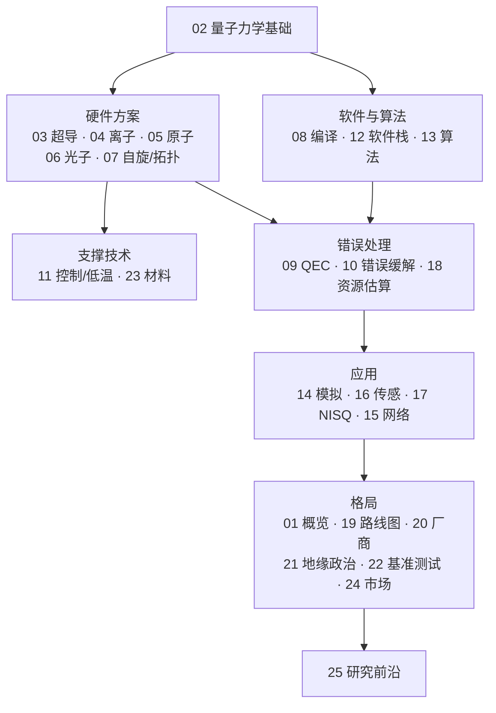

### 阅读路径

不同的读者应以不同的方式阅读本知识库：

1. **硬件工程师路径：** 文件 **02 → 03 → 04 → 05 → 11 → 23**（形式体系 → 超导、囚禁离子、中性原子方案 → 低温/控制 → 材料/制造）。
2. **算法/软件工程师路径：** 文件 **02 → 08 → 12 → 13 → 14**（形式体系 → 编译 → 软件栈 → 算法 → 经典模拟）。
3. **纠错专家路径：** 文件 **09 → 10 → 18**（纠错 → 错误缓解 → 资源估算）。
4. **商业/战略路径：** 文件 **01 → 19 → 20 → 21 → 24**（概览 → 路线图 → 厂商 → 地缘政治 → 市场/投资）。
5. **怀疑式尽职调查路径：** 文件 **10 → 14 → 17 → 19 → 22**（贯穿全库、坦诚且充满限定说明的文件：错误缓解的局限 → 经典模拟 → NISQ 应用 → 路线图可信度 → 基准测试）。

⭐ 标记 **核心文件**（每个不少于 12,000 词，包含完整推导、具名论文/arXiv 编号、器件参数及具名系统）。

---

### 目录

**01. [概览与格局](01_overview_and_landscape.md)** —— 为什么需要量子计算（已证明/被猜想的优势，以及量子计算*不*擅长什么）；复杂性理论（BQP、P、NP、BPP；量子霸权 vs. 量子优势 vs. 量子实用性）；从 Feynman（1982）到阈值以下时代（2024）的时间线；DiVincenzo 判据；产业结构与各国计划。

**02. ⭐ [计算所需的量子力学基础](02_quantum_mechanics_fundamentals_for_computing.md)** —— 量子比特形式体系（态矢量、Bloch 球、密度矩阵、纠缠、测量）；门与通用性（Pauli/Clifford+T、Solovay–Kitaev、Gottesman–Knill、不可克隆）；退相干与噪声（Lindblad、T₁/T₂、Kraus 信道、RB/XEB、串扰/泄漏）；关键定理（QFT、QPE、Holevo）；算例与约定。

**03. ⭐ [超导量子比特](03_superconducting_qubits.md)** —— Josephson 结物理；transmon 与 fluxonium；电路量子电动力学与色散读出；耦合与双量子比特门（跨共振、可调耦合器 CZ）；制造与 TLS 损耗；IBM（Eagle/Condor/Heron）、Google（Sycamore/Willow）；性能以及连接性/布线限制。

**04. ⭐ [囚禁离子量子比特](04_trapped_ion_qubits.md)** —— Paul 阱与运动模式；离子种类与超精细/光学量子比特；冷却、初始化、读出；Mølmer–Sørensen 门；QCCD 穿梭与光子互连；IonQ 与 Quantinuum；保真度纪录以及“更少但更好的量子比特”的经济学。

**05. ⭐ [中性原子量子比特](05_neutral_atom_qubits.md)** —— 光镊与阵列重排；Rydberg 态与阻塞效应；Rydberg CZ 门与全局门并行性；可重构与分区架构；QuEra 的 48 个逻辑量子比特演示；QuEra/Pasqal/Atom Computing；擦除转换。

**06. [光子量子计算](06_photonic_quantum_computing.md)** —— 为什么选择光子（室温、飞行量子比特、光子之间无相互作用）；离散变量与连续变量编码；KLM、基于测量与基于融合的计算；PsiQuantum 与 Xanadu；玻色采样；光子损耗作为决定性的错误来源。

**07. [自旋、拓扑与玻色量子比特](07_other_qubit_modalities.md)** —— 硅自旋量子比特与同位素纯化；拓扑（Majorana）量子比特与 2018 年的撤稿；玻色/猫态量子比特与偏置噪声；**跨方案综合对比表**。

**08. [量子门、线路与编译](08_quantum_gates_circuits_and_compilation.md)** —— 门分解（KAK、Clifford+T、虚拟 Z）；NP 难的 SWAP 路由问题（SABRE）；调度、脉冲级控制、校准；优化（ZX 演算）；噪声感知编译；变分与云端工作流。

**09. ⭐ [量子纠错](09_quantum_error_correction.md)** —— 错误数字化与稳定子形式体系；阈值定理；表面码、解码器（MWPM/Union-Find/ML）、晶格手术、魔态蒸馏；qLDPC 码、色码/Floquet 码/玻色码；Google 的阈值以下演示与 QuEra 的 48 个逻辑量子比特演示。

**10. [量子错误缓解](10_quantum_error_mitigation.md)** —— 缓解 vs. 纠正；零噪声外推、概率性错误消除、测量缓解、动力学解耦、随机编译；IBM 的实用性演示及其经典反驳；指数级采样壁垒。

**11. ⭐ [控制电子学与低温技术](11_control_electronics_and_cryogenics.md)** —— 稀释制冷；布线瓶颈与热负载预算；低温 CMOS 与复用；室温控制栈；实时反馈与解码；激光系统与激光瓶颈；协同扩展的必要性。

**12. ⭐ [量子软件栈](12_quantum_software_stack_and_compilers.md)** —— “泄漏式”软件栈分层；Qiskit、Cirq、PennyLane、Q#、TKET、Braket；编译器内部机制；OpenQASM 与 QIR；变分/混合模式；云端执行与排队；软件作为可及性层的作用。

**13. ⭐ [量子算法深度解析](13_quantum_algorithms_deep_dive.md)** —— Shor 算法（因数分解/离散对数）；Grover 与振幅放大；量子模拟（Trotter 化、qubitization）；VQE 与 QAOA（含贫瘠高原）；HHL 及其注意事项；量子机器学习（以诚实的方式阐述）；加速格局与去量子化。

**14. [量子线路的经典模拟](14_classical_simulation_of_quantum_circuits.md)** —— 态矢量、张量网络、稳定子及低 T 数方法；以纠缠/T 数作为难度轴；Google 的量子霸权声明及其经典反驳；移动靶原则。

**15. [量子网络与通信](15_quantum_networking_and_communication.md)** —— QKD（BB84、E91 及其变体）；量子中继器与纠缠交换；量子存储器瓶颈；纠缠分发（墨子号）；量子互联网协议栈；分布式量子计算；QKD vs. PQC。

**16. [量子传感与计量](16_quantum_sensing_and_metrology.md)** —— 原子钟、NV 色心磁力测量、原子干涉重力测量、SQUID；网络化传感；商业格局——量子优势*已经实现*的一面，也是对量子计算的一个参照。

**17. [NISQ 应用与用例](17_nisq_applications_and_use_cases.md)** —— 对化学、优化（D-Wave 退火）、QML、金融和制药的怀疑式、基于证据的综述；评估清单；诚实的结论：近期价值在于能力建设，而非已被证明的优势。

**18. ⭐ [容错资源估算](18_fault_tolerant_resource_estimation.md)** —— 估算流程；Gidney–Ekerå 的 RSA-2048 估算（约 2000 万量子比特、约 8 小时）及量子化学估算；Azure 资源估算器；敏感性分析与叠加的开销削减手段；诚实的时间线。

**19. [公司路线图与里程碑](19_company_roadmaps_and_milestones.md)** —— 一套*评估路线图可信度的方法论*（历史记录、同行评审 vs. 新闻稿、独立基准测试、指标漂移）；IBM、Google、Quantinuum、IonQ、PsiQuantum、Microsoft、D-Wave 以及中国的各项计划。

**20. ⭐ [厂商与竞争格局](20_vendor_and_competitive_landscape.md)** —— 全栈巨头、纯量子上市公司、专注/新兴方案公司以及软件公司；商业模式、融资、业务进展、护城河；市场结构（收入现实、SPAC 波动、人才/知识产权集中）；“谁会胜出？”这一问题。

**21. [国家计划与地缘政治](21_national_programs_and_geopolitics.md)** —— 美国 NQI、中国、欧盟旗舰计划、英国及其他；出口管制与军民两用；**后量子密码学迁移**与“先收集，后解密”——近期最主要的政策议题。

**22. [基准测试与性能指标](22_benchmarking_and_performance_metrics.md)** —— 为什么基准测试存在争议；原始量子比特数、量子体积、#AQ、CLOPS、RB/XEB、应用基准；核心教训：没有任何单一数字足够，且厂商指标有利于其发明者。

**23. [材料与制造](23_materials_and_fabrication.md)** —— 衬底与超导薄膜（钽的突破）；Josephson 结制造（Dolan 桥）与良率；真空、光子及低温封装制造；同位素纯化；可制造性对比。

**24. [商业、市场与投资](24_business_market_and_investment.md)** —— 市场规模估计的分歧；融资格局与 SPAC 时代；收入现实；企业客户模式；人才市场；作为最大的量子相关活动的 PQC 迁移经济。

**25. ⭐ [未来研究前沿](25_future_research_frontiers.md)** —— 纠错中的开放问题（实时解码、qLDPC、魔态）、硬件中的开放问题（混合体系、材料、控制扩展）以及算法中的开放问题（新的加速、去量子化、QML）；推测性方向（超越稳定子的码、拓扑量子比特、量子-经典协同处理）；诚实的时间线校准。

---

### 关键概念索引

- **DiVincenzo 判据** → 文件 01（§4）
- **BQP 与复杂性理论** → 文件 01（§2）、13（§23、§41）
- **Bloch 球、密度矩阵、纠缠** → 文件 02（第 I 部分）
- **不可克隆定理** → 文件 02（§15）；其对 QEC 的影响 → 文件 09
- **T₁/T₂ 与退相干；Lindblad；Kraus 信道** → 文件 02（第 III 部分）
- **量子 Fourier 变换/相位估计** → 文件 02（§16–17）；在 Shor 算法中的应用 → 文件 13
- **Clifford+T / Gottesman–Knill / 魔态** → 文件 02（§8）、09、14
- **阈值定理** → 文件 09（§6）
- **表面码** → 文件 09（第 III 部分）
- **qLDPC 码** → 文件 09（§15）；对资源的影响 → 文件 18
- **魔态蒸馏** → 文件 09（§13、§35）；T 数成本 → 文件 18
- **Shor 算法** → 文件 13（第 I 部分）；资源估算 → 文件 18；PQC 应对 → 文件 21
- **Grover 算法/振幅放大** → 文件 13（第 II 部分）
- **贫瘠高原** → 文件 13（§16）
- **资源估算** → 文件 18（定量的集大成之作）
- **布线/激光瓶颈；低温 CMOS** → 文件 11
- **跨方案对比表** → 文件 07（§16）
- **经典对比/移动靶纪律** → 文件 14、17、22
- **先收集，后解密；PQC（Kyber/Dilithium）** → 文件 21

---

### 本知识库的主线

纵观全部 25 个文件，我们的承诺是：**技术深度**（工作层面的理解，而非概览）、**诚实**（每项论断都附有其局限）以及**基于证据的评估**（以已证明的结果、资源估算和经典对比为依据——而非营销宣传）。综合的观点是：量子计算是一项**真实的、具有变革性的技术**，具有**已被证明但特定**的指数级加速（因数分解、模拟），以及**已被验证的阈值以下纠错**；其**广泛有用的实现很可能是 2030 年代及以后的事情**，受制于相互关联的研究前沿——这就是炒作与否定之间的**有纪律的中间立场**。请阅读各文件以了解完整的技术展开；回到本索引进行导航，并通过网络搜索重新核实变化迅速的具体细节。

---

<a id="f01"></a>

## 文件 01：量子计算——概览、战略背景与通往实用化之路

> 📄 **原文链接（English original）：[01_overview_and_landscape.md](01_overview_and_landscape.md)**　｜　[↑ 返回目录](#toc)


> **范围。** 本文件是一个面向硬件与算法工程师的技术知识库的入口。它阐述了：量子计算为什么重要，它擅长与不擅长什么，使该领域成为严谨学科而非空想的计算复杂性理论基础，从 Feynman 到容错时代的历史脉络，衡量每一种物理平台的 DiVincenzo 判据，以及产业与政府格局的结构。后续文件将以工程实践的深度逐一展开各个主题。凡涉及快速变化的经验性事实（当前量子比特数量、最新保真度记录）之处，均已标注需要重新核实，因为该领域新闻稿的发布节奏快于任何静态文档。

---

### 1. 为什么需要量子计算——以及为什么不是万能的

量子计算常被错误地宣传为通用加速器：一种能加速"一切"的更快的计算机。这种说法是错误的，而正确理解这一点，是进入该领域的工程师所能做出的最重要的一次校准。量子计算机是一种专用设备，它只对**一小类、特征明确的问题**提供显著加速，这些问题的数学结构恰好与量子系统自然执行的操作相契合——即复数概率幅的干涉，以及用多项式数量的物理操作来操纵指数级庞大的状态空间。

#### 1.1 具有已证明或被猜想的量子优势的问题

经过大约四十年的研究，真正存在已被证明或被强烈猜想的有意义量子加速的问题类别，只有寥寥几类：

- **整数分解与离散对数（Shor，1994）。** Shor 算法可在关于 *n* 的多项式时间内分解一个 *n* 比特整数（大致为 O(*n*²–*n*³)，取决于算术实现方式），而已知最好的经典算法——通用数域筛法——的运行时间是亚指数但超多项式的 exp(O(*n*^{1/3} log^{2/3} *n*))。这是典型的**指数级**加速；由于 RSA、Diffie–Hellman 和椭圆曲线密码的安全性恰恰建立在这些问题的经典困难性之上，Shor 算法是该领域对政策与安全影响最大的单一成果（算法见文件 13，后量子密码学的应对见文件 21）。
- **无结构搜索（Grover，1996）。** Grover 算法在 *N* 个元素中找到一个被标记项只需 O(√*N*) 次查询，而经典方法需要 O(*N*)——这是黑盒模型下可证明最优的**二次**加速。二次加速是真实的，但远不如指数加速显著，并且（如文件 13 所讨论）常数因子和纠错开销往往会在现实的问题规模下抹去这一优势。
- **量子模拟（Feynman，1982）。** 模拟量子多体系统的动力学和基态——分子、强关联材料、格点规范理论——在经典计算上是指数级困难的，因为对于 *n* 个粒子/模式，希尔伯特空间维度按 2ⁿ 增长。量子计算机自身的状态空间以同样方式增长，使其成为天然的载体。这被广泛认为是科学上最站得住脚的*中期*应用（文件 13 和 17）。
- **某些优化与线性代数子程序（猜想）。** 用于组合优化的 QAOA（Farhi et al.，2014）和用于线性方程组的 HHL（Harrow–Hassidim–Lloyd，2009）等算法被广泛研究，但它们相对于最佳经典启发式算法的*实际*优势是**有争议且未被证明的**——本知识库将反复且坦率地回到这一点（文件 13、17）。

#### 1.2 量子计算机*不*擅长什么

同样重要的是反面。对于绝大多数经典工作负载，量子计算机**没有通用的加速**：

- 它们不会加速任意算术、数据库、网络服务、视频编码，或数据中心实际所做的大部分工作。
- 将经典数据*读入*量子态（"态制备"/QRAM 瓶颈）本身就可能花费与数据规模成线性的时间，这会悄然摧毁许多宣称的加速（HHL 的注意事项，文件 13）。
- 将*答案读出*会使量子态坍缩，只能得到一个样本，而非完整的振幅向量——因此，那些产生编码了指数级庞大答案的量子态的算法，往往无法高效地提取该答案。
- 对于最佳经典算法本身已是小指数多项式的问题，一旦计入纠错量子门每次操作的巨大开销，即使是二次量子加速也很少能胜过经典硬件。

坦率的一句话总结：**量子计算机是针对具有隐藏的代数/周期结构或内在量子结构的问题的加速器，而不是更快的经典计算机。**

---

### 2. 复杂性理论框架


**量子加速的位置——复杂性格局：**

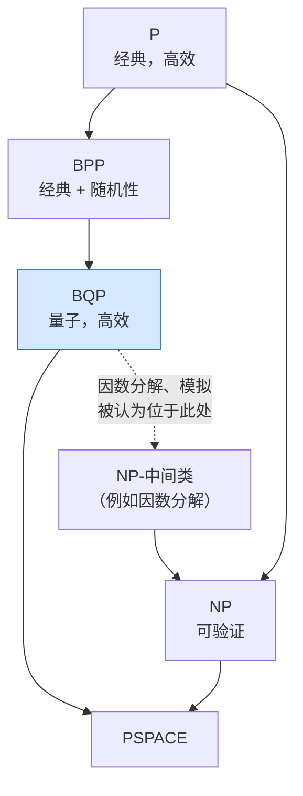

*BQP（可扩展量子计算机能够高效求解的问题类）被认为严格包含 BPP，但不包含全部 NP——量子计算机并非"在一切方面都更快"。*

量子计算之所以有别于永动机式的炒作，是因为其核心论断建立在计算复杂性理论之上。

#### 2.1 BQP 及其相邻复杂度类

**BQP**（有界错误量子多项式时间，Bounded-error Quantum Polynomial time）是量子计算机能在多项式时间内以低于 1/3 的有界错误概率求解的判定问题类（通过重复可将错误概率放大到指数级小）。它是 **BPP**（有界错误概率多项式时间，Bounded-error Probabilistic Polynomial time）的量子类比，后者是经典随机化计算机能在多项式时间内求解的问题类。

已知与被相信的关系：

- **P ⊆ BPP ⊆ BQP。** 经典计算机（确定性或随机化）能高效完成的任何事，量子计算机也能高效完成——量子计算机至少同样强大。
- **BQP ⊆ PSPACE**（更严格地，BQP ⊆ PP ⊆ P^{#P}）。量子计算机无法求解需要超多项式空间的问题；它们并非魔法。特别地，**BQP 包含 NP 既未被证明，也不被相信**——量子计算机*并不*被期望能高效求解 NP 完全问题。Grover 的二次加速是无结构 NP 搜索的通用最佳结果，远不足以使 NP 完全问题变得易解。
- **BQP 与 NP** 之间的关系被认为是*不可比较*的：存在被认为属于 BQP 但超出 NP 高效可及范围的问题，反之亦然。

#### 2.2 为什么因数分解是承重性的例子

整数分解之所以成为奠基性的激励成果，恰恰是因为它所处的位置：

- 因数分解（作为判定问题 FACTOR）属于 **NP ∩ co-NP**，并且属于 **BQP**（Shor）。
- 它**不确知属于 P**，也**不被认为是 NP 完全的**（若它是 NP 完全的，则在合理假设下多项式层次将发生坍缩）。

因此，因数分解这个问题（a）被认为在*经典*上困难，（b）在*量子*上容易，并且（c）具有巨大的现实重要性。它是最清晰的存在性证明，说明 BQP ⊋ BPP 会带来真实世界的"利齿"——而整个后量子密码学迁移（文件 21）就是一场数十亿美元的赌注，赌这一差距是真实存在的。

#### 2.3 量子霸权、量子优势与量子实用性——精确定义

这三个术语在媒体报道中经常被混淆。以下是精确的工作定义：

- **量子霸权（Quantum supremacy）**（Preskill 于 2012 年提出）：量子设备执行*任何*定义明确的、当前最佳经典计算机无法完成的计算任务，*无论该任务是否有用*。Google 2019 年的 Sycamore 随机电路采样实验在一个刻意构造的采样任务上宣称了霸权。该术语强调的是跨越阈值的演示，而非实用性。
- **量子优势（Quantum advantage）**：常与霸权互换使用，但越来越多地专指量子设备在至少具有*一定*实际相关性（即使很窄）的任务上优于经典方法。其边界模糊且存在争议。
- **量子实用性（Quantum utility）**（由 IBM 于 2023 年推广）：量子计算机针对具有真正科学或商业价值的问题，在经典暴力方法难以胜任的规模上给出可靠结果——*不一定*声称经典方法是*不可能的*，只是说量子方法是一种可信的工具。IBM 2023 年的"容错之前的实用性"论文（文件 10）是旗舰性的、也是有争议的例子。

关键而坦率的一点（将在文件 10、14 和 17 中回到）：**每一项这样的声明都是相对于声明当时可用的最佳经典方法来定义的**，而经典方法是一个移动的靶子。若干轰动性的霸权/优势声明已被后续经典算法的改进大幅削弱。工程师应将任何单一的优势声明视为暂定的，并像关注原始声明一样仔细地跟踪经典方面的反驳。

---

### 3. 领域时间线

#### 3.1 理论起源（1980 年代）

- **Paul Benioff（1980）** 描述了图灵机的量子力学模型，表明计算原则上可以由量子系统执行。
- **Richard Feynman（1981 年报告，1982 年发表），"Simulating Physics with Computers"。** Feynman 的论点：在经典计算机上模拟量子系统似乎需要指数级资源，所以也许我们应该用量子力学元件来*构建*计算机，以高效地模拟量子力学。这是量子模拟的奠基性动机，量子模拟至今仍是最站得住脚的应用类别。
- **David Deutsch（1985）** 形式化了**通用量子计算机**（量子图灵机）和量子电路模型，并给出了第一个量子算法胜过任何确定性经典算法的问题实例（Deutsch 问题，后推广为 Deutsch–Jozsa 问题）。Deutsch 指出，量子计算机原则上可以模拟任何物理过程——在精神上即"量子 Church–Turing 论题"。

#### 3.2 算法突破（1990 年代）

- **Peter Shor（1994）**：用于因数分解和离散对数的多项式时间量子算法。这使量子计算从理论上的好奇之物转变为一个具有国家安全意义并获得大量资金支持的领域。
- **Lov Grover（1996）**：无结构搜索的二次加速。
- **Shor（1995）与 Steane（1996）**：第一批**量子纠错码**，证明了尽管存在不可克隆定理，量子信息仍可被保护以抵御退相干——这是没有它就不可能实现可扩展量子计算的概念性突破。
- **阈值定理（Aharonov–Ben-Or、Kitaev、Knill–Laflamme–Zurek，1990 年代末）**：如果物理错误率低于某个常数阈值，则可以用多对数级开销进行任意长的量子计算。这是整个容错路线图的理论许可（文件 9）。

#### 3.3 DiVincenzo 时代与物理实现（2000 年代）

- **David DiVincenzo（2000）** 阐明了一个物理系统要成为可行的量子计算机所必须满足的判据（第 4 节），为实验物理学家提供了一份检查清单。
- 2000 年代出现了跨多种技术路线的首批小规模演示：NMR（Shor 算法分解 15，2001——后来被认为在有用规模上缺乏真正的纠缠）、囚禁离子（Wineland、Blatt 课题组），以及超导 **transmon** 量子比特的发明（Koch et al.，2007；文件 3），它成为占主导地位的超导设计。

#### 3.4 NISQ 时代（2018 年至今，相互重叠）

- **John Preskill（2018），"Quantum Computing in the NISQ Era and Beyond"（arXiv:1801.00862）** 提出了 **NISQ——含噪声中等规模量子（Noisy Intermediate-Scale Quantum）**，用以描述当时及近期的状态：拥有 50–1000+ 个物理量子比特、*没有*完整纠错、噪声限制电路深度的设备。Preskill 的表述刻意保持冷静：NISQ 设备可能在人为构造的任务上展示量子优势，也*可能*找到小众应用，但并非终点。
- **Google Sycamore（2019）**：第一个量子霸权声明（随机电路采样），以及随后经典模拟方面的你来我往（文件 14）。

#### 3.5 容错路线图时代（2023 年至今）

2023–2024 年前后，该领域的关注点发生了决定性转变，从"有多少物理量子比特？"转向"**有多少*逻辑*（经纠错的）量子比特，逻辑错误率是多少？**"：

- **Google 的"低于阈值"演示（2024，arXiv:2408.13687）**：将表面码距离从 *d*=3 增加到 5 再到 7，逻辑错误率*单调下降*——这是阈值定理在大规模实践中确实有效的第一个令人信服的实验证实（文件 9）。
- **IBM 的双变量自行车（bivariate bicycle）qLDPC 码（2024，arXiv:2308.07915）**：物理比特到逻辑比特的开销远低于表面码，重塑了对资源估算的预期（文件 9、18）。
- **QuEra/Harvard 48 逻辑量子比特中性原子演示（2023，arXiv:2312.03982）**（文件 5、9）。

当前时代的特征是从*演示*纠错转向*扩展*纠错。

---

### 4. DiVincenzo 判据详解


**作为就绪度检查清单的五条 DiVincenzo 判据（外加两条网络判据）：**

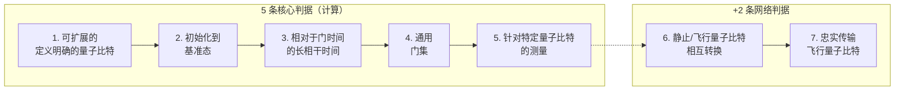

*没有哪个平台能轻松地在全部五条上都拿满分；每种技术路线都在不同判据之间做取舍
（例如，离子在相干性上胜出，超导在门速度上胜出）。*

DiVincenzo 的五条判据（外加两条网络判据）仍然是评估文件 3–7 中每种技术路线的标准评分准则。

1. **具有定义明确的量子比特的可扩展物理系统。** "定义明确"意味着量子比特的哈密顿量——能级、与控制场的耦合以及与其他量子比特的耦合——是精确已知的。"可扩展"意味着增加量子比特不需要物理上不可能的资源。这一判据正是各技术路线出现显著分歧之处：超导和自旋量子比特是制造出来的（可通过光刻扩展，但每个都需要控制布线，文件 11）；囚禁离子和中性原子天然完全相同（没有制造差异），但受限于光学/激光/真空条件而难以扩展（文件 4、5）。
2. **将量子比特态初始化**到简单基准态（如 |00…0⟩）的能力，且保真度高。囚禁离子和中性原子通过光泵浦初始化（>99.9%）；超导量子比特通过被动热化或主动复位初始化。
3. **足够长的相关退相干时间**，远长于门操作时间。品质因数是比值 T₂/t_gate（相干时间除以门时间）——即量子比特遗忘其状态之前可进行的操作次数。起决定作用的是这个比值而非原始的 T₂，这也是囚禁离子（T₂ 很长，门很慢）与超导量子比特（T₂ 很短，门很快）尽管绝对数值相差悬殊仍可相互竞争的原因（文件 2、3、4）。
4. **一组通用量子门。** 任何量子计算都必须能分解为可用的门。实际上，这意味着一组单量子比特旋转加上一个两量子比特纠缠门（用于容错的 Clifford+T 门集，文件 2）。
5. **针对特定量子比特的测量能力**——以高保真度读出单个量子比特状态的能力。超导量子比特通过谐振腔进行色散读出（文件 3）；离子/原子使用依赖于态的荧光（文件 4、5）。

另有两条**网络判据**（与量子通信及模块化/分布式计算相关，文件 15）：

6. **静止量子比特与飞行量子比特相互转换的能力**——将处理（物质）量子比特的状态映射到光子上再映射回来。
7. **在指定位置之间忠实传输飞行量子比特的能力。**

最后这两条是量子网络（文件 15）和模块化扩展架构（文件 4、6）的基础。

---

### 5. 领域现状

> **核实说明。** 下面的具体数字反映的是知识截止时间以及该领域截至 2024–2025 年有据可查的发展轨迹。量子比特数量和保真度记录以数月为周期通过新闻稿更新；在 2026 年及以后引用任何具体数字之前，请通过网络搜索重新核实。

#### 5.1 各技术路线的量子比特数量（数量级，当前时代）

- **超导**：单芯片上有数百到约 1000+ 个物理量子比特（IBM Condor，1121 个量子比特；Google Willow，约 105 个量子比特，但针对纠错质量而非数量进行了优化）。2023 年以后的趋势是朝向*质量与模块化*，而非单片规模（文件 19）。
- **囚禁离子**：每个模块有数十个极高保真度的量子比特（Quantinuum H2，约 56 个量子比特；IonQ 系统引用的是"算法量子比特"（algorithmic qubits）而非原始数量，文件 22），超越单链限制的路径是模块化/联网扩展。
- **中性原子**：**最大的原始阵列**——1000+ 个原子（Atom Computing 的 1,225 原子阵列，2023；QuEra 的可重构阵列）——因为增加原子主要是光学/激光功率的扩展问题（文件 5）。
- **光子**：专用采样机器（Xanadu Borealis、USTC Jiuzhang）以及 PsiQuantum 着眼长远的百万量子比特基于融合（fusion-based）的押注（文件 6）。
- **自旋（硅）**：量子比特数量较少（学术/工业演示中为个位数到几十个），但对最终实现*半导体代工厂*可制造性的主张最有力（文件 7）。

#### 5.2 错误率

各技术路线已演示的最佳**两量子比特门保真度**（近似值，前沿水平）：囚禁离子和中性原子 >99.5–99.9%；超导在最佳器件上约 99.5–99.9%；硅自旋 >99%（2022 年演示了高于阈值）。在领先的各技术路线中，单量子比特门保真度通常超过 99.9%。这些数字处于表面码阈值（电路级约 1%）*附近或略低于*该阈值，这就是为什么现在可以进行低于阈值的演示（文件 9），但裕度仍然很薄。

#### 5.3 NISQ 与容错的二分

- **NISQ 设备**直接在物理量子比特上运行电路，没有纠错。噪声随电路深度累积，将有用深度限制在数百到低数千个两量子比特门。NISQ 依赖**错误缓解**（文件 10）——通过经典后处理来估计无噪声期望值，代价是指数级的采样开销。NISQ 明确*不是*通往容错的路径。
- **容错设备**通过纠错码（文件 9）将每个*逻辑*量子比特编码到许多*物理*量子比特中，主动测量错误症状并进行纠正，使逻辑错误率随码距呈指数下降。这是 Shor 算法和大型量子化学模拟成为可能的体系——但它需要数千到数百万个物理量子比特（文件 18）。

#### 5.4 为什么逻辑量子比特与物理量子比特有根本区别

**物理量子比特**是单个二能级量子系统，每个门的原始错误率约为 0.1–1%。**逻辑量子比特**是编码在许多物理量子比特上的集体的、经纠错的自由度，其错误率可以通过增大码距（从而增加物理量子比特数）被压到任意低。表面码上距离为 *d* 的逻辑量子比特大约需要 2*d*²–1 个物理量子比特，因此一个高质量的逻辑量子比特可能要花费约 1000 个物理量子比特。**因此，一台 1000 物理量子比特的机器并不是一台 1000 逻辑量子比特的机器——它可能只是一台*个位数*逻辑量子比特的机器。** 这一区别是整个领域中最重要的定量现实检验，也是为什么"量子比特数量"的头条新闻（文件 22）在缺少保真度和编码开销背景的情况下几乎毫无意义（文件 9、18）。

---

### 6. 产业结构概览

**量子计算价值链（底部 = 物理，顶部 = 终端用户）：**

```text
   ┌───────────────────────────────────────────────────────────┐
   │  END USERS: pharma, finance, materials, logistics, gov     │
   ├───────────────────────────────────────────────────────────┤
   │  ALGORITHMS & APPLICATIONS: chemistry, optimization, ML    │
   ├───────────────────────────────────────────────────────────┤
   │  SOFTWARE / COMPILERS: Qiskit, Cirq, TKET, Q#, Braket      │
   ├───────────────────────────────────────────────────────────┤
   │  ERROR CORRECTION / CONTROL: decoders, calibration, FPGAs  │
   ├───────────────────────────────────────────────────────────┤
   │  QPU HARDWARE: superconducting, ion, atom, photonic, spin  │
   ├───────────────────────────────────────────────────────────┤
   │  ENABLING TECH: dilution fridges, lasers, cryo-CMOS, fab   │
   └───────────────────────────────────────────────────────────┘
```

商业与研究生态系统（详见文件 19–24）可划分为若干层次：

#### 6.1 按技术路线划分的硬件公司

- **超导**：IBM、Google Quantum AI、Rigetti、IQM（芬兰）、Origin Quantum（中国）、Alice & Bob（猫态量子比特，文件 7）。
- **囚禁离子**：IonQ、Quantinuum（Honeywell）、Alpine Quantum Technologies、Universal Quantum、Oxford Ionics、eleQtron。
- **中性原子**：QuEra、Pasqal、Atom Computing、Infleqtion（ColdQuanta）。
- **光子**：PsiQuantum、Xanadu、ORCA Computing、PsiQuantum。
- **自旋**：Intel、Diraq（澳大利亚）、Quantum Motion（英国），以及学术支柱（Delft/QuTech、UNSW）。
- **退火**：D-Wave（一种独特的、非门模型范式；文件 17、19）。

#### 6.2 软件/算法公司

Qiskit（IBM）、Cirq（Google）、PennyLane（Xanadu）、Q#/Azure QDK（Microsoft）、TKET（Quantinuum），以及纯软件公司：Q-CTRL（控制工程）、Classiq（电路综合）、Zapata（2024 年停止运营）、QC Ware、Quantum Machines（控制硬件）。见文件 12。

#### 6.3 国家实验室与政府项目

美国 DOE 国家量子信息科学研究中心（Q-NEXT、C²QA、SQMS、QSC、QSA）、NIST（在囚禁离子和计量方面处于领先地位）、世界各地的学术支柱（Delft/QuTech、USTC、Innsbruck、Maryland/JQI、Yale、Harvard/MIT）。见文件 21。

#### 6.4 云接入提供商

- **IBM Quantum Network / Platform**：通过 Qiskit Runtime 直接访问 IBM 的超导机群。
- **AWS Braket**：硬件无关的市场（IonQ、Rigetti、QuEra、IQM），外加 AWS 自己的猫态量子比特研究。
- **Microsoft Azure Quantum**：市场（Quantinuum、IonQ、Pasqal、Rigetti、Atom Computing），外加 Microsoft 的拓扑项目。
- **Google Quantum AI**：主要提供研究性访问，而非广泛的商业云产品。

#### 6.5 投资格局

该行业经历了一波 **SPAC 公开上市（2021–2022）**：IonQ（NYSE: IONQ）、Rigetti（Nasdaq: RGTI）、D-Wave（NYSE: QBTS），随后是很大程度上与技术里程碑脱钩的高股价波动。私募巨额融资（PsiQuantum 融资超过 10 亿美元，包括澳大利亚主权共同投资）和大型政府项目日益与私募风险投资并驾齐驱，成为主要资金来源。冷静的现实（文件 24）是：整个行业的*经常性生产*收入相对于估值仍然很小；大部分"收入"来自研发服务、政府合同和试点项目。

---

### 7. 主要组织与国家倡议

- **IEEE Quantum**——标准与社区（例如 IEEE P7130 量子术语标准）。
- **Quantum Economic Development Consortium（QED-C）**——一个美国产业联盟（以 NIST 为依托），在数百家成员公司之间协调标准、劳动力和供应链方面的工作。
- **IBM Quantum Network**——由企业、实验室、大学和初创公司组成的联盟，享有访问 IBM 硬件的特权。
- **Quantum Internet Alliance**——一个欧洲联盟，致力于建设大陆级量子网络试验台（文件 15）。
- **美国国家量子倡议法案（National Quantum Initiative Act，2018）**——协调 NSF、DOE 和 NIST 的美国联邦资金，授权五年内超过 12 亿美元，并设立了 DOE 研究中心（文件 21）。
- **欧盟量子旗舰计划（EU Quantum Flagship）**——一项 10 亿欧元、为期十年（2018–2028）的欧洲协调研究计划，涵盖计算、通信、模拟和传感。
- **中国的量子投入**——大规模、国家主导的资金支持，以 USTC 为中心（九章光子和祖冲之超导的霸权项目）；其总额数字被广泛引用，但并未透明披露（文件 21）。
- **英国国家量子技术计划（UK National Quantum Technologies Programme，2014 年起）**——最早的持续性国家项目之一，支撑起多元化的初创企业生态（Oxford Ionics、Universal Quantum、ORCA）。
- **国家项目**还包括德国（2021 年后大量资金投入）、法国（国家战略，支撑 Pasqal 和 Alice & Bob）、加拿大、澳大利亚（PsiQuantum 共同投资、Silicon Quantum Computing）、日本、韩国和印度。

---

### 8. 如何阅读本知识库

本知识库的组织方式使工程师既可以线性阅读，也可以遵循针对特定角色的路径（README 提供了明确的阅读路径）。贯穿全部 25 个文件的主线是对**技术诚实**的承诺：每项优势声明都附有其注意事项，每份路线图都附有其历史记录，每个"头条数字"都附有使其有意义或无意义的背景。

- **物理基础**：文件 2（后续每个文件所假定的形式体系）。
- **硬件技术路线**：文件 3（超导）、4（囚禁离子）、5（中性原子）、6（光子）、7（自旋、拓扑、玻色），共享基础设施见文件 11（低温/控制）和 23（材料/制造）。
- **软件与算法**：文件 8（编译）、12（软件栈）、13（算法）、14（经典模拟）。
- **纠错与资源估算**：文件 9（QEC）、10（错误缓解）、18（资源估算）、22（基准测试）。
- **应用与网络**：文件 15（网络）、16（传感）、17（NISQ 应用）。
- **商业、路线图与地缘政治**：文件 19（路线图）、20（厂商）、21（国家项目）、24（市场/投资）。
- **前沿**：文件 25（开放问题与未来十年）。

反复出现的元教训——在此陈述并在全书中得到强化——是：量子计算是一个严谨理论（复杂度类、阈值定理、资源估算）与强烈商业炒作并存的领域，工程师的职责是兼顾两者：认真对待真实的、已被证明的成果，同时对每一项"优势"声明施以与该领域最优秀的从业者自己所采用的相同的怀疑性、以经典方法为基准的审视。

---

*交叉引用：复杂性理论与算法（文件 13）；纠错与阈值定理（文件 9）；将算法转换为物理量子比特数的资源估算（文件 18）；诚实/尽职调查主线（文件 10、14、17、22）；国家项目与后量子密码学（文件 21）。*

---

### 附录——知识库导览

本概览开启了一个包含 25 个文件的知识库（外加 README 索引）。反复出现的主线是**诚实的、技术性的、基于证据的评估**——每项优势声明都附有其注意事项，每份路线图都附有其历史记录，每个头条数字都附有其背景。三点导览说明：

- **物理与逻辑的区别（§5.4）是该领域最重要的定量现实检验**，并在全书中反复出现（文件 9、18、22）：一台机器的有用性取决于其*逻辑*量子比特和错误率，而不是其物理量子比特数。一台 1000 物理量子比特的机器可能只能容纳少数几个逻辑量子比特。
- **诚实/尽职调查类文件（10、14、17、19、22）**构成一条贯穿全书的"怀疑式"阅读路径（见 README）——错误缓解的局限、经典模拟、NISQ 应用、路线图可信度和基准测试——它灌输了本知识库所示范的对量子优势声明进行严格评估的方法。
- **资源估算（文件 18）**是定量的压轴篇章，它将硬件（文件 3–7）、纠错（文件 9）、算法（文件 13）和基础设施（文件 11）组合成具体的物理量子比特数和时间线，这些定义了通往实用化之路——这是对"需要什么、何时能实现？"的诚实回答。

综合观点（贯穿各文件展开）：量子计算是一项**真实的、变革性的技术**，具有**已被证明但特定的**指数加速和**经验证的低于阈值的纠错**，其**广泛有用的实现很可能是 2030 年代及以后的发展**，受制于相互关联的研究前沿（文件 25）——既不是炒作所称的迫在眉睫的革命，也不是可以轻易否定的不可能，而是严谨的、以定量为基础的中间立场。请继续阅读文件 02，了解后续每个文件所假定的形式体系，或遵循 README 中针对特定角色的阅读路径之一。

#### 扩展说明：从不可能到演示的历程

该领域的决定性历程（见文件 1、9）始于 Feynman 1982 年的动机和 1994 年"退相干使量子计算不可能"的反对意见（Landauer 等人），经过 1995–1998 年量子纠错和阈值定理的发现（文件 9）——它驳斥了不可能性——直到 2024 年*低于阈值*纠错的实验演示（Google Willow，文件 9），在实践中验证了阈值定理。这段约 30 年的历程——从"不可能"到"已演示"——是物理学和计算机科学中伟大的持续性研究项目之一，并奠定了本知识库所示范的有纪律的乐观态度：容错的*原理*现已得到实验验证（文件 9），通往有用机器的*路径*已被量化（资源估算，文件 18），剩下的工作是*扩展与工程*（相互关联的前沿，文件 25），时间线漫长但有界（广泛实用化可能在 2030 年代及以后，文件 18）。这一历程也告诫人们避免两个极端：不可能性的反对意见是*错误的*（纠错是有效的），但变革性应用仍然*还需数年*（文件 18）——因此诚实的姿态是既肯定真实的、来之不易的进展，又保持现实的时间线预期，这是本知识库从本概览到文件 25 的前沿始终坚持的经过校准的中间立场。

#### 一句话导向

量子计算为结构化问题提供已被证明但特定的指数加速（因数分解、模拟，文件 13）——而非通用加速——通过 DiVincenzo 判据在相互竞争的硬件技术路线上实现（文件 3–7），由纠错（文件 9）提供保护，并由资源估算（文件 18）加以量化，其广泛有用的实现很可能是 2030 年代及以后的发展，受制于相互关联的前沿（文件 25）——这是本知识库自始至终所坚持的、介于炒作与否定之间的严谨中间立场。

---

<a id="f02"></a>

## 文件 02：量子计算的量子力学基础

> 📄 **原文链接（English original）：[02_quantum_mechanics_fundamentals_for_computing.md](02_quantum_mechanics_fundamentals_for_computing.md)**　｜　[↑ 返回目录](#toc)


> **⭐ 核心文件。** 本文是后续所有文件的数学基石。它阐述量子比特形式体系、量子门与通用性、退相干与噪声，以及关键的信息论定理——其详细程度足以让硬件或算法工程师能够*定量推理*，而不仅仅是认识这些术语。所有物理实现方案文件（3–7）、编译文件（8/12）、算法文件（13）以及纠错文件（9）都假定读者已熟练掌握本文内容。记号约定：|·⟩ 表示右矢（ket，列态矢量），⟨·| 表示左矢（bra，其共轭转置），⟨φ|ψ⟩ 表示内积，|ψ⟩⟨φ| 表示外积，⊗ 表示张量积，† 表示共轭转置，Tr 表示迹。

---

### 第一部分 — 量子比特形式体系


**布洛赫球（Bloch sphere）——单个量子比特的几何图像：**

```text
                 |0>   (north pole, +z)
                  |
                  |     . |psi> = cos(θ/2)|0> + e^{iφ} sin(θ/2)|1>
                  |    /
                  |   /  θ  (polar angle -> amplitude)
                  |  /
                  | /
    -x ___________|/_____________ +x
                 /|
                / |
               /  |   φ (azimuth -> relative phase)
              /   |
           +y     |
                  |
                 |1>   (south pole, -z)
```

*纯态位于球面上（半径为 1）；混合态位于球内；完全混合态 I/2 位于球心。量子门是这个球的旋转。*

#### 1. 态矢量与希尔伯特空间

单个量子比特的纯态存在于二维复希尔伯特空间 ℋ ≅ ℂ² 中。计算基态为

|0⟩ = (1, 0)ᵀ,  |1⟩ = (0, 1)ᵀ,

一般的纯态是归一化的复叠加态

|ψ⟩ = α|0⟩ + β|1⟩,  α, β ∈ ℂ,  |α|² + |β|² = 1.

系数 α 和 β 是**概率幅**（probability amplitudes）：在计算基下测量时，结果为 0 的概率是 |α|²，结果为 1 的概率是 |β|²（玻恩定则，第 9 节）。归一化条件 |α|² + |β|² = 1 保证这些概率之和为 1。振幅是复数，区分量子概率与经典概率、并使干涉成为可能的——干涉是一切量子加速的引擎——正是振幅之间的*相位*关系，而不仅仅是它们的模。

一个微妙但重要的要点：态矢量的整体（全局）相位在物理上不可观测。态 |ψ⟩ 与 e^{iγ}|ψ⟩ 对于*每一种*可能的测量都给出相同的测量统计，因此它们代表同一个物理态。物理上重要的是基分量之间的*相对*相位。这意味着单个量子比特真正的态空间并不是满足 |α|²+|β|²=1 的整个 ℂ²（那将是 ℝ⁴ 中的 3 维球面 S³），而是对全局相位取商之后的空间，即 2 维球面 S²——布洛赫球。

#### 2. 布洛赫球

单个量子比特有两个复振幅（四个实参数），受归一化（一个约束）和全局相位无关性（再一个约束）的限制，因此它恰好有**两个实自由度**。这些自由度可以参数化为两个角度，从而得到著名的**布洛赫球**表示：

|ψ⟩ = cos(θ/2) |0⟩ + e^{iφ} sin(θ/2) |1⟩,  θ ∈ [0, π], φ ∈ [0, 2π).

这里 θ 是单位球面上一点的极角，φ 是方位角。几何对应关系如下：

- 北极（θ=0）是 |0⟩；南极（θ=π）是 |1⟩。
- 赤道上的点（θ=π/2）是等模叠加态 (|0⟩ + e^{iφ}|1⟩)/√2；例如 +x 是 |+⟩ = (|0⟩+|1⟩)/√2，−x 是 |−⟩ = (|0⟩−|1⟩)/√2，+y 是 |+i⟩ = (|0⟩+i|1⟩)/√2。
- **对径点是正交态。** 注意，物理上正交的态（在希尔伯特空间中相差 90°）在布洛赫球上相距 180°——参数化中的二分之一因子（θ/2）是自旋-½ / SU(2) 结构的标志。

布洛赫矢量为 **r** = (sin θ cos φ, sin θ sin φ, cos θ)，该态的密度矩阵（第 5 节）为 ρ = (I + **r**·**σ**)/2，其中 **σ** = (X, Y, Z) 是泡利矩阵。纯态的 |**r**| = 1（球面）；混合态的 |**r**| < 1（球内）；最大混合态 ρ = I/2 位于球心。

**单量子比特门即旋转。** 每个单量子比特酉算符在忽略全局相位的情况下，都是布洛赫球绕某个轴 **n̂** 转过某个角度的旋转。这一几何图像对直觉不可或缺：Hadamard 门是绕轴 (x+z)/√2 的 180° 旋转；Z 门是绕 z 轴的 180° 旋转；R_z(λ) 门是绕 z 轴旋转 λ。硬件控制脉冲（文件 3、4、5、11）本质上就是被设计来实现指定的布洛赫球旋转，而脉冲的不完美则表现为过旋转/欠旋转或轴误差。

#### 3. 密度矩阵与混合态

纯态矢量不足以描述现实的量子比特，因为现实的量子比特与环境纠缠，并且受到经典不确定性的影响。一般的描述是**密度矩阵**（密度算符）ρ，它是一个厄米、半正定、迹为 1 的算符：

ρ = Σᵢ pᵢ |ψᵢ⟩⟨ψᵢ|,  pᵢ ≥ 0, Σᵢ pᵢ = 1.

它表示一个*统计系综*：系统以概率 pᵢ 处于纯态 |ψᵢ⟩。关键性质：

- **厄米性**：ρ = ρ†。
- **单位迹**：Tr(ρ) = 1（概率之和为 1）。
- **正定性**：对所有 |φ⟩ 有 ⟨φ|ρ|φ⟩ ≥ 0（不存在负概率）。

**纯态与混合态。** 若对某个单一的 |ψ⟩ 有 ρ = |ψ⟩⟨ψ|，则该态是**纯态**——等价于 ρ² = ρ（ρ 是投影算符）——否则为**混合态**。**纯度**（purity）为

γ = Tr(ρ²),

对纯态它等于 1，对 d 维系统的最大混合态它等于 1/d（单个量子比特为 1/2）。纯度是与基无关的标量，用来量化态的"分散"程度；在退相干作用下它会降低。与之密切相关的是**线性熵** S_L = 1 − Tr(ρ²)，以及**冯·诺依曼熵** S(ρ) = −Tr(ρ log ρ)，后者对纯态为零，对最大混合态等于 log d。

**为什么密度矩阵不可或缺。** 以下三种不同的物理情形都需要使用 ρ 而非态矢量：(1) *经典不确定性*——我们以经典概率制备了若干态中的某一个；(2) *与不可访问的环境纠缠*——更大的纠缠纯态的某个子系统的约化态一般是混合的（第 4、7 节）；(3) *退相干*——随时间产生 (2) 的动力学过程，它把纯态变成混合态（第三部分）。与有损耗的二能级系统缺陷耦合的 transmon 量子比特，或运动模式被热激发的囚禁离子，都必须用密度矩阵来描述。整个噪声信道理论（第 11 节）和纠错理论（文件 9）都是用密度矩阵来表述的。

**混合态的布洛赫球体几何。** 对单个量子比特，ρ = (I + **r**·**σ**)/2，且 |**r**| ≤ 1。ρ 的本征值为 (1 ± |**r**|)/2，因此纯度为 γ = (1 + |**r**|²)/2。退相干使 |**r**| 向 0 收缩（T₁、T₂ 过程确确实实地把布洛赫矢量向球心或 z 轴收缩；第 10 节）。

#### 4. 多量子比特系统与张量积

*n* 个量子比特的态空间是 *n* 个单量子比特空间的张量积：

ℋ_n = ℂ² ⊗ ℂ² ⊗ ⋯ ⊗ ℂ² = ℂ^{2ⁿ}.

其维数是 **2ⁿ**——随量子比特数呈指数增长。计算基态由 *n* 位比特串标记：|x₁x₂…xₙ⟩ = |x₁⟩ ⊗ |x₂⟩ ⊗ ⋯ ⊗ |xₙ⟩，一般的 *n* 量子比特纯态为

|ψ⟩ = Σ_{x ∈ {0,1}ⁿ} c_x |x⟩,  Σ_x |c_x|² = 1,

即对全部 2ⁿ 个基比特串的叠加，需要 2ⁿ 个复振幅来描述。对于 *n*=300 个量子比特，2³⁰⁰ 超过了可观测宇宙中的原子数——这是*量子计算能力的来源*（一个 300 量子比特的寄存器可以处于比宇宙中原子数还要多的组态的叠加态中），同时也是*经典模拟困难的来源*（在经典计算机上存储态矢量需要 2ⁿ 个复数；约 50 个量子比特就已耗尽最大超级计算机的内存，文件 14）。

**张量积的运算。** 对算符而言，(A ⊗ B)(|ψ⟩ ⊗ |φ⟩) = (A|ψ⟩) ⊗ (B|φ⟩)。作用在 *n* 量子比特寄存器第 *k* 个量子比特上的门是 I ⊗ ⋯ ⊗ G ⊗ ⋯ ⊗ I（G 位于第 *k* 个位置）。克罗内克积给出显式矩阵：例如，对两个量子比特，X ⊗ I 是一个翻转第一个量子比特的 4×4 矩阵。

一个关键的概念要点：**并非每个多量子比特态都是单量子比特态的乘积。** *可以*写成 |ψ₁⟩ ⊗ |ψ₂⟩ ⊗ ⋯ 的态称为**乘积态**（对纯态而言即可分态）；其余的则是**纠缠态**。ℋ_n 的维数（2ⁿ）与乘积态流形的维数（约 2n）之间的指数差距，正是纠缠所栖身的空间。

#### 5. 纠缠

**定义。** 如果一个二分纯态 |ψ⟩_AB 不能写成乘积 |ψ⟩_A ⊗ |φ⟩_B，则它是**纠缠的**。对于混合态，如果 ρ_AB 可以写成乘积态的凸组合 Σ_i p_i ρ_A^{(i)} ⊗ ρ_B^{(i)}，则它是**可分的**，否则是纠缠的。

**贝尔态（Bell states）。** 四个最大纠缠的双量子比特态（贝尔基）：

- |Φ⁺⟩ = (|00⟩ + |11⟩)/√2
- |Φ⁻⟩ = (|00⟩ − |11⟩)/√2
- |Ψ⁺⟩ = (|01⟩ + |10⟩)/√2
- |Ψ⁻⟩ = (|01⟩ − |10⟩)/√2（单重态，唯一的旋转不变双量子比特态）

对于 |Φ⁺⟩，测量任一量子比特得到 0 或 1 的概率均为 ½，但两个结果是*完全关联*的：如果 Alice 测得 0，则 Bob 必定测得 0。没有任何乘积态能重现这些关联。贝尔态在电路中由 Hadamard 门后接 CNOT 门产生（第 8 节），它们是隐形传态、超密编码、基于纠缠的 QKD（文件 15）以及纠错中的晶格手术（lattice surgery，文件 9）的基本资源。

**施密特分解（Schmidt decomposition）。** 任何二分纯态在适当选取局部基之后都可以写成

|ψ⟩_AB = Σ_k λ_k |u_k⟩_A ⊗ |v_k⟩_B,  λ_k ≥ 0, Σ_k λ_k² = 1,

其中 {|u_k⟩}、{|v_k⟩} 为标准正交的施密特基。非零 λ_k 的个数称为**施密特秩**；秩为 1 表示乘积态（未纠缠），秩 >1 表示纠缠。施密特系数是系数矩阵 c_{ij}（其中 |ψ⟩ = Σ c_{ij}|i⟩|j⟩）的奇异值，也是约化密度矩阵 ρ_A = Tr_B(|ψ⟩⟨ψ|) 本征值的平方根。

**约化密度矩阵与偏迹。** 给定联合态 ρ_AB，仅子系统 A 的态通过对 B 取**偏迹**得到：ρ_A = Tr_B(ρ_AB)。对于纠缠纯态，即使整体态是纯的，ρ_A 也是*混合的*——这是"即使整体完全已知，部分仍然不确定"的形式化表述，也是退相干（与环境的纠缠）产生混合性的机制（第三部分）。

**纠缠熵。** 二分纯态的**纠缠熵**是任一约化态的冯·诺依曼熵，E = S(ρ_A) = −Σ_k λ_k² log λ_k²。对乘积态为 0，对最大纠缠态为 log d（最大值）。纠缠熵对张量网络经典模拟至关重要（文件 14）：仅产生有限纠缠的电路（任意割裂面上的施密特秩有界）可以用矩阵乘积态高效模拟，而高纠缠电路则会使这类方法失效——纠缠结构确确实实地决定了经典困难度。

**不可分性与 CHSH 不等式。** 纠缠关联无法被任何*局域隐变量*（经典）理论重现，这就是**贝尔定理**的内容。其可实验检验的形式是 **CHSH 不等式**（Clauser–Horne–Shimony–Holt）。对双方的测量设置 a, b ∈ {0,1}，定义关联函数 E(a,b) = ⟨A_a B_b⟩，测量结果为 ±1。CHSH 量为

S = E(a₀,b₀) + E(a₀,b₁) + E(a₁,b₀) − E(a₁,b₁).

任何局域隐变量理论都满足 |S| ≤ 2。量子力学在适当的纠缠态和测量角度下可达到 |S| = 2√2 ≈ 2.828——即 **Tsirelson 界**。无漏洞贝尔检验（Hensen 等人 2015 年使用 NV 色心；Giustina 等人和 Shalm 等人 2015 年使用光子）证实了这一违背，排除了局域实在论。对工程师而言，CHSH 检验同时也是一种实用的*纠缠见证与基准测试*：测得 S > 2 即证明硬件确实产生了真正的纠缠。

**不存在超光速信号传递。** 尽管有"鬼魅般的超距作用"，纠缠无法以超过光速的速度传递信息。**无通信定理**（no-communication theorem）保证，对子系统 A 的局域操作无法改变子系统 B 的*测量统计*（Alice 仅对 A 做的任何操作都不会影响约化态 ρ_B）。只有当双方通过经典信道比较结果时，关联才会显现。这是与相对论一致性的不可妥协的条件，也说明了为何 QKD 的安全性论证（文件 15）从不意味着超光速通信。

---

### 第二部分 — 量子门与通用性


**从通用门集到任意酉算符：**

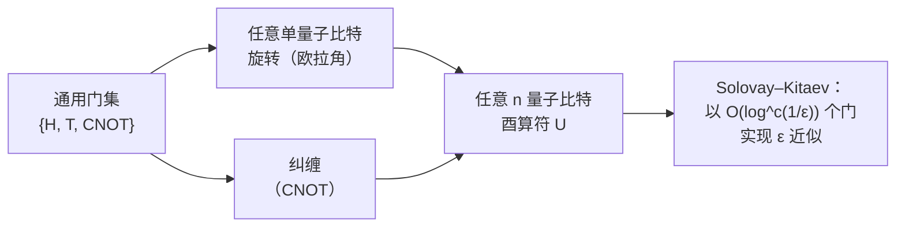

| 量子门 | 矩阵作用 | 作用 |
|------|---------------|------|
| X, Y, Z | 旋转 π 的泡利旋转 | 比特/相位翻转 |
| H | \|0⟩→(\|0⟩+\|1⟩)/√2 | 基变换 |
| S, T | 相位 π/2, π/4 | 非 Clifford（T = 魔术） |
| CNOT | 若控制位=1 则翻转目标位 | 纠缠 |

#### 6. 单量子比特门

单量子比特门是一个 2×2 的**酉**矩阵 U（U†U = I），保持归一化。最重要的门如下：

**泡利门**（泡利群的生成元）：

- X = [[0,1],[1,0]] — 比特翻转；X|0⟩=|1⟩，X|1⟩=|0⟩。是绕 x 轴的 180° 旋转（忽略相位）。
- Y = [[0,−i],[i,0]] — 比特与相位同时翻转；Y = iXZ。
- Z = [[1,0],[0,−1]] — 相位翻转；Z|0⟩=|0⟩，Z|1⟩=−|1⟩。是绕 z 轴的 180° 旋转。
- I = [[1,0],[0,1]] — 恒等。

泡利矩阵是厄米的、酉的，平方为单位矩阵（X²=Y²=Z²=I），两两反对易（{X,Y}=0 等），并满足 XY=iZ（循环成立）。它们构成所有 2×2 厄米矩阵的一组基，因此任何单量子比特哈密顿量和任何单量子比特密度矩阵都可以按 {I, X, Y, Z} 展开。*n* 个量子比特上的泡利群（泡利算符的张量积，带有相位 ±1、±i）是稳定子形式体系（文件 9）的骨架。

**Hadamard 门**：H = (1/√2)[[1,1],[1,−1]]。它把 Z 基映射到 X 基：H|0⟩=|+⟩，H|1⟩=|−⟩，并且是自身的逆（H²=I）。Hadamard 门从基态产生叠加态，几乎是每个算法中的第一个门（将它作用于 |0…0⟩ 的所有量子比特上，可构造均匀叠加态 Σ_x|x⟩/√(2ⁿ)）。几何上是绕 (x̂+ẑ)/√2 的 180° 旋转。

**相位门**：S = [[1,0],[0,i]]（= √Z，绕 z 轴 90° 旋转）和 T = [[1,0],[0,e^{iπ/4}]]（= √S，绕 z 轴 45° 旋转）。T 门是关键的**非 Clifford** 资源（第 7 节）。S = T²。

**旋转门**：绕三个坐标轴的连续旋转，

- R_x(θ) = exp(−iθX/2) = cos(θ/2) I − i sin(θ/2) X，
- R_y(θ) = exp(−iθY/2) = cos(θ/2) I − i sin(θ/2) Y，
- R_z(θ) = exp(−iθZ/2) = diag(e^{−iθ/2}, e^{+iθ/2}).

这些是大多数硬件的*原生*参数化门：一个经过校准的、幅度、相位和持续时间均受控的微波或激光脉冲，可实现所选轴和角度的旋转（文件 3、4、11）。变分算法（文件 13）把角度 θ 作为优化参数进行调节。

**欧拉角（Z–Y–Z）分解。** 任何单量子比特酉算符 U ∈ U(2) 在忽略全局相位 e^{iα} 的情况下，都可以写成三个旋转的乘积：

U = e^{iα} R_z(β) R_y(γ) R_z(δ).

同样存在 Z–X–Z 分解。这是基本的*综合*结果，它使编译器能够用硬件的旋转原语来表达任意所要求的单量子比特操作。在 R_z 是"虚拟"的硬件上（通过坐标系变换/相位记账实现，耗时为零且无误差，如超导系统），Z–Y–Z 形式尤其高效：只有 R_y 旋转消耗物理脉冲时间。

#### 7. 双量子比特门与纠缠能力

仅靠单量子比特门永远无法产生纠缠——它们把乘积态映射为乘积态。因此，**纠缠型双量子比特门**对通用性至关重要。标准的几种如下：

- **CNOT（受控 X）**：当且仅当控制位为 |1⟩ 时翻转目标量子比特。矩阵（控制位为第一个量子比特）：分块对角 [[I, 0],[0, X]] = [[1,0,0,0],[0,1,0,0],[0,0,0,1],[0,0,1,0]]。CNOT|x,y⟩ = |x, x⊕y⟩。作用于 |+⟩|0⟩ 时产生贝尔态 |Φ⁺⟩。
- **CZ（受控 Z）**：当且仅当控制位为 |1⟩ 时对目标位施加 Z；对两个量子比特对称，CZ = diag(1,1,1,−1)。通过在目标位上加 Hadamard 与 CNOT 相联系：CNOT = (I⊗H) CZ (I⊗H)。
- **SWAP**：交换两个量子比特，SWAP|x,y⟩ = |y,x⟩。SWAP = 三个 CNOT。其本身不产生纠缠，但对有限连通性硬件上的*路由*至关重要（文件 8）。
- **iSWAP**：类似 SWAP，但在被交换的 |01⟩↔|10⟩ 振幅上带有 i 相位；是电容/电感耦合超导量子比特的自然门，其"半"版本 √iSWAP 在某些硬件上是直接原生的。

**纠缠能力**量化一个双量子比特门能把初始乘积输入纠缠到何种程度（对输入取平均）。CNOT、CZ、iSWAP 是*最大*纠缠门（一次作用即可产生贝尔态）；√iSWAP 是"半"纠缠门（需要作用两次才能达到最大纠缠）。**KAK（Cartan）分解**表明，任何双量子比特酉算符在忽略单量子比特门的情况下，由三个"相互作用"参数刻画，并且最多可用三个 CNOT（或三个 √iSWAP）实现——这是编译器中最优双量子比特综合的基础（文件 12）。

**原生门因物理实现方案而异**——这是一个反复出现的主题：

- **超导**：CZ（通过可调耦合器，Google），或跨共振（cross-resonance）ZX 相互作用 → CNOT（IBM 固定频率），以及参量 iSWAP 族门（文件 3）。
- **囚禁离子**：**Mølmer–Sørensen（MS）**门，通过共享运动模式产生 XX（伊辛）相互作用（文件 4）。
- **中性原子**：通过里德堡阻塞实现的**里德堡 CZ** 门（文件 5）。

编译器必须把算法中抽象的 CNOT/CZ *转译*（transpile）为目标硬件实际支持的任何门——这是一个核心的系统问题（文件 8）。

#### 8. 通用门集

如果任意数量量子比特上的任何酉算符都可以由该集合中的门构成的有限电路以任意精度逼近，则称该门集是**通用的**。基本事实如下：

- **单量子比特旋转加上任意一个纠缠型双量子比特门（例如 CNOT）是通用的。** 任何 *n* 量子比特酉算符都可以分解为单量子比特门和 CNOT（尽管一般需要指数多个门——通用性说的是*可能*，而不是*高效*）。
- 对于*容错*计算，门必须来自一个*离散*集合（连续旋转无法被精确地容错实现）。标准的离散通用集是 **Clifford + T**。

**Clifford 群**由 {H, S, CNOT} 生成。Clifford 门在共轭作用下把泡利算符映射为泡利算符（它们使泡利群正规化）。它们恰好是在许多纠错码中可以*横向*且低成本实现的门（文件 9）。

**Gottesman–Knill 定理。** 任何*仅*由 Clifford 门构成的电路，作用于计算基输入并随后进行计算基测量，都可以通过稳定子形式体系在经典计算机上**高效（多项式时间）模拟**（文件 14）。其深远的推论是：**仅靠 Clifford 门无法提供量子优势。** 纯 Clifford 的"量子计算机"并不比经典计算机更强大。纠缠对量子加速是必要的，但*并不充分*——Clifford 电路可以产生大量纠缠（贝尔态、GHZ 态、纠错码态都由 Clifford 门生成），却仍然可被经典模拟。

**T 门是必不可少的非 Clifford 资源。** 把 T 门（π/4 相位旋转）加入 Clifford 群即得到一个通用集。电路中"非 Clifford 程度"的多少——用其 **T 数**（T-count），或更精细地，用其**魔术**（magic，稳定子 Rényi 熵、稳定子秩）来衡量——正是使电路在经典上困难的原因。这就是为什么容错资源估算（文件 18）如此关注 T 数：T 门需要昂贵的**魔术态蒸馏**（magic state distillation，文件 9），常常主导容错算法的总量子比特数和时间预算。

**Solovay–Kitaev 定理。** 任何单量子比特酉算符都可以用来自*任意*固定的离散通用单量子比特集的 O(log^c(1/ε)) 个门逼近到精度 ε（c ≈ 2–4，取决于构造方式；该算法是构造性的，运行时间是 log(1/ε) 的多项式）。这保证了 Clifford+T 集的离散性在精度上只带来*多对数*级的开销——足够小，使容错计算仍然保持高效。现代最优综合（例如针对 z 旋转的 Ross–Selinger 算法）对单量子比特 z 旋转达到接近最优的 T 数，约为 3 log₂(1/ε)，这一结果对资源估算有直接影响（文件 18）。

#### 9. 测量

**玻恩定则。** 在计算基下测量处于态 |ψ⟩ = α|0⟩ + β|1⟩ 的量子比特，得到结果 0 的概率为 |α|²，得到 1 的概率为 |β|²。更一般地，对于态 ρ 以及由对应结果 *m* 的正交投影算符 P_m 描述的测量，概率为 p(m) = Tr(P_m ρ)，测量后的态为 P_m ρ P_m / p(m)。

**投影（冯·诺依曼）测量。** 由厄米可观测量 A = Σ_m a_m P_m 定义，其本征值为 a_m，正交投影算符为 P_m。测量 A 以概率 Tr(P_m ρ) 返回本征值 a_m，并把态投影到相应的本征空间。在计算基下测量就是对 Z 的投影测量（|0⟩ 对应本征值 +1，|1⟩ 对应 −1）。

**测量塌缩与不可逆性。** 测量是量子力学中唯一的*非酉*、不可逆操作。它破坏叠加：态 α|0⟩+β|1⟩ 一旦被测得 0，就变成 |0⟩，原来的振幅无法恢复。这种不可逆性就是为什么量子算法必须在任何测量之前，安排好让*有用的*信息出现在测量统计中（通常通过干涉把振幅集中在正确答案上，如 Shor 和 Grover 算法），也是为什么纠错的伴随式测量（文件 9）被精心设计为提取*错误信息而不测量逻辑数据*。

**POVM（正算符取值测度）。** 最一般的测量由一组满足 Σ_m E_m = I 的正算符 {E_m}（POVM 元）描述。结果 *m* 的概率为 p(m) = Tr(E_m ρ)。POVM 推广了投影测量（E_m 不必是正交投影算符，且结果的个数可以多于希尔伯特空间的维数），并在对系统与辅助比特联合测量时自然出现。它们是例如无歧义态区分以及对真实探测器建模的合适框架。

**弱测量与连续（色散）测量。** 在超导电路量子电动力学（QED）（文件 3）中，量子比特*并不是*在单一瞬间被投影测量的。相反，它与一个读出谐振腔发生**色散**耦合，谐振腔的频率根据量子比特的状态偏移 ±χ；从谐振腔反射的探测音会累积一个依赖于量子比特状态的相位。*弱*的连续测量逐步提取信息，对读出时间（200–1000 ns）内的信号进行积分，可得到高保真度的**量子非破坏（QND）**读出——QND 的意思是测量投影到 Z 本征态并*保持*该本征态，因此重复测量会得到相同的结果。弱测量还使基于测量的反馈成为可能，是连续量子纠错研究的物理基础。

---

### 第三部分 — 退相干与噪声


**理想量子比特如何退化——T1 与 T2 两个时钟：**

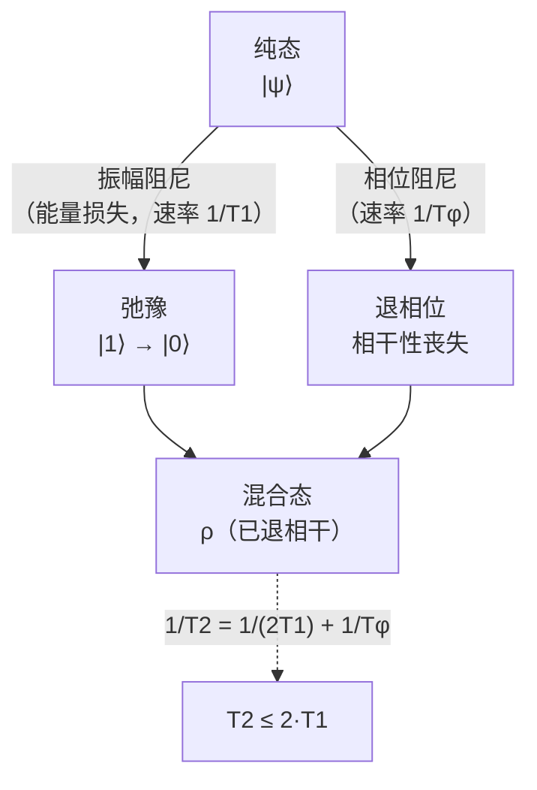

*T1（能量弛豫）和 T2（相位相干）设定了预算：一个持续时间为 tg 的门，只有在 tg ≪ T2 时才有用。纠错中的一切都是为了战胜这个时钟。*

这是工程师无法轻视的部分：*噪声是整个领域所要对抗的敌人*。每一种物理实现方案（文件 3–7）、纠错理论（文件 9）、错误缓解（文件 10）和资源估算（文件 18），归根结底都是对本节内容的回应。

#### 10. 开放量子系统与 Lindblad 方程

真实的量子比特从不是孤立的；它与一个具有极多自由度的不可控**环境**（热库）耦合——声子、光子、二能级系统缺陷、核自旋、电磁涨落。量子比特加环境一起做幺正演化，但对不可访问的环境取迹，则会得到仅针对量子比特的*非酉*、不可逆的**耗散**动力学。

在标准的玻恩–马尔可夫近似（弱耦合、热库关联时间短）下，量子比特密度矩阵服从 **Lindblad 主方程**：

dρ/dt = −(i/ℏ)[H, ρ] + Σ_k γ_k ( L_k ρ L_k† − ½{L_k† L_k, ρ} ),

其中 H 是系统哈密顿量（相干部分，产生所期望的门动力学），L_k 是描述退相干信道的 **Lindblad（跃迁）算符**，γ_k ≥ 0 是它们的速率，{·,·} 表示反对易子。第一项是可逆的薛定谔演化；耗散项（求和部分）是不可逆的部分，它驱使纯态走向混合态。对单个量子比特，典型的跃迁算符为：

- L = σ₋ = |0⟩⟨1|，速率 γ₁ = 1/T₁ — **能量弛豫**（向热库自发辐射能量，|1⟩→|0⟩）。
- L = Z，速率 γ_φ/2 — **纯退相位**（随机相位累积，无能量交换）。

#### 11. T₁、T₂ 以及弛豫/退相位的区别

**T₁ — 能量弛豫（振幅阻尼）时间。** 激发态布居衰减的特征时间：⟨1| 的布居 ∝ e^{−t/T₁}。物理上，量子比特把其激发能量释放到热库中（向有损耗的模式发射光子、激发声子等）。在布洛赫球上，T₁ 弛豫使布洛赫矢量的 z 分量向其热平衡值收缩（在 mK 温度下约为北极）。对超导 transmon，T₁ 受限于二能级系统缺陷导致的介电损耗、Purcell 效应（通过读出谐振腔衰减）以及准粒子（文件 3、23）；目前典型值为 50–300 μs，研究型器件可达 >1 ms。

**T₂ — 相位相干（退相位）时间。** |0⟩ 与 |1⟩ 之间的*相对相位*得以保持的特征时间——即密度矩阵非对角元（布洛赫矢量的 x、y 分量）的衰减。退相位源于量子比特频率的低频涨落（磁通噪声、电荷噪声、读出腔中的光子数涨落）。

**基本关系 T₂ ≤ 2T₁。** 由于能量弛豫*同样*会破坏相位相干（当量子比特衰减时，相位信息也随之丢失），总的退相位速率为 1/T₂ = 1/(2T₁) + 1/T_φ，其中 1/T_φ 是*纯*退相位速率。如果纯退相位可以忽略（T_φ → ∞），T₂ 达到其上限 2T₁；实际中 T₂ 通常远低于 2T₁，因为纯退相位占主导。

**T₂ 家族**——在实验上具有重要意义的区别：

- **T₂\***（自由感应衰减 / Ramsey T₂）：通过 Ramsey 实验测量（π/2 — 等待 — π/2）。包含*非均匀展宽*——缓慢的准静态频率涨落以及不同次运行之间的漂移——因此 T₂* 通常是*最短*且最悲观的度量。
- **T₂（Hahn 回波）**：中间加入一个重聚焦 π 脉冲来测量（π/2 — 等待/2 — π — 等待/2 — π/2）。回波脉冲*逆转*了由准静态噪声累积的相位，抵消缓慢（低频）的退相位，从而显现更长的 T₂。回波分离出量子比特对回波频率附近噪声的敏感度。
- **T₂（CPMG）**：Carr–Purcell–Meiboom–Gill 序列施加*多个*重聚焦 π 脉冲，逐步滤除更高频的噪声，得到更长的相干时间——这是**动力学解耦**（dynamical decoupling，第 13 节，文件 10）的基础。

这些区别并非吹毛求疵：厂商给出"T₂ = 200 μs"时必须说明是*哪一种* T₂，因为 Ramsey、回波和 CPMG 的数值可能相差整数倍，而某个具体算法所关心的数值取决于电路的噪声滤波特性。

#### 12. 噪声信道与 Kraus 表示

密度矩阵最一般的（完全正的、保迹的，CPTP）演化是**量子信道** ℰ，可以用 **Kraus（算符和）形式**表示：

ℰ(ρ) = Σ_k K_k ρ K_k†,  满足 Σ_k K_k† K_k = I,

其中 K_k 是 **Kraus 算符**。这是描述噪声的主力表示。关键的单量子比特信道如下：

**退极化信道**（最简单的最坏情形模型）：以概率 p 把态替换为最大混合态；等价地，施加一个随机泡利算符：

ℰ(ρ) = (1−p) ρ + (p/3)(XρX + YρY + ZρZ).

它是纠错阈值计算（文件 9）和随机基准测试分析（第 14 节）中使用的标准"平均错误率"模型，因为其单个参数 *p* 刻画了各向同性、无结构的错误。

**振幅阻尼信道**（模拟 T₁ 能量损失）。Kraus 算符：

K₀ = [[1,0],[0,√(1−γ)]],  K₁ = [[0,√γ],[0,0]],

其中 γ = 1 − e^{−t/T₁} 是衰减概率。K₁ 是真正的 |1⟩→|0⟩"跃迁"；K₀ 是无跃迁的反作用。振幅阻尼*不是*对称的（它驱向 |0⟩），是物理上占主导的 T₁ 过程。这种不对称性正是**偏置噪声**量子比特（猫态量子比特，文件 7）所利用的，也是通用退极化模型*无法*刻画的。

**相位阻尼（退相位）信道**（模拟 T₂ 纯退相位）。Kraus 算符 K₀ = √(1−λ/2) I，K₁ = √(λ/2) Z（一种常用参数化），其中 λ 与 e^{−t/T_φ} 相关。它缩小非对角元（布洛赫矢量的 x、y 分量），而不改变布居——没有能量损失，只有相位损失。物理上对应于弹性散射/随机频率漂移。

**一般泡利信道**：ℰ(ρ) = Σ_{P∈{I,X,Y,Z}} p_P P ρ P，即泡利错误的概率混合。泡利信道是自然的"数字化"错误模型，因为，值得注意的是，纠错通过伴随式测量把*任何* CPTP 错误都化简为等效的泡利错误（"错误的数字化"，文件 9）。扭曲（twirling）技术（随机化编译、泡利扭曲）有意地把现实的相干噪声转换为泡利信道，使之可纠正、可做基准测试。

**测量信道。** T₁ 通过制备 |1⟩ 并观察布居的指数衰减来测量；T₂* 通过 Ramsey 条纹；T₂ 通过 Hahn 回波；CPMG 用于测量噪声谱。完整的**量子过程层析**（quantum process tomography）可重构整个信道（所有 Kraus 算符 / χ 矩阵），但对 *n* 个量子比特需要 O(4ⁿ) 个测量设置——超过约 3 个量子比特即不可行——这催生了下面的可扩展基准测试方法。

#### 13. 串扰、泄漏与关联错误

真实器件违背了"每个量子比特经历独立的马尔可夫噪声"这一方便的假设。许多工程上的困难正存在于这些偏离之中：

- **ZZ 串扰**（超导）：相邻 transmon 之间始终存在的剩余 ZZ 耦合，使每个量子比特的频率依赖于其邻居的状态，产生条件相位错误，这些错误在空闲期间以及对*其他*量子比特施加门的期间不断累积。可调耦合器（文件 3）的部署正是专门为了消除这一 ZZ 项。
- **泄漏**：真实的量子比特并非完美的二能级系统。transmon 是弱非谐振子，其更高能级 |2⟩、|3⟩ 等仅相距约 200–300 MHz（即非谐性）。快速或不完美的脉冲可以把布居驱动*出*计算子空间 {|0⟩,|1⟩} 进入 |2⟩——即**泄漏**。泄漏对纠错尤为有害，因为泄漏态位于码空间之外，标准的泡利错误译码器无法纠正；需要专门的**泄漏消除单元（LRU）**和感知泄漏的译码（文件 9）。DRAG 脉冲整形（Derivative Removal by Adiabatic Gate，文件 8）通过加入与脉冲导数成正比的正交分量来抑制单量子比特门的泄漏。
- **旁观者错误与关联错误**：对一对量子比特施加的双量子比特门可能通过剩余耦合扰动附近的"旁观者"量子比特；同时驱动的门之间可能相互干涉。这些会产生*空间关联*的错误。
- **非马尔可夫噪声**：1/f 磁通噪声和电荷噪声具有很长的关联时间，因此热库具有"记忆"——作为 Lindblad 方程基础的马尔可夫近似失效。缓慢的漂移需要定期重新校准（文件 8）。

**为什么关联/非马尔可夫噪声会威胁纠错。** 阈值定理（文件 9）是在*独立*（或弱关联）且*马尔可夫*错误的假设下证明的。空间或时间上关联的错误——例如宇宙射线撞击导致整个芯片上量子比特同时出现一串关联错误、ZZ 串扰把相邻量子比特联系起来、泄漏跨周期持续存在——可能违反这些假设，削弱甚至打破阈值保证。这是真实的低于阈值演示（文件 9）比理想化理论所暗示的更困难的核心原因之一，也是表征和抑制*关联*噪声（而不仅仅是提高平均单门保真度）成为前沿关注点的原因（文件 25）。

#### 14. 可扩展表征：随机基准测试与交叉熵基准测试

由于完整的过程层析代价呈指数增长，并且会把态制备与测量（SPAM）错误与门错误混淆在一起，该领域依赖**可扩展基准测试**协议：

**随机基准测试（RB）。** 施加长度 *m* 不断增加的随机 Clifford 门序列，末尾加上使系统回到初始状态的逆 Clifford 门，然后测量存活概率。对随机序列取平均得到指数衰减 F(m) = A·p^m + B，其中**退极化参数** *p* 给出每个 Clifford 门的平均错误 r = (1−p)(1−1/2ⁿ)。RB 的主要优点是：它对 *SPAM 鲁棒*（态制备和测量错误被吸收到常数 A、B 中，而不影响衰减率），且其代价随规模呈多项式而非指数增长。**交错 RB**（Interleaved RB）通过把某个*特定*门交错插入随机序列来分离出该门的保真度。**循环基准测试**（cycle benchmarking）和**同步 RB**（simultaneous RB）把这一思想扩展到表征串扰和并行门的保真度。由 RB 得出的双量子比特门保真度（>99%）是文件 3–7 中引用的标志性数字，并且（文件 22）可以说是现有最具可比性的跨厂商比较。

**交叉熵基准测试（XEB）。** 用于 Google 的量子霸权实验（文件 1、14）：运行随机电路，对输出比特串采样，并计算观测到的样本分布与理想（经典计算的）分布之间的交叉熵。**线性 XEB 保真度** F_XEB ≈ ⟨2ⁿ p_ideal(x)⟩ − 1 估计整个电路无错误运行的概率。XEB 是"量子霸权"得以量化的度量——也是经典模拟反驳（文件 14）必须匹配的度量。

---

### 第四部分 — 关键量子信息定理

#### 15. 不可克隆定理

**陈述。** 不存在能复制任意未知量子态的酉操作 U：不存在对所有 |ψ⟩ 都满足 U(|ψ⟩ ⊗ |0⟩) = |ψ⟩ ⊗ |ψ⟩ 的 U。

**证明概要。** 假设对两个不同的非正交态 |ψ⟩ 和 |φ⟩ 存在这样的 U：U(|ψ⟩|0⟩) = |ψ⟩|ψ⟩ 且 U(|φ⟩|0⟩) = |φ⟩|φ⟩。对两个输入等式以及两个输出等式分别取内积，酉性（保持内积）要求 ⟨ψ|φ⟩ = ⟨ψ|φ⟩²。这迫使 ⟨ψ|φ⟩ ∈ {0, 1}：这两个态要么相同，要么正交。所以没有任何*单一*装置能克隆*任意*（特别是非正交）态。根本原因是量子力学的**线性性**：克隆器必须对叠加态做非线性的作用。

**含义。**
- **对纠错（文件 9）：** 不能像经典重复码那样，通过简单地把量子信息复制三份再多数表决来保护它。QEC 必须转而通过稳定子形式体系，把信息*非局域地*分散到一个纠缠的码字中——这是一种精妙得多的构造，由不可克隆定理所必需。
- **对密码学（文件 15）：** 窃听者无法在不扰动量子态的情况下复制传输中的量子态，这正是使 QKD（BB84）中窃听*可被检测*的原因。不可克隆是量子密钥分发的物理安全基础。

**相关定理。** **不可删除定理**（时间反演版本：无法把一个未知态的两份拷贝之一删除成标准空白态），以及**不可广播定理**（把不可克隆推广到混合态：一组互不对易的混合态不能被广播）。这些定理共同划定了处理未知量子信息时什么可能、什么不可能，也正因如此，量子信息必须被*移动*（例如隐形传态，文件 15）而不是被复制。

#### 16. 量子傅里叶变换（QFT）

QFT 是离散傅里叶变换的量子类比，也是最重要的指数加速算法的引擎。在 *n* 量子比特寄存器（维数 N = 2ⁿ）的计算基上：

QFT |j⟩ = (1/√N) Σ_{k=0}^{N−1} e^{2πi jk/N} |k⟩.

它通过 DFT 变换态的振幅。关键事实是：虽然对长度为 N 的向量做 DFT，经典上用 FFT 需要 O(N log N) = O(n 2ⁿ)，但 **QFT 仅需 O(n²) 个量子门**（Hadamard 门和受控相位旋转）即可通过乘积形式的分解实现：

QFT |j₁…jₙ⟩ = (1/√N) ⊗_{ℓ=1}^{n} ( |0⟩ + e^{2πi 0.j_{n−ℓ+1}…jₙ} |1⟩ ),

这是单量子比特态的张量积，其相位编码了输入的二进制小数。该电路对每个量子比特施加一个 Hadamard 门，随后施加以较低有效位量子比特为条件的受控 R_k 相位旋转，最后反转量子比特顺序。用 O(n²) 个门，QFT 在门数量上比经典 FFT *指数级*地更便宜——不过必须记住，输出是一个量子态，而不是可读取的傅里叶系数列表（振幅无法被直接读出，所以 QFT 只能作为一个*子程序*，其输出馈入干涉和测量，如在 Shor 算法和相位估计中那样）。近似 QFT（舍去最小的相位旋转）可把门数量降至 O(n log n)，且误差可忽略——这是资源估算（文件 18）中一个有用的优化。

#### 17. 量子相位估计（QPE）

QPE 是量子计算中最重要的*子程序*，是 Shor 算法、HHL 以及量子化学基态能量估计的基础。**问题：** 给定酉算符 U 和本征态 |u⟩，满足 U|u⟩ = e^{2πiϕ}|u⟩，估计相位 ϕ ∈ [0,1)。

**结构。** 使用两个寄存器：一个 *t* 量子比特的辅助"计数"寄存器，初始化为 |0…0⟩ 并经 Hadamard 变换成均匀叠加态；以及存放本征态 |u⟩ 的本征态寄存器。施加*受控-U^{2^j}* 操作（第 *j* 个辅助量子比特控制 U 的 2^j 次幂），通过相位反冲（phase kickback）把相位 2^j ϕ "反冲"到第 *j* 个辅助量子比特上。辅助寄存器最终处于一个其振幅以二进制编码 ϕ 的态；对辅助寄存器施加**逆 QFT** 并测量，即得到 ϕ 的最佳 *t* 位估计。

**精度/辅助比特的权衡。** 要以成功概率 ≥ 1−ε 把 ϕ 估计到 *t* 位精度，需要 t = n + ⌈log(2 + 1/2ε)⌉ 个辅助量子比特（其中 *n* 是所需的精度位数）以及 O(2^t) 次受控-U 作用。主要代价在于实现受控-U^{2^j}，对 Shor 算法而言这就是受控模幂运算——资源瓶颈（文件 13、18）。

**作为子程序的角色。** 在 **Shor 算法**中，U 是模乘，估计出的相位给出周期（文件 13）。在**量子化学**中，U = e^{−iHt} 是分子哈密顿量下的时间演化，QPE 估计近似基态的本征值（能量）——这是求基态能量的*容错*路径（与 NISQ 时代的 VQE 相对，文件 13）。QPE 是 T 门的主要消耗者（通过受控-U 算术），因而是资源估算中魔术态成本的主要驱动因素（文件 18）。

#### 18. Holevo 界

**陈述。** 如果 Alice 把经典符号 *x*（以概率 p_x 抽取）编码为量子态 ρ_x 并发送给 Bob，则**可获取信息**——Bob 通过任何测量所能提取的关于 *x* 的最大互信息——受**Holevo 量** χ 限制：

I(X:Y) ≤ χ = S(Σ_x p_x ρ_x) − Σ_x p_x S(ρ_x),

其中 S 是冯·诺依曼熵。**推论：** *n* 个量子比特最多能携带 *n* 比特的*可获取*经典信息（当 ρ_x 为纯正交态时，χ = n 比特；否则更少）。尽管态空间是 2ⁿ 维的，但你无法从 *n* 个量子比特中*读出*超过 *n* 个经典比特。

**意义。** Holevo 界是对天真的"指数级信息存储"说法的重要现实检验：量子态的指数多个振幅*并不是*指数多个可读取的比特。这就是为什么输出为"编码答案的量子态"的算法（例如 HHL，文件 13）只有在需要*汇总统计量*（期望值、样本）而不是完整的指数级输出时才带来优势。它还给出量子通信信道的终极容量极限（文件 15），并阐明了为什么量子优势来自*对读出哪几个比特的干涉结构设计*，而不是来自读出指数多个比特。

---

### 综述：这些基础知识如何贯穿整个数据库

- **布洛赫球与旋转门**（第 2、6 节）在文件 3（超导微波驱动）、4（囚禁离子激光/微波）、5（里德堡激光）以及 8/11（脉冲级控制）中被实现为物理控制脉冲。
- **密度矩阵与噪声信道**（第 3、10–14 节）是文件 3–7 中每一个保真度数字、每一个相干时间和每一份错误预算的语言，也是纠错（文件 9）和资源估算（文件 18）的输入假设。
- **通用性与 Clifford+T / Gottesman–Knill 分界**（第 8 节）决定了什么可以被经典模拟（文件 14）、什么使电路"困难"，以及为什么 T 数主导容错成本（文件 9、18）。
- **不可克隆**（第 15 节）决定了整个量子纠错的架构（文件 9），并为 QKD 的安全性提供保证（文件 15）。
- **QFT 与 QPE**（第 16–17 节）是赋予 Shor 算法指数加速的子程序（文件 13），也是基态估计的容错路径。
- **纠缠熵**（第 5 节）设定了高效张量网络经典模拟的边界（文件 14），而 **Holevo 界**（第 18 节）则约束了全文中有关量子信息容量的各种说法。

内化了第一至第四部分的工程师可以阅读任何后续文件，并立即把其中的论断置于恰当的位置——把保真度数字看作噪声信道参数，把门看作布洛赫旋转，把算法看作 2ⁿ 维振幅向量上的干涉图样，把纠错方案看作稳定子形式体系对不可克隆定理的回应。

---

*交叉引用：超导量子比特物理与色散读出（文件 3）；囚禁离子 MS 门与运动模式（文件 4）；里德堡阻塞门（文件 5）；稳定子形式体系与错误数字化（文件 9）；Clifford 电路与张量网络经典模拟（文件 14）；基于 QFT/QPE 的算法与复杂度（文件 13）；由 T 数驱动的资源估算（文件 18）；建立在 RB/XEB 之上的基准测试指标（文件 22）。*

---

### 第五部分 — 算例、扩展推导与补充原语

前面几部分建立了形式体系；本部分通过显式计算来运用它，并用工程师在实践中遇到的补充原语（隐形传态、超密编码、旋转坐标系、哈密顿量工程、纠缠度量以及稳定子预览）来扩展它。目标是让这些符号能够*算出结果*，而不仅仅是看懂。

#### 19. 算例：生成并验证贝尔态

从 |00⟩ 出发，对量子比特 0 施加 Hadamard 门，然后以量子比特 0 为控制位施加 CNOT：

1. 初始：|00⟩ = (1,0,0,0)ᵀ，基的顺序为 {|00⟩,|01⟩,|10⟩,|11⟩}。
2. 对量子比特 0 施加 H⊗I：H|0⟩ = (|0⟩+|1⟩)/√2，因此态变为 (|00⟩ + |10⟩)/√2。
3. 施加 CNOT（控制位 0，目标位 1）：|10⟩ 项的目标位翻转 → |11⟩，而 |00⟩ 不变。结果：(|00⟩ + |11⟩)/√2 = |Φ⁺⟩。

**密度矩阵与约化态。** ρ = |Φ⁺⟩⟨Φ⁺| = ½(|00⟩⟨00| + |00⟩⟨11| + |11⟩⟨00| + |11⟩⟨11|)。对量子比特 1 取迹：ρ₀ = Tr₁(ρ) = ½(|0⟩⟨0| + |1⟩⟨1|) = I/2——即**最大混合**的单量子比特态，布洛赫矢量 **r** = 0，纯度为 ½。这清楚地演示了第 5 节的核心教训：全局态是纯的（纯度 Tr(ρ²)=1），但每个*部分*却是最大混合的（纯度 ½）。"缺失的"信息完全存在于关联之中。

**通过 CHSH 验证。** 为了在硬件上证明这种纠缠，测量四个关联函数 E(a,b)，其中 Alice 的设置为 a₀ = Z、a₁ = X，Bob 的设置为 b₀ = (Z+X)/√2、b₁ = (Z−X)/√2。对于 |Φ⁺⟩，每个关联函数等于 ±1/√2，S = 2√2，达到 Tsirelson 界。测得的 S 大于 2（在考虑统计误差棒之后）即证明存在真正的纠缠；若数值从 2√2 被拉低而趋向 2，则量化了制备过程中的退相干和门不保真度。

#### 20. 算例：三量子比特 QFT 电路

对 n=3（N=8），QFT 把 |j⟩ → (1/√8) Σ_k e^{2πi jk/8} |k⟩。按第 16 节的乘积形式，其电路为：

- 对 q₂（最高有效位）施加 Hadamard 门，然后以 q₁ 为控制施加受控-S（R₂ = 相位 π/2），再以 q₀ 为控制施加受控-T（R₃ = 相位 π/4）。
- 对 q₁ 施加 Hadamard 门，然后以 q₀ 为控制施加受控-S。
- 对 q₀ 施加 Hadamard 门。
- 最后交换 q₀ ↔ q₂ 以反转比特顺序。

门数量：3 个 Hadamard + 3 个受控相位门 + 1 个 SWAP。一般而言，n 量子比特上的 QFT 使用 n 个 Hadamard 门和 n(n−1)/2 个受控相位旋转——即第 16 节的 O(n²) 标度。当 2^{−k} 低于算法的精度目标时，最小的受控相位旋转（角度 π/2^{k}）的贡献可以忽略不计；舍去它们得到**近似 QFT**，门数为 O(n log n)，误差受被省略相位的限制——这是一种标准的资源估算优化（文件 18）。请注意，小角度的受控相位旋转在容错条件下综合起来极其昂贵（每个非 Clifford 旋转通过 Ross–Selinger 方法约需 3 log(1/ε) 个 T 门），因此近似 QFT 对*小角度*旋转的削减在容错场景下具有双重价值。

#### 21. 量子隐形传态作为信息处理原语

不可克隆定理禁止复制未知态，但**并不**禁止*转移*它。**量子隐形传态**利用一对共享的贝尔对和两个经典比特，把未知量子比特态 |ψ⟩ = α|0⟩+β|1⟩ 从 Alice 传给 Bob。协议如下：

1. Alice 和 Bob 预先共享 |Φ⁺⟩_{AB}。
2. Alice 对她的未知量子比特和她持有的那一半贝尔对做贝尔基测量（实现为先 CNOT 再 Hadamard，然后做计算基测量），得到两个经典比特 (m₁, m₂)。
3. Alice 通过经典信道把 (m₁, m₂) 发送给 Bob。
4. Bob 对他的量子比特施加修正 X^{m₂} Z^{m₁}，精确地恢复出 |ψ⟩。

未知态在 Alice 一侧被破坏（与不可克隆一致——任何时刻只存在一份拷贝），并在 Bob 一侧被重构。隐形传态不是科幻式的物质传送；它是一个*协议*，并且出于与本数据库相关的三个原因而具有基础性：(a) 它是**量子中继器与纠缠交换**的机制（文件 15）；(b) **门隐形传态**是在许多纠错架构中以容错方式注入非横向门（尤其是 T 门）的方法（文件 9——魔术态注入就是门隐形传态）；(c) 它展示了纠缠 + 经典通信与量子通信的可互换性，这是分布式量子计算（文件 15）背后的资源理论等价关系。

#### 22. 超密编码：对偶原语

隐形传态利用一个 ebit（贝尔对）+ 两个经典比特来发送一个量子比特。**超密编码**则是其对偶：它利用一个 ebit + 传输*一个量子比特*来发送*两个经典比特*。Alice 持有共享 |Φ⁺⟩ 的一半，对其量子比特施加 {I, X, Z, XZ} 之一，把这一对旋转到四个正交贝尔态之一，然后把她的那个量子比特发送给 Bob，Bob 通过贝尔测量读出两个比特。隐形传态和超密编码共同确立了量子比特、ebit 与经典比特之间的"兑换率"——这是量子信息论的基础"货币"，也是一个有用的合理性检验（与 Holevo 界一致，第 18 节：Bob 提取了两个经典比特，与他最终持有的两个量子比特——他原有的那一半加上 Alice 发来的那一个——相匹配）。

#### 23. 旋转坐标系与门实际上如何被驱动

物理量子比特（transmon、离子、原子）具有很大的裸能级劈裂 ℏω₀（超导为 GHz 量级，离子/原子为光学或超精细量级）。控制通过频率为 ω_d 的近共振驱动来施加。受驱量子比特在实验室坐标系中的哈密顿量为

H = −(ℏω₀/2) Z + ℏΩ(t) cos(ω_d t + φ) X,

其中 Ω(t) 是（缓变的）驱动幅度（Rabi 频率），φ 是驱动相位。变换到以驱动频率旋转的**旋转坐标系**并应用**旋转波近似**（舍去在 2ω_d 处快速振荡的反旋转项），有效哈密顿量在共振时变为与时间无关：

H_rot ≈ (ℏΔ/2) Z + (ℏΩ/2)(cos φ · X + sin φ · Y),

其中失谐 Δ = ω₀ − ω_d。在共振（Δ=0）时，这产生绕 x–y 平面内某个轴（由驱动相位 φ 决定）的旋转，旋转角 θ = ∫Ω(t) dt（脉冲面积）。这正是第 6 节旋转门在物理上的实现方式：**旋转轴由驱动相位控制，旋转角由脉冲面积（幅度 × 持续时间）控制。** π 脉冲（面积 π）实现 X（或 Y，取决于 φ）；π/2 脉冲实现 √X。失谐 Δ 会增加一个 z 旋转，这就是频率失准会产生轴误差的原因。虚拟 Z 门（文件 8）利用了这样一个事实：改变 φ 等价于绕 z 的坐标系旋转，可以在软件中以零成本实现。这一旋转坐标系图像是从第二部分的抽象门通向文件 3、4、11 的脉冲级控制的桥梁。

#### 24. 哈密顿量工程与双量子比特门的起源

双量子比特门源自*工程化设计的相互作用*。一般的双量子比特相互作用哈密顿量，例如交换/伊辛耦合 H_int = ℏJ Z⊗Z（对 MS 门则为 X⊗X），会产生纠缠酉算符 exp(−iH_int t/ℏ) = exp(−iJt Z⊗Z)。当 Jt = π/4 时，这（在忽略单量子比特相位的情况下）等价于 CZ/CNOT。不同的物理实现方案工程化出不同形式的相互作用：

- **ZZ / 跨共振（超导，IBM）：** 以量子比特 B 的频率驱动量子比特 A，产生有效的 ZX 相互作用；回波序列抵消不需要的 IX、ZI 项，留下干净的 ZX → CNOT（文件 3）。
- **可调耦合器 ZZ（超导，Google）：** 磁通可调耦合器使 |11⟩ 和 |02⟩ 接近共振，累积条件相位 → CZ（文件 3）。
- **XX 伊辛（囚禁离子 MS 门）：** 双色激光通过共享运动模式耦合量子比特的自旋，产生 exp(−iχ XX)（文件 4）。
- **里德堡阻塞（中性原子）：** 条件激发产生受控相位 → CZ（文件 5）。

统一的教训是：双量子比特门是工程化耦合哈密顿量的时间积分，门保真度受限于这种耦合能多么干净地被打开、保持和关闭，而不泄漏到不需要的态或耦合到旁观者（第 13 节）。

#### 25. 定量的相干性预算：一个算例误差模型

考虑一个超导量子比特，T₁ = 100 μs，T₂（回波）= 120 μs，单量子比特门时间 t₁q = 25 ns，双量子比特门时间 t₂q = 300 ns。估算*受相干性限制的*门错误（仅由退相干设定的错误下限，尚未加入控制误差）：

- 每个门的退相干错误大致按 ε ≈ (t_gate)/T_φ-effective 标度。对于双量子比特门，一个常用的经验法则是 ε₂q ≈ (1 − e^{−t₂q/T₁})·(权重) + (1 − e^{−t₂q/T₂})·(权重) ≈ t₂q (1/(2T₁) + 1/(2T₂))（比值较小时）。
- 数值上：t₂q/(2T₁) = 300 ns / 200 μs = 1.5×10⁻³；t₂q/(2T₂) = 300 ns / 240 μs = 1.25×10⁻³。对两个量子比特求和并加权后，得到受相干性限制的错误约为几个 ×10⁻³——即保真度上限约为 99.5–99.7%，*与已报道的最佳超导双量子比特保真度一致*（文件 3）。这就是为什么提高 T₁/T₂（材料工作，文件 23）和缩短门时间（更快的耦合器，文件 3）都直接抬高了保真度上限，也是为什么对于越过纠错阈值而言，相干性提高 10 倍比量子比特数增加 10 倍更有价值（文件 18）。

对于 T₂ > 1 s、t₂q ≈ 100 μs 的囚禁离子，同样的算术给出受相干性限制的错误约为 10⁻⁴ 或更低——这解释了（文件 4 的相关章节）为什么离子保持着门保真度纪录：尽管绝对门速度很慢，其 T₂/t_gate 比值（DiVincenzo 品质因数，文件 1）却极其巨大。架构层面的权衡——快门短相干（超导）与慢门长相干（离子）——最终得到相当的*退相干前可执行操作数*，而这才是真正重要的量。

#### 26. 噪声谱学与滤波函数图像

第 11 节中 CPMG/动力学解耦的区别，由**滤波函数形式体系**精确化。脉冲序列相当于对环境噪声功率谱密度 S(ω) 的带通滤波器 F(ω)；相干性衰减为

χ(t) = (1/π) ∫₀^∞ S(ω) F(ω)/ω² dω,  相干性 ∝ e^{−χ(t)}。

- **Ramsey（自由演化）**的滤波函数峰值位于 ω→0，因此它对低频（准静态）噪声最敏感——所以 T₂* 很短。
- **Hahn 回波**在 ω=0 处放置一个陷波，抑制直流噪声，并把滤波器的峰值推到 ω ≈ π/t——所以回波 T₂ 更长。
- **N 个脉冲的 CPMG** 使通带变得更尖锐并移向更高频率（ω ≈ Nπ/t），滤除越来越宽的低频噪声带——所以相干性进一步延长。

通过改变脉冲间隔并反演这一关系，人们可以*测量噪声谱 S(ω)*——即**噪声谱学**——其结果直接用于材料和控制工程（文件 11、23）：如果 S(ω) 由 1/f 尾部主导，对策是降低磁通/电荷噪声源；如果由 TLS 频率处的峰主导，对策是改变材料/制造工艺。这就是"提高相干性"背后的定量引擎，把一个模糊的目标变成带有可识别元凶的实测谱。

#### 27. 熵之外的纠缠度量

对于*纯*二分态，纠缠熵（第 5 节）完全量化了纠缠。对于*混合*态和多体系统，则使用几种互不等价的度量：

- **共生纠缠度（Concurrence）**（Wootters）：双量子比特混合态的闭式纠缠度量，C(ρ) = max(0, λ₁−λ₂−λ₃−λ₄)，其中 λᵢ 是由 ρ 和 (Y⊗Y)ρ*(Y⊗Y) 构造的特定矩阵的已排序本征值。**形成纠缠度**（entanglement of formation）是共生纠缠度的单调函数。其用处在于对任何双量子比特 ρ 都可以闭式计算，使之成为实用的实验见证。
- **负性 / 对数负性**：基于 **PPT（正偏转置）判据**——可分态在偏转置后保持半正定，因此偏转置 ρ^{T_B} 的负本征值*证明*存在纠缠（Peres–Horodecki）。负性是这些负本征值绝对值之和。PPT 仅在 2×2 和 2×3 系统中是可分性的充要条件；在更高维度中存在"束缚纠缠"的 PPT 态（有纠缠但不可蒸馏），这是一个重要的微妙之处。
- **多体纠缠**：真正的多体纠缠（GHZ 态与 W 态）无法被任何单一的二分度量所刻画；GHZ 态 |0…0⟩+|1…1⟩ 是最脆弱的（丢失一个量子比特就破坏全部纠缠），而 W 态则较为稳健——这与逻辑态编码的选择以及对大型纠缠资源态（文件 6 的簇态）的表征有关。

这些度量在操作上很重要：证明器件产生了*多少*以及*何种*纠缠，既是一项基准测试（文件 22），也是相信一次"量子"计算确实在利用量子资源，而不是在模仿可被经典模拟的（例如低纠缠或 Clifford）电路的前提（文件 14）。

#### 28. 稳定子形式体系预览（完整论述见文件 9）

由于实用量子计算的大部分内容——纠错、Clifford 模拟、基准测试——都基于**稳定子形式体系**运行，因此这里有必要做一个预览，它把第 8 节、第 14 节与不可克隆的讨论联系了起来。

*n* 个量子比特的**稳定子态**是 *n* 个相互对易的独立泡利算符（**稳定子生成元**）的共同 +1 本征态，这些算符生成泡利群的一个不含 −I 的阿贝尔子群 *S*。该态由其稳定子群*唯一确定*。例子：|0⟩ 由 Z 稳定；|+⟩ 由 X 稳定；贝尔态 |Φ⁺⟩ 由 {XX, ZZ} 稳定；GHZ 态由 {XXX, ZZI, IZZ} 稳定。

贯穿整个数据库的关键事实：

- **紧凑描述。** *n* 量子比特稳定子态由 *n* 个生成元指定，每个是由 *n* 个符号加一个符号位组成的泡利串——总共 O(n²) 比特，而不是 2ⁿ 个振幅。这种压缩恰恰是**Clifford 电路可被高效经典模拟**的原因（Gottesman–Knill，第 8 节和文件 14）：Clifford 门把稳定子生成元映射为稳定子生成元，因此只需在电路中追踪 O(n²) 的数据，而不是指数大的振幅向量。
- **纠错。** 稳定子*码*固定一个稳定子子群，并利用剩余的自由度来编码逻辑量子比特；**伴随式测量**测量稳定子生成元来检测错误，而*不*测量（因而不塌缩）逻辑信息——这就解决了不可克隆（第 15 节）给纠错带来的矛盾（文件 9 对此有完整展开）。
- **错误数字化。** 由于泡利群张成所有单量子比特算符，测量稳定子会把任意连续的错误投影为*离散*的泡利错误，然后码对其进行纠正——把物理错误的连续谱变成有限、可纠正的集合（文件 9）。

这一预览首尾呼应：不可克隆定理（第 15 节）使得朴素复制成为不可能，稳定子形式体系提供了与不可克隆相容的替代方案（非局域地编码信息，测量错误伴随式），而同一套形式体系也划定了经典可模拟性的边界（第 14 节）。第一至第五部分合起来提供了数据库其余部分所依赖的每一个概念。

#### 29. 关键公式小结（速查）

- 量子比特态：|ψ⟩ = cos(θ/2)|0⟩ + e^{iφ}sin(θ/2)|1⟩；布洛赫矢量 **r** = (sinθcosφ, sinθsinφ, cosθ)。
- 密度矩阵：ρ = (I + **r**·**σ**)/2；纯度 Tr(ρ²) = (1+|**r**|²)/2。
- 泡利矩阵满足 XY = iZ（循环），{Pᵢ,Pⱼ}=2δᵢⱼ I。
- 旋转门：R_n̂(θ) = cos(θ/2) I − i sin(θ/2)(n̂·**σ**)。
- 相干性关系：1/T₂ = 1/(2T₁) + 1/T_φ，因此 T₂ ≤ 2T₁。
- Lindblad 方程：dρ/dt = −(i/ℏ)[H,ρ] + Σ_k γ_k(L_k ρ L_k† − ½{L_k†L_k, ρ})。
- Kraus 形式：ℰ(ρ) = Σ_k K_k ρ K_k†，Σ_k K_k†K_k = I。
- RB 衰减：F(m) = A p^m + B；每个 Clifford 的平均错误 r = (1−p)(1−1/2ⁿ)。
- QFT：|j⟩ → (1/√N) Σ_k e^{2πijk/N}|k⟩，O(n²) 个门。
- QPE 精度：t = n + ⌈log(2+1/2ε)⌉ 个辅助量子比特，可在成功概率 ≥ 1−ε 下达到 n 位精度。
- CHSH 界：经典 |S| ≤ 2；量子（Tsirelson）|S| ≤ 2√2。
- Holevo 界：可获取信息 ≤ S(Σ p_x ρ_x) − Σ p_x S(ρ_x) ≤ n 个量子比特对应 n 比特。

这些是工程师不断回头查阅的公式；数据库的其余部分可以被理解为它们的物理实现（文件 3–7、11、23）、算法利用（文件 8、12、13）、保护（文件 9、10、18）以及商业/战略背景（文件 19–24）。

---

### 第六部分 — 距离度量、动力学图像、过程表征与术语表

最后这一部分提供用于*比较*量子态和操作的定量工具（保真度、迹距离、钻石范数），时间演化的两种等价"图像"，形式化的电路模型记账方式（深度/宽度/体积），表征层次（层析 → GST → RB），以及一份实用术语表。这些是实验工程师和软件工程师的日常工具。

#### 30. 比较量子态：保真度与迹距离

工程师经常需要量化所制备的态与目标态"有多接近"，或者噪声信道使态退化了多少。有两种度量占主导：

**保真度（Fidelity）。** 对于纯目标态 |ψ⟩ 和实际的（可能是混合的）态 ρ，保真度为 F = ⟨ψ|ρ|ψ⟩——即通过针对 |ψ⟩ 的投影检验的概率。对于两个一般的混合态 ρ 和 σ，（Uhlmann）保真度为 F(ρ,σ) = (Tr√(√ρ σ √ρ))²，范围从 0（正交）到 1（相同）。保真度是态制备和量子门中最常被引用的品质因数："99.9% 的门保真度"意味着所实现的操作与理想操作的重叠度在 0.999 的水平，并对输入态取平均（即**平均门保真度**）。对于 *d* 维系统，平均门保真度 F_avg 与纠缠保真度/过程保真度 F_pro 之间的关系是 F_avg = (d·F_pro + 1)/(d + 1)，这一换算在把 RB 结果（报告的是 F_avg）转换为纠错输入（需要的是过程/泡利错误）时经常用到。

**迹距离（Trace distance）。** D(ρ,σ) = ½ Tr|ρ−σ| = ½ Σ|(ρ−σ) 的本征值|。它具有操作意义：½(1 + D) 是在单次测量中正确区分 ρ 与 σ 的最大概率（Helstrom 界）。迹距离是真正的度量（满足三角不等式），并且在任何量子信道下是*收缩*的（D(ℰ(ρ),ℰ(σ)) ≤ D(ρ,σ))——信道永远无法增加可区分性，这一事实是许多安全性和无信号论证的基础。保真度和迹距离通过 Fuchs–van de Graaf 不等式 1−F ≤ D ≤ √(1−F²) 相联系，因此作为接近程度的度量，它们在定性上可以互换。

**钻石范数（Diamond norm）。** 为了比较*信道*（操作）而不是态，**钻石范数距离** ‖ℰ−ℱ‖_◇ 给出了两个信道最坏情形下的可区分性，即使它们可能作用于纠缠态的一半。钻石范数是**阈值定理**（文件 9）的严格品质因数：容错证明用钻石范数来界定逻辑错误。它比 RB 的平均保真度更难通过实验估计，这也是为什么平均保真度数字（易于测量）与最坏情形的钻石范数数字（定理所使用的）可能不同的原因之一——这是把实验保真度与理论阈值（文件 18）比较时的一个微妙之处。

#### 31. 薛定谔绘景与海森堡绘景

对动力学的两种在数学上等价的描述：

- **薛定谔绘景：** 态演化，算符固定。|ψ(t)⟩ = U(t)|ψ(0)⟩，或 ρ(t) = U(t)ρ(0)U†(t)。这是电路图中的默认绘景（态从左到右流经各个门）。
- **海森堡绘景：** 态固定，算符演化。A(t) = U†(t) A U(t)。期望值一致：⟨A⟩(t) = ⟨ψ(t)|A|ψ(0)⟩_Schrödinger = ⟨ψ(0)|A(t)|ψ(0)⟩_Heisenberg。

海森堡绘景绝非仅仅是一种奇思妙想：**稳定子形式体系**（第 28 节，文件 9）本质上就是海森堡式的——它追踪泡利*算符*（稳定子）在 Clifford 门作用下如何变换，这也是它高效的原因（O(n²) 个算符 vs. 2ⁿ 个振幅）。容错电路中的错误传播分析（"量子比特 3 上的 X 错误如何通过这个 CNOT 网络传播？"）就是海森堡绘景的推理：把错误算符逐个门地共轭变换，看它最终落在哪里。熟练地在两种绘景之间切换，对于推理纠错至关重要。

#### 32. 电路模型：深度、宽度、体积与连通性

电路的形式化记账方式，贯穿编译（文件 8/12）、基准测试（文件 22）和资源估算（文件 18）：

- **宽度** = 量子比特数（包括辅助比特）。
- **深度** = 必须顺序执行的门的*层数*；同一层中作用于互不相交量子比特的门并行执行（Cirq 术语中的"moments"）。决定实际运行时间和退相干暴露程度的是深度，而不是门的数量（在深电路中空闲的量子比特会累积退相位）。
- **门数 / T 数** = 总门数 / 非 Clifford T 门的总数。T 数是容错成本的驱动因素（文件 18）。
- **电路体积** ≈ 宽度 × 深度，是总计算工作量以及"量子体积"基准（文件 22）的粗略替代量。
- **连通图** = 哪些物理量子比特对允许原生双量子比特门。稀疏的固定连通性（超导，度 ≤ 4）迫使**插入 SWAP** 来路由相距较远的逻辑相互作用，从而增加深度；全连接（模块内的囚禁离子）避免了这一点；可重构连通性（中性原子）介于两者之间（文件 8）。

这些量的相互作用是编译的核心：在连通性较差的器件上做完路由后，一个逻辑上很浅的电路可能在物理上变得很深，额外的深度（更多退相干 + 更多门）可能抹去 NISQ 算法所期望的优势（文件 8、17）。

#### 33. 表征层次：层析、GST、RB

针对"我的器件实际上在做什么"这一问题的一套实用方法阶梯，可扩展性递增，细节递减：

- **态层析：** 从一组完备（信息完备）基下的测量重构未知的 ρ。代价为 O(4ⁿ) 个测量设置；仅对约 3 个量子比特可行。给出完整的态，但会混入 SPAM 错误。
- **过程层析（QPT）：** 重构信道完整的 χ 矩阵；需要 O(16ⁿ) 次实验。代价更高；同样对 SPAM 敏感。
- **门集层析（GST）：** 同时自洽地表征整个门集*以及* SPAM，而不假设任何操作是完美的（它从门集本身自举）。在提取包括相干（系统性）错误在内的真实门错误方面比 QPT 更严格，但代价高且复杂；用于对小型门集进行高风险的表征。
- **随机基准测试（RB）及其变体**（第 14 节）：可扩展、对 SPAM 鲁棒，但只报告*平均*错误率，隐藏了错误的结构（相干 vs. 随机，关联 vs. 独立）。循环基准测试和同步 RB 可以恢复部分结构（串扰）。

工程师的实际工作流程是：用 RB 进行例行、可扩展的监测（器件今天健康吗？），用 GST 对某个特定的坏门进行深入调试（错误是相干的——可通过重新校准修复——还是随机的——需要硬件层面的工作？），而层析只用于小型、受控良好的子系统。为问题选择合适的工具本身就是一项技能（文件 8、22）。

#### 34. 相干错误与随机错误——为什么这一区分在操作上具有决定性

0.1% 的门错误并不是单一一种东西。两个极端：

- **随机（非相干）错误：** 以某个概率施加一个随机泡利算符。错误*线性*累加——N 个错误率为 p 的门给出的总错误 ≈ Np。这是纠错阈值所假设的良性情形。
- **相干（系统性）错误：** 一个小的*酉*过旋转或欠旋转（例如，每个门旋转的是 π+δ 而不是 π）。相干错误可以*相干地*累加——累积的是振幅而不是概率——因此 N 个门可以给出约 (Nδ)² 的错误，在对抗性对齐的情况下它*二次*增长，远比随机估计糟糕。更糟的是，相干错误可以在整个电路中相互串通。

RB 报告的不保真度（对相干错误而言为每个门 ∝ δ²）可能会大幅*低估*相干错误在深电路中的最坏情形（钻石范数）影响。这就是**随机化编译 / 泡利扭曲**（文件 10）有价值的原因：它有意地把相干错误转换为随机的泡利错误（通过在每个门周围随机化泡利坐标系），把最坏情形的二次累积换成良性的线性累积——不带来保真度代价，且常常提升真实算法的性能。相干/随机的区分是整个噪声讨论中在实践上最重要、也最常被低估的要点之一，直接关系到器件由 RB 测得的保真度是否真的能预测其算法性能（文件 17、22）。

#### 35. 重述量子–经典边界

综合第一至第六部分，"经典容易"与"量子困难"之间的边界由三种相互交织的资源支配：

1. **纠缠**（第 5 节）：对加速是必要的，其*结构*（跨割裂面的纠缠熵）限定了张量网络模拟的成本（文件 14）。但仅有纠缠并不充分——Clifford 电路有大量纠缠，但在经典上却很容易。
2. **魔术 / 非 Clifford 性**（第 8 节）：T 门资源使电路脱离可高效模拟的稳定子类。用 T 数、稳定子秩和稳定子 Rényi 熵来量化。是容错成本的主导项（文件 18）。
3. **干涉**（第 1 节）：复振幅的相长/相消组合，使测量概率集中到有用的答案上（Shor、Grover，文件 13）。没有结构化的干涉，量子态只不过是一个昂贵的采样装置。

真正的量子优势需要三者齐备：足够的纠缠以张成指数大的空间，足够的魔术以逃脱经典稳定子模拟，以及足够的干涉结构以提取一个有用的（受 Holevo 界限制的，第 18 节）答案。任何缺少其中之一的"量子"演示，要么可被经典模拟（文件 14），要么没有提取出任何有用的东西——这是持怀疑态度的工程师用来检验优势声明的分析清单（文件 14、17、22）。

#### 36. 实用术语表（基础）

- **振幅（Amplitude）：** 基态的复系数；其模的平方是概率（玻恩定则）。
- **非谐性（Anharmonicity）：** |1⟩→|2⟩ 与 |0⟩→|1⟩ 跃迁之间的能量差；非零的非谐性使多能级系统能够充当量子比特（文件 3）。
- **布洛赫球（Bloch sphere）：** 把单量子比特态表示为单位球内/球面上一点的几何表示。
- **Clifford 门：** 群 {H, S, CNOT}；把泡利算符映射为泡利算符；单独使用时可被经典模拟（Gottesman–Knill）。
- **相干性（T₁、T₂）：** 能量弛豫和相位相干时间；DiVincenzo 品质因数是 T₂/t_gate。
- **退相干（Decoherence）：** 由于与不受控环境的纠缠而丧失量子相干性。
- **密度矩阵（ρ）：** 一般的态描述；混合态和开放系统态所必需。
- **钻石范数：** 最坏情形的信道可区分性度量；阈值证明中的品质因数。
- **纠缠（Entanglement）：** 不可分的关联；对量子加速是必要的（但不充分）。
- **保真度（Fidelity）：** 基于重叠的态或操作之间的接近程度度量；标准的门质量数字。
- **Kraus 算符：** 量子信道的算符和表示。
- **Lindblad 方程：** 开放系统（耗散）量子比特动力学的马尔可夫主方程。
- **魔术 / T 门：** 使通用性和经典困难性成为可能的非 Clifford 资源。
- **不可克隆定理：** 任意未知态无法被复制；决定了 QEC 的架构。
- **泡利群：** {I,X,Y,Z} 带相位的张量积；稳定子形式体系的骨架。
- **POVM：** 最一般的测量形式体系。
- **QFT / QPE：** 量子傅里叶变换与相位估计——关键的指数加速子程序。
- **随机基准测试（RB）：** 可扩展、对 SPAM 鲁棒的门保真度表征。
- **稳定子态/码：** 定义为对易泡利算符的 +1 本征空间的态/码；QEC 和 Clifford 模拟的基础。
- **迹距离：** 量化单次测量态可区分性的度量（Helstrom 界）。
- **通用门集：** 可从中高效逼近任意酉算符的集合（例如 Clifford+T）（Solovay–Kitaev）。

这份术语表、公式速查（第 29 节）以及第一至第五部分共同构成了整个数据库的工作基础。后续每个文件都可以被理解为这些概念在某个具体物理平台、软件层、算法、纠错方案或商业/战略问题上的应用。

---

### 第七部分 — 变分原理、绝热定理、POVM 算例与对称性

这篇附录发展了在算法（文件 13）、退火（文件 17）和纠错（文件 9）中反复出现的另外四大支柱：变分原理（VQE 的引擎）、绝热定理（量子退火的引擎，也是理解 QAOA 的一个视角）、显式的 POVM 构造，以及对称性与守恒量的作用。

#### 37. 变分原理

对于任何基态能量为 E₀ 的哈密顿量 H，以及*任意*归一化的试探态 |ψ(θ)⟩，

E(θ) = ⟨ψ(θ)|H|ψ(θ)⟩ ≥ E₀,

当且仅当 |ψ(θ)⟩ 是真正的基态时取等号。证明：在能量本征基下展开 |ψ(θ)⟩ = Σ_k c_k|E_k⟩；则 E(θ) = Σ_k |c_k|² E_k ≥ E₀ Σ_k |c_k|² = E₀，因为每个 E_k ≥ E₀ 且权重之和为 1。仅这一个不等式就构成了**变分量子本征求解器（VQE）**（文件 13）的全部理论依据：用量子电路 U(θ)|0⟩ 对试探态做参数化，在量子计算机上测量 ⟨H⟩，并让经典优化器对 θ 求最小值。所得到的最小值是基态能量的严格*上界*——它永远不会低于真值，因此更低的变分能量无疑是更好的答案。需要注意的是（文件 13 有展开），*优化景观*可能受**贫瘠高原**（barren plateaus，梯度指数消失）和局部极小值困扰，所以不能保证达到真正的 E₀；变分原理只保证你所达到的任何结果都是诚实的上界。同样的原理，若对激发态加上正交性约束，则得到激发态 VQE 变体。

**测量 ⟨H⟩。** 分子或模型哈密顿量被写成泡利串之和 H = Σ_a h_a P_a（通过 Jordan–Wigner 或 Bravyi–Kitaev 映射，文件 13）。由于每个泡利期望值 ⟨P_a⟩ 是通过旋转到该泡利算符的本征基并采样来测量的，⟨H⟩ = Σ_a h_a ⟨P_a⟩ 需要测量每一项——而对于电子结构哈密顿量，项数按 O(n⁴) 增长，使得*测量开销*成为 VQE 在实践中的主要成本。把相互对易的泡利项分组为可同时测量的集合是一项活跃的优化工作（文件 13），可直接减少测量次数（shot）预算。

#### 38. 绝热定理与量子退火

**绝热定理**指出：如果系统从含时哈密顿量 H(t) 的基态出发，并且 H(t) 变化得*足够缓慢*，则系统在整个过程中保持在瞬时基态。"足够缓慢"由沿路径的基态与第一激发态之间的**最小能隙** Δ_min 来量化：所需的演化时间标度为 T ≳ 1/Δ_min²（忽略矩阵元因子）。该定理是**绝热量子计算（AQC）**及其商业化的近亲**量子退火**（D-Wave，文件 17、19）的基础：

- 在一个简单哈密顿量 H_initial 容易制备的基态中初始化（例如横向场，基态 = 均匀叠加态）。
- 缓慢插值 H(s) = (1−s)H_initial + s·H_problem，其中 H_problem（通常是伊辛哈密顿量 Σ J_ij Z_i Z_j + Σ h_i Z_i）把优化问题的代价函数编码为其基态能量。
- 最终处于 H_problem 的基态——这就是优化问题的解，通过测量所有量子比特读出。

AQC 与门模型是**多项式等价**的（Aharonov 等人）——二者都不更强大——但*实际的*退火实现（D-Wave）受到限制（stoquastic 哈密顿量、有限的连通性、有限温度、无纠错），它们是否比经典模拟退火或专用求解器带来真正的优势，是文件 17 中**有争议**的问题。关键的弱点在于能隙：许多困难问题沿路径具有指数小的 Δ_min（一级量子相变），导致指数级的运行时间并抹去任何优势。QAOA（文件 13）可被视为绝热演化的*离散化、有限深度*近亲，同时继承了其直观性和不确定的优势地位。

#### 39. POVM 算例

POVM（第 9 节）是抽象的；两个具体的构造可使其变得直观。

**无歧义态区分。** 假设给定两个非正交态 |ψ₀⟩、|ψ₁⟩ 之一，必须辨别是哪一个，允许*零*错误但允许回答"我不知道"。没有任何投影测量能做到这一点，但三结果 POVM {E₀, E₁, E_?} 可以：E₀ ∝ |ψ₁^⊥⟩⟨ψ₁^⊥|（仅在 |ψ₀⟩ 上触发，从不在 |ψ₁⟩ 上触发），E₁ ∝ |ψ₀^⊥⟩⟨ψ₀^⊥|（仅在 |ψ₁⟩ 上触发），而 E_? = I − E₀ − E₁（不确定结果）吸收剩余的概率。永不出错的代价是非零的"不知道"概率，其下界由重叠度 |⟨ψ₀|ψ₁⟩| 决定。这正是某些 QKD 安全性分析（文件 15）和预告式（heralded）操作所利用的结构。

**SIC-POVM。** 量子比特上的*对称信息完备*（symmetric informationally complete）POVM 由四个次归一化的投影算符构成，它们投影到构成内接于布洛赫球的正四面体的态上，E_k = ½|φ_k⟩⟨φ_k|，且对 j≠k 有 |⟨φ_j|φ_k⟩|² = 1/3。这样的单次测量是*信息完备*的——其四个结果的概率唯一地确定整个密度矩阵 ρ——使得 SIC-POVM 成为理论上最优的单设置层析，也是影子层析（shadow tomography）和随机化测量协议中的一种工具，这些协议越来越多地用于可扩展的态表征（文件 22）。

**Naimark 扩张。** 任何 POVM 都可以实现为更大空间上的投影测量：附加一个辅助比特，施加联合酉变换，然后做投影测量。这就是 POVM 在真实硬件上*如何*实现的——并没有什么奇异的"POVM 设备"，只有辅助比特 + 酉变换 + 标准读出。使用辅助比特的中途测量（文件 4 中 Quantinuum 的能力，文件 9 的伴随式提取）正是 Naimark 扩张在实践中的体现。

#### 40. 对称性与守恒量

对称性贯穿物理和算法：

- **守恒律作为错误检查。** 许多物理哈密顿量守恒粒子数、总自旋或宇称。在模拟这样的哈密顿量时（文件 13），守恒量提供了*免费的错误检测检查*：任何违反对称性的测量态（粒子数错误）都表明发生了错误，可以通过后选择剔除——这就是**对称性验证**，一种轻量级的错误缓解技术（文件 10）。
- **费米子到量子比特的映射与对称性。** Jordan–Wigner 变换把费米子产生/湮灭算符映射为泡利串，同时保持反对易关系；Bravyi–Kitaev 变换做到这一点时每个算符仅有 O(log n) 的泡利权重（Jordan–Wigner 为 O(n)），降低了电路深度——这是一个感知对称性的编码选择，对硬件有直接影响（文件 13）。
- **规范对称性与码。** 纠错码的稳定子群（第 28 节，文件 9）是一种规范对称性：逻辑操作必须与稳定子对易（保持稳定子不变），而码的保护作用即表明局域错误会可检测地破坏这种对称性。子系统码和规范码（文件 25）对此作了进一步推广。
- **控制中的诺特式思维。** 设计尊重系统对称性的门和脉冲序列（例如利用噪声的时间反演对称性的动力学解耦序列）可得到更稳健的操作——第 26 节的滤波函数设计就是时域中的对称性工程。

因此对称性绝非装饰：它提供错误检查（缓解）、高效编码（算法深度）、码的结构骨架（纠正）以及稳健控制（门）。首先寻找问题的守恒量的工程师，往往能找到兼顾效率与抗错能力的最廉价路径。

#### 41. 关于这些基础知识作用的结语

第一至第七部分的合并内容有意地不止是一份术语表：它是工程师日常使用的*计算*基础——把保真度数字转换为噪声信道参数和错误预算（第 12、25、30 节），在旋转坐标系中把控制脉冲读作布洛赫旋转（第 6、23 节），识别一个电路何时暗中可被经典模拟（第 8、28、35 节），通过 T 数和 QPE 精度来界定算法的资源成本（第 8、17 节），以及针对合适的问题运用合适的表征工具（第 14、33 节）。其余文件把这些基础知识具体化到物理平台（文件 3–7）、共享基础设施（文件 11、23）、软件与算法栈（文件 8、12、13、14）、纠错与资源估算（文件 9、10、18、22）、网络与传感（文件 15、16）、应用（文件 17），以及商业、战略与前沿格局（文件 19–21、24、25）。每当后面的某个论断需要回到第一性原理来夯实时，请回到这里。

#### 42. 关于单位、约定与常见陷阱的说明

一些会导致真实缺陷和沟通误解的约定与陷阱：

- **量子比特顺序 / 字节序。** 各框架对 |q₀q₁…⟩ 是先列最高有效位还是最低有效位并不一致（Qiskit 使用小端序：最右边是 q₀；许多教科书使用大端序）。在框架之间复制 QFT 或算术电路而不处理字节序，会悄无声息地产生比特反转的结果。在信任一个移植过来的电路之前，务必检查其约定（文件 12）。
- **全局相位与相对相位。** 模拟器报告的全局相位对最终态来说在物理上没有意义，但对将被用作控制的子电路却*至关重要*（受控-U 关心 U 的全局相位）。许多"我的电路不对"的缺陷其实是虚假的全局相位不匹配；许多真正的缺陷则是丢失了*相对*相位。
- **旋转角的二倍因子。** R_z(θ) = diag(e^{−iθ/2}, e^{+iθ/2}) 使布洛赫球旋转 θ，但把振幅乘以 θ/2。混淆这两者会使旋转减半；这是最常见的单量子比特门缺陷。
- **ħ = 1 约定。** 理论论文通常设 ħ = 1，因此能量和频率可以随意互换；实验论文保留 ħ，并以 Hz 给出频率。"300 MHz 的失谐"与"2π×300 MHz 的非谐性"在移植数值时必须统一（角频率与普通频率，相差 2π 倍）——这是脉冲校准中另一个常见的数量级为一的错误来源（文件 3、11）。
- **保真度定义。** "99.9% 的保真度"可能指平均门保真度、过程保真度或态保真度，它们相关但不相等（第 30 节）。在比较厂商或把数字代入阈值计算时，请确认指的是哪一种保真度（文件 22）。

这些约定并非吹毛求疵——它们决定了一个电路是能正常工作还是悄无声息地失败，并且在每个动手实践的文件（8、11、12、13）中反复出现。掌握了第一至第七部分的形式体系和这些约定之后，读者就具备了研读后续物理平台和工程章节的能力。

---

<a id="f03"></a>

## 文件 03：超导量子比特 — 物理、工程与主要实现

> 📄 **原文链接（English original）：[03_superconducting_qubits.md](03_superconducting_qubits.md)**　｜　[↑ 返回目录](#toc)


> **⭐ 核心文件。** 超导量子比特是工业部署最广泛的门模型（gate-model）量子计算模态（IBM、Google、Rigetti、IQM），也是该领域标志性纠错里程碑得以实现的平台。本文件从约瑟夫森结出发逐步展开物理原理，介绍电路量子电动力学（circuit-QED）读出架构、区分各主要厂商的耦合机制与两比特门，制造与低温封装的现实问题，以及具名的主要系统及其已发表的规格参数。本文件以文件 2 的形式体系（布洛赫球、T₁/T₂、色散读出、噪声信道）为前提，并为文件 9（该硬件上的表面码 QEC）、11（低温/控制）、18（资源估算）、22（基准测试）和 23（材料）提供支撑。

---

### 第一部分 — 约瑟夫森结物理


**transmon：由约瑟夫森结构成的非谐振子：**

```text
  Energy
    ^            harmonic (LC)          Josephson (transmon)
    |          equally spaced          UNEQUAL spacing -> addressable
    |   ___ |3>                         ___ |3>
    |   ___ |2>     ω          ___ |2>   } ω12 = ω01 - α  (α<0)
    |   ___ |1>     ω          ___ |1>   } ω01
    |   ___ |0>                ___ |0>
    +-------------------------------------------> flux φ
  单个结给出余弦势；其非谐性 α（约 -200 MHz）
  使微波脉冲只能寻址 |0>-|1> 跃迁 = 一个干净的量子比特。
```

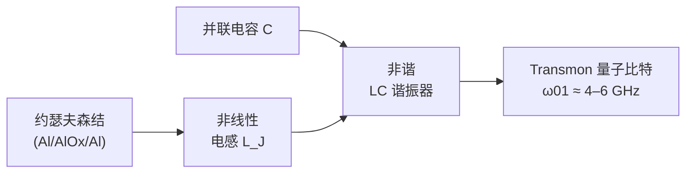

#### 1. 为什么用超导体，为什么需要结

超导体在临界温度以下可以零电阻地载流，这是因为电子结合成**库珀对（Cooper pairs）**，凝聚到单一的宏观量子态中，该态由一个复序参量 ψ = |ψ|e^{iφ} 描述，整个超导体上具有确定的相位 φ。铝是最常用的材料，在约 1.2 K 以下超导。然而，一个单纯的超导环或 LC 谐振器是*线性*谐振子：其能级等间距（E_n = ℏω(n+½)）。等间距能级对量子比特毫无用处，因为任何与 |0⟩→|1⟩ 跃迁共振的驱动，也*同样*与 |1⟩→|2⟩、|2⟩→|3⟩ 等跃迁共振——无法分离出一个二能级子空间。**关键要素是非线性**，而已知唯一的非耗散（无损）非线性电路元件就是**约瑟夫森结（Josephson junction）**。

#### 2. 约瑟夫森效应

约瑟夫森结是由一层薄的（约 1–2 nm）绝缘势垒隔开的两块超导体（对铝而言，是天然的 AlOₓ 氧化层）。库珀对相干地隧穿过势垒，由两个**约瑟夫森关系**支配：

- **直流约瑟夫森关系：** I = I_c sin φ，其中 I 是流过结的超电流，I_c 是临界电流（最大超电流），φ 是序参量跨结的规范不变相位差。值得注意的是，直流超电流在*零电压*下流动，其大小完全由相位差决定。
- **交流约瑟夫森关系：** dφ/dt = 2eV/ℏ，将相位的变化率与结两端的电压 V 联系起来（2e 为库珀对的电荷）。因此恒定电压会产生频率为约瑟夫森频率 f = 2eV/h ≈ 483.6 MHz/μV 的振荡电流——这是计量学中伏特标准的基础（文件 16）。

#### 3. 作为非线性电感的结

对直流关系求导并代入交流关系，可得结的有效电感：

V = (ℏ/2e) dφ/dt = (ℏ/2e) (1/(I_c cos φ)) dI/dt ⇒ L_J(φ) = ℏ / (2e I_c cos φ)。

这是一个**非线性电感**：它依赖于电流（通过 φ），并在 φ → π/2 时*发散*。结还储存能量 U(φ) = −(ℏI_c/2e) cos φ = −E_J cos φ，其中

E_J = ℏ I_c / 2e（即**约瑟夫森能量**）

是隧穿的特征能量尺度。余弦势是使超导量子比特成为可能的全部非谐性的来源：谐振（抛物线）势给出等间距能级，而余弦势的四次及更高阶修正（cos φ ≈ 1 − φ²/2 + φ⁴/24 − …）使能级*不等间距*，从而分离出 |0⟩→|1⟩ 跃迁。

#### 4. 充电能与量子比特哈密顿量

电路中的结还具有电容 C（结自身的电容加上任何并联电容），由此给出**充电能**

E_C = e² / 2C，

即增加一个电子电荷所需的能量。共轭变量是相位 φ（或磁通）和已隧穿的库珀对数 n（即电荷）。它们满足类似于位置和动量的对易关系 [φ, n] = i，因此该电路是一个量子力学的"粒子"，其"质量"由 C 决定，在余弦势中运动。由电容并联的单个结（并可能由偏置电荷 n_g 偏置）的标准哈密顿量为

H = 4 E_C (n − n_g)² − E_J cos φ。

比值 E_J/E_C 是最重要的单一设计参数，因为它决定了**电荷噪声敏感度**与**非谐性**之间的权衡——这正是 transmon 所解决的核心矛盾。

#### 5. 库珀对盒（电荷量子比特）及其致命缺陷

最早的超导量子比特——**库珀对盒（Cooper-pair box，CPB）**——工作在 E_J/E_C ≪ 1 的**电荷区间**。此时本征态近似为电荷态（岛上具有确定数目的库珀对），量子比特由最低的两个电荷态构成。CPB 具有大的非谐性（优点），但对电荷噪声*极其敏感*：能级强烈依赖于偏置电荷 n_g，而 n_g 会由于衬底和结氧化物中带电缺陷的移动（1/f 电荷噪声）而不可控地涨落。量子比特频率因此漂移，使量子比特在纳秒至微秒的时间尺度上退相位。工作在恰好 n_g = ½ 的"甜点"（sweet spot，此处 ∂E/∂n_g = 0，对电荷噪声一阶不敏感）有所帮助——**quantronium** 设计（Saclay，2002）证明了这一点——但二阶敏感度仍严重限制了 T₂。CPB 让该领域认识到**电荷噪声是大敌**，为 transmon 的出现铺平了道路。

#### 6. transmon：主导设计

**Koch 等（2007，"Charge-insensitive qubit design derived from the Cooper pair box"，arXiv:0703.0405）** 提出了 **transmon**（transmission-line shunted plasma oscillation qubit，传输线并联等离子体振荡量子比特），它只是让库珀对盒工作在*相反*的区间：**E_J/E_C ≫ 1**（通常为 50–100），通过增加一个大的并联电容来降低 E_C 实现。主要结果：

- **电荷色散（能量随偏置电荷的变化）随 √(E_J/E_C) 呈指数下降：** 电荷敏感度 ∝ e^{−√(8E_J/E_C)}。在 E_J/E_C ≈ 50 时，量子比特频率对偏置电荷的依赖被抑制到 10⁴–10⁶ 分之一以下，*使 transmon 在实际上对电荷噪声免疫*——这一突破将 T₂ 从纳秒量级提升到数十乃至数百微秒。
- **非谐性仅以代数方式下降**，即 α ≈ −E_C。因此电荷敏感度呈指数消失，而宝贵的非谐性只被轻微牺牲。transmon 保持 α ≈ −200 至 −300 MHz 的非谐性，相对于典型的门带宽已足够大，既能分离 |0⟩→|1⟩ 跃迁，又能从容地抑制电荷噪声。

transmon 的最低能级近似于弱非谐振子的能级：|0⟩→|1⟩ 跃迁频率 ω₀₁ ≈ (√(8E_J E_C) − E_C)/ℏ，通常为 **4–6 GHz**，而 |1⟩→|2⟩ 跃迁频率低 |α| ≈ 200–300 MHz。transmon 这一权衡的代价——小非谐性——在于快速门（其谱宽接近 |α|）有**泄漏**到 |2⟩ 的风险，因此需要 DRAG 脉冲整形（第 12 节，文件 8）。transmon 的稳健性和制造简便性使其成为 **IBM、Google 和 Rigetti** 处理器的基础；整个商用超导产业基本上都使用 transmon 的各种变体。

**分裂结（可调）transmon。** 用环路中的两个结（SQUID）取代单个结，可使 E_J 由穿过环路的磁通 Φ 调节：E_J(Φ) = E_J,max |cos(πΦ/Φ₀)|，其中 Φ₀ = h/2e 为磁通量子。这使量子比特频率可以原位调节——这对磁通可调门（Google）和避免频率碰撞至关重要——但也引入了对**磁通噪声**的敏感性（现已成为可调量子比特的主要退相位通道），并需要磁通偏置控制线（更多布线，文件 11）。固定频率 transmon（IBM 历来的选择）完全避免了磁通噪声，代价是门方案的灵活性较低，并要求对目标频率进行精确制造。

#### 7. Fluxonium：更高相干性的替代方案

**Fluxonium**（Manucharyan、Koch、Glazman、Devoret，2009）不是用电容并联结，而是用一个非常大的**超导电感**（superinductance，由长的结阵列或高动能电感材料构成）来并联，从而在并联支路中引入巨大的电感能。由此得到的量子比特具有：

- **比 transmon 大得多的非谐性**（|0⟩→|1⟩ 与 |1⟩→|2⟩ 跃迁可相差 GHz 量级），提供更干净的二能级隔离，并可容忍更快的门。
- **非常长的 T₁**（已证明 >1 ms；一些研究器件报告 T₁ 在数毫秒范围），此时器件工作在磁通甜点 Φ = Φ₀/2，量子比特跃迁处于受保护的低频区间。
- **更复杂的控制：** 较低的量子比特频率（有时为亚 GHz 到数百 MHz）以及对精确磁通偏置的需求，使 fluxonium 的控制和读出比 transmon 更为复杂。

Fluxonium 是一个重要的研究方向（耶鲁、马里兰、MIT Lincoln Lab 及初创公司），作为达到 transmon 所不能及的更高相干性和保真度的途径，目前在主要演示中报告的两比特门保真度已可与最好的 transmon 结果相当甚至超越。如果其控制复杂性能在规模化时得到驯服，它是最有希望*接替* transmon 的候选者。其他"受保护量子比特"设计（0–π 量子比特、bifluxon）以更高的复杂性为代价，进一步趋向本征噪声保护，目前大体仍处于学术演示阶段。

---

### 第二部分 — 电路量子电动力学与读出


**色散读出信号链（毫开尔文 → 室温）：**

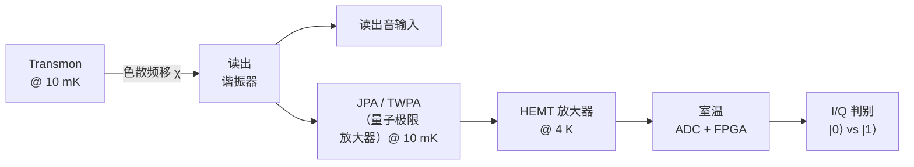

*量子比特状态使谐振器频率移动 ±χ；通过测量探测音向哪个方向移动，
即可在不直接接触量子比特的情况下读出其状态（量子非破坏测量）。*

#### 8. 电路量子电动力学架构

超导量子比特通过**电路量子电动力学（circuit quantum electrodynamics，circuit QED）**进行读出和耦合——这是腔量子电动力学的片上类比，其中"原子"是 transmon，"腔"是超导微波谐振器（共面波导或集总元件 LC 谐振器，通常为 4–10 GHz）。量子比特以耦合强度 g 电容耦合到其**读出谐振器**。Jaynes–Cummings 哈密顿量支配着量子比特–谐振器系统：

H = ℏω_r a†a + (ℏω_q/2)σ_z + ℏg(a†σ₋ + aσ₊)，

其中 ω_r 为谐振器频率，ω_q 为量子比特频率，a、a† 为谐振器光子算符。

#### 9. 色散读出

在**色散区间**——大失谐 Δ = ω_q − ω_r ≫ g——工作时，量子比特与谐振器不直接交换能量，但量子比特会以依赖于状态的量*移动谐振器频率*。二阶微扰论给出色散哈密顿量：

H ≈ ℏ(ω_r + χσ_z) a†a + (ℏω̃_q/2)σ_z，其中**色散频移** χ ≈ g²/Δ · (α/(Δ+α))，

（第二个因子考虑了 transmon 的更高能级）。当量子比特处于 |0⟩ 时谐振器频率为 ω_r + χ，处于 |1⟩ 时为 ω_r − χ。用微波音探测谐振器并测量反射/透射信号的*相位*（或幅度），即可揭示量子比特状态，而**无需直接测量量子比特**——这是一种**量子非破坏（QND）**测量，投影到 Z 本征态并保持该本征态（文件 2，第 9 节）。典型的 χ/2π ≈ 0.1–1 MHz；读出音含有几个到数十个光子。

#### 10. 读出信号链

色散信号极其微弱——只有几个携带量子比特状态的微波光子——必须通过精心设计的链路进行放大（详见文件 11）：

谐振器 → （Purcell 滤波器）→ 低温微波线 → 位于混合室/4K 级的**量子极限参量放大器**（约瑟夫森参量放大器 JPA，或行波参量放大器 TWPA）→ 低温 HEMT 放大器（约 4 K）→ 室温放大 → IQ 解调（外差/零差）→ 数字化仪 → 状态判别。

**参量放大器**至关重要：它引入的噪声接近最小量子极限（半个光子），使得在约 200–1000 ns 的读出时间内实现 **>99% 的单次读出保真度**。TWPA 的宽带增益对于**多路复用读出**（见下文）尤其有价值。没有量子极限前置放大，就需要多次平均测量，从而无法实现中途测量和纠错（文件 9）所要求的快速单次读出。

#### 11. 多路复用与 Purcell 滤波器

为每个量子比特单独布设读出线无法扩展（文件 11 的布线瓶颈）。**频域多路复用**把多个读出谐振器——每个处于不同频率——放在*共用*的馈线上；一个宽带脉冲和一条放大链即可同时读出 6–10 个以上量子比特，大幅减少线缆数量。这需要精细的频率规划，以避免谐振器碰撞和串扰。

一个复杂之处：把量子比特耦合到一个本身又耦合到有损输出线的谐振器上，会打开一个衰减通道——即 **Purcell 效应**——量子比特通过向谐振器/线路辐射而弛豫，缩短 T₁。解决办法是 **Purcell 滤波器**：置于读出谐振器与馈线之间的带通/陷波滤波器（例如短截线或专用滤波谐振器），在*读出*频率处透明，而在*量子比特*频率处反射（高阻抗），使读出光子可自由通过，而量子比特频率的光子无法逸出。Purcell 滤波器使设计者能够使用强的量子比特–谐振器耦合（快速读出）而不牺牲 T₁——这现已成为所有高性能超导设计的标准部件。

---

### 第三部分 — 量子比特间耦合与两比特门


**超导两比特门的两大类：**

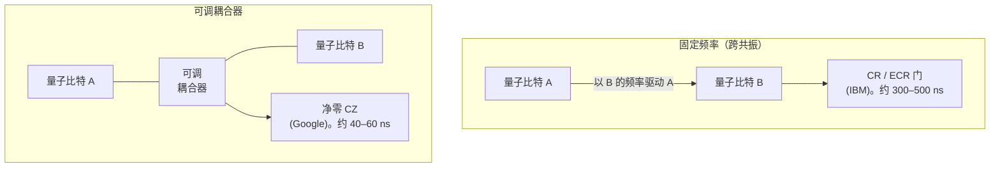

两比特门是最困难、保真度最低、也最能决定架构的环节。各主要厂商的区别很大程度上在于*它们如何耦合量子比特以及运行何种纠缠门*。

#### 12. 耦合机制与泄漏控制

- **直接电容耦合：** 两个 transmon 之间的耦合电容给出常开的交换相互作用。简单但不灵活——耦合无法关断，导致必须围绕其进行校准的常开 ZZ 串扰（文件 2，第 13 节）。
- **总线谐振器耦合：** 量子比特耦合到共用的谐振器"总线"，实现更长程和多比特耦合。
- **可调耦合器：** 置于两个量子比特之间的*可调*元件（磁通可调 transmon 或 SQUID），其耦合可在执行门时开启、其余时间关闭——这是现代首选方案（Google、IBM Heron），因为它抵消了常开的 ZZ 相互作用，并提供干净的门开/关控制。

**泄漏与 DRAG。** 由于 transmon 的 |2⟩ 态仅比 |1⟩ 高约 250 MHz，谱成分接近该失谐的快速脉冲会激发泄漏，使布居离开计算子空间。**DRAG（Derivative Removal by Adiabatic Gate，绝热门导数移除）**脉冲整形添加一个与主脉冲包络时间导数成正比的正交分量，与泄漏跃迁振幅发生相消干涉，将泄漏抑制若干数量级——使 20–30 ns、保真度 >99.9% 的单比特门成为常规操作。确实发生的泄漏在纠错（文件 9）中尤其有害，这推动了**泄漏消除单元（leakage reduction units，LRUs）**的发展，它们在每个周期主动把泄漏出去的布居复位回计算子空间。

#### 13. 跨共振（CR）门——IBM 的固定频率方案

IBM 历来制造**固定频率** transmon（无磁通噪声，但也没有频率可调性），由固定电容/总线耦合。由于没有可调耦合器，纠缠门通过**跨共振（cross-resonance，CR）**效应以**全微波**方式驱动：以*目标*比特的频率驱动*控制*比特。到二阶，这会产生有效的 **ZX 相互作用**（以控制比特的 Z 态为条件对目标比特进行旋转），再加上单比特修正即得到 CNOT。CR 门通常为 **200–400 ns**，比可调耦合器门慢，而且其校准十分复杂——原始 CR 驱动还会产生不需要的 IX、ZI 和 ZZ 项，必须通过**回波序列**（CR–π–CR，带旋转相位）和主动抵消音来消除。CR 的优点是没有磁通噪声退相位，也不需要额外的耦合器硬件；它的局限（速度、在密集晶格中对频率碰撞的敏感性）促使 IBM 转向**重六边形（heavy-hex）**拓扑（第 17 节），并最终在 Heron 一代转向可调耦合器。

#### 14. 可调耦合器 CZ 门——Google 的方案

Google 的 **Sycamore** 和 **Willow** 处理器使用**带可调耦合器的磁通可调 transmon**。CZ 门的工作方式是通过磁通调节耦合器（或量子比特），使 |11⟩ 态与非计算态 |02⟩ 共振；由此产生的避免交叉使 |11⟩ 相对于其他计算态累积 π 的条件相位，从而实现 CZ。由于耦合强且相互作用快，**CZ 门只需约 20–30 ns**——大约比 CR 快 10 倍——这减少了每个门的退相干暴露。代价是对磁通噪声的敏感，以及针对**频率拥挤**（避免众多量子比特和耦合器之间不需要的共振）对大量可调元件进行校准的高难度；Google 用复杂的**频率优化**例程来处理这一问题，为每个量子比特/耦合器分配工作频率，使整个芯片上的碰撞最小化。Google 还通过同样的可调硬件运行快速、高保真的 **iSWAP 族**和 **√iSWAP** 门。

#### 15. 参量门与 IBM Heron 一代

**参量门（Parametric gates）**以两个量子比特之间的*差频*调制某个可调元件（耦合器或量子比特磁通），仅在调制开启期间诱导共振边带相互作用（有效的 iSWAP 或 CZ）——实现干净的门激活，并能够桥接不同频率的量子比特。Rigetti 的处理器使用参量两比特门。IBM 的 **Heron** 处理器（2023 年推出）标志着 IBM 从固定频率 CR 门转向**可调耦合器架构**，相对于固定频率的 Eagle 一代，大幅提高了两比特门保真度并降低了串扰——这是 IBM 对于可调耦合器（Google 长期使用）已成为跨越纠错阈值所必需的承认。2023–2024 年前后业界的总体趋同方向是以**可调耦合器 + 快速 CZ/iSWAP 门**作为最高保真度的超导方案。

---

### 第四部分 — 制造与封装


**超导量子比特制造流程：**

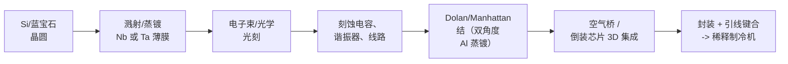

#### 16. 材料与二能级系统（TLS）损耗问题

超导量子比特通过在低损耗衬底上进行薄膜沉积和光刻制造，但其相干性最终受**微观材料缺陷**限制：

- **衬底：** 高阻**硅**或**蓝宝石**（单晶 Al₂O₃），因其低介电损耗角正切而被选用（文件 23）。
- **超导薄膜：** **铝**（最常见，易于蒸镀和氧化以制造结），并越来越多地使用**铌**（更高的 T_c，用于接地平面和谐振器）和**钽**——普林斯顿/IBM 的研究（Place 等，2021）表明，**钽薄膜生长出比铝更薄、更稳定的表面氧化物**，降低了表面介电损耗，将 transmon 的 T₁ 推至 300 μs–0.5 ms 以上，这一显著的相干性改进完全归功于材料。
- **结势垒：** **氧化铝（AlOₓ）**，在制造过程中通过对铝表面进行受控的原位氧化形成（第 18 节）。

**二能级系统（TLS）**是主要的相干性限制因素：非晶氧化层（天然 Al₂O₃、SiO₂、结势垒）及材料界面中的原子尺度缺陷（悬挂键、被俘获电荷、隧穿原子）表现为寄生的二能级系统，它们与量子比特的电场耦合并吸收其能量（限制 T₁）或发生涨落（导致退相位）。关键设计指标是**表面参与比（surface participation ratio）**——量子比特电场能量储存在有损界面区域中的比例。将其最小化（通过扩大量子比特电容极板以稀释电场、选择低损耗界面，以及在金属边缘对衬底进行**开槽/刻蚀**以去除有损材料）可直接提高 T₁。**表面处理与清洗**（去除天然氧化物、氢终止、优化沉积）是一个重要的、持续进行的、"枯燥但必不可少"的相干性工程前沿（文件 23、25）。

#### 17. 晶格拓扑：重六边形与频率碰撞

对于*固定频率*的 CR 门器件，两个频率意外接近的量子比特会发生**频率碰撞**，破坏门保真度，且碰撞概率随邻居数量增加而增大。IBM 采用了**重六边形（heavy-hex）**晶格——一种六边形布局，每个量子比特仅有 **2 或 3 个邻居**（度 ≤ 3），而不是度为 4 的方形晶格——专门用来*降低频率碰撞概率以及 CR 门的旁观者/串扰负担*，代价是连通性更稀疏（编译中需要更多 SWAP，文件 8）。Google 使用可调耦合器（对频率碰撞的容忍度更高），运行**更密集的方形/网格晶格**，与表面码的原生方形结构更匹配（文件 9）。因此拓扑选择与门方案紧密耦合：重六边形是对 CR 门的迁就；方形网格适合可调耦合器 CZ 门和表面码。

#### 18. 约瑟夫森结制造：Dolan 桥

结的 AlOₓ 势垒通过使用悬空光刻胶桥（**Dolan 桥**）的**双角度阴影蒸镀**制成——详见文件 23。简言之：将双层光刻胶图形化出一座独立悬空的桥；以一个角度蒸镀铝（沉积底电极），原位氧化表面（受控的 O₂ 压强和时间决定约 1–2 nm 的 AlOₓ 势垒厚度，从而决定结的临界电流 I_c），然后以第二个角度蒸镀铝（顶电极通过桥的阴影与第一层重叠，形成结）。由于 I_c（进而 E_J 和量子比特频率）随势垒厚度呈指数依赖，**结制造的偏差会直接转化为量子比特频率的离散**——这是规模化时的良率和频率靶向挑战。制造后的**激光退火**可以微调单个结的电阻以达到目标频率，提高大型多比特芯片的良率并减少频率碰撞（对固定频率器件尤为重要）。

#### 19. 3D 集成与倒装芯片

随着量子比特数量增长，在与量子比特相同的平面上布设控制和读出线路会造成串扰和密度限制。**倒装芯片 3D 集成**将**量子比特芯片**与**控制/读出中介层芯片**分开，通过**铟凸点键合**面对面键合。量子比特位于低损耗衬底上，不受密集布线干扰，而信号在第二块芯片上布线，垂直互连（有时还有硅通孔）在各层之间传输信号。倒装芯片用于 **Google Sycamore/Willow** 和 IBM 的较大处理器，对于扩展到数百个量子比特以上、同时保持相干性并管理布线至关重要（文件 11、23）。

#### 20. 稀释制冷机的封装

封装后的处理器必须在约 10–20 mK 下存活并工作（文件 11）：

- **高密度微波布线：** 数十到数千条同轴/柔性线路传送控制和读出信号，每条线在制冷机的每一级都要热锚定，以避免把室温热噪声带到量子比特。
- **磁屏蔽：** 坡莫合金（mu-metal）和超导屏蔽保护磁通可调量子比特免受环境和杂散磁场的影响，否则这些磁场会使其退相位；甚至地球磁场和附近的磁化部件也很重要。
- **红外/准粒子抑制：** 遮光的、吸收红外的（Eccosorb）滤波防止杂散高频光子把库珀对打破成**准粒子**，这是已知的限制 T₁ 的机制；通过仔细的滤波和屏蔽（有时还有"准粒子陷阱"）加以应对。
- **机械与热设计：** 振动隔离（颤噪效应 microphonic 噪声会调制磁通/电荷）以及芯片与混合室之间的稳健热锚定。

---

### 第五部分 — 主要超导系统

> **验证说明。** 以下量子比特数量和保真度反映的是有文献记录的 2019–2024 年的发展轨迹，对于任何 2026 年以后的说法，应对照厂商当前披露的信息重新核实（文件 22）。

#### 21. IBM

IBM 运营着公开可访问的最大超导设备群，全部**基于 transmon**，通过 Qiskit Runtime 访问（文件 12）：

- **Eagle（127 量子比特，2021）：** IBM 首个超过 100 量子比特的设备，采用**重六边形**晶格，使用固定频率 transmon 和 CR 门，并采用 3D 集成技术（多层布线、硅通孔）来引出控制线。
- **Osprey（433 量子比特，2022）**和 **Condor（1121 量子比特，2023）：** 展示了单片规模化能力——Condor 跨过了 1000 物理量子比特大关——不过 IBM 在 2023 年之后明确地把重点从原始数量转向**质量和模块化**。
- **Heron（133 量子比特，2023；后续修订版）：** 转向**可调耦合器**架构，相比固定频率 CR 一代，两比特门保真度明显提高、串扰降低——这是 IBM 质量最高的处理器系列。
- **IBM Quantum System Two：** 一个模块化低温平台，旨在容纳并互连多个 Heron 级芯片，是 IBM **模块化扩展计划**（用耦合器连接芯片，例如 "Flamingo"/长程耦合器以及 "Crossbill"/"Kookaburra" 概念）的物理体现，也是其转向 **qLDPC 双变量自行车码（bivariate-bicycle codes）**（文件 9）的体现，这类码需要比最近邻更长程的连通性——推动了耦合器/布线层路线图（文件 19）。

IBM 的战略定位是"稳妥的企业选择"：最广泛的软件生态（Qiskit 占据主导的心智份额）、持续时间最长的项目，以及最公开、最细致的路线图（文件 19、20）。

#### 22. Google Quantum AI

Google 的处理器使用**带可调耦合器和倒装芯片集成的磁通可调 transmon**，优化目标是*纠错质量*而非原始数量：

- **Sycamore（53–54 量子比特，2019）：** **量子霸权（quantum-supremacy）**随机电路采样的宣称（量子约 200 秒 vs. 估计经典需 10,000 年，后来受到质疑，文件 1、14），也是首批表面码实验的演示平台。
- **Willow（2024 年 12 月宣布，约 105 量子比特）：** **"低于阈值"**演示（Nature 2024，arXiv:2408.13687）——将表面码距离从 d=3 → 5 → 7 增加，逻辑错误率*单调下降*（每增加一次距离大致减半），这是对阈值定理在规模化时成立的首次令人信服的实验确认（文件 9）。Willow 还报告了随机电路采样基准，以及相对于 Sycamore 提高的 T₁（约 100 μs）。

Google 的公开姿态是研究与发表驱动，而非商业云驱动（没有可与 IBM 网络相比的广泛企业级量子产品），对 Alphabet 的战略价值被表述为长期的技术领导地位（文件 19、20）。

#### 23. Rigetti、IQM 及其他

- **Rigetti Computing（Nasdaq: RGTI）：** **带参量两比特门的可调 transmon**；Aspen 和 **Ankaa** 系列；以**多芯片模块化**架构（将较小的芯片拼接）作为其扩展策略。在近期公开基准中，量子比特数量和保真度低于 IBM/Google；商业模式依赖英国/政府资助的合作（文件 19、20）。
- **IQM（芬兰）：** 欧洲超导厂商，构建本地部署系统并为与 HPC 集成的量子工作做出贡献；采用可调耦合器设计。
- **AWS：** 追求**猫态量子比特（cat qubits）**（玻色编码、偏置噪声编码；文件 7），并结合 transmon 辅助比特进行纠错——这是一项独特的架构押注，旨在通过在硬件层面抑制比特翻转来降低 QEC 开销（文件 7、9）。
- **Alice & Bob（法国）：** 一家专注于**猫态量子比特**的公司（文件 7），将公司的赌注押在偏置噪声硬件加重复码上。
- **Origin Quantum（中国）**和**中国科大的祖冲之号（Zuchongzhi）**项目：中国的超导研究工作，其中中国科大的祖冲之系列产生了相互竞争的随机电路采样"霸权"宣称（文件 14、19、21）。
- **QuTech / TU Delft：** 领先的*学术*支柱，是大量基础超导（及自旋量子比特）研究和人才的来源（文件 20）。

---

### 第六部分 — 性能指标与现状

#### 24. 门保真度

- **单比特门保真度：** 在领先设备上通常 **>99.9%**，受 T₁/T₂ 和控制脉冲不完美限制；采用 DRAG 的门时间为 20–40 ns。
- **两比特门保真度：** 已报告的最佳值约为 **99.5–99.9%**，取决于门类型和处理器代际。可调耦合器 CZ/iSWAP 门（Google、IBM Heron）和最佳的 fluxonium 门处于领先；固定频率 CR 门稍有落后。这些数字*接近*表面码阈值（电路级约 1%），这正是低于阈值的演示（文件 9）如今得以实现、但余量仍然很薄，并取决于对泄漏和关联错误的抑制（文件 2，第 13 节）的原因。
- **读出保真度：** 采用量子极限放大，在 200–1000 ns 内单次读出 **>99%**。

#### 25. 相干时间

- **T₁：** 当前量产器件中通常为 **50–300 μs**；采用钽薄膜或 fluxonium 的研究器件可达 **>1 ms**。T₁ 受 TLS 介电损耗、Purcell 效应和准粒子限制（第 11、16 节）。
- **T₂：** 与 2T₁ 相当或更低；磁通可调量子比特受磁通噪声限制（通过工作在磁通甜点来缓解），固定频率量子比特则受读出谐振器的光子散粒噪声退相位和残余 TLS 限制。

#### 26. 连通性限制及其后果

超导量子比特是**制造出来的、固定的、局部连接的**：每个量子比特仅与其 2–4 个物理近邻耦合。这有三个主要后果，其影响波及整个数据库：

1. **编译开销（文件 8）：** 在不相邻的量子比特之间路由逻辑相互作用需要插入 **SWAP 网络**，增大电路深度和退相干暴露——这是 NISQ 时代的核心性能税，而全连接的离子阱（文件 4）可避免之。
2. **表面码适配（文件 9）：** 最近邻二维网格连通性*原生匹配表面码*，这是表面码（而非更高连通性的码）主导超导路线图的主要原因。
3. **qLDPC 的张力（文件 9、19）：** 开销更低的 qLDPC 码（IBM 的双变量自行车码）需要比最近邻更*长程*的连通性，从而推动新的**耦合器/布线层**硬件——这是硬件/理论协同设计的前沿（文件 25）。这就是 IBM 的模块化路线图在长程耦合器上大量投入的原因。

**布线瓶颈**（文件 11）使扩展挑战更加严峻：每个固定量子比特都需要专用的控制/读出线，其在混合室的热负载限制了单个低温恒温器能支持的量子比特数，从而推动了低温 CMOS、多路复用以及模块化多制冷机架构的发展。

---

### 第七部分 — 综合与交叉引用

超导量子比特在模态权衡空间（文件 7 的比较表）中占据特定的位置：**快速门**（ns 至数百 ns，是物质量子比特中最快的）、**中等相干性**（T₁/T₂ 在 100 μs 量级，远短于离子/原子）、**固定的局部连通性**（带来繁重的编译开销，并有利于表面码）、**低温运行**（约 10 mK，即文件 11 中稀释制冷机和布线的负担），以及**光刻制造**（与半导体产业共享工具，文件 23，但受 TLS 材料损耗限制）。尽管绝对 T₂ 很短（文件 2，第 25 节），其快速门仍提供了巨大的*每相干时间操作数*预算，其二维网格连通性是天然的表面码基底——这就是该领域标志性的纠错里程碑（Google 的低于阈值结果，文件 9）最先在这里实现的原因。

决定性的工程战役有四项：(1) 通过材料（钽、表面处理；文件 23）和设计（大极板、Purcell 滤波器、fluxonium）攻克 TLS 损耗以**提高相干性**；(2) 通过可调耦合器和泄漏抑制（DRAG、LRUs）**提高两比特保真度**；(3) **驯服串扰**（通过可调耦合器实现 ZZ 抵消、重六边形拓扑、频率优化）；(4) **解决布线/低温扩展问题**（低温 CMOS、多路复用、倒装芯片、模块化多制冷机系统；文件 11）。这四方面的进展将决定超导量子比特能否达到容错算法所需的数千乃至数百万物理量子比特（文件 18）。

*交叉引用：底层形式体系与噪声信道（文件 2）；跨模态比较与猫态/玻色量子比特（文件 7）；稀疏连通性上的编译与 SWAP 路由（文件 8）；表面码 QEC 与低于阈值结果（文件 9）；低温、控制电子学与布线瓶颈（文件 11）；材料与约瑟夫森结制造细节（文件 23）；使用这些硬件参数的资源估算（文件 18）；基准测试指标与跨厂商比较（文件 22）；IBM/Google/Rigetti 路线图（文件 19）与竞争定位（文件 20）。*

---

### 第八部分 — 扩展物理：从量子 LC 振子到 transmon 能谱

第一部分的简要论述只是断言了 transmon 的能谱；本部分对其进行推导，因为这一推导正是器件物理学家为使量子比特达到目标频率和非谐性而*设计*它时所用的推理。

#### 27. 量子化 LC 振子

从线性 LC 电路开始：一个电感 L 和一个电容 C。电容上的电荷 Q 与电感中的磁通 Φ 是共轭变量，[Φ, Q] = iℏ，哈密顿量为

H = Q²/2C + Φ²/2L，

这与力学振子完全类似（Q ↔ 动量，Φ ↔ 位置，C ↔ 质量，1/L ↔ 弹簧常数）。其本征态以 ℏω 等间距分布，ω = 1/√(LC)。引入升降算符 Φ = Φ_zpf(a + a†)、Q = −iQ_zpf(a − a†)，其中零点涨落 Φ_zpf = √(ℏZ/2)、Q_zpf = √(ℏ/2Z)，特征阻抗 Z = √(L/C)，得到 H = ℏω(a†a + ½)。**对量子比特而言的致命特征：** 能谱是*谐振*的——E_{n+1} − E_n = ℏω 与 n 无关——因此没有任何驱动能够选择性地只寻址 |0⟩→|1⟩ 跃迁。每一种超导量子比特，都是通过用非线性约瑟夫森电感替代或补充线性电感，来给这个振子*增加非谐性*的一种策略。

#### 28. 用微扰论求 transmon 能谱

用约瑟夫森结替换线性电感，得到 H = 4E_C n² − E_J cos φ（第 4 节），其中 n 为库珀对数，φ 为相位，[φ, n] = i。在 transmon 区间 E_J/E_C ≫ 1，相位 φ"很重"，局域在余弦势阱底部附近，因此展开 cos φ ≈ 1 − φ²/2 + φ⁴/24。二次项给出一个谐振子，其**等离子体频率**为 ω_p = √(8 E_J E_C)/ℏ；四次项是微扰。将 φ⁴ 作为一阶微扰处理，得到 transmon 能级：

E_n ≈ −E_J + √(8 E_J E_C)(n + ½) − (E_C/12)(6n² + 6n + 3)。

由此可得：

- **|0⟩→|1⟩ 跃迁：** ℏω₀₁ = E₁ − E₀ ≈ √(8 E_J E_C) − E_C。对于 E_J/h = 15 GHz 和 E_C/h = 0.25 GHz，ω₀₁/2π ≈ √(8·15·0.25) − 0.25 ≈ 5.48 − 0.25 ≈ 5.2 GHz——正好落在标准的 4–6 GHz 频段，由 E_J 和 E_C 的*几何平均*决定。
- **非谐性：** α = (E₂ − E₁) − (E₁ − E₀) ≈ −E_C ≈ −250 MHz（对 E_C/h = 0.25 GHz）。非谐性几乎完全由充电能决定，即由*电容*决定：并联电容越大（E_C 越小），非谐性越小，但电荷噪声免疫性越好。这是设计者可以明确调节的旋钮。

因此设计流程是：选取 E_C（电容几何）来设定非谐性（通常 |α|/2π ≈ 200–300 MHz，在门速度与泄漏之间折中），然后选取 E_J（通过势垒氧化控制结的临界电流）使 ω₀₁ 落在频段内。由于 E_J ∝ I_c 随 AlOₓ 势垒厚度呈指数依赖，在数百个量子比特上把 ω₀₁ 控制在数十 MHz 以内，就是第 18 和 23 节中的频率靶向良率问题，激光退火可部分解决之。

#### 29. 电荷色散：transmon 的确切收益

带偏置电荷 n_g 的库珀对盒哈密顿量为 H = 4E_C(n − n_g)² − E_J cos φ，对 n_g 呈周期性。通过 Mathieu 函数求解，*电荷色散*——能级 m 随 n_g 的峰峰变化——为

ε_m ∼ E_C · (2^{4m+5}/m!) · √(2/π) · (E_J/2E_C)^{m/2+3/4} · e^{−√(8E_J/E_C)}。

**指数因子 e^{−√(8E_J/E_C)}** 是全部关键所在：在 E_J/E_C = 50 时，√(8·50) = 20，e^{−20} ≈ 2×10⁻⁹，因此量子比特频率对涨落偏置电荷的依赖被抑制到十亿分之一量级——电荷噪声变得无关紧要。这是对 transmon 为何有效的定量表述，也说明了为什么不能无限制地继续提高 E_J/E_C：同样的大 E_J/E_C 在抑制电荷色散的*同时*也缩小了非谐性（α ≈ −E_C，此时 E_C 很小），最终使量子比特过于谐振而无法干净地控制。E_J/E_C ≈ 50–100 的甜点就是对这一张力的解决。

#### 30. 磁通调节与 SQUID transmon 详解

用由两个结（面积/临界电流 I_{c1}、I_{c2}）组成的 SQUID 环取代单个结，使有效约瑟夫森能量依赖于磁通：

E_J(Φ) = E_{JΣ} |cos(πΦ/Φ₀)| √(1 + d² tan²(πΦ/Φ₀))，

其中 E_{JΣ} = E_{J1}+E_{J2}，d = (E_{J1}−E_{J2})/(E_{J1}+E_{J2}) 为结的不对称度。对于对称结（d=0），E_J(Φ) = E_{JΣ}|cos(πΦ/Φ₀)|，可从最大值（Φ=0）调节到接近零（Φ=Φ₀/2）。量子比特频率因而可在 GHz 量级的范围内调节，实现磁通激活的 CZ 门（第 14 节）和频率碰撞规避。代价是：量子比特频率现在依赖于磁通，因此**磁通噪声** δΦ 以由*斜率* ∂ω₀₁/∂Φ 决定的速率使量子比特退相位。在**磁通甜点**（Φ=0 和 Φ=Φ₀/2）处该斜率为零，给出对磁通噪声的一阶不敏感——这就是可调量子比特在空闲时、并尽可能在运行时都处于甜点的原因。不对称 SQUID（d≠0）在一个有用的中间频率处提供第二个甜点，以调节范围换取受保护的工作点。这种磁通调节物理是 Google 和 Rigetti 门方案的基础，也是防止大芯片上发生碰撞的频率分配优化的基础。

#### 31. 测量诱导退相位与读出权衡

色散读出（第 9 节）原则上是 QND 的，但*测量过程本身*会在读出期间使量子比特退相位——这是一个对保真度有实际影响的微妙之处。读出谐振器中的光子携带"哪个状态"的信息；通过色散耦合，量子比特感受到的这些光子的散粒噪声涨落会随机移动量子比特的相位。**测量诱导退相位速率**为 Γ_φ ≈ 8χ²n̄/κ（对于线宽 κ 的谐振器中有 n̄ 个光子），因此更亮、更快的读出（更多光子）会使量子比特退相位更多。这就构成了一个基本权衡：强耦合 χ 和多光子给出快速、高保真的 *Z 基*读出，但会使任何*未被测量*的量子比特的相干性变差（多路复用读出期间的旁观者效应），并限制多次重复测量中测量的 QND 程度。设计者平衡 χ、κ、n̄ 和读出时长，在最大化单次保真度的同时最小化附带的退相位——而 Purcell 滤波器（第 11 节）让他们能更强地提高 χ 而无 T₁ 惩罚。这也是为什么纠错的症状提取（文件 9）——在数据比特空闲时反复测量辅助比特——必须小心地将数据量子比特与测量反作用隔离开来。

---

### 第九部分 — 门校准、误差预算与运行实践

#### 32. 单比特校准栈

把一块制造出来的芯片变成可工作的处理器，是一个分层的校准过程，由自动化例程运行（并随参数漂移而定期重跑）（文件 8、11）：

1. **谐振器谱学：** 找出每个读出谐振器的频率（扫描探测音，找到凹陷）。
2. **量子比特谱学：** 找出 ω₀₁（双音谱学：在谐振器上施加探测，同时扫描量子比特驱动）。
3. **Rabi 校准：** 扫描驱动幅度以校准 π 和 π/2 脉冲的幅度（Rabi 速率与幅度的关系）。
4. **Ramsey / 频率精调：** 通过 Ramsey 条纹测量精确的量子比特频率和失谐；更新驱动频率。
5. **DRAG 系数校准：** 调节 DRAG 正交分量的比例，使泄漏和相位误差最小（例如通过对泄漏敏感的重复门放大序列）。
6. **读出判别：** 校准区分 |0⟩ 和 |1⟩ 读出云团的 IQ 平面判决边界（通常是训练得到的分类器）；表征并存储读出混淆矩阵，供之后的测量误差缓解使用（文件 10）。
7. **随机基准测试：** 验证单比特门保真度（目标 >99.9%）。

两比特校准还增加了纠缠门幅度/相位/时序调节、ZZ 抵消音（对 CR）或耦合器磁通脉冲整形（对可调耦合器 CZ）、回波时序，以及用于验证两比特保真度的交错 RB。**校准漂移**——TLS 谱扩散、磁通偏置漂移、温度涨落——意味着这些例程必须在后台持续运行；上午 9 点"良好"的设备到下午可能需要重新校准，这是云端访问硬件（文件 12）的一个重要运行现实，也是使基准测试复杂化的运行间变异性的来源（文件 22）。

#### 33. 一个具体的两比特误差预算

将一个典型的约 99.5% 保真度的可调耦合器 CZ 门（误差 ≈ 5×10⁻³）分解为各部分贡献，以说明工程努力在哪里能有回报：

- **退相干（T₁/T₂）：** 对于 t_gate ≈ 30 ns、T₁ ≈ 100 μs、T₂ ≈ 100 μs，受相干性限制的误差约为对两个量子比特求和的 t_gate(1/T₁ + 1/T₂) ≈ 30 ns × (10⁴ + 10⁴) s⁻¹ × 2 ≈ 1.2×10⁻³。因此退相干约占总量的四分之一——提高相干性（文件 16/23 的材料工作）会直接有帮助，但并非全部。
- **泄漏到 |2⟩/|02⟩：** 磁通脉冲之后残留在计算子空间之外的布居，在良好的脉冲整形下通常为 10⁻³–10⁻⁴；若脉冲调节不完善，这是主要的*相干*误差，并且对 QEC 危害最大（文件 9）。
- **控制误差：** 磁通脉冲幅度/时序的不完美、控制线频率响应造成的畸变（需要对磁通线做预畸变/"cryoscope"校准），以及门期间的残余 ZZ——合计另有约 1–3×10⁻³。
- **串扰与旁观者：** 门期间对邻近量子比特的杂散驱动和耦合。

文件 18 的敏感性分析中反复出现的教训：没有单一占主导的误差可以去修正；要达到能提供充裕纠错余量的 99.9%+ 两比特保真度，需要在相干性、脉冲控制、泄漏和串扰上*同时*取得进展。这就是为什么尽管多年来不断有渐进的改进，要远低于阈值仍如此困难。

#### 34. 复位与中途测量

纠错（文件 9）和许多算法需要**快速量子比特复位**（在电路中途将量子比特恢复到 |0⟩）和**中途测量**（测量某些量子比特而其他量子比特继续计算）。超导复位方法包括：**主动复位**（测量，然后若发现处于 |1⟩ 则有条件地施加 X——快速但受测量限制）、通过驱动 |1⟩→|2⟩→谐振器跃迁来倾泻能量的**无条件复位**，以及专用的复位耦合器。中途测量要求读出一个量子比特时不扰动其近邻（测量诱导退相位，第 31 节）——这是一项苛刻的隔离要求，与快速反馈延迟（文件 11）一起，是实时纠错的前提条件。IBM 和 Google 均已演示了达到重复症状提取所需保真度和速度的中途测量与复位，这是低于阈值结果（文件 9）的关键促成因素。

---

### 第十部分 — 历史脉络与相干性进展

#### 35. 相干时间时间线

超导量子比特的历史很大程度上就是 T₂ 改进的历史，常被概括为"相干性的摩尔定律"——二十年间大约每 3 年提高一个数量级：

- **1999（Nakamura、Pashkin、Tsai，NEC）：** 首次实现对库珀对盒的相干控制；相干时间约 1 ns。
- **2002（Saclay quantronium；耶鲁、NEC）：** 甜点操作；T₂ 达约 0.5 μs。
- **2004–2007（耶鲁电路 QED；transmon 的发明）：** 电路 QED 架构（Wallraff 等 2004 年实现量子比特与谐振器的强耦合）和 transmon（Koch 2007）将 T₂ 推进到微秒量级。
- **2011–2013（3D transmon，耶鲁）：** 将 transmon 置于 3D 微波腔中（Paik 等 2011）降低了表面参与比，将 T₁/T₂ 推至约数十至 100 μs。
- **2019（Google Sycamore）：** T₁ 约 16 μs，但为快速门和二维网格可扩展性而设计；量子霸权演示。
- **2021（钽 transmon，Princeton/Place 等，arXiv:2003.00024 及后续工作）：** 通过材料改进使 T₁ 接近/超过 300 μs。
- **2024（Google Willow）：** 在可扩展的二维网格纠错器件中 T₁ 约 100 μs；低于阈值演示。

主线是：每一次飞跃都来自攻克某个特定的损耗机制——电荷噪声（transmon）、表面/接缝损耗（3D 腔，然后以更好的表面回到 2D）以及 TLS 氧化物损耗（钽、表面处理）——这说明相干性进展是*材料与设计科学*（文件 23、25），而非单一的突破。

#### 36. 为什么超导量子比特赢得了早期规模化竞赛

尽管相干性比离子或原子更短，超导量子比特由于若干相互汇聚的原因，实现了最早的大规模门模型处理器和首个低于阈值的纠错：(1) **快速门**提供了大的每相干时间操作数预算（文件 2，第 25 节）；(2) **光刻制造**借助半导体工具，使每个芯片上可有许多量子比特；(3) **二维网格连通性原生适配表面码**（文件 9）；(4) **全电控制**（微波/磁通，无需激光）可与成熟的射频/微波工程集成；(5) 大量、持续的投入（IBM、Google）积累了深厚的校准、控制和制造专业能力。这些优势与该模态的决定性弱点捆绑在一起——低温运行和布线瓶颈（文件 11）、受 TLS 限制的相干性（文件 23）、以及稀疏连通性带来的 SWAP 密集型编译（文件 8）——下一阶段的规模化（模块化架构、qLDPC 码、低温 CMOS）必须克服这些弱点（文件 9、11、19、25）。

---

### 第十一部分 — 开放的工程问题（超导专有）

结合文件 25 更广泛的前沿讨论，超导专有的开放问题有：

1. **规模化下超过 1 ms 的相干性：** 将 fluxonium / 钽 transmon 的纪录相干性转化为*可制造的、多量子比特*处理器，而不仅仅是单器件演示——这是材料和良率方面的挑战（文件 23）。
2. **两比特保真度达到 99.99%：** 低开销纠错的充裕余量目标（文件 18）；需要同时改进泄漏、串扰、相干性和控制畸变（第 33 节）。
3. **布线/低温之墙：** 在热负载不压垮稀释制冷机的前提下，向 10⁴–10⁶ 个量子比特传送控制信号——核心的规模化瓶颈，通过低温 CMOS、信号多路复用、光子链路和模块化多制冷机系统来攻克（文件 11）。
4. **面向 qLDPC 码的长程连通性：** 构建耦合器/布线层，在物理上实现低开销 qLDPC 码（IBM 双变量自行车码，文件 9）所要求的非最近邻连通性，同时不重新引入串扰——硬件/理论协同设计的前沿（文件 9、25）。
5. **模块化互连：** 高保真的芯片间和制冷机间量子链路（微波或微波到光学的转换；文件 15），以扩展到单芯片/单低温恒温器之外——IBM 及其他方的明确路线图依赖（文件 19）。
6. **关联错误抑制：** 通过能隙工程、屏蔽和码层面的韧性，缓解宇宙射线引起的突发错误（可一次性翻转许多量子比特，破坏纠错的独立性假设，文件 2 第 13 节）——这是 Google 等的器件研究所揭示的、对大规模容错被低估的威胁。

解决这些问题将决定超导量子比特——如今已部署的门模型系统和已演示的纠错的领跑者——能否达到文件 18 的资源估算所要求的容错规模。该模态的发展轨迹——快速门、表面码原生连通性，以及该领域最深厚的制造/控制工程基础——使其成为领跑者，但布线、相干性和连通性之墙是真实存在的，尚未被攻克。

*交叉引用：振子量子化与噪声形式体系（文件 2）；猫态/玻色及 fluxonium 相关设计（文件 7）；稀疏连通性上的编译（文件 8）；表面码与低于阈值结果（文件 9）；使用读出混淆矩阵的误差缓解（文件 10）；低温、控制电子学、布线瓶颈、低温 CMOS（文件 11）；使用这些参数的资源估算（文件 18）；IBM/Google/Rigetti 路线图（文件 19）；竞争定位（文件 20）；基准测试与校准漂移效应（文件 22）；材料、Dolan 桥结制造、钽薄膜、倒装芯片（文件 23）；前沿问题（文件 25）。*

---

### 第十二部分 — 更广泛的超导电路家族

超导量子处理器不仅仅是量子比特；它是一个由超导微波器件构成的生态系统，其中若干器件本身就是量子极限的仪器。理解它们对于理解读出和控制至关重要。

#### 37. 共面波导与集总元件谐振器

读出和总线谐振器通过**共面波导（CPW）**传输线谐振器（中心导体两侧是接地平面，由光刻图形化）或**集总元件** LC 谐振器实现。半波（λ/2）或四分之一波（λ/4）CPW 谐振器的基频由其长度决定；品质因数 Q（由材料损耗决定的内部 Q_i，与馈线的耦合 Q_c）决定线宽 κ = ω_r/Q。总线和量子极限工作需要高**内部 Q**（低损耗）；**受控的外部 Q** 决定读出带宽和速度。限制量子比特 T₁ 的同样的 TLS 表面损耗（第 16 节）也限制谐振器的 Q_i，因此谐振器 Q 的测量是制造开发期间材料质量的标准、快速的代理指标（文件 23）——无需制造完整量子比特，即可通过测量谐振器 Q 来筛选衬底和表面处理。

#### 38. 约瑟夫森参量放大器（JPA）

量子极限放大（第 10 节）由用约瑟夫森结构建的**参量放大器**提供。**JPA** 本质上是一个由强音泵浦的非线性（约瑟夫森）谐振器；约瑟夫森非线性介导一个参量过程，放大接近泵浦频率一半处（简并、相敏）或接近共振处（非简并、保相）的弱信号。相敏工作方式可以将一个正交分量放大到*低于*标准量子极限（同时压缩另一个正交分量），而保相工作方式则增加量子力学对同时保留两个正交分量的放大器所要求的最小半光子噪声。JPA 在较窄（数十 MHz）的带宽上提供约 20 dB 的增益——对单谐振器读出足够，但对多路复用有限制。

#### 39. 行波参量放大器（TWPA）

**TWPA** 把约瑟夫森非线性分布在一条长传输线上（数千个结或一条高动能电感线），使信号在传播过程中被连续放大，并通过设计相位匹配（例如通过周期性色散加载）在**宽频带（数 GHz）**上保持增益。这种宽带、量子极限的增益使得用单个放大器对**多个量子比特进行频分多路复用读出**（第 11 节）成为可行——这是关键的规模化推动因素。TWPA 如今是大型超导系统的标准配置，其本身也是一个活跃的器件工程领域（改进带宽、饱和功率和附加噪声）。放大链——底部的 TWPA、4 K 的 HEMT、室温放大器——是量子极限前端，没有它，快速单次读出（进而实时纠错，文件 9）将不可能实现。

#### 40. 动能电感与高阻抗元件

一些设计（fluxonium 超导电感、某些耦合器、TWPA）需要紧凑、低损耗形式的非常大的电感。**动能电感**——超导凝聚体的惯性，不同于几何（磁）电感——可利用薄的高电阻率超导薄膜（颗粒铝、NbTiN、TiN）或长约瑟夫森结阵列来实现。动能电感材料也是光子读出中使用的**超导纳米线单光子探测器（SNSPD）**（文件 6）和天文学中的**动能电感探测器（KID）**的基础——这很好地说明了不同量子技术之间共享的材料物理（文件 23）。

---

### 第十三部分 — 主要系统扩展：具名结果与规格

本部分汇集具体的、可引用的结果和参数（适用时附 arXiv 编号），以支撑第五部分的定性概述。

#### 41. Google：从霸权到低于阈值

- **Sycamore 霸权（Arute 等，Nature 574, 505 (2019)；arXiv:1910.11328）：** 53 个 transmon 量子比特，两比特（类 iSWAP）门误差约 0.6%，对深度 20 的电路进行随机电路采样；宣称量子约 200 s，而在 Summit 上约需 10,000 年。该经典估计后来受到质疑（IBM 的张量网络论证；随后中国科大等的经典模拟；文件 14），例证了优势宣称的"移动靶"特性。
- **表面码逻辑错误缩放（Google Quantum AI，Nature 614, 676 (2023)；arXiv:2207.06431）：** 演示了距离 5 的表面码逻辑量子比特，其逻辑错误略*低于*距离 3——这是有益缩放的首个迹象，尽管余量很薄，且泄漏/关联错误是限制因素。
- **Willow / 低于阈值（Google Quantum AI，Nature 2024；arXiv:2408.13687）：** 凭借约 105 个量子比特和改进的相干性（T₁ 约 100 μs），演示了将距离 d=3→5→7 增加时，每周期逻辑错误大约每步*抑制*约 2 倍（"Λ > 1"区间），这是最清晰的证实：低于阈值运行会随距离产生指数抑制（文件 9）。还报告了跟得上约 1 μs 周期的实时解码以及随机电路采样基准。

#### 42. IBM：重六边形、Heron 与模块化转向

- **Eagle（127 量子比特，2021）：** IBM 首个 >100 量子比特的设备；是 IBM **容错之前的实用性（utility-before-fault-tolerance）**实验的平台（Kim 等，Nature 618, 500 (2023)；arXiv:2306.14887），这是一个使用零噪声外推（文件 10）的受激 Ising 模拟，被宣称超出暴力经典模拟能力——随后被改进的经典张量网络方法所匹敌（文件 14），是有争议的 NISQ 优势的关键案例研究。
- **Osprey（433，2022）、Condor（1121，2023）：** 单片规模化演示；在 IBM 的重点转向质量和模块化之前，Condor 验证了 >1000 量子比特的布线/集成技术。
- **Heron（133，2023+）：** 可调耦合器架构；两比特保真度大幅提高、串扰降低；是 **IBM Quantum System Two** 和 IBM 近期路线图的基础处理器。
- **模块化/qLDPC 路线图：** IBM 的双变量自行车 qLDPC 码结果（Bravyi 等，Nature 627, 778 (2024)；arXiv:2308.07915）展示了一个 [[144,12,12]] "gross" 码，以 144+ 个物理量子比特存储 12 个逻辑量子比特，阈值较高——相比表面码开销大约降低一个数量级——但需要更长程的连通性，推动了 IBM 的耦合器/路由器硬件路线图（文件 9、19）。

#### 43. Rigetti、IQM 与猫态量子比特厂商

- **Rigetti Ankaa：** 方形晶格的可调耦合器处理器，采用参量/iSWAP 族门；以多芯片拼接实现规模扩展；在近期公开基准中保真度落后于 IBM/Google，但有明确的保真度改进路线图（文件 19）。
- **IQM：** 欧洲本地部署和 HPC 集成的超导系统；可调耦合器；"Crystal" 和 "Star"（星形拓扑）架构。
- **AWS 猫态量子比特（Lescanne 等及 AWS Center for Quantum Computing 的出版物）：** 耗散/Kerr 猫编码，采用工程化的双光子耗散，展示了比特翻转随猫尺寸呈指数抑制，而相位翻转由外层重复码处理（文件 7、9）。
- **Alice & Bob：** "Boson" 猫态量子比特芯片，目标是秒到分钟量级的比特翻转时间，赌的是硬件层面的偏置加一维重复码在总开销上优于二维表面码（文件 7、9、18）。

#### 44. 代表性参数范围（当前时代，需重新核实）

| 参数 | 当前典型值 | 最佳/研究值 |
|---|---|---|
| 量子比特频率 ω₀₁/2π | 4–6 GHz | （取决于设计） |
| 非谐性 α/2π | −200 至 −330 MHz | （fluxonium：GHz 量级） |
| T₁ | 50–300 μs | >1 ms（Ta transmon、fluxonium） |
| T₂（回波） | 50–300 μs | 接近 2T₁ |
| 单比特门时间 | 20–40 ns | — |
| 单比特门保真度 | >99.9% | >99.95% |
| 两比特门时间 | 20–60 ns（CZ），200–400 ns（CR） | — |
| 两比特门保真度 | 99.5–99.9% | >99.9% |
| 读出时间 | 200–1000 ns | <100 ns（强耦合） |
| 读出保真度 | >99%（单次） | >99.9% |
| 工作温度 | 10–20 mK | — |

这些范围直接输入到资源估算（文件 18），其中两比特保真度和周期时间是杠杆作用最大的输入；也输入到基准测试（文件 22），其中这些逐门数字与量子体积等复合指标之间的差距本身就具有信息量。

---

### 第十四部分 — 超导技术栈的基准测试

超导处理器是被基准测试得最多的，若干指标即起源于该平台（文件 22 对基准测试有完整论述）：

#### 45. 量子体积

**量子体积（Quantum Volume，QV）**由 IBM 提出（Cross 等，arXiv:1811.12926），定义为 V_Q = 2^n，其中 n 是处理器能以重输出概率 > 2/3 运行的最大*方形*电路（n 个量子比特 × n 层随机 SU(4) 两比特门，经编译到设备）。QV 同时奖励量子比特数、连通性*和*保真度——宽度大但连通性差或保真度低的电路得分很低。IBM 的 QV 从 8（2019）上升到 64、128 乃至更高，这得益于保真度和路由的改进；Quantinuum 的囚禁离子系统（文件 4）后来凭借全连接和高保真度取得了高得多的 QV。QV 的局限：规模化时测量成本呈指数增长，并且无法直接预测任何具体应用的性能（文件 17、22）。

#### 46. 交叉熵基准测试（XEB）

**XEB**（文件 2，第 14 节；文件 22）是 Google 用来量化霸权的指标：运行随机电路，计算采样比特串与理想（经典计算的）分布之间的线性交叉熵，以估计整个电路的保真度。XEB 非常适合表征运行随机电路的许多量子比特，但与 QV 一样，它使用的是*随机*电路，不能代表结构化算法，并且需要经典计算理想分布——而这恰恰在霸权规模下变得不可行，迫使从较小电路进行外推。

#### 47. CLOPS 与速度指标

**CLOPS（Circuit Layer Operations Per Second，每秒电路层操作数）**是 IBM 的一个指标，刻画*吞吐量*——整个技术栈（包括经典控制、编译和数据移动）执行电路层的速度——强调超导的快速门、快速周期优势（并且并非巧合地，对超导相对于慢门的离子阱有利）。与所有厂商提出的复合指标一样（文件 22），解读 CLOPS 时应意识到它碰巧奖励的架构优势。具体到纠错，相关的速度指标是**症状提取周期时间**（超导表面码约 1 μs），它决定实时解码的延迟预算（文件 11）和资源估算中的逻辑时钟速度（文件 18）——在这方面，超导的快速门相对于较慢的模态是真正的、决定性的优势。

---

### 第十五部分 — 算例与设计计算

#### 48. 按规格设计 transmon

*目标：* 一个 ω₀₁/2π = 5.0 GHz、非谐性 α/2π = −300 MHz 的 transmon。

- 由 α ≈ −E_C：设 E_C/h = 300 MHz，即总电容 C = e²/(2 E_C) ≈ (1.6×10⁻¹⁹)²/(2 × h × 300×10⁶) ≈ 65 fF——用约 0.1 mm 尺度的平面电容即可实现。
- 由 ω₀₁ ≈ (√(8 E_J E_C) − E_C)/h = 5.0 GHz：解得 √(8 E_J E_C) = 5.3 GHz·h ⇒ E_J = (5.3 GHz)²/(8 × 0.3 GHz) × h ≈ 11.7 GHz·h。
- E_J/E_C ≈ 11.7/0.3 ≈ 39——稳稳处于 transmon 区间（电荷色散 e^{−√(8·39)} = e^{−17.7} ≈ 2×10⁻⁸，可忽略）。
- 由 E_J = ℏI_c/2e 求目标临界电流：I_c = 2e E_J/ℏ = 4π e (E_J/h) ≈ 4π × 1.6×10⁻¹⁹ × 11.7×10⁹ ≈ 24 nA——由结面积和氧化条件决定（第 18、28 节）。

这就是设计者在版图设计之前所做的草算；24 nA 的结目标随后决定了氧化工艺配方（势垒约 1–2 nm），而 I_c 对厚度的指数敏感性解释了频率靶向良率的挑战（第 18 节）。

#### 49. 读出信噪比与保真度

对于色散频移 χ/2π = 0.5 MHz、谐振器线宽 κ/2π = 1 MHz、n̄ = 5 个读出光子、积分时间 τ = 500 ns 的色散读出，IQ 平面中 |0⟩ 与 |1⟩ 指针态之间的间距按 √(n̄)·（依赖 χ/κ 的因子）缩放，测量信噪比 ∝ √(n̄ κ τ) × （χ/κ 的函数）。在量子极限 TWPA 仅增加最小半光子噪声的情况下，这些参数可得到 >99% 的单次保真度——但为提高信噪比而增大 n̄ 会增加测量诱导退相位 Γ_φ ≈ 8χ²n̄/κ（第 31 节），因此最优点是在信噪比与反作用之间取得平衡。每个量子比特的读出校准都要做这一计算，这也是 Purcell 滤波器（使人们能在没有 T₁ 惩罚的情况下提高 χ）如此有价值的原因。

#### 50. 估算表面码逻辑量子比特的占用

距离为 d 的表面码每个逻辑量子比特使用 2d²−1 个物理量子比特（数据 + 测量）。在 d=7（Google Willow 的规模）时，即每个逻辑量子比特 2·49−1 = 97 个物理量子比特——也就是说，一个约 100 物理量子比特的处理器大致只能容纳*一个*良好的逻辑量子比特，这正是文件 1 中物理量子比特与逻辑量子比特的鲜明区别。要达到 Shor 算法破解 RSA-2048 所需的约数千个逻辑量子比特（d≈25–30，文件 18），需要每个逻辑量子比特约 2·27²−1 ≈ 1457 个物理量子比特 × 数千个逻辑量子比特 ≈ 数百万物理量子比特——即标志性的约 2000 万量子比特估算（Gidney–Ekerå，文件 18）。这一单一计算把本文件的器件参数与定义实用化路径的资源估算联系起来，并解释了为什么开销更低的 qLDPC 码（第 42 节，文件 9）——以及超导硬件为支持它们必须发展的更长程连通性——对路线图至关重要（文件 19、25）。

---

本文件从约瑟夫森关系出发，逐步论述了超导量子比特的器件设计、读出、门、制造、具名系统、基准测试和算例计算。该模态的标志性特征——快速门、表面码原生连通性、光刻制造、低温运行以及受 TLS 限制的相干性——使其处于已部署门模型量子计算的前沿，也是该领域首个低于阈值纠错的发生地，而其布线、相干性和连通性之墙则界定了仍待完成的工程工作。接下来的文件转向其他模态（囚禁离子，文件 4；中性原子，文件 5；光子学，文件 6；自旋/拓扑/玻色，文件 7），它们互补的优势与弱点使跨模态比较（文件 7 的表）成为硬件格局的关键战略地图。

---

### 第十六部分 — TLS 物理、控制栈接口与实践者常见问题

#### 51. 二能级系统详解

第 16 节引入的二能级系统（TLS）值得更深入的讨论，因为它们是主要的相干性限制因素，也是大多数材料工作的目标（文件 23）。TLS 是一种微观自由度——最常见的是一个原子或一小簇原子在非晶（玻璃态）电介质中于两个近简并构型之间隧穿，或是一个被俘获的电荷——它具有电偶极矩。通过该偶极子，TLS 与量子比特的振荡电场耦合。当 TLS 恰好与量子比特共振（其隧穿劈裂与 ℏω₀₁ 匹配）时，它可以吸收量子比特的激发，开辟一条 T₁ 损耗通道；当失谐时，其缓慢的涨落（由热和应变效应驱动）调制量子比特频率，造成退相位以及特有的**谱扩散**，使 T₁ 本身随时间和频率涨落。

工程师观察到的关键 TLS 现象：

- **T₁ 涨落：** 由于单个 TLS 会进出共振，量子比特的 T₁ 在数小时内会漂移 2–3 倍——这是运行间变异性的主要来源（文件 22、12），也是"这个量子比特的 T₁"实际上是一个随时间变化的分布的原因。
- **TLS 谱学：** 扫描量子比特频率（在可调量子比特上）会在强耦合 TLS 的频率处显示出 T₁"凹陷"，从而描绘出缺陷谱；在运行和频率分配中避开这些频率是一种实用的缓解手段。
- **应变和电场调谐：** TLS 可用机械应变或直流电场调谐，研究中用以确认其本质，并（带有推测性地）用于把它们从量子比特处调谐开。
- **功率和温度依赖：** TLS 损耗在高驱动功率下饱和（TLS 浴变得饱和），并依赖于温度，这些特征用来将 TLS 损耗与其他机制（准粒子、辐射）区分开来。

**表面参与比**（第 16 节）是设计杠杆：TLS 绝大多数存在于金属–空气、金属–衬底和衬底–空气界面处的薄（约 nm）非晶氧化层中。减小量子比特电场能量储存在这些界面中的比例——通过大电容极板（稀释电场）、衬底开槽（从高场区域移除有损材料）、仔细的表面清洗，以及具有薄而稳定氧化物的低损耗材料（如钽）——可直接提高 T₁。这是朴实无华却具有决定性的前沿（文件 23、25）：过去十年最大的相干性提升来自攻克 TLS，而不是更巧妙的电路设计。

#### 52. 准粒子与辐射

第二种损耗机制：**准粒子**，即库珀对被 ≥ 2Δ 的能量打破时出现的未配对电子（Δ 为超导能隙，铝约为 90 GHz·h，约 180–360 μeV）。准粒子隧穿过结会造成 T₁ 损耗，也可能造成离散的频率跳变和宇称切换。其来源包括杂散红外/高能光子（通过遮光、吸收红外的屏蔽和滤波加以缓解，第 20 节）、环境放射性，以及在衬底中沉积能量的**宇宙射线 μ 子/γ 射线**，它们产生声子爆发，打破许多库珀对，并造成遍及整个芯片的量子比特错误的**空间和时间上关联的突发**。这些关联的宇宙射线事件（Google 等已观测到）对纠错是特别严重的威胁，因为它们违反了阈值定理的独立错误假设（文件 2，第 13 节；文件 9），通过能隙工程（声子陷阱、正常金属下沉阱）、屏蔽和码层面的韧性来缓解它们，是一个活跃的前沿（文件 25）。

#### 53. 控制栈接口（移交给文件 11）

从处理器的角度来看，控制系统（文件 11）必须通过低温恒温器为每个量子比特传送以下模拟信号：

- **微波驱动（XY 控制）：** 在量子比特频率（4–6 GHz）上的整形、IQ 调制脉冲，用于单比特旋转，由任意波形发生器（AWG）+ IQ 混频器或直接数字合成产生，并在下行途中衰减和滤波。
- **磁通偏置（Z 控制）：** 通过片上磁通线为可调量子比特/耦合器提供的直流 + 快速基带电流，需要仔细的**预畸变**（线路的频率响应会使快速磁通脉冲失真；"cryoscope"校准会测量并反演它），使量子比特感受到预期的磁通波形。
- **读出：** 向共用馈线发送的多路复用微波音，返回信号经 TWPA/HEMT 放大链路由送至室温解调和判别。

**每量子比特线数**（驱动 + 磁通 + 共用读出）是布线瓶颈的症结所在（文件 11）：每个量子比特几条线，每条线都把热量从室温带到混合室，而制冷预算固定在约 μW 量级——这就是低温 CMOS、多路复用和模块化架构对规模化而言攸关生死的原因。该接口还带来**延迟**约束：实时纠错（文件 9）需要从症状测量，经过读出放大和数字化、经典解码以及条件反馈的整个往返，在约 1 μs 内完成——这是一个 FPGA/ASIC 协同设计的挑战（文件 11）。

#### 54. 实践者常见问题

**问：为什么不直接把 transmon 做成完美的二能级系统？** 因为完美的二能级性（无限非谐性）与 transmon 的电荷噪声免疫性不相容。transmon 在设计上就是*弱非谐振子*；在抑制电荷噪声的大 E_J/E_C 下幸存的小非谐性（≈ −E_C）是需要围绕它去控制的对象（DRAG、谨慎的脉冲带宽）。Fluxonium 以控制复杂性为代价换取更大的非谐性（第 7 节）。

**问：量子比特越多总是越好吗？** 不——见第 50 节和文件 1。如果两比特保真度没有远低于表面码阈值、相干性不足，额外的物理量子比特不会产生额外的*逻辑*量子比特。质量（保真度、相干性、低串扰）决定了数量的价值。这就是为什么 IBM 和 Google 在 2023 年之后都转向强调质量/质量缩放（文件 19、22）。

**问：能隙约为 1 K，为什么超导还需要毫开尔文温度？** 两个原因：(1) 量子比特激发态的热布居必须可以忽略，需要 k_BT ≪ ℏω₀₁ ≈ 5 GHz 量子比特的 0.24 K·k_B——因此约 10–20 mK 使热布居 <10⁻⁴；(2) 读出/控制线中的热光子必须被抑制，以避免退相位和虚假激发，需要大量衰减和尽可能冷的环境。稀释制冷机（文件 11）提供持续冷却到约 10 mK。

**问：固定频率还是可调量子比特——哪个更好？** 这是真正的权衡。固定频率（IBM 历来的选择）消除了磁通噪声（T₂ 更好），但迫使使用全微波 CR 门（较慢、对频率碰撞敏感、导致重六边形拓扑）。可调（Google、Rigetti、IBM Heron）实现了快速磁通激活的 CZ 门和碰撞规避，但增加了磁通噪声退相位（通过甜点操作缓解）和更多控制布线。业界已基本趋同于**可调耦合器**（位于可能为固定的量子比特之间的可调耦合元件），作为两全其美之选——快速、高保真的门，并带有 ZZ 串扰抵消——这就是 IBM 的 Heron 采用它们的原因（第 12–15 节）。

**问：当今究竟是什么限制了两比特保真度？** 没有单一因素（第 33 节）：大致均分于退相干（受相干性限制的误差）、泄漏到非计算态、控制/脉冲畸变误差，以及串扰/旁观者效应。要达到 99.99% 需要在这四方面同时取得进展，这就是它困难的原因。

**问：用一句话比较超导与离子/原子？** 超导用相干性和连通性换取*速度*和*制造可扩展性*：门速度比离子快约 1000 倍，但相干性短约 1000–10,000 倍，是固定的局部连通性而非全连接，以及需要低温和密集布线的光刻芯片，而非真空中受激光控制的原子（文件 4、5、7）。

#### 55. 总结

超导量子比特把文件 2 的抽象量子比特实现为由约瑟夫森结引入非线性的非谐 LC 振子的最低两个能级。transmon 的指数级电荷噪声免疫（以适度的非谐性为代价）使其成为主导设计；电路 QED 色散读出配合量子极限参量放大提供快速的 QND 测量；可调耦合器提供快速、高保真的 CZ/iSWAP 门并带有串扰控制；而在低损耗衬底上的光刻制造——从根本上受 TLS 氧化物损耗和准粒子限制——提供了每芯片容纳许多量子比特的路径。这些具名系统（IBM 的重六边形 Eagle/Heron 与模块化 System Two；Google 的 Sycamore/Willow 及其低于阈值的里程碑；Rigetti、IQM 和猫态量子比特厂商）体现了该模态的优势及其开放问题：规模化下超过 1 ms 的相干性、两比特保真度达到 99.99%、布线/低温之墙、面向 qLDPC 码的长程连通性、模块化互连以及关联错误抑制。这些将决定这一引领已部署门模型计算、并开创低于阈值纠错的模态，能否达到文件 18 的百万量子比特容错规模。

---

### 第十七部分 — 空闲量子比特保护、多能级控制与从 NISQ 到容错的过渡

#### 56. 空闲超导量子比特的动力学解耦

在任何真实电路中，在任一给定层中大多数量子比特都是*空闲*的（在其他地方作用门时等待），空闲期间它们会从低频磁通/电荷/光子散粒噪声中累积退相位。**动力学解耦（dynamical decoupling，DD）**——在空闲期间插入类回波的 π 脉冲序列（XY4、CPMG、Uhrig 序列）——可重聚焦这种慢噪声，延长有效的空闲相干性（文件 2，第 26 节；文件 10）。在超导硬件上，DD 现在常由编译器在空闲窗口中自动插入（Qiskit 的调度 pass，文件 12），通常在不增加量子比特数量的前提下，将深电路保真度提高数十个百分点。滤波函数图像（文件 2，第 26 节）解释了原因：每个 DD 序列都会把量子比特的噪声敏感带从占主导的低频 1/f 噪声处移开。DD 与串扰存在微妙的相互作用——对空闲量子比特施加的 π 脉冲会改变它与活跃近邻的 ZZ 相互作用——因此 DD 序列的选择和放置本身就是一个优化问题，并且偏好"稳健"的 DD 序列（设计为能容忍脉冲误差，如 XY8、KDD）。DD 在纠错周期*内部*也是不可或缺的，在测量辅助比特时保护数据量子比特。

#### 57. 三能级及更多：有意使用 |2⟩ 态

transmon 的 |2⟩ 态（第 6 节）通常是令人讨厌的泄漏，但也可以被有意利用。**三能级（qutrit）**操作扩展了每个器件的希尔伯特空间，使某些算法的编码更紧凑，并使某些多比特门的实现更高效（例如，使用 |2⟩ 态作为临时存储的 Toffoli 门可减少门数）。一些读出方案还能区分 |0⟩/|1⟩/|2⟩ 以直接*检测泄漏*（对于感知泄漏的 QEC 解码至关重要，文件 9）。其权衡在于，|2⟩ 的相干性更短、对控制更敏感，因此三能级操作是一种专门的工具而非默认选项。更广泛的教训是：超导量子比特实际上是一个多能级系统，其更高能态既是负担（泄漏），也是资源（三能级门、用于 CZ 门的 |02⟩ 态），又是诊断手段（泄漏检测）——成熟的控制会明确地对待这三种角色。

#### 58. 超导硬件上的相干误差与非相干误差

具体应用文件 2 第 34 节的区分：超导两比特门既遭受相干误差（由脉冲幅度/时序失准、残余 ZZ、磁通脉冲畸变造成的系统性过/欠旋转），也遭受非相干误差（退相干，以及按随机方式建模的泄漏）。相干误差很隐蔽，因为 RB 把它们平均成一个很小的每门数字，从而*低估*了它们在深层结构化电路中最坏情形的累积。超导社区的应对措施包括：**随机编译 / Pauli 扭曲（twirling）**（文件 10），把相干误差转换成随机误差；**门集层析（gate-set tomography）**（文件 2，第 33 节），用于诊断相干误差以便重新校准；以及持续的闭环校准，从源头消除系统性误差。具体对纠错而言，*相干*误差和*泄漏*是基于 Pauli 的标准表面码解码器处理得最差的两类误差，这就是为什么对它们的抑制（扭曲、LRUs、感知泄漏的解码）对低于阈值演示至关重要（文件 9）。

#### 59. 超导从 NISQ 到容错的过渡

超导硬件是 NISQ 到容错（FT）过渡进展得最具体的平台，各阶段很有启发性：

1. **纯 NISQ（≤2022）：** 在物理量子比特上直接运行浅层电路并配合误差缓解（文件 10）；演示"实用性"宣称（IBM 2023，Kim 等），随后被改进的经典方法所质疑（文件 14）。没有纠错。
2. **首批逻辑量子比特 / 低于阈值（2023–2024）：** Google 的 d=3→5→7 逻辑错误抑制（Willow）表明表面码在真实超导硬件上*有效*，并在约 1 μs 周期下进行实时解码。d=7 的单个逻辑量子比特花费约 100 个物理量子比特（第 50 节）。
3. **逻辑操作与小型算法（近期路线图）：** 演示逻辑两比特门（晶格手术，文件 9）、通过魔态注入实现的逻辑 T 门，以及数十个逻辑量子比特上的小型容错电路——这是当前的前沿。
4. **模块化、基于 qLDPC 的扩展（中期路线图）：** IBM 的双变量自行车码（第 42 节）和模块化 System Two 架构旨在将开销降低约 10 倍，并在相连的芯片间扩展到数百/数千个逻辑量子比特，前提是长程连通性和模块化互连硬件（第 26、53 节）成熟。
5. **实用规模容错（长期）：** Shor-RSA-2048 和严肃的量子化学所需的百万物理量子比特、数千逻辑量子比特的区间（文件 18），需要打破布线/低温之墙（文件 11）。

每个阶段决定着下一阶段，评估厂商路线图（文件 19）可信度的最佳方式，是看某公司已*演示*（经同行评审）与仅*预测*（新闻稿）的是哪个阶段。截至 2020 年代中期，超导硬件已确定地达到阶段 2，正在攻关阶段 3——在已演示的纠错方面领先于大多数模态，在原始逻辑量子比特*数量*上落后于中性原子（文件 5 中 QuEra 的 48 逻辑量子比特演示），在原始*门保真度*上落后于囚禁离子（文件 4）。这一定位——已演示的低于阈值运行和已部署的门模型系统的领跑者，通过模块化 qLDPC 扩展拥有可信但工程密集的路径——是分析师应带入文件 18–20 的战略总结。

#### 60. 最终综合

超导量子比特是该领域务实的主力：不是最相干的（离子、原子胜出），不是连通性最好的（离子胜出），不是数量最多的（中性原子胜出），也并非无需低温（离子、原子、光子部分胜出）——但它是*最快的*、*制造可扩展性*最好的、与*表面码*最匹配的，并且是拥有*最深厚的控制/制造工程基础和投入*的平台。这些优势带来了首个量子霸权宣称、首个有争议的实用性演示，以及——最重要的——首个令人信服的低于阈值纠错。它们能否延续到实用规模容错，取决于能否攻克第十一部分列举的相干性、保真度、布线、连通性和关联错误问题，以及模块化 qLDPC 架构押注能否成功。读者现在应转向互补的模态（文件 4–7）以了解完整的硬件权衡空间，转向文件 9 以了解表面码如何被工程化到这种连通性上，转向文件 11 以了解这些量子比特所需的低温/控制基础设施，并转向文件 23 以了解最终决定其相干性的材料科学。

---

### 附录 — 超导术语表与关键数字

- **约瑟夫森结：** 由薄绝缘势垒隔开的两块超导体；无损的非线性电感（I = I_c sin φ），是量子比特非谐性的来源。
- **Transmon：** 在 E_J/E_C ≫ 1 下工作的电容并联库珀对盒；对电荷噪声呈指数级不敏感；主导的超导量子比特（ω₀₁ ≈ 4–6 GHz，α ≈ −250 MHz）。
- **Fluxonium：** 以超导电感并联的结；以控制复杂性为代价，具有更大的非谐性和更长的 T₁（>1 ms）。
- **E_J、E_C：** 约瑟夫森能和充电能；E_J = ℏI_c/2e，E_C = e²/2C；二者之比决定电荷噪声/非谐性的权衡。
- **非谐性（α ≈ −E_C）：** |1⟩→|2⟩ 与 |0⟩→|1⟩ 的频率差；用于分离量子比特跃迁；在 transmon 中较小（有泄漏风险）。
- **电路 QED / 色散读出：** 量子比特耦合到微波谐振器；依赖状态的谐振器频移 χ 实现 QND 读出。
- **色散频移 χ ≈ g²/Δ：** 每个量子比特态对应的谐振器频率牵引。
- **Purcell 滤波器：** 保护量子比特 T₁ 不通过读出线衰减的陷波滤波器。
- **JPA / TWPA：** 约瑟夫森/行波参量放大器；量子极限前置放大，实现快速单次、多路复用读出。
- **跨共振（CR）门：** 全微波 ZX 纠缠门（IBM 固定频率），200–400 ns。
- **可调耦合器 CZ 门：** 磁通激活的 |11⟩–|02⟩ 共振门（Google、IBM Heron），20–30 ns，带 ZZ 抵消。
- **DRAG：** 基于导数的脉冲整形，抑制到 |2⟩ 的泄漏。
- **TLS（二能级系统）：** 原子尺度的介电缺陷，主要的 T₁/T₂ 限制因素；通过表面参与比工程和材料（钽）来最小化。
- **准粒子：** 被打破的库珀对，造成 T₁ 损耗以及关联的（宇宙射线）错误突发。
- **重六边形晶格：** 度 ≤3 的拓扑（IBM），减少 CR 门的频率碰撞。
- **倒装芯片：** 通过铟凸点将量子比特芯片和布线芯片分开的 3D 集成。
- **关键数字：** 工作温度 T ≈ 10–20 mK；T₁/T₂ ≈ 50–300 μs（纪录 >1 ms）；单比特保真度 >99.9%；两比特保真度 99.5–99.9%；读出 >99%，200–1000 ns；每个 d=7 逻辑量子比特约 97 个物理量子比特。

这些术语和数字在文件 9（QEC）、11（低温/控制）、18（资源估算）、19–20（路线图/厂商）、22（基准测试）和 23（材料）中反复出现，在这些文件中超导硬件参数是架构和战略决策的输入。

---

### 附录 B — 算例比较：为什么相干时间纪录不等于算法性能

一个反复出现的混淆是把*纪录 T₁* 与*器件的有用性*混为一谈。fluxonium 报告 T₁ > 1 ms 的确令人印象深刻，但算法性能取决于整条链路：两比特门保真度、连通性、读出保真度、串扰，以及所用*全部*量子比特的校准稳定性，而不是最佳单个量子比特的相干性。一个器件即使某个量子比特的 T₁ 为 1 ms，但两比特保真度只有 99.0%，且稀疏连通性带来繁重的 SWAP 开销，运行某个给定算法时可能比 T₁ 为 100 μs 但门保真度 99.9%、连通性更好的器件*更差*。

正确的复合品质因数（文件 22）会整合这些因素：量子体积（联合奖励数量 × 连通性 × 保真度）、应用特定基准（运行实际的目标电路），以及——对于容错的远景——纠错后的*逻辑*错误率，它最敏感地取决于码块内*最差*的相关两比特门保真度，而非最佳相干性。这就是为什么厂商越来越多地报告低于阈值的逻辑错误缩放（Google Willow），而不是单比特相干性纪录：前者能预测容错的可行性，后者不能。

一个具体的例子：假设器件 A 在方形晶格上具有均匀的 99.9% 两比特保真度，而器件 B 有一对出色的 99.99% 量子比特，但分布存在一直延伸到 99.0% 的长尾，且晶格稀疏。对于表面码逻辑量子比特（文件 9），逻辑错误率由码块内*典型到最差*的物理错误决定，因此器件 A——均匀且连通良好——尽管没有任何创纪录的单个数字，却能产生好得多的逻辑量子比特。**决定容错价值的是均匀性和连通性，而非峰值相干性。**这一原则应用于各个模态，是文件 7 中跨模态比较和文件 22 中基准测试批评的分析核心，也是为什么评估超导（或任何）处理器的工程师应始终索取两比特保真度的*分布*和连通图，而不仅仅是标题上的相干性或量子比特数的原因。

超导这一章到此结束。物理（约瑟夫森非线性 → transmon）、读出（带量子极限放大的色散电路 QED）、门（可调耦合器 CZ/iSWAP 与跨共振）、制造（受 TLS 氧化物损耗限制的光刻薄膜）、具名系统（IBM、Google、Rigetti 和猫态量子比特厂商），以及算例设计计算，共同使读者能够评估任何超导宣称，并把该模态置于文件 4–7 所展开的更广阔的硬件格局以及文件 11 和 23 的基础设施之中。

> **文件 3 的读者要点。** 当你遇到一项超导量子比特的宣称——无论在论文、新闻稿还是厂商基准中——请沿本文件确立的各条轴线对其进行分解：量子比特设计（transmon 对 fluxonium 对猫态）及其限制相干性的机制（TLS、磁通噪声、准粒子）；门方案（CR 对可调耦合器 CZ 对参量）及其保真度*分布*；连通图及其编译成本；读出链路及其单次保真度；以及决定相干性上限的制造/材料谱系。然后提出文件 22 的问题——所报告的指标是否预测了*你的*目标工作负载上的性能，还是一个迎合该架构的随机电路或单比特数字？始终如一地运用这种有纪律的分解，正是区分工程评估与被营销所吸收的关键，也是整个数据库旨在培养的习惯。

---

<a id="f04"></a>

## 文件 04：囚禁离子量子比特——物理、工程与主要实现

> 📄 **原文链接（English original）：[04_trapped_ion_qubits.md](04_trapped_ion_qubits.md)**　｜　[↑ 返回目录](#toc)


> **⭐ 核心文件。** 囚禁离子是所有平台中**已演示的门保真度最高、相干时间最长**的模态，也是唯一在商用系统中具备成熟的**中途测量与全连接**能力的模态，并在若干基准指标（量子体积、算法量子比特）上居于领先。本文件阐述囚禁物理（Paul 阱、运动模式）、对内部态与运动态的激光/微波控制、纠缠门（Mølmer–Sørensen）、扩展架构（QCCD 穿梭与光子互连），以及带有已发表规格的主要系统（IonQ、Quantinuum 及其他）。本文件以文件 2 的形式体系为基础，并与文件 3（超导）、文件 5（中性原子——与之密切相关的冷原子平台）、文件 11（激光/控制基础设施）以及文件 15（离子–光子网络）相互补充。

---

### 第一部分——离子囚禁物理


**线性 Paul 阱：由 RF + DC 场约束的离子链：**

```text
   DC endcap        RF electrodes (oscillating)        DC endcap
      (+)      ┌───────────────────────────────┐      (+)
       ▓▓▓     │   ●    ●    ●    ●    ●    ●   │     ▓▓▓
       ▓▓▓     │  ion  ion  ion  ion  ion  ion │     ▓▓▓
      (+)      └───────────────────────────────┘      (+)
               <---- Coulomb-spaced ion chain ---->
   Radial confinement: RF pseudopotential (Mathieu equation)
   Axial confinement:  static DC endcaps
   Shared motional modes act as the "bus" for entangling gates.
```

#### 1. 为什么选择离子，以及 Earnshaw 障碍

囚禁离子量子比特是由电磁场约束在真空中的单个原子离子（带电原子），量子信息存储于其两个内部电子/核态之中。在一个关键意义上，离子是大自然赋予的完美量子比特：**同一同位素的每个离子都完全相同**——没有制造差异，没有无序，也没有 TLS 噪声浴（与文件 3 中的光刻量子比特形成对比）。同一个 ¹⁷¹Yb⁺ 离子在地球上每个实验室里都具有相同的能级，这由原子物理而非制造工艺决定。这种全同性正是囚禁离子具有非凡的可重复性与相干性的根源。

第一个障碍就是如何*束缚*住离子。**Earnshaw 定理**禁止仅用静电场稳定约束带电粒子：静电场中的电荷可以处于平衡点，但在三个维度上都不可能是稳定的极小值（势满足 Laplace 方程 ∇²φ = 0，因此没有局部极大或极小，只有鞍点）。沿一个轴约束的静态四极场必然在另一个轴上反约束。解决办法是使用**随时间变化的（射频）场**，构成一个*动态*阱，其时间平均效应在所有方向上都是约束性的——这就是 **Paul 阱**。

#### 2. Paul（RF）阱与赝势

**Paul 阱**将振荡的 RF 电压（通常为 10–100 MHz，数百伏）施加到经过特定成形的电极上，以产生四极场。瞬时场是一个鞍形——沿一个轴约束，沿垂直方向反约束——但该鞍形以 RF 频率 Ω_RF *旋转*，因此每当离子漂向反约束方向时，都会随着鞍形翻转而被推回。时间平均效应是一个在所有方向上约束离子的简谐**赝势**，其久期（阱）频率 ω_x、ω_y、ω_z 通常在 **0.1–10 MHz** 范围（远慢于 Ω_RF）。

离子的运动由 **Mathieu 方程**描述：

d²u/dτ² + [a_u − 2q_u cos(2τ)] u = 0,  τ = Ω_RF t/2,

其中 u 为空间坐标，无量纲的**稳定性参数**为 a_u（来自静态/DC 电压）和 q_u（来自 RF 电压幅度）。稳定囚禁要求 (a, q) 位于 **Mathieu 稳定区**内（对于最低稳定区，大致为 |q| ≲ 0.9，|a| 较小）。离子的运动可分解为缓慢的**久期运动**（在赝势中的简谐振荡，ω_secular ≈ Ω_RF√(a + q²/2)/2）加上由 RF 场直接驱动的、频率为 Ω_RF 的快速小幅**微运动**。**过量微运动**——由杂散 DC 场将离子推离 RF 零点所致——是降低门保真度的主要系统误差来源（它会使激光相互作用产生 Doppler 频移和调制），因此细致的“微运动补偿”（用 DC 电极抵消杂散场）是一项常规且必不可少的校准。

#### 3. 线性 Paul 阱与表面电极阱

在量子计算中，离子沿无场的 RF 零点线排列成**线性链**：

- **线性 Paul 阱**使用 RF 电极实现径向（x,y）约束，使用静态 DC“端帽”电极实现轴向（z）约束，在阱轴上形成一维离子串。这些离子均带正电，彼此之间存在（Coulomb）排斥，并在简谐轴向势中稳定为间距相近但并不均匀的链。
- **表面电极（平面）阱**将所有电极置于单一芯片表面，离子被囚禁在表面*上方*约 30–100 μm 处。它们通过**标准光刻微加工**制成（蓝宝石/硅上的金，文件 23），可实现复杂的多区电极几何结构——这是 QCCD 架构的基础（第 9 节）。表面阱以阱深和加热性能为代价换取制造灵活性和可扩展性（离子更靠近有损耗的表面，导致运动加热增加）。
- **刀片/宏观阱**（精密加工电极）提供更深的阱、更大的离子–电极距离（加热更少）和出色的光学通路，是最高保真度小型离子链实验的首选，但无法通过光刻扩展到众多区域。

表面阱与刀片阱之间的选择，与文件 3 中固定频率与可调频率的权衡相呼应：表面阱以一定的保真度代价换取利于扩展的几何结构；刀片阱以牺牲可扩展性为代价，使单链保真度最大化。

#### 4. 运动简正模——量子总线

离子链的共有运动是实现多量子比特门的*关键*资源。对于线性链中的 N 个离子，共有 **3N 个运动简正模**（N 个轴向 + 2N 个径向）。对单个离子对而言，最重要的两个是：

- **质心（COM）模**：所有离子同相振荡，频率为裸阱频率。
- **拉伸（呼吸）模**：离子反相振荡。

每个模式都是量子化的谐振子（声子）。两量子比特门的工作方式是把共有运动模式用作**量子总线**：激光将每个离子的*内部*（自旋）态与*共有运动*态耦合，使得运动在原本没有直接相互作用的离子之间介导出有效的自旋–自旋相互作用（第 8 节）。关键在于，链中*任意*两个离子都共享集体模式，这正是囚禁离子具有**全连接**（第 10 节）的原因——相对于仅有最近邻连接的超导芯片，这是一项决定性优势。

随着链增长，3N 个模式在频谱上变得拥挤，使得为一次干净的门操作而在频谱上隔离出单个模式变得更困难，并导致门变慢/劣化。这种**运动模式拥挤**将高保真度的单链操作限制在大约 **20–30 个离子**，从而催生了第 9–11 节的扩展架构。

#### 5. 离子种类与量子比特编码

离子的选择以及用*哪些*内部态来编码量子比特，是一项基本的架构决策：

- **¹⁷¹Yb⁺（镱，IonQ 等）：**一种**超精细量子比特**，编码于两个基态超精细能级（²S₁/₂ 基态的 F=0 与 F=1），劈裂约 12.6 GHz。核自旋 I=½ 提供了一个简单的、类时钟的（一阶磁场不敏感）量子比特跃迁，具有极长的相干时间。通过微波或双光子受激 Raman 跃迁操控。
- **¹³⁷Ba⁺（钡，Quantinuum）与 ¹³³Ba⁺：**选用的部分原因是其激光波长位于**可见光/近红外**（493、650 nm），而不是其他离子种类所需的紫外——可见光激光更容易获得、更便宜，也比紫外更适合与集成光子学和光纤配合。超精细量子比特。
- **⁴⁰Ca⁺（钙，AQT，学术界）、⁸⁸Sr⁺（锶）：**常用作**光学量子比特**，将量子比特编码于基态与长寿命亚稳 D 态（例如 Ca⁺ 中 729 nm 的 ²S₁/₂–²D₅/₂ 四极跃迁），量子比特跃迁由窄线宽激光直接驱动。⁴⁰Ca⁺ 无核自旋（能级结构更简单）；⁴³Ca⁺ 具有超精细结构，可用于时钟量子比特操作。

**超精细量子比特与光学量子比特——关键区别：**

- **超精细量子比特**（Yb⁺、Ba⁺）：编码于劈裂约 GHz（微波频率）的基态超精细能级。由于两个态都是基态（无自发衰变），且时钟跃迁对磁场不敏感，相干时间极长（秒至分钟量级）。由微波（全局）或 Raman 激光（可单独寻址）驱动。这是主流商用系统的选择。
- **光学量子比特**（Ca⁺、Sr⁺）：编码于基态与相隔光学频率的*亚稳*激发态。由超稳窄线宽激光直接驱动。相干性受亚稳态寿命（Ca⁺ D₅/₂ 约 1 s）和激光相位噪声限制——因此光学量子比特的相干时间虽然很长，但通常短于超精细量子比特，并且要求极高的激光稳定性。

---

### 第二部分——初始化、操控与读出


**囚禁离子的工作循环（全部由激光完成）：**

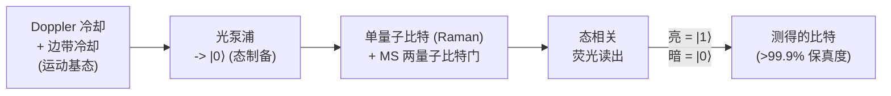

#### 6. 激光冷却与运动基态制备

高保真度的门操作要求共有运动模式接近其量子基态（声子数很少），这通过两个阶段的激光冷却实现：

- **Doppler 冷却：**对强循环跃迁施加红失谐激光，当离子朝向激光运动时会优先散射光子，从而带走动能。Doppler 冷却可达到 **Doppler 极限** k_BT ≈ ℏΓ/2（Γ 为跃迁线宽），对典型的阱而言对应平均声子数 n̄ 约为 ~10 量级——接近但尚未达到基态。
- **分辨边带冷却：**为达到运动基态（n̄ ≪ 1），驱动*红运动边带*（在激发离子的同时移除一个声子的跃迁），反复将离子沿声子阶梯向下泵浦。结合光泵浦进行复位，边带冷却可达到 n̄ < 0.05（基态占据数 > 95%）——这一点至关重要，因为残余运动激发会直接限制两量子比特门的保真度。**运动加热**（来自邻近电极表面起伏的斑块电势的反常加热，在小型表面阱中更严重）会持续地重新激发运动，必须靠冷却和快速门操作来抢先克服；降低加热率是表面阱工程的一个关键目标（文件 23）。

#### 7. 初始化与单量子比特门

- **态初始化**通过**光泵浦**实现：激光驱动离子经历一系列循环，将布居聚集到某一特定的量子比特态上，保真度 **> 99.9%**——是所有模态中最好的初始化之一。
- **单量子比特门**通过**微波**驱动（对超精细量子比特，可用全局微波或由阱电极产生的近场微波）实现；对于单独寻址，则更常用**双光子受激 Raman 跃迁**（两束激光的频率差与量子比特劈裂相匹配，驱动跃迁而不布居中间激发态）。该门是一次 Rabi 旋转（文件 2，第 23 节），其轴和角度由驱动相位和脉冲面积决定。囚禁离子的**单量子比特门保真度通常超过 99.99%**——为所有平台中最佳——这是因为量子比特跃迁隔离良好、相干时间长，且驱动场可被良好控制。在专门的演示中（NIST、Oxford），创纪录的单量子比特保真度已达到 10⁻⁶ 的错误水平。

#### 8. 荧光态读出

读出使用**态相关荧光**：与某一量子比特态（“亮”态）的循环跃迁共振的“探测”激光使离子散射大量光子（呈现为亮），而另一量子比特态（“暗”态）则处于失谐状态，不散射光子。用高数值孔径物镜将散射光子收集到 PMT 或相机上，并计数约 100 μs–1 ms，即可以 **> 99.9% 的保真度**（单次）区分两种状态。读出比超导慢（光子收集统计需要时间），但保真度极高，且天然具有**量子比特分辨**能力（相机可分别对每个离子成像）。读出慢是囚禁离子的特征性权衡之一（慢但出色）。

#### 9. Mølmer–Sørensen 纠缠门

主力两量子比特门是 **Mølmer–Sørensen（MS）门**（Sørensen & Mølmer, 1999）。一束**双色激光场**（两个频率相对于量子比特跃迁对称地失谐 ±δ，靠近红、蓝运动边带）同时驱动两个目标离子。通过对共有运动模式的虚激发与虚退激发，运动介导出有效的**自旋–自旋（XX，Ising 型）相互作用** Ĥ ∝ Ŝ_x⊗Ŝ_x，产生纠缠门 exp(−iθ X⊗X)，当 θ = π/4 时为最大纠缠门（局域等价于 CNOT/CZ）。主要特点：

- 该门只是*虚拟地*利用运动——在门结束时运动态回到其初始值（选择激光失谐和持续时间使相空间轨迹闭合），因此该门在一阶上**对确切的声子数不敏感**，对残余热运动具有鲁棒性。这正是 MS 方案的精妙之处，也是它能容忍不完美的基态冷却的原因。
- 它可以纠缠链中的**任意一对**离子（通过共有模式）——这是全连接的来源。
- **门保真度为所有平台中最高**：最先进的两量子比特 MS 门超过 **99.9%**（最佳演示约 99.9%+；Oxford、NIST、Quantinuum），是纠缠门保真度的黄金标准。
- **门时间**较慢：几十微秒至约 1 ms，由运动频率和激光功率决定——比超导 CZ 门（20–30 ns）慢几个数量级。这种速度/保真度的权衡是该模态的决定性矛盾。

其变体和改进包括幅度/相位调制的 MS 脉冲（同时与多个运动模式解耦，并提高较长链中的鲁棒性），以及使用单独寻址的 Raman 光束实现并行和选择性的门操作。

---

### 第三部分——扩展架构


**QCCD：在专用区域之间穿梭离子，而不是使用一条巨大的链：**

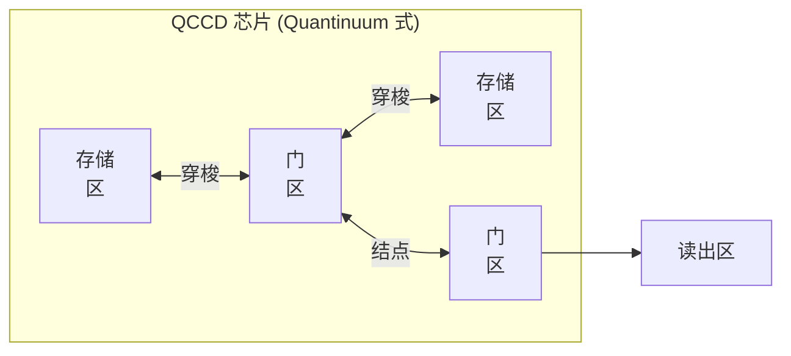

*离子在各区之间被物理输运（并重新冷却），使离子链保持较短，从而保持较高的门保真度——代价是穿梭时间和控制复杂度。*

20–30 个离子的单链上限（第 4 节）意味着，囚禁离子的扩展需要超越单链的架构。有两种互补的方法占据主导。

#### 10. 全连接及其算法价值

在单条链或单个囚禁区内，囚禁离子提供**有效的全连接**：任意两个离子都可以通过共有运动模式直接纠缠，无需 SWAP 网络。相对于超导硬件（文件 3、8），这是一项重大的编译优势：需要长程相互作用的算法（例如含非局域项的量子化学、Shor 算法中的 QFT）在离子阱上编译出的两量子比特门数量远少于最近邻芯片。全连接是 Quantinuum 的囚禁离子系统尽管量子比特数不多、却报告了最高**量子体积**数值（文件 22）的主要原因——决定该指标的是连接性和保真度，而不是数量。

#### 11. QCCD——量子电荷耦合器件

**QCCD 架构**（Kielpinski、Monroe、Wineland，2002）起源于 NIST，通过在多区阱中空间上分离的区域之间**物理穿梭离子**，突破了单链的限制：

- 阱芯片（表面阱，第 3 节）具有不同的**门区**（激光在此纠缠小规模离子组）、**存储/记忆区**（空闲离子停放于此，与门操作隔离）和**装载区**。
- 通过在一系列电极上平滑地改变 DC 电压，离子在各区之间输运（离子“乘坐”一个移动的势阱），而**结点**（T 形或 X 形交叉口）使离子得以被路由和重新排序。
- 通过任一时刻在任一门区仅保留少量离子，QCCD 使局域运动谱保持简单（避免长链的模式拥挤），同时通过穿梭访问任意多的离子——实质上是用时间（穿梭和重新冷却的开销）换取可扩展性。

**Quantinuum 的 H 系列明确采用 QCCD**，使用线性多区阱，并已演示了跨穿梭离子的高保真度操作。QCCD 的代价是输运的**时间开销**（每次移动数微秒）、穿梭后需要**重新冷却**运动（输运会加热离子），以及低加热结点的工程实现。但 QCCD 在大规模下提供了全连接，并具备完整的中途测量和量子比特复用能力，这对纠错是一个强有力的组合（文件 9）。

#### 12. 用于模块化扩展的光子互连

一种互补的、更长程的方法是通过**光子互连**连接*分离的阱模块*（文件 15）：

- 使离子发射一个与其内部态**纠缠**的单光子（光子的偏振/频率与离子的量子比特态相关联）。
- 来自不同模块中两个离子的光子在分束器上发生干涉并被联合测量（**Bell 态测量**）；一次成功的探测会**预告**这两个相距遥远的离子之间的远程纠缠——即**纠缠交换**，而这两个离子从未直接相互作用。
- 这种远程纠缠是**概率性的**（光子收集和探测效率使每次尝试都很可能失败），因此速度较慢，但一旦建立，便可（通过门隐形传态，文件 2 第 21 节）用来在模块之间执行逻辑操作。

这种**基于网络的模块化扩展**（由 Oxford 和 Monroe 的 Duke-Maryland 团队演示）已列入 **Quantinuum、IonQ 和 Universal Quantum** 的路线图，是 DiVincenzo 网络判据（文件 1）在囚禁离子上的实现。选用具有**可见光/电信波段友好**光子波长的离子种类（Ba⁺；IonQ 的钡路线图）可简化基于光纤的互连。通过光子链路实现模块化被普遍视为囚禁离子的终极扩展路径，它将模块内的优势（保真度、全连接）与任意的模块间扩展结合起来。

---

### 第四部分——主要囚禁离子系统

> **验证说明。** 以下规格反映截至 2024 年有记录的发展轨迹；如涉及当前的说法，请重新核实（文件 22）。

#### 13. IonQ（NYSE: IONQ）

- **技术：**¹⁷¹Yb⁺ 超精细量子比特（已宣布转向**钡**，¹³⁷Ba⁺/¹³³Ba⁺，以采用可见光波长的光子学并与光子互连更好地兼容）；单链中采用单独寻址的 Raman 门，并以光子互连的模块化为路线图。
- **系统：**Harmony、Aria、**Forte**，以及 **Tempo/Forte Enterprise** 几代产品。
- **基准：**IonQ 主打**“算法量子比特”（#AQ）**（文件 22）——这是一个基于系统能够运行的最大有用算法电路的指标（与量子体积相关，但围绕应用电路构建）——而不是原始量子比特数，以突出囚禁离子的高保真度与连接性。#AQ 的进展是路线图中的头条指标（文件 19）。
- **商业：**通过 2021 年 SPAC 合并上市；收入来自云访问（AWS Braket、Azure、Google Cloud）、政府/国防合同，以及一种异常激进的收购策略（收购光子网络及相关初创公司），以构建网络/计算产品组合（文件 20）。

#### 14. Quantinuum（Honeywell 控股）

- **技术：**采用 **QCCD** 架构的 ¹³⁷Ba⁺ 超精细量子比特；由 Honeywell Quantum Solutions 与 Cambridge Quantum 合并而成（2021 年）。
- **系统：****H1**（线性 QCCD，约 20 个量子比特）和 **H2**（约 32–56 个量子比特，跑道/椭圆形 QCCD 几何结构，使穿梭更灵活）。
- **领先能力：**业界领先的**两量子比特门保真度（>99.9%）**、所报告的**最高量子体积**（得益于全连接 + 高保真度），以及关键的**中途测量、量子比特复用和实时条件逻辑**——即在电路中途测量部分量子比特、复用它们并根据结果实时分支的能力，这对许多纠错协议至关重要，并已用于 Quantinuum 的逻辑量子比特演示（文件 9）。
- **软件/商业：**从 Cambridge Quantum 继承而来的、规模可观的独立软件/算法业务（**TKET** 编译器，文件 12；量子随机数和网络安全产品），使近期收入多元化而不局限于硬件（文件 20）。

#### 15. 其他囚禁离子参与者

- **Alpine Quantum Technologies（AQT，奥地利）：**Ca⁺ 光学量子比特，模块化机架式（“服务器机架中的离子阱”）系统；从 Innsbruck（Blatt 团队）分拆而来，后者是奠基性的学术中心。
- **Universal Quantum（英国）：**一种独特的方法，使用**微波驱动的门**（全局微波场加磁场梯度，而非激光驱动的门）以降低大规模下的控制复杂度，并结合**模块之间基于结点的离子穿梭**和电场链路互连——押注微波控制和模块化电子学比多激光系统更易于制造。
- **Oxford Ionics（英国）：****电子（集成电路）量子比特控制**，使用片上电极产生的场（“电子量子比特控制”），目标是兼容 CMOS 代工厂制造，并在门操作中无需庞大的激光系统即可实现高保真度。
- **eleQtron（德国）：**基于微波的（MAGIC，磁梯度诱导耦合）门方案，与 Universal Quantum 的微波押注在思路上相近。
- **学术支柱：**NIST（Wineland 获诺贝尔奖的团队，QCCD 的起源）、Innsbruck（Blatt）、Oxford（Lucas/Steane——创纪录的保真度）、Maryland/JQI 和 Duke（Monroe——模块化光子网络）、ETH 等，它们为整个商业格局输送人才和知识产权（文件 20）。

---

### 第五部分——性能特征与权衡

#### 16. 相干时间——该平台的超能力

超精细量子比特的 **T₂ 通常超过 1 秒**，借助动力学解耦和时钟跃迁操作，已演示了**数分钟至 >10 分钟**的相干时间（例如，单离子存储实验达到约 10 分钟，多量子比特寄存器中约 50 s）。这比超导（约 100 μs）**长几个数量级**——这是在隔离良好的原子中使用对磁场不敏感的基态超精细时钟跃迁的直接结果。长相干时间意味着，即使门很慢，*退相干之前可执行的操作数*也十分巨大（DiVincenzo 品质因数 T₂/t_gate，文件 1；文件 2 第 25 节）：当 T₂ ~ 1 s、t_gate ~ 100 μs 时，该比值约为 ~10⁴，尽管门速度慢约 1000 倍，仍与超导相当甚至更高。

#### 17. 门速度的权衡

单量子比特门和两量子比特门耗时**微秒到毫秒**，而超导为纳秒到数百纳秒——这是源于物理的根本性模态权衡（由运动模式介导的门受限于 MHz 量级的阱频率和可用的激光功率，而超导门工作在 GHz 量级）。其后果包括：

- **较低的时钟速度：**离子的电路*吞吐量*（CLOPS 类指标，文件 22）要低得多；运行大量电路重复（如变分算法和采样所需，文件 13）很慢。
- **纠错周期时间：**症状提取周期较慢，从而抬高了实时解码的延迟预算（在某种意义上有益——有更多时间进行解码），但会降低资源估计中的*逻辑时钟速度*（文件 18），这意味着在逻辑量子比特数相同的情况下，容错离子计算机每个逻辑操作运行算法所用的挂钟时间比超导计算机更长。这对大型算法（Shor）的求解时间而言是一个真正的劣势，但可以通过所需物理操作更少（更高的保真度，全连接减少门数量）而部分抵消。

#### 18. 为什么囚禁离子在保真度基准上领先

尽管门较慢，囚禁离子仍保持着**门保真度纪录**（单量子比特 >99.99%，两量子比特 >99.9%）和**最高量子体积**，原因如下：

1. **量子比特全同，无无序，无 TLS：**能级由原子物理而非制造工艺决定——不存在量子比特间的频率离散，也没有材料缺陷损耗。
2. **相干时间长：**相对于秒量级的 T₂，在 μs–ms 的门时间下，退相干对门误差的贡献可忽略不计。
3. **全连接：**没有 SWAP 开销，因此算法电路更短，累积的误差更少（文件 8）。
4. **驱动场控制良好：**限制保真度的误差（激光强度/相位噪声、运动加热、非共振耦合、自发辐射）已被工程化地压低，程度超过了更快模态中的竞争性误差来源。其中每一项都是已知的、可攻克的系统误差（更好的激光器、更低加热的阱、脉冲整形），NIST/Innsbruck/Oxford 数十年的工作已将它们压低到 10⁻³–10⁻⁴ 水平。

诚实的表述（文件 19、22）是：囚禁离子是*质量*上的领先者（保真度、连接性、中途测量），而超导和中性原子是*数量/速度*上的领先者（量子比特数、门速度）。哪个更重要，取决于对给定应用而言瓶颈是单门误差和连接性（利于离子），还是原始规模和吞吐量（利于其他模态）——这是贯穿整个知识库的一个反复出现的战略主题。

---

### 第六部分——综合与交叉引用

囚禁离子占据了模态权衡空间（文件 7 的表）中**高保真度、高连接性、慢速、室温装置**的一角：所有平台中最好的门保真度（单量子比特 >99.99%，两量子比特 >99.9%）和最长的相干时间（T₂ 为秒到分钟量级）、原生的全连接，以及完整的中途测量/量子比特复用——但门较慢（μs–ms），且存在单链扩展上限（约 20–30 个离子），需要 QCCD 穿梭或光子互连模块化才能扩展。关键在于，**量子比特本身不需要低温**（离子在室温真空装置中通过激光冷却，尽管一些系统会将阱芯片冷却到约 4–10 K 以减少运动加热并改善真空）——这与超导的稀释制冷机负担形成了显著的架构对比（文件 11），不过取而代之的是同样严峻的挑战：维持**众多精密稳频的激光器**（“激光瓶颈”，文件 11，类似于超导的布线瓶颈）。

决定性的工程战役包括：(1) 通过 QCCD（低加热结点、快速穿梭、重新冷却）和光子互连（更高的光子收集/探测效率以加快远程纠缠）**突破单链扩展**；(2) **激光系统的扩展问题**（众多稳频光束、单独寻址光学系统、用于激光传输的集成光子学——文件 11）；(3) **在规模化时保持创纪录的保真度**（随系统增长出现的运动加热、模式拥挤和门并行性问题）；以及 (4) **利用中途测量和全连接实现高效纠错**（文件 9——Quantinuum 的逻辑量子比特演示正是利用了这些特性）。囚禁离子在该领域的角色，是作为其他模态用以衡量自身的*保真度和连接性基准*，并正因其单个物理量子比特的质量如此之高而成为早期容错的领先候选——每个逻辑量子比特所需的物理量子比特更少、更好（文件 18）。

*交叉引用：量子比特/门的形式体系及 T₂/t_gate 品质因数（文件 2）；超导对比与跨模态表（文件 3、7）；中性原子作为姊妹冷原子平台（文件 5）；受益于全连接的编译（文件 8）；利用中途测量和高保真度的纠错（文件 9）；激光系统与控制瓶颈（文件 11）；离子–光子纠缠与量子网络（文件 15）；采用高保真度、慢速门参数的资源估计（文件 18）；IonQ/Quantinuum 路线图（文件 19）与竞争定位（文件 20）；量子体积、#AQ 与基准测试（文件 22）；表面阱制造与真空系统（文件 23）。*

---

### 第七部分——扩展物理：运动模式、边带谱学与 MS 门的推导

#### 19. 离子链简正模详解

对于质量为 m、电荷为 e 的 N 个离子处于频率为 ω_z 的简谐轴向势中，平衡位置由阱力与相互 Coulomb 排斥的平衡决定，所形成的链*中间更密*（Coulomb 压力最大处）、两端更疏。围绕平衡位置的小振动解耦为 3N 个简正模。轴向模式通过对阱势与 Coulomb 势组合而成的 Hessian 矩阵 A_{ij} 对角化求得；本征值给出模式频率 ω_p，本征向量 b_{p,i} 给出每个离子 i 在模式 p 中的参与度。

- **最低的轴向模式是质心（COM）模**，频率为 ω_z（所有离子一起运动，Coulomb 力为内力而不起作用），参与度均匀，b_{COM,i} = 1/√N。
- 对两个离子而言，**拉伸模**位于 √3 ω_z；更高的模式构成一个谱，对大 N 而言，该谱填满 ω_z 与约 √(something)·ω_z 之间的频带。模式*间距*随 N 增大而缩小——这种谱拥挤限制了对单个模式的高保真度寻址（第 4 节）。

对于门操作，**径向模式**通常比轴向模式更受青睐：径向阱频率更高（门更快），径向模式间距更密，但可以用幅度/相位调制脉冲来寻址；在 QCCD 中，径向模式也较少受轴向输运的加热。使用哪些模式，以及如何与旁观模式解耦，是门设计中的核心决策。

#### 20. 边带谱学与 Lamb–Dicke 区

当波矢为 k 的激光驱动一个离子，其运动的空间展宽由 **Lamb–Dicke 参数** η = k·x_zpf = k√(ℏ/2mω) 表征（光子动量反冲与运动基态展宽之比）时，内部跃迁会出现**运动边带**：除了**载波**（声子数不变的内部跃迁，位于量子比特频率 ω₀）之外，还有**红边带**（内部激发的同时*减少*一个声子，位于 ω₀ − ω_motion）和**蓝边带**（内部激发的同时*增加*一个声子，位于 ω₀ + ω_motion）。在 **Lamb–Dicke 区**（η√(n̄+1) ≪ 1，离子相对于光学波长定位良好）中，边带耦合较弱（∝ η）而干净，从而能够实现：

- **边带冷却**（第 6 节）：驱动*红*边带可移除声子；与光泵浦复位重复进行，可冷却至 n̄ ≪ 1。
- **边带测温：**比较红边带与蓝边带的激发速率可测得 n̄（二者之比给出热占据数），这是评估冷却性能的标准诊断手段。
- **MS 门**（见下文），它*同时*驱动两个边带。

η 通常为 0.05–0.3；保持系统处于 Lamb–Dicke 区正是基态冷却之所以重要的原因（较大的 n̄ 会使 η√(n̄+1) 脱离该区，使控制复杂化）。

#### 21. MS 门的推导

MS 门（第 9 节）值得推导一番，因为这能解释该门广受称道的鲁棒性。施加一个**双色场**，其频率成分为 ω₀ ± (ω_motion − δ)，即相对于所选频率为 ω_motion 的运动模式的红、蓝边带，对称地失谐一个小量 δ。在相互作用绘景和 Lamb–Dicke 区中，两个离子上的哈密顿量（经旋转波近似后）简化为一个**自旋相关力**：


Ĥ_MS ∝ η Ω (Ŝ_x) (â e^{iδt} + ↠e^{−iδt}),

其中 Ŝ_x = σ_x^{(1)} + σ_x^{(2)} 为集体自旋，â、↠为该模式的声子算符。这个力推动两离子系统在**运动相空间中沿闭合回路**运动，其在整个门操作期间累积的面积产生一个以集体自旋态为条件的**几何相位**——从而使自旋纠缠。当 δ·t_gate = 2π（一个完整回路）时回路闭合（运动与自旋解纠缠），而当激光功率设置得当时，所围面积给出的纠缠相位 θ = π/4，对应最大纠缠门。

两个深刻的结论：

1. **对声子数不敏感：**由于几何相位只取决于*所围面积*，而与起始声子数无关，因此该门（在一阶上）不论确切的运动态如何都能工作——可容忍残余的热激发。这就是 MS 门具有鲁棒性并成为标准的原因。
2. **对运动模式频率偏移的一阶不敏感性**可以通过对脉冲进行幅度/相位整形来实现，使相空间回路对*多个*模式同时闭合（多模鲁棒 MS 门）——这在存在许多邻近模式的较长链中至关重要。

残余的门误差来源包括：回路闭合不完美（残余运动纠缠）、非共振载波激发、来自 Raman 中间态的自发辐射（由激光失谐量与功率之间的权衡所设定的基本极限）、激光强度/相位噪声，以及门操作期间的运动加热。其中每一项都是已知的、可攻克的系统误差——这就是离子能够达到 99.9%+ 的原因（第 18 节）。

#### 22. 自发辐射：激光门的基本保真度极限

对于 Raman 驱动的门，激光通过虚激发态耦合；与真实激发态的失谐量 Δ 越大，自发辐射（它是非相干且不可逆的，属于误差）越少，但对于给定的门速度所需的激光功率越大（Rabi 频率 ∝ Ω²/Δ）。这设定了一个**基本权衡**：每个门的自发辐射误差大致按 ∝ Γ/Δ 缩放（在某些区域，在固定门速度下与功率无关），因此要达到极低的误差就需要大失谐和高功率。这是人们追求更高功率、更稳定的激光器和有利的原子能级结构（精细结构劈裂大，如较重的离子）的原因之一，也是**微波驱动的门**（Universal Quantum、eleQtron——使用磁场梯度而非激光）具有吸引力的原因：微波的自发辐射可忽略不计，从而完全绕开了这一极限，代价是门更慢，以及需要工程实现强而可良好控制的场梯度。

---

### 第八部分——激光与控制系统（移交至文件 11）

#### 23. 激光瓶颈

超导量子比特面临**布线**瓶颈（文件 11），而囚禁离子面临类似的**激光**瓶颈。单个囚禁离子量子比特需要*多束*处于特定离子种类波长的稳频激光束：

- **光电离激光**，用于从中性原子源装载离子。
- **Doppler 冷却激光**（强循环跃迁，例如 Yb⁺ 为 369.5 nm，Ba⁺ 为 493 nm）。
- **回泵激光**，用于将冷却/读出过程中泄漏到暗态的布居送回。
- **态制备（光泵浦）激光。**
- **量子比特操控激光**（Raman 光束，或用于光学量子比特的窄线宽激光——例如 Ca⁺ 的 729 nm，要求线宽低于 Hz 量级，并稳频到超稳参考腔）。
- 用于荧光读出的**探测激光**。

每一束都必须稳频（锁定到原子参考或超稳腔）、稳定强度，并以精确的光束指向传输到离子上。**单独寻址**（在不干扰邻近离子的情况下作用于链中的某一个离子）需要紧聚焦、可操纵的光束（基于 AOD/AOM，文件 11），而光学复杂度随离子数增长。以所需稳定度管理数十乃至数百束稳频光束，是核心的扩展挑战，并由此催生了：**可见光波长的离子种类**（Ba⁺，光学器件更简单，光纤兼容性优于紫外）、**集成光子学**（通过制作在阱中的片上波导向离子传输激光，这是 NIST、Sandia 及一些公司的一个主要研究方向——可降低自由空间光学的复杂度），以及**微波控制**（完全取消门操作激光；Universal Quantum、eleQtron、Oxford Ionics）。

#### 24. AOM、AOD 与光束传输

激光的幅度、频率和相位由**声光调制器（AOM）**控制——这类器件使光在声波上衍射，衍射光束的频率和强度由 RF 驱动设定；而用于单独寻址的光束操纵则使用**声光偏转器（AOD）**（与中性原子系统中用于操纵光镊的原理相同，文件 5）。因此，控制系统为每个离子产生驱动 AOM/AOD 的 RF 波形，以实现门脉冲（类似于超导系统中由 AWG 产生微波脉冲，文件 11）。这些 RF 和光路的相位稳定性直接决定门保真度，使光学/RF 工程与超导微波工程同样严苛，只是处于不同的物理领域。

#### 25. 真空与阱芯片低温

离子必须保持在**超高真空（UHV）**中，通常 ≤10⁻¹¹ torr，因为与背景气体分子的碰撞会把离子从阱中弹出或激发其运动（导致退相干和离子丢失）。实现并维持 UHV 需要精心的腔体设计、烘烤和吸气剂泵（文件 23）。许多现代系统会将**阱芯片低温冷却到约 4–10 K**（不是超导量子比特所用的毫开尔文，也不是为了量子比特本身，而是）为了 (a) 低温泵浦使真空达到更低的压强（离子寿命更长，可达数天至数周），以及 (b) 降低**反常运动加热**（它随电极温度和离子–电极距离急剧变化）。因此，尽管囚禁离子常被描述为“室温”的，许多高性能系统仍对阱使用适度的低温——远没有稀释制冷那么苛刻，但也并非完全没有低温基础设施。

---

### 第九部分——QCCD 与模块化扩展详解

#### 26. 穿梭操作及其代价

在 QCCD 系统中（第 11 节），门之外的基本操作包括：

- **线性输运：**通过依次施加 DC 电极电压来平移势阱，使离子（或离子晶体）沿阱轴移动。快速输运（μs 量级）会激发运动；“非绝热”的快速输运加重新冷却，或“绝热”的慢速输运，是在速度与加热之间的权衡。
- **分裂与合并：**通过在两个离子之间升起势垒，将双离子晶体分离为两个单离子（或反过来合并）——这是一项精细的操作（离子会经过轴向频率接近零的区域，此时它们被弱约束，很容易被加热）。
- **结点输运：**让离子通过 T/X 形结点以重新排序——这对全连接操作在几何上是必需的，但也是加热最高、要求最苛刻的输运操作。
- **交换/重排：**对离子进行物理重新排序，使任意离子对能够聚到一起进行门操作。

每次穿梭操作都会增加**时间**（每次 μs，在整个电路中累积）和**运动加热**（需要重新冷却，通常借助共囚禁的*不同*种类的“**冷却剂**”离子——即**协同冷却**——使量子比特离子的内部态不受扰动，而冷却剂离子被激光冷却并拖低共有运动）。使用混合种类晶体的协同冷却（例如量子比特 Ba⁺ + 冷却剂 Yb⁺，或不同同位素的量子比特/冷却剂）是 QCCD 的标准技术，它增加了离子种类/激光的复杂度，但能在不破坏量子比特相干性的情况下实现中途再冷却。

#### 27. 中途测量与量子比特复用

QCCD/囚禁离子的一项突出能力（Quantinuum，第 14 节）是**中途测量**：将选定的离子穿梭到单独的探测区，通过荧光对其进行测量，而探测光*不会*扰动其他（远处的）量子比特，然后**复用**这些离子（重新初始化并继续）。这实现了：

- **实时条件逻辑：**根据测量结果使电路分支（对许多协议至关重要）。
- **量子比特复用：**测量并复位可释放量子比特供后续使用，对于具有测量并复用结构的电路，实际上增加了可用量子比特数。
- **纠错：**利用中途测量和前馈修正进行重复的症状提取——这正是 QEC 所需的原语（文件 9）。Quantinuum 的逻辑量子比特演示（实时纠错、逻辑纠缠门，以及在其囚禁离子平台上演示“低于阈值”式行为）依赖于这一能力。

测量在空间上的分离（在专用区域中进行）使囚禁离子的中途测量非常干净——探测光子根本不会到达计算用的离子——相对于所有量子比特位于同一区域的模态，这是一项结构性优势。

#### 28. 光子网络的定量分析

通过光子互连实现的远程纠缠（第 12 节）以概率 p_success ≈ η_collection² · η_detection² · (Bell 测量效率) 成功，其中每个离子–光子的收集效率 η_collection 可能约为 1–10%（受收集光学器件的立体角和发射光子的跃迁的分支比限制）。由于每次尝试的 p_success 很小，且尝试速率受光子产生周期限制，**远程纠缠产生速率**目前较为有限（演示中为 Hz 到 kHz）——远慢于模块内的门操作。提高该速率（通过腔增强以借助 Purcell 增强提高 η_collection、更好的探测器、更快的周期）是使模块化囚禁离子计算机走向实用的关键，也是 IonQ、Quantinuum 以及学术界（Oxford、Maryland）网络工作的重点（文件 15）。其回报是在保持模块内完整保真度的同时实现无限的模块化扩展——被普遍视为囚禁离子的终局。

---

### 第十部分——历史脉络、重要成果与基准

#### 29. 历史时间线

- **1953–1989（Paul、Dehmelt）：**Wolfgang Paul 发明了 RF 阱（1989 年诺贝尔奖，与 Dehmelt 因离子囚禁共同获得）；单离子囚禁与光谱学奠定了该平台。
- **1995（Cirac–Zoller）：**首个明确的囚禁离子量子计算机方案（以 COM 模为总线的 Cirac–Zoller 门），开启了该领域的实验计划。
- **1995（NIST，Wineland）：**在单个离子的自旋与运动上首次演示两量子比特（Cirac–Zoller 型）门原语。
- **1999（Sørensen–Mølmer）：**MS 门方案，对热运动具有鲁棒性——后来成为标准的方案。
- **2002（Kielpinski–Monroe–Wineland）：**QCCD 架构方案。
- **2003–2005（Innsbruck、NIST）：**首次实现囚禁离子的确定性纠缠、隐形传态和小型算法；Innsbruck 演示了多离子纠缠和 Deutsch–Jozsa 算法。
- **2012（Wineland 获诺贝尔奖）**以表彰离子阱量子控制（与 Haroche 共同获奖）。
- **2016（Oxford，Lucas/Ballance）：**两量子比特 MS 门保真度 99.9%，单量子比特保真度 99.9999%——创纪录的演示确立了囚禁离子作为保真度领先者的地位。
- **2017–2021：**商业系统出现——IonQ（2015 年成立，2021 年上市）、Honeywell Quantum（2020 年首套系统）→ Quantinuum（2021 年）。
- **2020 年代：**Quantinuum 创下量子体积纪录（超过 2²⁰ 及更高），演示了实时纠错和逻辑量子比特；IonQ 推进 #AQ 以及钡/网络路线图；模块化光子互连演示趋于成熟。

#### 30. 重要成果与引用

- **纪录保真度：**Ballance et al.（Oxford），“High-fidelity quantum logic gates using trapped-ion hyperfine qubits,” PRL 117, 060504 (2016)，arXiv:1512.04600——两量子比特 99.9%。Gaebler et al.（NIST）同时报告了相当的保真度。单量子比特保真度 1 − 10⁻⁶（Harty et al.，Oxford，2014）。
- **量子体积进展：**Quantinuum 报告了稳步提升的量子体积（例如在 H 系列上 QV = 2¹⁹、2²⁰ 及更高）——为所有平台中最高的 QV，由全连接和 >99.9% 的门所驱动（文件 22）。
- **逻辑量子比特/纠错：**Quantinuum 在 H 系列上演示了实时量子纠错、重复症状提取和逻辑量子比特操作（2021–2024 年的多篇论文），并（与合作者一道）纠缠**逻辑**量子比特，演示了利用中途测量的容错原语。Quantinuum/Microsoft 报告了使用 H2 处理器演示多个低逻辑错误率的逻辑量子比特（2024 年），被表述为迈向“可靠”逻辑操作的一步。
- **模块化网络：**Monroe/Maryland 和 Oxford 团队演示了离子–光子纠缠以及分离阱模块之间的远程纠缠；“模块化通用可扩展离子阱量子计算机”（MUSIQC）的概念与演示支撑着商业网络路线图。

#### 31. 囚禁离子领先的基准

- **量子体积（文件 22）：**报告的最高值，因为 QV 综合奖励连接性 × 保真度 × 数量，而离子在连接性和保真度上都达到最大。
- **算法量子比特（#AQ，IonQ）：**强调有用电路能力的指标；是 IonQ 偏好的头条指标（文件 22）。
- **镜像基准测试/应用基准测试：**由于没有 SWAP 开销，离子在结构化电路基准测试中表现强劲。
- **离子落后之处：****CLOPS/吞吐量**（门慢 → 电路执行速率低）和**原始量子比特数**（中性原子和超导的物理量子比特多得多）。诚实的记分卡是：离子在单操作质量和连接性上领先，在速度和规模上落后——这正是分析者必须针对每个应用权衡的取舍（文件 17、22）。

---

### 第十一部分——算例与误差预算

#### 32. 99.9% MS 门的误差预算算例

分解一个保真度 99.9%（误差 10⁻³）的两量子比特 MS 门，以展示误差预算的去向：

- **自发辐射（Raman 门）：**基本下限（第 22 节），∝ Γ/Δ；在典型失谐下贡献几个 ×10⁻⁴——通常是激光驱动门的主要基本极限，这促使人们采用微波门和更大的失谐。
- **门操作期间的运动加热：**对于持续时间为 t_gate、加热率为 ṅ（声子/s）的门，加热导致的误差 ≈ η²·ṅ·t_gate；当 ṅ ~ 10–100 声子/s（低温表面阱）且 t_gate ~ 100 μs 时，约为 ~10⁻⁴–10⁻³——这是低温阱冷却（更低的 ṅ）和更快的门有所帮助的一个主要原因。
- **运动模式频率漂移/回路闭合不完美：**若 δ·t_gate ≠ 2π 则会残留自旋–运动纠缠；通过脉冲整形缓解；约 ~10⁻⁴。
- **激光强度/相位噪声：**驱动幅度/相位的涨落；采用稳频激光时约 ~10⁻⁴。
- **非共振载波激发与旁观模式耦合：**在较长的链中尤其明显；通过多音脉冲整形缓解。

与超导的对比富有启发性（文件 3，第 33 节）：对离子而言，*退相干可以忽略*（T₂ ≫ t_gate），误差预算由*控制和运动*误差主导——与超导的侧重点相反，后者的退相干是主要项。这就是两种模态的改进策略不同的原因：离子着力于激光、阱（加热）和脉冲整形；超导着力于相干性（材料）和串扰。

#### 33. 算例：T₂/t_gate 操作预算

取超精细 T₂ ≈ 1 s（保守估计；演示可达数分钟）和 t_2q ≈ 100 μs，退相干之前受相干性限制的两量子比特操作数约为 T₂/t_2q ≈ 10⁴——与超导（T₂ ≈ 100 μs，t_2q ≈ 30 ns → 约 3×10³）相当。因此，尽管门慢了约 3000 倍，离子由于其相干时间长约 10⁴ 倍，实现了*相近或更大*的每相干时间操作预算。这在数量上证实了文件 1/文件 2 的论点：决定可实现电路复杂度的是 DiVincenzo 品质因数 T₂/t_gate——而不是原始的门速度或原始的相干时间——并且两种领先的模态是从相反的方向达到这一点的。

#### 34. 算例：SWAP 开销优势

考虑编译一个电路，其中包含一个作用于在连接图上相距 5 跳的逻辑量子比特之间的两量子比特门。在最近邻的超导芯片上，路由需要约 4 个 SWAP 门（每个 = 3 个 CNOT）= 约 12 个额外的两量子比特门，每个约 99.5%，贡献约 6% 的额外误差并显著增加深度。在具有全连接的囚禁离子链上，该门被**直接**施加——零路由开销。对于富含长程门的算法（Shor 中的 QFT、全连接化学拟设），这种连接性优势可使两量子比特门总数成倍减少，即使在挂钟时间上不占优，也能在*总误差*上部分补偿离子较慢的单门速度。这就是离子量子体积高的具体机制，也是连接性是一等的架构属性而非脚注的原因（文件 8、22）。

---


### 第十二部分——实践者常见问题与术语表

#### 35. 常见问题

**问：囚禁离子需要稀释制冷机吗？**答：不需要。量子比特是室温 UHV 中被激光冷却的原子。许多高性能系统会将*阱芯片*冷却到约 4–10 K（以获得更好的真空和更低的运动加热），这远没有超导所需的约 10 mK 稀释制冷那么苛刻。这是一项真正的架构优势，其代价是激光系统的复杂度。

**问：为什么离子门这么慢？**答：因为它们由 MHz 阱频率下的运动模式介导，并受限于可用激光功率与自发辐射约束之间的权衡；门的持续时间必须足够长，才能让运动相空间回路闭合（第 21 节）。微波梯度门和更高的阱频率可以在一定程度上加快门速度，但达不到超导的纳秒量级——这是一项根本性的模态权衡。

**问：离子如何获得全连接？**答：在一条链内，所有离子共享集体运动模式，因此任意一对离子都可以通过这些模式纠缠而无需路由。跨模块时，光子互连（概率性远程纠缠）以速度为代价扩展了连接性（第 28 节）。

**问：扩展路径是什么？**答：中等规模靠 QCCD 穿梭（在一块芯片内，已由 Quantinuum 商业化演示），任意规模靠光子互连（模块/芯片之间）（IonQ、Quantinuum、Universal Quantum 的路线图）。两者都保持了模块内的保真度，这是该平台的关键资产。

**问：为什么离子尽管量子比特数少，仍可能赢得通向有用容错的竞赛？**答：因为它们单个物理量子比特的质量（保真度、相干性）极高，每个逻辑量子比特需要*更少、更好*的物理量子比特；其全连接适合 qLDPC 和灵活的码（文件 9）；且其成熟的中途测量使实时纠错成为可能。这里的赌注是：对于早期容错，质量和连接性胜过原始数量（文件 9、18、19）。

**问：囚禁离子路线图的最大风险是什么？**答：激光/控制系统的扩展，以及光子互连速率。如果远程纠缠速率无法提高到足够程度，模块化离子计算机仍会很慢；如果每个离子的光学复杂度无法被驯服（集成光子学、微波门），大型单体系统将变得难以驾驭。这些是超导布线/低温之墙的对应物（文件 11）。

#### 36. 术语表

- **Paul 阱：**利用 RF 场产生约束性赝势的阱（符合 Earnshaw 定理）。
- **微运动：**由 RF 驱动的快速运动；过量微运动（偏离 RF 零点）会降低门保真度，必须予以补偿。
- **久期频率：**离子振荡所处的缓慢简谐阱频率（0.1–10 MHz）。
- **简正/运动模式：**离子链的集体振动模式；门操作的量子总线；随 N 增大在频谱上趋于拥挤。
- **Lamb–Dicke 参数（η）：**光子动量反冲与运动基态尺寸之比；决定边带耦合强度。
- **边带冷却：**驱动红运动边带以达到运动基态（n̄ ≪ 1）。
- **超精细量子比特与光学量子比特：**基态超精细能级（GHz 劈裂，微波/Raman，相干时间极长）与基态 + 亚稳光学态（光学劈裂，由窄线宽激光驱动）。
- **Mølmer–Sørensen（MS）门：**通过运动相空间中的几何相位实现的双色激光纠缠门；对声子数鲁棒；保真度 >99.9%。
- **QCCD：**量子电荷耦合器件；通过离子穿梭实现扩展的多区阱。
- **协同冷却：**通过共囚禁的不同种类冷却剂离子对量子比特离子重新冷却（保持量子比特相干性）。
- **中途测量：**在单独区域中测量（并复用）选定离子而不扰动其余离子——对实时纠错至关重要。
- **光子互连：**离子–光子纠缠 + Bell 测量，用于模块之间的概率性远程纠缠。
- **关键数字：**单量子比特保真度 >99.99%；两量子比特（MS）保真度 >99.9%；T₂ 为秒到分钟；门时间 μs–ms；读出在约 100 μs–1 ms 内 >99.9%；全连接；阱芯片室温或约 4–10 K；UHV ≤10⁻¹¹ torr。

#### 37. 总结

囚禁离子将文件 2 中抽象的量子比特实现为：保持在 Paul 阱中的全同、受激光控制的原子离子的内部态，并通过共有运动模式实现纠缠。其由原子物理所定义的全同性带来了该领域最好的保真度和最长的相干时间；MS 门几何相位的鲁棒性与离子链的全连接带来了最高的量子体积和最干净的中途测量；而 QCCD 穿梭加光子互连提供了扩展路径。其代价是门慢（μs–ms）、单链扩展上限，以及激光/控制系统的复杂度——这是超导布线瓶颈在光学上的对应物。重点系统——IonQ（Yb⁺→Ba⁺、#AQ、网络）和 Quantinuum（Ba⁺ QCCD、创纪录的 QV、中途测量、逻辑量子比特）——使囚禁离子成为该领域的*质量与连接性*基准，并通过更少、更好的物理量子比特成为早期容错的领先候选。读者应将这一模态权衡空间（快速但有噪声的超导、对比缓慢但精确的离子，以及中性原子和光子的替代方案）带入文件 5（中性原子，共享大量物理和光学的姊妹冷原子平台）以及文件 7 的跨模态综合比较表。

*交叉引用：形式体系、旋转坐标系与 T₂/t_gate 品质因数（文件 2）；超导对比与跨模态表（文件 3、7）；中性原子（文件 5）；全连接带来的编译优势（文件 8）；带中途测量的纠错（文件 9）；激光系统与控制瓶颈（文件 11）；离子–光子网络（文件 15）；资源估计（文件 18）；IonQ/Quantinuum 路线图（文件 19）；竞争定位（文件 20）；量子体积与 #AQ 基准测试（文件 22）；表面阱制造与 UHV（文件 23）。*

---

### 第十三部分——深入探讨：模拟量子模拟、集成光子学、双种类与定量扩展

#### 38. 囚禁离子模拟量子模拟

除了门模型（数字）计算之外，囚禁离子还是**模拟量子模拟**的首选平台——直接设计一个多体哈密顿量并观察其动力学，而不是将其分解为门。通过用自旋相关力对离子链进行全局照射（物理与 MS 门相同，但连续且全局地施加），可以实现有效的**长程 Ising 和 XY 自旋模型**：

Ĥ_sim = Σ_{i<j} J_{ij} σ_x^{(i)} σ_x^{(j)} + B Σ_i σ_z^{(i)},

其中自旋–自旋耦合 J_{ij} ∝ 1/|i−j|^α 具有*可调的幂律范围*（α 介于 0 和 3 之间，由激光相对于运动模式的失谐设定）。这种可调程的连接性——在最近邻的固态系统中不可能实现——使囚禁离子（Monroe/Maryland、Innsbruck 等）成为研究量子磁性、动力学相变、多体局域化、扰乱/非时序关联函数，以及对 50+ 个离子的格点模型进行量子模拟的领先平台。量子模拟是科学上最可信的近期应用之一（文件 13、17），而囚禁离子干净、长程可调的哈密顿量使其在此格外有价值，与中性原子模拟器（文件 5）和超导数字模拟互为补充。在门模型容错走向成熟的同时，公司（IonQ、Quantinuum）和学术团队提供模拟/数字–模拟模拟作为近期用例。

#### 39. 用于离子阱的集成光子学

激光瓶颈（第 23 节）正通过**把光学器件集成到阱芯片本身**来攻克。与其从真空腔外部传输许多对准离子的自由空间激光束（脆弱、复杂、难以扩展），研究人员（NIST、Sandia、MIT Lincoln Laboratory、ETH 及一些公司）将**片上光波导和光栅耦合器**制作到表面阱中，把激光从光纤输入直接引向每个离子。演示已展示了冷却、态制备乃至门操作光束的集成传输，并实现了到多个区域的片上路由。其前景与超导的低温 CMOS 相同（文件 11）：以集成的、可制造的控制系统取代脆弱的、不可扩展的外部控制系统。挑战包括紫外/可见光波长下的波导损耗、光功率承载能力、杂散光散射（会导致退相干和读出误差），以及为快速控制而集成调制器。集成光子学被普遍认为是将囚禁离子扩展到每芯片数十个量子比特以上的必要条件，这方面的进展是 IonQ、Quantinuum、Oxford Ionics 乃至整个领域路线图的关键依赖项（文件 11、19、23）。

#### 40. 双种类架构详解

许多先进的囚禁离子系统是**双种类**的：两种不同的离子种类（或同位素）共同囚禁，各自扮演不同的角色：

- **量子比特离子**存储并处理量子信息（例如 Quantinuum 中的 ¹³⁷Ba⁺）。
- 不同种类的**冷却剂离子**（例如不同的同位素或元素）被连续或间歇地激光冷却，以协同地重新冷却共有运动，而其冷却光**不会**扰动量子比特离子（冷却激光仅与冷却剂种类共振）。这使得穿梭之后的**中途再冷却**（第 26 节）成为可能——对 QCCD 至关重要——而不破坏量子比特相干性。

双种类还实现了**中途测量隔离**（测量一种离子，而另一种离子的量子比特不受探测光影响），并用于某些光子网络方案（一种离子经优化用作网络的光子发射体，另一种用于存储/处理）。其代价是增加的激光和控制复杂度（两整套冷却/控制激光），以及混合种类晶体的工程实现（质量失配会影响运动模式结构和门设计）。双种类操作是能力最强的囚禁离子系统的标志，也是基于 QCCD 的扩展的关键使能因素。

#### 41. 定量扩展分析

为使扩展讨论更具体，考虑两条扩展路径的资源含义：

**QCCD 扩展。**QCCD 处理器的有效时钟速度不仅由门时间决定，而是由门时间**加上穿梭和再冷却开销**决定。若每个远距离离子之间的逻辑两量子比特操作需要，比如说，两次输运操作（每次约 10 μs）、一次分裂/合并（约 50 μs）、再冷却（约 100 μs）以及门（约 100 μs），则*有效*两量子比特操作时间约为 250+ μs——比裸门更慢。这种“穿梭税”是大规模下获得全连接的代价，降低它（更快、更低加热的输运；跨区域的并行操作）是 QCCD 的核心工程目标。其好处是：任意连接性和完整的中途测量，且没有 SWAP 网络造成的深度膨胀。

**光子互连扩展。**模块化机器的模块间操作速率由远程纠缠产生速率决定（第 28 节）。以目前约 ~100 Hz–10 kHz 的成功远程纠缠演示速率计，模块间的逻辑操作远慢于模块内的门。通过腔增强收集（Purcell 因子使 η_collection 提高到数十个百分点）、更好的探测器和更快的尝试周期来提升该速率，是模块化囚禁离子计算机成败的关键工程。其好处是：无限的模块化扩展，且保持完整的模块内保真度。

**对容错的含义（文件 18）：**囚禁离子的高物理保真度意味着*每个逻辑量子比特所需的物理量子比特更少*（在离子的错误率下，一个逻辑量子比特可能只需数百个而非约 1000 个物理量子比特），而全连接/灵活的连接性适合低开销的码（qLDPC，文件 9）。但缓慢的有效时钟（门 + 穿梭/网络开销）意味着*每个逻辑操作需要更多挂钟时间*。因此，在逻辑量子比特数相同的情况下，容错离子计算机很可能比超导计算机*更小*（物理量子比特更少）但*更慢*（运行时间更长）——资源估计（文件 18）明确揭示了这一权衡，它对*受量子比特数限制*的应用有利于离子，对*受时间限制*的应用有利于超导。

#### 42. 跨模态定位（文件 7 表格预览）

| 属性 | 囚禁离子 | 超导（文件 3） |
|---|---|---|
| 单量子比特门保真度（最佳） | >99.99% | >99.9% |
| 两量子比特门保真度（最佳） | >99.9% | 99.5–99.9% |
| 相干时间 T₂ | 秒–分钟 | ~50–300 μs |
| 门时间 | μs–ms | ns–数百 ns |
| 连接性 | 全连接（模块内） | 固定最近邻（度 ≤4） |
| 量子比特数（每模块） | 数十 | 数百–1000+ |
| 工作温度（量子比特） | 室温（芯片 ~4–10 K） | ~10 mK |
| 中途测量 | 成熟（商用） | 已演示 |
| 主要扩展瓶颈 | 激光、穿梭、网络速率 | 布线、低温、连接性 |
| 主要误差来源 | 自发辐射、运动加热、激光噪声 | TLS 损耗、泄漏、串扰、退相干 |
| 制造杠杆 | 原子级（无制造差异）；阱芯片为光刻 | 完全光刻（半导体工艺设备） |
| 主要参与者 | IonQ、Quantinuum、AQT、Oxford Ionics、Universal Quantum | IBM、Google、Rigetti、IQM |

这一定位——离子为质量/连接性的领先者，超导为速度/规模的领先者——是文件 7 完整的七模态比较，以及文件 18–20 的资源与竞争分析所围绕的战略轴线。

#### 43. 与原子钟和传感的联系（文件 16 预览）

囚禁离子量子计算与**囚禁离子光学原子钟**共享整个技术基础——离子囚禁、激光冷却、窄跃迁光谱学、态相关荧光读出——后者是迄今制造的最精确的仪器之一（分数频率不确定度低于 10⁻¹⁸；文件 16）。相同的 ⁴⁰Ca⁺、⁸⁸Sr⁺、¹⁷¹Yb⁺（以及使用共囚禁逻辑离子的 Al⁺ 量子逻辑钟）物理是两者的共同基础。这一共同谱系意味着囚禁离子的*传感/计量*已经商业成熟并产生收入（文件 16、文件 24），提供了一个有用的校准：囚禁离子量子计算所依赖的*控制*技术已在计量领域得到验证并投入部署；剩下的是将其*扩展*，从少数几个钟离子扩展到计算所需的多量子比特、联网的处理器。这比整个技术栈仍处于研究级别的模态是一个更有利的起点。

---

### 第十四部分——总结性评估

囚禁离子是人类所建造的**质量最高**的量子比特：天然全同，相干时间为秒到分钟，通过几何相位 MS 门以 >99.9% 的保真度纠缠，在模块内全连接，并配备成熟的中途测量和量子比特复用。该领域的保真度、量子体积以及（与中性原子和超导一道）纠错里程碑都是在这一平台上确立的，其技术基础也因囚禁离子计量学的成熟而部分降低了风险（文件 16）。它们的缺陷同样明显：门慢（μs–ms）、单链扩展天花板（约 20–30 个离子），需要 QCCD 穿梭或光子互连的模块化，以及激光/控制系统的复杂度——这是超导布线瓶颈在光学上的对应物。

知识库反复回到的战略问题（文件 18–20）是：*质量和连接性*（离子）与*速度和规模*（超导、中性原子）哪一个是通向有用容错的更快路线。诚实的回答是，这取决于应用的瓶颈——受量子比特数限制的问题有利于离子“量子比特少而好”的经济性，受时间限制的问题有利于更快的模态——而且这些模态并不互斥：混合与模块化架构（文件 25）可能将囚禁离子的“高保真度逻辑量子比特工厂”与其他模态的批量处理相结合，而光子互连（文件 15）可能将它们连接起来。目前，囚禁离子仍然是所有其他模态衡量自身保真度和连接性的基准，并通过更少、更好、连接灵活的物理量子比特，成为首批真正有用的容错量子计算的领先竞争者。

读者接下来应转向文件 5（中性原子），这是共享囚禁离子大量激光冷却与光学控制物理、但在连接机制（Rydberg 阻塞与可重构阵列）和原始规模（1000+ 原子）上显著不同的姊妹冷原子平台，然后阅读文件 7 的综合比较，再转而探讨这些硬件属性如何影响纠错（文件 9）、资源估计（文件 18）以及竞争格局（文件 19–20）。

---

### 第十五部分——原子能级结构、读出物理与退相干机制详解

#### 44. 使量子比特得以工作的能级结构

要控制一个离子，必须了解其具体的能级结构；所用的类碱金属离子（Yb⁺、Ba⁺、Ca⁺、Sr⁺——都只有一个价电子，类氢）共有的大致轮廓如下：

- **基态 S₁/₂ 态**（量子比特的下能级；对超精细量子比特而言，分裂为超精细子能级）。
- 通过“冷却/探测”跃迁到达的**强 P₁/₂、P₃/₂ 激发态多重态**（用于 Doppler 冷却和荧光读出）；这些 P 态衰变很快（寿命为 ns 量级，线宽较宽，Γ ~ 2π×20 MHz），提供冷却和亮态探测所需的大量光子散射。
- **亚稳 D₃/₂、D₅/₂ 态**（长寿命，约为秒量级），它们 (a) 是*光学*量子比特的上能级，(b) 是读出用的“暗”囤积态，但同时也 (c) 是冷却过程中的泄漏去处，需要**回泵激光**来清除。

具体到 ¹⁷¹Yb⁺：量子比特为 S₁/₂ 的 F=0 与 F=1 超精细能级（劈裂 12.6 GHz）；冷却/探测使用 369.5 nm 的 S₁/₂–P₁/₂ 跃迁；935 nm 和 760 nm 的回泵激光清除 D₃/₂ 和长寿命的 F₇/₂ 态。需要紫外（369.5 nm）是一个缺点（紫外光学器件损耗大，且紫外光会损伤光学器件并引起充电），这是 IonQ 的钡路线图（可见光 493 nm 冷却）具有吸引力的原因之一。对于 ¹³⁷Ba⁺：493 nm 冷却，650 nm 回泵——全部为可见光，对光纤和集成光子学友好。对于 ⁴⁰Ca⁺：397 nm 冷却，729 nm 四极跃迁作为光学量子比特，854/866 nm 回泵。这些细节决定了激光系统的复杂度和成本（第 23 节），是选择离子种类时的一个实际因素。

#### 45. Cirac–Zoller 与 Mølmer–Sørensen

第一个囚禁离子门方案，即 **Cirac–Zoller（CZ-ion）门**（1995），将量子比特的状态映射到 COM 运动模式，执行条件操作，再映射回来——要求运动从基态（n̄=0）开始，并依次寻址各个单独的边带。它可行，但**对确切的声子数敏感**（需要完美的基态冷却），并对窄边带上的单个离子寻址敏感。**MS 门**（第 21 节）取代了它，因为其几何相位机制*对声子数不敏感*（可容忍热运动），并且可以全局驱动——更加鲁棒、更实用。几乎所有现代高保真度门都是 MS 型的（或与之密切相关的光频移/几何相位门）。理解 MS 为何获胜——对不完美冷却之后总会残留的运动具有鲁棒性——清晰地说明了决定哪种方案能存活到商业应用的是门方案的*鲁棒性*，而不仅仅是理想情形下的保真度，这一教训与超导中可调耦合器的趋同相呼应（文件 3）。

#### 46. 读出物理：亮/暗区分与误差

荧光读出（第 8 节）区分“亮”态（在探测激光下散射许多光子）与“暗”态（不散射）。探测激光驱动从亮量子比特态出发的近循环跃迁；在探测窗口（约 100 μs–1 ms）内，亮离子发生散射，光子计数器记录到约 20–50 个光子（受收集立体角约 1–10% 和探测器效率限制），而暗离子的计数接近于零（背景）。对光子计数设一个简单的阈值即可区分两种状态。**读出误差**来自：

- 探测*期间*亮态与暗态之间的**非共振泵浦**（探测激光偶尔会将亮离子泵浦为暗，或反之），这设定了一个基本的保真度极限，可通过更快的探测或隔离更好的态来改善。
- **光子计数统计**（亮与暗计数分布的 Poisson 重叠），通过收集更多光子来改善（更好的光学器件、更长的探测——以速度为代价）。
- 相邻离子荧光之间的**串扰**（通过基于相机的空间分辨探测来改善）。

囚禁离子读出可达到 **>99.9% 的单次保真度**，在所有平台中名列前茅，因为亮/暗对比极大且各态隔离良好；代价是探测时间慢（光子统计），这是该平台的特征性缓慢之一。

#### 47. 离子特有的退相干机制

尽管离子的相干性非同寻常，但并非无限；其机制（及缓解方法）如下：

- **磁场噪声：**对磁场敏感的跃迁而言，这是主要的退相位来源。通过使用**时钟跃迁**（一阶对磁场不敏感的超精细跃迁，见于 Yb⁺ F=0↔F=1 m=0 以及 ⁴³Ca⁺/¹³⁷Ba⁺）、磁屏蔽和动力学解耦来缓解。时钟跃迁操作正是超精细 T₂ 能达到秒到分钟的原因。
- **激光相位/频率噪声：**对光学量子比特和 Raman 门而言，激光线宽直接使量子比特退相位；通过将激光稳频到超稳参考腔来缓解（光学量子比特需亚 Hz 线宽）——这是一项重大的工程负担。
- **运动加热（反常加热）：**电极表面起伏的斑块电势加热运动，使门劣化；随离子–电极距离变小而急剧增强（表面阱更严重），并随电极温度升高而增强（通过低温阱冷却，第 25 节，以及表面处理，文件 23 来缓解）。
- **自发辐射：**激光驱动门的基本下限（第 22 节）。
- **与背景气体的碰撞：**导致离子丢失和运动激发；通过 UHV 和低温泵浦缓解（第 25 节）。
- **非共振光频移以及与旁观模式/离子的耦合：**通过脉冲整形和细致的失谐选择来控制。

与超导的对比（文件 3）很有启发性：离子受限于*控制与环境*因素（激光、场、表面、真空），而非*材料*缺陷（TLS），并且其*本征*相干性如此之长，以至于退相干很少成为门保真度的瓶颈——与超导相反，后者的本征材料损耗占主导。

#### 48. 离子硬件上的算法与演示

囚禁离子已运行了异常广泛的一系列算法演示，这得益于全连接和高保真度：

- **小规模 Shor 算法**和量子 Fourier 变换（分解 15、21）。
- 用于小分子（H₂、LiH、H₂O）的**量子化学 VQE**，采用硬件高效拟设和 UCC 拟设（文件 13）。
- 用于 MaxCut 和优化基准测试的 **QAOA**（文件 13/17）。
- 自旋模型、格点规范理论（Innsbruck 演示了一次格点规范理论模拟）以及动力学相变（Maryland）的**量子模拟**，规模达 50+ 个离子。
- **纠错原语：**重复症状提取、逻辑量子比特编码（Steane 码、表面码和色码），以及实时修正（Quantinuum）——利用中途测量（文件 9）。
- **量子体积和随机基准测试纪录**（Quantinuum）以及 **#AQ** 应用基准测试（IonQ）。

这些演示的广度和质量——尤其是纠错和高保真度算法的成果——支撑了囚禁离子作为早期有用量子计算的领先候选者的主张，即使其原始量子比特数落后于中性原子和超导（文件 17、19）。

#### 49. “更少、更好”量子比特的经济学

一个值得明确指出的战略要点（在文件 18 中有定量展开）：由于纠错的物理–逻辑开销随*物理*错误率急剧缩放，物理错误率低 10 倍的模态，每个逻辑量子比特所需的物理量子比特数会大幅减少。在表面码层面，将物理错误率（相对于阈值）减半，可以显著降低所需的码距，从而降低物理量子比特开销。囚禁离子 >99.9% 的两量子比特保真度——已达到或超过超导正在努力追赶的水平——意味着一个囚禁离子逻辑量子比特可能只需*数百个*而非约 1000 个物理量子比特，并且其全连接开启了最近邻超导硬件无法原生支持的低开销 qLDPC 码（文件 9）。这种“更少、更好、连接灵活”的经济学是以下论点的定量核心：囚禁离子可能用远少于头条的百万量子比特超导估计的物理量子比特总数就达到有用的容错——这是文件 18–19 中资源估计与路线图可信度分析的关键考量。

这些更深入的内容——能级结构、门方案的历史、读出与退相干的细节、算法的实绩，以及“更少更好量子比特”的经济学——完善了囚禁离子作为该领域质量与连接性领先者的技术画像，并使读者能够以文件 3 中为超导所倡导的同样严谨的分解方法来评估囚禁离子的各种说法。

---

### 第十六部分——门物理比较、微波门与前沿问题

#### 50. 为什么微波梯度门是一个严肃的替代方案

Raman 门的自发辐射下限和激光复杂度（第 22–23 节）催生了由**微波**加**静态或振荡磁场梯度**驱动的**无激光纠缠门**。梯度使量子比特跃迁频率依赖于位置，从而使微波场将内部（自旋）态与运动耦合——复现 MS 门所需的自旋–运动耦合，但使用的是微波（*自发辐射可忽略不计*）而不是激光。其变体包括 **MAGIC**（磁梯度诱导耦合，eleQtron）、带电流的阱电极产生的近场微波门（NPL、Sussex/Universal Quantum），以及振荡梯度方案。优点是：没有门操作激光（消除了主要的基本误差和系统复杂度的一大块），并且微波控制电子学成熟且可制造（CMOS，如同超导控制）。缺点是：门通常更慢，强磁场梯度难以工程实现并可能引起串扰，而且通过微波进行单独寻址比聚焦激光束更困难。**Universal Quantum** 和 **eleQtron** 将其架构押注于微波门加模块化穿梭，认为在大规模下，可制造性和消除激光复杂度的好处胜过速度上的代价——这是与基于激光的现有厂商（IonQ、Quantinuum）截然不同的战略押注，其回报取决于微波门的保真度和梯度工程能否在大规模下与激光门相匹敌（文件 19、20）。

#### 51. 光频移及其他几何相位门

除了 MS（XX）门之外，相关的**几何相位门**利用差分 **AC Stark（光）频移**产生的态相关力。**光频移（σ_z）门**使用自旋相关的光学偶极力驱动一个以 σ_z⊗σ_z 为条件的相空间回路，产生类 CZ 门。这些门与 MS 门一样具有对声子数的几何相位鲁棒性，但对特定噪声源的敏感性不同（例如，光频移门可能对某些磁场噪声不敏感，但对激光强度噪声敏感）。现代高保真度演示根据特定装置中哪些噪声源占主导，在 MS、光频移和混合方案之间进行选择——这是*鲁棒性工程*（使门与主导噪声相匹配）而不是追逐单一理想情形数值的又一例证。

#### 52. 前沿问题（囚禁离子特有）

结合文件 25 中更广泛的前沿讨论，囚禁离子特有的开放问题包括：

1. **扩展激光/光学系统：**集成光子学（第 39 节）在芯片上以低损耗和低杂散光传输众多稳频光束——相当于光学上的低温 CMOS；对每芯片数十个量子比特以上的规模至关重要。
2. **快速、低加热的穿梭与结点：**通过更好的输运波形、结点设计和表面处理来降低反常加热，从而降低 QCCD 的“穿梭税”（第 41 节）（文件 23）。
3. **高速率光子互连：**将远程纠缠速率提高几个数量级（腔增强收集、更好的探测器、更快的周期），使模块化机器变得实用（第 28、41 节；文件 15）。
4. **在规模化和并行下保持创纪录的保真度：**随着系统增长，在各区域并行执行许多门而不产生串扰，并保持 >99.9% 的保真度——这是该平台存在的理由。
5. **可制造性：**从手工搭建的实验室级装置，转向可制造、可重复的系统（微波门、集成光子学、标准化的阱芯片）——这是创纪录的物理演示与可部署产品之间的差距。
6. **利用连接性和中途测量实现低开销容错：**借助离子的全连接和实时测量所独有的 qLDPC 及灵活的码（文件 9），实现“更少、更好、连接灵活的量子比特”的承诺（第 49 节）——有可能用远少于最近邻模态的物理量子比特达到有用的容错。

这些问题的解决情况将决定：囚禁离子——当今的质量与连接性领先者，已有逻辑量子比特的演示，且其技术基础因计量学而部分降低了风险——能否扩展到有用算法所需的数百至数千个高保真度逻辑量子比特（文件 18），以及模块化/联网的终局（任意规模下的模块内保真度）能否做到足够快而实用。囚禁离子的赌注是：对于早期容错，稀缺资源是单个量子比特的质量和连接性，而不是原始数量或速度——对这一赌注的评估，文件 18–19 中的资源估计与路线图分析是不可或缺的。

#### 53. 结语

囚禁离子是量子计算对单个量子系统的控制最成熟、最精确之处。从 1953 年 Paul 的阱和 1995 年的 Cirac–Zoller 方案，到 1999 年的 MS 门、2002 年的 QCCD 架构、2016 年的纪录保真度，再到 2020 年代拥有创纪录量子体积、逻辑量子比特和中途测量的商业系统，该模态在对容错最为重要的几项品质——保真度、相干性、连接性和测量——上积累了该领域最强的实绩。它的开放问题——激光/光学扩展、穿梭和网络开销、可制造性——是真实存在的，也是商业路线图（文件 19）以及集成光子学、微波门和模块化网络研究前沿（文件 11、15、25）的重点。无论囚禁离子最终是赢得、分享还是让出通向有用量子计算的竞赛，它们都将仍然是衡量其他所有模态的质量基准，并成为首批做到经典上无法解决且真正有用之事的纠错机器的领先候选。现在请转向文件 5 阅读中性原子——这个冷原子表亲以中性原子的 Rydberg 阻塞相互作用和可重构光镊阵列，取代了离子由电荷介导的运动总线，达到了所有模态中最大的原始量子比特数，同时共享着囚禁离子大量的激光冷却与光学控制基因。

---

### 附录——代表性参数与读者要点

#### 代表性参数范围（当前时期；按文件 22 重新核实）

| 参数 | 典型值 / 最佳值 |
|---|---|
| 量子比特劈裂（超精细） | ~12.6 GHz（Yb⁺）；微波量级 |
| 量子比特劈裂（光学） | 光学频率（例如 Ca⁺ 的 729 nm） |
| 久期（阱）频率 | 0.1–10 MHz |
| RF 驱动频率 Ω_RF | 10–100 MHz |
| 单量子比特门保真度 | >99.99%（纪录 1−10⁻⁶） |
| 两量子比特（MS）门保真度 | >99.9%（最佳） |
| 单量子比特门时间 | μs |
| 两量子比特门时间 | 数十 μs – ~1 ms |
| 相干时间 T₂（超精细时钟） | 秒到 >10 分钟 |
| 读出保真度（单次） | >99.9% |
| 读出时间 | ~100 μs – 1 ms |
| 运动基态占据（冷却后） | n̄ < 0.05 |
| 连接性 | 全连接（模块内） |
| 量子比特区域温度 | 室温；阱芯片常为 ~4–10 K |
| 真空 | ≤10⁻¹¹ torr（UHV） |
| 单链上限 | ~20–30 个高保真度离子 |

#### 文件 4 的读者要点

评估囚禁离子的各种说法时，请沿本文件所确立的几条轴线进行分解：**离子种类与编码**（超精细时钟量子比特与光学量子比特，以及由此决定的激光波长）；**门机制**（Raman 激光 MS 门、微波梯度门、光频移门）及其主导误差（自发辐射、运动加热、激光噪声）；**连接性**（模块内全连接——无 SWAP 开销）与**扩展架构**（单链 → QCCD 穿梭 → 光子互连模块化）及其时间/加热开销；**中途测量**能力（成熟，对纠错具有决定性意义）；以及所引用的**基准**（量子体积和 #AQ 有利于展现离子的保真度/连接性；CLOPS 和原始数量则有利于其他模态）。然后提出文件 22 的问题：该指标能否预测*你的*工作负载上的性能？对于受量子比特数限制、连接密集、需要高保真度的应用（含非局域项的量子化学、早期容错），囚禁离子“更少、更好、连接灵活的量子比特”的经济学是一项真正的优势；对于受吞吐量限制或超大规模的应用，其缓慢的门和模块化网络开销则是真正的短板。同时看到两方面——该领域最好的单量子比特质量，以及其特征性的缓慢和激光系统复杂度——正是本知识库旨在培养的严谨评估，也是文件 7、18 和 19–20 中跨模态、资源估计和竞争分析的基础。

---

### 附录 B——数值算例

**(i) 赝势深度。**对于 RF 频率 Ω_RF/2π = 30 MHz、稳定性参数 q = 0.3 的 Paul 阱，久期频率为 ω_sec ≈ q·Ω_RF/(2√2) ≈ 0.3 × 2π×30 MHz / 2.83 ≈ 2π×3.2 MHz——这是典型的径向阱频率，印证了第 2 节中 0.1–10 MHz 的范围。处于 3 MHz 阱中的 ¹⁷¹Yb⁺ 离子，其运动基态展宽为 x_zpf = √(ℏ/2mω) ≈ √(1.05×10⁻³⁴/(2×171×1.66×10⁻²⁷×2π×3×10⁶)) ≈ 11 nm——远小于光学波长（369 nm），确认其工作在深 Lamb–Dicke 区（η = 2π·x_zpf/λ ≈ 0.19），符合第 20 节的要求。

**(ii) MS 门的回路闭合。**对于使用 ω_m/2π = 3 MHz 的模式、相对边带失谐 δ/2π = 20 kHz 的 MS 门，回路在 t_gate = 2π/δ = 1/(20 kHz) = 50 μs 后闭合——这是一个有代表性的两量子比特门时间，与第 9 节“几十 μs”一致。更快的门需要更大的 δ（因而需要更多的激光功率以维持纠缠相位），用速度换取非共振误差——这是速度/保真度矛盾的具体体现。

**(iii) 受加热限制的保真度。**取反常加热率 ṅ = 50 声子/s（良好的低温表面阱）和上述 η = 0.19 的 50 μs 门，加热引起的不保真度 ≈ η²·ṅ·t_gate = 0.036 × 50 × 50×10⁻⁶ ≈ 9×10⁻⁵——远低于 10⁻³ 的总误差预算，说明为何低温阱冷却（相对于室温表面阱，将 ṅ 抑制 1–2 个数量级）对高保真度操作是值得的。对于室温表面阱的 ṅ ~ 1000–10,000 声子/s，仅这一项就会主导误差预算——这是采用低温阱的定量理由（第 25 节）。

**(iv) 读出光子预算。**取收集立体角 2%（NA ≈ 0.3 的物镜）、探测器量子效率 30%、P 态散射率 ~2π×20 MHz、200 μs 的探测窗口，亮离子向 4π 散射约 (2π×20 MHz)×(200 μs)/(2π) ≈ 4×10⁶ 个光子，其中约 2%×30% ≈ 0.6% 被探测到，约 24,000 个 → 但受循环跃迁占空比和饱和限制，实际约为 ~20–50 个被探测光子；暗离子产生约 1–2 个背景计数。均值为 30 的亮分布与均值为 1 的暗分布的 Poisson 重叠给出的读出误差远低于 10⁻³——印证了第 46 节 >99.9% 的单次保真度，并表明更好的收集光学器件（更高的 NA）可直接换来更快或更高保真度的读出。

这些粗略估算——正是囚禁离子实验者在设计阱、门或读出时所做的运算——将第一至九部分的抽象物理与附录表格中的具体参数联系起来，并说明了支撑该平台创纪录保真度的定量推理（回路闭合、Lamb–Dicke 区、加热预算、光子统计）。它们为囚禁离子这一章画上句号，并为读者在文件 5 中对中性原子平台进行类似的定量处理做好准备，那里类似的计算决定着光镊阱深、Rydberg 阻塞半径和门保真度。

**(v) 再论每相干时间的操作数。**综合上述数字：50 μs 的 MS 门对应 1 s 的超精细 T₂，给出退相干之前约 T₂/t_gate ≈ 2×10⁴ 次两量子比特操作——而对应已演示的多分钟 T₂（借助时钟跃迁和动力学解耦），该比值升至 10⁶ 以上。这是最重要的单一品质因数（文件 1，文件 2 第 25 节）：它表明囚禁离子寄存器原则上可在其相干包络内执行数万至数百万次高保真度两量子比特操作——其电路深度远超任何 NISQ 超导器件所能维持的深度，恰是深层结构化算法（Shor、量子化学）和重复纠错周期（文件 9）变得可行的区域。它是囚禁离子价值主张的定量核心，也是即使原始量子比特数落后于中性原子（文件 5）和超导（文件 3）一到两个数量级，单个量子比特而言囚禁离子仍是最接近容错区域的平台的原因。

---

<a id="f05"></a>

## 文件 05：中性原子量子比特——光镊、里德堡门与可重构架构

> 📄 **原文链接（English original）：[05_neutral_atom_qubits.md](05_neutral_atom_qubits.md)**　｜　[↑ 返回目录](#toc)


> **⭐ 核心文件。** 中性原子量子计算在短短几年内，已从一种物理学上的奇观，成长为在两个维度上同时领先的路线：** 原始量子比特数量**（所有技术路线中最大的阵列，超过 1000 个原子）和**可重构连接性**（在计算过程中物理移动原子，从而实现灵活、长程且高度并行的门操作模式）。它也是 2023 年里程碑式演示（数十个纠错逻辑量子比特）所采用的平台。本文件阐述光镊囚禁物理、提供纠缠门的里德堡态相互作用与阻塞效应、可重构与分区架构，以及已发表规格参数的主要系统（QuEra、Pasqal、Atom Computing、Infleqtion）。它与囚禁离子（文件 4）共享大量激光冷却与光学控制的技术基因，并与文件 9（中性原子量子纠错）、文件 11（激光/控制基础设施）和文件 16（冷原子传感）互为补充。

---

### 第一部分——光镊囚禁


**利用光镊组装无缺陷原子阵列：**


#### 1. 为什么选择中性原子，以及为什么采用光学（而非电磁）囚禁

中性原子量子比特是由聚焦激光束在真空中束缚的单个中性原子（铷、铯、锶或镱），量子信息存储在两个长寿命的内部能态中。与囚禁离子（文件 4）一样，中性原子**天然全同**——没有制造差异，没有材料缺陷——因而具有出色的可重复性和相干性。与离子不同，中性原子**不带净电荷**，这带来两个深远的后果：

1. 它们**无法被电磁（Paul）阱囚禁**——电场没有电荷可以作用。它们是通过**光学偶极力**（聚焦激光产生的交流斯塔克（AC Stark）位移）被囚禁的。这就是为什么关键使能技术是**光镊**，而不是射频阱。
2. 由于呈电中性，它们**不通过库仑力相互作用**——相距一微米的两个基态中性原子几乎感受不到彼此。这意味着没有常开的相互作用（这是一个优势：没有串扰，原子可以密集排布并各自独立地空闲），但同时也**没有天然的纠缠机制**——纠缠相互作用必须通过将原子激发到强相互作用的**里德堡态**来*开启*（第二部分）。因此，中性原子不带电荷这一点，既是采用光学囚禁的原因，也是采用基于里德堡态的门的原因。

#### 2. 光学偶极阱

一束远失谐激光通过**交流斯塔克位移**（光位移）为中性原子创造一个保守势：振荡的激光场诱导出原子偶极矩，该偶极矩与场相互作用，使原子能量发生与局域激光强度成正比的移动。对于相对原子跃迁**红失谐**的激光，光位移为*负*（吸引性），因此原子被拉向强度最高的区域——即紧聚焦光束的焦点。于是，一束紧聚焦光束（即**光镊**，数值孔径 NA ~ 0.5，束腰 ~1 μm）就形成一个微观势阱，在其焦点处恰好囚禁**一个原子**（即“**碰撞阻塞**”区间——光辅助碰撞会将成对原子逐出，因此一个光镊中要么有零个原子，要么有一个原子，绝不会更多）。阱深通常约为 1 mK（以温度单位计），原子预先经激光冷却至约 10 μK，因此位于阱底附近。

光学偶极势为 U(r) = −(1/2ε₀c)·Re(α)·I(r)，其中 α 为原子极化率，I(r) 为光强——原子位于光强最大处（对红失谐而言）。该势阱是保守的（由于远离共振，没有散射），仅存在少量残余的光子散射率，必须将其最小化（它会加热并使原子退相干），这决定了需要选择大失谐量和特定的“魔术”波长（第 6 节）。

#### 3. 原子种类及其量子比特编码

- **⁸⁷Rb（铷）：** 最常用（QuEra、Pasqal）。量子比特编码在 5S₁/₂ 能级的两个**基态超精细能级**上（F=1 和 F=2，分裂约 6.8 GHz），相干时间长，由微波或双光子拉曼跃迁驱动。里德堡激发通过双光子（420 + 1013 nm）或单光子紫外路径实现。
- **¹³³Cs（铯）：** 类似的碱金属结构，超精细量子比特（分裂约 9.2 GHz）。
- **碱土（类碱土）原子——⁸⁸Sr、¹⁷¹Yb：** 这类原子有两个价电子，能级结构更丰富，可实现**核自旋量子比特**（将量子比特编码在基态的核自旋中，核自旋与电子结构高度隔离，因而寿命极长，并且对磁/电噪声不敏感）。** Atom Computing 使用 ¹⁷¹Yb 核自旋量子比特**，报告的相干时间达数十秒。碱土原子还提供钟跃迁（与光晶格钟相同的物理，文件 16）以及便利的读出/冷却方案。这也是该领域兴趣正转向碱土原子种类的主要原因：核自旋量子比特将中性原子的扩展性优势与类似离子的相干性结合在一起。

#### 4. 空间光调制器与声光偏转器

创建并控制光镊*阵列*是关键的光学使能技术：

- **空间光调制器（SLM）** ——一种可编程的液晶或 MEMS 器件，可在激光波前上刻印计算得到的相位图样——通过全息光束整形，在任意二维（或三维）几何构型中产生由大量光镊（数百至数千个）组成的*静态*阵列。SLM 设定*目标*阱布局。
- **声光偏转器（AOD）** ——一种按所施加射频频率决定的角度偏转激光束的器件（与离子阱中使用的 AOM/AOD 物理原理相同，文件 4）——产生*可移动*的光镊，其位置可通过改变射频驱动而实时调控。一对正交的 AOD（x 和 y）可以寻址并移动平面内的任意位置，而多音射频驱动则可同时产生*多个*可移动光镊。

SLM（静态阵列）与 AOD（可移动光镊）相结合，既能创建大型阵列，又能动态地重新定位原子——这是可重构架构的基础（第三部分）。

#### 5. 装载并重排为无缺陷阵列

一个关键的实际问题：每个光镊装载原子都只是**随机的**，每个阱的概率约为 50–60%（碰撞阻塞区间给出 0 或 1 个原子，但某个阱*是否*被填充是随机的）。因此，刚装载好的阵列大约有一半是空的，且空位随机分布——对需要特定几何构型的计算毫无用处。** 突破**（Barredo/Browaeys 与 Endres/Lukin，约 2016 年）是**实时重排**：

1. 随机装载阵列（约 50% 被填充）。
2. 对阵列**成像**（荧光，单次拍摄），以检测哪些阱被填充。
3. 计算一个分配方案，将原子从被填充的阱移动到目标子阵列中，以填满一个无缺陷的目标子阵列。
4. 使用可移动的 AOD 光镊将原子逐个（或并行地）从其装载位置**物理拾取并移动**到目标几何构型中，从而得到**无缺陷**阵列。

这种重排——有时称为“原子组装”或“分选”——将随机的约 50% 填充阵列转变为具有所需大小和形状的确定性无缺陷阵列，现已成为业界的标准做法（QuEra、Pasqal）。它使大型确定性中性原子阵列成为可能，也是中性原子能够扩展到 1000+ 量子比特的*根本*原因：增加更多原子主要是需要更多的激光功率和更大的光学视场，而不是为每个量子比特增加更多的制造控制布线（对比超导，文件 3）。

#### 6. 阵列几何与维度

由于阱阵列由*光*（SLM 全息）而非制造出的结构所定义，中性原子阵列具有**任意且可重构的几何构型**：

- **一维链、二维晶格**（正方、三角、Kagome、蜂窝），以及**完全任意的二维图样**——不局限于固定晶格（与超导芯片固定的布线不同）。这种几何自由度对**模拟量子模拟**（使阵列与被模拟模型的晶格相匹配，第 13 节）和**纠错码布局**（排布原子以匹配码的连接图，文件 9）极为宝贵。
- **三维阵列：** 将光镊扩展到第三个维度（通过 SLM 全息或堆叠的阱平面）以获得更高的量子比特密度——这是一个活跃的研究方向（Atom Computing、学术团队），有可能将数千个原子紧凑地排布。

任意几何、动态可重构性以及“随机装载加重排”的组合是中性原子独有的，并同时支撑着其扩展性与架构灵活性。

---

### 第二部分——里德堡态物理与纠缠门


**里德堡阻塞——中性原子纠缠背后的机制：**

```text
   Two atoms, spacing R:

   |r>  ___                     ___  |r>       Excite BOTH to Rydberg?
        excite                 excite
   |1>  ___    <-- R < R_b -->  ___  |1>       Interaction V(R) ~ C6/R^6
   |0>  ___                     ___  |0>

   If R < blockade radius R_b:  the strong van der Waals shift V(R)
   detunes the doubly-excited state |rr> out of resonance ->
   only ONE atom can be excited = conditional logic = CZ gate.
```

#### 7. 里德堡态：一切都被夸大

**里德堡态**是主量子数 n 很大（通常 n ≈ 50–100）的原子态，其中价电子在远离原子核的轨道上运动。里德堡原子具有被极大夸大的性质，且这些性质随 n 急剧增长：

- **轨道半径 ∝ n²**——里德堡原子极其巨大，在高 n 时可达约 μm 量级（比基态原子大数千倍）。
- **偶极矩 ∝ n²**——非常巨大，因为电子远离原子核。
- **极化率 ∝ n⁷**，**辐射寿命 ∝ n³**（里德堡态寿命约为 μs–100 μs，按原子标准算较长，但远短于基态），而最关键的是
- **范德瓦尔斯相互作用系数 C₆ ∝ n¹¹**——两个里德堡原子之间的相互作用以惊人的 n 的十一次方增长。

这最后一个标度关系是关键：相距几 μm 的两个基态中性原子几乎没有相互作用，但相同间距下的两个*里德堡*原子由于其巨大的偶极矩而产生极强的相互作用（MHz–GHz 量级的相互作用能）。里德堡相互作用就是中性原子本来缺少的**可开关的强相互作用**（第 1 节）——将原子激发到里德堡态即开启，使其回到基态即关闭。

#### 8. 里德堡阻塞

**里德堡阻塞**是中性原子纠缠门的物理机制。考虑两个处于**阻塞半径** R_b 之内的原子（R_b 由范德瓦尔斯相互作用 V(R) = C₆/R⁶ 等于激发激光的拉比频率/线宽之处确定）。若其中一个原子被激发到里德堡态，强烈的里德堡–里德堡相互作用会使第二个原子的里德堡跃迁**能量发生移动**而偏离与激发激光的共振——因此在第一个原子处于里德堡态时，激光**无法激发第二个原子**。这两个原子被“阻塞”：同一时刻最多只有一个原子可以处于里德堡态。这种有条件的集体行为（这对原子表现为一个有效的二能级系统，可容纳零个或一个里德堡激发，但不能容纳两个）恰恰是纠缠门所需的非线性。阻塞半径通常约为 5–10 μm，远大于约几 μm 的原子间距，因此相邻原子彼此阻塞而远距离原子则不会——这就给出一种*与距离相关*的相互作用，由阵列几何来控制。

#### 9. 里德堡 CZ 门协议

**里德堡 CZ 门**利用阻塞来累积条件相位：

- **最初的方案（Jaksch et al., 2000）** 使用一系列分别作用于两个原子的激光脉冲；阻塞使累积的相位取决于两个原子是否处于可被激发到里德堡态的状态，从而实现受控相位（CZ）门。
- **现代实现（Levine et al., 2019, arXiv:1806.04682）** 采用**全局双脉冲协议**：单个全局激光脉冲（同时作用于两个原子），其相位曲线经过优化，驱动原子经过里德堡态再返回；当阻塞起作用时，恰好累积 CZ 所需的条件 π 相位，并在结束时将原子送回基态（因此寿命很短的里德堡态仅在约 100 ns–1 μs 的门操作期间被暂时占据）。这一全局协议很优雅，因为门本身无需单独寻址——由阻塞物理来完成条件操作。
- **保真度进展：** 早期演示（2010 年代）达到约 97–98%；最先进的结果（2023–2024，Harvard/QuEra、Caltech 及其他团队）达到**>99.5%** 的两量子比特里德堡门保真度，正迅速缩小与超导和囚禁离子基准的差距。保真度受限于门操作期间的里德堡态衰变、激光相位/强度噪声、原子运动（有限温度导致多普勒效应和位置扩散）以及不完美的阻塞。

#### 10. 局域寻址与全局门——并行性优势

中性原子的一个决定性特征是**全局**与**局域**控制的相互配合：

- **全局里德堡脉冲**同时作用于阵列中的*所有*原子。结合阻塞效应，单个全局脉冲可以*同时*对*许多原子对*执行纠缠门——每个处于阻塞半径之内的原子对都并行地发生纠缠。这种**大规模并行性**是独有的：一个激光脉冲即可在整个阵列上同时执行 O(N) 个门，而超导和离子系统通常以更局域/顺序的方式驱动门。
- **局域寻址**（通过聚焦的、由 AOD 操控的光束施加局域光位移）选择*哪些*原子参与某个给定的全局操作——例如，将某些原子移出共振使它们不响应全局脉冲，或对单个原子施加单量子比特旋转。局域寻址加全局门提供了实现任意线路所需的控制，同时保留了并行性。

这种“全局加局域”范式对**纠错**（文件 9）尤其强大：伴随式提取需要在整个码晶格上同时进行大量相同的纠缠操作，而全局里德堡脉冲可并行地执行这些操作——这是中性原子在 2023 年逻辑量子比特演示中所利用的结构性优势（第 12 节）。

#### 11. 量子比特编码选择及其权衡

- **基态超精细量子比特**（⁸⁷Rb、Cs）：长寿命，通过态选择荧光读出（用共振光“推出”/“吹走”一个超精细态，然后对剩余原子成像以推断其状态）。相干时间约为秒量级。用于门操作的里德堡激发即从这些基态出发。
- **核自旋量子比特**（¹⁷¹Yb，Atom Computing）：量子比特存在于核自旋中，与电子结构解耦，从而具有极佳的相干性（已演示数十秒），并且对磁场和光位移噪声不敏感。读出和门操作利用电子结构，而核自旋存储信息——这是一种适配到中性原子上的类离子钟策略。

编码的选择与囚禁离子的超精细对光学之别（文件 4）相呼应：选取最孤立、寿命最长的态用于存储，并使用辅助跃迁来进行门操作和读出。碱土原子中的核自旋量子比特因兼顾扩展性与类离子相干性而日益受到青睐。

---

### 第三部分——可重构连接性与架构灵活性


**分区中性原子架构（存储 / 纠缠 / 读出）：**

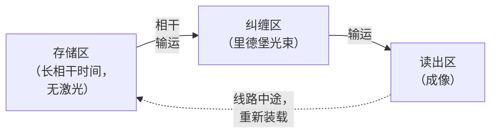

*由于原子是被移动而非被布线连接的，连接性是可编程的——任何原子都可以被带到任何其他原子旁边，这与固定的超导晶格不同。*

#### 12. 线路中途的原子移动与分区架构

中性原子最具特色的能力是**在计算过程中移动原子**，而不仅仅是在初始化时：

- 利用 AOD 操控的光镊，原子可以被**物理输运**而同时保持其量子态（相干输运——若以绝热方式并在正确的内部态下进行，量子比特的内部态不会受到运动的扰动）。这实现了一种**“穿梭”式连接模型**：要使两个相距较远的原子纠缠，就*把它们移到相邻位置*，施加一个里德堡门，然后再将它们移开——从而获得有效的**长程、可重构连接性**，既没有超导芯片固定的最近邻限制，也没有文件 8 中 SWAP 网络的开销。任何原子都可以被带到任何其他原子旁边。
- **分区架构**将阵列划分为若干功能区域——**存储区**（原子空闲，不施加门）、**纠缠区**（施加里德堡门）和**读出区**（状态测量）——并按算法需要让原子在各区之间穿梭。这与囚禁离子的 QCCD 架构（文件 4）直接类似，只是用光镊而非电极电压来实现。** Harvard/MIT/QuEra** 团队演示了恰好这样一种用于纠错的分区、可重构架构，通过在存储区与纠缠区之间物理移动构成逻辑量子比特的原子来实现伴随式提取和逻辑门。

这种可重构性——任意的、可动态改变的连接性——与全局门的并行性相结合，是中性原子平台标志性的架构优势，并且特别适合低开销 qLDPC 码和晶格手术（lattice surgery）所需的灵活连接性（文件 9）。

#### 13. 2023 年的逻辑量子比特演示

这一里程碑式成果（**Bluvstein et al., "Logical quantum processor based on reconfigurable atom arrays," Nature 626, 58 (2024); arXiv:2312.03982**，Harvard/MIT/QuEra）演示了：

- 在几百个物理 ⁸⁷Rb 原子中编码了多达 **48 个逻辑量子比特**，使用了表面码和颜色码。
- 通过全局里德堡脉冲，在许多逻辑量子比特上并行执行**横向逻辑门**（利用并行性优势，第 10 节）。
- **可重构的分区操作**：原子在存储区与纠缠区之间穿梭以实现逻辑操作，并带有线路中途读出。
- 执行逻辑**算法**（包括一个扰动（scrambling）线路），其错误率随码距增大而改善。

这是一个分水岭：它表明中性原子能够实现*许多*逻辑量子比特和*逻辑算法*，利用了该平台的并行性和可重构性，并使中性原子与 Google 的超导低于阈值结果（文件 9）一道跃居纠错竞赛的最前沿。该演示是文件 9、18 和 19 中反复引用的参考点，作为中性原子容错潜力的证据。

#### 14. 为什么可重构性适合纠错

纠错（文件 9）需要：(a) *并行执行许多相同的纠缠操作*（在整个码晶格上提取伴随式），这由全局里德堡门提供；(b) *灵活的连接性*，以实现晶格手术、远距离码片之间的横向门，以及 qLDPC 码的非局域校验，这由原子穿梭提供；以及 (c) 对辅助/伴随式量子比特的*线路中途测量*，这由分区读出提供。中性原子原生地提供全部三项，这也是该平台能如此迅速地实现多逻辑量子比特演示的原因。其代价是原子移动的*时间*成本（穿梭约需 ~100 μs，相比门操作较慢）以及输运过程和整个计算过程中的*原子丢失*（原子可能从光镊中丢失，需要重新装载或采用容忍丢失的协议）——这是 QCCD“穿梭税”（文件 4）在中性原子中的对应物。

---

### 第四部分——主要中性原子系统

> **验证说明。** 规格参数反映的是有文献记录的 2023–2024 年发展轨迹；对于当前的说法请重新核实（文件 22）。

#### 15. QuEra Computing

- **起源/技术：** 从 Harvard/MIT 的 Lukin/Lukin 相关团队分拆而来；采用 ⁸⁷Rb 原子；该公司（与其学术合作者一道）是 48 个逻辑量子比特演示（第 13 节）背后的力量。
- **Aquila：** 一台 **256 量子比特的模拟量子模拟器**（非基于门），可在 **AWS Braket** 上使用，用于可编程的模拟哈密顿量演化（通过里德堡相互作用进行伊辛模型模拟）——这是面向量子模拟和某些优化映射的真实的、公开可用的近期产品。
- **路线图：** 从模拟（Aquila）过渡到带有主动纠错的**数字、基于门**的系统（Gemini 级别），建立在逻辑量子比特成果之上（文件 19）。
- **定位：** 既有强烈的**由学术论文驱动的公信力**（Nature 逻辑量子比特论文），也有商业产品营销；是已演示纠错方面的领先者（文件 20）。

#### 16. Pasqal

- **起源/技术：** 总部位于法国，从 Institut d'Optique 分拆而来（Browaeys/Lukin 谱系，Alain Aspect 为联合创始人）；采用 ⁸⁷Rb 原子；同时提供**模拟和数字**中性原子处理器。
- **重点：** 优化和量子模拟应用；采取**合作/联合开发的商业化模式**（与能源、金融和材料领域的知名企业伙伴开展工业试点项目），而非单纯的云接入。
- **定位：** 欧洲领先的中性原子公司，与 Alice & Bob 一道支撑着法国的国家量子战略（文件 20、21）。

#### 17. Atom Computing

- **技术：** **¹⁷¹Yb 中的核自旋量子比特**（类碱土），具有很长的相干时间（已演示数十秒）。
- **里程碑：** 宣布了一个 **1,225 原子阵列（2023）** ——在当时是所有技术路线中最大的量子比特阵列，是中性原子扩展性的标志性演示（不过一如既往，原始原子数并不等同于逻辑量子比特数，甚至不等同于高保真度量子比特数；文件 1、文件 22）。
- **与 Microsoft 的合作：** 与 Microsoft 合作开展纠错逻辑量子比特演示（2024），将 Atom Computing 的硬件与 Microsoft 的量子比特虚拟化/纠错软件结合（文件 7、19、20）。

#### 18. Infleqtion（ColdQuanta）及其他

- **Infleqtion（前身为 ColdQuanta）：** 总部位于美国，拥有广泛的**冷原子技术组合**，涵盖量子计算（基于里德堡）、量子传感、原子钟和授时（文件 16）——是一家多元化的冷原子公司，计算只是其多条产品线之一。
- **其他：** planqc（德国，⁸⁷Sr）、M Squared，以及学术重镇（Harvard/MIT-Lukin、Institut d'Optique-Browaeys、Caltech-Endres、Wisconsin-Saffman 等），它们为该领域输送人才并提供成果（文件 20）。

---

### 第五部分——性能特征与权衡

#### 19. 相干时间

- **基态超精细相干性**（⁸⁷Rb、Cs）：在适当操作下可超过 **1 秒**。
- **核自旋相干性**（¹⁷¹Yb，Atom Computing）：已演示**数十秒**——接近囚禁离子的相干时间。
- **里德堡态寿命：** 短得多（~μs–100 μs），但这仅在原子短暂处于里德堡态的短暂（~100 ns–1 μs）门操作*期间*才有影响，对空闲存储则无影响——量子比特几乎所有时间都处于长寿命的基态/核自旋态中。

#### 20. 门速度

里德堡门耗时 **~100 ns–1 μs**——处于超导（ns–100s ns，更快）与囚禁离子（μs–ms，更慢）*之间*。结合里德堡门的*全局并行性*（每个脉冲使许多原子对纠缠），尽管单个门的时间如此，并行操作（如纠错中的伴随式提取）的*有效*吞吐量仍可以很高，因为每个脉冲可执行 O(N) 个门。主要的*慢*操作是**原子移动**（每个穿梭步骤约 ~100 μs）和**阵列重新装载**，它们决定了可重构操作的实际循环时间。

#### 21. 保真度前沿

在 2023–2024 年的领先演示（Harvard/QuEra、Caltech）中，两量子比特里德堡门保真度达到 **>99.5%**，并在快速提高，正逼近离子的 >99.9% 以及最佳超导水平。限制因素——里德堡态衰变、激光噪声、原子运动/温度、不完美的阻塞——都是已知且可以攻克的（更好的激光、更冷的原子、改进的脉冲协议、腔增强或单光子里德堡激发）。

#### 22. 可扩展性优势

中性原子已经演示了**所有技术路线中最大的原始量子比特数**（1000+ 原子），因为扩展主要是一个**光学和激光功率**问题——更大的 SLM 视场、更多的激光功率、更大的真空腔——而不需要像超导那样**为每个量子比特增加新的制造控制布线**（文件 3、11）。单个全局激光即可控制整个阵列；单独寻址使用可操控光束，而不是每个量子比特一根导线。对于达到数千量子比特而言，这种“光学扩展”在性质上比“布线扩展”容易，也是中性原子扩展性论点的核心。反方观点（文件 1、22）是：原始原子数不等于高保真度量子比特数或逻辑量子比特数，原子丢失和重新装载带来额外开销，而且激光/光学控制系统本身也有扩展极限（文件 11）——因此，中性原子的扩展性优势是真实的，但必须结合保真度、丢失和控制复杂度方面的考虑加以限定。

---

### 第六部分——综合与交叉引用

中性原子占据了模态权衡空间（文件 7 的表格）中**大规模、可重构、室温装置**的一角：最大的原始量子比特数（1000+）、任意且可动态重构的连接性（原子穿梭）、大规模并行的全局纠缠门（里德堡阻塞）以及长相干时间（超精细量子比特为秒量级，核自旋量子比特为数十秒）——同时具有中等的门速度（~100 ns–1 μs）、快速提高的保真度（>99.5% 且仍在上升），以及原子丢失/重新装载和原子移动缓慢这些实际负担。与囚禁离子（文件 4）一样，这些量子比特**不需要低温**（原子在室温真空中被激光冷却），取而代之的是并行存在的复杂**激光/光学控制系统**（文件 11）这一挑战——包括 SLM、AOD、里德堡激发激光、冷却和读出激光——它是超导布线瓶颈和囚禁离子激光瓶颈在中性原子中的对应物。

该平台的标志——任意可重构连接性、全局门并行性与大规模——使其特别适合**纠错**（大量并行的伴随式提取、面向 qLDPC 和晶格手术的灵活连接性、通过分区读出实现的线路中途测量），这也是中性原子能如此迅速地实现该领域首个*多逻辑量子比特*演示（48 个逻辑量子比特，2023）的原因。尚待解决的问题有：将两量子比特保真度**提高**到 >99.9%（更好的激光、更冷的原子、腔增强里德堡激发）；**缓解原子丢失**（容忍丢失的码、线路中途重新装载、连续原子源运行）；在大规模下**驾驭激光/光学控制的复杂性**；以及**加快原子移动和阵列循环**。究竟是中性原子的大规模和可重构性，还是囚禁离子的创纪录保真度，或是超导的速度和制造基础，会成为实现有用容错的制胜组合，这是文件 18–20 的战略问题——而中性原子凭借其并行性和可重构性一跃跻身逻辑量子比特竞赛的前列，稳居领先者之列。

*交叉引用：形式体系、作为条件非线性的里德堡阻塞，以及相干性品质因数（文件 2）；与之共享激光冷却/光学控制的姊妹平台囚禁离子（文件 4）；跨模态比较表（文件 7）；受益于可重构连接性的编译（文件 8）；中性原子纠错与 48 逻辑量子比特演示（文件 9）；激光/光学控制系统（文件 11）；采用并行全局门的资源估算（文件 18）；QuEra/Pasqal/Atom Computing 路线图（文件 19）与竞争定位（文件 20）；基准测试（文件 22）；共享技术基础的冷原子传感与原子钟（文件 16）；真空系统与光学通路的制造（文件 23）。*

---

### 第七部分——扩展的里德堡物理与门工程

#### 23. 偶极力与阱参数的定量描述

对于功率为 P、束腰为 w₀、相对于线宽为 Γ 的原子跃迁失谐 Δ 的红失谐高斯光镊，其光学偶极势阱深度近似为

U₀ ≈ (ℏΓ²/8Δ) · (I₀/I_sat)，其中峰值光强 I₀ = 2P/(πw₀²)，

因此对于 ⁸⁷Rb 在 1064 nm（远红于 780 nm 的 D2 线）处，约 1 mK 深的阱需要将几 mW 的光聚焦到约 1 μm 的束腰。阱频率（径向 ω_r、轴向 ω_z）决定了振动能级间距；被冷却到约 10 μK 的原子占据最低的几个振动能级。必须保持较低的残余**光子散射率** Γ_sc ∝ Γ³/Δ² · (I/I_sat)（大失谐），因为每个被散射的光子都会加热原子并可能使量子比特退相干——这就是采用远失谐囚禁以及**魔术波长**囚禁（第 24 节）的原因。原子的有限温度（~μK）会导致位置扩散（~数十 nm）和多普勒位移，从而造成门的不保真（第 21 节），因此更冷的原子（通过改进的冷却，或囚禁在振动基态）可直接提高保真度——这是提高保真度的一个关键手段。

#### 24. 魔术波长与差分光位移

一个微妙之处在于：囚禁光对两个量子比特态（以及里德堡态）造成的光位移通常*不同*（差分光位移），这会使量子比特退相干（量子比特频率取决于局域阱光强，而后者随原子的热运动而变化）。解决办法是采用**魔术波长**——在该阱波长下，两个量子比特态经历*相等*的光位移（其差分位移为零），使量子比特频率与阱光强涨落解耦，并显著改善相干性（与光晶格钟中使用的技巧相同，文件 16）。对于里德堡门，还有一个进一步的复杂因素：红失谐光镊对里德堡态是*反囚禁*的（近乎自由的里德堡电子感受到排斥性的有质动力势），因此在里德堡门期间阱往往被**暂时关闭**（原子在约 100 ns–1 μs 的门期间自由飞行，然后被重新囚禁）——这要求门相对于原子逃逸而言足够快，并促使人们提出也能囚禁里德堡态的魔术波长或“里德堡魔术”囚禁方案。这些光位移的细节对于同时实现高保真度和长相干时间至关重要，也是碱土（核自旋量子比特）工作的主要关注点，因为其电子钟态提供了有利的魔术波长选项。

#### 25. 里德堡激发方案

将基态原子激发到里德堡态（n~50–100）需要跨越很大的能隙（紫外量级）。有两种方法：

- **双光子激发：** 两束激光（例如 Rb 采用 420 nm + 1013 nm，经由中间的 6P 态），其能量之和达到里德堡能级。优点：使用更方便的波长，并允许调节中间态失谐。缺点：来自中间态的散射（一个误差来源），以及需要两台稳频激光。
- **单光子（直接紫外）激发：** 单束紫外激光（Rb 约 297 nm）直接驱动基态→里德堡跃迁，避免了中间态散射——原理上更干净，但需要紫外激光技术（更困难，如囚禁离子 Yb⁺，文件 4）。采用高功率紫外光并结合腔增强的单光子激发是通向更高保真度门的一条途径。

里德堡激发激光上的激光**相位噪声**是门保真度的主要限制之一（它会在门操作期间使基态–里德堡叠加态退相干），因此超低相位噪声、经稳频的激光（锁定到参考腔）至关重要——这与囚禁离子光学量子比特对激光稳定性的要求相同（文件 4），也是激光瓶颈（文件 11）的关键组成部分。

#### 26. 超越 CZ：多量子比特门与原生门

里德堡阻塞自然地实现了超越两量子比特 CZ 的**多量子比特门**。如果多个原子位于同一阻塞半径内，则至多一个可以被激发到里德堡态——这一集体约束可在单次操作中直接实现**多控制门**（例如 Toffoli/CCZ），而无需分解为两量子比特门。这种原生多量子比特能力可以减少某些线路的门数（例如 Grover 扩散算子中的多控制操作，或纠错辅助比特制备）。结合全局寻址，中性原子可以**并行执行许多多量子比特门**——这是超导或囚禁离子硬件中没有明确对应物的独特能力，编译器（文件 8）和纠错方案（文件 9）才刚刚开始充分利用它。

#### 27. 阻塞半径与阵列几何作为连接性的调节旋钮

由于相互作用 V(R) = C₆/R⁶ 随距离急剧衰减，阵列几何*就是*连接图：处于阻塞半径 R_b 之内的原子相互作用（可由全局脉冲使其纠缠）；之外的原子则不然。通过选择相对于 R_b 的晶格间距（可通过里德堡能级 n 调节，因为 R_b ∝ n^{11/6}），设计者可以决定哪些原子耦合。这给出一种*几何可编程*的连接性——将原子放置在刚好位于 R_b 之内即为最近邻，或通过激发到更高的 n（更大的 R_b）获得更长程的连接。结合原子穿梭（第 12 节），这产生的连接性既*几何可调*（通过间距和 n），又*可动态重构*（通过移动）——是所有技术路线中最丰富的连接性控制，也是中性原子适合灵活的码和模拟量子模拟的主要原因。

---

### 第八部分——基于中性原子的模拟量子模拟

#### 28. 作为模拟模拟器的里德堡哈密顿量

在门模型计算之前（并与之并行），中性原子阵列就是一流的**模拟量子模拟器**。用全局里德堡激发激光（拉比频率 Ω，失谐 δ）驱动所有原子，即可实现**里德堡哈密顿量**：

Ĥ = (Ω/2) Σ_i σ_x^{(i)} − δ Σ_i n_i + Σ_{i<j} V_{ij} n_i n_j,

其中 n_i = |r⟩⟨r|_i 投影到原子 i 的里德堡态，V_{ij} = C₆/R_{ij}⁶ 为范德瓦尔斯相互作用。这直接对应于一个具有可编程几何（阵列布局决定 V_{ij}）以及可调横场（Ω）和纵场（δ）的**量子伊辛/里德堡阻塞模型**。通过扫描这些参数，可以制备并研究奇异的量子相（反铁磁和密度波序、受挫晶格上的量子自旋液体、对称保护拓扑相）以及非平衡动力学（量子多体疤痕态——Harvard 团队观察到的著名里德堡“疤痕”动力学）。QuEra 的 **Aquila**（256 量子比特，位于 AWS Braket 上）和 Pasqal 的模拟系统是其商业化实现。模拟量子模拟是科学上最可信的近期应用之一（文件 13、17），而具有任意几何和可调相互作用的里德堡平台可以说是现有最灵活的模拟模拟器——与囚禁离子模拟量子模拟（文件 4）以及超导/数字方法互为补充。

#### 29. 模拟优化与 MIS 映射

里德堡阵列可原生编码某些**组合优化**问题。“单位圆盘图”（当且仅当距离在某范围内时顶点相连）上的**最大独立集（MIS）** 问题可直接映射到里德堡阵列：阻塞约束（相邻的两个原子不能同时被激发到里德堡态）恰好就是独立集约束，而里德堡哈密顿量的基态（在阻塞约束下使激发数最大化）就是最大独立集。QuEra 及其合作者在 Aquila 级硬件上演示了 MIS 优化（Ebadi et al., Science 2022; arXiv:2202.09372），这是一个具有*原生*硬件编码的优化问题的例子。需要如实指出的保留意见（文件 17）：对于实际相关的实例，这是否相对于经典 MIS 求解器带来真正的优势仍存争议，一如所有近期优化方面的主张——原生编码很优雅，但其本身并不能证明加速。尽管如此，它展示了中性原子平台把某些问题直接映射到其物理上的独特能力。

---

### 第九部分——激光与光学控制系统（移交至文件 11）

#### 30. 中性原子的控制栈

与囚禁离子一样，中性原子面临**激光/光学控制**的扩展性挑战（文件 11）。中性原子系统需要：

- **冷却激光**（磁光阱以及进一步冷却到 μK）。
- **囚禁激光**（远失谐的光镊光，由 SLM 整形成阵列；通常是高功率的 1064/850 nm 激光）。
- **AOD 驱动的可移动光镊**，用于重排和穿梭（射频控制的光束操控）。
- **里德堡激发激光**（一束或两束稳频、低相位噪声光束；紫外或蓝光+红外）。
- **局域寻址光束**（由 AOD 操控，用于单量子比特门和选择性操作）。
- **成像/读出系统**（用相机收集荧光，实现单次拍摄、原子分辨的探测）。

光学复杂度相当可观，但与逐量子比特布线（超导）的一个关键区别是，**大部分控制是全局的或共享的**：一个 SLM 定义整个阵列，一束全局里德堡激光驱动所有门，一台相机对所有原子成像。单独寻址使用可操控的光束，而非专用的逐量子比特硬件。这种“共享/全局光学”正是中性原子能够以固定复杂度的光学系统扩展到 1000+ 量子比特的原因——扩展体现在激光功率和视场上，而不是线性增长的导线数量上。剩余的挑战有：激光功率（更多的原子需要更大的总囚禁/里德堡功率）、大视场上的光学像差、里德堡激光的相位噪声，以及 SLM/AOD 重构的速度。

#### 31. 真空、冷却与原子源

中性原子被保持在**超高真空**中（与离子一样，文件 4），以避免背景气体碰撞将原子逐出并限制阵列寿命。原子由**磁光阱（MOT）** 供给，该磁光阱从背景蒸气或原子束中装载，然后转移到光镊阵列中。** 连续重新装载**——在不干扰正在运行的量子比特的情况下补充长时间计算中丢失的原子——是一个活跃的发展方向（Atom Computing 等已演示了连续运行/重新装载），这很重要，因为原子丢失（来自背景碰撞、里德堡衰变引起的丢失以及输运）否则会限制计算长度。真空和冷却装置处于室温（原子无需低温制冷），尽管它是一个庞大的光学/真空系统。光学通路——为众多激光束和成像系统提供的许多精确对准的观察窗口——是真空腔设计的一项关键约束（文件 23）。

---

### 第十部分——算例与历史

#### 32. 算例：阻塞半径

对于被激发到 n=70 的 ⁸⁷Rb，范德瓦尔斯系数 C₆ ≈ 2π × 870 GHz·μm⁶（C₆ ∝ n¹¹ 随 n 急剧增长）。在里德堡激发拉比频率 Ω ≈ 2π × 2 MHz 的情况下，阻塞半径（即 V(R_b) = ℏΩ 之处）为 R_b = (C₆/Ω)^{1/6} = (870,000/2)^{1/6} μm ≈ (435,000)^{1/6} ≈ 8.7 μm。因此，间距约 4–5 μm（典型的阵列间距）的原子完全处于阻塞半径之内并相互阻塞，而相距约 15 μm 以上的原子则不会——这证实了第 8 节的图像，并说明了 n 和间距的选择如何决定连接性。激发到更高的 n 会增大 C₆，从而增大 R_b，扩展相互作用范围——这就是第 27 节的几何连接性旋钮。

#### 33. 算例：门时间与里德堡衰变误差

一个持续时间 t_gate ≈ 0.5 μs 的里德堡 CZ 门，原子大约有一半时间处于寿命 τ_Ryd ≈ 100 μs 的里德堡态，则产生的衰变误差约为 (t_gate/2)/τ_Ryd ≈ 0.25 μs / 100 μs ≈ 2.5×10⁻³——这是总门误差 ~10⁻³ 的主要贡献，也是人们追求更高 n 态（寿命更长，但需要更多的激光功率和更大的阵列）和更快的门（更高的 Ω，需要更大功率）的原因。这一权衡——更快的门减少衰变误差，但需要更多功率并有引入其他误差的风险——是囚禁离子速度/保真度之争以及超导相干性/速度之争在中性原子中的对应物，它也构成了提高保真度路线图的框架。

#### 34. 历史脉络

- **1990 年代–2000 年代：** 光晶格和偶极阱中的中性原子囚禁；Jaksch et al.（2000）的里德堡门方案；早期里德堡阻塞观测（2009，Saffman/Wisconsin 与 Grangier/Institut d'Optique——首次演示两个原子之间的阻塞）。
- **2010 年代：** 单原子光镊阵列；**2016 年重排突破**（Barredo/Browaeys、Endres/Lukin），使无缺陷阵列成为可能；里德堡门保真度从约 97% 向 99% 攀升。
- **2017–2021：** 大型模拟模拟器（51 原子里德堡模拟器，Bernien et al./Lukin 2017, arXiv:1707.04344，观测到量子相变和疤痕态）；公司相继成立（QuEra 2018、Pasqal 2019、Atom Computing 2018）。
- **2022：** 高保真度（>99.5%）里德堡门（Levine et al. 一脉；Evered et al. 2023, Nature, arXiv:2304.05420，报告 99.5%+）；在 289 原子阵列上的 MIS 优化（Ebadi et al. 2022）。
- **2023：** Atom Computing 的 1,225 原子阵列；**48 个逻辑量子比特演示**（Bluvstein et al.，第 13 节）——该领域向多逻辑量子比特的飞跃。
- **2024：** 保真度和规模的持续提升；Microsoft/Atom Computing 与 QuEra 在逻辑量子比特方面的进展；从模拟向数字、基于门的纠错路线图的转变（文件 19）。

这是所有技术路线中上升最快的一条：从首次两原子阻塞（2009）到 48 个逻辑量子比特（2023），不到 15 年，其动力来自重排突破（确定性大阵列）以及适合纠错的并行性/可重构性。这就是为什么中性原子现在被视为通向容错之路上的共同领先者（与超导和囚禁离子并列）。

---

### 第十一部分——纠错、读出与原子丢失的处理

#### 35. 荧光成像读出

中性原子的读出与囚禁离子读出（文件 4）一样，采用**态相关荧光成像**。对于超精细量子比特，常见方案是**推出（吹走）读出**：共振激光将处于某一量子比特态的原子从阱中逐出（或将其加热逐出），然后荧光图像揭示哪些阱中仍有原子——亮原子表示一种状态，缺失原子表示另一种状态。或者，利用态选择荧光（仅从亮态散射光子），用相机并行地对每个原子的状态成像。** 基于相机的成像**自然地给出整个阵列在单次拍摄中的**原子分辨、并行读出**（曝光约 ~10–100 ms），这是一个扩展性优势（一台相机读出所有量子比特）。读出保真度超过 99% 并在不断提高；主要误差是**读出过程中的原子丢失**（读出过程可能将原子逐出）以及背景光的甄别。对于核自旋量子比特（碱土），利用电子钟态的更复杂的读出可实现高保真度、有时甚至是**非破坏性**的测量——这对纠错中的线路中途测量很重要。

#### 36. 原子丢失问题及其缓解措施

中性原子的一个独特挑战（超导中不存在，囚禁离子中也基本不存在）是**原子丢失**：原子因背景气体碰撞、里德堡衰变到未被囚禁的态、不完美的输运以及有限的阱寿命而从光镊中丢失。在长时间的计算中，原子就这样从阵列中*消失*。这既是个麻烦（量子比特变少），而且重要的是，也是一种*可探测*的误差（缺失的原子是位置已知的**泄漏/擦除误差**）。缓解措施，以及巧妙的*利用*方式：

- **擦除转换：** 由于丢失原子的位置是*已知的*（成像揭示哪些阱是空的），原子丢失可被视为**擦除误差**——位置已知的误差——它比未知的泡利误差容易纠正得多。纠错码能够纠正的擦除数量大约是未知误差数量的*两倍*（一个擦除只“消耗”一个码距单位，而不是两个）。一些中性原子（及碱土）方案有意**将主导误差转换为擦除**（例如，使用亚稳态量子比特态，使主要衰变将原子留在可探测的状态），把劣势转化为 QEC 优势——即“擦除量子比特”概念（Wu, Kolkowitz, Puri, Thompson 2022; arXiv:2201.03540），这是一个降低有效纠错开销的重要思想（文件 9、18）。
- **线路中途重新装载：** 在计算期间从储备 MOT 补充丢失的原子（Atom Computing 的连续运行），在长时间运行中维持阵列。
- **容忍丢失的协议与穿梭冗余。**

原子丢失/擦除的故事是一个很好的例子，说明如何通过巧妙的编码把某一技术路线特有的弱点转化为 QEC 特有的优势——这是一个反复出现的主题（参见囚禁离子的线路中途测量、猫态量子比特的偏置噪声），即让平台特定的误差结构与量身定制的码相匹配（文件 9）。

#### 37. 深入探讨中性原子纠错

48 逻辑量子比特演示（第 13 节）利用了中性原子特有的若干纠错优势：

- **通过全局脉冲实现横向门：** 将逻辑门作为施加在码块每个物理量子比特上的相同物理门来执行，由全局里德堡脉冲并行执行——高效且快速。
- **用于码布局和晶格手术的可重构连接性：** 穿梭原子以使码片靠拢进行联合操作，或在不同的码布局之间重新排布，从而灵活地实现逻辑两量子比特门和码形变。
- **分区操作：** 存储区、纠缠区和读出区，原子在它们之间移动，使测量与计算相互隔离。
- **适合 qLDPC 和高码率码：** 灵活、长程、可重构的连接性原生支持校验为非局域的码（不同于最近邻的超导硬件），有望实现可大幅降低物理量子比特需求的低开销 qLDPC 码（文件 9）（文件 18）。

这些优势使中性原子可以说是演示多逻辑量子比特和灵活码的最适合的*近期*平台——这就是该平台跃居逻辑量子比特数量竞赛最前列的原因。代价（原子移动缓慢、原子丢失、保真度仍在追赶离子）对此有所制约，但其架构与纠错的契合是真实的，也是文件 9 和 19 的核心主题。

---

### 第十二部分——实践者常见问题与术语表

#### 38. 常见问题

**问：中性原子需要低温吗？** 不需要——原子在室温超高真空中被激光冷却。这是与囚禁离子共有的优势，与超导/自旋量子比特的稀释制冷（文件 11）形成对比。代价是一个复杂的激光/光学系统。

**问：为什么超导难以超过约 1000 个量子比特，而中性原子却能扩展到 1000+ 量子比特？** 因为中性原子的扩展是一个*光学*问题（更大的视场、更多的激光功率、一套共享的全局控制），而不是*逐量子比特布线*问题。每个原子没有专用的控制导线；一束全局激光驱动所有门，一台相机读出所有原子。增加原子主要是增加激光功率和光学视场，这比布线的扩展更为平缓（文件 3、11）。

**问：庞大的量子比特数有什么陷阱？** 原始原子数 ≠ 高保真度量子比特数 ≠ 逻辑量子比特数（文件 1、22）。1000+ 阵列中的并非所有原子都能在深线路中同时以高保真度使用；原子丢失、保真度和控制方面的限制会降低*有效*可用数量。中性原子的大规模是真实而重要的，但必须加以限定——这与对待每一个“量子比特数”头条新闻时所采用的原则相同。

**问：为什么可重构连接性意义重大？** 它消除了困扰固定连接性超导芯片的 SWAP 网络开销（文件 8），并原生支持需要非局域连接性的灵活码（qLDPC、晶格手术）（文件 9）。任何原子都可以被带到任何其他原子旁边，而且全局门可并行地使许多原子对纠缠——这一组合是中性原子独有的。

**问：目前是什么限制了门保真度，它将如何改进？** 里德堡态衰变、激光相位/强度噪声、原子运动/温度，以及不完美的阻塞。改进途径：更冷的原子（基态冷却）、更低相位噪声和更高功率的里德堡激光（单光子紫外、腔增强）、更高 n 的态（更长的里德堡寿命），以及更好的脉冲协议。保真度已从约 97%（2010 年代）攀升到 >99.5%（2023–2024），预计将继续向 >99.9% 迈进。

**问：模拟还是基于门？** 两者皆可。模拟里德堡模拟器（QuEra Aquila、Pasqal）目前已可商用，用于量子模拟和某些优化映射（第 28–29 节）；带有纠错的基于门的数字系统是路线图的方向（文件 19）。同一套硬件往往可以同时做两者。

**问：中性原子与囚禁离子相比如何？** 它们共享激光冷却/光学控制的技术基因和室温运行，并且都具有长相干时间和灵活的连接性。中性原子在**原始规模**（1000+ 对每个模块数十个）和**全局门并行性**上胜出；囚禁离子在**保真度**（>99.9% 对 >99.5%）和**线路中途测量的成熟度**上胜出。两者都使用穿梭实现连接性（AOD 光镊对电极电压）。它们是两种领先的*高相干、灵活连接、室温*技术路线，主要区别在于对规模与保真度的侧重不同（文件 7）。

#### 39. 术语表

- **光镊（Optical tweezer）：** 一束紧聚焦的激光，通过偶极力（交流斯塔克力）囚禁单个中性原子。
- **碰撞阻塞（Collisional blockade）：** 一个光镊中要么有 0 个要么有 1 个原子的效应（光辅助碰撞会将成对原子逐出）。
- **SLM / AOD：** 空间光调制器（静态阵列全息）/ 声光偏转器（可移动、可操控的光镊）。
- **重排（Rearrangement）：** 将原子从随机装载的阵列移动到无缺陷的目标几何构型中。
- **里德堡态（Rydberg state）：** 高激发的原子态（n~50–100），具有巨大的偶极矩和范德瓦尔斯相互作用（C₆ ∝ n¹¹）。
- **里德堡阻塞（Rydberg blockade）：** 一个里德堡激发使附近原子的里德堡跃迁偏离共振，从而阻止双重激发——即纠缠机制。
- **阻塞半径 R_b：** 两个原子相互阻塞所在的距离范围（∝ n^{11/6}）；决定连接性。
- **魔术波长（Magic wavelength）：** 使两个量子比特态获得相等光位移的阱波长，使量子比特与阱光强噪声解耦。
- **核自旋量子比特（Nuclear-spin qubit）：** 编码在碱土（类碱土）原子（¹⁷¹Yb）核自旋中的量子比特，相干时间极长。
- **擦除转换（Erasure conversion）：** 利用原子丢失位置已知这一点，把误差当作（更易纠正的）擦除来处理。
- **分区架构（Zoned architecture）：** 存储/纠缠/读出区，原子在它们之间穿梭。
- **关键数字：** 阵列规模 100 至 1000+ 个原子；两量子比特里德堡门保真度 >99.5%；门时间 ~100 ns–1 μs；超精细 T₂ ~1 s，核自旋 T₂ 数十秒；读出 >99%；穿梭 ~100 μs；室温超高真空。

---

### 第十三部分——定量扩展分析、跨模态定位与前沿问题

#### 40. 定量扩展分析

中性原子的扩展性论点基于这样一个观察：控制系统的复杂度增长远慢于量子比特数量：

- **囚禁：** 一束高功率激光加一个 SLM 即可定义整个阵列。增加原子需要更多的激光功率（线性）和更大的视场（受光学像差和可用功率限制），但*不需要*更多的控制通道。目前的阵列已达到 1000+ 原子；扩展到约 10,000 主要是激光功率和光学工程问题（更高功率的激光、更好的光学器件，可能还有多个堆叠平面或三维阵列）。
- **门：** 一束全局里德堡激光并行驱动所有门。*激光通道数不随量子比特数增长*——这与超导的逐量子比特控制线（文件 11）有根本区别。局域寻址的规模取决于*同时被单独寻址*的原子数（AOD 通道），而不是总数。
- **读出：** 一台相机并行对所有原子成像。读出硬件的复杂度是固定的。

对比超导的布线瓶颈（文件 3、11）：每个超导量子比特都需要专用的驱动线、磁通线和（共享的）读出线，每根线都会把热量带入固定的低温预算中，从而限制了每台制冷机的量子比特数。中性原子没有这种逐量子比特布线；它们的扩展极限由激光功率、光学视场/像差、原子丢失/重新装载速率以及 SLM/AOD 重构速度决定——这些极限更“软”，更易于工程化解决。这就是“中性原子在所有技术路线中具有最有利的*原始数量*扩展性”这一论断的定量核心，也是它们保持量子比特数量纪录的原因。

对此的反面因素，定量表述如下：(i) 使用可重构连接性时，**有效时钟速度**受原子移动（每次穿梭约 ~100 μs）限制，因此包含大量重排的深线路速度较慢；(ii) **原子丢失**（阱寿命每秒损失数个百分点，外加每次操作的丢失）在没有连续重新装载的情况下限制了计算长度；(iii) **保真度**（>99.5%，正在追赶）仍落后于离子，因此每个量子比特的物理比特到逻辑比特开销（文件 18）略高于离子——部分被擦除转换（第 36 节）降低有效开销所抵消。总体图景是：中性原子以部分单量子比特保真度和时钟速度，换取了最大的规模、最灵活的连接性和最佳的全局门并行性——这一特征尤其有利于*多逻辑量子比特*纠错（文件 9）。

#### 41. 跨模态定位（文件 7 表格预览）

| 属性 | 中性原子 | 囚禁离子（文件 4） | 超导（文件 3） |
|---|---|---|---|
| 两量子比特门保真度（最佳） | >99.5% | >99.9% | 99.5–99.9% |
| 相干时间 T₂ | ~1 s（超精细），数十 s（核自旋） | 秒至分钟 | ~100 μs |
| 门时间 | ~100 ns–1 μs | μs–ms | ns–100s ns |
| 原始量子比特数 | 1000+（最大） | 每模块数十个 | 100s–1000+ |
| 连接性 | 可重构，全局并行 | 全连接（模块内） | 固定最近邻 |
| 工作温度（量子比特） | 室温，超高真空 | 室温，芯片 ~4–10 K | ~10 mK |
| 扩展瓶颈 | 激光功率、原子丢失、移动速度 | 激光、穿梭、组网 | 布线、低温、连接性 |
| 突出优势 | 规模 + 可重构性 + 并行全局门 | 保真度 + 全连接 + 线路中途测量 | 速度 + 制造基础 + 适配表面码 |
| 突出劣势 | 原子丢失、保真度仍在追赶、移动缓慢 | 门速度慢、单链限制 | 相干时间短、布线之墙、SWAP 开销 |
| 主要参与者 | QuEra、Pasqal、Atom Computing、Infleqtion | IonQ、Quantinuum、AQT | IBM、Google、Rigetti、IQM |

三种高相干/灵活的技术路线（中性原子、囚禁离子，以及——有所保留地——超导）各自在不同维度上领先：中性原子在**规模和可重构性**，离子在**保真度和连接性的成熟度**，超导在**速度以及制造/投资基础**。究竟哪种组合会在有用的容错上胜出，是文件 18–20 的战略问题。

#### 42. 与冷原子传感和原子钟的联系（文件 16 预览）

中性原子量子计算与**光晶格钟**（有史以来最精确的钟，分数不确定度 <10⁻¹⁸；文件 16）以及**冷原子传感器**（原子干涉重力仪和加速度计；文件 16）共享技术基础——激光冷却、光学囚禁、里德堡物理，以及（对碱土原子而言）钟跃迁。Infleqtion（第 18 节）明确地在这一共享基础上横跨计算、传感和授时。与囚禁离子（文件 4）一样，这一共同渊源在一定程度上降低了*控制*技术的风险：精密的冷原子控制已在计量学中得到验证并商业部署；对于计算而言，剩下的是将其*扩展*到多量子比特、纠错的处理器。越来越受青睐用于核自旋量子比特的碱土（⁸⁸Sr、¹⁷¹Yb）原子，与光晶格钟中使用的是*同样*的原子——这种直接的技术迁移加速了中性原子计算的成熟。

#### 43. 前沿问题（中性原子特有）

与文件 25 的更广泛讨论相互参照，中性原子特有的未解决问题有：

1. **将两量子比特保真度提高到 >99.9%：** 通过更冷的原子（基态冷却）、更低相位噪声/更高功率的里德堡激光（单光子紫外、腔增强）、更高 n 的态，以及改进的脉冲协议——缩小与囚禁离子的剩余差距。
2. **原子丢失的缓解与连续运行：** 稳健的线路中途重新装载、容忍丢失/擦除转换的码，以及更长的阱寿命，以支持深度的、长时间的计算。
3. **更快的重构：** 加快原子移动和阵列循环（目前约 ~100 μs/次穿梭），以提高可重构连接性线路的有效时钟速度。
4. **光学系统的扩展：** 更高功率的激光、更大的无像差视场、三维阵列，以及高效的局域寻址光学系统，推动从 1000+ 向 10,000+ 原子迈进。
5. **高保真度线路中途测量与前馈：** 为实现实时纠错，发展非破坏性、区域隔离的读出以及快速经典反馈（文件 11）——目前囚禁离子在这方面领先。
6. **利用并行性和可重构性实现低开销容错：** 实现该平台的灵活连接性所独有地支持的 qLDPC 和高码率码（文件 9），有望以远低于最近邻技术路线的开销获得许多逻辑量子比特。

这些方面的进展决定了中性原子的大规模、可重构性和全局门并行性——它们已经带来了该领域首个多逻辑量子比特演示——能否延续到有用算法所需的数百至数千个高保真度逻辑量子比特（文件 18）。

#### 44. 结语评估

中性原子量子计算的崛起速度超过任何其他技术路线：从首次两原子里德堡阻塞（2009），到无缺陷阵列（2016）、高保真度门（>99.5%，2022–2024）、所有平台中最大的量子比特阵列（1,225 个原子，2023），再到该领域首次演示数十个纠错逻辑量子比特（48 个逻辑量子比特，2023）。它独特的组合——光镊囚禁（通过光学而非布线实现扩展）、里德堡阻塞门（可开关的强相互作用，具有原生多量子比特和全局并行操作）、可重构连接性（通过原子穿梭实现灵活的长程耦合）、长相干时间（超精细量子比特为秒量级，核自旋量子比特为数十秒）以及室温运行（无需低温）——使其成为通向容错之路上与超导和囚禁离子并列的共同领先者，并且可以说是演示*许多*逻辑量子比特以及灵活、低开销码的最适合的近期平台。它尚待解决的问题——保真度追赶离子、原子丢失、移动速度以及光学系统的扩展——都是真实存在的，也是商业路线图（QuEra、Pasqal、Atom Computing、Infleqtion；文件 19）和冷原子研究界关注的焦点。读者应当带着三种高相干技术路线（中性原子、囚禁离子与超导）的对比，进入文件 6（光子学——室温*飞行量子比特*平台，具有根本不同的、基于测量的计算模型）、文件 7（整合的跨模态表格，以及自旋、拓扑和玻色量子比特），以及文件 9、18 和 19–20，在那里这些硬件性质将影响纠错、资源估算和竞争格局。

*交叉引用：形式体系与相干性品质因数（文件 2）；姊妹平台囚禁离子（文件 4）；超导对比（文件 3）；整合的跨模态表格及其他技术路线（文件 7）；可重构连接性编译（文件 8）；中性原子纠错、擦除转换以及 48 逻辑量子比特成果（文件 9）；激光/光学控制系统（文件 11）；冷原子传感与光钟（文件 16）；采用全局并行门和擦除转换的资源估算（文件 18）；QuEra/Pasqal/Atom Computing 路线图（文件 19）；竞争定位（文件 20）；基准测试（文件 22）；真空与光学通路的制造（文件 23）；模拟量子模拟应用（文件 13、17）。*

---

### 第十四部分——高级里德堡物理、双种类阵列与更多算例

#### 45. 量子亏损与里德堡能级

里德堡能级遵循修正的里德堡公式 E_{n,ℓ} = −Ry/(n − δ_ℓ)²，其中 δ_ℓ 是**量子亏损**——一种修正（在低角动量 ℓ 时最大，此时电子会穿入离子实），使能级偏离类氢值。量子亏损依赖于原子种类和 ℓ（对 Rb、Cs、Sr、Yb 已有精确的列表），其重要性在于它们决定了精确的激发激光频率以及可用于门的能级结构。里德堡态（n 和 ℓ）的选择决定了相互作用强度（范德瓦尔斯相互作用 C₆ ∝ n¹¹）和态的寿命（∝ n³）——设计者选择 n，以在相互作用强度（高 n 有利于获得大阻塞半径）与寿命和激光功率要求（倾向于 n 不要太高）之间取得平衡。典型选择 n ≈ 53–75，在 μm 间距下给出 MHz-GHz 的相互作用并具有约 ~100 μs 的寿命，是当前门操作的最佳点。

#### 46. Förster 共振与偶极相互作用

除了各向同性的范德瓦尔斯（C₆/R⁶）相互作用之外，当调谐到 **Förster 共振**时，里德堡原子还可以通过**共振偶极–偶极（C₃/R³）** 相互作用发生相互作用——这是指两个里德堡态对近简并，从而允许共振的激发交换。Förster 共振（可通过电场调谐）提供更强、更长程、有时是各向异性的相互作用，可用于设计特定类型的门，以及用于偶极自旋模型（XY 模型，其中激发跳跃实现自旋交换）的模拟量子模拟。能够在范德瓦尔斯（C₆）与共振偶极（C₃）两种区间之间切换，并通过电场调谐 Förster 共振，为里德堡平台增添了另一层独有的相互作用工程——在门设计和量子模拟（第 28 节）中均得到了利用。

#### 47. 双种类中性原子阵列

与囚禁离子（文件 4）一样，**双种类中性原子阵列**（两种原子种类共同囚禁）可实现功能上的分工：

- 一种作为**数据/存储量子比特**（长相干时间），另一种作为**辅助/测量量子比特**——使辅助比特的测量（用于伴随式提取）*不会*因测量光而干扰数据量子比特（不同种类通过不同波长寻址）。这是实现纠错所需的**非破坏性线路中途测量**的一条途径，解决了中性原子的一个关键挑战（第 35 节）。
- 协同冷却与读出隔离，类似于囚禁离子的双种类操作。

双种类（以及双同位素）中性原子阵列是一个活跃的研究方向（例如 Rb + Cs，或两种 Yb 同位素），正是因为它们提供了纠错所需的测量隔离，补充了擦除转换和分区架构的方法。其代价与离子相同，是激光/控制复杂度翻倍。

#### 48. 更多算例

**(i) 大型阵列的阱激光功率。** 单个 1064 nm 的 ⁸⁷Rb 光镊需要几 mW 来形成约 1 mK 的阱。因此，1000 原子阵列需要由 SLM 分配的几瓦阱激光功率（外加 SLM 低效率和重排光镊的额外开销）——用约 10–50 W 的激光即可实现，这证实了扩展到数千个原子是一个激光功率工程问题（第 40 节），而不是逐量子比特布线问题。扩展到 10,000 个原子需要约 10 倍的功率（数十至约 100 W）以及相应更大的、经像差校正的光学视场——要求很高但可以实现。

**(ii) 重排时间。** 将随机装载（约 50% 填充）的 2N 个阱的阵列重排为无缺陷的 N 原子目标，需要移动约 N/2 个原子，每个原子的 AOD 输运约需 ~1 ms（加速、移动、减速，以避免加热/丢失）。通过多个 AOD 光镊并行化，完整的重排大约需要 ~10–100 ms——这是计算之前每次拍摄的一次性开销。这就是中性原子实验的占空比主要由装载/重排/成像（约 ~100s ms）而非快速门所决定的原因——这是一个有别于门级速度的吞吐量考虑因素（文件 22）。

**(iii) 擦除转换带来的开销降低。** 一个能纠正 t 个误差的码可以纠正约 2t 个擦除（每个擦除只消耗半个码距单位）。如果原子丢失（一种擦除）是主导误差，并被转换为已知擦除，则达到目标逻辑错误率所需的有效码距相对于把丢失视为未知泡利误差大致减半——使物理量子比特开销（∝ d²）最多降低约 4 倍。这就是擦除转换（第 36 节）的定量回报，也是让码与平台的误差结构相匹配以降低资源需求的一个具体例子（文件 9、18）——这是降低中性原子（及碱土）容错开销的较重要的近期思想之一。

#### 49. 模拟与数字：平台的双重身份

在领先的技术路线中，中性原子独具一种强大的、*已商业部署*的模拟身份（QuEra Aquila、Pasqal 模拟系统），同时还有其数字、基于门、纠错的路线图。** 模拟**模式（第 28 节）直接对里德堡哈密顿量编程——扫描 Ω、δ 以及阵列几何以演化多体态——目前已可用于量子模拟和某些优化映射（MIS，第 29 节），具有数百个量子比特，但没有纠错，且可编程性有限（仅限于里德堡–伊辛哈密顿量族）。** 数字**模式应用离散的门（里德堡 CZ、局域单量子比特门）以实现通用的、可纠错的计算，这是 QuEra 的 Gemini 级别和 Pasqal 数字路线图的方向（文件 19）。许多系统可以在同一硬件上运行两种模式。这种双重身份使中性原子拥有一条*近期收入/实用*路径（模拟量子模拟，现已可用），同时追求*长期*的容错数字目标——这在弥合 NISQ 到容错的鸿沟（文件 17、19）方面是一种战略优势，也是中性原子既在近期量子模拟应用（文件 13）中占据重要位置，又出现在长期纠错路线图（文件 9）中的原因。

#### 50. 商业与产业背景（文件 20 预览）

- **QuEra**（私有，Harvard/MIT 分拆公司）：模拟产品（AWS Braket 上的 Aquila）加纠错数字路线图；由学术论文驱动的公信力（48 逻辑量子比特的 Nature 论文）；已演示纠错方面的领先者。
- **Pasqal**（法国）：模拟与数字；合作/联合开发的商业化模式（工业试点）；支撑法国国家战略（文件 20、21）。
- **Atom Computing**（美国）：¹⁷¹Yb 核自旋量子比特；1,225 原子阵列；与 Microsoft 合作开展逻辑量子比特演示。
- **Infleqtion**（美国，前身为 ColdQuanta）：多元化冷原子公司（计算 + 传感 + 授时）。

中性原子领域独特的商业特点是*模拟量子模拟的近期产品*（一个真实的、公开可用的、在量子模拟领域有真实用户的产品），同时拥有数字容错路线图——这为这些公司提供了纯门模型 NISQ 厂商所缺乏的近期实用性故事，同时也受到整个领域普遍适用的、关于已证明优势的同样诚实的保留意见的制约（文件 17）。完整的竞争分析见文件 20；路线图可信度评估见文件 19。

---

### 第十五部分——更深入的工程：冷却到运动基态、相干输运与并行控制

#### 51. 将原子冷却到运动基态

正如囚禁离子的门保真度取决于运动基态冷却（文件 4），当原子不仅被冷却到 μK 温度，而且被冷却到**光镊的运动基态**（阱的振动能级中 n̄ ≪ 1）时，中性原子的门保真度会显著提高。残余的热运动会造成两类误差：** 位置扩散**（原子位置涨落，改变里德堡相互作用和局域光位移）和**多普勒退相干**（原子速度使里德堡激发激光产生多普勒频移）。在光镊中进行**拉曼边带冷却**——类似于囚禁离子的边带冷却——可将原子冷却到振动基态（已演示 n̄ < 0.05），大幅降低这些误差，并实现当前前沿的 >99.5% 门保真度。在门操作之前冷却到基态，然后将原子保持在那里（或保持在使运动与量子比特解耦的魔术波长阱中），是最高保真度演示的关键要素。改进冷却是最直接的提高保真度的手段之一（第 21 节），而这方面的进展——连同更好的激光——将把两量子比特保真度从 >99.5% 推向 >99.9%。

#### 52. 相干输运：移动量子比特而不使其退相干

可重构连接性范式（第 12 节）依赖于**相干原子输运**——将原子（在可移动的 AOD 光镊中）从一个位置物理移动到另一个位置，而*不扰动其内部量子比特态*。这并非易事：加速和减速可能加热原子的运动（接近阱深就有丢失的风险），而输运过程中任何态相关的力都会使量子比特退相干。Harvard/QuEra 的演示（第 13 节）表明，原子可以移动数百 μm，并在各区之间重排，同时保持量子比特的相干性——前提是输运足够平滑（限制加速度以避免运动加热），且量子比特处于对输运不敏感的态（例如魔术波长囚禁态，或与运动解耦的核自旋态）。相干输运每次移动约需 ~100 μs（受平滑加速要求限制），这决定了可重构线路的有效时钟速度，并推动了对更快、更低加热输运的研究（第 43 节）。它是囚禁离子穿梭（文件 4）在中性原子中的对应物，以光学而非静电方式实现，正是它使固定阵列变成动态连接的处理器。

#### 53. 并行控制与寻址层级

中性原子的控制通过一个并行程度逐级提高的操作层级进行，这是理解该平台吞吐量的关键：

- **完全全局操作**（一束激光，所有原子）：全局单量子比特旋转（全局微波/拉曼脉冲）和全局里德堡脉冲（同时使所有处于范围内的原子对纠缠）。并行度最大——每个脉冲 O(N) 个操作。
- **行/列或子阵列寻址**（通过一维 AOD 扫描或 SLM 图样）：对选定的子集施加操作——半并行。
- **单独寻址**（受操控的 AOD 光束施加局域光位移或门）：选择单个原子——并行度最低，仅少量用于单量子比特门以及从全局脉冲中“隐藏”原子。

高效的中性原子编译（文件 8）利用这一层级——将线路表达为尽可能多的全局操作（快速且并行）和尽可能少的单独寻址（较慢、串行）。纠错中的伴随式提取天然适合这一点，因为它对每个码块施加*相同的*纠缠操作，可作为一个全局里德堡脉冲来执行——这就是使 48 逻辑量子比特演示成为可能的并行性优势（第 10 节）。理解并利用这一寻址层级，是让中性原子硬件发挥良好性能的核心，它与超导和囚禁离子系统逐门调度（文件 8）在性质上是不同的编译问题。

#### 54. 基于穿梭的各技术路线比较

囚禁离子（QCCD，文件 4）和中性原子都使用**物理量子比特输运**来实现连接性，这一共有的架构范式值得直接比较：

- **输运机制：** 离子通过电极电压时序移动（静电式）；原子通过 AOD 光镊操控移动（光学式）。两者在平滑输运期间都保持量子比特相干性。
- **连接性：** 两者都通过将量子比特移到一起来进行门操作，实现有效的全连接/可重构连接性。
- **并行性：** 中性原子借助全局里德堡门（每个脉冲使许多原子对纠缠）占优；离子门更偏局域。
- **规模：** 中性原子在大型二维阵列（1000+ 位点）内移动；离子在较小的多区芯片（数十个离子）内穿梭。
- **丢失：** 中性原子会遭受原子丢失（通过擦除转换和重新装载缓解）；离子很少丢失，但输运之后必须重新冷却。
- **速度：** 两者的输运操作都约为 ~10–100 μs，相对于门操作较慢——这是两者共有的“穿梭税”。

这种共有的穿梭范式——通过物理移动量子比特实现可重构连接性——使冷原子路线（离子、中性原子）有别于固定连接性的固态路线（超导、自旋），也是两种冷原子平台都适合灵活的、低开销的码（qLDPC、晶格手术）的主要原因，而固定连接性硬件很难原生支持这些码（文件 9）。这是该领域最深层的架构分野之一，并对应着一个战略问题：究竟是可重构连接性（冷原子）还是可通过制造扩展的固定连接性（固态）才是容错的更好基础。

#### 55. 总结与后续指引

中性原子量子计算将文件 2 中抽象的量子比特实现为单个被激光囚禁的原子，通过里德堡阻塞可开关的强相互作用实现纠缠，排布于通过光学而非布线实现扩展的可重构光镊阵列中。其标志性能力——最大的原始量子比特数（1000+）、任意且可动态重构的连接性（相干原子输运）、大规模并行的全局纠缠门（里德堡阻塞）、长相干时间（秒至数十秒）、室温运行、已商业部署的模拟量子模拟模式，以及擦除转换等误差结构优势——使其成为通向容错之路上的共同领先者，也是该领域首个多逻辑量子比特演示背后的平台。其尚待解决的问题——保真度追赶离子（>99.5% → >99.9%）、原子丢失与连续运行、重构速度以及光学系统的扩展——是商业路线图和冷原子研究界关注的焦点。与超导（快速、可通过制造扩展、需要低温；文件 3）、囚禁离子（最高保真度、全连接、室温；文件 4）以及文件 6–7 的各平台（光子、自旋、拓扑、玻色）一道，中性原子勾勒出这样一幅硬件图景：没有任何单一技术路线在所有维度上占优——而战略的艺术（文件 18–20）在于将每个应用的瓶颈（量子比特数、保真度、速度、连接性或规模）与最能缓解该瓶颈的技术路线相匹配。请继续阅读文件 6，了解光子量子计算——这一室温*飞行量子比特*平台，其基于测量和基于融合的计算模型、硅光子的可制造性以及原生适合组网的特性，使其成为所有路线中架构上最与众不同的一种。

---

### 附录——代表性参数、读者要点与扩展数值

#### 代表性参数范围（当前阶段；请依文件 22 重新核实）

| 参数 | 典型值 / 最佳值 |
|---|---|
| 原子种类 | ⁸⁷Rb、¹³³Cs（超精细）；⁸⁸Sr、¹⁷¹Yb（核自旋） |
| 光镊束腰 / 间距 | 束腰 ~1 μm；间距 ~3–6 μm |
| 阱深 | ~0.5–2 mK |
| 原子温度（冷却后） | ~1–10 μK；采用边带冷却时基态 n̄<0.05 |
| 阵列规模 | 100s – 1000+ 个原子（纪录 1,225） |
| 里德堡主量子数 n | ~53–75 |
| 阻塞半径 R_b | ~5–10 μm |
| C₆（随 n¹¹ 变化） | ~2π × 100s GHz·μm⁶ |
| 里德堡态寿命 | ~50–150 μs |
| 两量子比特里德堡门时间 | ~100 ns – 1 μs |
| 两量子比特门保真度（最佳） | >99.5% |
| 单量子比特门保真度 | >99.9% |
| 相干时间 T₂（超精细） | ~1 s |
| 相干时间 T₂（核自旋） | 数十秒 |
| 读出保真度 | >99%（相机，并行） |
| 原子输运（穿梭）时间 | 每次移动 ~100 μs |
| 重排 / 装载 / 成像周期 | ~10s–100s ms |
| 工作温度 | 室温，超高真空 |

#### 文件 5 的读者要点

在评估关于中性原子的某项说法时，请沿本文件确立的几个维度进行分解：** 原子种类与编码**（超精细对核自旋，以及对相干性/激光的影响）；**门机制**（里德堡阻塞、其与 n 相关的相互作用和阻塞半径，以及主要误差——里德堡态衰变、激光相位噪声、原子运动）；**连接性**（通过原子输运实现可重构，以及全局门并行性——没有 SWAP 开销）；**规模说法**（原始原子数对高保真度量子比特数对逻辑量子比特数——始终要限定头条数字，文件 1）；**原子丢失的处理**（重新装载、擦除转换——把弱点转化为 QEC 优势）；以及**模拟对数字**模式（现已可用的模拟量子模拟对数字纠错路线图）。然后提出文件 22 的问题：该指标是否能预测*你的*工作负载上的性能？对于多逻辑量子比特纠错、灵活的码和模拟量子模拟，中性原子的规模、可重构性和并行性是真正的优势；而在最高的单门保真度或最快的吞吐量方面，它们目前分别落后于离子和超导。同时兼顾两面——这一上升最快、阵列最大、架构最适合 QEC 的技术路线，以及它仍在追赶的保真度、原子丢失开销和缓慢的重构——正是本数据库旨在培养的严谨评估。

#### 扩展算例：采用擦除转换时每个逻辑量子比特所需的物理量子比特数

考虑一个中性原子表面码逻辑量子比特，物理两量子比特错误率 p ≈ 3×10⁻³（保真度 99.7%）。在没有擦除转换的情况下，要达到 10⁻¹⁰ 的逻辑错误率，可能需要码距 d ≈ 15–19，即每个逻辑量子比特约 2d²−1 ≈ 450–720 个物理量子比特。如果将原子丢失（主导误差）转换为擦除（第 36 节），有效阈值大致翻倍，所需码距大幅下降（可能降到 d ≈ 11–13），使物理量子比特开销降低约 2 倍（因为开销 ∝ d²）。对于一台 100 逻辑量子比特的机器，这就是约 45,000–72,000 与约 24,000–34,000 个物理原子之间的差别——考虑到中性原子阵列已处于 1000+ 的量级并正向 10,000+ 扩展，这是一个决定性的因素。这一计算（在文件 18 中有详细阐述）说明了为什么擦除转换和高保真度门是最直接地决定中性原子能否以可实现的原子数达到有用容错的两个杠杆——也说明了为什么该平台的大规模、适合灵活码的可重构连接性以及有利于擦除转换的误差结构，使其在有用算法所需的多逻辑量子比特区间中处于有利位置（文件 9、18）。

至此中性原子一章结束。光镊囚禁、里德堡阻塞门、可重构与分区架构、各具名系统以及算例，共同使读者能够评估任何关于中性原子的说法，并将这一技术路线——该领域上升最快、规模最大、可重构性最强的平台——置于文件 3–7 的完整硬件图景之中。

---

### 附录 B——物理细节与扩展讨论

#### 交流斯塔克位移的推导

光学偶极阱（第 2 节）建立在**交流斯塔克位移**之上。一个二能级原子（基态 |g⟩，激发态 |e⟩，跃迁频率 ω₀，线宽 Γ）处于频率为 ω、强度为 I 的激光场中，其基态会经历光位移，通过二阶微扰理论（或缀饰态图像）可算得

ΔE_g ≈ (3πc²/2ω₀³) · (Γ/Δ) · I，其中失谐 Δ = ω − ω₀，

对于**红失谐**（Δ < 0），位移为负（基态在光强最大处能量被降低），从而产生朝向焦点的吸引势。因此势阱深度正比于光强/失谐，而残余的**散射率**按 Γ_sc ∝ (Γ/Δ)² I 变化——所以随着失谐增大，散射的下降（1/Δ²）快于阱深的下降（1/Δ），这就是阱要在远离共振（大 |Δ|）的条件下运行的原因：可以获得一个深的保守阱，同时使导致退相干的散射最小。同样的物理——原子能级的光位移——也是光晶格钟的基础（其中魔术波长使钟态之间的*差分*位移为零；文件 16），也是中性原子计算与光钟计量学共享如此多技术的原因（第 42 节）。理解交流斯塔克位移，是中性原子囚禁、冷却、魔术波长工程以及门期间里德堡态反囚禁（第 24 节）中最重要的一块物理知识。

#### 中性原子为何崛起如此之快：综合分析

中性原子平台的迅猛崛起（第 34 节）可归因于一系列使能进展的汇合，每一项都消除了一个特定的瓶颈：

1. **单原子光镊**（2000 年代）实现了确定性的单原子囚禁（碰撞阻塞）。
2. **里德堡阻塞**（2009 年演示）提供了中性原子本来缺少的可开关强相互作用。
3. **阵列重排**（2016）解决了随机装载问题，使任意大小的无缺陷阵列成为可能——这是关键的扩展使能者。
4. **高保真度门协议**（2019–2024，Levine/Evered 一脉）将门保真度从约 97% 提升到 >99.5%。
5. **相干原子输运与分区架构**（2022–2023）实现了可重构连接性和纠错。
6. **核自旋量子比特与擦除转换**（碱土原子，约 2022）带来了类离子的相干性和对 QEC 友好的误差结构。

结果是：不到 15 年，从两原子的物理演示发展到 48 个纠错逻辑量子比特。没有其他技术路线把从原理验证到多逻辑量子比特演示的历程压缩得如此之紧，而其原因——基于光学的扩展（而非布线）、全局门并行性、适合纠错的可重构连接性以及保真度的快速提升——恰恰是使中性原子成为容错共同领先者的性质。悬而未决的问题（文件 18–19）是：剩余的差距（保真度达到 >99.9%、原子丢失、重构速度、光学扩展）能否像早先的瓶颈那样迅速得到弥合。

#### 最终的跨模态反思

中性原子与囚禁离子共同表明，**原子量子比特**——在室温真空中由激光控制的全同粒子——提供了与**固态量子比特**（超导、自旋）根本不同的扩展故事：没有制造差异，没有材料缺陷导致的损耗，具有长的本征相干时间，并可通过物理输运实现可重构连接性，但代价是复杂的激光/光学控制系统，以及（对于可重构连接性而言）缓慢的穿梭开销。固态路线提供快速的门和半导体制造的杠杆，但面临材料缺陷造成的相干性限制、固定的连接性以及（对超导而言）低温布线之墙。光子量子比特（文件 6）提供了第三条道路——室温飞行量子比特，具有基于测量的计算模型和硅光子可制造性，但没有天然的光子–光子相互作用。当前这一时刻该领域的精妙之处在于，*多种*技术路线都从这些不同的起点跨入了纠错时代，而跨模态比较（文件 7）——而非任何单一平台的路线图——才是至关重要的战略地图。中性原子以最快的速度、在最大的规模上抵达多逻辑量子比特前沿，是这张地图的核心部分，其未来几年的轨迹将是判断哪些架构押注获得回报的最重要信号之一。

#### 再一个算例：模拟量子模拟的资源比较

为了夯实模拟量子模拟的价值主张（第 28 节）：对于一般晶格，在约 256 个自旋上模拟二维量子伊辛模型的基态或淬火动力学在经典上是困难的（态存在于 2²⁵⁶ 维空间中；张量网络方法难以处理违反二维面积律的纠缠，文件 14）。QuEra 的 Aquila 在可编程几何的 256 个原子上*原生地*实现了恰好这一哈密顿量，实时（μs 时间尺度）演化该物理系统，无需门分解——这是一种直接的模拟计算。对于给定实例，这是否构成相对于最佳经典张量网络或蒙特卡洛方法的严格*优势*尚存争议（文件 17），并取决于晶格、产生的纠缠以及所关心的可观测量——但该平台*直接实例化*具有可调几何和相互作用的 256 自旋量子哈密顿量的能力是一种真正的科学工具，已用于已发表的关于量子相变、自旋液体和多体疤痕态的研究（第 28 节）。这是整个数据库中关于量子器件*当下*被用于至少在经典上困难的、具有科学意义的计算的最清晰例子——同时附带诚实的保留意见（文件 14、17）：“经典上困难”是一个不断移动的目标，需要逐案进行基准比较，绝不能仅凭希尔伯特空间维数就假定。以此作为中性原子一章的结尾是恰当的：这一技术路线，其模拟模式已提供科学效用，其数字模式已演示数十个逻辑量子比特，其扩展性、连接性和误差结构优势使其成为容错未来的有力竞争者——并且一如既往地，以本数据库对每项说法所采取的严谨怀疑态度来加以评估。

> **文件 5 读者的最后说明。** 中性原子将整个历程——囚禁、纠缠、扩展和纠错——压缩进一个复杂度增长远慢于量子比特数量的光学系统。这一结构性事实（光学扩展，而非布线扩展）正是它们保持原始数量纪录的原因；里德堡阻塞是它们能并行纠缠的原因；相干输运是它们能灵活连接的原因；而擦除转换加上核自旋编码，则是它们的误差结构适合低开销纠错的原因。请将这四点——光学扩展、阻塞并行性、输运可重构性以及对擦除友好的误差——作为这一技术路线为何重要的简明总结，并以它们以及文件 22 的基准测试原则来检验每一项关于中性原子的说法。

---

<a id="f06"></a>

## 文件 06：光子量子计算——线性光学、基于测量与连续变量方法

> 📄 **原文链接（English original）：[06_photonic_quantum_computing.md](06_photonic_quantum_computing.md)**　｜　[↑ 返回目录](#toc)


> 本文件涵盖架构上最为独特的模态：光子量子计算，其量子比特是**光子**（光）而非物质。光子是天然的"飞行量子比特"（文件 15 的网络），可在（或接近）室温下工作，并可在硅光子学代工工艺上制造——但它们**没有天然的光子–光子相互作用**，这迫使其采用一种根本不同的、*基于测量*的计算模型。本文件阐述离散变量与连续变量编码、KLM 线性光学结果、基于测量与基于融合的计算、PsiQuantum 与 Xanadu 的方案、玻色采样，以及光子损耗这一主要挑战。它与文件 2（形式体系）、7（跨模态比较）、15（网络）和 23（光子制造）互为补充。

---

### 第一部分——为什么选择光子

光子量子计算始于一组独特的优势和一个致命的劣势：

**优势：**
- **室温量子比特。** 光子量子比特本身不需要稀释制冷机（与超导对比，文件 3；不过单光子*探测器*通常需要低温，见第 3 节）。光子在波导和光纤中于室温下传播。
- **天然的飞行量子比特。** 光子是远距离传输量子信息*唯一*实用的载体——这是量子网络、量子密钥分发（QKD）以及模块化/分布式量子计算（文件 15）的基础。光子量子计算机与量子网络使用相同的物理语言。
- **可制造性。** 光子电路可以利用成熟的半导体代工工艺在**硅光子学**平台上制造（文件 23）——波导、分束器、移相器和干涉仪均通过光刻图案化，有望实现晶圆级制造（这是 PsiQuantum 的核心押注，与 GlobalFoundries 合作）。
- **传输中的低退相干。** 光子与环境的相互作用很弱，因此光子的量子态在传播过程中得以很好地保持（这种弱相互作用同样使其成为出色的飞行量子比特）。

**致命的劣势：**
- **没有天然的光子–光子相互作用。** 线性光学介质中的光子只是相互穿过；不存在类似里德堡阻塞或约瑟夫森耦合那样强的、确定性的双光子门。构建纠缠门要么需要**测量诱导的非线性**（KLM，第 4 节）——这是*概率性*的——要么需要奇异的强光学非线性（在单光子水平上实际并不可得）。仅这一事实就决定了整个架构：由于无法获得确定性的双光子门，光子量子计算采用**基于测量**的模型，即计算通过对预先制备的纠缠态进行测量来进行，而概率性操作则通过**大规模复用**（产生许多次尝试并使用成功的那些）变得有效确定。

光子**损耗**——光子直接消失（被吸收、散射或未被探测到）——是主要的错误机制，并且与发生退相位的物质量子比特不同，丢失的光子会*完全移除*信息载体。这塑造了纠错策略（第 8 节）。

---

### 第二部分——离散变量光子量子比特

#### 1. 编码

离散变量（DV）光子量子比特将信息编码在单个光子的二维自由度中：

- **偏振编码：** |0⟩ = 水平偏振，|1⟩ = 垂直偏振。简单且常见于自由空间和光纤 QKD（文件 15），由波片操控。
- **路径（双轨）编码：** 光子处于两条波导/路径之一；|0⟩ = "在路径 A"，|1⟩ = "在路径 B"。适合集成光子学，由分束器和移相器操控。双轨编码是片上光子计算的主力。
- **时间箱编码：** |0⟩ = 早时间箱，|1⟩ = 晚时间箱。在光纤传输中稳健（对偏振漂移不敏感），用于长距离 QKD。

这些编码中的单量子比特门*简单且确定*——分束器、移相器和波片可以以接近 1 的保真度实现任意单量子比特酉操作。困难的是*双量子比特*（纠缠）门（第 4 节）。

#### 2. 单光子源

按需产生单光子是一项核心挑战：

- **自发参量下转换（SPDC）：** 非线性晶体（或波导）以概率方式将一个泵浦光子分裂为两个较低能量的光子；探测到其中一个即"预告"另一个。SPDC 是*概率性*的（给定的泵浦脉冲通常产生零对，偶尔产生一对，很少产生更多），且光子数不确定——这是需要复用的根本限制。SPDC 光子可以具有极佳的纯度和不可区分性。
- **量子点单光子源：** 腔中的半导体量子点在被激发时可按需（确定性地）发射单光子，具有高亮度和高不可区分性——这是更具可扩展性的途径，不过需要良好的光谱控制，且通常需要低温运行。一些公司（如法国的 Quandela）构建基于量子点的光子系统。
- **权衡：** 单光子源以**亮度**（每秒光子数）、**纯度**（恰好一个光子而非两个的概率）和**不可区分性**（光子是否完全相同——对门所依赖的量子干涉至关重要）来评判。没有任何光源能在这三方面都完美，其缺陷会传递为门错误（第 4 节）。

#### 3. 单光子探测器

以高效率和低噪声探测单光子同样至关重要：

- **超导纳米线单光子探测器（SNSPD）：** 偏置在接近临界电流的超导纳米线；吸收一个光子会产生电阻性热点，进而产生电压脉冲。SNSPD 可实现 **>95% 的探测效率**、亚纳秒的时间抖动和极低的暗计数——是现有最好的单光子探测器。代价是：它们工作在 **~1–4 K**，需要低温（只是部分而非完全摆脱了制冷负担——量子比特是室温的，但探测器是冷的）。SNSPD 的制造及其与光子芯片的低温集成是一个关键的工程领域（文件 23）。
- **跃迁边缘传感器（TES）：** 光子数分辨探测器（可以计数到达了多少个光子），工作在更低的温度，用于连续变量和玻色采样实验。

对低温探测器的依赖意味着光子量子计算并非完全无需低温，但其制冷要求（探测器约 1–4 K）远比超导量子比特的约 10 mK 温和。

---

### 第三部分——线性光学与基于测量的计算


**基于测量的（单向）量子计算——通过测量簇态来计算：**

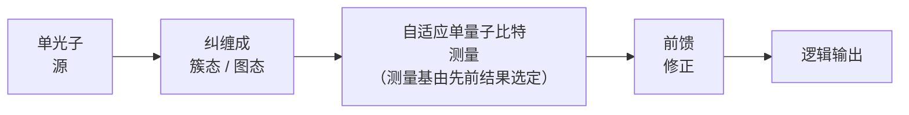

*与线路模型不同，MBQC 将所有纠缠预先装入一个资源态；
计算则只是一系列测量的调度——这与光子学非常匹配，
因为在光子学中纠缠门很难实现，但测量既容易又快速。*

#### 4. 线性光学量子计算（KLM）

奠基性的结果是 **KLM（Knill–Laflamme–Milburn，2001，Nature）**：*仅使用单光子、线性光学元件（分束器、移相器）以及带前馈的测量，即可实现通用量子计算*——尽管不存在任何光子–光子相互作用。其诀窍是**测量诱导的非线性**：通过让计算光子与辅助光子在分束器上干涉并*测量*辅助光子，就能在计算光子上诱导出有效的非线性（纠缠）操作——但只是*概率性*的（门仅在某些测量结果下成功，即"预告"成功）。朴素的双量子比特门成功概率很低（例如 1/4 或更低），将其提升到接近 1 需要额外的辅助光子和预告，且资源成本急剧增长。KLM *原则上*证明了通用性，但意味着巨大的开销——这是后来的模型（MBQC、FBQC）力图使其变得实用的起点。

#### 5. 基于测量的（单向）量子计算

**基于测量的量子计算（MBQC）**，即 **Raussendorf–Briegel 单向量子计算机**（2001），重新组织了计算以适应光子学：

1. **预先**离线**制备一个大型、高度纠缠的"簇态"**（即"图态"——按晶格图纠缠的量子比特）。
2. **纯粹通过对簇态进行自适应单量子比特测量来计算：** 逐个测量量子比特，测量基（通过来自先前结果的经典前馈自适应地）选定以实现所需的逻辑。测量模式*就是*程序。

MBQC 与光子学完美契合，原因在于：(a) 困难的部分——产生纠缠——在簇态制备中*离线*完成（可以以概率方式逐步构建，反复重试直至成功，然后存储/使用）；(b) 计算本身通过*单量子比特测量*进行，而光子学恰恰擅长这一点（快速、高保真的探测）。它把问题从"按需执行确定性的双量子比特门"（光子学做不到）转化为"制备一个大型纠缠态，然后测量"（光子学做得到）。簇态可以通过概率性地融合小型纠缠资源态来产生，并借助复用来克服概率性成功——这是基于融合方法的基础。

#### 6. PsiQuantum：基于融合的量子计算

**PsiQuantum 的方案**是**基于融合的量子计算（FBQC）**（Bartolucci et al., 2021），这是针对可制造的硅光子学量身定制的 MBQC 改进版本：

- 由单光子源产生许多小型**纠缠光子资源态**（例如少光子图态）——以概率方式，并通过复用来保证供给。
- 通过**"融合"测量**将它们组合起来——这是对相邻资源态的光子进行的一种联合（Bell 型）测量，将它们"融合"成更大的纠缠结构，*同时执行纠错*（融合结果提供错误症状信息）。簇态与纠错都由融合共同构建。
- **硅光子学制造：** PsiQuantum 与 **GlobalFoundries** 合作，在标准半导体工艺上制造光子芯片，押注*晶圆级的可制造性*是达到容错光子机器所需的数百万个组件的关键。这是一种独特的策略：PsiQuantum 不是去完善少量子比特的演示，而是直接瞄准大型容错机器，认为光子学的代工可制造性是达到所需规模的唯一途径。
- **复用**（光谱、时间、空间）克服光子产生和融合的概率性：并行产生许多次尝试，使用成功的那些，并将它们切换到位——以组件开销为代价，把概率性组件变成有效确定性的组件。

PsiQuantum 的公开沟通（文件 19）强调**单一的、遥远的大型里程碑**（一台公用事业规模、百万量子比特级的机器），由大量私人和政府资本资助，中间基准测试相对较少——这是一条高风险/高回报的路线图，不同于渐进式的门模型领先者。

---

### 第四部分——连续变量光子学


**两种光子编码的比较：**

```text
   DISCRETE-VARIABLE (DV)              CONTINUOUS-VARIABLE (CV)
   qubit = single photon              qubit = squeezed light / GKP mode
   |0> = |horizontal>                 information in field quadratures (x,p)
   |1> = |vertical> (polarization)    measured by homodyne detection
   photon loss = catastrophic         loss = finite squeezing degradation
   Xanadu (GKP), PsiQuantum uses      Xanadu Borealis / CV cluster states
   dual-rail DV photons
```

#### 7. Xanadu：连续变量与 GKP 编码

**Xanadu 的方案**采用**连续变量（CV）**量子计算，将信息编码在电磁场的*连续正交分量*（振幅和相位，类似位置和动量的可观测量）中，而非离散的单光子中：

- **压缩光与 CV 态：** Xanadu 使用**压缩光源**（在某一正交分量上量子噪声降低的光），并用分束器、移相器以及零差/外差探测来操控场的正交分量。
- **Gottesman–Kitaev–Preskill（GKP）编码：** 为了在 CV 框架内构建有效的*量子比特*，Xanadu 以 **GKP 码**（Gottesman–Kitaev–Preskill，2001）为目标，它将量子比特编码在具有周期结构的 CV 态（相空间中的网格态）中，对正交分量的小位移具有*内置的纠错结构*。GKP 态很难制备（一项主要的研究挑战），但在理论上很强大，连接了 CV 与离散纠错，也与超导腔中的玻色码相关（文件 7）。
- **Borealis 与 X 系列处理器：** Xanadu 的光子处理器；Borealis 演示了高斯玻色采样优势的声明（第 9 节）。
- **PennyLane 软件：** Xanadu 的开源 **PennyLane** 框架（文件 12）用于可微量子编程和量子机器学习，是对整个生态系统的一项重大而独立的贡献——其影响力可以说不亚于 Xanadu 的硬件，提供了跨平台的生态价值（就像 Qiskit 之于 IBM）。

CV 光子学提供确定性的高斯操作（压缩、分束器），只需要一个非高斯元素（如 GKP 态制备或光子数测量）即可实现通用性——对"困难部分"的分解方式与 DV 光子学不同。

#### 8. 光子损耗：主要错误

在所有光子方案中，**光子损耗**都是主要的错误机制，并且与物质量子比特的退相干在性质上不同：

- 丢失的光子*移除了信息载体*，而不仅仅是使其退相位或翻转。在 DV 编码中，丢失的光子通常是*可探测的*（预告的缺失）——这使其成为一种**擦除错误**（在*已知*位置的损失，比未知的 Pauli 错误更易纠正，参见中性原子的擦除转换，文件 5）——但若不加纠正，它仍会破坏计算。
- **损耗会累积**，每个光学元件和每米波导/光纤都会增加损耗。实现容错所需的极低的单元件损耗（波导损耗、耦合损耗、探测器低效率均计入）是核心的工程挑战（文件 23），而光子容错的损耗阈值要求很高（通常要求单元件损耗远低于 1%）。
- **复用**克服了概率性的*产生*，但不能克服*损耗*——计算过程中丢失的光子就没有了。因此，光子容错将抗损耗码（利用被探测到的损耗的擦除性质）与激进的单元件损耗降低相结合。

光子损耗之于光子计算，就如同 TLS 损耗之于超导（文件 3）或原子丢失之于中性原子（文件 5）：是定义该模态的错误，整个架构都是围绕对抗它而组织的。

#### 9. 玻色采样

**玻色采样**（Aaronson–Arkhipov，2011）是一项*受限的、非通用的*光子计算任务：让单光子通过一个大型线性光学干涉仪，并对输出光子数分布进行采样。经典地计算该分布需要求解**矩阵积和式**（permanent，一个 #P 难问题），因此玻色采样被认为在大规模下经典上是不可行的——使其成为在特定采样任务上演示*量子优势*的候选（类似于超导的随机线路采样，文件 14）。要点：

- **九章（Jiuzhang，中国科学技术大学）：** 一系列高斯玻色采样实验，利用压缩光和大型干涉仪，声称在这一特定采样任务上实现了量子优势。
- **Xanadu Borealis：** 一项可编程高斯玻色采样优势的声明。
- **注意事项（文件 14）：** 玻色采样*不是通用计算*——它无法运行 Shor 或 Grover 算法，除了优势演示本身之外没有已知的实际用途。其优势声明与所有基于采样的优越性声明一样，面临同样的"移动靶"式经典模拟审视——经典欺骗算法和改进的模拟已对具体声明提出质疑，而玻色采样的实际意义也存在争议。它是对计算复杂性的物理演示，而不是一台有用的计算机。

---

### 第五部分——挑战、评估与交叉引用

#### 10. 光子挑战汇总

光子量子计算的挑战汇总如下：

- **光子损耗**（第 8 节）：主要错误，要求超低损耗元件和抗损耗码。
- **概率性光源与门：** 只能通过大规模**复用**（光谱/时间/空间）来克服，这带来巨大的元件开销——光子容错机器需要*海量*的光源、开关和探测器，并押注代工可制造性来提供它们。
- **光源缺陷：** 亮度/纯度/不可区分性的权衡（第 2 节）会削弱门所依赖的干涉。
- **低温探测器：** SNSPD 需要约 1–4 K，只是部分（而非完全）摆脱了低温。
- **集成与封装：** 在芯片上以低损耗和良好良率将光源、波导、开关和探测器组合在一起（文件 23）。

光子方面的押注是：这些挑战是可由半导体代工规模解决的*制造*问题（PsiQuantum 的论点），而非根本的物理极限——这与物质量子比特模态截然不同，后者面临物理极限（相干性、连通性），需逐个量子比特地攻克，二者对如何实现容错持有真正不同的理论。

#### 11. 评估与定位

光子量子计算是该领域**方差最高**的押注：如果可制造性论点成立，硅光子学代工厂原则上可以比物质量子比特模态扩展其低温/激光系统更快地生产出容错机器所需的数百万个组件——并且同一技术天然支持量子网络（文件 15）。如果损耗和复用开销被证明难以克服，该方案就会陷入困境。该模态的独特优势——室温量子比特、代工可制造性、天然适配网络的飞行量子比特，以及绕开缺失的光子–光子相互作用的离线纠缠 MBQC/FBQC 模型——是真实而独特的。其独特的弱点——光子损耗这种不留情面的错误、需要大规模复用的概率性元件、低温探测器，以及（对 PsiQuantum 而言）几乎没有中间基准测试的路线图——同样真实。在跨模态比较（文件 7）中，光子学是个异类：它不是更快或相干性更好的物质量子比特，而是一种根本不同的架构，押注于制造规模和基于测量的计算。它的进展——以及 PsiQuantum 和 Xanadu 的路线图（文件 19）——应被视为一场关于*如何*实现容错的独特的、高风险的实验来加以跟踪，它与物质量子比特方案既互补又竞争。

*交叉引用：量子比特形式体系、测量与簇态（文件 2）；跨模态比较与 GKP/玻色码（文件 7）；抗损耗与基于 MBQC 的纠错（文件 9）；PennyLane 软件（文件 12）；玻色采样的经典模拟与优势声明（文件 14）；量子网络与飞行量子比特（文件 15）；PsiQuantum/Xanadu 路线图（文件 19）与竞争定位（文件 20）；硅光子学与 SNSPD 制造（文件 23）。*

---

### 第六部分——扩展主题、公司与实例讨论

#### 12. 深入理解复用：把"可能"变成"必然"

光子计算中最深刻的单一工程思想是**复用**——通过并行和切换，把概率性元件转变为有效确定性的元件。由于单光子源（SPDC）或融合门在任何一次尝试中只以概率 p < 1 成功，光子机器不能依赖任何单次尝试。因此：

- **空间复用：** 并行运行许多光源；当其中一个成功（被预告）时，光开关将其光子路由到所需位置。若有 N 个并行光源，每个以概率 p 成功，则*至少一个*成功的概率为 1 − (1−p)^N → 1（N 适中即可）。
- **时间复用：** 让一个光源在连续的时间箱中反复运行，把成功的光子存储在延迟线（一圈光纤/波导）中，直到积累足够多，然后同步释放。以硬件数量换取时间和延迟线损耗。
- **光谱复用：** 在许多频率模式上产生光子，并将成功的光子频率转换到一个共同的频率。

代价是**开关和延迟线损耗**（每个开关和每米延迟都会增加损耗，第 8 节）以及庞大的**元件数量**——一台容错光子机器可能需要数百万个光源、开关和探测器。这正是为什么*可制造性*（硅光子学代工制造）是 PsiQuantum 的核心论点：该架构用一个*制造*问题（廉价且可重复地制造数百万个低损耗元件）来换取物质量子比特模态的物理问题（相干性、连通性），押注半导体代工厂能赢得这一交换。在复用深度保持可控的同时，开关/延迟损耗能否被压得足够低，是光子容错可行性的关键。

#### 13. 基于融合的纠错，再深入一点

在 FBQC（第 6 节）中，资源态和融合的选取使得*融合结果的模式*直接给出纠错症状。一个常见的目标是拓扑簇态（一种三维图态，其测量模式实现表面码，文件 9）。融合扮演稳定子测量的角色：成功的融合构建纠缠结构并报告症状比特；失败的融合（融合可能概率性地失败，或光子可能丢失）会在簇中产生*已知位置*的擦除，拓扑码可在阈值以内容忍这些擦除。该方案的精妙之处在于，计算、纠缠产生和纠错被统一为一个重复的基本操作（产生资源态 → 融合 → 解读结果）。它的要求十分严苛：融合成功概率和单光子损耗必须低于码的阈值，既需要良好的元件，又需要足够的复用来提升融合成功率。FBQC 以光子原生的方式重新表述了整个容错问题，其可行性取决于第 12 节中的损耗与复用工程。

#### 14. 更广泛的光子公司格局

除 PsiQuantum 和 Xanadu 之外（文件 20 有完整的竞争分析）：

- **Quandela（法国）：** 围绕**量子点单光子源**构建光子系统（确定性、高亮度、不可区分的光子——第 2 节），为 SPDC 的概率性光源提供替代方案；提供可通过云访问的光子处理器。
- **ORCA Computing（英国）：** 使用**量子存储器**（基于原子蒸气）和时间复用的光子系统，侧重近期的光子处理以及与经典 HPC/ML 的集成。
- **Nu Quantum（英国）：** 光子网络组件（单光子源/探测器）与互连，定位于网络与模块化计算的交叉点（文件 15）。
- **QuiX Quantum（荷兰）：** 基于低损耗集成波导芯片的光子处理器。
- **学术重镇：** 布里斯托尔（Jeremy O'Brien，集成量子光子学——PsiQuantum 的根源）、中国科学技术大学（九章玻色采样；文件 21）等。

光子生态系统的显著特点是与**量子网络**（文件 15）的重叠——许多光子元件（光源、探测器、存储器、互连）既服务于计算也服务于通信，这种协同是任何物质量子比特模态都无法达到同等程度的。

#### 15. 实例讨论：为什么离线纠缠是关键洞见

光子计算中最重要的单一概念性举措是**离线**完成纠缠。在物质量子比特机器（文件 3–5）中，纠缠门是在计算*期间*按需、确定性地发生的——光子学做不到这一点（没有光子–光子相互作用）。MBQC/FBQC 绕开了这一点：在逻辑计算*之前*就产生所有纠缠，以概率方式并允许重试，存储得到的纠缠簇态，然后纯粹通过测量来计算。具体而言：机器无需让双光子门在线路时刻 t 可靠地触发，而是先花费更早的时间构建（通过许多概率性融合，重试并复用直至成功）一个大型纠缠态，然后"计算"就只是一系列带经典前馈的单光子测量——这是光子学完成得极好且确定性的操作。这就是为什么一个*没有确定性纠缠门*的模态仍然可以是通用的：它在*计算时*从不需要确定性纠缠门，只需要预先构建好的纠缠资源和快速测量。理解这一点——MBQC 把"按需的确定性双量子比特门"转化为"离线的概率性纠缠加确定性测量"——是理解光子学为何尽管缺少相互作用仍然在架构上可行、以及为何损耗（会不可挽回地破坏预先构建的纠缠）是最重要的错误的关键。

#### 16. 与物质量子比特的比较（文件 7 预览）

| 属性 | 光子 | 物质量子比特（超导/离子/原子） |
|---|---|---|
| 量子比特温度 | 室温 | mK（超导）或室温真空（离子/原子） |
| 探测器/辅助低温 | ~1–4 K（SNSPD） | 该模态的固有组成部分 |
| 双量子比特门 | 概率性（测量诱导） | 确定性（物理相互作用） |
| 计算模型 | 基于测量 / 基于融合 | 线路（门）模型 |
| 主要错误 | 光子损耗（常被预告 → 擦除） | 退相干、门错误、泄漏 |
| 纠缠 | 离线、概率性地产生 | 按需、确定性地产生 |
| 扩展论点 | 大量元件的代工可制造性 | 每量子比特的相干性/连通性/布线 |
| 网络适配性 | 原生（光子是飞行量子比特） | 需要物质–光子转换 |
| 主要参与者 | PsiQuantum、Xanadu、Quandela、ORCA | IBM/Google（超导）、IonQ/Quantinuum（离子）、QuEra/Pasqal（原子） |

光子学是个异类：它不是更好的物质量子比特，而是一种不同的计算范式，将制造规模押注于对抗物质模态受物理限制的逐量子比特进展，并独特地统一了计算与网络。

#### 17. 历史与术语表

**简史：** SPDC 单光子（1980 年代–90 年代）；KLM 线性光学通用性结果（2001）；MBQC/单向计算机（Raussendorf–Briegel 2001）；片上集成量子光子学（布里斯托尔，2000 年代–2010 年代）；玻色采样提出（2011）与演示（九章 2020–2021，Borealis 2022）；PsiQuantum 成立（2016），押注硅光子学容错；FBQC 框架（2021）。该领域的轨迹是从桌面体光学演示走向元件数量不断增加的集成化、代工制造的芯片。

**术语表：**
- **飞行量子比特（Flying qubit）：** 光子——一种适合传输的移动量子比特（文件 15）。
- **双轨编码（Dual-rail encoding）：** 量子比特编码在光子占据两条波导中的哪一条。
- **KLM：** Knill–Laflamme–Milburn——证明线性光学加测量是通用的（概率性地）。
- **MBQC / 单向计算机：** 通过对预先构建的簇（图）态进行自适应单量子比特测量来计算。
- **FBQC：** 基于融合的量子计算——通过对小型资源态的融合测量构建簇态和纠错（PsiQuantum）。
- **簇态/图态（Cluster/graph state）：** 一种大型纠缠态，是 MBQC 的基底。
- **融合（Fusion）：** 组合资源态的 Bell 型联合测量。
- **复用（Multiplexing）：** 利用并行/时间/光谱冗余使概率性光源/门有效确定。
- **CV / GKP：** 连续变量计算 / 将量子比特编码在场正交分量中的 Gottesman–Kitaev–Preskill 码（Xanadu）。
- **玻色采样（Boson sampling）：** 一种非通用的采样任务（矩阵积和式），用于优势演示。
- **SPDC / 量子点光源：** 概率性 / 确定性的单光子源。
- **SNSPD：** 超导纳米线单光子探测器（>95% 效率，~1–4 K）。
- **光子损耗（Photon loss）：** 主要错误；被探测到的损耗成为（可纠正的）擦除。

#### 18. 总结

光子量子计算是架构上最为独特的模态：室温光子量子比特、可代工制造的硅光子学芯片、与网络天然兼容，但没有光子–光子相互作用——这迫使其采用基于测量/基于融合的模型，在其中纠缠被离线、概率性地产生，通过大规模复用变得确定，而计算则通过快速的单光子测量进行。光子损耗是主要的、决定架构的错误，一方面通过将被探测到的损耗视为擦除而得到部分缓解，另一方面通过超低损耗元件加以攻克。Xanadu 的连续变量/GKP 方案与 PennyLane 软件、PsiQuantum 基于融合的硅光子学押注，以及玻色采样优势演示（九章、Borealis），共同体现了该领域的多样性。光子学的论点——容错是一个由代工厂来解决的*制造*问题，而非逐量子比特的物理问题——使其成为该领域方差最高的方案：既可能是通向容错所需数百万元件的最快路径，也可能在损耗和复用开销被证明难以克服时成为死胡同。无论如何，它与量子网络（文件 15）的深度协同确保了光子技术的相关性，而与计算的最终结果无关。读者应将光子学的异类地位——不同的模型、不同的错误、不同的扩展论点——带入文件 7 的综合跨模态比较以及文件 19–20 的路线图/竞争分析中。

---

### 第七部分——损耗阈值、CV 细节与网络协同

#### 19. 实例：为什么损耗阈值要求如此之高

考虑一个基于融合的架构，其中一次逻辑操作涉及一个光子在测量前通过大约 10 个光学元件（光源耦合、开关、波导段、探测器）。若每个元件的透射效率为 η_c，则端到端的存活概率为 η_c^10。要使每个逻辑步骤的总损耗保持在容错阈值（比如约 1%，这是优良光子码的一个代表性损耗阈值）以下，需要 η_c^10 ≥ 0.99，即 η_c ≥ 0.99^{0.1} ≈ 0.999——**每个元件的损耗必须低于约 0.1%**。要在数百万个元件中同时让每个光源耦合、开关、波导弯曲和探测器都达到 0.1% 量级的损耗，是核心的制造挑战（文件 23）。这一计算具体说明了为什么光子学是一场*制造*上的押注：物理上行得通（KLM、MBQC、FBQC 证明了通用性和容错是可能的），但前提是在晶圆规模上将每个元件的损耗降到并保持在百分之几的分数——这恰恰是半导体代工厂擅长解决的良率/均匀性问题，这也是 PsiQuantum 与 GlobalFoundries 的合作在战略上居于核心的原因（文件 19、20、23）。被探测到的损耗变为*擦除*（第 8 节）会在一定程度上放宽阈值（擦除更易纠正），这就是为什么利用光子损耗预告性质的抗损耗码是一条关键的研究线索。

#### 20. 更详细的连续变量物理

CV 光子学（第 7 节）处理光学模式的正交分量算符 x̂ = (â + â†)/2 和 p̂ = (â − â†)/2i（类似于位置和动量），满足 [x̂, p̂] = i/2。**高斯操作**——压缩（以牺牲另一正交分量为代价降低某一正交分量的噪声）、位移、分束和相位旋转——在光学中都是确定性且容易实现的，而**零差探测**测量选定的正交分量。但仅靠高斯态和高斯操作是*可高效经典模拟的*（Gottesman–Knill 定理的 CV 类比，文件 14）——因此通用性和量子优势需要**非高斯**资源。该资源通常是 **GKP 态制备**（网格态，第 7 节）或光子数分辨测量（这是非高斯的）。GKP 态将量子比特编码在周期性的相空间网格中，使得小的正交分量位移（CV 中小错误的类比）可以通过测量相对网格的偏差来检测和纠正——这是一种优雅的内置纠错，也与超导的玻色猫码/GKP 码（文件 7）相关联。实际的瓶颈是高质量 GKP 态极难产生；产生它们（通过基于测量的"培育"，或在超导腔中）是一个活跃的前沿。Xanadu 的路线图以从压缩光产生 GKP 量子比特并将其用于容错 CV 簇态架构为中心——这是一条独特但理论基础扎实的光子容错路径。

#### 21. 明确阐述网络协同

没有其他模态像光子计算那样与量子**网络**（文件 15）有如此深的重叠。光子计算所开发的元件——单光子源、SNSPD、低损耗波导、光子开关和量子存储器（ORCA）——恰恰是量子互联网所需要的元件。光子量子计算机*就是*一个处于萌芽状态的量子网络节点：它的量子比特本来就是飞行量子比特，无需物质到光子的转换（这是囚禁离子和超导模块化架构必须解决的接口，文件 4、15）。这意味着：(a) 无论光子*计算*是否获胜，光子技术都推动量子网络发展，确保了该模态的相关性；(b) 分布式/模块化光子计算机可以由承载计算的同一光子网络织构相连，不存在转换瓶颈；(c) 光子计算与 QKD/量子中继器研究相互促进彼此的元件开发。这种两用特性——每一项光子计算的进步同时也是网络的进步——是一种结构性对冲，即使在计算终局不确定的情况下，也降低了对该模态底层技术投资的风险，这也是网络（文件 15）与竞争（文件 20）讨论中反复出现的一点。

#### 22. 最终评估回顾

光子学押注于容错是一个制造问题（数百万个低损耗、代工制造的元件）而非逐量子比特的物理问题，使用离线纠缠的基于测量模型来绕开缺失的光子–光子相互作用，并以光子损耗（部分被视为擦除而缓解）为决定性错误。它是方差最高的模态——如果可制造性兑现，则可能是通向容错规模的最快路线；如果损耗和复用开销无法解决，则是死胡同——而且它因其网络两用性而独特地获得对冲。高方差与结构性对冲的这种组合，使光子学成为最值得跟踪的重要模态之一，也是该领域"关于如何实现容错的*理论*多样性"（而不仅仅是不同量子比特）的最清晰例证。它结束了对"三大模态加光子学"的综述，并引出文件 7 的综合比较以及自旋/拓扑/玻色等替代方案。

---

<a id="f07"></a>

## 文件 07：自旋量子比特、拓扑量子比特与玻色码

> 📄 **原文链接（English original）：[07_other_qubit_modalities.md](07_other_qubit_modalities.md)**　｜　[↑ 返回目录](#toc)


> 本文件涵盖"三大"路线（超导、囚禁离子、中性原子）和光子学之外的其他量子比特路线：**硅自旋量子比特**（最有力地主张可借助半导体代工厂制造）、**拓扑量子比特**（风险最高、但可能最具抗错能力的路线），以及**玻色/猫态量子比特**（将信息编码于振子态中，以实现偏置噪声下的纠错）。文末给出一张**跨路线综合对比表**——整个硬件格局的战略地图。本文件与文件 3–6（其他量子比特路线）、文件 9（纠错，其中猫态量子比特和玻色码是核心内容）以及文件 23（材料/制造）相互补充。

---

### 第一部分 — 硅自旋量子比特


**硅自旋量子比特——栅极定义量子点中的单电子自旋：**

```text
      gate  gate  gate            自旋编码量子比特：
       |     |     |               |0> = 自旋向下  ↓
     ┌─▼─────▼─────▼─┐             |1> = 自旋向上  ↑
     │  ●QD    ●QD   │  <- 同位素纯化的 28Si（无自旋宿主）
     └───────────────┘             通过泡利自旋阻塞 /
       电子被静电                  自旋-电荷转换读出。
       约束                        可在 CMOS 产线上制造（Intel）。
```

#### 1. 概念及其商业吸引力

**自旋量子比特（spin qubit）**将信息编码于半导体中**栅极定义量子点（gate-defined quantum dot）**内被约束的单个电子（或空穴，或原子核）的自旋上。量子比特态为自旋向上 |↑⟩ 和自旋向下 |↓⟩，二者由磁场劈裂（塞曼劈裂）。其压倒性的商业吸引力在于**可制造性**：自旋量子比特制作于**硅**（或 Si/SiGe 异质结构）之中，所用工艺与标准**CMOS 半导体制造**密切相关——正是这个行业在每块芯片上制造数十亿个晶体管。论者认为，如果自旋量子比特能够规模化，半导体产业数十年积累的制造、良率和集成经验就可以派上用场，有可能实现其他任何路线都无法比拟的量子比特密度和制造成熟度。Intel（依托其芯片制造基础）和学术团体（Delft/QuTech、UNSW、RIKEN、Wisconsin）引领该路线；初创公司包括 Diraq（澳大利亚）、Quantum Motion（英国）和 equal1。

#### 2. 物理：量子点与约束

**量子点（quantum dot）**是一个纳米尺度的区域（由光刻栅电极上的电压定义），在三个维度上约束单个电子——一个"人造原子"。约束势是通过用图形化栅极耗尽二维电子气（位于 Si/SiGe 或 Si-MOS 异质结构中）中的电子而形成的，从而在量子点中留下可控数量的电子（理想情况下恰好一个）。电子的自旋即量子比特；其能级劈裂由外加磁场（塞曼效应）决定，在某些设计中还由微磁体或自旋–轨道耦合决定，它们产生局域场梯度，从而实现电控。

#### 3. 同位素纯化——相干性的突破

天然硅含有约 4.7% 的 **²⁹Si**，其核自旋与电子自旋耦合（超精细相互作用），通过涨落的核自旋库引起退相干——这是早期自旋量子比特中主要的退相位来源。突破来自**同位素纯化**：生长富集 **²⁸Si**（核自旋为*零*）的硅，去除 ²⁹Si 库。同位素纯化的 ²⁸Si 使自旋相干时间提高了**几个数量级**（T₂ 从 μs 提高到 ms，核自旋 T₂ 达到秒量级或更长）——正是这一进展使硅自旋量子比特具备了竞争力。这是一个直接的材料科学杠杆（文件 23），影响力巨大，类似于 transmon 对电荷噪声的抑制（文件 3）或离子的钟跃迁（文件 4）。

#### 4. 单量子比特门与两量子比特门

- **单量子比特门：**由**电子自旋共振（ESR）**驱动——微波磁场（或通过微磁体/自旋–轨道耦合实现的微波*电*场，即"EDSR"）使自旋旋转。在领先的演示中，门保真度现已超过 99.9%。
- **通过交换耦合实现的两量子比特门：**这是主要机制。相邻量子点中的两个电子通过**海森堡交换相互作用** J 相互作用，其强度*指数*依赖于点间势垒（由势垒栅电压控制）。通过脉冲式地开关交换作用，可在**纳秒**量级实现两量子比特门（根据方案不同为 √SWAP、CZ 或 CNOT）——门速度很快。J 对电压的指数敏感性意味着门虽快，却需要*极其精确*的电压控制，而且相对于离子/原子而言较短的相干时间要求操作快速且校准良好。

#### 5. 2022 年容错阈值里程碑

一个里程碑：**2022 年，三个团队同时**（Delft/QuTech、RIKEN 和 UNSW，在 Nature 上联合发表）报告了硅自旋量子比特中**超过 99% 的两量子比特门保真度**——高于通常引用的容错阈值。这是硅自旋量子比特跻身拥有高于阈值两量子比特门的路线行列的时刻，在多年落后之后验证了该平台的保真度潜力。结合同位素纯化和 CMOS 兼容性，这重新点燃了该路线的前景。

#### 6. 扩展架构与低温 CMOS 集成

自旋量子比特非常小（约 100 nm），原则上可以以极高的密度封装——但与超导（文件 11）相同的布线瓶颈依然存在：每个量子比特都需要栅电压和控制。所提出的解决方案利用了半导体集成：

- **交叉开关/共享控制架构**（Intel、Diraq）：使用共享的行/列控制线（类似存储器阵列），以更少的导线寻址大量量子比特——利用量子比特的均一性和小尺寸。
- **低温 CMOS 协同集成：**将经典控制电子器件（Intel 的 Horse Ridge 芯片，文件 11）置于低温级，靠近量子比特——自旋量子比特的 CMOS 兼容性使得将量子比特与控制电路集成在同一芯片上成为一个自然（尽管尚未在规模上得到验证）的目标，有可能比超导量子比特更优雅地解决布线问题。
- **工作温度：**自旋量子比特通常需要 <100 mK 至约 1 K，但某些（"热"自旋量子比特）可在约 1 K 工作，此处的制冷功率远大于 10 mK 时——相对于超导的 10 mK，这减轻了低温 CMOS 协同集成和布线预算的压力。

#### 7. 基于施主的自旋量子比特

一种独特的子路线将量子比特编码于注入硅中的**施主原子**（通常是**磷**）的自旋上——即 **Kane 提案（1998）**，尤其由 **UNSW 的 Michelle Simmons 团队**（以及 Silicon Quantum Computing）推进。磷的核（或电子）自旋具有*极*长的相干时间，并通过 **STM（扫描隧道显微镜）光刻**实现原子级精度的放置——以亚纳米精度定位单个施主原子。其权衡在于极其苛刻的制造工艺（逐原子放置），换来的是卓越的相干性以及原子级完全相同的量子比特的前景。施主量子比特是硅自旋家族中更长期、更高精度的一项押注。

#### 8. 自旋量子比特的评估

自旋量子比特的前景在于**可制造性**（CMOS 兼容性、尺寸微小、有可能与低温 CMOS 控制协同集成），加上现已证明的**高于阈值的保真度**和**长相干时间**（同位素纯化）。其挑战包括：**迄今量子比特数量较少**（个位数到几十个，远落后于超导/原子——该平台在规模上不够成熟）、**电荷噪声和电压控制精度**（交换 J 的指数敏感性）、**变异性**（点与点之间的均一性，即应用于量子点的半导体制造良率问题），以及**低温运行**（比超导温和，但仍然需要）。其战略押注是：CMOS 制造杠杆最终将使自旋量子比特的扩展速度快于缺乏这一产业基础的路线——这与光子学（文件 6）是同一制造论点，只不过应用于物质量子比特。这种杠杆能否在所需的保真度和均一性下兑现，是悬而未决的问题（文件 19、23、25）。

---

### 第二部分 — 拓扑量子比特


**拓扑量子比特概念——信息非局域地存储于 Majorana 模中：**

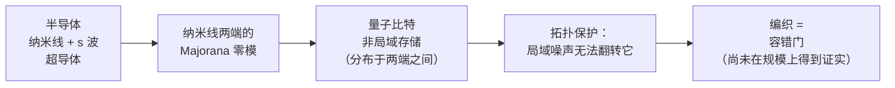

*其前景是硬件层面的错误保护；而现实（截至 2025 年）是，
明确的、可控的 Majorana 量子比特仍未得到证实——高风险、高回报。*

#### 9. 概念：信息的非局域存储

**拓扑量子计算（topological quantum computing）**旨在通过将信息**非局域地**编码于任何局域扰动都无法触及的全局拓扑性质中，使量子比特*本质上*免受局域噪声的影响。其理论基础是 **Majorana 零模（MZM）**——一种奇异的准粒子激发，预测出现在**拓扑超导纳米线**的两端（具有强自旋–轨道耦合的半导体纳米线，与超导体发生近邻耦合，并处于磁场中）。一对 MZM 编码一个量子比特，但信息是*非局域地*存储于两个空间上分离的 Majorana 之间——因此局域错误（作用于某一端的噪声）无法破坏逻辑信息，因为逻辑信息存在于*联合*态中。这种非局域编码将提供**硬件层面的错误保护**，有可能比其他路线需要少得多的纠错开销。

#### 10. 非阿贝尔编织

MZM 被预测为**非阿贝尔任意子（non-Abelian anyons）**：交换（编织）其中两个会执行一个量子门，该门仅取决于编织的*拓扑*（哪个 Majorana 绕过了哪个），而与路径的细节无关。由于门仅取决于拓扑，它对编织操作中的微小误差具有*本质上的鲁棒性*——一种拓扑保护的门。编织可原生且稳健地提供部分（Clifford）门；要实现通用性，则需要用一个非拓扑的"魔术"操作（类似于其他地方的 T 门）来补充编织。非局域保护的量子比特与拓扑保护的门相结合，正是梦想所在：一个*从构造上*就具备抗错能力的量子比特，减少或消除困扰其他路线的巨大纠错开销（文件 9）。

#### 11. Microsoft 的项目与 2018 年的挫折

**Microsoft** 十多年来一直将拓扑量子比特作为其主要的硬件押注，被其降低开销的潜力所吸引。这条道路坎坷不平：

- **2018 年的撤稿：**2018 年一篇著名的 Nature 论文（Delft/Microsoft）声称观察到了 Majorana 特征（量子化的零偏压电导峰），**于 2021 年被撤回**，因为所宣称的特征被发现不可重复/是数据选择造成的假象——这是一次重大的警示事件，损害了该领域的公信力，并凸显了*明确*确认 Majorana 零模有多么困难（许多非拓扑效应可以模拟这些特征）。
- **2023 年的"拓扑能隙协议"：**Microsoft 报告了改进的测量协议，并声称已在其器件中确立了拓扑相的存在，继续推进这一研究。2024–2025 年，Microsoft 宣布了进一步的器件里程碑（一枚"拓扑量子比特"芯片，"Majorana 1"），不过其背后的物理主张在部分学界仍存在激烈争论。

#### 12. 对拓扑量子比特的坦率评估

坦率而不带轻视的评估是：**拓扑量子比特仍然是主流路线中实验上最不成熟的一种。**其基础物理特征（明确的、可控的 Majorana 零模，并演示了非阿贝尔编织）仍在激烈争论之中——其成熟度与超导或囚禁离子量子比特截然不同，后者能够例行地运行完整算法和纠错。然而*理论动机*依然成立：如果拓扑保护得以实现，就可能产生一个在性质上更具抗错能力的量子比特，大幅降低纠错开销。因此拓扑量子比特是一项**高风险、高回报、长周期**的押注：可能带来变革，但基础物理尚未定论，且其过往记录（2018 年的撤稿）要求对相关主张持怀疑态度。Microsoft 同时通过 Azure Quantum 与其他路线合作的并行策略（文件 19、20），是对冲其拓扑项目风险的合理做法。

---

### 第三部分 — 玻色量子比特与猫态量子比特


**猫态量子比特——通过编码于相干态叠加中实现偏置噪声：**

```text
   逻辑态 = 相干态"猫"：
      |0_L> ~ |+α> + |-α>        （偶猫态）
      |1_L> ~ |+α> - |-α>        （奇猫态）

   比特翻转 (|0_L>↔|1_L>)  ：随 |α|^2 指数抑制  ✓
   相位翻转                ：线性增加 -> 用一维重复码处理

   结果：高度偏置的噪声通道 -> 纠错成本大幅降低
   （Alice & Bob、AWS Ocelot 追求这一路线）。
```

#### 13. 概念：编码于振子态

**玻色量子比特（bosonic qubits）**不是将信息编码于二能级系统，而是编码于**谐振子**（微波腔模，或机械模、光学模）的态中——这是一个具有无穷多能级的系统。其关键优势在于：单个振子拥有很大的希尔伯特空间，可用于对量子比特进行*冗余*编码，从而实现**硬件高效的纠错**（在单个物理振子内部纠正错误，而无需将一个量子比特分散到许多二能级系统中）。玻色码包括**猫码**、**二项式码**和 **GKP 码**（后者与连续变量光子学重叠，文件 6）。Yale（Devoret、Schoelkopf、Girvin 团队）开创了玻色量子纠错，实现了一个里程碑：一个玻色逻辑量子比特的寿命*超过*了其最佳物理组件的寿命（纠错的"盈亏平衡"点）。

#### 14. 猫态量子比特与偏置噪声

**猫态量子比特（cat qubit）**将逻辑态编码于**相干态的叠加**中——|α⟩ 与 |−α⟩（相位相反的相干态），即"薛定谔猫"态。其决定性特征是**偏置噪声**：通过设计振子的动力学（例如通过双光子驱动与耗散，使猫态流形稳定），可以使主要错误成为**相位翻转**，而**比特翻转则随猫的尺寸 |α|² 增大而指数抑制**（比特翻转要求态穿越 |α⟩ 与 |−α⟩ 之间很大的相空间距离，这在指数意义上变得极不可能）。这种**噪声偏置**是战略优势所在：如果比特翻转在硬件层面已指数稀少，纠错只需处理*相位翻转*——*单一*的错误类型——从而允许使用简单得多、开销更低的外层码（针对相位翻转的一维**重复码**），而不是完整的二维表面码。由于另一类错误已被硬件抑制，因而将纠错资源集中于一种错误类型，是其效率论证的核心。

#### 15. 猫态量子比特公司与架构

- **AWS（Amazon）：**一种将**猫态量子比特**（用于偏置噪声下的比特翻转抑制）与 **transmon 辅助比特**以及用于剩余相位翻转错误的外层**重复码**相结合的架构——一种"级联"方案，将硬件层面的偏置工程与码层面的纠错统一起来（文件 9）。AWS 的猫态量子比特研究以相对标准表面码大幅降低开销为目标。
- **Alice & Bob（法国）：**一家*完全*围绕猫态量子比特押注而建立的公司——专用的猫态量子比特（"Boson"）硬件，以极长的比特翻转时间（数秒至数分钟）为目标，从而只需相位翻转纠错（一维重复码），旨在使通往容错的物理量子比特开销相比表面码方案大幅降低（文件 9、18、20）。这是一家公司将自身定位押注于偏置噪声纠错这一特定架构的显著例子。
- **Yale** 及其他学术团体继续进行玻色量子纠错的基础研究（腔中 GKP、二项式码、误差透明门）。

玻色/猫态量子比特体现了一个普遍主题（与中性原子的擦除转换（文件 5）和光子的以损耗作为擦除（文件 6）相呼应）：**使纠错码与硬件特定的、经过设计的错误结构相匹配**，可以大幅削减开销——这是降低容错所需惊人资源需求的最重要杠杆之一（文件 18）。

---

### 第四部分 — 跨路线综合对比

#### 16. 总对比表

该表是整个硬件格局（文件 3–7）的战略地图。"最佳"值指领先的演示结果，而非典型值；引用最新声明时请重新核实（文件 22）。所有数字均为数量级/定性的概括。

| 属性 | 超导 | 囚禁离子 | 中性原子 | 光子 | 硅自旋 | 拓扑 | 玻色/猫态 |
|---|---|---|---|---|---|---|---|
| 量子比特编码 | 非谐 LC（transmon） | 离子内部态 | 原子内部态 | 光子 DV/CV | 电子/核自旋 | Majorana 零模 | 振子（猫）态 |
| 能量尺度/频率 | 4–6 GHz | 微波/光学 | 微波/光学 | 光学 | GHz（塞曼） | — | 微波（腔） |
| T₁/T₂ | 50–300 μs | 秒–分钟 | 秒（核自旋：数十秒） | 受损耗限制 | ms（T₂，²⁸Si） | （理论上受保护） | 受腔寿命限制 |
| 单比特门保真度（最佳） | >99.9% | >99.99% | >99.9% | 确定性 | >99.9% | （拓扑） | 高 |
| 双比特门保真度（最佳） | 99.5–99.9% | >99.9% | >99.5% | 概率性 | >99% | （编织） | 提升中 |
| 门速度 | ns–数百 ns | μs–ms | 100 ns–1 μs | （基于测量） | ns | （编织） | μs |
| 原生连接性 | 固定最近邻 | 全连接（模块内） | 可重构 | （MBQC 簇态） | 最近邻 | （编织拓扑） | （取决于腔） |
| 工作温度 | ~10 mK | 室温（芯片 ~4–10 K） | 室温真空 | 室温（探测器 ~1–4 K） | <100 mK–1 K | ~10 mK | ~10 mK |
| 主要错误机制 | TLS 损耗、泄漏、串扰 | 自发辐射、加热 | Rydberg 衰变、原子丢失 | 光子损耗 | 电荷噪声、²⁹Si | （Majorana 的确认） | 相位翻转（偏置） |
| 主要扩展挑战 | 布线、低温 | 激光、穿梭、联网 | 激光、原子丢失、光学 | 损耗、复用、制造 | 均一性、布线 | 确认物理本身 | 腔/辅助比特控制 |
| 制造杠杆 | 光刻（超导薄膜） | 原子级（无制造差异） | 原子级（无制造差异） | 硅光子学（代工厂） | CMOS（最强） | 半导体-超导体混合 | 超导腔 |
| 成熟度 | 非常高（低于阈值的 QEC） | 非常高（创纪录保真度，QEC） | 高（48 个逻辑量子比特） | 中（优势演示） | 中（高于阈值的双比特） | 低（物理存在争议） | 中（盈亏平衡 QEC） |
| 领先参与者 | IBM, Google, Rigetti, IQM | IonQ, Quantinuum, AQT | QuEra, Pasqal, Atom Computing | PsiQuantum, Xanadu, Quandela | Intel, Diraq, UNSW, Delft | Microsoft | AWS, Alice&Bob, Yale |

#### 17. 从战略角度解读该表

没有任何一种路线在所有维度上占优。战略上的启示是：

- **保真度/连接性领先者：**囚禁离子（中性原子紧随其后）——有利于*受质量限制*的早期容错（更少但更好的量子比特；文件 4、18）。
- **速度/制造领先者：**超导——有利于*吞吐量*，并可利用最深厚的工程/投资基础；首个低于阈值的 QEC（文件 3、9）。
- **规模/可重构性领先者：**中性原子——有利于*多逻辑量子比特*演示和灵活的码；阵列规模最大（文件 5）。
- **制造押注：**光子（代工厂光子学）和硅自旋（CMOS）——押注工业制造杠杆胜过单个量子比特的物理进展，代价是目前尚不成熟（文件 6、7）。
- **降低开销押注：**玻色/猫态（偏置噪声）和拓扑（硬件保护）——押注通过设计*错误结构*（或在硬件层面消除错误）来削减容错的沉重开销（文件 9、18），其中猫态量子比特远比拓扑量子比特成熟。
- **原生适于联网：**光子——与量子网络具有独特的双重用途（文件 15）。

该领域的健康之处在于，*多种*路线从这些不同的起点出发均已进入纠错时代（超导的低于阈值、中性原子的 48 个逻辑量子比特、囚禁离子的逻辑演示），因此跨路线比较——而非任何单一路线图——才是根本的视角。哪种性质组合对*有用的*容错起决定作用，是文件 9（纠错）、18（资源估计）和 19–20（路线图/竞争）所探讨的核心开放问题，而且很可能因应用而异：受质量限制的问题有利于离子/原子，受吞吐量限制的问题有利于超导，而开销降低（猫态量子比特、擦除转换、qLDPC 码）可能彻底重排排名。

*交叉引用：各路线的详细内容（文件 3、4、5、6）；这些编码所实现的形式体系（文件 2）；猫态/GKP/偏置噪声纠错与 qLDPC 码（文件 9）；量化各路线所面临开销的资源估计（文件 18）；与自旋/超导/玻色相关的低温与低温 CMOS（文件 11）；材料与制造，特别是同位素纯化和半导体-超导体混合结构（文件 23）；路线图与竞争格局（文件 19、20）；光子的联网协同（文件 15）。*

---

### 第五部分 — 补充深入内容、NV 色心与算例

#### 18. 自旋量子比特的类型

"自旋量子比特"这一称谓涵盖几种不同的编码，值得加以区分：

- **Loss–DiVincenzo（单自旋）量子比特：**每个点一个电子自旋，量子比特为 |↑⟩/|↓⟩（Intel/Delft 的主流方案，第 1–6 节）。
- **单重态–三重态量子比特：**双量子点中的两个电子，量子比特编码于单重态 |S⟩ 和三重态 |T₀⟩ 两电子自旋态——完全通过电学控制（交换 + 磁场梯度），避免使用微波磁场；是一种稳健的变体。
- **纯交换/三量子点量子比特：**三个电子分布于三个量子点，仅凭交换作用即可实现全电学的通用控制（无需 ESR），代价是每个量子比特需要更多的量子点。
- **空穴自旋量子比特：**使用空穴（电子的缺失）而非电子；空穴具有强自旋–轨道耦合，无需微磁体即可实现快速全电学控制，并且（在某些材料中）超精细耦合减弱——是一种日益流行的变体（Delft 及其他）。
- **施主（Kane）量子比特：**硅中磷的核/电子自旋（第 7 节）。

这些变体在控制复杂度、相干性和制造难度上各有取舍；该领域尚未完全收敛，不过单自旋和空穴自旋量子比特目前在规模扩展方面最为突出。

#### 19. 作为一种路线的 NV 色心（及通向传感的桥梁）

金刚石中的**氮–空位（NV）色心**——一个氮原子与金刚石晶格中的一个空位相邻——拥有一个可光学寻址且**在室温下**保持相干的电子自旋，这是一种罕见的性质。NV 色心已被探索作为一种量子比特路线（附近的核自旋用作长寿命的存储量子比特，并具有用于光子联网的光学接口），Delft 的 NV 色心工作产生了量子网络和无漏洞贝尔检验方面的奠基性成果（文件 15）。然而，NV 色心已被证明难以作为*计算*平台进行扩展（可重复地放置并耦合许多 NV 色心很困难），因此它们更多用于**量子传感**（室温磁力测量，文件 16）和作为**量子中继器存储节点**（文件 15），而非计算。因此，NV 色心处于计算、联网和传感的交汇处——提醒我们，路线格局与更广泛的量子技术生态系统相互融合（文件 15、16）。

#### 20. 算例：猫态量子比特的开销降低

猫态量子比特的价值主张（第 14 节）是可以量化的。一个同时纠正比特翻转和相位翻转、距离为 d 的标准**表面码**，每个逻辑量子比特使用约 2d²−1 个物理量子比特——例如，为获得低逻辑错误率，d≈23 时约需 1000 个物理量子比特。而比特翻转已被硬件抑制的**猫态量子比特**只需一个针对剩余相位翻转的**一维重复码**，使用约 d 个物理猫态量子比特（随 d 线性而非平方增长）——例如，获得相当的保护只需约数十个猫态量子比特。即便考虑到每个猫态量子比特还需要一个振子加上辅助/控制开销，*标度*上的改进（随距离线性对比平方）仍然是显著的。这就是 AWS 和 Alice & Bob 追求猫态量子比特的原因：如果比特翻转抑制得以保持（在可用的猫尺寸下比特翻转时间达到数秒至数分钟），通往容错的物理量子比特开销相比表面码可能下降一个数量级或更多（文件 9、18）。风险在于偏置噪声假设能否在真实的门操作中保持（门操作可能重新引入比特翻转），这是该方案的核心技术问题——资源估计（文件 18）必须坦率地对待这一警示。

#### 21. 算例：自旋量子比特的密度论证

自旋量子比特的可制造性论证同样可以量化。硅量子点约为 50–100 nm；按此间距，1 cm² 的芯片原则上可容纳约 10⁸–10⁹ 个量子点——远多于任何其他路线每块芯片的量子比特数，并可与现代 CMOS 中的晶体管密度相比。即便考虑控制栅极的开销以及量子比特之间需要留出空间，*如果*通过交叉开关寻址和低温 CMOS 协同集成解决了布线/控制问题（第 6 节），每块芯片 10⁶ 个以上量子比特的密度也是可以想象的。这一密度论证——利用半导体产业已证明的制造和布线数十亿纳米级器件的能力——是自旋量子比特长期论点的核心。这种潜力与当前现实（个位数到几十个量子比特）之间的差距，完全在于*均一性、良率和控制集成*——这是业界已为晶体管反复解决、但尚未为量子比特解决的经典半导体扩展问题（量子比特对变异的容忍度要严格得多）。量子比特制造能否沿着类似摩尔定律的轨迹发展，是一个跨越数十年的问题（文件 19、23、25）。

#### 22. 术语表与总结

**术语表：**
- **量子点（Quantum dot）：**栅极定义的纳米尺度电子陷阱（人造原子），容纳一个自旋量子比特。
- **交换相互作用（J）：**用于自旋两量子比特门的可调自旋–自旋耦合（对电压呈指数敏感）。
- **同位素纯化（²⁸Si）：**去除携带核自旋的 ²⁹Si 以延长自旋相干时间——关键的材料进展。
- **Majorana 零模（MZM）：**奇异的准粒子，其非局域、非阿贝尔特性是拓扑量子比特的基础。
- **编织（Braiding）：**交换非阿贝尔任意子以执行拓扑保护的门。
- **猫态量子比特（Cat qubit）：**编码于相干态叠加 |α⟩ ± |−α⟩ 的玻色量子比特，具有硬件抑制的（偏置）比特翻转噪声。
- **偏置噪声（Biased noise）：**一种错误结构，其中一种错误类型（比特翻转）比另一种（相位翻转）指数级稀少，从而允许使用更简单的外层码。
- **玻色码（猫/二项式/GKP）：**将量子比特编码于振子的多能级希尔伯特空间中，以实现硬件高效的纠错。
- **NV 色心：**一种室温下保持相干的金刚石自旋量子比特，更多用于传感/联网而非计算。

**总结。**除三大路线和光子学之外，另有三种路线各自体现了一项不同的战略押注：**硅自旋量子比特**押注于 CMOS 可制造性和密度（现已具备高于阈值的保真度和长的 ²⁸Si 相干时间，但目前规模较小）；**拓扑量子比特**押注于通过 Majorana 非局域性实现硬件层面的错误保护（可能带来变革，但在 2018 年撤稿之后基础物理仍存在争议——是该领域风险最高的路线）；**玻色/猫态量子比特**押注于通过设计偏置噪声来削减纠错开销（已足够成熟，实现了盈亏平衡 QEC，由 AWS 和 Alice & Bob 推进）。它们与文件 3–6 一起，完整勾勒出硬件格局，其综合对比表（第 16 节）是数据库其余部分——纠错（文件 9）、资源估计（文件 18）以及路线图/竞争（文件 19–20）——所依托的战略地图。反复出现的元教训是：使纠错码与每种路线*特定的、经过设计的错误结构*（偏置噪声、擦除转换、损耗预告）相匹配，是实现容错最强有力的杠杆之一，这也是为什么看似狭窄的量子比特编码选择，会一路层层传导至定义通往实用之路的物理量子比特数量和时间表。

#### 23. 文件 7 的读者要点

这三种路线将战略地图扩展到领先平台之外，并强化了该领域的核心洞见：量子比特的选择与纠错策略的选择密不可分。硅自旋量子比特押注于 CMOS 制造杠杆（密度、良率、低温 CMOS 协同集成）最终将超越单个量子比特的物理进展——这一押注现已有高于阈值的保真度和 ms 量级的 ²⁸Si 相干时间作后盾，但尚无规模作后盾。拓扑量子比特押注于 Majorana 非局域性提供可大幅削减纠错开销的硬件层面保护——理论上令人信服，但实验上尚未解决，并背负着 2018 年撤稿的警示教训：非拓扑效应多么容易模拟所追寻的特征。玻色/猫态量子比特押注于经过设计的偏置噪声可将外层码从二维表面码降为一维重复码——这一想法已足够成熟，达到了盈亏平衡 QEC，并由 Alice & Bob 作为公司定义性战略、由 AWS 作为一种架构加以推进。当你在论文或路线图中遇到其中任何一种时，请追问：这种编码产生何种错误结构，与之匹配的是什么码，这对物理量子比特开销（文件 18）意味着什么？这个问题——错误结构 → 匹配的码 → 开销 → 时间表——是将量子比特选择与通往实用之路联系起来的主线，并贯穿文件 3–7 中的每一种路线，直至文件 9 和 18 的纠错与资源估计分析。

---

<a id="f08"></a>

## 文件 08：量子电路、门分解与硬件感知编译

> 📄 **原文链接（English original）：[08_quantum_gates_circuits_and_compilation.md](08_quantum_gates_circuits_and_compilation.md)**　｜　[↑ 返回目录](#toc)


> 本文件介绍抽象的量子算法如何变成真实硬件上的物理操作：门集分解、电路到硬件的映射与路由问题、门调度、脉冲级控制与校准、电路优化、噪声感知编译，以及经典控制架构。编译（在 Qiskit 术语中称为"transpilation"，即转译）是算法的清晰抽象（文件 2、13）与硬件的混乱现实（文件 3–7、11）相互碰撞之处。本文件是对文件 12（实现这些步骤的软件栈）和文件 9（容错编译）的补充。

---

### 第一部分 — 门集分解与编译问题


**编译流水线：从抽象算法到硬件脉冲：**

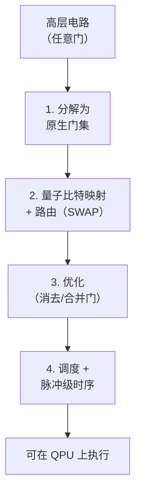

#### 1. 为什么需要编译

算法是用*抽象*门来表达的（任意单量子比特旋转、CNOT、多控制门、任意酉算符）。真实硬件只支持一个很小的**原生门集**——若干经过校准的单量子比特旋转，加上*一种*纠缠门，而这种纠缠门因物理体系而异（文件 2，第 7 节）：CZ/跨共振（超导，文件 3）、Mølmer–Sørensen（囚禁离子，文件 4）、里德堡 CZ（中性原子，文件 5）。编译器必须把每个抽象操作**分解**为原生门集，把逻辑量子比特**映射**到物理量子比特，在有限连通图上**路由**相互作用，为并行性**调度**门，并**优化**结果——同时还要遵循硬件的噪声结构。在 Qiskit（IBM 的术语）中这被称为**转译（transpilation）**，它是连接算法与硬件的核心系统问题。

#### 2. 通用分解

根据通用性结果（文件 2，第 8 节），任何酉算符都可以分解为单量子比特旋转和 CNOT——但一般需要*指数*数量的门。实用的编译会利用结构：

- **单量子比特合成：** 任意单量子比特酉算符 → Z–Y–Z 欧拉旋转（文件 2，第 6 节）；在具有虚拟 Z 门（免费的坐标系变换）的硬件上，只有 Y 旋转需要消耗脉冲时间。
- **双量子比特合成：** 任意双量子比特酉算符 → 最多 3 个 CNOT（或 3 个原生纠缠门）加上单量子比特门，通过 **KAK/Cartan 分解**（文件 2，第 7 节）实现——这是最优分解，先计算三个"相互作用"参数，再用最少的纠缠门实现它们。
- **容错合成：** 对于 Clifford+T 硬件（文件 9），任意旋转 → Clifford+T 序列，使用 **Solovay–Kitaev** 或最优数论合成（Ross–Selinger），以最小化 **T 数**（T-count，容错成本的主要驱动因素，文件 18）。

#### 3. 虚拟 Z 门：免费的旋转

超导体系中的一项关键硬件优化（文件 3）：R_z(λ) 旋转可以不通过物理脉冲实现，而是通过*移动该量子比特上所有后续脉冲的相位参考*来实现——即"虚拟 Z"门，其耗时为**零**、误差为**零**。由于任何单量子比特酉算符都是 Z–Y–Z 形式，而 Z 旋转是免费的，所以只有 Y 旋转（每个任意单量子比特门两个，且通常可化简为 X±90° 脉冲）消耗真实资源。编译器会积极地把 Z 旋转推入虚拟门，从而大幅减少物理脉冲数量——这是一项标准且影响很大的优化，利用的是文件 2 第 23 节中的旋转坐标系物理。

---

### 第二部分 — 电路到硬件的映射问题


**路由：在连通性受限时插入 SWAP：**

```text
   Circuit wants CNOT(q0,q3)         Hardware connectivity (line):
                                        q0 - q1 - q2 - q3
   q0 and q3 are NOT adjacent  ->  insert SWAPs to move them together:

     SWAP(q0,q1) ; SWAP(q1,q2) ; CNOT(q2,q3) ; (undo)
     Each SWAP = 3 CNOTs -> routing overhead can DOMINATE circuit depth
     on sparse hardware. This is why connectivity is a headline metric.
```

#### 4. 连通图与路由问题

硬件连通性——即哪些物理量子比特对允许原生双量子比特门——因物理体系而差异巨大（文件 7 的表格）：

- **超导：** 稀疏、固定、最近邻（度 ≤ 4；重六边形（heavy-hex）度 ≤ 3，文件 3）。
- **囚禁离子：** 模块内全连通（文件 4）——*模块内无需路由*。
- **中性原子：** 可重构（通过移动原子使其相邻，文件 5）——通过物理输运实现路由。

当算法需要在映射到*不相邻*物理量子比特的逻辑量子比特之间执行双量子比特门时，编译器必须进行**路由**——插入 **SWAP 门**，沿连通图移动逻辑量子比特的状态直到它们相邻，执行该门，然后（可选地）再换回来。每个 SWAP 相当于 3 个 CNOT，因此路由会显著增加门数量和深度。**SWAP 路由问题**——即寻找使新增门数/深度最小的 SWAP 插入方案——一般是 **NP 难**的，在生产级编译器中用启发式方法求解。

#### 5. SABRE 与路由启发式算法

标准的生产级路由启发式算法是 **SABRE（SWAP-based Bidirectional heuristic search，Li–Ding–Xie 2019，arXiv:1809.02573）**：它使用一个能前瞻后续门的代价函数来搜索 SWAP 插入方案（偏好那些不仅有利于当前门、也有利于未来门的 SWAP），并*双向*运行（正向和反向遍历），从而同时优化*初始*量子比特放置。SABRE（及其变体/改进版本）是 Qiskit 和许多其他软件栈中的默认路由器。其他方法包括：搜索更深的**前瞻（lookahead）**路由，以及通过 SAT 求解器或约束规划建模的**精确**路由（最优，但呈指数级扩展，仅用于小电路或用来评测启发式路由器）。对于全连通的囚禁离子，路由是平凡的（一项主要的编译优势，文件 4、22）；对于可重构中性原子，"路由"变成了带有自身优化问题的原子移动调度问题。

#### 6. 初始量子比特放置

在路由之前，编译器必须选择逻辑量子比特到物理量子比特的**初始映射**——这一选择会强烈影响总的路由开销。好的放置会把频繁相互作用的逻辑量子比特放在连通良好、保真度高的物理量子比特上。启发式方法利用电路的相互作用图以及器件的连通性和校准数据；SABRE 的反向遍历会改进初始放置。糟糕的放置可能使 SWAP 开销成倍增加，因此放置与路由紧密耦合，并被联合优化。

---

### 第三部分 — 调度、脉冲与校准

#### 7. 门调度与并行性

在分解和路由之后，编译器把门**调度**到各个时间层，找出可以*同时*执行的对易/独立门（在互不相交的量子比特上并行），以最小化电路**深度**（文件 2，第 32 节）——深度决定了实际运行时间和退相干暴露程度。调度需遵守硬件约束：共享的控制资源（一个微波源驱动多个量子比特）、同时驱动的邻近量子比特之间的串扰（文件 2，第 13 节），以及各物理体系的并行度限制（中性原子的全局门可大规模并行，文件 5；超导的并行度受串扰限制）。调度器还会在空闲量子比特上插入**动力学解耦**序列（文件 2，第 26 节；文件 10），以抑制等待期间的退相位。

#### 8. 脉冲级控制与门校准

在逻辑门抽象之下，每个门都是一个**经过校准的模拟控制脉冲**——一个成形的微波包络（超导，文件 3），或一个激光脉冲序列（囚禁离子/中性原子，文件 4、5）。脉冲成形技术包括：

- **高斯与 DRAG 包络**（文件 3）：DRAG 抑制向非计算态的泄漏。
- **GRAPE（Gradient Ascent Pulse Engineering，梯度上升脉冲工程）：** 在给定系统模型的情况下，对脉冲形状进行数值最优控制优化，以最大化门保真度或最小化持续时间。
- **校准：** 每个门的脉冲参数（振幅、相位、持续时间、DRAG 系数）由自动化例程调节（文件 3，第 32 节），并且会**随时间漂移**（TLS 谱扩散、磁通漂移、温度），因此需要定期重新校准——这是一个重要的运行现实，它使器件性能随时间变化，并使基准测试复杂化（文件 22）。

#### 9. 最优控制与脉冲级编译

除了分解为固定的已校准门之外，**脉冲级编译**直接为*目标多量子比特酉算符*合成最优的模拟脉冲——绕过门抽象，从而获得比逐门分解更高的保真度或更短的持续时间。**Qiskit Pulse** 等工具提供了脉冲级控制，研究系统则执行直接的脉冲级程序合成（例如，通过类 GRAPE 的优化把整个子电路编译成一个优化脉冲）。这种方法功能强大，但需要精确的硬件模型和逐器件校准，并且破坏了清晰的门抽象——这是性能与可移植性之间的权衡（文件 12）。

---

### 第四部分 — 优化与噪声感知

#### 10. 电路优化 pass

编译器应用**优化 pass**（优化遍）来减少门数量和深度：

- **门消去：** 连续的互逆门（例如相邻的两个 Hadamard，或 X·X）相互抵消。
- **基于对易的重排序：** 对易的门被重新排序，以暴露更多消去机会或更好的调度。
- **模板匹配 / 窥孔优化：** 识别子电路模式并将其替换为更廉价的等价形式。
- **ZX 演算化简：** 用 **ZX 演算**（一种针对量子电路的图形化重写系统）表示电路，应用图重写规则进行化简，再重新提取出电路——**PyZX** 和 Quantinuum 的 **TKET**（文件 12）使用了这种方法，对减少 T 数和双量子比特门数尤其有效。
- **近似合成：** 以较小且有界的保真度损失换取更短的电路（例如近似 QFT，文件 2；近似旋转合成）——在含噪硬件上通常是值得的，因为更短电路带来的退相干减少超过了近似误差。

#### 11. 噪声感知编译

由于真实器件具有*异质*噪声（某些量子比特/门远好于其他，并且还会漂移），生产级编译器是**噪声感知**的：路由和放置决策会查询逐量子比特/逐门的**校准数据**（T₁/T₂、门保真度、读出误差，定期更新），以偏好更高保真度的量子比特和连接，并避开较差的部分。这种"泄漏的抽象"——把物理噪声向上暴露到编译栈中而不是将其隐藏——是量子编译区别于经典编译的一个决定性特征（文件 12），因为经典编译中硬件细节被干净地抽象掉了。噪声感知编译通过把计算导向器件最好的资源，可以大幅提高真实电路的保真度。

#### 12. 随机化编译与误差结构塑形

编译器还可以*塑造误差结构*，使其更为温和（文件 2，第 34 节；文件 10）：**随机化编译 / Pauli 扭曲（Pauli twirling）**在每个双量子比特门周围插入随机 Pauli 门（在理想情形下会被编译消去），把*相干*误差转化为*随机* Pauli 误差——用温和的线性累积取代最坏情况下的二次误差累积，且不损失保真度，通常还能改善深电路的表现。这是一种编译层面的误差缓解技术，在 NISQ 工作流中日益成为标准做法（文件 10）。

---

### 第五部分 — 经典控制架构与交叉引用

#### 13. 经典控制栈

在脉冲级编译之下是**经典控制系统**（详见文件 11）：基于 FPGA 的实时控制器通过**任意波形发生器（AWG）**生成模拟波形，并处理读出信号。控制栈从高层电路描述一直延伸到物理电压/激光波形。对于**中途测量与自适应电路**（前馈、纠错），控制系统必须提供**低延迟反馈**——测量、经典处理（解码），并据此有条件地行动，这一切都要在相干预算内完成（亚微秒到微秒；文件 11）。这一实时约束塑造了自适应电路的编译：编译器必须遵守反馈延迟，并把经典处理与量子操作一起调度。快速解码器的 FPGA 实现（Union-Find、用于纠错的 MWPM 变体，文件 9）是一个活跃的硬件–软件协同设计领域（文件 11）。

#### 14. 端到端的编译流水线

典型的流水线：**算法** → **电路**（抽象门）→ **优化**（消去、ZX 化简）→ **初始放置**（逻辑→物理映射）→ **路由**（SWAP 插入，噪声感知）→ **原生门分解**（到 CZ/MS/里德堡 + 旋转）→ **调度**（并行性、DD 插入）→ **脉冲级编译/校准**（到模拟波形）→ **经典控制**（AWG 波形、读出）。每一阶段都向上暴露物理噪声/连通性约束（即"泄漏"的栈），而且每一阶段本身就是一门研究与工程学科。对于**容错**编译（文件 9），流水线会增加额外的层：逻辑门合成（以最小 T 数实现 Clifford+T）、魔态注入调度，以及晶格手术路由——其中合成得到的 T 数直接决定魔态工厂的成本，从而决定机器的资源需求（文件 18）。

#### 15. 总结

编译是量子计算的抽象与硬件现实相遇之处。门集分解（通用分解、双量子比特 KAK、容错 Clifford+T）、NP 难的电路到硬件映射与 SWAP 路由问题（SABRE 与启发式算法，对全连通离子而言是平凡的，对中性原子则基于物理输运）、面向并行性的门调度、脉冲级控制与漂移的校准、电路优化（消去、ZX 演算、近似合成）、噪声感知编译（决定性的"泄漏抽象"，向上暴露物理噪声），以及误差结构塑形（随机化编译），共同把算法转化为物理操作。由此带来的开销——尤其是稀疏连通性上的 SWAP 路由——是 NISQ 时代的一项核心性能税（有利于高连通性的物理体系，文件 4、5、22），也是判断某个算法能否在真实硬件上胜过经典方法的关键输入（文件 14、17）。实现这一流水线的软件工具是文件 12 的主题；容错方面的扩展则服务于文件 9 和 18。

*交叉引用：门、通用性、KAK 分解、虚拟 Z 以及相干/随机误差的区别（文件 2）；各物理体系的原生门与校准（文件 3、4、5）；实现编译的软件栈——Qiskit 转译器、TKET 等（文件 12）；容错编译、T 数、魔态、晶格手术（文件 9）；作为缓解手段的随机化编译与动力学解耦（文件 10）；经典控制电子学与实时反馈（文件 11）；由 T 数驱动的资源估算（文件 18）；连通性对基准测试的影响（文件 22）。*

---

### 第六部分 — 实例演算、深入技术与术语表

#### 16. 实例演算：SWAP 路由开销

考虑一个 5 量子比特的 QFT（文件 2，第 20 节），它需要在*每一对*量子比特之间执行受控相位门——一种全连通的相互作用模式。在**线性**连通性下（每个量子比特仅与其邻居相邻，度 ≤ 2），不相邻的受控相位门需要 SWAP 路由。把全对全的相互作用模式路由到一条线上，需要 O(n) 层 SWAP，因此 5 量子比特 QFT 约 10 个双量子比特相互作用在插入 SWAP（每个 3 个 CNOT）之后会膨胀数倍——双量子比特门数和深度可能变为原来的三到四倍。在**囚禁离子**全连通器件（文件 4）上，*同样的* QFT 编译时*零*路由开销——每个受控相位门都可直接执行。这就是囚禁离子具有高量子体积（文件 22）背后的具体机制，也是连通性成为一等架构属性的原因：对于相互作用密集的算法（Shor 算法中的 QFT、全连通的化学拟设），稀疏连通性可使有效门数成整数倍增加，削弱 NISQ 优势（文件 17），并使容错运行时间膨胀（文件 18）。编译器通过良好的放置和前瞻路由来对抗这一问题，但它们无法消除稠密相互作用图与稀疏硬件图之间的拓扑失配。

#### 17. 实例演算：T 数与容错成本

对于容错编译（文件 9），主要的成本指标是 **T 数**——非 Clifford T 门的数量——因为每个 T 门都要消耗一个由昂贵的魔态工厂（文件 9）制备的提纯**魔态**，这通常主导了总的量子比特/时间预算（文件 18）。考虑用 Ross–Selinger 最优合成（文件 2，第 8 节）把任意单量子比特 z 旋转 R_z(θ) 编译到精度 ε：T 数约为 **3·log₂(1/ε) + O(1)**。对于需要数千个这类旋转、精度为 ε ~ 10⁻¹⁰ 的量子化学算法，则*每个旋转*约 100 个 T 门 × 数千个旋转 = 总共约 10⁵–10⁶ 个 T 门——而每个 T 门的魔态在工厂中要消耗数百个物理量子比特和许多周期（文件 18）。这就是为什么容错编译如此执着于 **T 数削减**：在可容忍时用更宽松的 ε 做近似合成、ZX 演算 T 数优化，以及在算法层面重构以减少非 Clifford 操作的数量。T 数减少 2 倍，大致可使魔态工厂占用的资源减半，而魔态工厂往往*主导*机器的物理量子比特数（文件 18）——因此编译时的 T 数优化对硬件需求有着超乎比例的杠杆作用。

#### 18. 再深入一点看 ZX 演算

**ZX 演算**把量子电路表示为由导线连接的"蜘蛛"图（Z 蜘蛛和 X 蜘蛛，对应两种 Pauli 基），并配有一组保持所表示线性映射不变的**重写规则**。它的威力在于：许多用矩阵证明起来很繁琐的电路恒等式，变成了简单的局部图重写，而且该演算对重要片段是*完备的*（量子映射之间任何真实的等式都可由这些规则证明）。在编译中，电路被转换为 ZX 图，经重写化简（融合蜘蛛、消除恒等、减少对应于 T 门的非 Clifford"相位"蜘蛛数量），然后从化简后的图中*提取*出电路。TKET（Quantinuum，文件 12）和 PyZX 使用基于 ZX 的 pass，对 **T 数削减**和双量子比特门削减尤其有效。主要挑战在于*电路提取*——把化简后的 ZX 图转换回高效的门电路并非易事（并且可能重新引入门）——这是一个活跃的研究领域。ZX 演算还支撑着对晶格手术和基于测量的计算的推理（文件 6、9），使其成为贯穿编译、纠错和光子 MBQC 的统一图形语言。

#### 19. 实践中的脉冲校准与漂移管理

已编译的*门*与可工作的*脉冲*之间的差距就是校准（文件 3，第 32 节）。实际上，器件会持续运行后台校准：定期的单量子比特保真度检查（RB）、双量子比特门重新调节、读出判别器重新训练，以及频率/磁通漂移跟踪。编译与此在两方面相互作用：(1) 编译器使用*最新*的校准数据做噪声感知决策（第 11 节），因此依据早晨校准编译的电路到下午可能已经不再最优；(2) 一些工作流会**按批次重新编译或重新校准**以跟踪漂移。对于云端访问的硬件（文件 12），用户通常会收到器件当前的校准快照，编译器会自动使用它。结论是：量子"编译"不是一次性的静态过程（如同经典软件），而是一个*持续依赖数据*的过程，与漂移中的物理器件的实时状态紧密耦合——这是与经典编译的根本性运行差异，也是造成运行间变异性的来源，使基准测试和可复现性变得复杂（文件 22）。

#### 20. 串扰与共享资源下的调度

朴素的调度会最大化并行性，但真实硬件会惩罚某些并行门组合。**同时驱动相邻量子比特**会引起串扰（文件 2，第 13 节）：作用于量子比特 (A,B) 的门可能通过共享的量子比特 B 劣化同时作用于 (B,C) 的门，或者两个邻近的单量子比特门可能通过常开的 ZZ 耦合相互干扰。因此，串扰感知调度会*避免*某些同时执行的门模式，即使要付出更大深度的代价——调度器利用测得的串扰数据来权衡这一折中。共享的控制资源带来进一步的约束：若两个量子比特共享一个微波源或一个 AWG 通道，它们就不能被同时独立驱动。对于中性原子（文件 5），主导的考虑则*恰恰相反*——全局里德堡脉冲使并行性成为*默认*，调度器的工作是把操作分组以利用全局寻址。因此，调度深度依赖于具体物理体系，反映了各平台的并行结构和串扰特征。

#### 21. 面向纠错的编译（文件 9 预览）

容错编译增加了 NISQ 编译中没有的若干层：

- **逻辑门合成：** 把逻辑算法分解为*容错*门集（Clifford 门通过横向实现/晶格手术实现，T 门通过魔态注入实现），并最小化 T 数。
- **魔态调度：** 把提纯后的魔态从工厂路由到应用 T 门的位置，并调度工厂以跟上 T 门的需求——这通常是吞吐量瓶颈。
- **晶格手术路由：** 通过合并/分裂表面码补丁（文件 9）实现逻辑双量子比特门，这需要在二维布局上路由"辅助区域"——这是一个时空调度问题，类似于 NISQ SWAP 路由，但又有所不同。
- **解码器集成：** 确保实时解码器（文件 9、11）跟上伴随式提取的速度，而这会约束逻辑时钟速度。

这套容错编译栈正是 T 数和码参数转化为资源估算（文件 18）中具体物理量子比特数与运行时间数字之处——编译器的选择（T 数、晶格手术布局、工厂数量）直接决定机器的规模与速度。

#### 22. 术语表

- **转译（Transpilation）：** 硬件感知编译（Qiskit 术语）——分解、映射、路由、调度、优化。
- **原生门集（Native gate set）：** 器件支持的物理门（例如 CZ + 旋转）；其他一切都被分解为这些门。
- **KAK/Cartan 分解：** 把任意双量子比特酉算符最优分解为 ≤3 个纠缠门加单量子比特门。
- **虚拟 Z 门（Virtual-Z gate）：** 以免费的相位坐标系移动实现的 R_z（零时间/零误差）。
- **SWAP 路由：** 插入 SWAP 门，使有限连通性硬件上不相邻的量子比特靠在一起。
- **SABRE：** 标准的双向启发式路由器。
- **DRAG / GRAPE：** 脉冲成形（抑制泄漏）/ 最优控制脉冲优化。
- **Qiskit Pulse：** 脉冲级编程接口。
- **ZX 演算（ZX-calculus）：** 用于电路化简和 T 数削减的图形化重写系统（PyZX、TKET）。
- **噪声感知编译（Noise-aware compilation）：** 利用实时校准数据，把路由/放置导向器件最好的量子比特/门。
- **随机化编译 / Pauli 扭曲：** 通过随机化把相干误差转化为随机 Pauli 误差。
- **T 数（T-count）：** 非 Clifford T 门的数量——容错成本的驱动因素（魔态消耗）。
- **晶格手术（Lattice surgery）：** 通过合并/分裂码补丁实现逻辑双量子比特门（容错编译）。

#### 23. 总结与前瞻

编译通过一条泄漏的、噪声感知的、持续重新校准的流水线，把抽象算法转化为物理操作：分解为原生门（KAK、Clifford+T、虚拟 Z）、NP 难的映射与 SWAP 路由（SABRE——对全连通离子是平凡的，对中性原子基于输运，对稀疏超导则代价高昂）、串扰感知调度、带漂移校准的脉冲级控制，以及优化（消去、ZX 演算、近似合成、随机化编译）。路由开销是 NISQ 的核心性能税，有利于高连通性（文件 4、5、22）；而合成产生的 T 数是容错的核心成本，驱动魔态工厂，进而决定机器规模（文件 9、18）。这条流水线中的每一个选择——放置、路由、调度、脉冲成形、T 数优化——都会影响真实计算是否成功，以及它是否胜过经典方法（文件 14、17）。实现这一切的软件框架（Qiskit、Cirq、TKET、PennyLane，以及中间表示 OpenQASM 和 QIR）是文件 12 的主题，而容错方面的扩展则服务于文件 9 和 18 的纠错与资源估算分析。

---

### 第七部分 — 变分与云端工作流的编译

#### 24. 参数化电路的编译

NISQ 的主要执行模式（文件 12、13）是**变分循环**：一个*参数化*电路 U(θ) 被多次执行，参数值 θ 由经典优化器选取。这对编译提出了特殊要求：

- **参数感知转译：** 电路的*结构*（哪些门作用于哪些量子比特）在各次迭代中固定不变；只有旋转*角度*变化。高效的软件栈只编译一次结构（放置、路由、调度），然后在每次迭代中*绑定*新的参数值，而无需重新运行昂贵的路由/放置 pass——这对变分运行所需的数千次执行是一个重大加速。
- **批处理：** 许多参数变体（例如参数平移梯度所需的平移电路，文件 13）被一起编译和提交，以摊薄开销并减少排队往返次数。
- **低单电路延迟：** 由于变分运行需要许多相继的量子执行并与经典优化交替进行，最小化单电路的编译加执行延迟直接决定了整个算法的实际运行时间——在云端硬件上，这往往由排队等待主导（第 25 节）。

如果不能高效地编译参数化电路（例如每次迭代都从头重新路由），就可能使变分运行慢得难以处理，因此这是 NISQ 软件中的一等关注点（文件 12）。

#### 25. 云端执行、排队与"得到结果的时间"现实

大多数量子硬件是通过云访问的（文件 12）：用户提交一个已编译的电路，它*排队*、执行，然后返回结果。编译与工作流设计必须适应以下实际情况：

- **排队延迟占主导。** 对于共享的云端器件，*排队等待*（几分钟到几小时）往往远远超过实际的量子执行时间（毫秒到秒）。研究实验的"得到结果的时间"经常由排队而非计算主导——这是塑造实验设计方式的基本工作流约束（每次提交批量包含许多电路、使用会话/预留访问）。
- **会话与预留访问。** 为了缓解变分循环（需要许多相继提交）的排队问题，提供商提供**会话（session）**（IBM Qiskit Runtime 会话）或**预留/专用**硬件时间窗口，使器件在许多电路执行期间始终分配给同一用户——这对实用的变分算法和生产工作负载至关重要（文件 12、20）。
- **基于原语的执行。** 现代软件栈（Qiskit Runtime 的 Sampler/Estimator 原语，文件 12）把"映射–优化–执行–后处理"循环推到*服务器端*，减少往返次数，并把误差缓解（文件 10）集成到执行中——这是一种编译/运行时协同设计，隐藏了一部分延迟并使接口标准化。

这些运行现实意味着，"把电路编译好"对于良好性能是必要但不充分的；对真实的得到结果的时间而言，*工作流*（批处理、会话、原语的使用）和*排队动态*往往比已编译电路的门数更重要——这是任何使用真实硬件的人都应吸取的实用教训（文件 12、17、22）。

#### 26. 结语

面向真实量子计算的编译，涵盖了从门合成的数学到漂移校准与云端队列的运行现实。静态的图景（分解、路由、调度、优化）只是故事的一半；动态的图景——持续重新校准的器件、参数化电路的变分循环、批量的云端提交，以及由排队主导的得到结果的时间——才真正决定一个算法在实践中是否运行良好。一位既掌握路由/合成理论（第 1–23 节）、又了解变分/云端工作流现实（第 24–25 节）的工程师，能够从真实硬件中榨取出远多于把编译当作黑箱的人所能获得的东西。实现这一切的工具详见文件 12；这条 NISQ 时代流水线所预示的容错编译——带有 T 数、魔态和晶格手术层——服务于文件 9 和 18 的纠错与资源估算分析，在那里编译时的选择变成了硬件需求。

> **文件 8 的读者要点。** 编译质量往往决定了一个电路是能运行还是只返回噪声。评估硬件结果时，请问：SWAP 路由使双量子比特门数膨胀了多少（这是器件连通性与算法相互作用图之间的问题）？电路是否经过噪声感知编译并放到了器件最好的量子比特上？是否应用了随机化编译来驯服相干误差？对于容错方面的主张，T 数是多少，因而魔态成本是多少（文件 18）？以及在运行层面，报告的"时间"是量子执行时间，还是由排队主导的得到结果的时间？这些问题——连通性开销、噪声感知、误差塑形、T 数和工作流延迟——是文件 3–7 中始终强调的硬件分解纪律在编译层的对应物，它们决定了算法的理论前景（文件 13）能否经受住与真实硬件的接触。

#### 一句话总结

编译通过一条泄漏的、噪声感知的、持续重新校准的流水线，把抽象算法转化为物理操作——门分解（KAK、Clifford+T、虚拟 Z）、NP 难的 SWAP 路由（SABRE，在稀疏连通性上代价高昂，但对全连通离子是平凡的）、串扰感知调度、脉冲级控制，以及优化（ZX 演算、随机化编译）——其质量（路由开销、噪声感知、T 数）往往决定了一个算法能否在真实硬件上胜过经典方法（文件 14、17）。

---

<a id="f09"></a>

## 文件 09：量子纠错——编码、阈值与逻辑量子比特工程

> 📄 **原文链接（English original）：[09_quantum_error_correction.md](09_quantum_error_correction.md)**　｜　[↑ 返回目录](#toc)


> **⭐ 核心文件。** 量子纠错（QEC）是*实用*量子计算的理论与工程基础。每一条容错路线图（文件 19）、每一项资源估算（文件 18），以及物理量子比特与逻辑量子比特之间的整体区别（文件 1），都建立在本文所发展的结果之上。本文从第一性原理出发构建 QEC——错误的数字化、稳定子形式体系与阈值定理——然后展开表面码（最主要的实用编码）、其解码器、晶格手术（lattice surgery）与魔态蒸馏，接着介绍替代性编码和下一代编码（色码、qLDPC、玻色/偏置噪声编码），最后讨论具有里程碑意义的逻辑量子比特演示（Google 的低于阈值结果、QuEra 的 48 个逻辑量子比特）与当前现状。本文以文件 2 的形式体系（稳定子、不可克隆、泡利信道、错误数字化）为前提，并与所有硬件文件（3–7）、资源估算（文件 18）以及误差缓解（文件 10，即纠错之外的 NISQ 替代方案）相联系。

---

### 第一部分——量子纠错的基础


**QEC 循环：在不测量（也就不破坏）数据的前提下检测错误：**

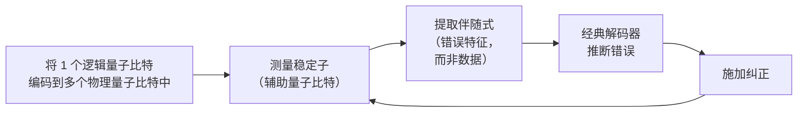

#### 1. 为什么 QEC 比经典纠错更难

经典纠错原则上很容易：要保护一个比特，就复制它（0 → 000，1 → 111），再通过多数表决来纠正单次翻转。这种**重复码**依赖于两件被量子力学禁止或使之复杂化的事情：

- **不可克隆（文件 2，第 15 节）：** 你无法复制一个*任意的未知*量子态，因此不能通过简单复制来保护一个量子比特。对未知的 |ψ⟩，朴素的 |ψ⟩ → |ψ⟩|ψ⟩|ψ⟩ 是不可能的。QEC 必须转而把信息*非局域地*分散到一个纠缠的码字中——这是一种更为精巧的构造，而不可克隆使之成为*必然*。
- **测量坍缩（文件 2，第 9 节）：** 要检测错误就必须测量，但直接测量量子比特的状态会坍缩你正在保护的那个叠加态。QEC 必须提取*关于错误*的信息，而不测量*逻辑信息*——这是核心技巧，由伴随式测量（第 3 节）解决。
- **连续误差：** 经典比特遭受的是离散翻转；量子比特则可能遭受*连续*误差（任意小的旋转，例如对微小 ε 的 e^{iεX}）。看起来似乎需要纠正一个连续统的可能错误。其解决方案——**错误数字化**——是该领域最优美的结果之一（第 2 节）。

#### 2. 错误数字化：关键洞见

考虑一个单量子比特误差，它是任意小的旋转，E = cos(ε)I + i sin(ε) X（一个小的 X 旋转）。展开后，E = αI + βX——即“无错误”与“X 错误”的叠加。更一般地，*任何*单量子比特操作都是四个泡利算符 {I, X, Y, Z} 的线性组合（它们张成所有 2×2 矩阵，文件 2，第 6 节）。神奇之处在于：当 QEC 编码**测量其稳定子**（第 3 节）时，这一测量把连续误差*投影*到离散的泡利基上。叠加态 αI + βX 在伴随式测量时坍缩为*要么*“无错误”（概率 |α|²），*要么*“X 错误”（概率 |β|²）——并且无论哪种情形，所得错误都是编码能够纠正的*离散*泡利算符。因此，**对每个量子比特纠正离散错误集 {I, X, Y, Z} 就足以纠正任意连续误差。** 这种“错误的数字化”把看似无穷多的、纠正所有可能小旋转的问题，化约为纠正泡利错误这一有限问题——这正是使 QEC 可处理的基础。这也是为什么 QEC 理论完全以泡利（稳定子）操作来表述。

#### 3. 稳定子形式体系与伴随式测量

**稳定子形式体系**（Gottesman；文件 2，第 28 节）是 QEC 的统一语言。**稳定子码**由**稳定子群** S 定义——它是泡利群中一个阿贝尔（相互对易）的子群，且*不*包含 −I。**码空间**（逻辑信息所在之处）是所有稳定子生成元的共同 +1 本征空间：一个态 |ψ⟩ 是有效码字，当且仅当对每个稳定子 S ∈ S 都有 S|ψ⟩ = +|ψ⟩。

关键操作是**伴随式测量**：测量每个稳定子*生成元*。由于稳定子与逻辑算符对易（按构造如此），测量它们可以揭示关于*错误*的信息，而不扰动*逻辑信息*：

- 如果没有发生错误，每个稳定子都返回 +1（态位于码空间中）。
- 如果发生了泡利错误 E，它与每个稳定子生成元要么对易、要么反对易。与 E *反对易*的稳定子返回 −1（错误翻转了其本征值）；对易的则返回 +1。这种 ±1 结果的模式就是**错误伴随式（error syndrome）**——一个经典比特串，标识*哪些*稳定子检测到了该错误。

关键在于，伴随式只依赖于*错误*，而不依赖于逻辑态——因此测量它不会坍缩逻辑叠加态。随后**解码器**（第 8 节）根据伴随式推断最可能的错误，并施加纠正。这就解决了不可克隆与测量之间的张力：不要复制量子比特，而是*把它非局域地编码到稳定子码空间中*；不要测量量子比特，而是*测量稳定子*。

#### 4. 码距与 [[n, k, d]] 记号

稳定子码用 **[[n, k, d]]** 描述：

- **n** = 物理量子比特数。
- **k** = 所编码的*逻辑*量子比特数（k = n − 独立稳定子生成元的个数）。
- **d** = **码距** = 任一**逻辑算符**的最小权重（所作用的量子比特数）——等价地，是能产生*不可检测*逻辑错误（与所有稳定子对易、但对逻辑信息有非平凡作用的错误）的单量子比特错误的最小数目。

码距决定了纠错能力：距离为 d 的码最多可**纠正** ⌊(d−1)/2⌋ 个错误（并可*检测*至多 d−1 个）。要使逻辑错误率的指数减半，就需增大 d。示例：**Shor 码**为 [[9,1,3]]；**Steane 码**为 [[7,1,3]]（一种 CSS 码）；距离为 d 的**表面码**为 [[~2d²−1, 1, d]]（第 5 节）。更大的 d 意味着每个逻辑量子比特需要更多物理量子比特，但（在阈值以下）能获得指数级更好的保护——这是在资源估算（文件 18）中被量化的根本性空间/可靠性权衡。

#### 5. CSS 码与稳定子码的结构

一大类重要的编码是 **CSS 码**（Calderbank–Shor–Steane），其稳定子生成元要么全为 X 型、要么全为 Z 型（没有 X/Z 混合的生成元）。这种分离意味着 X 错误和 Z 错误可以利用两个经典码*独立地*纠正——极大地简化了构造与解码。表面码、色码以及大多数 qLDPC 码都是 CSS 码。X 型稳定子检测 Z 错误，Z 型稳定子检测 X 错误（Y = XZ 错误会同时触发两者）。CSS 结构把 QEC 与经典编码理论联系起来：CSS 码由两个满足对偶条件的经典线性码构造而成，使数十年的经典编码理论能够指导量子码的设计（与 qLDPC 码相关，第 15 节）。

---

### 第二部分——阈值定理


**阈值定理——为什么更大的编码只有在 p_th 以下才有帮助：**

```text
   Logical error rate  P_L
      ^
      |  p > p_th (above threshold): MORE qubits => WORSE  ✗
      |   \        ____________
      |    \      /
      |     \    /   p = p_th (break-even)
      |      \  /
      |  _____\/________  p < p_th: MORE qubits => exponentially BETTER ✓
      |       P_L ~ (p/p_th)^(d/2)
      +----------------------------------> code distance d
   Surface-code threshold ~ 1%. Google 2024 crossed it (d=3->5->7 improved).
```

#### 6. 表述与意义

**阈值定理**是为整个容错计划提供依据的核心理论结果。非正式地说：

> **如果每次操作的物理错误率 p 低于某个临界阈值 p_th，那么通过增大码距 d，逻辑错误率 p_L 可以被任意地压低——而物理操作数量只需多对数（polylogarithmic）级的开销。**

其标度关系（对于电路级噪声下的表面码）近似为

p_L ≈ A (p/p_th)^{⌊(d+1)/2⌋} ∝ (p/p_th)^{d/2}，

因此*在阈值以下*（p < p_th），d 每增加一次，p_L 就乘以一个因子 (p/p_th)^{1/2} < 1——即**逻辑错误随码距指数级抑制**。*在阈值以上*（p > p_th），增大 d 反而使情况*更糟*（更多量子比特、更多错误、毫无益处）。阈值因此是成败的分界线：硬件必须先把物理错误率降到 p_th 以下，纠错才能起作用。正是这一个不等式（p < p_th），使得该领域如此执着于两量子比特门保真度（文件 3–7）——保真度每提高百分之几，硬件就更远地低于阈值，从而指数级地降低达到目标逻辑错误率所需的码距（进而降低物理量子比特开销，文件 18）。

#### 7. 阈值数值与细则

- 表面码具有相对**较高的阈值**，在**电路级（现实）噪声下约为 1%**（在理想化的码容量噪声下更高，约 10%）——这是它在实用路线图中占主导地位的原因之一。确切数值取决于噪声模型和解码器。
- **阈值定理的假设很重要（文件 2，第 13 节）：** 它是在假设错误**局域、独立（或弱相关）且为马尔可夫**的前提下证明的。真实硬件会违反这些假设：ZZ 串扰使相邻比特的错误相关，泄漏使量子比特逃出计算子空间，宇宙射线撞击会在整个芯片上造成*空间和时间上相关*的突发错误（文件 3）。相关及非马尔可夫错误可能削弱甚至破坏阈值保证，这是真实的低于阈值演示（第 20 节）比理想化理论所暗示的更困难的主要原因，也是为什么抑制*相关*噪声——而不仅仅是提高平均保真度——成为前沿关注点（文件 25）。
- 阈值是关于*渐近*标度的陈述；*前置因子* A 以及针对*特定*目标 p_L 所需的 d，才是资源估算（文件 18）所要计算的内容，而它们敏感地取决于硬件低于阈值的程度。

---

### 第三部分——表面码


**表面码布局——数据量子比特位于晶格上，稳定子位于面上：**

```text
     D---X---D---X---D       D = data qubit
     |   |   |   |   |       X = X-stabilizer ancilla (detects phase flips)
     Z---D---Z---D---Z       Z = Z-stabilizer ancilla (detects bit flips)
     |   |   |   |   |
     D---X---D---X---D       A distance-d code uses ~2d^2 physical qubits
     |   |   |   |   |       per logical qubit; only nearest-neighbor
     Z---D---Z---D---Z       coupling is required (great for planar chips).
```

*每个辅助量子比特反复测量其四个近邻的宇称；宇称发生变化就标志着出现了错误，解码器据此重建错误的位置。*

#### 8. 构造

**表面码**是最主要的实用 QEC 码，也是几乎所有超导以及（通过可重构布局的）中性原子容错工作的目标。其构造如下：

- 量子比特以棋盘格方式排布在**二维晶格**上，由**数据量子比特**（保存被编码的信息）和**辅助/测量量子比特**（用于测量稳定子）交替构成。
- **稳定子是局域的、权重为 4 的算符（在边界处权重为 2）：** 每个**格点面（plaquette）** 承载一个 **Z 型稳定子**（对周围四个数据量子比特作 Z 的乘积，由 Z 辅助比特测量），每个**顶点（star）** 承载一个 **X 型稳定子**（对周围四个数据量子比特作 X 的乘积，由 X 辅助比特测量）。这是一种 CSS 码（第 5 节）。
- **逻辑算符**是贯穿晶格、从一个边界延伸到相对边界的泡利算符串：逻辑 X̄ 是连接两条“粗糙（rough）”边界的 X 串，逻辑 Z̄ 是连接两条“光滑（smooth）”边界的 Z 串。码距 d 就是这类最短串的长度——即晶格尺寸。距离为 d 的表面码为一个逻辑量子比特大约使用 **2d²−1 个物理量子比特**。

#### 9. 为什么表面码占主导地位

- **只需二维网格上的最近邻连接**——与超导量子比特的原生连接性（文件 3）*完全*匹配，并且可通过其网格布局在中性原子上实现（文件 5）。这是其占主导地位在实践上最大的单一原因：没有其他高性能编码能如此自然地适配当前硬件。
- **高阈值**（电路级约 1%，第 7 节）——能容忍硬件可以逼近的现实错误率。
- **局域稳定子**（权重 4，几何上局域）——易于用局域辅助比特测量，无需长程操作。
- **成熟的解码**（第 10 节）以及广泛的理论/实验研究。

这些优点的代价是**高开销**：每个逻辑量子比特约需 ~2d²−1 个物理量子比特（例如在 d≈23 时每个逻辑量子比特约 ~1000 个物理量子比特），并且每个码块（patch）只有*一个*逻辑量子比特（随着 d 增大，编码率 k/n → 0）。这种糟糕的编码率是表面码的弱点，也是 qLDPC 码（第 15 节）出现的动因——后者能更高效地编码多个逻辑量子比特，代价是需要更长程的连接。

#### 10. 表面码的解码

**解码**是一个经典推断问题：根据测得的伴随式（在多轮重复测量中稳定子违反的模式），确定最可能的底层错误，以便对其进行纠正。由于伴随式来自*重复*的多轮测量（测量本身是有噪声的），解码作用于一个三维结构（二维空间 × 时间）。主要的解码器有：

- **最小权重完美匹配（MWPM）：** 基线方法。伴随式缺陷（稳定子违反）成对出现在错误链的端点；MWPM 通过 Edmonds 的 blossom 算法找到缺陷的最小权重配对，从而推断最可能的错误链。多项式时间，被充分理解，对许多噪声模型近乎最优；是比较其他方法的标准。在 PyMatching 等工具中得到了高效实现。
- **并查集（Union-Find）解码器：** 比 MWPM 更快（近线性时间），阈值略低——对于延迟至关重要的**实时解码**很重要（解码器必须跟上伴随式提取的节奏，第 11 节）。
- **神经网络/机器学习解码器：** 一个活跃的领域；Google/DeepMind 的 **AlphaQubit**（2024）展示了一种机器学习解码器，在真实 Willow 数据上的准确率优于 MWPM，它学习了器件特有的（相关的、受泄漏影响的）噪声。机器学习解码器能捕捉基于图的解码器所忽略的噪声结构，但计算成本更高。
- **相关/张量网络解码器：** 利用错误相关性的更高精度解码器，通常更慢。

#### 11. 实时解码延迟——严峻的系统挑战

解码必须跟上**伴随式提取**的节奏，后者在每个码周期重复一次（超导表面码约 ~1 μs，文件 3）。如果解码落后，就会积累**积压**，逻辑量子比特的保护随之退化——即“解码积压问题”。对于拥有数千个逻辑量子比特、每个每 μs 产生一次伴随式的大型机器，解码器必须在相干/周期预算之内实时处理海量的伴随式数据流。这是一项艰巨的**经典**系统工程挑战，其应对手段包括 **FPGA 与 ASIC 解码器实现**（在硬件中实现 Union-Find 及精简的 MWPM 变体，文件 11），以及将解码问题分解以实现并行。大规模实时解码是公认的开放问题（文件 25）：当前的演示只在小规模上解码小型编码；要扩展到有用机器所需的数千乃至数百万量子比特并保持延迟，尚未解决，并由此催生了一个专门的**解码器 ASIC** 设计细分领域，类似于 AI 加速器芯片。

#### 12. 晶格手术——逻辑两量子比特门

仅有*一个*逻辑量子比特是不够的；还需要它们*之间*的逻辑门。单个逻辑量子比特码块不能简单地相互重叠。**晶格手术**通过对表面码码块进行**合并与分裂**来实现逻辑两量子比特操作：

- 要执行逻辑联合测量（例如测量 Z̄₁⊗Z̄₂），先通过在两个码块之间的边界上开启稳定子测量而将二者暂时**合并**，从而测得联合算符；然后再**分裂**开。这样即可（借助辅助码块和泡利纠正）实现逻辑 CNOT，而两个码块的量子比特无需在物理上发生重叠。
- 晶格手术需要二维布局上的**辅助比特路由空间**（逻辑码块之间的辅助量子比特“高速通道”），并需要 **d 轮**测量（时间开销 ∝ d）。晶格手术操作的布局与调度是一个容错编译问题（文件 8），直接影响机器的占用面积和速度（文件 18）。

晶格手术是表面码架构中逻辑操作的标准方法，其开销（辅助空间 + 每个逻辑门 d 轮时间）是资源估算（文件 18）的主要组成部分。

#### 13. 魔态蒸馏——非 Clifford 瓶颈

表面码可以容错且相对廉价地实现 **Clifford 门**（通过横向操作和晶格手术）。但仅有 Clifford 门是*不通用*的（Gottesman–Knill，文件 2，第 8 节）——还需要一个**非 Clifford** 门（**T 门**），而 T 门**无法在表面码上横向实现**（这是 Eastin–Knill 定理的推论：没有任何编码拥有横向的通用门集）。解决方案是**魔态蒸馏（magic-state distillation）**：

- **魔态** |T⟩ = (|0⟩ + e^{iπ/4}|1⟩)/√2 是一种资源，通过**门隐形传态**（文件 2，第 21 节）消耗它，即可对逻辑量子比特施加一个 T 门。产生 T 门就归结为产生高保真度的魔态。
- 但魔态不能*直接*以容错方式制备——它们起初是有噪声的。**蒸馏**（Bravyi–Kitaev，2005）取许多*有噪声的*魔态，通过一个带测量结果后选择的 Clifford 电路，产生*更少*的、保真度*更高*的魔态（例如，15 个有噪声的态 → 1 个更好的态，错误被三次方地抑制）。多轮蒸馏可达到所需的保真度。
- **魔态工厂**——持续运行蒸馏的机器专用区域——往往是容错架构中**占主导的资源成本**，经常消耗总物理量子比特的*大部分*，并决定逻辑时钟速度（计算执行 T 门的速度不可能超过工厂供应魔态的速度）。降低蒸馏开销（更好的协议、魔态培育（magic-state cultivation）、替代的非 Clifford 方案）是一个重要的研究方向（文件 25），对总资源（文件 18）有巨大的杠杆作用。

这种 Clifford/T 的不对称——Clifford 门廉价，而 T 门需通过蒸馏而代价高昂——正是 **T 数（T-count）** 成为容错编译（文件 8）和资源估算（文件 18）中最主要成本指标的原因，也是算法设计者努力减少其电路中非 Clifford 成分的原因（文件 13）。

---

### 第四部分——替代性与下一代编码


**表面码与 qLDPC——开销的权衡：**

| 属性 | 表面码 | 双变量自行车码 qLDPC（IBM 2024） |
|----------|-------------|-------------------------------------|
| 连接性 | 二维最近邻（容易） | 非局域/长程（困难） |
| 物理/逻辑开销 | ~1000:1 | 量子比特数少约 ~10–15 倍 |
| 解码器成熟度 | 非常成熟（MWPM） | 活跃研究中（BP-OSD） |
| 阈值 | ~1% | ~0.7% |

#### 14. 色码

**色码**是二维晶格（三着色的三价晶格，例如六边形晶格）上的拓扑 CSS 码，相对于表面码具有一个关键优势：**整个 Clifford 群的横向实现**（包括 Hadamard 门和 S 门，在三维色码中甚至包括 T 门）——这意味着更多的门可以廉价地/横向地完成，而无需晶格手术或蒸馏。其代价是**更高的连接性要求**：色码稳定子权重为 6（在六边形晶格上），要求每个量子比特参与更多的稳定子测量，并且是度为 3 的顶点配以权重为 6 的校验——与表面码权重为 4 的校验相比，更难在严格最近邻、低度连接的硬件上实现。在标准解码器下，色码的阈值也比表面码略低。它们正被积极研究（并且与表面码一起用于 QuEra 的 48 逻辑量子比特演示，第 21 节，其中中性原子的可重构连接性缓解了更高连接性的负担），作为降低困扰表面码的门实现开销的一种方式——这是编码权衡空间中的另一个点，以连接性成本换取门操作的便利。

#### 15. 量子 LDPC 码——开销革命

表面码的致命弱点是其**编码率**：k/n → 0（每约 ~2d² 个物理量子比特只有一个逻辑量子比特）。**量子低密度奇偶校验（qLDPC）码**旨在解决这一问题——以*恒定*编码率（k/n 远离零）和良好的码距编码*许多*逻辑量子比特，所用的稳定子即使在编码增大时仍保持**低权重（稀疏）**。这是一个重要方向，尤其是在 2021 年之后：

- **“好”的 qLDPC 码：** 一个长期追求的理论目标——具有*恒定编码率* k/n = Θ(1)、*线性码距* d = Θ(n)，*并且*校验稀疏（权重有界）的编码——在里程碑式的论文中得以实现：**Panteleev–Kalachev（2021，arXiv:2111.03654）** 和 **Leverrier–Zémor（2022）** 构造了渐近好的 qLDPC 码，解决了一个存在十年之久的开放问题。这些编码在渐近意义上比表面码高效得多。
- **IBM 的双变量自行车码（Bravyi 等，Nature 627, 778 (2024)；arXiv:2308.07915，“High-threshold and low-overhead fault-tolerant quantum memory”）：** 一种*实用的*有限尺寸 qLDPC 构造。“gross 码” [[144, 12, 12]] 在 144 个数据量子比特（外加辅助比特）中存储 **12 个逻辑量子比特**——在可比的保护水平下，物理量子比特开销比表面码降低约 ~10 倍，并具有较高的（~0.7–1%）阈值。这是一个**改变路线图的结果**：它表明容错所需的物理量子比特数可能比基于表面码的估算（文件 18）所假设的*少得多*。
- **代价——连接性：** qLDPC 码稀疏但*非局域*的校验需要比最近邻更**长程的连接**。IBM 的双变量自行车码要求每个量子比特与约 ~6 个其他量子比特相连，其中一些距离较远——超出了严格的二维最近邻网格。这正是 IBM 的硬件路线图（文件 3、19）投入于**长程耦合器和路由/耦合器层**的原因：编码要求当前硬件所缺乏的连接性。这是一个典型的**硬件/理论协同设计**问题（文件 25）——该编码的前景是真实的，但要实现它需要新的硬件连接性，这种依赖关系塑造了超导路线图。可重构的模态（中性原子，文件 5；囚禁离子，文件 4）天然更适合 qLDPC 码的非局域校验，这对这些平台来说是一个潜在的战略优势。

qLDPC 码可以说是 2020 年代最重要的 QEC 进展，因为它们直指*开销*——通往有用容错的单一最大障碍（数百万物理量子比特，文件 18）——有可能将其降低一个数量级或更多，前提是连接性能在硬件中得以实现。

#### 16. 作为补充层的玻色与偏置噪声编码

如文件 7 所述，**玻色/猫态量子比特**在硬件层面工程化地实现*偏置噪声*——指数级地抑制比特翻转，使得只剩下相位翻转。这使得外层 QEC 码可以简单得多：

- 由于比特翻转已被硬件抑制，一个**一维重复码**（仅纠正相位翻转）就足够了——每个逻辑量子比特使用约 ~d 个物理猫态量子比特（随 d 线性增长），而不是表面码的约 ~2d²（二次增长）。这是 AWS 和 Alice & Bob 的策略（文件 7、20）。
- 这是一种**级联**方法：硬件层面的偏置工程（内层“编码”，即猫态编码）加上简单的编码层面纠正（外层重复码）。它体现了一条普遍而有力的原则：**使编码与硬件工程化的错误结构相匹配，以大幅削减开销。**
- **GKP 码**（文件 6）同样将纠错结构构建到玻色模式之中，并可作为级联方案中的内层码，配以外层表面码——结合了连续变量（CV）与离散变量（DV）的纠错。

风险所在（文件 7、18）：偏置噪声的假设必须在现实的*门*操作下仍然成立（门可能重新引入比特翻转），因此计算过程中——而不仅仅是空闲存储期间——所能达到的偏置，决定了开销降低是否真实。诚实的资源估算（文件 18）必须将此考虑在内。

#### 17. 重复码与简单编码的作用

**重复码**（只纠正一种错误类型，例如仅比特翻转或仅相位翻转）是最简单的稳定子码，就其本身而言*不是*完整的量子码（它只防护一种错误类型，另一种则不受保护）。但它在两种情形下很重要：(1) 作为**教学与实验测试平台**（早期 QEC 实验演示了重复码的错误抑制，作为垫脚石）；(2) 与**强偏置噪声量子比特**（猫态量子比特，第 16 节）配对，此时*另一种*错误类型已被硬件抑制，使重复码成为一个*完整*的解决方案。这就是为什么看似过于简单而无足轻重的重复码，却是猫态量子比特架构的核心——硬件偏置完成了一半的工作，重复码完成其余部分。

#### 18. 子系统码与 Floquet 码

另外两个方向（在文件 25 中详述）：

- **子系统码**（例如 Bacon–Shor 码）引入了“规范（gauge）”自由度，这些自由度不用于承载逻辑信息，但简化了稳定子测量（允许使用更低权重的测量）。它们以牺牲部分码距/编码率为代价，换取更容易的伴随式提取。
- **Floquet 码**（例如“蜂窝码（honeycomb code）”，Hastings–Haah 2021）是近期（2021–2022）的发展，其编码由一个*低权重（权重为 2）测量的周期性调度*来定义，而不是固定的稳定子群——逻辑信息由测量序列的*动力学*来保护。Floquet 码仅使用**权重为 2 的测量**（对某些硬件而言比权重为 4 更容易）即可达到与表面码相近的性能，这对连接受限的平台是一个有吸引力的特性，并已引起早期的实验兴趣（例如在 Quantinuum 的囚禁离子硬件上）。它们代表了一种真正全新的 QEC 思考方式——通过测量动力学而非静态编码来保护——是一个有前景的前沿方向（文件 25）。

---

### 第五部分——逻辑量子比特演示与现状

#### 19. 从检测到抑制错误

实验性 QEC 的里程碑依次经历几个阶段：(1) *演示*一个编码（编码、测量伴随式、纠正）但没有净收益；(2) 达到**盈亏平衡点（break-even）**（逻辑量子比特的寿命超过其最好的物理组成部分）；(3) 演示**错误随码距被抑制**（更大的 d → 更低的逻辑错误——低于阈值的标志）；(4) 执行**逻辑操作和算法**。该领域在 2023–2024 年跨越了关键的第 3 阶段阈值。

#### 20. Google 的低于阈值结果

**Google Quantum AI，“Quantum error correction below the surface code threshold”（Nature 2024；arXiv:2408.13687）：** 利用 Willow 超导处理器（~105 个量子比特，文件 3），Google 证明了将表面码的码距从 **d=3 → d=5 → d=7** 增大，每周期的逻辑错误率*单调下降*，每一步码距提升约降低 **Λ ≈ 2** 倍（码距每增加两个单位，逻辑错误大约减半）。这是**首次令人信服地在实验上展示在大规模下运行于纠错阈值*以下***——是阈值定理（第 6 节）在实践中而不仅仅是纸面上有效的分水岭式验证。关键的支撑性成就包括：实时解码跟上了 ~1 μs 的周期，以及识别并缓解了否则会破坏标度关系的泄漏和相关（宇宙射线）错误。这是迄今最重要的实验性 QEC 结果，使容错路线图从“理论上可能”转变为“已被证明走在正轨上”。

#### 21. QuEra/哈佛的 48 个逻辑量子比特

**Bluvstein 等，“Logical quantum processor based on reconfigurable atom arrays”（Nature 626, 58 (2024)；arXiv:2312.03982）：** 利用中性原子（文件 5），演示了在几百个物理原子中编码的**多达 48 个逻辑量子比特**（表面码和色码），通过全局里德堡脉冲并行执行**横向逻辑门**、可重构的分区运行，以及逻辑*算法*的执行。Google 的结果展示了在*一个*逻辑量子比特上*深度*的错误抑制，而 QuEra 的结果展示了*众多*逻辑量子比特和*逻辑算法*，利用了中性原子的并行性和可重构性（文件 5）。这两个结果是互补的演示——深度（Google）与广度（QuEra）——共同确立了纠错量子计算已进入其实验时代。

#### 22. 囚禁离子及其他演示

- **Quantinuum**（囚禁离子，文件 4）演示了实时 QEC、带前馈的重复伴随式提取、逻辑纠缠门，以及（与 Microsoft 合作，2024）以低逻辑错误率运行多个逻辑量子比特，利用了囚禁离子的高保真度和成熟的中间电路测量。
- **IBM**（超导）通过其面向基于 qLDPC 的存储器的路线图来推进 QEC，并已演示了错误检测和编码实验，其独特的押注是低开销的双变量自行车码。
- **Microsoft + Atom Computing / Quantinuum：** 通过 Azure Quantum 的量子比特虚拟化方法，在合作伙伴的硬件上进行逻辑量子比特演示。

#### 23. 全领域的重新定位

这些 2023–2024 年结果的共同效应，是对**该领域成功指标的重新定位**：从“物理量子比特数”转向“**逻辑量子比特数和逻辑错误率**”。路线图（文件 19）现在以逻辑量子比特和逻辑错误率作为里程碑。这种重新定位是诚实而正确的（文件 1）：机器的有用性取决于其逻辑量子比特及其错误率，而不是原始的物理量子比特数——而物理到逻辑的开销（第 8、15 节；文件 18）是症结所在。当前状况（2020 年代中期）：*少数几个*具有已演示的低于阈值抑制的逻辑量子比特（Google），或数十个带逻辑算法的逻辑量子比特（QuEra），而有用的算法（Shor、量子化学）则需要*数千个*逻辑错误率极低的逻辑量子比特（文件 18）——这个差距很大，但已不再是*质的*差距，而是对已被演示的原理进行规模扩展的问题。

#### 24. 资源估算预览

将这些演示转化为有用的算法：通过 Shor 算法破解 RSA-2048（文件 13）大约需要**数千个逻辑量子比特**，并且在表面码开销和 ~10⁻³ 物理错误率下，需要约 **~2000 万个物理量子比特**以及数小时的运行时间（Gidney–Ekerå 2019；文件 18）。更低开销的 qLDPC 码（第 15 节）或偏置噪声猫态量子比特（第 16 节）可将物理量子比特数大幅降低（或许约 ~10 倍）。这些估算的方法论——综合算法的 T 数、编码开销、蒸馏成本和硬件时钟速度——在文件 18 中有详细阐述，该文件以本文的编码参数（码距、开销、蒸馏、晶格手术）作为其输入。

---

### 第六部分——容错机制与实例

#### 25. “容错”究竟意味着什么

一个微妙但关键的要点：仅仅*拥有*一个编码是不够的；对编码量子比特的*操作*——包括伴随式测量本身——必须以**容错**的方式执行，即单个物理故障不能级联成不可纠正的逻辑错误。关键原则：

- **横向门（transversal gates）：** 逐位施加的门（对两个码块中对应的量子比特，或同一码块内的量子比特施加相同的物理门）自动是容错的，因为一个物理量子比特上的故障仍被限制在码块的一个量子比特上，不会扩散到多个量子比特（那将超出编码的纠错能力）。横向门是黄金标准——廉价且天然容错——但 Eastin–Knill 定理禁止*完整的*横向通用门集，迫使对缺失的（T）门采用魔态蒸馏（第 13 节）。
- **容错伴随式提取：** 基于辅助比特的稳定子测量电路必须被设计成：辅助比特或测量门中的单个故障不会传播为多个数据量子比特错误。技术包括使用**猫态（Shor 式）辅助比特**、**标记量子比特（flag qubits）**（额外的辅助比特，在发生危险故障时“标记”，以便解码器将其纳入考虑），以及重复测量。
- **时间上的重复测量：** 由于测量本身有噪声，稳定子要在 d 轮中被*重复*测量，解码器作用于三维（空间 × 时间）的伴随式历史，以区分真正的数据错误与测量错误——这就是解码是一个三维匹配问题的原因（第 10 节）。

因此，容错是*整个协议*（编码、门、测量、解码）的属性，而不仅仅是编码的属性，设计容错小组件（gadgets）是 QEC 工程的重要组成部分。

#### 26. 实例：距离为 3 的表面码

最小的有用表面码 **d=3** 使用约 ~17 个物理量子比特（在一种常见布局中为 9 个数据比特 + 8 个辅助比特）来编码 1 个逻辑量子比特，可纠正任何单个物理错误。下面逐步说明其运行过程：

- **编码：** 将 9 个数据量子比特制备在全部 8 个稳定子（4 个 X 型顶点、4 个 Z 型格点面）的 +1 本征态上——一个特定的纠缠态。
- **伴随式提取：** 每一轮，8 个辅助比特通过一个短电路测量各自的稳定子（对 X 辅助比特作 Hadamard，然后对四个相邻数据量子比特作 CNOT，再测量）。这一过程重复约 ~3 轮。
- **单个 X 错误**发生在某个数据量子比特上时，与相邻的两个 Z 格点面稳定子反对易，将它们的伴随式翻转为 −1——在伴随式中产生一对“缺陷”。MWPM（第 10 节）将这一对缺陷匹配起来，推断出连接它们的量子比特上发生了 X 错误，并将其纠正。
- **逻辑错误**需要一条横跨晶格的错误*链*（对 d=3 权重 ≥ 3）——三个相互协同的错误——在阈值以下这种情形的概率仅为 (p/p_th)^{~2} 量级，十分罕见。升至 d=5（~49 个量子比特）则需要权重为 5 的链，概率指数级更低——这就是码距标度下的抑制（第 6 节）。这正是 Google 所演示的 d=3→5→7 的进程（第 20 节）。

d=3 的例子具体说明了为何开销是二次的（2d²−1 个量子比特）而保护是随 d 指数级的——这是表面码所提供的根本性权衡。

#### 27. 实例：逻辑错误率与所需码距

假设某器件的物理错误率为 p = 10⁻³，表面码阈值为 p_th = 10⁻²。每一步码距的抑制因子为 (p/p_th)^{1/2} = (0.1)^{1/2} ≈ 0.32，更精确地，每周期的逻辑错误按 p_L ≈ 0.1·(p/p_th)^{(d+1)/2} 标度。要达到 p_L = 10⁻¹⁵ 的目标逻辑错误率（对于具有约 ~10¹⁵ 次逻辑操作的长算法所需，文件 18）：

- 求解 0.1·(0.1)^{(d+1)/2} ≈ 10⁻¹⁵ ⇒ (0.1)^{(d+1)/2} ≈ 10⁻¹⁴ ⇒ (d+1)/2 ≈ 14 ⇒ **d ≈ 27**。
- 每个逻辑量子比特的物理量子比特数 ≈ 2d²−1 ≈ 2·729 ≈ **~1450**。

因此在 p=10⁻³ 时，每个逻辑量子比特花费约 ~1450 个物理量子比特。对于需要约 ~1000 个逻辑量子比特外加魔态工厂的算法，物理量子比特数将达到数百万（文件 18）。现在请注意其**敏感性**：如果物理错误率改善到 p=10⁻⁴（好 10 倍），每步的抑制变为 (0.01)^{1/2} = 0.1，所需码距降至 d ≈ 15（每个逻辑量子比特约 ~450 个量子比特）——即**保真度提高 10 倍，开销降低约 ~3 倍**。这是硬件保真度对资源需求具有超常杠杆作用的定量核心（文件 3–7、18），也是为什么显示 p 明显低于 p_th 的低于阈值演示（第 20 节）如此重要。

#### 28. 更深入的解码器

解码器是 QEC 的经典“大脑”，其质量直接影响有效阈值和逻辑错误率：

- **MWPM** 将伴随式建模为一个图，其中缺陷为节点、错误链为带权边；它寻找最小权重完美匹配（Edmonds 的 blossom 算法），对应于独立噪声模型下最可能的错误。权重可依据器件测得的错误概率设定（一种噪声感知的形式）。MWPM 对独立噪声下的表面码近乎最优，但无法原生地捕捉相关错误（例如 Y 错误使 X 与 Z 相关，泄漏/串扰使相邻比特相关）。
- **Union-Find** 围绕缺陷增长团簇并在其内部进行匹配，达到近线性时间——对实时解码（第 11 节）至关重要——而阈值代价不大。它是硬件（FPGA/ASIC）实时解码器的主要候选方案。
- **置信传播 + 有序统计解码（BP+OSD）：** 是 **qLDPC 码**（第 15 节）的主力方法，其 Tanner 图（与表面码不同）不是简单的匹配图。BP+OSD 对 qLDPC 的实用性至关重要，但计算量较大，是一个活跃的优化目标。
- **机器学习解码器（AlphaQubit，2024）：** 在真实器件数据上训练的神经网络学习实际的（相关的、受泄漏影响的）噪声，在准确率上优于 MWPM——代价是训练和推理的算力。它们体现了经典机器学习与 QEC 的交叉（文件 24 人才讨论中的一个主题）。
- **相关/张量网络解码器：** 精度最高（接近最优的最大似然解码器），但最慢；用于对可达阈值进行基准测试和离线分析。

解码器的选择需要在**准确度**（更高的阈值、更低的逻辑错误）、**速度**（实时延迟）与**通用性**（表面码的匹配方法对比 qLDPC 的 BP+OSD）之间权衡。针对表面码和 qLDPC 码的大规模、实时、高准确度解码是一个核心的开放问题（第 11 节；文件 25）。

#### 29. 泄漏、相关错误与现实差距

理想化的阈值定理假设错误为独立的泡利错误，但真实器件在若干方面偏离这一假设，对低于阈值的演示构成了考验：

- **泄漏**（文件 2，第 13 节；文件 3）：布居逃出计算子空间（transmon 的 |2⟩、原子的里德堡态）*不是*泡利错误，标准解码器看不到它，而且泄漏的量子比特会破坏它所接触的每一个门，直到被复位。缓解措施：每个周期主动把泄漏的布居送回计算子空间的**泄漏消除单元（LRU）**，以及**泄漏感知解码**。处理泄漏对 Google 的 Willow 结果至关重要。
- **相关错误：** 宇宙射线撞击（文件 3）会在芯片上造成相关错误的*突发*，暂时压垮编码（单个事件即可同时翻转许多量子比特，超过码距）。串扰（ZZ）使相邻比特相关。这些违反了独立性假设，可能导致逻辑错误的“尖峰”。缓解措施：能隙工程与屏蔽（硬件层面），以及对突发错误具有鲁棒性的编码/解码器策略。
- **非马尔可夫噪声：** 缓慢的漂移和记忆效应，是马尔可夫阈值分析所未涵盖的。

弥合这一“现实差距”——介于干净的阈值理论与真实器件杂乱、相关、泄漏的噪声之间——正是演示低于阈值运行（第 20 节）比理论晚了多年的原因，也是为什么*相关噪声抑制*（而不仅仅是平均保真度的提高）是公认的前沿（文件 25）。诚实的资源估算（文件 18）和路线图评估（文件 19）必须考虑现实差距，而不仅仅是理想化的阈值。

---

### 第七部分——历史、特定模态的 QEC 与更深入的编码理论

#### 30. QEC 的历史脉络

- **1994–1995：** Shor 的因数分解算法（文件 13）使大规模量子计算变得值得追求——同时也立即引发了退相干方面的质疑（任何真实的量子比特都会退相干）。Landauer 等人认为量子计算可能因此而不可能实现。
- **1995（Shor）与 1996（Steane）：** 最早的量子纠错码——[[9,1,3]] Shor 码和 [[7,1,3]] Steane 码——证明了尽管有不可克隆定理，量子信息*仍然可以*被保护，驳斥了“不可能”的论点。这在概念上与 Shor 算法本身同样重要。
- **1996–1998（Gottesman，Calderbank–Shor–Steane）：** 稳定子形式体系和 CSS 码框架统一了编码构造。
- **1997–1998（阈值定理——Aharonov–Ben-Or、Kitaev、Knill–Laflamme–Zurek）：** 证明了在阈值以下可以进行任意长的计算——这是容错的理论依据。
- **1997–2003（Kitaev；Bravyi–Kitaev；Dennis–Kitaev–Landahl–Preskill）：** **环面/表面码**——具有局域稳定子、高阈值以及二维最近邻可实现性的拓扑 QEC——这是后来将主导实用路线图的编码。
- **2005（Bravyi–Kitaev）：** 魔态蒸馏，提供了实现非 Clifford 门的容错途径。
- **2012（Fowler 等，“Surface codes: Towards practical large-scale quantum computation”，arXiv:1208.0928）：** 权威的实用表面码蓝图，塑造了十年的硬件路线图。
- **2021–2022：** 渐近好的 qLDPC 码（Panteleev–Kalachev、Leverrier–Zémor）；Floquet 码（Hastings–Haah）。
- **2023–2024：** 实验上的分水岭——Google 的低于阈值结果、QuEra 的 48 个逻辑量子比特、IBM 的双变量自行车 qLDPC 码、Quantinuum 的逻辑演示。

从“退相干使量子计算不可能”（1994）到“已演示低于阈值的纠错”（2024）的历程，是物理学和计算机科学中伟大的三十年研究计划之一。

#### 31. 各模态中的 QEC

每种硬件模态（文件 3–7）面对 QEC 的方式各不相同，使编码与硬件相匹配是一项核心的战略选择：

- **超导（文件 3）：** 最近邻二维网格 → **表面码**天然契合；Google 的低于阈值结果。推进到 **qLDPC**（IBM 双变量自行车码）需要新的长程耦合器——一种硬件/理论协同设计的依赖关系（第 15 节）。
- **囚禁离子（文件 4）：** 全连接 + 成熟的中间电路测量 → 适合需要非局域校验的**灵活编码**（色码、qLDPC、Floquet 码）；高保真度意味着*每个逻辑量子比特所需的物理量子比特更少*（“更少、更好的量子比特”经济学）。Quantinuum 的逻辑演示利用了这一点。
- **中性原子（文件 5）：** 可重构连接性 + 全局门并行性 + **擦除转换（erasure conversion）**（原子丢失作为已知位置的擦除，纠正效率约高 ~2 倍）→ 适合**多逻辑量子比特**演示和灵活编码；QuEra 的 48 个逻辑量子比特。
- **光子（文件 6）：** 基于测量/基于融合；**损耗**（作为预示擦除）是主要错误，由拓扑簇态/FBQC 方案纠正；损耗阈值要求超低损耗元件。
- **猫态/玻色（文件 7）：** **偏置噪声** → **一维重复码**（线性开销）而非表面码（二次开销）——AWS/Alice&Bob 的降低开销的押注。

反复出现的主题是：**使编码与硬件特定的连接性和工程化的错误结构相匹配**（偏置噪声、擦除转换、损耗预示、全连接对最近邻）可以显著改变开销——这是实现容错的最重要杠杆之一（文件 18），也是“最佳模态”问题与“最佳编码”问题不可分割的原因。

#### 32. 编码率与开销前沿

**编码率** k/n（每个物理量子比特对应的逻辑量子比特数）是区分编码族的关键效率指标：

- **表面码：** k/n = 1/(2d²−1) → 随 d 增大趋于 0——编码率极差，这是最近邻局域性和高阈值的代价。
- **qLDPC（好码）：** k/n = Θ(1)——恒定编码率，渐近意义上的理想；IBM 的双变量自行车码在有用的尺寸下达到 k/n ≈ 12/144 = 1/12——比表面码好约 ~10 倍。
- 开销前沿是对以下指标的联合优化：**编码率**（k/n，希望高）、**码距**（d，为了保护希望高）、**校验权重**（希望低/稀疏以便于测量）以及**连接性**（希望低度/局域以适应硬件）。表面码以编码率换取局域性；好的 qLDPC 码同时实现了编码率和码距，但需要非局域连接；实用的技艺在于为给定硬件找到在所有维度上都“足够好”的编码（第 31 节）。这种多目标权衡正是当前许多 QEC 研究所在之处（文件 25），因为降低开销是解决数百万量子比特问题（文件 18）的单一最大杠杆。

#### 33. 容错阈值与伪阈值

一个实际的细微之处：*渐近*阈值 p_th（第 6 节）是指在此错误率以下*任意大*的编码都有帮助。但对于某个*特定的有限*编码（比如 d=5），存在一个**伪阈值（pseudo-threshold）**——即在此物理错误率以下，该特定编码优于未编码的量子比特。伪阈值低于渐近阈值，也是早期实验实际瞄准的目标（盈亏平衡，第 19 节）。在阅读实验声明时，这一区别很重要：“低于阈值”（Google，第 20 节）特指*标度*是有利的（更大的 d 有帮助），这比仅仅在某一个码距上超过盈亏平衡更强。弄清楚一项声明所指的是哪种阈值——渐近、伪阈值、盈亏平衡还是标度——是本数据库所倡导的审慎阅读（文件 22）的一部分。

#### 34. 级联码

在拓扑码占据主导之前，**级联码**是标准的容错构造：把每个物理量子比特编码到一个小码（例如 Steane [[7,1,3]]）中，然后再把*这些*逻辑量子比特中的每一个用同一个码重新编码，如此递归。每一级级联都使错误抑制平方（若一级给出 p → cp²，则两级给出 p → c(cp²)² = c³p⁴，依此类推），因此 L 级使错误按 L 双指数地被抑制。级联给出了干净的阈值定理证明，但对于现实的（局域、二维）硬件，其开销和阈值都比表面码更差，因此不再作为首选主编码——*除了*在**偏置噪声级联**（猫态量子比特内层码 + 重复码/表面码外层，第 16 节）以及 GKP 内层 + 表面码外层方案这类重要的混合形式中，将硬件高效的内层码与拓扑外层码相级联能结合两者的优势。因此，级联在概念上和实践上依然相关，尤其对于玻色码架构而言（文件 7）。

---

### 第八部分——深入探讨魔态、晶格手术与资源机制


**魔态蒸馏——提纯非 Clifford 资源：**

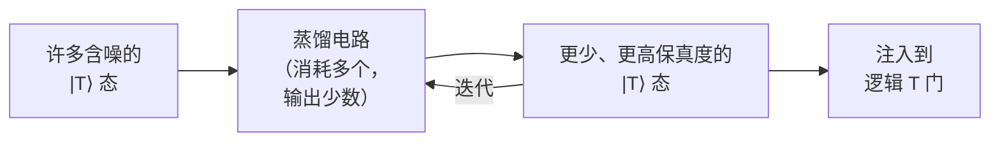

#### 35. 魔态蒸馏的定量分析

经典的蒸馏协议（Bravyi–Kitaev）是 **15 换 1** 例程：它取 15 个含噪魔态（每个错误率为 p），通过一个源自 [[15,1,3]] Reed–Muller 码并带后选择的 Clifford 电路，输出 1 个错误率约为 35p³ 的魔态——即**三次方抑制**。如果输入错误为 p = 10⁻³，一轮给出 35×(10⁻³)³ = 3.5×10⁻⁸；第二轮则给出约 ~10⁻²² 量级的态。其成本包括：

- **量子比特开销：** 每个 15 换 1 工厂占据表面码晶格的相当大一块区域（15 个输入态中的每一个本身都是某一码距下的编码逻辑量子比特），因此一个工厂可消耗*数百到数千个*物理量子比特。
- **时间开销：** 蒸馏需要许多码周期，而算法以其 T 门速率消耗魔态——因此**工厂数量**必须依据算法的 T 门*吞吐量*需求来确定。在许多容错设计中，**魔态工厂占据机器物理量子比特的大部分**，并决定逻辑时钟速度。
- **较新的方法：**“魔态培育（magic-state cultivation）”（2024）以及改进的蒸馏/合成协议降低了这一成本；更低开销的非 Clifford 方案是一个重要的研究目标（文件 25），恰恰因为蒸馏主导了资源（文件 18）。

这就是为什么 **T 数**（文件 8）是容错成本的首要指标：总 T 门数 × 每个 T 门的蒸馏成本 = 整台机器的很大一部分。一个具有 10⁸ 个 T 门的算法需要交付 10⁸ 个魔态，这决定了工厂的数量，进而决定了机器的规模。

#### 36. 晶格手术的定量分析

两个距离为 d 的表面码码块之间通过晶格手术实现的逻辑 CNOT（第 12 节）：

- 需要一个位于码块之间/周围的、约 ~d×d 个量子比特的**辅助区域**（“逻辑总线”）。
- 需要**约 ~d 轮**稳定子测量（以便穿过含噪的合并过程可靠地测量联合算符），即在 1 μs 周期下约 ~d μs。
- 因此，单个逻辑两量子比特门在*时间*上耗费约 ~d 个码周期，在*辅助空间*上耗费约 ~d² 个量子比特——两者都随码距标度。对于 d≈27（第 27 节），即每个逻辑门约 ~27 μs 以及可观的辅助面积。

将这些每个逻辑门的成本乘以算法的逻辑电路深度，就得到总运行时间，而辅助面积的需求则加到物理量子比特占用中——两者都是资源估算（文件 18）的核心输入。优化晶格手术的布局与调度（最小化辅助路由拥塞、并行化独立的逻辑门）是一个容错编译问题（文件 8），直接影响机器的规模和速度。

#### 37. 综合起来：容错机器的解剖

在表面码架构中，一台有用的容错量子计算机包括：

1. **一个“存储器”区域**，由逻辑量子比特码块（每个约 ~2d²−1 个物理量子比特）构成，存放算法的逻辑量子比特。
2. **魔态工厂**（第 35 节）——往往是最大的组成部分——持续蒸馏 T 态。
3. 用于晶格手术的**路由/辅助空间**（第 36 节），连接各逻辑码块并输送魔态。
4. **实时解码系统**（第 10–11 节）——在周期时间预算内处理伴随式数据流的经典 FPGA/ASIC 硬件。
5. **经典控制基础设施**（文件 11），产生脉冲和前馈纠正。

物理量子比特数主要由 (1) + (2) + (3) 决定，而运行时间则由逻辑电路深度 × 每个逻辑门的时间（第 36 节）× 任何魔态供应瓶颈决定。资源估算（文件 18）就是将这些综合为具体数字的学科（例如 RSA-2048 约 ~2000 万物理量子比特、约 ~8 小时；Gidney–Ekerå），而最能降低它们的杠杆是**更低的物理错误率**（更小的 d，第 27 节）、**更低开销的编码**（qLDPC，第 15 节——降低区域 (1)）、**更廉价的非 Clifford 门**（降低区域 (2)），以及**偏置噪声/擦除硬件**（第 16、31 节——降低 d 或转换错误）。这一解剖是从 QEC 理论通向定义实用化之路的资源数字的桥梁。

#### 38. 实例：qLDPC 的开销优势

比较以两种方式在可比的保护水平（码距约 ~12）下存储 12 个逻辑量子比特：

- **表面码：** 12 个逻辑量子比特 × (2·12²−1) ≈ 12 × 287 ≈ **~3,450 个物理量子比特**（外加辅助比特），且每个码块只有 1 个逻辑量子比特。
- **IBM 双变量自行车码 [[144,12,12]]：** **~144 个数据量子比特**（外加数量相当的辅助/校验量子比特，总计约 ~288 个）即可存储全部 12 个逻辑量子比特——存储器占用大约**降低 10 倍**。

这约 ~10 倍是 qLDPC 的头条优势（第 15 节），将其应用于机器的整个存储器区域（第 37 节的组成部分 1），可将一台有用机器的总物理量子比特数从约 ~2000 万降至数百万的低位（文件 18）——前提是在硬件中实现所需的非局域连接性（第 15 节；文件 3、19）。这是近期对容错*可行性*最重要的单项进展，也是它重塑路线图（文件 19）并成为更新后资源估算（文件 18）核心输入的原因。

#### 39. 纠错与误差缓解（与文件 10 对照）

一个关键的概念边界：**纠错**（本文）通过冗余编码和伴随式测量在计算过程中主动检测并纠正错误，使逻辑错误随码距*指数级地被抑制*——这是通向任意长计算的真正道路，代价是巨大的量子比特开销。**误差缓解**（文件 10）*并不*编码或纠正；它多次运行*未编码*的含噪电路，并对结果进行*经典后处理*以估计无噪声的期望值，代价是*指数增长的采样开销*（而不是指数被抑制的错误）。缓解是 **NISQ 时代**的策略（现在即可使用，没有量子比特开销，但本质上无法扩展到长计算）；纠错是**容错**策略（需要许多量子比特和低于阈值的保真度，但可扩展到任意计算）。二者是互补的——缓解在硬件达到纠错所要求的保真度和规模之前弥合近期需求——而混淆它们（把缓解当作通向容错的道路）是审慎的读者所要避免的常见错误（文件 10、17）。

---

### 第九部分——基础编码、常见问题与术语表

#### 40. Shor 码与 Steane 码详解

**Shor [[9,1,3]] 码**（第一个 QEC 码）通过*级联*两个经典重复码来说明核心思想。为防护**相位翻转**，将 |0⟩→|+++⟩、|1⟩→|−−−⟩ 编码（一个 3 量子比特的相位翻转重复码）。然后，为了同时防护**比特翻转**，再将其中每个量子比特编码到一个 3 量子比特的比特翻转码中（|+⟩→(|000⟩+|111⟩)/√2，等等）。结果使用 9 个量子比特，可纠正任何单量子比特错误（比特翻转、相位翻转，或二者兼有 = Y）。其稳定子为六个 Z 型（检查每个三元组内的比特翻转）和两个 X 型（检查三元组之间的相位翻转）。Shor 码首次演示了*两种*错误类型可以被同时纠正——驳斥了量子信息本质上无法被保护的论点（第 30 节）。

**Steane [[7,1,3]] 码**是由经典 [7,4,3] Hamming 码及其对偶码构造的 CSS 码，使用 7 个量子比特，带有三个 X 型和三个 Z 型稳定子。它比 Shor 码更为优雅（量子比特更少，且其 CSS 结构使整个 Clifford 群都是横向的），在早期容错理论以及某些囚禁离子 QEC 演示中处于核心地位（文件 4）。这些小码是教学基础；表面码（第 8 节）是它们拓扑的、对硬件友好的后裔，以更多量子比特为代价，用局域稳定子取代了小码的非局域稳定子。

#### 41. Eastin–Knill 定理及其推论

**Eastin–Knill 定理（2009）** 指出：**没有任何量子纠错码能够对*通用*门集拥有横向（因而自动容错）的实现。** 某些门总是可以做成横向的，但绝不可能*全部*都是（绝不可能得到通用集）。这是一个根本性的障碍，其推论塑造了所有容错架构：由于表面码能使 Clifford 门（近乎）横向，但*不能*使 T 门横向，T 门必须由昂贵的变通方案——**魔态蒸馏**（第 13、35 节）——来提供。Eastin–Knill 正是魔态这一概念存在的*原因*，也是 Clifford/T 成本不对称（Clifford 廉价、T 昂贵）是根本性的而非偶然的原因——并不是我们尚未找到表面码的横向 T 门，而是没有任何编码能拥有横向的通用性。不同的编码使*不同*的门成为横向的（色码使更多的 Clifford 群，并在三维中使 T 门成为横向的，第 14 节），因此编码的选择是在权衡*哪些*门廉价——但该定理保证总有*某些*门需要非横向（类蒸馏）的构造。

#### 42. 常见问题

**问：为什么我们不能像恒温器那样持续地测量并纠正错误？** 因为测量量子比特的*状态*会坍缩其叠加态（文件 2，第 9 节）。QEC 的诀窍是测量*稳定子*（它们揭示错误信息而不触及逻辑信息），而不是量子比特本身（第 3 节）。连续/弱测量 QEC 是一个研究领域，但主流方法是离散的稳定子测量。

**问：一个编码如何仅用离散的纠正就能纠正*连续的*旋转错误？** 错误数字化（第 2 节）：伴随式测量把连续错误投影到离散的泡利基上，因此纠正 {I,X,Y,Z} 就足以应对所有小错误。这是该领域最重要且最不直观的结果之一。

**问：如果一个逻辑量子比特需要约 ~1000 个物理量子比特，容错是否没有希望？** 并非没有希望，但代价高昂——因此人们高度关注*降低*开销：更低的物理错误率（更小的 d，第 27 节）、qLDPC 码（量子比特数少约 ~10 倍，第 15 节）、偏置噪声/擦除硬件（第 16、31 节），以及更廉价的魔态（第 35 节）。这些杠杆单独或合起来，都可能把数百万量子比特的估算（文件 18）大幅降低。2023–2024 年的演示（第 20–21 节）表明*原理*行得通；工程挑战在于扩展规模和降低开销。

**问：“量子优越性”与“容错”有何区别？** 优越性（文件 14）是一次性的演示，表明某个量子器件做了*某件事*（往往没有用处）比经典计算机更快——没有纠错，而且会被经典算法的改进所挑战。容错则是持续的、经过纠错的体制，在其中*任意有用*的算法都能可靠运行。二者之间的差距，就是本文整个 QEC 计划所要弥合的。

**问：更多量子比特与更好的量子比特，哪个更重要？** 在接近阈值时，毫无疑问是更好的量子比特（更低的错误率）：第 27 节表明保真度提高 10 倍可使开销降低约 ~3 倍（通过更小的 d），而从阈值以上移到阈值以下，就是纠错起帮助作用还是起反作用的区别。一致良好且连接良好的量子比特胜过数量更多的平庸量子比特（文件 3，附录 B）。这就是该领域 2023 年转向“质量重于数量”（文件 19、22）是正确的原因。

**问：表面码是最终答案吗？** 可能不是——如果能实现其连接性，qLDPC 码（第 15 节）能提供约 ~10 倍更好的开销；Floquet 码（第 18 节）提供权重为 2 的测量；偏置噪声/玻色码（第 16 节）提供硬件层面的开销降低。表面码在*今天*占主导，是因为它适配*当前*的硬件；编码格局正与硬件一道活跃地演进（文件 25）。

#### 43. 术语表

- **稳定子码（Stabilizer code）：** 定义为泡利算符阿贝尔群（稳定子）的 +1 本征空间的编码。
- **伴随式（Syndrome）：** 稳定子测量结果的模式，在不测量逻辑信息的情况下揭示错误。
- **错误数字化（Error digitization）：** 通过伴随式测量将连续错误投影到离散泡利算符上——使 QEC 变得可处理。
- **码距 d：** 逻辑算符的最小权重；距离为 d 的编码可纠正 ⌊(d−1)/2⌋ 个错误。
- **[[n,k,d]]：** n 个物理量子比特编码 k 个逻辑量子比特，码距为 d。
- **CSS 码：** 具有分离的 X 型与 Z 型稳定子的编码（表面码、色码、大多数 qLDPC 码）。
- **阈值定理：** 在临界物理错误率 p_th 以下，增大 d 可使逻辑错误指数级地被抑制。
- **表面码：** 最主要的拓扑 CSS 码；二维最近邻，权重为 4 的稳定子，~1% 阈值，每逻辑比特约 ~2d²−1 个量子比特。
- **解码器（MWPM、Union-Find、BP+OSD、ML）：** 根据伴随式推断错误的经典算法。
- **晶格手术：** 通过合并/分裂码块实现逻辑两量子比特门。
- **魔态蒸馏：** 通过后选择，从含噪的非 Clifford（T）资源态中制备高保真度的资源态。
- **Eastin–Knill 定理：** 没有任何编码拥有横向的通用门集——这就是魔态必不可少的原因。
- **qLDPC 码：** 具有高编码率和稀疏校验的低密度奇偶校验量子码（但需要非局域连接）；开销降低约 ~10 倍（IBM 双变量自行车码）。
- **偏置噪声/玻色/猫态码：** 通过硬件工程化的错误不对称，允许使用更简单的外层码（用重复码取代表面码）。
- **Floquet 码：** 由权重为 2 的测量的周期性调度（而非静态稳定子群）定义的编码。
- **擦除转换：** 利用已知位置的错误（原子丢失、光子丢失），编码对它们的纠正效率约高 ~2 倍。
- **低于阈值/盈亏平衡/伪阈值：** 有利的码距标度/逻辑比特寿命超过最好的物理量子比特/有限编码的交叉点。

#### 44. 总结

量子纠错是使*有用的*量子计算成为可能的学科，它通过稳定子形式体系（非局域编码，测量伴随式而非量子比特）和错误数字化的洞见（纠正离散泡利算符就足以应对连续错误），化解了不可克隆与测量坍缩所造成的张力。阈值定理保证：在临界物理错误率以下，增大码距可使逻辑错误指数级地被抑制——这是整个容错路线图的依据，如今已被 Google 的低于阈值结果和 QuEra 的 48 个逻辑量子比特（2023–2024）在实验上验证。表面码因其二维最近邻的适配性和高阈值而在实践中占主导，代价是二次的开销以及针对非 Clifford 门的昂贵魔态蒸馏（Eastin–Knill）。前沿是*降低开销*：qLDPC 码（量子比特数少约 ~10 倍，但需要非局域连接）、偏置噪声/玻色码（硬件层面的错误不对称）、擦除转换、Floquet 码与子系统码，以及更廉价的魔态——因为压倒性的物理量子比特开销（RSA-2048 需要数百万；文件 18）是通向实用的核心障碍。使编码与每种硬件模态的连接性和工程化的错误结构相匹配（文件 3–7）是一项核心的战略选择，而大规模实时解码（第 11 节）仍是一个重大的开放系统问题（文件 25）。QEC 是整个领域转动的枢纽：它把含噪的物理量子比特（文件 3–7）转化为可靠的逻辑量子比特，而资源估算（文件 18）和路线图（文件 19）正是以这些逻辑量子比特来计数通往有用算法（文件 13）的进度；并且它与误差*缓解*（文件 10）一道，构成了 NISQ 现在与容错未来之间的清晰分界线。

*交叉引用：不可克隆、稳定子、错误数字化、泡利信道（文件 2）；特定模态的 QEC——超导上的表面码（文件 3）、离子上的灵活编码（文件 4）、原子上的擦除转换与 48 个逻辑量子比特（文件 5）、光子上的 FBQC 损耗容忍（文件 6）、偏置噪声猫态码（文件 7）；容错编译、T 数、晶格手术布局（文件 8）；作为 NISQ 替代方案的误差缓解（文件 10）；实时解码器与控制（文件 11）；将这些综合为物理量子比特与运行时间数字的资源估算（文件 18）；以逻辑量子比特为目标的路线图（文件 19）；逻辑错误率的基准测试（文件 22）；QEC 前沿——qLDPC、Floquet、解码器 ASIC、相关噪声抑制（文件 25）。*

---

### 第十部分——容错小组件、标记量子比特与编码形变

#### 45. 横向门详解

[[n,k,d]] 码上的**横向**门对每个物理量子比特独立地施加物理门（或在两个码块的对应量子比特之间施加），使得没有任何单个物理故障会扩散到码块内的两个量子比特。对于 CSS 码，横向门通常包括：

- 两个码块之间的**横向 CNOT**（从块 A 到块 B 的逐位 CNOT）——是容错的，因为 A 的一个量子比特上的故障只会传播到 B 的一个量子比特。
- 对于自对偶 CSS 码（如 Steane 码），有**横向 H 和 S**——从而横向地给出完整的 Clifford 群。
- 但**绝不可能有横向 T**（Eastin–Knill，第 41 节）——这块缺失的部分需要魔态。

表面码作为一种*拓扑*码而非小型分块码，实现逻辑 Clifford 门的方式有所不同——逻辑泡利算符是弦算符，逻辑 CNOT 通过**晶格手术**（第 12 节）而非逐位横向施加来完成，Hadamard 则涉及对码块进行旋转/重新标记。原理是一致的：不让故障不受控制地扩散。实用的分类——哪些门廉价（Clifford，通过横向/晶格手术）与哪些昂贵（T，通过蒸馏）——正是容错编译器（文件 8）和资源估算器（文件 18）据以做预算的依据。

#### 46. 标记量子比特与容错伴随式提取

朴素的稳定子测量并非自动容错：测量电路中的单个故障（例如辅助比特在对数据量子比特作 CNOT 的中途发生的故障）可能传播为*多个*数据量子比特错误，超出编码的纠错能力。历史上，这是用 **Shor 式猫态辅助比特**（使用纠缠的多量子比特辅助比特，使故障不扩散）或 **Steane/Knill 辅助比特**方案解决的——但这些方案很耗费量子比特。现代的轻量级解决方案是**标记量子比特（flag qubits）**：一个或几个额外的辅助量子比特，恰好在伴随式提取期间发生危险故障时“标记”（被触发）。当标记触发时，解码器便知道要对该轮的伴随式作特殊处理（可能发生了相关的数据错误），以极小的开销保持容错性。基于标记的容错伴随式提取（Chao–Reichardt 等，约 2018）大幅降低了容错的辅助开销，被广泛使用，尤其是在小码和囚禁离子演示中（文件 4）。它很好地说明了容错*工程*（而不仅仅是编码选择）如何降低开销。

#### 47. 编码形变与逻辑量子比特的编织

除晶格手术之外，逻辑操作还可以通过**编码形变**来执行——动态地改变编码（移动边界，在表面码中创建/移动“孔洞”或缺陷），使逻辑量子比特相互编织，类似于拓扑编织（文件 7）。早期的表面码方案使用**缺陷编织**（移动晶格中的穿孔）来实现逻辑 CNOT；晶格手术后来被证明更节省量子比特，成为标准，但编码形变仍是有用的概念和实践工具，并将表面码与其背后的拓扑/任意子图景联系起来（表面码是带边界的环面码，其逻辑操作具有拓扑解释）。将表面码理解为一个*拓扑*对象——逻辑信息存储在全局的拓扑自由度中，受保护是因为局域错误无法产生逻辑错误所需的长弦算符——是其鲁棒性（第 26 节）以及与拓扑量子比特（文件 7）相联系的深层原因。

#### 48. 小型编码的实验里程碑

通往 2023–2024 年分水岭（第 20–21 节）的道路，经历了多年的小型编码实验：

- 在超导和离子硬件上的**重复码演示**（仅比特翻转），作为第一步展示了错误抑制。
- 在超导（Google、IBM）、囚禁离子（因斯布鲁克、Quantinuum）和中性原子硬件上编码并测量伴随式的**距离为 3 的表面码与色码**。
- **盈亏平衡的玻色 QEC**（耶鲁，约 2016 年及以后）——一个玻色逻辑量子比特的寿命超过其最好的物理组成部分，是第一个“编码起了作用”的结果。
- 小规模的**逻辑门演示**（横向 CNOT、晶格手术、魔态注入）。
- 将快速经典解码器与实时伴随式提取相结合的**实时解码演示**。

每一项都是必要的台阶，而集体的进展——最终落在 Google 的码距标度低于阈值结果和 QuEra 的多逻辑量子比特算法上——正是该领域进入纠错时代的原因。阅读 QEC 实验声明（文件 22）需要知道一项结果代表哪一级台阶：编码一个码 ≠ 盈亏平衡 ≠ 低于阈值的标度 ≠ 逻辑算法，而媒体报道常常把这些混为一谈。

#### 49. 逻辑时钟与计算速度

一项常被忽视的资源：**逻辑时钟速度**——逻辑操作执行得有多快。通过晶格手术实现的逻辑门需要约 ~d 个码周期（第 36 节）；在 d≈27 和 1 μs 的超导周期下，每个逻辑门约 ~27 μs——因此一个逻辑量子比特每秒运行约 ~10⁴–10⁵ 个逻辑门，*远慢于*物理门速率。对于具有 10¹⁰ 次逻辑操作的算法（文件 18），这意味着约 ~10⁵–10⁶ 秒（数天）的运行时间，除非利用并行性（同时进行许多逻辑操作）。这就是为什么**模态时钟速度**对容错很重要：超导的快速物理周期（1 μs）给出比囚禁离子缓慢的门加穿梭（文件 3、4）更快的逻辑时钟，因此在逻辑量子比特数相同的情况下，超导容错机器运行给定算法的（挂钟）时间比离子机器更短——即使离子机器可能需要更少的物理量子比特（保真度更高）。这种跨模态的速度/规模权衡是资源估算（文件 18）的核心产出，也是关键的战略考量（文件 19–20）：有些应用受限于量子比特数（利于高保真度的离子/原子），另一些则受限于时间（利于快速的超导）。

#### 50. 为什么 QEC 是整个领域的枢纽

最后：量子纠错是决定物理演示与有用计算机之间差别的唯一概念。没有 QEC，量子计算机只能局限于带误差缓解的浅层 NISQ 电路（文件 10）——对近期实验和有争议的优势声明有用（文件 17），但本质上无法进行长时间、可靠的计算。*有了*低于阈值的 QEC，任意长的计算就成为可能，从而解锁 Shor 算法、大规模量子模拟，以及证明该领域存在价值的应用（文件 13）。整个硬件工作（文件 3–7）归根结底都是为了达到低于阈值的保真度以及足够多的量子比特来编码有用数量的逻辑量子比特；整个资源估算学科（文件 18）是关于量化这需要多少物理量子比特和多少时间；而整个路线图/竞争格局（文件 19–20）则是一场竞赛，看谁先造出第一台用纠错后的逻辑量子比特做出有用之事的机器。2023–2024 年的演示证明了原理行得通。剩下的工作——从少数几个逻辑量子比特扩展到数千个、通过 qLDPC 与偏置噪声码降低开销、解决大规模实时解码、以及弥合相关噪声的现实差距——是该领域未来十年的决定性工程挑战（文件 25）。QEC 是当今含噪量子器件成为未来可靠量子计算机的所在，也是本数据库其余全部内容所围绕的概念。

---

### 第十一部分——扩展实例与定量比较

#### 51. 具体的解码图

对于电路级噪声下的表面码，MWPM 解码作用于一个**三维匹配图**：节点是每个（空间，时间）点上的稳定子测量结果，如果单个故障可能同时翻转这两个稳定子的结果，则两个节点之间连一条边。一个物理错误产生*一对*伴随式缺陷（其错误链在时空中的两个端点）；测量错误产生在*时间*上分开的缺陷。MWPM 找到把所有缺陷配对起来的最小权重边集——即产生所观测伴随式的数据错误与测量错误的最可能组合。边权设为对应故障概率的 −log，因此最小权重匹配 = 最大似然错误（在独立性假设下）。这种图结构是表面码可被高效解码的原因（匹配是多项式时间的），也是为什么*相关*错误（不符合“每个故障翻转两个稳定子”的边结构——例如 Y 错误或翻转更多稳定子的 hook 错误）需要增强型解码器（第 28 节）。对于 **qLDPC 码**，伴随式结构*不是*简单的匹配图（单个故障可能翻转多于两个校验），这就是 qLDPC 需要置信传播解码器（BP+OSD）而非匹配的原因——这也是 qLDPC 解码更困难、更慢的关键原因（第 28 节），并且是一个活跃的研究瓶颈（文件 25）。

#### 52. 偏置噪声开销：完整比较

量化猫态量子比特的优势（第 16、31 节）。假设目标逻辑错误率为每次逻辑操作 10⁻¹²：

- **表面码**（两种错误类型，无偏置，p=10⁻³）：需要 d≈21，约每个逻辑量子比特 2·21²−1 ≈ **~880 个物理量子比特**。
- **猫态 + 重复码**（比特翻转在猫态尺寸 |α|²≈10 时被硬件抑制到约 ~10⁻⁹，只有相位翻转以 p_phase≈10⁻³ 由一维重复码纠正）：需要重复码距 d≈13 才能达到 10⁻¹²，使用约 ~13 个猫态量子比特。即使每个猫态量子比特的资源成本是裸 transmon 的约 ~10 倍（振荡器 + 辅助比特 + 控制），那也只有约 ~130 个“transmon 等效”资源——比表面码**少约 ~7 倍**，并且随目标错误率而增长（因为重复码的开销关于 d 是线性的，而表面码是二次的）。

关键的告诫（第 16 节）：这假设比特翻转抑制在门操作*期间仍然保持*。猫态量子比特上的两量子比特门可能重新引入比特翻转，因此整个计算过程中的*有效*偏置——而非空闲时的偏置——决定了真实的开销。如果门显著降低了偏置，优势就会缩小。这就是为什么诚实的猫态量子比特资源估算（文件 18）必须使用门层面的偏置，也是为什么演示*操作期间*（而不仅仅是存储中）的高偏置，是 AWS 和 Alice & Bob 的关键技术里程碑（文件 20）。

#### 53. 擦除转换开销：完整比较

量化擦除的优势（第 16、31 节；文件 5）。一个编码大致可纠正**两倍于泡利错误数量的擦除**（已知位置的擦除只花费半个码距单位，因为解码器知道错误*在哪里*但不知道*是什么*，而泡利错误则二者皆不知）。因此，如果某个模态的主要错误是被转换为擦除的*可检测损耗*（中性原子的原子丢失、光子的光子丢失）：

- 达到目标错误率所需的有效码距大致*减半* → 物理量子比特开销（∝ d²）降低约 ~4 倍。
- 或者，*阈值*大致翻倍，给出更大的裕量。

对于以原子丢失为主的中性原子逻辑量子比特（文件 5，第 36 节），将丢失转换为擦除可使每个逻辑量子比特所需的原子数减少约 ~2–4 倍，实质性地改善该平台的容错经济性（文件 18）。擦除转换和偏置噪声是降低主导通往实用之路的开销的两个主要*硬件错误结构*杠杆（与 qLDPC 码的*编码*杠杆并列）——而将它们结合起来（偏置噪声擦除量子比特，一个活跃的想法）可能使节省量叠加。

#### 54. 敏感性总结——开销上的杠杆

汇总物理量子比特开销（核心障碍，数百万量子比特，文件 18）上的定量杠杆：

| 杠杆 | 机制 | 对开销的影响 |
|---|---|---|
| 更低的物理错误率 | 所需码距 d 更小 | 保真度每提高 10 倍，量子比特数少约 ~3 倍（第 27 节） |
| qLDPC 码 | 更高的编码率 k/n | 量子比特数少约 ~10 倍（存储器区域）（第 15、38 节） |
| 偏置噪声（猫态） | 用一维重复码取代二维表面码 | 关于 d 为线性对二次（第 52 节） |
| 擦除转换 | 可检测错误只花费一半码距 | 量子比特数少约 ~2–4 倍（第 53 节） |
| 更廉价的魔态 | 更小的蒸馏工厂 | 缩减往往占主导的工厂区域（第 35 节） |
| 更高的连接性 | 使 qLDPC 成为可能，减少 SWAP | 使上述各项成为可能（文件 4、5） |

这些杠杆在很大程度上是*相乘的*且*互补的*：一台结合了低物理错误率、qLDPC 码、偏置噪声或擦除硬件以及高效蒸馏的机器，有可能把约 ~2000 万物理量子比特的 RSA-2048 估算（文件 18）降低一到两个数量级。这就是为什么 QEC 前沿（文件 25）——而不仅仅是原始量子比特数的扩展——将在很大程度上决定有用容错的可行性，也是为什么 2020 年代编码创新（qLDPC、Floquet、偏置噪声、擦除）的井喷与硬件扩展本身同样重要。

#### 55. 最终综合

量子纠错把文件 3–7 中含噪的物理量子比特转化为有用计算所需的可靠逻辑量子比特。它的基础——化解不可克隆/测量张力的稳定子形式体系，以及将连续错误化约为可纠正泡利算符的错误数字化——使阈值定理成为可能，而阈值定理的实验验证（Google 的低于阈值标度、QuEra 的 48 个逻辑量子比特，2023–2024）标志着该领域进入纠错时代。表面码因其对硬件的适配而在实践中占主导，代价是二次的开销以及针对非 Clifford 门的魔态蒸馏（由 Eastin–Knill 所迫）。决定性的挑战——也是决定性的机遇——是*降低开销*，途径包括 qLDPC 码、偏置噪声与擦除硬件、Floquet 码与子系统码，以及更廉价的魔态，每一个都是作用于数百万量子比特问题的相乘杠杆。大规模实时解码、相关噪声抑制，以及使每种模态的连接性和错误结构与合适编码相匹配的编码/硬件协同设计，是开放的前沿（文件 25）。QEC 是整个领域的枢纽：所有上游（硬件，文件 3–7）都是为了达到低于阈值的保真度与规模而存在，所有下游（资源估算文件 18、路线图文件 19、算法文件 13）都以 QEC 所产生的逻辑量子比特来计数。现在掌握了 QEC 的原理、编码、解码器和开销杠杆的读者，可以进而研读文件 10（NISQ 时代的缓解替代方案）、文件 18（将 QEC 成本综合为机器规格的资源估算）以及文件 19（竞相将已演示的 QEC 扩展为有用机器的路线图）。

---

### 第十二部分——拓扑起源与读者要点

#### 56. 从环面码到表面码

表面码源自 Kitaev 的**环面码**（1997）——一种定义在环面上包裹的晶格上的稳定子码，其中逻辑量子比特对应于环面上*拓扑上不同的环路*（逻辑算符是缠绕不可收缩圈的泡利弦）。环面码没有边界（环面是闭合的），这对平面芯片不切实际；**表面码**则是适配于*带边界*的*平面*晶格（粗糙边与光滑边）的环面码，其逻辑算符是连接边界的弦，而非缠绕圈的弦。这种拓扑起源直观地解释了表面码的鲁棒性：逻辑错误需要产生一条横跨整个晶格（从边界到边界）的弦算符，而局域噪声只能产生*短*的弦段——由局域错误拼装出一条横跨系统的弦，在阈值以下的概率是指数级小的（第 26 节）。逻辑信息存储在一种*全局的、拓扑的*性质（一条弦连接了哪些边界）中，任何局域扰动都无法触及——这与拓扑量子比特（文件 7）在硬件层面追求的非局域性原则相同，只是在这里通过编码在*软件*中得以实现。这种联系——无论是通过硬件（马约拉纳）还是通过编码（表面码）实现的拓扑保护——是该领域的统一思想之一。

#### 57. 子系统码与规范自由度

**子系统码**通过把一部分编码自由度指定为**规范量子比特（gauge qubits）**——类似逻辑量子比特、但*不*携带受保护信息且可处于任意状态的量子比特——来推广稳定子码。其优势在于：规范自由度允许将稳定子作为*较低权重*的**规范算符**的乘积来测量，从而简化伴随式提取（更少/更简单的测量）。**Bacon–Shor 码**是经典的例子（测量权重为 2 的规范算符，而非更高权重的稳定子）。其代价通常是在相同量子比特数下码距或编码率降低。子系统码适用于测量权重是硬件瓶颈的场合，并且与 Floquet 码（第 18 节）相联系，后者可被视为按动态调度测量的子系统码。规范概念还把 QEC 与物理学中的规范理论联系起来——测量规范算符类似于固定规范，而受保护的逻辑信息是规范不变的。

#### 58. 读者对文件 9 的要点

当你遇到一项 QEC 的声明——一种新编码、一个解码器、一项实验结果或一项资源估算——请沿着本文建立的几条轴线来拆解它：

- **是什么编码，其 [[n,k,d]]、阈值、连接性和编码率是什么？**（表面码：局域但低编码率；qLDPC：高编码率但非局域；猫态：偏置噪声，线性开销。）
- **该声明假设了什么错误模型，它与现实相符吗？**（独立泡利是理想化情形；泄漏、相关/宇宙射线以及非马尔可夫错误是现实差距，第 29 节。）
- **它是哪一级实验台阶？**（编码一个码 ≠ 盈亏平衡 ≠ 低于阈值的*标度* ≠ 逻辑算法——第 48 节；媒体报道会把这些混为一谈。）
- **开销是多少，哪些杠杆可以降低它？**（物理错误率、qLDPC 编码率、偏置噪声/擦除硬件、魔态成本——第 54 节。）
- **解码器是什么，它能否在大规模下实时运行？**（表面码用 MWPM/Union-Find，qLDPC 用 BP+OSD，相关噪声用机器学习——第 28、51 节；大规模实时解码尚未解决，第 11 节。）
- **T 门/魔态成本如何占主导？**（Eastin–Knill 迫使采用蒸馏；T 数决定工厂规模，往往占据大部分量子比特——第 13、35 节。）

这一拆解——编码参数 → 错误模型的真实性 → 实验台阶 → 开销杠杆 → 解码器可行性 → 魔态成本——是审视 QEC 的严谨视角，与文件 3–7 的硬件评估纪律以及文件 22 的基准测试怀疑精神相呼应。它能把真正理解 2023–2024 年纠错分水岭（一项真实的、验证原理的成就）与对其反应过度或不足区分开来（既不是“容错已经解决”，也不是“永远无法扩展”，而是“原理行得通，剩下的挑战是降低开销和规模扩展，已在文件 18 中量化”）。QEC 是该领域的枢纽，读懂它是读懂整个领域发展轨迹的关键。

#### 59. 关于连续/模拟 QEC 与自主纠错的说明

本文的大部分内容假设的是*离散的、基于测量的* QEC（测量稳定子、解码、纠正）。有两种替代范式值得一提。**连续/弱测量 QEC** 通过连续弱测量（文件 2，第 9 节）监测稳定子，并施加连续反馈——有可能降低离散伴随式周期对延迟和硬件的要求，不过对连续记录的解码很微妙；它在很大程度上仍是一个研究方向。**自主（耗散）QEC** 对系统的*耗散*进行工程化设计，使环境本身*无需*主动测量或反馈就能持续地将错误驱回码空间——与稳定猫态量子比特的工程化耗散原理相同（文件 3、7）。自主 QEC 之所以有吸引力，是因为它消除了测量/解码/反馈回路（及其延迟与经典硬件负担），但设计出能纠正完整编码（而不仅仅是偏置噪声）的耗散很困难，它也主要是一个研究前沿。这些范式表明，离散稳定子测量方法虽居主导，却不是保护量子信息的唯一可设想路径——并且在最高效的架构中，硬件层面的错误抑制（偏置噪声、自主纠错、擦除转换）与编码层面的纠错相互交融，这些架构将两者结合起来（第 16 节）。

#### 60. 结语

通读本文的读者会理解有用量子计算所依赖的那个概念：尽管有不可克隆和测量坍缩，如何保护脆弱的量子信息（稳定子编码 + 伴随式测量）、为何原则上是可能的（错误数字化 + 阈值定理）、在实践中如何做到（表面码 + 解码器 + 晶格手术 + 魔态蒸馏）、如何降低开销（qLDPC、偏置噪声、擦除、Floquet 码）、已经演示了什么（低于阈值标度、数十个逻辑量子比特，2023–2024），以及还剩下什么（规模扩展、降低开销、实时解码、相关噪声抑制）。本数据库中的每一个其他文件都与此相连：硬件（文件 3–7）必须达到低于阈值的保真度并扩大规模；编译（文件 8）必须合成使 T 数最小化的容错电路；资源估算（文件 18）将 QEC 成本综合为机器规格；路线图（文件 19）竞相扩展已演示的 QEC；而整个 NISQ 与容错的二分法（文件 1、10、17）正是 QEC 所划出的分界线。量子纠错并不是量子计算的一个子领域——它是决定量子计算究竟能否变得有用的学科，其 2020 年代的轨迹——从理论上的前景，到低于阈值的实验验证，再到开销降低的竞赛——是该领域走向成熟的故事。

> **文件 9 的一句话总结：** 量子纠错将每个脆弱的逻辑量子比特非局域地编码到许多物理量子比特上（化解不可克隆），通过测量稳定子而非量子比特本身来检测错误（化解测量坍缩），纠正伴随式测量将连续噪声数字化而成的离散泡利错误，并且——在如今已在实验上跨越的硬件错误率阈值以下——使逻辑错误随码距指数级地被抑制；其代价是物理量子比特开销（RSA-2048 需要数百万个），而该领域的核心工程竞赛正致力于通过更高编码率的 qLDPC 码、偏置噪声与擦除硬件以及更廉价的魔态来降低它。

---

<a id="f10"></a>

## 文件 10：量子误差缓解——无需完整纠错的 NISQ 时代技术

> 📄 **原文链接（English original）：[10_quantum_error_mitigation.md](10_quantum_error_mitigation.md)**　｜　[↑ 返回目录](#toc)


> 本文件涵盖**误差缓解（error mitigation）**——这是一类在 NISQ 时代改善结果的技术，它*不*对量子比特进行编码，也不主动纠正错误，而是通过对大量含噪电路执行结果进行经典后处理，来估计无噪声的期望值。缓解与误差*纠正*（文件 9）有本质区别：它不会指数级地抑制逻辑错误，而是用*指数增长的采样代价*换取偏差的降低——这使它只是 NISQ 时代的过渡桥梁，而非通向容错的道路。本文件阐述零噪声外推、概率误差消除、测量误差缓解、动力学解耦，以及 IBM 的实用规模（utility-scale）演示及其引发争议的经典反驳。本文件与文件 9（纠错）、14（经典模拟）和 17（NISQ 应用）互为补充。

---

### 第一部分——缓解与纠错

#### 1. 根本区别

**纠错**（文件 9）把每个逻辑量子比特冗余地编码到许多物理量子比特上，测量错误症状（syndrome），并在计算*过程中*主动纠正错误——使逻辑错误随码距*指数级*地被抑制，从而以巨大的量子比特开销和低于阈值的保真度为代价，实现任意长的计算。**误差缓解**则完全不做这些。它运行*未编码*的含噪电路（所有量子比特都用作数据量子比特，没有开销）许多次，并对这批含噪结果进行*经典后处理*，以估计无噪声的**期望值**应该是多少。关键的权衡在于：

- 缓解**没有量子比特开销**，并且可以在*当今*的硬件上工作——这是它的巨大优势。
- 但它**不会**指数级地抑制错误。相反，经典后处理会放大统计方差，因此要达到给定的精度，所需的电路重复次数（shots）会随电路的总噪声（含噪门的数量 × 错误率）**呈指数增长**。这种**指数级采样开销**是根本性的限制：随着电路变得更大、更深，所需的 shot 数量会变得天文数字般巨大，从而限制了有用电路的规模。

因此，缓解是一种**仅限 NISQ 时代的策略**——它使含噪的近期设备在*中等规模*电路上更有用，但无法扩展到只有纠错才能实现的长计算（Shor 算法、大规模化学计算）。把缓解误认为通向容错的道路，是一个常见而重要的错误（文件 9、17）。缓解换来的是近期的实用性；纠错换来的是容错的未来；二者互为补充，该领域利用缓解来过渡，直到硬件达到纠错所需的保真度和规模。

#### 2. 缓解的目标：期望值

缓解技术通常估计可观测量的**期望值** ⟨O⟩ = ⟨ψ|O|ψ⟩（例如 VQE 中的能量 ⟨H⟩，文件 13），而不是完整的输出分布或单个比特串。这是正确的目标，因为大多数近期算法（VQE、QAOA、量子模拟）需要的是期望值，而期望值适合缓解所执行的统计外推/消除。缓解并不"修复"单次运行；它修正的是由多次运行构建的*统计估计*。

---

### 第二部分——核心技术

**零噪声外推（ZNE）——最常见的缓解技术：**

```text
   <O>  (observable)
    ^
    |  *  measured at 3x noise
    |     *  measured at 2x noise
    |        *  measured at 1x noise (native)
    |            ?  <-- extrapolate to ZERO noise
    | - - - - - - - o  (mitigated estimate)
    +------------------------------> noise scale λ
   Run the SAME circuit at deliberately amplified noise, fit, extrapolate to λ=0.
   No extra qubits — but sampling cost and bias grow with circuit size.
```

#### 3. 零噪声外推（ZNE）

**ZNE** 是应用最广泛的缓解技术。其思路是：有意地将噪声*提高*到若干个受控水平，在每个水平上测量（有偏的）期望值，然后*外推回*零噪声极限。

- **噪声放大：**通过**门折叠（gate folding）**（将每个门 G 替换为 G G† G，其结果等于 G，但噪声暴露为 3 倍）或**脉冲拉伸（pulse stretching）**（拉长门脉冲以增加退相干暴露）按因子 λ ≥ 1 缩放噪声。这会给出 λ = 1、1.5、2、3 等取值下的有偏期望值。
- **外推：**把测得的 ⟨O⟩(λ) 拟合到某个模型（线性、多项式，或**Richardson 外推**；指数）并在 λ = 0 处求值——即估计的无噪声值。
- **实现：**内置于 Qiskit Runtime 的 Estimator 原语和**Mitiq** 开源库中。

ZNE 之所以流行，是因为它简单、无需详细的噪声表征，并且通常能带来显著改善。它的局限在于：外推是一种*模型假设*（如果真实的 ⟨O⟩(λ) 与拟合模型不符，外推就会有偏），并且放大噪声会增加方差，需要更多的 shots。ZNE 是 IBM 2023 年实用性演示的核心（第 8 节）。

#### 4. 概率误差消除（PEC）

**PEC** 更严格，也更昂贵。它先**表征噪声信道**（通过门集层析或循环基准测试，文件 2），然后把噪声映射的*逆*表示为在*可实现*操作上的**准概率分布（quasi-probability distribution）**。由于物理（CPTP）噪声信道的逆通常*本身并不是*物理信道，因此它被分解为物理操作的带符号组合 Σᵢ cᵢ Oᵢ，其系数 cᵢ 为实数（有些为负）。然后按 |cᵢ| 对操作进行**采样**，应用这些操作，并以 sign(cᵢ) 对结果加权，使得*平均*在统计上抵消噪声——从而得到无噪声期望值的*无偏*估计。

- **优势：**在噪声模型准确的前提下是无偏的（不同于 ZNE 依赖模型的外推）。
- **代价：**采样开销随总噪声**呈指数增长**（准概率分解的"代价"γ 的含噪门数次幂：γ^(门的数量)），并且 PEC 需要准确的噪声表征。这种指数代价是缓解根本限制的具体体现（第 1 节）。

PEC 和 ZNE 经常结合使用（在负担得起的地方用 PEC 的严格性，在其他地方用 ZNE 的低成本），IBM 的 Qiskit Runtime 两者都提供。

#### 5. 基于学习的缓解（Clifford 数据回归）

**Clifford 数据回归（CDR）**及相关方法利用了**Clifford 电路可被经典模拟**这一性质（Gottesman–Knill，文件 2、14）：构造*接近*目标电路、但完全由 Clifford 门构成的电路（其精确的无噪声值可以经典地计算），在含噪硬件上运行它们，并利用这些 Clifford 训练点*学习一个修正函数*（一个回归），将含噪值映射到真实值。再把学到的修正应用到*实际*（非 Clifford）目标电路的含噪结果上。这是把 Clifford 电路的经典可模拟性用作噪声修正的"训练集"——是经典模拟边界（文件 14）与缓解之间一座优雅的桥梁。

#### 6. 测量误差缓解

读出是一个主要的、可单独修正的错误来源。**测量误差缓解**表征**读出混淆矩阵**——即对每个量子比特把 |0⟩ 误读为 |1⟩ 以及反之的概率（通过制备已知的基态并观察读出统计来测量）——并在测得的比特串分布上对其进行经典**求逆**，以恢复真实分布。对于 n 个量子比特，完整的混淆矩阵为 2ⁿ×2ⁿ（对大的 n 不可处理），因此可扩展的变体假设读出错误是*张量积形式*（各量子比特相互独立）或*局部相关*（修正相邻量子比特读出之间的串扰）。测量误差缓解成本低、效果好，并被常规使用（内置于 Qiskit 和其他软件栈中）；它专门针对读出错误，与 ZNE/PEC 的门错误缓解相互补充。

#### 7. 动力学解耦

**动力学解耦（DD）**（文件 2 第 26 节；文件 8）是一种在电路*运行期间*应用的*硬件层面*缓解：在*空闲*量子比特上插入脉冲序列（XY4、CPMG、XY8，以及 KDD 等鲁棒变体），以重聚焦并平均掉缓慢（低频）的退相位噪声，从而延长有效的空闲相干时间。与上述后处理技术不同，DD 在执行期间实时起作用，不需要额外的 shots——它只是保护空闲的量子比特。编译器会在空闲窗口期间自动插入 DD（文件 8），通常能在不增加采样成本的情况下将深电路的保真度提高数十个百分点。DD 在纠错循环*内部*（文件 9）也不可或缺，在测量辅助比特时保护数据量子比特。它是成本最低、适用范围最广的缓解手段，几乎总是值得应用。

#### 8. 对称性验证与随机化编译

另外两种技术：**对称性验证**（文件 2 第 40 节）把被模拟系统的守恒量（粒子数、宇称）用作免费的错误检查——丢弃（事后筛选掉）任何测得状态违反对称性的运行，因为这样的运行必然包含错误。**随机化编译 / Pauli 扭曲（Pauli twirling）**（文件 2 第 34 节；文件 8）通过在每个门周围随机化 Pauli 框架，把*相干*错误转化为*随机*的 Pauli 错误——它并不降低错误率，而是使错误变得*良性且易于表征*（随机错误线性累积，比相干错误更容易被 ZNE/PEC 建模）。扭曲通常是使其他缓解技术良好工作的*前提*，因为 ZNE 和 PEC 假设的噪声结构正是由扭曲强制实现的。

---

### 第三部分——实用性之争与评估

#### 9. IBM 的实用规模演示

旗舰级的缓解成果是 **IBM 2023 年的"容错之前的实用性（utility before fault tolerance）"论文（Kim et al., Nature 618, 500 (2023)；arXiv:2306.14887）**：IBM 使用 **127 量子比特的 Eagle** 处理器（文件 3）配合 **ZNE 式误差缓解**（具体是带有学习噪声模型的 PEC/ZNE 形式），在全部 127 个量子比特上模拟了**受击横场 Ising 模型（kicked transverse-field Ising model）**的动力学，其电路深度被声称**超出了暴力经典模拟的能力范围**，所得期望值在经典可验证的区域与精确结果一致，并延伸到了经典困难的区域。IBM 将此视为展示了*量子实用性（quantum utility）*——即在朴素经典方法失效的规模上，NISQ 设备也能给出可靠的结果——甚至早在容错之前。

#### 10. 经典反驳

在*数周到数月*之内，多个小组利用改进的方法给出了与 IBM 结果相当或更优的**经典模拟**——最著名的是**张量网络**方法（矩阵乘积态 / 信念传播张量网络）和稀疏 Pauli 动力学方法（Tindall et al. 等），它们利用了该特定电路纠缠增长有限的特点（文件 14）。这些经典方法在笔记本电脑或中等规模集群上就复现了量子结果，表明这个特定的受击 Ising 电路*实际上并未*超出经典能力范围。这体现了**"移动靶"**动态（文件 1、14）：量子优势/实用性的声明，其强度只取决于*受审视时*最好的经典方法，而经典方法在回应中进步迅速。

#### 11. 这场争论的启示

IBM 的实用性事件是一个有启发性的案例研究，而非失败——诚实的教训是：

- **缓解确实有效**，能够在不小的规模上从 NISQ 硬件中提取可靠的期望值——IBM 的结果是*正确的*（与精确结果和经典结果吻合），是缓解近期价值的一次真实展示。
- **但针对经过缓解的 NISQ 电路的"超越经典"声明是可以被质疑的，并且常常被推翻**，因为缓解能够处理的电路（深度有限、纠缠有限）往往恰好也是先进经典方法（张量网络，文件 14）能够处理的电路。这里存在深刻的张力：缓解在*低复杂度*电路上效果最好，而这些电路也最适合经典模拟。
- **正确的态度**（文件 14、17、22）：把任何针对经过缓解的 NISQ 电路的"量子实用性/优势"声明视为*暂定的*，要求与*最好的*现有方法进行*具体的、实际运行的*经典对比（而不是渐近论证），并预期经典方法会在回应中改进。这种有纪律的怀疑态度是贯穿文件 14、17 和 22 的主线。

#### 12. 评估：缓解的作用与局限

误差缓解是一种有价值的、被积极使用的 NISQ 时代工具：它无需量子比特开销就能在今天改善真实结果，对当前的 VQE/QAOA/模拟实验至关重要（文件 13、17），并深度集成于云端软件栈（Qiskit Runtime 原语、Mitiq）。它的根本局限——**随电路噪声呈指数增长的采样开销**——意味着它无法过渡到只有容错纠错（文件 9）才能实现的长而复杂的计算。因此，缓解与纠错是互补的阶段：缓解从含噪的近期硬件中提取它所能提取的价值，同时该领域朝着使纠错可行的低于阈值的保真度和量子比特数量努力。诚实的战略性表述是：**缓解是获得适度近期价值的方式；纠错是获得变革性长期价值的方式；而在困难问题上，再多的缓解也无法替代纠错。**以第 11 节的经典对比纪律来阅读经过缓解的 NISQ 优势声明，对于区分真正的近期实用性与夸大的"量子优势"至关重要。

*交叉引用：作为可扩展替代方案的纠错（文件 9）；支撑 CDR 的 Clifford 可模拟性以及经典对比纪律（文件 14）；编译中的动力学解耦与随机化编译（文件 8）；相干/随机错误的区分与对称性验证（文件 2）；依赖缓解的 NISQ 应用（文件 17）；基准测试与移动靶动态（文件 22）；实用性与超越性（supremacy）的定义（文件 1）。*

---

### 第四部分——算例、深入讨论与术语表

#### 13. 算例：指数级采样之墙

为使缓解的根本限制具体化：设一个电路有 G 个含噪门，每个门的错误率为 ε，因此预期错误总数为 μ = Gε。概率误差消除的采样开销按 γ² 缩放，其中 γ ≈ e^{2μ}（准概率"代价"在每个门上累积）。对于 G = 1000 个门、ε = 10⁻²（μ = 10）的电路，开销因子大约为 e^{2×10} ≈ e²⁰ ≈ 5×10⁸——这意味着相比同等精度的无噪声估计，需要多出约 10⁸–10⁹ 倍的 shots。把电路加倍到 G = 2000（μ = 20），开销就变成 e⁴⁰ ≈ 10¹⁷——完全无法处理。这就是**指数级采样之墙**：缓解的代价随*总噪声*（门数 × 错误率）呈指数增长，因此只有在 μ 保持适中（小电路、低错误率）时才有效。提高硬件保真度（降低 ε）可直接扩展缓解的适用范围（同一电路的 μ 更小），这就是为什么在 NISQ 时代缓解与保真度提升并行不悖——但除了容错编码之外，没有任何保真度能让缓解处理有用算法所需的深电路（数百万个门）。这一计算是缓解为何只是 NISQ 时代过渡桥梁的定量核心（第 1 节）。

#### 14. 算例：测量误差缓解

考虑 2 个量子比特，每个都有读出错误：P(读出 1 | 制备 0) = 3%，P(读出 0 | 制备 1) = 5%。单量子比特混淆矩阵为 M = [[0.97, 0.05],[0.03, 0.95]]。对于 2 个量子比特（假设相互独立），4×4 混淆矩阵为 M⊗M。给定在 {00,01,10,11} 上的测得分布 p_measured，修正后的估计为 p_true ≈ (M⊗M)⁻¹ p_measured。求逆会重新分配测得的计数，以撤销读出造成的混合——例如，一些被测为"01"的计数会根据错误率被归还给"00"或"11"。问题在于：逆矩阵可能产生*负的*（非物理的）概率，需要通过约束最小二乘或最大似然重构来处理。对于大的 n，完整的 2ⁿ 矩阵不可处理，因此假设读出为张量积形式（独立）或局部相关，分别修正每个量子比特（或小的量子比特组）。测量误差缓解成本低、效果好，几乎总是被应用——这是一种唾手可得的改进，针对的是读出这一 NISQ 最大的错误来源之一（文件 3、22）。

#### 15. 算例：ZNE 外推

假设在噪声缩放因子 λ = 1、2、3 下测量某个可观测量，得到 ⟨O⟩ = 0.62、0.48、0.37。**线性**外推拟合 ⟨O⟩(λ) ≈ a + bλ；最小二乘给出 b ≈ −0.125、a ≈ 0.74，因此零噪声估计为 ⟨O⟩(0) ≈ 0.74——相对于 λ=1 处的 0.62，这是一个朝向（假想的）真实值的显著修正。通过全部三个点的 **Richardson**（高阶多项式）外推会给出不同的估计（可能更好也可能更差），这取决于真实的噪声依赖是否为线性。*风险*在于：如果真实的 ⟨O⟩(λ) 是（比如）指数形式而非线性，则线性拟合是有偏的——ZNE 的准确性取决于外推模型是否与现实相符，这就是为什么 ZNE 是一种*启发式*方法（通常不错，但不保证），而 PEC 是*无偏的*（在噪声模型准确的前提下）但更昂贵。实践者常常尝试多种外推模型并加以比较，在其假设合理时使用 ZNE，在需要严格性时使用 PEC。这种对模型的依赖是 ZNE 的关键警示。

#### 16. 各技术如何叠加

在实践中，缓解技术是*分层*使用的，每层针对不同的错误来源：

1. **动力学解耦**（第 7 节）在电路运行期间保护空闲量子比特——硬件层面，无 shot 成本。
2. **随机化编译 / Pauli 扭曲**（第 8 节）把相干错误转化为随机 Pauli 错误——使噪声对后处理步骤而言表现良好。
3. **测量误差缓解**（第 6 节）在测量之后经典地修正读出错误。
4. **ZNE 或 PEC**（第 3–4 节）通过外推或准概率消除来修正残余的门错误。
5. **对称性验证 / 事后筛选**（第 8 节）丢弃违反已知守恒律的运行。

这种分层的"缓解栈"正是现代 NISQ 工作流（Qiskit Runtime 原语、Mitiq）所应用的，IBM 的实用性演示（第 9 节）也同时使用了多个层次。每一层都有代价（shots、表征或被丢弃的运行），技巧在于应用足够多的层次以提取可靠结果，同时避免组合起来的采样开销高到不可承受（第 13 节）。

#### 17. 缓解、纠错与过渡

一个前瞻性的观点：缓解与纠错并非完全分离——二者之间的过渡是一个连续谱。**早期容错**设备（少量逻辑量子比特，文件 9）仍会有残余的逻辑错误，缓解技术（ZNE、PEC）可以在*逻辑*层面应用，从不完美的逻辑量子比特中进一步榨取精度——即"纠错之上的缓解"。反过来，一些缓解思路（对称性验证、擦除检测）也与轻量级的错误*检测*界限模糊。因此，从 NISQ 到容错的过渡并不是从缓解到纠错的急剧切换，而是*平衡*的逐步转移：随着硬件改进和逻辑量子比特的到来，纠错承担更多工作，缓解承担更少，但即使在早期容错阶段，缓解仍是有用的补充。这种细致入微的观点（缓解是持久的补充，而不仅仅是 NISQ 的占位符）是文件 9、17 和 18 所依托的成熟框架。

#### 18. 术语表

- **误差缓解（Error mitigation）：**通过对许多含噪运行的经典后处理来降低 NISQ 期望值估计中的偏差——无编码、无指数级错误抑制、有指数级*采样*开销。
- **零噪声外推（ZNE）：**把噪声放大到若干水平，外推到零噪声；启发式，依赖模型。
- **门折叠 / 脉冲拉伸（Gate folding / pulse stretching）：**为 ZNE 放大噪声的方法（G→GG†G，或拉长脉冲）。
- **概率误差消除（PEC）：**从逆噪声的准概率分解中采样，以无偏方式消除噪声；严格但指数级昂贵。
- **准概率（Quasi-probability）：**逆噪声映射的带符号（部分为负）表示，采样时带符号加权。
- **Clifford 数据回归（CDR）：**从可经典模拟的 Clifford 训练电路中学习噪声修正函数。
- **测量误差缓解：**对读出混淆矩阵求逆以修正读出错误。
- **动力学解耦（DD）：**作用于空闲量子比特的脉冲序列，用以重聚焦缓慢的退相位——硬件层面，无 shot 成本。
- **随机化编译 / Pauli 扭曲：**随机化 Pauli 框架，把相干错误转化为良性的随机 Pauli 错误。
- **对称性验证：**事后筛选掉违反守恒量（粒子数、宇称）的运行。
- **采样开销（Sampling overhead）：**缓解所需的（指数增长的）额外 shots 数量——其根本的缩放极限。
- **Mitiq / Qiskit Runtime：**实现缓解的软件（开源库 / IBM 基于原语的执行）。

#### 19. 总结

误差缓解是 NISQ 时代从含噪、未编码的量子硬件中提取可靠期望值的工具——通过零噪声外推、概率误差消除、测量误差缓解、动力学解耦、随机化编译和对称性验证，通常分层组合使用并集成到云端软件栈中。它的决定性优点是*无需量子比特开销*并能在*当今*设备上工作；它的决定性局限是随电路总噪声而*指数增长的采样开销*，这把它限制在中等复杂度的电路上，使其从根本上成为仅限 NISQ 时代的过渡桥梁，而非通向容错的道路（那是纠错的角色，文件 9）。IBM 2023 年的实用性演示既展示了缓解真实的近期威力（在 127 量子比特规模上得到正确结果），*也*通过迅速出现的经典反驳留下了持久的教训：针对经过缓解的 NISQ 电路的"超越经典"声明是暂定的，需要具体的、实际运行的经典对比（文件 14、17、22），因为缓解能处理的低复杂度电路往往恰好也是先进经典方法能处理的电路。因此，缓解最好被理解为纠错的一种有价值、诚实地受限的近期补充：它换来适度的当下实用性，同时硬件朝着容错纠错——以及真正变革性的计算——所需的保真度和规模攀升。

---

### 第五部分——理论极限与近期展望

#### 20. 形式化极限：噪声的指数集中

近期的理论工作比非正式的采样开销论证更尖锐地阐明了缓解*为何*无法扩展。一系列结果（例如"指数集中（exponential concentration）"和"误差缓解的局限（limitations of error mitigation）"，Takagi et al. 2022–2023；Quek et al.）证明了严格的下界：对于广泛类别的缓解技术和现实的噪声，将可观测量估计到固定精度所需的样本数随**电路深度呈指数增长**（或随量子比特数，取决于噪声模型）。从物理上讲，这是因为噪声使输出态朝最大混合态*指数级集中*——信号（含噪期望值与其噪声平均值的偏差）呈指数收缩，因此需要指数多的样本才能在统计噪声之上将其分辨出来。这些结果确立了指数级采样之墙（第 13 节）是**根本性的**，而不是当前技术的人为产物：在一般噪声下，对于足够深的电路，*没有*任何缓解方案——无论多么巧妙——能够逃脱指数级代价。这是一个严格的理论表述，说明缓解本质上是仅限 NISQ 的策略，而误差*纠正*（有量子比特开销，但有指数级错误*抑制*）是通向可扩展的深度量子计算的*唯一*已知途径（文件 9）。这是一个重要的、有时未被充分重视的结果，它约束了人们对经过缓解的 NISQ 计算能走多远的预期。

#### 21. 与经典可模拟性的相互作用

一个微妙而重要的观点（在文件 14 中进一步展开）：缓解处理得好的电路——浅层、有限纠缠、总噪声低——与先进**经典模拟**方法（张量网络、稀疏 Pauli 动力学、基于 Clifford 的方法）处理得好的电路有很大的*重叠*。这种重叠并非巧合：缓解与经典模拟都利用了*低复杂度*（有限的纠缠、有限的非 Clifford 性）。其后果在 IBM 实用性争论（第 9–11 节）中表现得十分鲜明：一个*缓解可以处理*的 NISQ 电路往往*也可以被经典地处理*，因此用缓解来展示真正的"超越经典"实用性本质上很困难——你恰恰是在经典方法很强的区域内操作。这种张力是对经过缓解的 NISQ 优势声明持怀疑态度的关键原因（文件 14、17、22），也是把近期量子优势的希望集中在（高纠缠、高非 Clifford 性的）区域的原因，在那里缓解*和*经典模拟都很吃力——但那些恰恰是缓解的采样代价爆炸的区域，形成了夹击之势。要逃出这一困境需要纠错，这就是为什么该领域对"有用量子优势"的严肃希望寄托于容错（文件 9、18），而非经过缓解的 NISQ。

#### 22. 近期展望

尽管存在根本局限，缓解在近期仍然不可或缺：

- 它是从当前含噪硬件获得定量可靠期望值的*唯一*途径，因而支撑着当前基本上所有的 VQE、QAOA 和量子模拟实验（文件 17）。
- 它深度集成于云平台（Qiskit Runtime 的 Estimator 自动应用 ZNE/PEC/扭曲；Mitiq 提供与厂商无关的库），降低了使用门槛。
- 即使在*早期*容错时代（第 17 节），它仍然有用，可在逻辑层面应用，从不完美的早期逻辑量子比特中榨取精度。
- 持续的研究在改进常数因子（更好的噪声模型、更好的外推、更好的扭曲）——在不改变其指数渐近行为的情况下扩展缓解的实际适用范围。

诚实的近期展望是：缓解是一种成熟、有价值、集成良好的工具，使 NISQ 硬件在今天对适度规模的问题真正有用，但须服从任何"优势"声明都要求的有纪律的经典对比怀疑态度（第 11、21 节）。它是一座桥梁，其工程目的是载着该领域度过这些年，直到容错纠错（文件 9）——唯一可扩展的解决方案——成熟。同时理解它真正的近期价值*和*它严格的根本局限，对于评估 NISQ 时代量子计算能做什么、不能做什么至关重要（文件 17），并有助于避免两个对称的错误：把缓解当作无用而摒弃（它并非如此——它能给出真实的近期结果），以及过度赞誉它可以替代纠错（它并非如此——指数之墙是根本性的）。

> **文件 10 的读者要点。**当你看到某个 NISQ 结果因"误差缓解"而得到改善时，请问五个问题：（1）叠加了哪些技术——DD、扭曲、测量缓解、ZNE、PEC？（2）采样开销是多少，如果电路增大，它如何缩放（指数之墙，第 20 节）？（3）对于 ZNE，假设了什么外推模型，是否合理（第 15 节）？（4）对于任何"超越经典"声明，是否与*最好的*经典方法（张量网络、稀疏 Pauli 动力学）进行了*具体的、实际运行的*比较——还是仅有渐近论证（第 11、21 节）？（5）该电路处于缓解和经典模拟都很强的低复杂度区域（使优势声明可疑），还是处于缓解代价爆炸的高复杂度区域？这些问题——技术栈、采样缩放、外推有效性、经典对比和复杂度区域——是文件 9 中 QEC 评估纪律和文件 22 中基准测试怀疑态度在缓解层面的对应，它们把缓解真正的近期价值与 IBM 实用性争论（第 9–11 节）所警示的夸大优势区分开来。

#### 一句话总结

误差缓解通过经典后处理（ZNE、PEC、测量缓解、动力学解耦、随机化编译）改善 NISQ 结果，*没有*量子比特开销，但采样代价随电路噪声呈*指数*增长——它从根本上是仅限 NISQ 的过渡桥梁（已由指数集中下界所证明），而非通向容错的道路（那是纠错，文件 9），其真正的近期价值（IBM 实用性演示）因以下现实而有所削弱：它所能处理的低复杂度电路往往也是可以被经典模拟的（文件 14）。

---

<a id="f11"></a>

## 文件 11：控制电子学、低温系统与经典基础设施

> 📄 **原文链接（English original）：[11_control_electronics_and_cryogenics.md](11_control_electronics_and_cryogenics.md)**　｜　[↑ 返回目录](#toc)


> **⭐ 核心文件。** 每一台量子处理器背后，都有一套庞大却常被低估的*经典*基础设施：可达 10 mK 的稀释制冷机、数以千计的微波/磁通控制线、量子极限放大器、基于 FPGA 的实时控制器、激光系统，以及保证这一切运转的真空与屏蔽。这套“枯燥”的基础设施，实际上是若干技术路线的主要*扩展瓶颈*——超导量子比特的**布线瓶颈**（wiring bottleneck）和原子量子比特的**激光瓶颈**（laser bottleneck）。本文件阐述稀释制冷、低温布线与热负载问题、低温 CMOS（cryo-CMOS）与复用方案、室温控制栈、面向纠错的实时反馈，以及囚禁离子/中性原子平台所用的激光系统。它是文件 3（超导）、4（囚禁离子）、5（中性原子）、7（自旋）和 9（实时解码）的工程基础，也是资源估算与扩展（文件 18、25）的关键输入。

---

### 第一部分 — 稀释制冷

**稀释制冷机的温度层级（“吊灯”结构）：**

```text
   300 K   ── 室温：控制电子学、ADC/DAC、FPGA
     |         （同轴电缆 + 衰减器逐级向下穿过各层）
    50 K   ── 脉冲管制冷机第一级
     |
     4 K   ── 脉冲管制冷机第二级；HEMT 放大器
     |
   0.7 K   ── 蒸馏室（Still）
     |
   100 mK  ── 冷板
     |
    10 mK  ── 混合室：QPU + 量子极限（JPA/TWPA）放大器
              此处 kT ≪ hf(5 GHz) => 量子比特保持在基态
```

#### 1. 为什么需要超低温

超导量子比特（文件 3）工作在**约 10–20 mK**——这是宇宙中最冷的环境之一，远比星际空间（约 2.7 K）更冷。这由两个物理要求决定：

- **抑制量子比特的热激发。** 超导量子比特的跃迁频率 ω_q/2π ≈ 5 GHz，对应能量 ℏω_q ≈ k_B × 0.24 K。要使量子比特可靠地保持在基态（不被环境能量热激发），热能 k_B T 必须*远低于* ℏω_q：T ≪ 0.24 K。在 T = 10 mK 时，热激发态布居为 e^{−ℏω_q/k_B T} ≈ e^{−24} ≈ 4×10⁻¹¹——可忽略不计。而在 1 K 时则约为 e^{−0.24} ≈ 0.79（79% 处于激发态——完全无法使用）。这种指数级敏感性正是毫开尔文温度对超导量子比特而言不可妥协的原因。
- **抑制控制/读出线路中的热光子噪声**，否则它会使量子比特退相位并造成虚假激发。

**自旋量子比特**（文件 7）同样需要亚开尔文量级的工作温度（通常低于 100 mK 至约 1 K）。**囚禁离子**（文件 4）和**中性原子**（文件 5）*不*需要对*量子比特*进行低温冷却——原子/离子是在室温真空中通过激光冷却的——这是一项重大的架构优势；不过离子阱*芯片*常被冷却到约 4–10 K，以获得更好的真空和更低的运动加热，而光子*探测器*（SNSPD，文件 6）则需要约 1–4 K。因此，稀释制冷机的负担特别属于超导/自旋量子比特的挑战。

#### 2. 稀释制冷机如何工作

**稀释制冷机（DR）**是实现持续冷却至约 10 mK 的主力设备，其基于 **³He/⁴He 混合物相分离**的物理：

- 低于约 0.87 K 时，³He 与 ⁴He 的液态混合物会*相分离*为富含 ³He 的“浓”相（浮于上层）和 ³He 稀的相（⁴He 中约 6.6% ³He，位于下层）。关键在于，稀相即使在*绝对零度*下仍保留约 6.6% 的 ³He——因此 ³He 总能越过相界从浓相“蒸发”进入稀相。
- ³He 越过相界的这种“蒸发”（发生在**混合室**中）是*吸热*过程——它吸收热量——从而提供直至约 10 mK 的**连续制冷功率**（不同于绝热退磁等单次方法）。随后 ³He 在“蒸馏室”（约 0.7 K）中从稀相中被抽出，经泵送、提纯、再冷凝后送回——构成一个闭合循环。

稀释制冷机通过**分级温度**实现冷却，每一级都是制冷机中的一块物理板：

- **约 50 K 级**和**约 4 K 级：**由**脉冲管制冷机**（pulse-tube cryocooler）冷却（一种使用压缩氦气的闭循环机械制冷机，取代了旧式“湿式”制冷机中的液氦浴——现代“干式”DR 都基于制冷机）。
- **蒸馏室（约 700 mK）。**
- **冷板/中间级（约 100 mK）。**
- **混合室（约 10–20 mK）：**量子比特芯片安装于此。

现代干式稀释制冷机是接近房间大小的设备（量子计算机照片中可见的由镀金板和布线构成的“吊灯”，就是 DR 的低温级），造价数十万至数百万美元。

#### 3. 制冷功率与根本约束

关键约束是**制冷功率**，它在*越冷的级上下降得越剧烈*：

- 4 K 级（脉冲管）提供约 1 W 的制冷功率。
- 混合室在约 10–100 mK 时仅提供**约 10–1000 μW**——即*微瓦*量级。

最冷一级上这点微小的制冷预算，正是**布线瓶颈**（第二部分）的根源：从室温一路通到量子比特的每根控制/读出导线都会带来**寄生热量**（通过金属的热传导，以及通过衰减器中耗散的微波功率），而总热负载必须控制在混合室微瓦量级的预算之内。由于 10 mK 下的制冷功率几乎是固定的（由制冷机的 ³He 循环速率决定，而该速率本身也有限），而热负载随*导线数量*增长，因此采用传统的每量子比特一套布线时，单台 DR 能支持的量子比特数存在硬性上限——这是超导量子计算的核心扩展挑战。

---

### 第二部分 — 布线瓶颈与低温信号传输

**布线瓶颈——为什么“增加量子比特”无法简单扩展：**

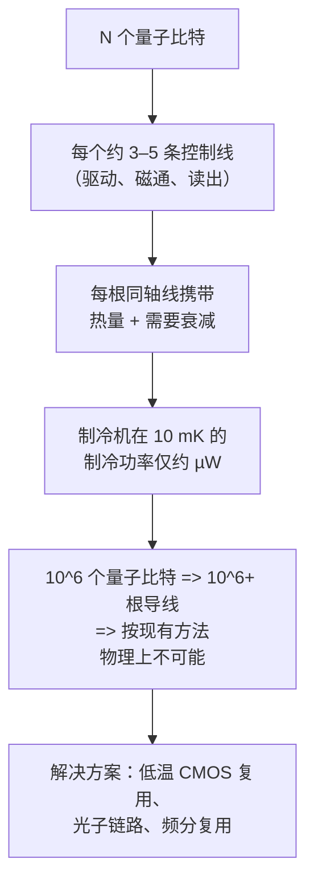

#### 4. 热负载问题的量化

每个超导量子比特大致需要一条微波驱动线（XY 控制）、一条磁通偏置线（Z 控制，用于可调量子比特/耦合器），以及一条读出线的一份分摊（文件 3，第 53 节）。每根同轴线：

- 从较热的级向较冷的级**传导热量**（金属是热导体）。可通过使用**热阻高而电导率高**的材料（例如不锈钢或超导 NbTi 同轴线，它们导电但热传导很差）以及在每一级对每条线进行**热锚定**（热沉）来缓解。
- 在置于低温级的**衰减器**中**耗散功率**（第 5 节），将热量直接沉积在这些级上。

粗略估计：每个配备完整的量子比特会给最冷的级带来约微瓦量级的热负载。在混合室预算约为数百 μW 至约 1 mW 的情况下，单台传统 DR 在热负载耗尽制冷功率之前，大约能支持 **约 100–1000 个量子比特**——这恰恰是当前大型处理器（IBM Condor 1121，文件 3）正在逼近的区间。要扩展到容错所需的**数百万物理量子比特**（文件 18），若采用每量子比特一根导线加室温电子学，是*不可能*的——布线瓶颈是一道事关生死的扩展壁垒，这推动了第三部分的各种解决方案。

#### 5. 衰减、热锚定与滤波

沿制冷机*向下*的信号链必须传递干净的控制信号，同时*不能*把室温热噪声带给量子比特：

- **衰减：**微波驱动线被大幅衰减（例如在 4 K 处 20 dB，在混合室处 20 dB），以抑制来自较热级的**约翰逊–奈奎斯特热噪声**（Johnson–Nyquist thermal noise）。衰减热噪声（以及信号本身，因此信号需要从室温以更高功率发出）可确保量子比特看到的是冷的电磁环境。但衰减器会将吸收的功率以热量形式*耗散*在其所在的级——这是噪声抑制与热负载之间的权衡（第 4 节）。
- **热锚定：**每条线和每个元件都与所在级的板进行热沉，使热量流向板（由制冷机带走），而不是继续向下传到量子比特。
- **滤波：** **低通滤波器和 eccosorb（微波吸收）滤波器**可滤除高频噪声，更重要的是滤除**红外光子**，否则这些光子会到达量子比特并把库珀对（Cooper pairs）打破成**准粒子**（quasiparticle，文件 3，第 52 节）——这是已知的限制 T₁ 的机制。在量子比特周围设置遮光、吸收红外的屏蔽是标准做法。

#### 6. 输出（读出）链与量子极限放大

*向上*的（读出）链必须在不引入噪声的前提下放大微弱的色散读出信号（仅几个微波光子，文件 3）：

- 位于混合室/低温级的**量子极限参量放大器**（JPA 或 TWPA，文件 3，第 38–39 节）——加入的噪声接近量子极限的最小值（半个光子），是实现快速单次读出的关键第一级放大。
- **低温 HEMT 放大器**（约 4 K）——一种半导体低噪声放大器，提供大部分增益。
- **室温放大与解调**——最终增益、IQ 解调、数字化。
- **隔离器/环形器**保护量子比特免受放大器反作用噪声的影响（低温级上体积庞大的微波元件，本身就是封装/扩展方面的挑战——用片上非互易元件取代它们是一个研究目标）。

这一放大链使快速、高保真度的读出成为可能，进而使实时纠错（文件 9，第 11 节）成为可能；而其每量子比特的元件（尤其是体积庞大的隔离器）则增加了封装和扩展的负担。

---

### 第三部分 — 低温 CMOS 与布线扩展方案

#### 7. 扩展问题的尖锐表述

容错超导机器需要约 10⁶ 个物理量子比特（文件 18）。按每量子比特约 3 根导线、每根导线对应一个室温控制通道计算，就是约 300 万根电缆穿过制冷机，以及约 300 万个室温电子学通道——在物理、热学和经济上都不可能。仅热负载一项（第 4 节）就会超出任何稀释制冷机容量数个数量级。**因此，解决布线/控制扩展问题对于容错而言，与提高量子比特保真度或降低纠错开销同样关键**——它是扩展中同等重要的支柱，而且*尚未解决*。主要途径如下：

#### 8. 低温 CMOS 控制

**低温 CMOS（Cryo-CMOS）**将经典控制电子学（DAC、复用器、信号生成，甚至部分数字逻辑）置于*低温级*（通常约 4 K，此处制冷功率约 1 W——远大于混合室），而不是室温。这大幅减少了从室温到 4 K 的电缆数量：不再是每个量子比特从室温起一路一根模拟电缆，而是用少量数字控制线把指令传给低温控制器芯片，由其在 4 K 就地*生成*大量模拟信号，只需从 4 K 到 10 mK 量子比特之间的短线。

- **Intel 的 Horse Ridge**（2019）和 Horse Ridge II 是领先的低温 CMOS 控制器芯片，可在低温下为多个量子比特生成微波控制信号——Intel 借助其 CMOS 制造专长（以及其自旋量子比特项目与 CMOS 的协同，文件 7）。
- **Google、Delft/QuTech 及其他机构**也在推进低温 CMOS 复用与控制。
- **挑战：**CMOS 电路必须在 4 K 下正常工作（晶体管行为在低温下会改变，需要重新表征和重新设计），并且——关键在于——扩展到许多通道时必须*耗散足够低的功率*，以保持在 4 K 级约 1 W 的预算之内（每通道功耗 × 通道数必须满足预算）。低功耗低温 CMOS 设计是关键的使能技术，而达到数百万量子比特所需的功率效率仍是一个活跃的、尚未解决的挑战。

#### 9. 复用

**复用（Multiplexing）**通过让多个量子比特共享线路来减少导线数量：

- **频域读出复用**（文件 3，第 11 节）已是标准做法：多个不同频率的读出谐振器共享一条馈线和一条放大链，每条线可读出 6–10 个以上的量子比特。
- **控制复用**（通过频分或时分复用在量子比特之间共享驱动/磁通线）更具挑战性（控制信号必须可单独寻址且保真度高），但为降低每量子比特的控制导线数量，正被积极研究。
- 复用因子直接降低导线数量和热负载，与低温 CMOS 相辅相成。

#### 10. 封装、互连与三维集成

物理封装方面的创新可缩减布线占用空间：

- **高密度互连：**用柔性印刷电路布线取代分立同轴线，使用高密度微波连接器。
- **三维集成/倒装焊**（文件 3，第 19 节）：将量子比特芯片与布线芯片分离，用铟凸点键合，并采用垂直互连（硅通孔）——使布线更密集而不会拥挤量子比特平面。
- **模块化多制冷机架构：**不使用一台巨型制冷机，而是通过量子互连（微波到光学转换或直接低温链路，第 11 节）连接*多台*稀释制冷机（每台容纳一个量子比特模块）——将量子比特数量和热负载分散到多台制冷机上。IBM 的模块化路线图（System Two，文件 3，19）即体现了这一思路。

#### 11. 量子互连与转换

连接各个独立的低温模块（或将量子计算机连接到网络，文件 15）需要在它们之间传递量子信息。**微波到光学转换**（microwave-to-optical transduction）——把超导量子比特的微波光子转换为可经室温光纤传输的光学光子，并能反向转换——是一项关键的使能技术（且在高效率上尚未解决），目前通过电光、压电光力学和原子转换器等途径进行研究。高效率、低噪声的转换将使模块化超导机器和联网量子计算（文件 15）成为可能，打破单制冷机的扩展上限。这是一个重要的研究前沿（文件 25）。

---

### 第四部分 — 室温控制栈

#### 12. 任意波形发生器与信号链

在室温（或越来越多地通过低温 CMOS 置于低温级），控制系统生成用于操控量子比特的模拟信号。对于超导及其他微波控制的量子比特，信号链为：

**数字波形存储 → DAC（数模转换器） → IQ 混频（上变频至 GHz 量子比特频率） → 放大 → 带衰减的低温传输。**

- **任意波形发生器（AWG）：**通过高速 DAC 从存储的波形存储器生成基带脉冲包络（整形高斯脉冲、DRAG 脉冲，文件 3）。
- **IQ 混频：**基带脉冲通过与本振混频上变频至量子比特频率（4–6 GHz），利用同相（I）和正交（Q）分量同时控制幅度和相位（实现文件 2 第 23 节的任意轴布洛赫球旋转）。IQ 不平衡和混频器非线性需通过校准消除。
- **直接数字合成（DDS）：**随着 DAC 采样率提升（达到数十 GS/s），这一替代方案日益受到青睐，它直接合成 GHz 信号而无需模拟 IQ 混频——减少模拟元件数量和校准负担。趋势是朝着更高速的 DAC 和更多的数字信号生成发展。

#### 13. 控制硬件供应商

有一个独立的产业在提供量子控制硬件（文件 20 有商业背景）：

- **Quantum Machines**（OPX 系统）——专门的量子控制栈供应商，拥有基于处理器的集成控制器（“Operator-X”），在脉冲生成之外还支持复杂的实时反馈和经典处理。
- **Zurich Instruments**（Rohde & Schwarz 旗下）——量子控制与读出仪器。
- **Keysight**——AWG、数字化仪和控制系统。
- **Qblox**——模块化控制仪器。
- **Quantware，以及提供定制控制的 FPGA 平台供应商。**

这些供应商提供了许多量子硬件团队和公司使用的“经典大脑”，而不必从零开始构建控制系统——一条日趋成熟的供应链（文件 24）。控制系统的规格（通道数、采样率、延迟、实时处理能力）直接决定了哪些实验（中途测量、自适应电路、纠错）是可行的。

#### 14. 基于 FPGA 的实时控制与低延迟反馈

要求最苛刻的控制需求是**低延迟实时反馈**，其用途包括：

- **中途测量与自适应电路**（文件 4、8）：测量部分量子比特，并根据结果*有条件地*施加后续门——要求控制系统在量子比特的相干预算内完成读出、处理和执行。
- **实时纠错**（文件 9，第 11 节）：*测量伴随式（syndrome）→ 放大/数字化读出 → 经典解码 → 施加条件纠正*这一往返过程必须在大约一个码周期内完成（超导约为 1 μs），以避免解码积压。

这通过**基于 FPGA（现场可编程门阵列）的控制器**来实现，它们在硬件中以亚微秒延迟完成读出解调、态判别和简单的条件逻辑。对于纠错，**解码器**（MWPM/Union-Find，文件 9）必须实时运行——在 FPGA 或专用 **ASIC** 上实现——这是一个软硬件协同设计的挑战，也是活跃的前沿（文件 25）。延迟预算极为严苛：对超导量子比特，整个反馈环路必须在约 1 μs 内完成；对较慢的技术路线（离子、原子，操作为毫秒量级），预算则较为宽松（慢速门对*解码延迟*问题是有利的，尽管它会损害吞吐量）。在数千至数百万逻辑量子比特的*规模*上进行实时解码——在延迟限制内处理庞大的总伴随式数据流——是该领域主要的未解决经典系统问题之一（文件 9、25）。

#### 15. 本振、相位噪声与频谱纯度

驱动量子比特的 GHz 信号必须频谱纯净：本振或合成信号上的**相位噪声**会直接使量子比特退相位（它与量子比特频率的涨落无法区分）并降低门保真度。因此高保真度的门需要低相位噪声的微波源，并且随着门保真度目标的提高，相位噪声指标也随之收紧。这与原子量子比特对激光线宽的要求（第六部分）类似——两种情况下，*控制场的相干性*都必须超过量子比特的相干性，控制才不会成为保真度的瓶颈。随着该领域向 99.99% 的门推进（文件 3），控制场的频谱纯度成为日益重要的限制因素，也是控制硬件供应商（第 13 节）竞争的一项指标。

---

### 第五部分 — 实时反馈与经典协处理器

**实时解码环路必须跟上 QEC 周期：**

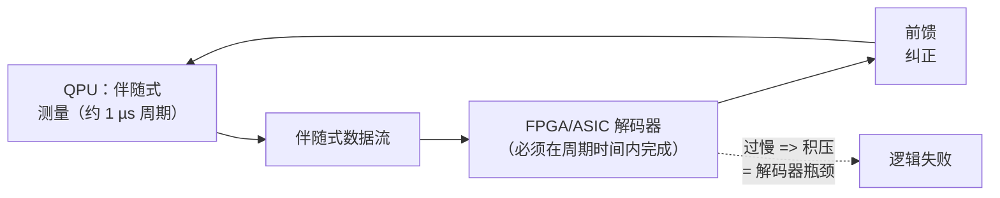

#### 16. 为什么经典协处理与量子计算密不可分

一个反复出现的主题：量子计算机与控制它的大型经典计算机*密不可分*。这个经典协处理器：

- **生成**脉冲波形（第 12–13 节）。
- **处理**读出信号（解调、态判别）。
- 实时**解码**纠错伴随式（第 14 节；文件 9）。
- **运行**变分算法中的经典优化器（文件 13）以及混合算法的经典部分。
- **编译**并调度电路（文件 8），有时是自适应的。

这套经典基础设施的规模随量子机器增长：百万量子比特的容错计算机需要规模相应庞大的经典控制与解码系统（数百万个控制通道、对海量伴随式数据流的实时解码）。因此，经典基础设施不是外围细节，而是量子计算机的*同等重要的组成部分*，其扩展（控制通道、解码算力、功耗和成本）与量子比特本身一样决定着可行性（文件 18、25）。这就是为什么“量子计算”在系统层面实际上是“量子–经典混合计算”，也是为什么本文件所述的控制/解码基础设施是头等的扩展问题。

#### 17. 解码延迟预算详解

对于实时表面码纠错（文件 9，第 11 节）：

- 伴随式提取每 **约 1 μs** 重复一次（超导周期时间，文件 3）。
- 解码器必须处理每一轮的伴随式并*平均而言*跟上这一速率，同时以有界延迟给出纠正，以避免不断增长的**积压**（“积压问题”：若解码慢于伴随式生成，队列会无限增长，保护即告失效）。
- 对于*单个*逻辑量子比特，快速解码器（FPGA 上的 Union-Find）可以满足要求。对于拥有数千个逻辑量子比特的*机器*，总伴随式速率极为庞大，需要*并行*解码（把解码问题分解到众多解码单元上）以及专用的**解码器 ASIC**——这是一个类似于 AI 加速器的新兴芯片设计细分领域（文件 25）。
- **对技术路线的依赖：**囚禁离子/中性原子的周期较慢（门/测量时间为毫秒量级），给出*更宽松*的延迟预算——这是慢速技术路线在解码延迟方面的优势，部分抵消了其吞吐量劣势（文件 4、5）。超导的快速周期是吞吐量优势，却是解码延迟方面的*挑战*。

在规模上解决实时解码——算法、FPGA/ASIC 实现以及并行化——是公认的重大开放问题，其难度很容易被低估（文件 25），因为它是隐藏在量子问题背后的一个*经典*系统问题。

---

### 第六部分 — 原子量子比特的激光系统

#### 18. 激光瓶颈

对于囚禁离子（文件 4）和中性原子（文件 5）量子比特，与超导布线瓶颈相对应的是**激光瓶颈**。这些量子比特*不需要低温*（一项重大优势），但每种操作类型都需要**多束精确稳定的激光**：

- **冷却激光**（多普勒冷却与亚多普勒/边带冷却）。
- **态制备（光泵浦）激光。**
- **再泵浦激光**（清除暗态）。
- **量子比特操控激光**（用于门的拉曼光束，或用于光学量子比特的窄线宽激光；用于中性原子的里德堡激发激光）。
- **探测激光**（荧光读出）。
- **囚禁激光**（用于中性原子的光镊；阱阵列）。

每一束都必须**频率稳定**（锁定到原子参考或超稳参考腔，对光学量子比特和里德堡激光有时需达到亚赫兹线宽）、**强度稳定**，并以稳定的光束指向**精确传送**到原子/离子上。管理这种光学复杂性——并将其扩展到带独立寻址的大量量子比特——是原子技术路线的核心扩展挑战，与布线瓶颈不同，但在精神上相类似。

#### 19. 激光稳频与频率参考

- **频率稳定：**激光通过 Pound–Drever–Hall 或类似的反馈被锁定到**原子/分子参考**或**超稳光学参考腔**（置于隔振、控温外壳中的高精细度腔），以获得高保真度门所需的窄线宽（kHz 至亚赫兹）。激光**相位噪声**会直接使原子量子比特退相位（文件 4、5），因此激光线宽往往是限制门保真度的因素——它是微波相位噪声的光学对应物（第 15 节）。
- **光学频率梳**可从一个参考提供多个稳定频率，简化多波长稳频。
- 同时工程化实现众多超稳光束是一项庞大的精密光学工程——这就是为什么原子量子比特系统虽然无需低温，却是光学上复杂的实验室规模装置。

#### 20. 光束传送、调制与寻址

- **声光调制器（AOM）**控制激光的幅度、频率和相位（让光在射频驱动的声波上衍射）——它是产生微波脉冲的 AWG/混频器的光学对应物（第 12 节）。施加到 AOM 的射频驱动*就是*门脉冲。
- **声光偏转器（AOD）**和**空间光调制器（SLM）**用于引导和整形光束，以实现**独立寻址**（作用于一个离子/原子而不干扰邻近者，文件 4），以及**光镊阵列生成与原子输运**（中性原子，文件 5）。
- **自由空间与光纤传送：**光束要么通过自由空间传送（精确但对对准敏感），要么通过光纤传送（更稳定、便于集成）。**集成光子学**——通过片上波导将激光导向离子/原子（文件 4，第 39 节）——是新兴的可扩展解决方案，是低温 CMOS 的光学对应物：以集成的、可制造的光学系统取代脆弱的、不可扩展的外部光学系统。原子量子比特集成光子学的进展是路线图的关键依赖项（文件 4、5、19、23）。

#### 21. 布线瓶颈与激光瓶颈的类比

值得深刻领会的结构性类比：**每一种可扩展的量子技术路线都面临经典控制扩展瓶颈，区别只在于物理领域。**

- **超导/自旋：** **布线瓶颈**——控制线把热量带入固定的低温预算；通过低温 CMOS、复用、三维集成、模块化制冷机来解决。
- **囚禁离子/中性原子：** **激光瓶颈**——大量稳定光束和寻址光学；通过集成光子学、可见光波长的原子种类、微波门（离子）以及共享/全局光学（原子）来解决。
- **光子：** **元件数量瓶颈**——数百万个低损耗光源/开关/探测器；（押注）通过硅光子代工制造来解决（文件 6）。

在每种情况下，*经典控制基础设施*——而非量子比特本身——都是一项、往往*就是*主导的扩展挑战，而解决方案都采取*集成*的形式（低温 CMOS、集成光子学、代工光子学）——用可制造、集成、可扩展的控制取代脆弱的、逐量子比特的、实验室规模的控制。这可以说是量子计算机扩展中最重要、也最被低估的主题：量子比特很难，但*控制基础设施*至少同样难，其集成是容错的同等重要的先决条件（文件 18、25）。

---

### 第七部分 — 屏蔽、真空、算例与基础设施供应商

#### 22. 磁屏蔽与隔振

除了温度和布线之外，量子比特还要求安静的电磁和机械环境：

- **磁屏蔽：**可调磁通的超导量子比特（文件 3）和自旋量子比特（文件 7）会被杂散磁场退相位——甚至地球磁场、附近的磁化元件以及 50/60 Hz 工频噪声。**坡莫合金（Mu-metal，高磁导率合金）**屏蔽层和**超导屏蔽层**（通过迈斯纳效应排斥磁场）包围量子比特区域。磁场噪声是对磁场敏感的量子比特的主要退相位来源，因此屏蔽直接影响相干性（文件 3、4、7）。
- **隔振：**机械振动（来自脉冲管制冷机本身以及建筑物）会调制量子比特的环境——麦克风效应噪声会使磁通/电荷漂移，并使光学对准抖动（对于原子量子比特）。稀释制冷机使用隔振支架和精心的机械设计；原子系统使用隔振光学平台和参考腔。脉冲管自身的振动是一个颇具讽刺意味的挑战——达到毫开尔文的制冷机同时也在晃动样品，需要仔细的隔离。
- **红外与辐射屏蔽：**遮光、吸收红外的外壳可阻止杂散光子（会产生准粒子，文件 3），而在极端情况下，还需要针对宇宙射线和环境放射性的辐射屏蔽（它们会引起关联错误突发，文件 3，第 52 节；文件 9）——这是大规模纠错中一个新兴的关切。

#### 23. 原子量子比特的真空系统

囚禁离子（文件 4）和中性原子（文件 5）量子比特需要**超高真空（UHV）**，通常 ≤10⁻¹¹ torr，以防止背景气体碰撞把量子比特踢出或加热。这要求：精心的腔室设计（低放气材料，文件 23）、烘烤（加热腔室以驱除吸附的气体），以及吸气剂/离子泵。许多系统采用**低温泵**（将腔室冷却至约 4–10 K，使残余气体冻结），以达到更低的压强和更长的量子比特寿命（囚禁离子可达数天至数周）。真空系统及其众多精确对准的光学视窗（用于众多激光束和成像，文件 5、23），是原子量子比特系统中重要的工程组成部分——相当于稀释制冷机对超导量子比特所起作用的原子路线对应物：一个提供量子比特所需纯净环境的大型精密外壳。

#### 24. 算例：热负载预算

考虑一台稀释制冷机，其混合室在 20 mK 下的制冷功率为 500 μW。假设每个量子比特的控制线在混合室处沉积约 1 μW 的热量（来自衰减器耗散和热传导，为一个代表性数字）。那么制冷机在耗尽制冷功率之前可支持约 500 个量子比特——与第 4 节约 100–1000 个量子比特的上限一致。现在考虑扩展到 10⁶ 个量子比特：按每量子比特 1 μW 计算，在 20 mK 处就是 1 W 的热负载——是**制冷预算的 2000 倍**，完全不可能。即使每量子比特热负载改善 100 倍（通过超导布线、更好的热锚定和复用），仍有 20 倍的差距。这就是为什么低温 CMOS（把控制移到 4 K 级，那里有约 1 W 可用）、激进的复用（更少的导线）以及*模块化多制冷机*架构（把量子比特分散到多台制冷机上）不是可选的优化，而是超导容错的*生存必需条件*（第 7 节）。这笔账毫不留情，也是布线/低温问题与量子比特保真度和纠错开销并列、成为扩展挑战同等重要支柱的原因（文件 18、25）。

#### 25. 算例：控制通道数量

一台 10⁶ 物理量子比特的超导机器，按每量子比特 3 个控制通道计算，需要 3×10⁶ 个控制通道。室温 AWG 通道成本高且占用大量空间（一个控制电子学机架可处理约数十至一百多个通道）。300 万个室温电子学通道将占满一栋大楼并耗资数十亿美元——显然不可行。低温 CMOS 集成（在 4 K 从少量数字输入生成大量通道）是唯一可行的路径，而它要求每通道的低温 CMOS 功耗低到使 3×10⁶ 个通道能放进 4 K 级约 1 W 的预算——即在 4 K 下**每通道亚微瓦**，这是一个要求极高的低功耗设计目标，尚未在规模上达到。这一计算量化说明了为什么控制电子学的*集成与功率效率*是容错的一个困难且未解决的共同前提——经典控制系统本身必须成为大规模集成、低功耗的低温芯片，本质上是一台工作在 4 K 的专用超级计算机（文件 18、25）。

#### 26. 基础设施供应商与供应链

一条专门化的供应链支撑着量子计算（文件 24）：

- **稀释制冷机：**Bluefors（芬兰，市场领导者）、Oxford Instruments 等——为几乎所有超导/自旋量子比特团队提供 DR。
- **低温元件：**低温放大器（HEMT 有 Low Noise Factory；TWPA/JPA 有多家）、衰减器、滤波器、电缆和连接器。
- **控制电子学：**Quantum Machines、Zurich Instruments、Keysight、Qblox（第 13 节）。
- **激光与光学：**Toptica、MSquared 等，提供原子量子比特所需的稳频激光。
- **低温 CMOS：**Intel（Horse Ridge）和新兴初创公司。

这一日益成熟的供应链本身就是该领域产业化的标志（文件 24）——量子硬件团队越来越多地购买标准化的基础设施（制冷机、控制系统、激光），而不是全部定制，这加速了进展，但也使供应链依赖集中化（例如稀释制冷机或稀缺资源 He-3 近乎垄断）。供应链方面的考虑——He-3 的可得性、低温元件的交付周期、控制电子学的扩展——是该领域扩展轨迹中的真实因素，也是国家计划与市场讨论的组成部分（文件 21、24）。

---

### 第八部分 — 深入探讨：低温 CMOS、解码器硬件与系统视角

#### 27. 低温 CMOS 深入

低温 CMOS（第 8 节）是解决超导布线瓶颈的主要希望，其工程很微妙：

- **4 K 下的晶体管物理：**CMOS 晶体管在低温下表现不同——阈值电压漂移、迁移率改变，并出现新效应（例如冻结效应、扭结效应）。标准单元库和模型是针对室温的；低温 CMOS 需要在 4 K 下*重新表征*晶体管行为，并常常需要重新设计电路。代工厂和研究团队正在构建低温器件模型。
- **功耗是约束瓶颈：**4 K 级提供约 1 W。为 N 个量子比特生成微波信号的低温 CMOS 控制器，每通道都会耗散功率（DAC、混频器、逻辑）；扩展到数百万通道需要*每通道亚 μW*（第 25 节）——远低于当前低温 CMOS 的功耗预算。超低功耗低温电路设计是成败攸关的挑战。
- **信号质量：**低温 CMOS 生成的控制信号必须匹配室温电子学的保真度（低相位噪声、精确的幅度/时序）——这对低温电路是要求很高的指标。
- **集成邻近性：**理想情况是将控制 CMOS 与量子比特*共同集成*（对自旋量子比特尤其自然，因为自旋量子比特本身与 CMOS 兼容，文件 7），从而消除大部分布线。对超导量子比特而言，控制 CMOS 位于 4 K 而量子比特位于 10 mK，因此仍有短线跨越这一间隙，但室温到 4 K 的电缆（问题的主体）大幅减少。

Intel 的 Horse Ridge（第 8 节）演示了这一概念；将其扩展到容错机器所需的功率效率和通道数，是一个未解决但正被积极追求的挑战——对超导扩展而言可以说与任何量子比特的改进同样重要（文件 18、25）。低温 CMOS 同时服务于超导*控制*和自旋量子比特*共同集成*的这种汇聚，是 Intel 双重押注（自旋量子比特 + 低温 CMOS）在战略上自洽的原因（文件 7、19）。

#### 28. 实时纠错的解码器硬件

实时解码挑战（第 14、17 节；文件 9）正在催生一个专门的硬件子领域：

- **FPGA 解码器：**目前的演示（Google、Riverlane、学术团队）在 FPGA 上实现了 Union-Find 和精简版 MWPM 解码器，对小型码达到约 1 μs 的延迟。**Riverlane**（英国）是一家专门构建解码器硬件/IP（“量子纠错栈”）的公司，走的是“卖铲子”路线（文件 20）。
- **ASIC 解码器：**对于整台机器的规模（数千个逻辑量子比特，总伴随式速率超出任何单个处理器的能力），很可能需要专用的**解码器 ASIC**——针对匹配/BP+OSD 解码计算优化的定制芯片——这是一个新兴的芯片设计细分领域（文件 25）。与 AI 加速器（针对特定的大规模并行工作负载的定制芯片）的类比十分贴切：纠错解码是一种专门化的、对延迟敏感的、高吞吐量的经典工作负载，通用 CPU 无法在规模上满足。
- **解码器/硬件协同设计：**解码器、控制系统和量子比特硬件必须协同设计，使反馈环路（测量 → 解码 → 纠正）在相干预算内闭合。经典解码硬件与量子硬件的这种紧密耦合，是容错系统工程的一个决定性特征，其难度（隐藏在量子问题背后的经典实时计算问题）很容易被低估。

#### 29. 完整的系统视角

将图景拼合起来，量子计算机是一个深度分层的*系统*：

1. 底层是**量子比特**（文件 3–7）——量子层。
2. **低温/真空**（本文件）提供纯净的环境（超导为 10 mK；原子为 UHV）。
3. **模拟控制传送**（布线/衰减/滤波，或激光束/光学）将信号传递给量子比特。
4. **信号生成**（AWG/混频器，或 AOM/激光）产生控制脉冲——集成度日益提高（低温 CMOS、集成光子学）。
5. **实时经典处理**（FPGA/ASIC 读出解调、态判别，以及——对纠错而言——解码），延迟在亚 μs 量级。
6. **高层经典控制**（编译、调度、变分优化，文件 8、13）。
7. **用户接口**（云访问，文件 12）。

各层必须一起扩展。拥有出色量子比特却控制/低温系统不足的机器无法扩展；*系统*以其*扩展最慢的层*的速度扩展，对超导而言目前是布线/低温/控制层（本文件），对原子而言则是激光/光学控制层。这一系统视角正是“它有多少个量子比特？”是一个如此不完整的问题的原因（文件 1、22）：量子计算机是一个协同扩展的量子–经典系统，其能力受整个栈制约，而不仅仅取决于量子比特数。

#### 30. 各技术路线的基础设施汇总

| 基础设施 | 超导 | 自旋 | 囚禁离子 | 中性原子 | 光子 |
|---|---|---|---|---|---|
| 量子比特温度 | ~10 mK（DR） | <100 mK–1 K（DR） | 室温（芯片 ~4–10 K） | 室温，UHV | 室温 |
| 辅助低温 | — | — | 真空/低温泵 | 真空 | SNSPD ~1–4 K |
| 主要瓶颈 | 布线/热负载 | 布线 + 均匀性 | 激光/光学 | 激光/光学 | 元件数量 |
| 控制信号 | 微波 + 磁通 | 电压 + 微波 | 激光/微波 | 激光 | 光开关 |
| 集成方案 | 低温 CMOS、复用 | 低温 CMOS 共同集成 | 集成光子学 | 共享/全局光学 | 代工光子学 |
| 实时反馈 | FPGA/ASIC，~1 μs 预算 | FPGA，预算紧张 | 较宽松（ms 级门） | 较宽松（ms 级操作） | 快速（基于测量） |
| 主要供应商 | Bluefors、Quantum Machines | Intel | Toptica、集成光子学 | SLM/AOD 光学 | GlobalFoundries（PsiQ） |

该表具体说明：*每一种*技术路线都面临重大的经典基础设施挑战，物理领域各异，但重要性普遍相同——并且这种基础设施的*集成*（低温 CMOS、集成光子学、代工光子学）是共同的解决形态，与量子比特质量并列为同等重要的扩展前提（文件 18、25）。

---

### 第九部分 — 历史、供应约束与更深入的激光工程

#### 31. 迈向毫开尔文的简史

稀释制冷机由 Heinz London 于 1951 年提出，并在 1960 年代首次实现。数十年来它一直是专门的低温物理工具。超导量子比特（文件 3）的兴起使其转变为工业设备：随着该领域发展，“干式”（基于制冷机、无液氦浴）稀释制冷机在商业上趋于成熟（Bluefors、Oxford Instruments），镀金板构成的“吊灯”成为量子计算的标志性形象。其工程已从单一实验的实验室制冷机，发展为面向连续运行、高布线密度以及（IBM 的 Goldeneye 和 System Two）超大容积以容纳更多量子比特和模块化芯片而设计的系统。这一轨迹——从物理学上的奇观到工业基础设施——映照了该领域更广泛的产业化（文件 24），而稀释制冷机的持续演进（更大、更高制冷功率、更高布线密度）是扩展中一个安静而关键的使能因素。

#### 32. 氦-3 供应约束

一个具体的供应链脆弱点：稀释制冷机的工作介质**氦-3（³He）**是*极其稀缺*的。³He 几乎完全作为氚衰变的副产品生产（氚在核反应堆中产生，历史上用于武器），因此其供应有限、地缘政治上集中，且不易扩大。随着量子计算扩展到数千台稀释制冷机（模块化容错机器可能需要许多台制冷机，第 10 节；并且每个超导硬件团队都需要制冷机），³He 的需求可能使供应紧张并推高成本。这是一个真实的、尽管讨论不足的扩展约束和供应链风险（文件 21、24）——提醒我们量子计算机的扩展不仅取决于物理和工程，也取决于稀缺物理资源的可得性。缓解措施包括 ³He 的回收/再利用（制冷机是闭循环的，但存在损耗）以及对节省 ³He 或替代冷却方法的研究。

#### 33. 更深入的激光工程

在第六部分基础上展开，原子量子比特的激光系统涉及大量精密工程：

- **二极管激光器与放大：**大多数原子量子比特所需的波长可由半导体二极管激光器获得（窄线宽采用外腔二极管激光器，ECDL），常需放大（锥形放大器）和倍频（通过非线性晶体获得蓝光/紫外波长）。达到紫外波长（某些离子如 369 nm 的 Yb⁺，文件 4，以及某些里德堡跃迁，文件 5，需要）要求多级倍频，面临效率和稳定性挑战——这是可见光波长的原子种类（Ba⁺，文件 4）颇具吸引力的原因之一。
- **参考腔：**为获得光学量子比特和里德堡激光所需的亚赫兹线宽，激光被锁定到超稳高精细度光学腔上，这些腔置于隔振、控温、有时是低温的外壳中——它们本身就是精密仪器（与光学钟技术共享，文件 16）。
- **光学分配：**通过自由空间光学或光纤将众多稳定光束传送到量子比特，用声光调制器（AOM）进行逐束控制，用 AOD/SLM 系统进行寻址和阵列控制（第 20 节）。囚禁离子或中性原子系统的光学平台是一个密集、精确对准的组件——相当于超导制冷机布线“吊灯”的原子路线对应物。
- **集成光子学**（第 20 节；文件 4、23）是可扩展的未来——在片上布设激光——可降低自由空间光学的复杂性，类似于低温 CMOS 减少布线。

#### 34. 算例：激光稳定性要求

考虑一个门时间约为 10 μs 的囚禁离子光学量子比特（文件 4）。要使激光相位不成为保真度瓶颈，激光的相干时间（线宽的倒数）必须远超门时间，理想情况下还要超过量子比特的相干时间。1 Hz 的激光线宽对应约 1 s 的相干时间——轻松超过 10 μs 的门，甚至超过较长的量子比特相干时间——但要达到亚赫兹线宽需要锁定到超稳参考腔（如上所述）。1 kHz 的激光线宽（相干时间约 1 ms）仍超过门时间，但可能限制长序列的相干性。这就是为什么光学量子比特和里德堡激光系统在激光稳频上投入巨大：*控制场的相干性必须超过量子比特的相干性*，这与超导量子比特的微波相位噪声要求（第 15 节）完全平行。这一教训在所有技术路线中是普适的：**经典控制场必须比它所控制的量子比特更“安静”**，而实现这一点——无论通过低相位噪声微波源还是亚赫兹线宽激光——都是高保真度的精密工程前提。

#### 35. 功耗、成本与占地

经典基础设施主导着量子计算机的*物理*占地、功耗和成本：

- 稀释制冷机加上其控制电子学占满一个房间；大型原子量子比特系统占据光学实验室规模的空间。
- 功耗主要由*经典*系统主导——制冷机压缩机（千瓦级）、控制电子学以及经典计算（解码、优化）——而不是量子比特（其能量尺度微乎其微）。从功耗角度看，量子计算机大部分是一台经典机器。
- 成本同样主要由基础设施主导：稀释制冷机（每台约 $0.5–3M）、控制电子学、激光和设施。

这具有战略含义（文件 18、24）：扩展量子计算机的*成本和功耗*在很大程度上就是扩展其*经典基础设施*——制冷机、控制通道、解码器、激光——的成本和功耗，这就是为什么基础设施集成（低温 CMOS、集成光子学）不仅对物理可行性，而且对经济可行性都至关重要。百万量子比特机器的成本和功耗将由其控制与低温系统主导，使该系统的效率成为容错量子计算在经济上是否切实可行（而不仅仅是物理上可能）的一阶决定因素。

---

### 第十部分 — 前沿问题、常见问题与扩展分析

#### 36. 前沿问题（基础设施方面）

与文件 25 交叉参照，经典基础设施的前沿问题有：

1. **规模化的低功耗低温 CMOS：**在 4 K 实现每通道亚 μW 的控制信号生成，使数百万通道符合制冷预算——超导扩展的约束瓶颈（第 25、27 节）。
2. **规模化的实时解码：**解码器 ASIC 和并行解码架构，在延迟限制内处理数千个逻辑量子比特的总伴随式数据流（第 14、28 节；文件 9）。
3. **微波到光学转换：**高效率、低噪声的转换，以实现模块化多制冷机和联网的超导机器（第 11 节；文件 15）——打破单制冷机上限。
4. **面向原子量子比特的集成光子学：**片上激光传送与控制，以驯服激光瓶颈（第 20、33 节；文件 4、5）。
5. **更高制冷功率、更高密度的稀释制冷机**以及节省 ³He 的冷却方式，以支持每台制冷机容纳更多量子比特（第 31–32 节）。
6. **模块化量子互连：**高保真度的芯片间和制冷机间链路，以扩展到单个模块之外（第 10–11 节；文件 3、15）。
7. **布线与封装密度：**三维集成、高密度互连和片上非互易元件（取代体积庞大的隔离器），以便在制冷机中容纳更多量子比特的控制（第 6、10 节）。

这些都是制约量子扩展的*经典*工程问题，在这些问题上的进展与量子比特保真度的提升同样关键——而以量子比特数量为中心的公众叙事（文件 22）系统性地低估了这一点。

#### 37. 常见问题

**问：量子比特芯片那么小，为什么制冷机那么大？**因为制冷机并非孤立地冷却这块小芯片——它必须提供分级冷却（多块板），容纳数千条经过热锚定/衰减的控制线、放大器、滤波器和屏蔽，并泵送 ³He/⁴He 循环。填满房间的是*创造并维持*毫开尔文低噪声环境、传送干净控制信号所需的基础设施，而不是量子比特。

**问：囚禁离子和中性原子真的能避开低温吗？***量子比特*可以（在室温真空中用激光冷却），这是真正的优势。但许多系统会把离子阱芯片冷却到约 4–10 K（为了真空和更低的加热），而且这些系统需要大型精密的激光/光学装置和 UHV 腔室——因此它们是用另一种同样庞大的基础设施（激光瓶颈，第 18 节）换掉了制冷机。“无需低温”并不意味着“无需基础设施”。

**问：布线瓶颈真的和量子比特保真度一样重要吗？**是的——它是同等重要的支柱。热负载和通道数的算术（第 24–25 节）表明，传统的每量子比特一套布线在物理上无法达到数百万量子比特；低温 CMOS 和复用是*必需*的，而非可选。一台量子比特完美却没有布线扩展方案的机器，无法在容错规模上建成。

**问：量子计算过程中，经典计算机在做什么？**做很多事（第 16 节）：生成脉冲、对读出进行解调和判别、实时解码纠错伴随式（文件 9）、运行变分优化器（文件 13），以及编译/调度（文件 8）。对于纠错，经典解码必须实时跟上伴随式提取的节奏——这是一项随量子机器扩展的艰巨经典计算任务。

**问：为什么不能直接用更多的制冷机？**模块化多制冷机架构（第 10 节）确实是关键策略，但它们需要制冷机之间的高保真度*量子互连*（第 11 节）——微波到光学转换或直接低温链路——而这些尚不成熟。而且每台制冷机内部仍面临其自身的布线瓶颈。模块化把问题分散了，但并未消除单台制冷机内部和制冷机之间的挑战。

**问：基础设施如何影响资源估算（文件 18）？**直接影响：低温制冷功率限定了每台制冷机的量子比特数；控制通道数和功耗决定经典电子学的规模；解码器延迟决定逻辑时钟速度；而技术路线的周期时间（快速的超导对比慢速的离子）则在吞吐量与解码延迟预算之间做权衡。这些基础设施参数与码开销和门保真度一同，是资源估算的输入。

#### 38. 扩展分析：协同扩展的必要性

本文件最深刻的教训是**协同扩展的必要性（co-scaling imperative）**：量子计算机的扩展速度只取决于其扩展最慢的层，而对于主流技术路线，该层目前是*经典控制与低温/光学基础设施*，而非量子比特。历史上，该领域关注量子比特数量和保真度（量子层），而基础设施被视为可解决的工程细节。但算术（第 24–25 节）表明，传统基础设施*无法*达到容错规模，而所需的集成（低温 CMOS、集成光子学、解码器 ASIC、转换）*本身*就是一组困难且尚未解决的问题。该领域的成熟（2020 年代）包括日益认识到**基础设施集成是与量子比特质量和纠错开销并列的同等重要的重大挑战**——这体现在以基础设施为中心的公司的出现（做解码器的 Riverlane、做控制的 Quantum Machines、做制冷机的 Bluefors、集成光子学方面的努力），也体现在明确针对控制/低温扩展的路线图（文件 19）中。评估某一技术路线或公司前景的分析者，不仅要权衡其量子比特指标，还要权衡其*基础设施扩展*计划：它是否有通向低温 CMOS 或集成光子学、规模化实时解码、模块化互连的可信路径？这些常被忽视的经典问题，对通往实用的路径的决定性，不亚于占据新闻头条的量子比特保真度。

#### 39. 算例：技术路线的时钟速度与解码

结合基础设施与纠错：超导表面码以约 1 μs/周期运行，因此距离为 d 的逻辑操作（约 d 个周期，文件 9）耗时约 d μs。在 d=25 时，即约 25 μs/逻辑门，而解码器必须以 1 μs/轮 ×（逻辑量子比特数）的速率处理伴随式——对于 1000 个逻辑量子比特，总计约 10⁹ 伴随式比特/秒，需要并行的 ASIC 解码（第 28 节）。囚禁离子机器的操作时间约为 1 ms，运行*同样*的逻辑操作要慢约 1000 倍（约 25 ms/逻辑门），但面临的解码延迟预算*宽松*约 1000 倍（每轮为 ms 而非 μs）——因此其解码器可以更简单/更慢。这种权衡——吞吐量快但解码延迟紧张（超导）对比吞吐量慢但解码宽松（离子）——是技术路线速度/质量权衡（文件 3、4）在基础设施层面的具体体现，并影响资源估算（文件 18）：超导容错机器运行算法更快但需要更难的解码硬件；离子机器运行更慢但解码更简单。两者并无绝对优劣——取决于应用是受时间限制，还是解码硬件是约束瓶颈。

---

### 第十一部分 — 组件深入探讨与术语表

#### 40. 低温放大器链，逐个组件

读出输出链（第 6 节）值得做组件层面的详述，因为它使纠错所依赖的快速单次读出成为可能：

- **参量放大器（JPA/TWPA）：**位于混合室（约 10 mK）或附近的低温级。JPA（约瑟夫森参量放大器）是窄带的（约数十 MHz）但达到量子极限；TWPA（行波参量放大器）是宽带的（约 GHz），可对多个量子比特进行复用读出（文件 3）。这第一级决定整体噪声性能——接近半个光子附加噪声的量子极限。它由强微波音泵浦，必须仔细偏置，并对其泵浦信号进行布线和滤波。
- **隔离器/环形器：**基于铁氧体的非互易元件，保护量子比特和参量放大器免受沿线路反射回来的噪声影响。它们*体积庞大*（厘米量级），在规模化时是封装瓶颈——用紧凑的片上非互易元件（基于约瑟夫森结的环形器）取代它们是一个研究目标。
- **HEMT 放大器：**位于约 4 K，是一种高电子迁移率晶体管半导体放大器，提供约 30–40 dB 增益，噪声较低（但未达量子极限）——是主力的第二级。
- **室温链：**进一步放大、IQ 解调（将 GHz 读出信号下变频至基带）和数字化（ADC），随后进行数字态判别（常用训练过的分类器区分 |0⟩/|1⟩ 读出点云，文件 3）。

每个元件都会增加延迟和噪声，而且每个量子比特（或复用组）都需要一条链——因此放大器链既是保真度的使能者，也是扩展的负担（体积庞大的隔离器、每组一个放大器）。改进它（集成非互易元件、更高复用度的 TWPA、更快的数字化仪）直接有助于扩展。

#### 41. 磁通控制与预失真

对于可调超导量子比特和耦合器（文件 3），**磁通偏置（Z 控制）**线携带直流 + 快速基带电流，用于设定量子比特/耦合器的频率。一个微妙之处在于：磁通线的频率响应会使快速磁通脉冲*失真*（该线路相当于一个具有自身传递函数的滤波器），因此量子比特看到的是预期波形的*失真*版本——降低门保真度。解决办法是**预失真**：测量线路的响应（通过“cryoscope”——把量子比特本身作为其所经历磁通波形的传感器），并对所施加的波形进行预失真，使量子比特看到预期的形状。Cryoscope 校准和磁通线预失真是实现高保真度可调耦合器门的标准且必不可少的技术（文件 3，第 33 节）。这是控制系统需要补偿其自身缺陷的一个例子——精密量子控制中一个反复出现的主题。

#### 42. 定时、同步与相位相干

大型量子处理器要求所有控制通道**精确同步**并**相位相干**：驱动不同量子比特的微波源必须共享共同的相位参考（例如使两比特门的相对相位有明确定义），并且各通道之间的脉冲时序必须对齐到亚纳秒精度。这需要公共时钟/本振分配网络以及对通道间延迟的仔细校准。随着通道数增长（第 25 节），在数百万通道间保持同步和相位相干是一项不平凡的系统挑战，这也是控制系统*集成*（低温 CMOS 配合共享的片上时钟分配）颇具吸引力的原因之一——与众多分立的室温仪器相比，集成使同步更容易。

#### 43. 术语表

- **稀释制冷机（DR）：**可持续达到约 10 mK 的闭循环 ³He/⁴He 制冷机；超导/自旋量子比特的工作环境。
- **混合室：**最冷的一级（约 10–20 mK），量子比特芯片安装于此；其微瓦量级的制冷功率决定了布线瓶颈。
- **脉冲管制冷机：**为“干式”DR 提供 4 K 级的机械制冷机。
- **制冷功率：**制冷机在某一级能带走的热量；4 K 时约 1 W，10 mK 时约 μW——关键约束。
- **布线瓶颈：**控制导线热负载与固定制冷功率共同决定的每台制冷机量子比特数上限。
- **低温 CMOS：**工作在低温（约 4 K）的经典控制电子学，用于减少室温布线（Intel Horse Ridge）。
- **复用：**在量子比特之间共享控制/读出线路（频域读出是标准做法）。
- **衰减/热锚定/滤波：**抑制热噪声、对线路热沉，并阻挡红外光子/准粒子。
- **TWPA/JPA/HEMT：**行波/约瑟夫森参量放大器（量子极限）和 HEMT（4 K）——读出放大器链。
- **AWG：**产生控制脉冲包络的任意波形发生器。
- **FPGA/ASIC 解码器：**在周期延迟预算内完成纠错解码的实时硬件。
- **微波到光学转换：**把微波量子比特信号转换为光学光子，用于模块化/联网链路。
- **激光瓶颈：**原子技术路线的对应物——大量稳定光束和寻址光学；通过集成光子学解决。
- **AOM/AOD/SLM：**用于激光控制和光束引导的声光调制器/偏转器和空间光调制器。
- **UHV：**用于原子量子比特的超高真空（≤10⁻¹¹ torr）。
- **³He 供应：**稀释制冷机稀缺的工作介质——供应链约束。
- **Cryoscope / 预失真：**测量并补偿快速脉冲的磁通线失真。

#### 44. 总结

每一台量子处理器背后都矗立着庞大的经典基础设施，对主流技术路线而言，它是主要的扩展瓶颈。超导和自旋量子比特需要稀释制冷至约 10 mK，微瓦量级的制冷功率限定了每台制冷机的量子比特数，并造成**布线瓶颈**——正通过低温 CMOS、复用、三维集成以及带量子互连的模块化多制冷机架构来解决（进行中）。原子量子比特避开了低温，但面临类似的**激光瓶颈**，即大量稳定光束和寻址光学，正通过集成光子学、可见光波长的原子种类以及共享/全局光学来解决（进行中）。室温（以及越来越多的低温）控制栈——AWG、混频器、量子极限放大器和 FPGA/ASIC 实时控制器——必须生成干净的脉冲，并在微秒内闭合“测量–解码–纠正”的反馈环路以实现纠错，由此催生了专门的解码器硬件子领域。经典基础设施主导着量子计算机的占地、功耗和成本，其扩展速度只取决于其集成的进度（低温 CMOS、集成光子学、解码器 ASIC、转换）——这使基础设施集成成为**与量子比特质量和纠错开销并列的同等重要的重大挑战**，而以量子比特数量为中心的叙事系统性地低估了这一点。评估某一技术路线或公司的分析者，必须像重视量子比特指标一样重视其基础设施扩展计划：通往容错的道路（文件 18）既要靠更好的量子比特，同样也要经过低温 CMOS、实时解码和集成光子学。读者应将协同扩展的必要性——量子计算机是协同扩展的量子–经典系统，受其最慢一层制约——带入资源估算（文件 18）、路线图（文件 19）和前沿（文件 25），在这些领域，经典基础设施的成熟是决定实用容错量子计算何时、乃至是否到来的核心因素。

*交叉参考：超导读出链、准粒子、磁通控制（文件 3）；囚禁离子激光与集成光子学（文件 4）；中性原子光学、SLM/AOD（文件 5）；SNSPD 探测器低温（文件 6）；自旋量子比特低温 CMOS 共同集成（文件 7）；纠错的实时解码（文件 9）；需要反馈的编译与自适应电路（文件 8）；含基础设施参数的资源估算（文件 18）；针对控制扩展的路线图（文件 19）；³He 与供应链（文件 21、24）；低温封装与真空材料（文件 23）；作为前沿的基础设施集成（文件 25）。*

---

### 第十二部分 — 扩展工程分析与更多算例

#### 45. 制冷机各级的热预算

要充分理解布线瓶颈，需要考察*每一*级的热预算，而不仅仅是混合室：

- **50 K 级：**制冷功率约数十瓦；室温到低温导线的热传导在这里沉积的热量最多，但制冷功率很大，因此可容忍许多导线。
- **4 K 级：**制冷功率约 1–2 W；低温 CMOS 控制电子学（如果使用）在此耗散，该级的预算限制了低温 CMOS 的通道数（第 27 节）。
- **蒸馏室（约 700 mK）：**制冷功率约毫瓦。
- **冷板（约 100 mK）：**制冷功率约数百 μW。
- **混合室（约 10 mK）：**制冷功率约数十至数百 μW——预算最紧。

每根导线必须在*每一*级进行热锚定（热沉，使热量流向板），并在 4 K 和混合室级放置衰减器以抑制热噪声（第 5 节）。设计需优化衰减在各级的分配，以在每一级预算下平衡噪声抑制与热负载——这是一个多级热工程优化。混合室预算最紧，但对低温 CMOS 而言 4 K 预算成为约束。理解*分级*热预算就能明白，解决方案不是“一个巧妙的窍门”，而是协同的重新设计——把控制移到 4 K（低温 CMOS）、通过复用减少导线数、通过超导布线减少热传导——每一项分别应对不同级的约束。

#### 46. 算例：超导与常规金属布线的热负载

导线在各级之间传导热量的速率由其热导率和几何形状决定（傅里叶定律）。**常规金属**同轴线（如铜）导热良好（不利——热负载高），同时导电也好（有利——信号损耗低）。**超导**同轴线（NbTi）以零电阻导电（有利），但在其临界温度以下*导热*很差（有利——热负载低），因为在超导态下，热导率的电子贡献被抑制（维德曼–弗兰兹定律失效——库珀对携带电荷但不携带熵/热量）。因此超导 NbTi 同轴线非常适合*低温*段（低于 NbTi 约 9 K 的临界温度）：它以低损耗传递信号，同时传导很少热量。这就是为什么最冷的布线段使用超导电缆——这一材料选择（文件 23）直接针对热负载预算。权衡在于：超导电缆只能用于温度低于其临界温度之处，所以较热的段使用电阻性材料（不锈钢），选择其*低热导*，代价是一定的信号损耗（通过从室温施加更高功率来补偿）。这种逐段的材料优化是低温布线工程的核心部分。

#### 47. 算例：读出复用的扩展

频域读出复用（文件 3，第 11 节；第 9 节）让多个量子比特共享一条馈线和一个 TWPA。假设 TWPA 带宽约 4 GHz，每个量子比特的读出谐振器占据约 50 MHz 的频谱（为避免串扰所需的频率间隔）。那么一条馈线+TWPA 原则上可读出约 4000 MHz / 50 MHz ≈ **约 80 个量子比特**（实际上由于串扰、功率和校准限制更少，约 6–20 个，但趋势是朝更高复用度发展）。这一复用因子使读出导线数和放大器数直接减少约 10 倍，显著缓解*读出*部分的布线瓶颈。将类似的复用扩展到*控制*（驱动/磁通）线——更难，因为控制必须可单独寻址且保真度高——是关键的研究方向（第 9 节）。复用因子是每台制冷机量子比特数的直接杠杆：复用度越高，每根导线对应的量子比特越多，每份制冷预算对应的量子比特也越多。

#### 48. 算例：解码器吞吐量

量化实时解码挑战（第 14、28 节）。距离为 d 的表面码逻辑量子比特每个周期产生约 d² 次稳定子测量，周期约 1 μs。对于 d=25，即约 625 个伴随式比特/μs = 6.25×10⁸ 比特/秒*每个逻辑量子比特*。对于 1000 个逻辑量子比特的机器，总计约 6×10¹¹ 伴随式比特/秒——这股洪流必须以有界延迟解码以避免积压（第 17 节）。没有单个 CPU 能处理这样的量；解决方案是*空间并行*（每个逻辑量子比特的伴随式由其自己的解码单元解码，仅在逻辑门边界进行通信），并在 FPGA/ASIC 中实现（第 28 节）。这一吞吐量计算量化说明了为什么规模化实时解码是真正未解决的问题（文件 9、25），以及为什么专用解码器芯片正在出现——经典解码负载随量子机器扩展，且很容易被低估。它是协同扩展必要性（第 38 节）的一个醒目例证：一台百万物理量子比特的机器意味着相应庞大的*经典*实时解码系统。

#### 49. 规模化基础设施的经济学

推演到容错机器（文件 18）：如果一台机器需要，比如 20 台制冷机（模块化，第 10 节），每台约 $2M，仅制冷机就约 $40M；再加上数百万个控制通道（低温 CMOS 芯片，其成本取决于良率和集成度）；再加上大型解码器 ASIC 系统；再加上激光（若为原子）或完整的微波栈（若为超导）；再加上设施、供电和冷却。*经典基础设施*——而非量子芯片——主导着这一成本，其*扩展经济学*（机器增长时每量子比特的成本）完全取决于*集成*：定制的、分立的基础设施扩展经济学很糟（每量子比特成本线性增长或更糟），而集成的基础设施（规模化制造的低温 CMOS 芯片、晶圆上的集成光子学）可能实现有利的每量子比特成本扩展，使大型机器在经济上可行。这就是为什么*制造*论点（光子学的代工押注，文件 6；自旋量子比特的 CMOS 押注，文件 7；以及低温 CMOS/集成光子学的控制集成，本文件）在战略上如此核心：它们都是押注*集成*将同时带来物理可行性*和*容错量子计算所需的有利成本扩展。因此，评估通往实用之路的分析者（文件 18、24）不仅要评估基础设施*能否*建成，还要评估能否*在规模上经济地*建成——这既是物理问题，也是集成和制造问题。

#### 50. 结语分析

量子计算的经典基础设施是该领域巨大的隐藏挑战——不如量子比特物理那样光鲜，但对通往实用之路的决定性同等重要。稀释制冷机的微瓦制冷预算和原子系统的激光复杂性设下了传统的每量子比特控制无法逾越的硬性扩展上限；解决方案（低温 CMOS、集成光子学、复用、模块化互连、解码器 ASIC、转换）本身就是困难的、部分尚未解决的集成问题；而且基础设施主导着机器的占地、功耗和成本，使其*经济*扩展与其物理可行性同样重要。协同扩展的必要性——量子计算机的扩展速度只取决于其最慢的层，对主流技术路线而言目前是经典基础设施——重新定义了扩展挑战：仅仅构建更好的量子比特是不够的；还必须同时构建集成的、低功耗的、可制造的经典控制与冷却系统，使其能在热、延迟和成本预算之内，向数百万量子比特传送控制并从中提取伴随式。本文件的教训——“枯燥”的经典基础设施实际上是核心的重大挑战——应当重新校准对量子计算进展的任何评估：要像关注量子比特数量和保真度一样紧密地追踪制冷机、控制通道集成、解码器硬件以及激光/光子集成，因为通往实用容错量子计算的道路（文件 18、19、25）需要它们一同走通。

---

### 第十三部分 — 补充主题与读者要点

#### 51. 光子探测器的低温

光子量子计算（文件 6）常被描述为“室温”，但其**探测器**——超导纳米线单光子探测器（SNSPD）——需要**约 1–4 K** 的低温。这一要求比超导量子比特的 10 mK 温和（更简单的低温恒温器，通常是不含完整稀释级的闭循环 4 K 制冷机），但并非为零。对于拥有数百万探测器的大型光子机器（文件 6），集成并冷却如此多的 SNSPD 并读出其信号，本身就是相当大的低温与电子学挑战——是应用于探测器的布线瓶颈的光子对应物。因此光子学对低温的摆脱是*部分的*：量子比特（光子）是室温的，但探测器是冷的，规模化的探测器集成/冷却是真实的基础设施问题（文件 6、23）。这一细微之处对诚实的跨技术路线比较（文件 7）很重要：在规模上，没有任何主流技术路线完全不需要低温。

#### 52. 无隔离器与片上非互易架构

保护量子比特免受放大器反作用影响的体积庞大的铁氧体隔离器/环形器（第 40 节）是封装瓶颈——厘米量级的元件，每条读出链一个或更多，挤占制冷机空间。一个研究方向是构建**片上非互易元件**——集成到量子比特或读出芯片上的基于约瑟夫森结的环形器和定向放大器——用紧凑的集成元件取代笨重的铁氧体。这方面的成功将显著缓解封装密度（在相同的制冷机体积内容纳更多量子比特的读出），并属于更广泛的集成主题（低温 CMOS、片上放大器、片上隔离器）的一部分，后者缩小每量子比特的基础设施占地。这是一个很好的例子，说明*封装和元件集成*——而不仅仅是量子比特或码的改进——对扩展至关重要，也说明该领域如何逐步把曾经笨重的分立实验室元件集成到芯片上。

#### 53. 与经典超级计算机基础设施的比较

一个富有启发的比较：大型经典超级计算机或数据中心同样由*基础设施*主导——供电（兆瓦级）、冷却（冷冻水/空气）、互连和物理占地——计算芯片只占系统总成本/功耗/空间的一小部分。量子计算机遵循同样的模式，且*更为极端*：冷却（冷至毫开尔文，而不只是低于环境温度）、控制布线和经典协处理占主导，而量子比特芯片很小。这一类比表明，量子计算机的扩展，与经典超级计算机的扩展一样，既是一门*基础设施与系统集成*的学科，也是器件物理的学科——而掌握*系统集成*（而不仅仅是量子比特物理）的公司和国家计划将占据优势（文件 19、20、21）。这也表明，量子–经典*混合*基础设施（与经典 HPC 紧密集成的量子协处理器，文件 25）是自然的部署模式，让量子和经典部分共享冷却、供电和互连基础设施。这种系统层面的框架——量子计算是对经典计算基础设施的、专门化的、重基础设施的补充，而非独立的替代品——是对“量子计算机”想象图景的一个务实纠正（文件 25）。

#### 54. 控制系统作为真正的产品接口

从用户的角度（文件 12）看，控制系统*就是*量子计算机——云接口与之对话的正是它。当用户提交一个电路（文件 12）时，控制系统将其编译为脉冲、生成模拟波形、在任何实时反馈下执行电路、读出并返回结果。控制系统的能力（通道数、实时反馈、中途测量、纠错支持）决定了用户能做什么，而其校准状态（会漂移，文件 3、8）决定了结果的质量。因此，控制系统虽然是“经典基础设施”，同时也是抽象量子计算机与用户之间的*功能接口*——这是它居于核心而非外围的又一理由。控制系统的成熟（从定制的实验室搭建，到标准化的、由供应商提供的、与云集成并基于原语执行的平台，文件 12）是该领域产品化的关键部分（文件 24）。

#### 55. 文件 11 的读者要点

当你评估某一量子计算技术路线、公司或路线图时，要越过量子比特数量和保真度，关注*基础设施扩展*的故事：

- **冷却：**该技术路线需要稀释制冷（超导/自旋），还是“仅”需真空/激光（原子），或探测器低温（光子）？每台制冷机（或每套光学系统）的量子比特数上限是多少，模块化扩展计划是什么？
- **控制集成：**是否有可信的低温 CMOS（超导/自旋）或集成光子学（原子）方案，以在规模上摆脱布线/激光瓶颈，并达到所需的功率效率？
- **实时解码：**是否有在规模上、在该技术路线延迟预算内进行实时纠错解码的方案（FPGA/ASIC 解码器）？
- **互连：**对于模块化扩展，是否有量子互连（转换、光子链路）方案？
- **成本/功耗/供应：**什么主导成本和功耗（将是基础设施），是否存在供应链风险（³He、低温、控制电子学）？

这些基础设施问题——制冷上限、控制集成、解码硬件、互连以及成本/功耗/供应——对通往实用之路的决定性不亚于量子比特指标，而在以量子比特数量为中心的叙事中却被系统性地低估。提出这些问题的分析者（并结合文件 3–7 的硬件评估方法、文件 9 的 QEC 评估方法以及文件 22 的基准测试怀疑态度），将对某一技术路线或公司的真实前景形成准确得多的图景。经典基础设施并非量子计算中枯燥的部分——它是同等重要的重大挑战，掌握它是本数据库其余部分所描述的容错未来的前提。

---

### 第十四部分 — 更多算例与定量扩展模型

#### 56. 一个简单的每台制冷机量子比特数模型

为超导量子比特的每台制冷机量子比特数建立一个粗略估算模型。设混合室制冷功率为 P_cool（比如 500 μW），每个量子比特的低温级热负载为 h（来自衰减器耗散和热锚定后的残余传导）。取每量子比特热负载 h ≈ 1 μW（在良好热锚定和适中读出功率下的代表值），上限为 N_max ≈ P_cool/h ≈ 500 个量子比特。现在应用各个杠杆：

- 将读出**复用** 10 倍，降低读出对 h 的贡献，也许使 h 减半 → N_max ≈ 1000。
- **低温 CMOS** 将信号生成移到 4 K（那里的制冷功率大约大 2000 倍），因此每量子比特在混合室的负载降至仅短的 4K→10mK 线路的贡献——可能 h ≈ 0.1 μW → 每台制冷机 N_max ≈ 5000。
- **模块化多制冷机**，M 台制冷机 → 总共 M × N_max 个量子比特，受制冷机间互连质量限制（第 11 节）。

要达到 10⁶ 个量子比特：即使按每台制冷机 N_max = 5000（乐观的低温 CMOS），也需要约 200 台通过高保真度量子互连连接的制冷机——一个庞大但并非不可想象的设施，*前提是*低温 CMOS 达到该每量子比特热负载*并且*互连成熟。该模型具体说明，容错超导扩展需要*三个*杠杆（复用、低温 CMOS、模块化互连）*同时*起作用——单独一个都不够——并量化说明了为什么每一个都是硬性要求而非优化（第 7、45 节）。

#### 57. 原子技术路线的扩展模型

对于原子量子比特，扩展模型不同——由*光学*而非热量决定：

- **中性原子**（文件 5）：一束全局控制激光驱动所有门；限制在于阱激光功率（每约 1000 个原子几瓦）以及光学视场/像差。扩展到 10⁴–10⁵ 个原子需要约 10–100 倍的激光功率和更大的经校正光学系统——这是一个光学工程问题，比超导的热负载壁垒更软。独立寻址光学（AOD 通道）随*同时被寻址*的原子数而非总数扩展，而集成光子学（第 33 节）是长期可扩展的传送方式。
- **囚禁离子**（文件 4）：限制在于每离子的激光/寻址复杂性以及穿梭/联网开销（文件 4）；集成光子学和微波门是扩展路径。模块化光子互连连接离子模块。

关键的结构性对比：超导扩展受*固定热预算*限制（一道硬壁垒，需要通过集成把控制移到较暖的级），而原子扩展受*光学复杂性*限制（一道较软的壁垒，因为大部分控制是全局/共享的，但对独立寻址仍需要集成）。两者都以*集成*为解决之道，但原子技术路线更大的*原始*扩展余地（全局控制，没有热壁垒）是中性原子保持量子比特数量纪录的原因之一（文件 5）——其基础设施在原始数量上扩展得更平缓，尽管保真度和其他因素会使这一优势打折扣。

#### 58. 算例：冷却一个逻辑量子比特的成本

将基础设施成本与 QEC 开销（文件 9）结合。一个距离为 25 的表面码逻辑量子比特需要约 1250 个物理量子比特（文件 9）。按超导每台制冷机约 1000–5000 个量子比特（第 56 节），单个逻辑量子比特就占据制冷机相当可观的一部分，而 1000 个逻辑量子比特的机器需要约 250,000–1,250,000 个物理量子比特 → 约 50–1250 台制冷机（取决于低温 CMOS 的成败），即一个大型设施。采用开销更低的 qLDPC 码（文件 9，物理量子比特约少 10 倍）或偏置噪声猫态量子比特，制冷机数量会按比例下降——这是纠错开销降低（文件 9）与基础设施扩展（本文件）*相乘*以决定可行性（文件 18）的另一种方式。这一计算将三大同等重要的支柱——量子比特保真度（决定 d）、码开销（决定每逻辑量子比特的物理量子比特数）和基础设施（决定每台制冷机的量子比特数）——整合为单一的可行性估算，并表明改进其中*任何一项*（更高保真度 → 更小的 d；更好的码 → 更少物理量子比特；更好的低温 CMOS → 每台制冷机更多量子比特）都会降低设施规模。这种相乘的相互作用是资源估算（文件 18）的本质，也是没有任何单一指标（量子比特数、保真度或制冷机大小）能刻画通往实用之路的原因。

#### 59. 为什么“多加几台制冷机”并不简单

模块化多制冷机的答案（第 10、56 节）听起来简单，却隐藏着一个难题：**制冷机间的量子互连**。把量子比特的状态从一台制冷机转移到另一台，需要直接的低温微波链路（距离有限，且两端都必须是冷的），或者**微波到光学转换**（第 11 节）——把微波量子比特信号转换成光学光子，经室温光纤传到另一台制冷机，再转回微波。高效率、低噪声的转换*尚未解决*——当前的转换器效率低且会增加噪声，不足以支持制冷机之间的高保真度逻辑操作。在转换（或替代互连）成熟之前，模块化扩展受到限制，单制冷机上限（第 56 节）依然有效。这就是为什么微波到光学转换是关键的、制约路线图的研究问题（第 11、36 节；文件 25）：它既是模块化超导扩展*也是*联网量子计算（文件 15）的使能因素，其难度意味着“多加几台制冷机”是一个研究计划，而非交钥匙方案。

#### 60. 最终综合与后续指引

经典基础设施——稀释制冷、低温布线、放大器链、控制电子学、实时解码器以及激光/光学系统——是量子计算运行的基底，并且对主流技术路线而言是其主要的扩展瓶颈。微瓦级制冷预算造成布线瓶颈；激光复杂性造成其原子对应物；而解决方案——低温 CMOS、集成光子学、复用、模块化互连、解码器 ASIC 和转换——是困难的、部分尚未解决的集成问题，它们对容错量子计算的物理可行性、经济可行性和时间表的决定作用，不亚于量子比特质量和纠错开销。这里阐述的协同扩展必要性和三大支柱（保真度、码开销、基础设施）的相互作用，直接输入资源估算（文件 18），在那里这些参数组合成具体的机器规格；也输入路线图评估（文件 19），在那里公司或技术路线的基础设施扩展计划是可信度的一阶决定因素。带着本文件的核心教训前行的读者——“枯燥”的经典基础设施是同等重要的重大挑战，其*集成*是共同的解决形态，也是实用的前提——将比只追踪量子比特数量的人更准确地评估该领域的进展和前景。请继续阅读文件 12，了解位于该基础设施之上的软件栈；阅读文件 18，了解将基础设施、码和保真度组合成定义通往实用量子计算之路的物理量子比特数和运行时间数字的资源估算。

> **文件 11 的一段话总结。**量子计算机是一个协同扩展的量子–经典系统，其*经典*基础设施——毫开尔文稀释制冷（超导/自旋）或稳频激光/UHV 系统（原子）或低温探测器（光子），加上控制电子学、量子极限放大器和实时解码器——对主流技术路线而言是主要的扩展瓶颈。稀释制冷机的微瓦级制冷预算限定了每台制冷机的量子比特数并造成布线瓶颈；原子量子比特面临类似的激光瓶颈；两者都通过*集成*（低温 CMOS、集成光子学、复用、模块化互连、解码器 ASIC、微波到光学转换）来应对，而集成本身是一组困难的、部分尚未解决的问题，它们对容错的物理可行性、成本和时间表的制约不亚于量子比特质量和纠错开销。基础设施集成是同等重要的重大挑战，被以量子比特数量为中心的叙事系统性地低估，并且是通往实用之路上最重要的“隐藏”决定因素。

---

### 附录 — 代表性基础设施参数与设计经验法则

#### 代表性参数（当前时期；需重新核实）

| 参数 | 代表性数值 |
|---|---|
| 超导量子比特温度 | 10–20 mK |
| 自旋量子比特温度 | <100 mK – 1 K |
| 离子/原子量子比特温度 | 室温（阱芯片有时为 4–10 K） |
| SNSPD 探测器温度 | 1–4 K |
| 混合室制冷功率 | ~10–1000 μW |
| 4 K 级制冷功率 | ~1–2 W |
| 衰减（驱动线） | ~40–60 dB，分布在各级 |
| 参量放大器附加噪声 | ~½ 光子（量子极限） |
| 每量子比特控制通道数（SC） | ~2–3（驱动、磁通、共享读出） |
| 读出复用因子 | 每条馈线 ~6–20 个量子比特（在增长） |
| 实时解码延迟预算（SC） | 每周期 ~1 μs |
| 每台制冷机的量子比特数（当前） | ~100–1000（传统布线） |
| 稀释制冷机成本 | ~$0.5–3M |
| 激光线宽（光学量子比特/里德堡） | kHz 至亚 Hz（腔稳定） |
| UHV 压强（原子） | ≤10⁻¹¹ torr |

#### 设计经验法则

1. **控制场必须比量子比特更“安静”**（微波相位噪声/激光线宽低于量子比特限制相干性的尺度）——否则是控制噪声而非量子比特限制保真度（第 15、34 节）。
2. **热负载随导线数量增长；10 mK 下的制冷功率几乎固定**——因此每台制冷机的量子比特数有上限，需要低温 CMOS + 复用 + 模块化制冷机才能扩展（第 4、24、56 节）。
3. **低温 CMOS 受 4 K 功率预算限制**——对数百万通道，目标是每通道亚 μW（第 25、27 节）。
4. **解码必须跟上伴随式提取的节奏**——在周期延迟预算内使用实时 FPGA/ASIC 解码器，并跨逻辑量子比特并行化（第 14、48 节）。
5. **超导布线用于 T 低于材料临界温度之处**——低信号损耗且低热传导（第 46 节）。
6. **每条向下的线路都必须在各级进行衰减、热锚定和滤波**，以传递干净信号，而不把热噪声或红外光子带给量子比特（第 5 节）。
7. **模块化扩展需要量子互连**（转换或光子链路），尚未成熟——“多加几台制冷机”是一个研究计划（第 59 节）。
8. **集成是普适的解决形态**——低温 CMOS、集成光子学、解码器 ASIC、片上非互易元件——用可制造的集成系统取代定制的分立基础设施，兼顾物理可行性与成本扩展（第 38、49 节）。

这些参数和规则是本文件的实用提炼：系统工程师用它们来估算机器的每台制冷机量子比特数、控制通道数、解码负载和扩展路径，它们也是文件 18 资源估算的输入。结合协同扩展的必要性（机器的扩展速度只取决于其最慢的层，目前是经典基础设施），它们使读者能够评估任何技术路线或公司的真实扩展前景——越过量子比特数量，看到真正决定实用容错量子计算是否以及何时到来的制冷机、控制集成、解码器和互连。

> **跨技术路线的结语。**无论瓶颈是稀释制冷机的微瓦级制冷预算、离子阱的数十束稳频激光束、中性原子阵列的光学视场，还是光子机器的数百万个低温探测器，模式都是相同的：*经典控制和环境基础设施*的扩展性比量子比特本身更差，只有*集成*——把控制移到芯片上（低温 CMOS）、波导上（集成光子学）或代工工艺中（硅光子学）——才能扭转扩展曲线。这是文件 11 的统一洞见，也是读者在评估文件 3–7 的硬件版图中的任何一点以及文件 19 的任何路线图时，应当把“控制和冷却将如何扩展？”视为与“量子比特有多好？”同等重要问题的原因。

---

<a id="f12"></a>

## 文件 12：量子软件栈——从算法到脉冲

> 📄 **原文链接（English original）：[12_quantum_software_stack_and_compilers.md](12_quantum_software_stack_and_compilers.md)**　｜　[↑ 返回目录](#toc)


> **⭐ 核心文件。** 本文件完整阐述量子软件栈——即把高层算法转化为硬件上物理操作的分层工具集——并着重说明为什么该软件栈从根本上比经典软件栈更为"泄漏"（物理噪声必须穿过多个层次向上暴露）。内容涵盖主要的电路级框架（Qiskit、Cirq、PennyLane、Q#、TKET、Braket）、超越基础转译（transpilation）的编译器内部机制、跨平台中间表示（OpenQASM、QIR）、主导 NISQ 软件的变分/混合执行模式，以及塑造真实工作流的云端执行与排队现实。本文件以文件 8（编译技术）为基础，并与文件 13（算法）、文件 9/18（容错软件与资源估算）以及文件 20（这些工具背后的公司）相联系。

---

### 第一部分——全栈分层

**量子软件栈——从用户意图到物理脉冲：**

```mermaid
flowchart TB
    APP["应用 / 领域库<br/>（化学、金融、机器学习）"] --> ALG["算法层<br/>（VQE、QAOA、Shor）"]
    ALG --> SDK["电路 SDK<br/>（Qiskit、Cirq、PennyLane）"]
    SDK --> IR["中间表示<br/>（OpenQASM、QIR）"]
    IR --> COMP["编译器 / 转译器<br/>（TKET、Qiskit transpiler）"]
    COMP --> PULSE["脉冲层<br/>（OpenPulse、波形）"]
    PULSE --> HW["控制电子学 -> QPU"]
```

#### 1. 分层模型

量子程序会逐级下降穿过一组抽象层，每一层都把程序向物理执行推进一步：

1. **应用 / 算法层：** 问题及量子算法（Shor、VQE、QAOA、量子模拟；文件 13），以高层术语表达（要模拟的分子、要求解的优化问题）。
2. **电路描述：** 算法被表达为量子电路——作用于量子比特的门（文件 2）。各框架提供电路构建 API（Qiskit 的 `QuantumCircuit`、Cirq 的 `Circuit`）。
3. **逻辑到物理的映射与路由：** 将抽象量子比特分配给物理量子比特，并为满足连通性而插入 SWAP 网络（文件 8）。
4. **硬件原生门分解：** 分解为器件的原生门集（CZ/MS/Rydberg + 旋转；文件 8）。
5. **脉冲级控制：** 每个门对应一个经校准的模拟脉冲（文件 8、11）。
6. **经典控制电子学：** 产生波形的 AWG/激光器（文件 11）。
7. **物理量子比特：** 硬件本身（文件 3–7）。

软件工具作用于特定层：SDK（Qiskit、Cirq）横跨第 2–4 层；转译器/编译器（TKET、Qiskit transpiler）负责第 3–4 层；脉冲工具（Qiskit Pulse）触及第 5 层；控制系统软件（文件 11）负责第 6 层。贯穿各层的是中间表示（OpenQASM、QIR，第四部分），它们使各工具能够跨层、跨厂商互操作。

#### 2. 为什么量子软件栈是"泄漏"的

经典软件工程崇尚**清晰的抽象**：程序员编写高层代码而无需了解晶体管物理，因为每一层（语言 → 编译器 → ISA → 微架构 → 晶体管）都*完全抽象*了其下一层。量子软件栈**无法**实现这种清晰分离，而理解*为何如此*是量子软件工程的核心：

- **物理噪声是异质的，且必须向上暴露。** 不同的量子比特和门有不同且会漂移的错误率（文件 3、8）。**噪声感知编译**（文件 8，第 11 节）要求编译器查询实时的逐量子比特/逐门校准数据——因此*物理噪声特性向上泄漏*到了编译层，违背了清晰抽象。量子"编译器"必须知道*今天*哪些物理量子比特是好的。
- **连通性约束向上泄漏。** 硬件的连通图（文件 8）塑造了路由，甚至影响算法设计（选择适合该连通性的拟设 ansatz），因此硬件拓扑在算法层是可见的。
- **校准漂移**（文件 3、8）意味着程序所面向的"硬件"是一个*移动的目标*，而非固定的 ISA——编译依赖于数据且随时间变化。
- **错误缓解**（文件 10）要求执行层运行大量电路变体并进行后处理——使"执行"层与"后处理"层相互交融。

这种泄漏并非暂时的不成熟，而是 NISQ 时代量子计算所固有的，因为要提取有用的结果*必须*暴露物理细节。容错量子计算（文件 9）将*恢复*更清晰的抽象（逻辑量子比特表现一致，隐藏了物理噪声）——这是纠错一个未被充分重视的益处：它重新建立了使经典软件工程得以规模化的清晰分层。在此之前，量子软件必须接受这种泄漏的软件栈，而各框架（第二部分）正是围绕这一点设计的。

---

### 第二部分——电路级 SDK 与框架

#### 3. Qiskit（IBM）

**Qiskit** 是使用最广泛的开源量子框架，拥有最大的社区和心智占有率（这是 IBM 的战略资产，文件 20，类似于生态主导地位使平台所有者受益）：

- **电路模型：** `QuantumCircuit` 对象——通过追加门来构建电路；参数化电路用于变分算法。
- **转译器：** 可配置的编译流水线，具有**优化级别 0–3**（以编译时间换取电路质量）和**pass 管理器**架构——由一系列 `TransformationPass`（修改电路）和 `AnalysisPass`（收集信息）对象组成，允许自定义编译流水线。用户可以插入自定义 pass、重新排序，或构建完全自定义的流水线。
- **Qiskit Runtime：** IBM 的**基于原语（primitive）的执行模型**，是运行电路的现代方式。两种**原语**为：
  - **Sampler：** 返回准概率分布（采样得到的比特串统计）——用于需要输出分布的算法。
  - **Estimator：** 返回可观测量的期望值 ⟨O⟩——用于需要期望值的算法（VQE，文件 13），并提供**内置错误缓解**（ZNE、PEC、扭曲 twirling；文件 10）以及作为可配置选项的错误抑制（动力学解耦）。
  这些原语将原始电路执行抽象为更高层的结果，把"映射-优化-执行-后处理"循环推到服务器端（降低延迟，文件 8），并使接口标准化。
- **Qiskit Patterns（2023+）：** IBM 将工作流构造为 **映射 → 优化 → 执行 → 后处理** 各阶段的框架，是构建量子应用的标准化模式。
- **会话（Sessions）：** 在多次电路执行期间保持器件分配（对变分循环至关重要，文件 8，第 25 节）。

Qiskit 的主导地位意味着它往往是量子计算教育与研究的*通用语*，其设计选择（原语、模式）影响着整个领域的软件惯例。

#### 4. Cirq（Google）

**Cirq** 是 Google 的 Python 框架，体现了 Google 硬件感知的设计理念：

- **显式的时刻/调度：** Cirq 强调对电路结构的*直接、显式控制*——电路是由**Moment**（并行门的时间切片）构成的序列，使程序员能够精细控制调度与时序，反映出 Google 致力于充分发挥其硬件性能的取向（文件 3）。
- **硬件集成：** 与 Google 自有处理器（Sycamore、Willow）以及器件特定的门集和约束紧密集成。
- **qsim / qsimh：** Google 的高性能经典电路模拟器（文件 14），与 Cirq 紧密集成，用于开发和验证。
- **理念：** Cirq 舍弃了 Qiskit 的部分高层便利性，换取显式的、贴近硬件的控制——受希望精确控制硬件上所运行内容的研究人员青睐。

#### 5. PennyLane（Xanadu）

**PennyLane**（Xanadu，文件 6）是**可微分量子编程**和量子机器学习的领先框架：

- **可微分电路：** PennyLane 将量子电路视为**可微分函数**——可以计算电路输出关于门参数的梯度，从而实现变分电路（文件 13）的基于梯度的优化。
- **参数平移规则：** PennyLane 的关键能力是通过**参数平移规则**在*量子硬件上*计算量子电路的*精确*梯度——在平移后的参数值（θ ± π/2）处评估电路，并组合结果以得到精确导数。这不同于经典反向传播（它无法在量子硬件上运行，因为需要访问会被测量破坏的中间态），也正是它使得与硬件兼容的基于梯度的训练成为可能。
- **ML 框架集成：** 与 **PyTorch、TensorFlow 和 JAX** 深度集成——量子电路成为经典 ML 流水线中的可微分层，使 PennyLane 成为**量子机器学习**研究以及一般混合量子-经典算法的领先框架。
- **硬件无关：** PennyLane 可在众多后端上运行（自有后端，以及 Qiskit、Cirq、Braket 设备），充当跨平台的可微分编程层。正如 Qiskit 之于 IBM，PennyLane 为 Xanadu 生态提供的价值在一定程度上与 Xanadu 硬件的成熟度相脱钩（文件 6、20）。

#### 6. Q# 与 Azure Quantum Development Kit（Microsoft）

**Q#** 是 Microsoft 专用的量子编程*语言*（而非 Python 库），拥有自己的类型系统和为量子程序设计的控制流结构：

- **一门真正的语言：** Q# 具有量子特有的类型（Qubit、Result）、控制流（量子条件语句、重复直至成功）以及为组织*大型*量子程序而设计的作用域机制——体现出 Microsoft 对*容错*未来（文件 9）的重视，而不仅仅是 NISQ 电路构建。
- **内置资源估算：** Azure QDK 包含一个**资源估算器**（文件 18），给定一个 Q# 程序和硬件假设，它会计算物理量子比特数、运行时间和码距要求——体现出 Microsoft 对大规模容错程序结构及其拓扑/开销削减押注的关注（文件 7、18、19）。
- **Azure Quantum：** Microsoft 与硬件无关的云市场（Quantinuum、IonQ、Pasqal、Rigetti、Atom Computing），外加其自有的拓扑项目（文件 19、20）。

#### 7. TKET（Quantinuum）

**TKET**（读作"ticket"，Quantinuum，文件 20）是一个**可重定向编译器**——不绑定于某一种硬件后端：

- **后端无关的优化：** TKET 位于*众多*硬件提供商的执行后端之前，提供可跨器件移植的高质量电路优化（路由、布局、门数削减）。
- **强大的优化 pass：** 尤其擅长**基于 ZX 演算的优化**（文件 8）以及高质量的路由/布局——常常产生比其他编译器更低的门数，这很有价值，因为门数直接影响 NISQ 保真度（文件 8）。
- **承继自 Cambridge Quantum：** TKET 是 Quantinuum 庞大软件业务（文件 20）的一部分，是*编译器*作为独立产品的罕见范例，被业界用作后端无关的优化层。

#### 8. Braket SDK（AWS）

**Braket**（AWS，文件 20）是面向 AWS **硬件无关量子市场**的 SDK：

- **统一的多厂商接口：** Braket 在高度异构的后端之间提供通用 API——门模型超导（Rigetti、IQM）、囚禁离子（IonQ）、中性原子模拟与数字（QuEra），以及 AWS 自有的猫态量子比特硬件——抽象掉差异，使用户能通过一个接口面向多种技术路线。
- **与 AWS 的集成：** 利用 AWS 的云基础设施（计算、存储）支持混合工作流，并以其企业云关系作为获客渠道（文件 20）。
- **强调异构性：** Braket 的设计挑战在于，在能力迥异的各种技术路线（模拟 vs. 门模型、不同的原生门、不同的连通性）之间提供*统一*接口——这是一项真正的软件工程挑战，反映了硬件版图的多样性（文件 7）。

---

### 第三部分——超越基础转译的编译器内部机制

#### 9. 量子比特分配与布局算法

编译器首个空间性决策是**初始布局**——将逻辑量子比特映射到物理量子比特（文件 8，第 6 节）。除朴素的恒等映射之外，生产级编译器使用图论启发式方法：分析电路的**交互图**（哪些逻辑量子比特相互作用，以及作用的频率），分析器件的**连通图**和**校准数据**（哪些物理量子比特连通性好且保真度高），并找到使预期路由开销与错误最小的布局。技术包括受子图同构启发的匹配（寻找与交互图匹配的器件子图）、谱方法，以及 SABRE 的反向遍历精化（文件 8，第 5 节）。良好的布局可将总路由开销降低整数倍，因此它是一等优化，与路由紧密耦合（二者被联合优化）。

#### 10. 路由算法详解

路由（SWAP 插入，文件 8）是 NP 困难问题，编译器的路由质量直接决定了所执行电路的深度和保真度：

- **SABRE**（文件 8，第 5 节）：标准的双向启发式算法，使用前瞻代价函数以及前向/反向遍历。
- **前瞻路由：** 在选择 SWAP 时进行更深入的搜索，考虑更多未来的门——质量更好，编译时间更长。
- **精确路由：** 采用 SAT 求解器或约束规划的形式化方法来寻找*最优*的 SWAP 插入——呈指数级扩展，仅用于小型电路或用来为启发式算法做基准测试。
- **架构特定路由：** 对于全连接的囚禁离子（文件 4），路由是平凡的（无需 SWAP）；对于可重构中性原子（文件 5），"路由"变成原子移动调度问题；对于模块化架构，路由涵盖模块内与模块间的移动。TKET（第 7 节）以跨架构的高质量路由著称。

路由算法是编译器大部分"智能"所在之处，这里的改进会直接提升每个电路的执行保真度——这也是编译器质量（TKET vs. Qiskit vs. 其他）成为真正差异化因素的原因之一（文件 8、22）。

#### 11. 任意酉矩阵的综合

当算法指定的是任意酉矩阵（而非已分解为门的形式）时，编译器必须将其**综合**为原生门集：

- **两量子比特酉矩阵综合：** KAK/Cartan 分解（文件 2、8）可用不超过 3 个原生纠缠门最优地实现任意两量子比特酉矩阵——这是近期两量子比特综合的标准方法，可使纠缠门数最小。
- **多量子比特与任意酉矩阵综合：** 分解更大的酉矩阵（例如量子香农分解 Quantum Shannon Decomposition）一般需要指数量级的门数，因此仅用于小型酉矩阵或具有特殊结构的酉矩阵。近似综合（用固定深度的拟设通过数值优化来逼近目标酉矩阵）以精确性换取更短的电路。
- **容错综合（Clifford+T）：** 在容错场景（文件 9）中，任意旋转通过 **Solovay–Kitaev** 或更优的**最优数论综合（Ross–Selinger）**被综合为 Clifford+T 序列，每个旋转的 T 门数 ≈ 3 log₂(1/ε)——直接决定魔态代价（文件 9、18）。在综合中最小化 T 门数是容错编译的一项主要关切（文件 8，第 17 节）。

综合把抽象算法（任意酉矩阵）与具体的原生门联系起来，其质量（门数、T 门数）直接影响 NISQ 保真度与容错资源代价。

#### 12. 再谈优化 pass

编译器会应用优化 pass（文件 8，第 10 节）：门消去、基于对易性的重排序、模板匹配、**ZX 演算化简**（PyZX、TKET——尤其用于削减 T 门数和两量子比特门数）以及近似综合。这些在 pass 管理器架构（Qiskit 的 pass manager、TKET 的编译 pass）中被实现为可组合的 pass，用户可以自定义流水线。优化级别（Qiskit 的 0–3）决定这些 pass 运行的激进程度，以编译时间换取电路质量——对于变分算法（第 15 节）这是一个重要的调节旋钮，因为同一电路结构只编译一次并被重复使用。

---

### 第四部分——跨平台中间表示

**为什么需要 IR？将前端 SDK 与后端硬件解耦：**

```text
   Qiskit ─┐                                   ┌─ IBM QPU
   Cirq  ──┤                                   ├─ Google QPU
   TKET  ──┼──> [ OpenQASM 3 / QIR ] ──compile─┼─ IonQ / Quantinuum
   Q#    ──┤        (common IR)                ├─ Rigetti
   Braket ─┘                                   └─ simulators
   没有 IR：M 个前端 × N 个后端。有 IR：M + N。
```

#### 13. OpenQASM

**OpenQASM（Open Quantum Assembly Language，开放量子汇编语言）** 是一种被广泛采用的、与硬件无关的量子汇编语言——即量子电路的"汇编语言"，使各框架和工具之间能够互操作：

- **OpenQASM 2.0**（2017）提供了简单的文本形式电路表示（门、量子比特、测量）——作为交换格式获得广泛支持。
- **OpenQASM 3.0**（2021）大幅扩展了该语言，加入了经典控制流、实时经典计算、时序/脉冲级构造，并支持**中途测量与反馈**（文件 8）——反映了自适应电路与纠错的需求。OpenQASM 3 旨在具备足够的表达力，以涵盖近期与容错量子程序的全部范围。

OpenQASM 使在一个框架（Qiskit）中构建的电路可以被导出并在另一工具或后端上运行——这是多厂商生态（文件 20）中的关键互操作层。它类似于经典计算中的可移植汇编/字节码格式。

#### 14. QIR（量子中间表示）

**QIR** 是一种**基于 LLVM** 的量子程序中间表示，由 Microsoft 和 **QIR Alliance**（一个跨行业联盟）支持：

- **LLVM 基础：** QIR 建立在 **LLVM IR** 之上——这是大部分经典编译器基础设施（Clang、Rust、Swift 都编译到 LLVM IR）背后的中间表示。通过以基于 LLVM 的 IR 表达量子程序，QIR 旨在利用 LLVM 成熟的优化与代码生成基础设施，并实现类似 LLVM IR 在经典编译器中统一作用的*编译器级*互操作。
- **愿景：** 一种通用 IR，任何高层量子语言（Q#、Qiskit 等）都可以以之为目标，任何硬件后端都可以消费它——将语言与硬件解耦，正如 LLVM 将经典语言（C、Rust、Swift）与处理器架构（x86、ARM）解耦。这将使整个生态共享优化与代码生成工具，而不必让每个框架各自重复造轮子。
- **现状：** QIR 正作为后端互操作目标获得采用，尤其是在容错与资源估算工具方面（Microsoft 的关注重点，文件 18），不过生态尚未完全收敛到单一 IR（OpenQASM 与 QIR 并存，服务于略有不同的层次——OpenQASM 更偏电路层，QIR 更偏编译器基础设施层）。

IR 之争（OpenQASM vs. QIR vs. 框架原生格式）是经典编译器基础设施标准化在量子领域的对应物，而在共享 IR 上达成趋同将通过实现工具互操作来加速整个生态（文件 20）。

#### 15. 为什么 IR 对生态很重要

通过 IR 实现互操作具有战略意义，因为量子生态是*多厂商、多技术路线*的（文件 7、20）：用户可能在 PennyLane 中开发，用 TKET 优化，并在 IonQ（通过 Braket）、Quantinuum 和 IBM 硬件上运行。如果没有共享 IR（OpenQASM、QIR），每一对框架到后端的组合都需要定制转换，使生态碎片化。共享 IR 使工具得以组合——可微分前端（PennyLane）、强大的优化器（TKET）以及多个后端——从而加速进展并降低锁定效应。这与 LLVM 在经典计算中所创造的动态相同（使众多语言和目标能够共享优化基础设施，形成丰富的生态），量子领域正朝着同样的互操作性努力，尽管尚未完全实现。

---

### 第五部分——变分与混合算法的软件模式

#### 16. 经典—量子反馈回路

当前（NISQ）硬件上占主导地位的软件执行模式是**变分/混合回路**（文件 13）：

1. 一个**参数化量子电路** U(θ) 在硬件上执行。
2. 测量得到**统计数据**（期望值、采样）。
3. 一个**经典优化器**利用这些数据更新参数 θ。
4. 重复直至收敛。

该模式是 VQE（量子化学）、QAOA（优化）以及大多数量子机器学习算法（文件 13）的基础。它是一种*混合*计算——经典优化器包裹着量子子程序——并带来了塑造整个 NISQ 软件栈的特定软件需求。

#### 17. 变分回路的软件需求

变分模式提出了各框架围绕其设计的诸多要求：

- **低单电路延迟：** 回路需要*大量*顺序的量子执行（每次优化运行有数千次电路评估——每次参数更新一次或多次，再乘以许多次更新）。由于每次执行都有开销（编译、排队、执行、读出），最小化单电路延迟对整个算法的墙钟时间至关重要。这催生了**原语/会话**模型（Qiskit Runtime，第 3 节）：保持器件分配（会话）并把回路推到服务器端（原语），以削减往返延迟（文件 8，第 25 节）。
- **高效批处理：** 许多电路*变体*（例如参数平移梯度所需的平移电路，或一批参数设置）被一起编译并*一同*提交，以摊薄开销。参数感知的转译（文件 8，第 24 节）只编译一次电路*结构*并重新绑定参数值，避免每次迭代都重新路由。
- **梯度计算：** 框架提供**参数平移**梯度（PennyLane，第 5 节；与硬件兼容的精确梯度）并与经典优化器集成。
- **与经典优化库的集成：** SciPy 优化器（COBYLA、SPSA、L-BFGS）、基于梯度的方法，以及 ML 框架（通过 PennyLane 使用 PyTorch/TF/JAX）——即混合回路的经典一半。优化器的选择对 NISQ 影响极大（对噪声鲁棒的优化器如 SPSA 往往比会被噪声干扰的梯度方法更受青睐）。

变分回路的软件结构——参数化电路、批量执行、梯度计算、经典优化器集成、低延迟会话——是 NISQ 时代量子软件的决定性模式，使其高效至关重要（低效的回路，如每次迭代都从头重新编译，或为每个电路支付完整的排队延迟，可能使变分运行慢得无法处理）。

#### 18. 参数平移梯度详解

**参数平移规则**（PennyLane，第 5 节）值得详述，因为它是基于硬件的梯度训练的关键使能者。对于电路期望值 f(θ) = ⟨ψ(θ)|O|ψ(θ)⟩，其中 θ 参数化一个门 e^{−iθG/2}，G 的本征值为 ±1（如泡利旋转），*精确*梯度为

∂f/∂θ = ½ [ f(θ + π/2) − f(θ − π/2) ]。

值得注意的是，这是一个*精确*导数（而非有限差分近似），通过在两个*平移*后的参数值处评估电路并相减而得。它可以*在量子硬件上*工作（不同于需要被测量破坏的中间态的经典反向传播），因为它只需要在平移后的参数下运行电路并测量。代价是：对于有 P 个参数的电路，计算完整梯度需要 2P 次电路评估（每个参数两次平移）——开销很大，由此催生了对无梯度优化器（SPSA，用很少的评估次数估计梯度）的研究，也引出了贫瘠高原问题（文件 13，梯度呈指数级消失，使整个变分方法在规模化时失败）。参数平移规则是量子软件与硬件约束（测量会破坏中间态）协同设计的绝佳范例，也是 PennyLane 的可微分编程定位如此强大的原因。

---

### 第六部分——云端执行与工作流现实

#### 19. 云端执行模型

大多数量子硬件通过云访问（文件 8、20）：提交电路，排队，执行，返回结果。主要平台有：

- **IBM Quantum Platform / Qiskit Runtime：** 通过基于原语的模型（第 3 节）直接访问 IBM 的超导设备群，并为变分工作负载提供会话。
- **AWS Braket：** 多厂商市场（第 8 节）——IonQ、Rigetti、IQM、QuEra，外加 AWS 猫态量子比特。
- **Microsoft Azure Quantum：** 多厂商市场（第 6 节）——Quantinuum、IonQ、Pasqal、Rigetti、Atom Computing。
- **Google Quantum AI：** 主要为研究性访问（文件 3、20）。
- **厂商直连：** IonQ、Quantinuum 及其他厂商也提供直接的云访问。

云模型使访问平民化（无需拥有稀释制冷机，文件 11），但也带来了塑造工作流的排队与延迟现实。

#### 20. 排队延迟主导出结果时间

最主要的实际现实（文件 8，第 25 节）：对于共享云设备，**排队等待**（数分钟至数小时）往往*远远超过*实际量子执行时间（毫秒至秒）。研究实验的"出结果时间"常常由排队而非计算主导。这对工作流有深远影响：

- **批处理：** 每个作业提交多个电路以摊薄排队等待——把你需要的所有电路放在一个排队作业中运行，而不是为每个电路分别排队。
- **会话 / 预留访问：** IBM 的会话以及提供商的专用/预留时段使器件在多次执行期间保持分配，这对变分回路至关重要（它们需要许多*顺序*提交——为每次迭代分别排队将慢得无法接受）。预留/专用访问是面向生产和严肃研究使用的高级套餐（文件 20）。
- **模拟优先的开发：** 由于硬件访问受排队限制且宝贵，大多数开发和调试都在经典*模拟器*（文件 14）上进行——先在模拟中构建并验证电路，然后在硬件上运行最终版本。模拟器（第 22 节）是必不可少的开发工具，而不仅仅是研究对象。

为缓解排队而出现的会话和预留访问套餐，是对变分回路需要大量顺序执行的直接回应，对任何严肃使用量子硬件的人而言，这也是一项真实的成本/访问考量（文件 20、24）。

#### 21. 原语与服务器端执行

**基于原语的模型**（Qiskit Runtime 的 Sampler/Estimator，第 3 节）在一定程度上是对这些现实的回应：通过把*整个*"映射-优化-执行-后处理"回路（包括错误缓解，文件 10，甚至简单的经典优化）推到*服务器*（与硬件同地部署），原语消除了否则会主导延迟的每次迭代的客户端-服务器往返。通过原语在服务器端运行的变分回路，避免了在网络上反复传送电路和结果，从而大幅缩短墙钟时间。这种服务器端、基于原语的执行是一项重大的软件架构转变（从"提交单个电路"转为"提交整个工作负载/模式"），也是该领域正在趋同的方向，反映了软件与云量子计算的排队/延迟现实的协同设计。

---

### 第七部分——模拟器、容错软件与 QEC 软件栈

#### 22. 模拟器作为必备的开发工具

经典**模拟器**（文件 14）是软件栈中不可或缺的部分，而不仅仅是研究对象：

- **态矢量模拟器**（Qiskit Aer、Cirq 的模拟器、qsim）：最多约 30–40 个量子比特的精确模拟，用于在硬件上运行之前开发和验证电路。
- **GPU 加速模拟器**（NVIDIA cuQuantum 的 cuStateVec/cuTensorNet、GPU 上的 qsim）：通过并行化提高量子比特数上限。
- **张量网络模拟器**（文件 14）：模拟更大的、纠缠有限的电路。
- **噪声模拟器：** 在*带噪声模型*（由校准得出）的情况下模拟电路以预测硬件行为——对调试以及开发错误缓解（文件 10）至关重要。
- **稳定子模拟器**（Stim，作者 Craig Gidney）：高效模拟 Clifford 电路，尤其是大规模（数千个量子比特）的**纠错电路**——Stim 是 QEC 研究（文件 9）的主力工具，模拟校验子提取并为解码器提供输入。

由于硬件访问受排队限制（第 20 节），大部分开发、调试和验证都在模拟器上进行。因此模拟器生态（文件 14）是软件栈的核心部分，而 Stim（用于 QEC）和 cuQuantum（用于大规模态矢量/张量网络模拟）这样的工具，对从业者而言与面向硬件的框架同样重要。

#### 23. 容错软件栈

随着该领域迈向容错（文件 9），会出现一个*新的*软件栈层，与 NISQ 软件大不相同：

- **逻辑层编程：** 以*逻辑*量子比特和容错门（Clifford + T）来编程，抽象掉物理量子比特与纠错——恢复了 NISQ 泄漏软件栈所缺乏的清晰抽象（第 2 节）。Q#（第 6 节）正是为此而设计。
- **容错编译：** 将逻辑算法综合为 **T 门数**最小的容错门序列（文件 8、9），调度魔态消耗和晶格手术操作（文件 9），并布局表面码/qLDPC 补丁以及魔态工厂。
- **QEC 软件：** 纠错层——编码、校验子提取调度以及**实时解码**（文件 9、11）。**Riverlane**（文件 11、20）等公司构建 QEC 软件/硬件栈（解码器、"量子纠错栈"）；**Q-CTRL** 构建控制/错误抑制软件；各框架也在添加 QEC 支持。
- **资源估算**（第 24 节）：将逻辑算法转化为物理量子比特与运行时间需求的软件。

这一容错软件栈尚处于起步阶段但正在成长，随着该领域向纠错计算过渡，它最终将*取代*NISQ 时代大部分泄漏软件栈的软件。这种过渡是渐进的（早期容错设备仍会暴露一些物理细节），但方向是朝着更清晰的逻辑层编程模型。

#### 24. 资源估算软件

**资源估算**（文件 18）拥有自己的软件工具，反映了它对规划和路线图制定的重要性：

- **Microsoft 的 Azure Quantum Resource Estimator**（第 6 节）：一个公开可用的工具，给定量子程序（用 Q# 或通过 QIR）和硬件假设（物理错误率、门速度、码的选择），即可计算所需的物理量子比特数、运行时间、码距和魔态工厂规模（文件 18）。它是资源估算方法论（文件 18）的具体、可上手的实现，让工程师可以代入不同的量子比特技术假设和算法规格来探索设计空间。
- **其他估算器：** 研究工具和厂商特定的估算器（例如针对特定码或架构的）。

资源估算软件是从算法（文件 13）和码（文件 9）通往硬件需求（文件 3–7、18）的桥梁，随着该领域为容错做规划而日益重要——公司或研究人员可以估算"运行*这个*算法需要什么？"，并跟踪硬件/码的改进如何改变答案（文件 18、19）。

#### 25. QEC 软件层详解

纠错（文件 9）需要一个位于逻辑程序与物理硬件之间的大量软件/固件层：

- **校验子提取调度：** 生成并调度重复的稳定子测量电路（文件 9），并与控制系统（文件 11）协调。
- **实时解码：** 在延迟预算（文件 11）内对实时校验子流运行解码器（MWPM、Union-Find、BP+OSD 或 ML；文件 9），在 FPGA/ASIC 上实现。这是一个实时系统软件问题，与 NISQ 软件的离线电路编译大不相同。
- **逻辑操作编排：** 对晶格手术、魔态注入和码变形（文件 9）进行排序，以实现逻辑算法。
- **物理层的校准与漂移管理**（文件 3、8），为 QEC 层提供准确的错误信息。

这一 QEC 软件层是容错时代大部分软件工作将集中之处，也是一个硬件/软件协同设计问题（解码器和控制系统必须与量子比特硬件协同设计，文件 11）。它是一个不断成长的专业方向（Riverlane、Q-CTRL、各厂商的 QEC 团队），掌握它——实时解码、逻辑操作编排以及物理到逻辑的接口——是通往容错未来的一项关键能力。

---

### 第八部分——实例演算与实用软件工程

#### 26. 实例：端到端的 VQE 工作流

追踪一次变分量子本征求解器（VQE，文件 13）运行穿过软件栈的过程，以观察各层的实际运作：

1. **问题（应用层）：** 计算 H₂ 分子在给定键长下的基态能量。
2. **哈密顿量构造：** 通过 Jordan–Wigner 变换（文件 13）将分子电子结构哈密顿量映射到量子比特上，得到 H = Σ_a h_a P_a——泡利串的加权和。（Qiskit Nature 或 OpenFermion 等框架可自动完成。）
3. **拟设（电路层）：** 选择一个参数化电路 U(θ)（硬件高效型或 UCCSD，文件 13）来制备试探态。
4. **测量分组：** 将泡利项 P_a 分组为可同时测量的对易集合（减少不同测量电路的数量——这是一项关键优化，因为化学哈密顿量可能有数千项，文件 2，第 37 节）。
5. **编译：** 将拟设 + 测量电路转译到目标器件（路由、原生门分解、噪声感知布局；文件 8），*只编译一次*结构并在每次迭代中重新绑定参数（第 17 节）。
6. **执行：** 在会话中（以避免每次迭代排队；第 20 节），通过 Estimator 原语（第 3 节）运行，并启用错误缓解（ZNE/twirling；文件 10）。
7. **经典优化：** SciPy 优化器（为鲁棒应对噪声而用 SPSA）更新 θ 以最小化估计的 ⟨H⟩。
8. **迭代**直至收敛；最终的 ⟨H⟩ 即为变分基态能量估计（一个上界；文件 2，第 37 节）。

这一工作流触及每一层——哈密顿量映射、拟设构造、测量分组、编译、经缓解的执行和经典优化——其效率取决于每一层的决策：测量分组（更少的电路）、参数感知编译（只编译一次）、基于会话的执行（避免排队）以及优化器的选择（对噪声鲁棒）。朴素的实现（每次迭代都重新转译、不做测量分组、不使用会话）可能慢几个数量级。这就是为什么量子软件工程——而不仅仅是算法设计——是一门真正的学科，也是各框架提供这些优化（Qiskit Nature、原语、会话）的原因。

#### 27. 实例：重新转译的代价

量化参数感知编译的收益（第 12、17 节）。假设一次 VQE 运行需要 1000 次迭代，每次迭代评估的梯度需要 2P = 200 次电路执行（P=100 个参数，第 18 节），共计 200,000 次电路执行。若每次都从头*重新转译*电路（路由是 NP 困难问题，文件 8，设每次转译耗时 1 秒），则为 200,000 秒 ≈ 2.3 天，*仅编译就要这么久*。如果改为只转译*一次*结构并重新绑定参数（每次微秒量级），则编译总成本约为 1 秒。这约 10⁵ 倍的差距就是参数感知转译（只编译一次结构，重新绑定数值）对变分算法至关重要的原因，也是各框架明确支持它的原因。这是软件工程选择（而不仅是算法或硬件）如何决定 NISQ 计算是否可行的一个具体例证——在专注于量子比特和算法时，这一教训很容易被忽视。

#### 28. 量子软件最佳实践

提炼实用指导：

- **在模拟器上开发，在硬件上运行最终版本**（第 20 节）——硬件访问受排队限制且宝贵。
- **使用噪声感知编译和器件上最好的量子比特**（文件 8）——显著提高真实电路的保真度。
- **变分回路只编译一次，重新绑定参数**（第 27 节）——避免每次迭代的 NP 困难路由代价。
- **对易测量分组**（第 26 节）——减少哈密顿量期望值所需的采样（shot）预算。
- **通过原语启用错误缓解**（文件 10）——提高期望值精度。
- **对变分回路使用会话/预留访问**（第 20 节）——避免每次迭代排队。
- **应用随机化编译 / 动力学解耦**（文件 8、10）——抑制相干错误并保护空闲量子比特。
- **为 NISQ 变分运行选择对噪声鲁棒的经典优化器**（SPSA）——梯度方法难以应对硬件噪声。
- **批处理并并行化**电路提交——摊薄开销。

这些实践——量子软件版的经典性能工程——常常决定了一次计算是成功，还是慢得无法处理或只得到噪声。掌握它们与理解算法（文件 13）或硬件（文件 3–7）同样重要，而且它是各框架日益自动化（原语、模式、参数感知转译）但工程师仍必须理解才能用好的一项技能。

#### 29. 生态与实践中的互操作性

在实践中，一个严肃的量子计算项目可能会使用*多种*工具的组合：用 PennyLane 或 Qiskit 进行电路构建和可微分编程（第 3、5 节），用 TKET 做高质量优化（第 7 节），用 OpenQASM/QIR 实现互操作（第四部分），用模拟器（Stim、cuQuantum、qsim）进行开发和 QEC 研究（第 22 节），并使用多个云后端（IBM、Braket、Azure）获取硬件访问（第 19 节）。生态的健康取决于这些工具能否*组合*——可微分前端、强大的优化器、可移植的 IR 以及多个后端协同工作。因此互操作性（共享 IR，第四部分）并非学术问题而是实际问题：它决定了工程师能否为每一层组装最佳工具，还是被锁定在某一厂商的软件栈中。该领域正朝着互操作性迈进（OpenQASM 3、QIR、PennyLane 和 TKET 这样的跨平台框架），但尚未完全实现，而锁定与互操作的程度是工具和厂商选择中的一项实际考量（文件 20）。

---

### 第九部分——软件业务、控制软件与新兴层次

#### 30. 软件作为战略性生态价值

一个反复出现的战略主题（文件 20）：开源软件框架提供的**生态/心智占有价值**在一定程度上与硬件成熟度脱钩：

- **Qiskit**（IBM）：占主导地位的框架，给 IBM 带来巨大的心智占有率——大多数学生在 Qiskit 上学习量子计算，大多数教程使用它，大多数研究代码是 Qiskit 代码。这种生态主导地位是 IBM 的战略护城河（文件 20），类似于控制开发者生态对平台公司的益处，可以说与 IBM 的硬件领先同样宝贵。
- **PennyLane**（Xanadu）：在量子机器学习和可微分编程中占主导地位，使 Xanadu 的生态影响力与其光子硬件的商业成熟度不成比例（文件 6、20）。
- **Cirq**（Google）：反映了 Google 以研究为驱动的姿态。
- **TKET**（Quantinuum）：罕见的*编译器即产品*，是 Quantinuum 庞大软件业务的一部分（文件 20）。

这一模式——硬件公司的开源框架提供超出其硬件的生态价值——是量子计算商业格局的一个独特特征（文件 20、24），这意味着软件心智占有率（Qiskit 的主导地位、PennyLane 在 QML 的领导地位）是独立于硬件指标的一个竞争维度。掌控开发者学习和构建所用的框架是一种持久的优势。

#### 31. 控制与错误抑制软件

除电路框架之外，还有一类独特的软件面向*控制/脉冲*层（文件 8、11）：

- **Q-CTRL：** 一家"卖铲子"式的软件公司（文件 20），销售**控制工程软件**——脉冲级优化、错误抑制和校准工具——可提升*多个硬件厂商平台*的门保真度，而不依赖于任何单一量子比特技术路线的成功。Q-CTRL 的产品（用于错误抑制的 Fire Opal、用于控制优化的 Boulder Opal）位于脉冲/控制层，优化模拟控制（文件 8、11）以从现有硬件中榨取更多保真度。
- **最优控制工具**（基于 GRAPE，文件 8），用于脉冲综合。
- **校准自动化软件**，管理保持器件性能的漂移跟踪重校准（文件 3、8）。

这一控制软件层是一项真实且不断增长的业务（文件 20、24）——一种通过更好的控制来提升硬件性能的、与厂商无关的方式，区别于电路构建框架。它反映了泄漏软件栈的现实（第 2 节）：由于物理控制细节很重要，优化这些细节（脉冲、校准）的软件具有真实价值，而 Q-CTRL 这样的公司在整个硬件生态中将其变现。

#### 32. 电路设计自动化与更高层工具

一类新兴软件面向**算法到电路**的鸿沟，提供更高层的自动化：

- **Classiq：** 一个电路设计自动化平台（在精神上类似于经典 EDA——电子设计自动化——工具），从更高层的功能描述综合电路，自动设计复杂电路（算术、态制备、预言机），而这些电路若逐门构建会十分繁琐。这一"量子 EDA"类别旨在提升抽象层次，让工程师指定他们想要*什么*（一个函数、一个约束），而不是手工制作门。
- **领域特定库：** Qiskit Nature（化学）、OpenFermion（费米子模拟）等提供位于电路层之上的领域特定抽象（分子、哈密顿量）。
- **量子-经典编排框架：** 在高层管理混合工作流（变分回路、HPC 集成）的工具。

这些更高层工具反映了软件栈的*成熟*——随着该领域从手工制作电路走向自动综合和领域特定抽象，软件越来越像经典软件工程从汇编走向高级语言和设计自动化的历程。"量子 EDA"的类比（Classiq）十分贴切：随着电路日益复杂，自动化设计工具变得必不可少，这是一个新兴的软件类别（文件 20、24）。

#### 33. 迈向量子操作系统

一个概念性前沿：**量子操作系统**——把量子硬件作为资源来管理的软件，处理调度（多个用户/作业共享一台设备）、校准、纠错（文件 9）、资源分配（逻辑量子比特、魔态工厂）以及量子-经典接口。其中一些要素今天已经存在（Qiskit Runtime 的调度和原语、控制系统固件），但一个把硬件抽象成清晰的、多用户的、容错的计算资源的完整"量子 OS"是一个较长期的目标，将随着容错的成熟而到来（第 23 节）。量子 OS 将管理 QEC 层（第 25 节），调度逻辑操作，分配逻辑量子比特和魔态工厂，并呈现清晰的逻辑层接口（第 2 节）——即容错硬件在软件上的对应物。它的发展尚处于起步阶段，但这正是软件栈在该领域从 NISQ（泄漏软件栈、单用户、电路级）走向容错（清晰抽象、多用户、逻辑层）时所前进的方向。

---

### 第十部分——框架比较、常见问题与深入分析

#### 34. 框架比较表

| 框架 | 所有者 | 语言 | 独特优势 | 主要用途 |
|---|---|---|---|---|
| **Qiskit** | IBM | Python | 最大的生态；原语/Runtime；pass 管理器式转译器 | 通用；IBM 硬件；教育 |
| **Cirq** | Google | Python | 显式的 moment/调度控制；与 qsim 集成 | 贴近硬件的研究；Google 硬件 |
| **PennyLane** | Xanadu | Python | 可微分编程；参数平移梯度；ML 集成 | 量子机器学习；变分算法；硬件无关 |
| **Q#** | Microsoft | Q#（专用） | 面向大型容错程序的语言；内置资源估算 | 容错算法设计；资源估算 |
| **TKET** | Quantinuum | Python（C++ 内核） | 后端无关的优化；ZX 演算；路由 | 跨平台电路优化 |
| **Braket** | AWS | Python | 统一的多厂商/多技术路线接口 | 多后端访问（超导、离子、原子） |
| **Stim** | （Gidney/Google） | Python/C++ | 快速的 Clifford/QEC 电路模拟 | 纠错研究 |
| **cuQuantum** | NVIDIA | C++/Python | GPU 态矢量与张量网络模拟 | 大规模模拟 |

这种多样性反映了该领域多厂商、多技术路线、兼具 NISQ 与容错的特性（文件 7、9、20）。没有哪一个框架在所有用途上都占主导；生态的健康取决于互操作性（第四部分）使这些框架得以组合。工程师通常会使用多个：一个前端（Qiskit/PennyLane）、一个优化器（TKET）、模拟器（用于开发的 Stim/cuQuantum）以及云后端（IBM/Braket/Azure）。

#### 35. 常见问题

**问：为什么没有像经典计算中的 Python 那样占主导地位的量子编程语言？** 因为该领域尚年轻、多厂商并存，而且横跨需求各异的 NISQ（泄漏软件栈、电路级）与容错（清晰抽象、逻辑层）两种体制。Qiskit 拥有最大的心智占有率，但 PennyLane（QML）、Q#（容错）和 TKET（优化）各自领先于某个细分领域。随着领域成熟以及互操作性（OpenQASM、QIR）的改善，可能会出现趋同——但目前的多样性反映的是不同层次上真正不同的需求。

**问：量子软件工程与经典软件工程有何不同？** 泄漏的软件栈（第 2 节）：物理噪声、连通性和校准漂移必须穿过多个层次暴露出来，因此量子"编译器"必须了解实时的硬件状态，结果依赖于硬件和时间。这违背了经典软件所依赖的清晰抽象。此外还有混合变分回路（第 16 节）、排队现实（第 20 节），以及结果基于采样（shot）的统计性质（需多次运行才能估计一个期望值）。

**问：我能不能只写高层代码而不管硬件？** 在 NISQ 时代无法有效做到——噪声感知编译、连通性和校准对获得有用结果很重要（第 2、28 节）。容错（文件 9）最终将恢复更清晰的抽象（逻辑量子比特隐藏物理噪声），但在此之前，要获得好的结果仍需要一定的硬件意识。各框架自动化了其中大部分（原语、噪声感知转译），但理解它仍然有帮助。

**问：既然有了量子硬件，模拟器还有什么作用？** 必不可少（第 22 节）：硬件访问受排队限制（第 20 节），所以开发、调试和验证都在模拟器上进行；而且模拟器是检验硬件结果的*参照*（文件 14）。Stim（QEC）、cuQuantum/qsim（大型电路）和噪声模拟器是核心工具，而非事后补充。

**问：软件如何影响算法能否胜过经典方法？** 影响很大（第 26–28 节）：编译质量（路由开销，文件 8）、测量分组、缓解（文件 10）和工作流效率（会话、批处理）都会影响 NISQ 算法的理论前景（文件 13）能否在与真实硬件的接触中存续。糟糕的软件会让好算法慢得无法处理或充满噪声；好的软件则能从硬件中榨取最大性能。

#### 36. 深入分析：软件栈随硬件的演进

软件栈与硬件的成熟度在*共同演进*：

- **早期 NISQ（≤2020）：** 低层、逐电路、手工制作、硬件特定。研究人员手工优化电路并运行单个作业。
- **成熟 NISQ（2020 年代）：** 更高层的框架（Qiskit、PennyLane）、基于原语的执行（Qiskit Runtime）、自动化的噪声感知编译、集成的缓解、会话——尽可能抽象泄漏的软件栈，同时仍暴露重要的部分。变分回路模式（第 16 节）和云工作流工具（第 20 节）趋于成熟。
- **早期容错（新兴）：** 逻辑层编程（Q#）、容错编译（T 门数优化，文件 8）、QEC 软件（实时解码，文件 9、11）、资源估算（第 24 节）。随着逻辑量子比特隐藏物理噪声，软件栈开始*恢复清晰抽象*。
- **成熟容错（未来）：** 量子 OS（第 33 节）、清晰的逻辑层编程、多用户资源管理，以及类似经典软件工程清晰分层的软件栈——泄漏的软件栈终被纠错所封堵。

这一轨迹——从泄漏的、手工制作的 NISQ 软件走向清晰的、逻辑层的容错软件——映照着硬件从 NISQ 到容错的转变（文件 9）以及经典计算自身的历史进程（汇编 → 高级语言 → 托管运行时）。了解软件栈在这一轨迹上所处的位置（当前为成熟 NISQ 向早期容错过渡），有助于工程师选择工具并设定预期：今天的软件仍必须接受泄漏的软件栈，但方向是朝着容错将带来的清晰抽象。

---

### 第十一部分——领域库、HPC 集成与基准测试软件

#### 37. 领域特定库

在电路层之上是**领域特定库**，使科学家能够以其领域的语言而非门来工作：

- **量子化学：** Qiskit Nature、OpenFermion（Google）以及 PennyLane 的化学模块将分子电子结构问题映射为量子比特哈密顿量（Jordan–Wigner/Bravyi–Kitaev，文件 13），处理活性空间选择，并构造化学拟设（UCCSD）。这些库自动化了从分子到电路这一繁琐且易出错的映射——对化学应用至关重要（文件 13、17）。
- **优化：** 将组合问题（MaxCut、投资组合优化）映射为 QAOA 电路或 Ising 哈密顿量的库（文件 13、17）。
- **机器学习：** PennyLane 的 QML 模块，为经典 ML 流水线提供量子层（第 5 节）。
- **金融、材料等：** 面向特定应用领域的新兴领域库。

这些库位于软件栈的顶端，使化学家或优化专家无需手工制作电路即可使用量子计算——类似于经典科学计算库（NumPy、SciPy）让科学家在汇编层之上工作。它们的成熟是该领域产品化（文件 24）的一部分，降低了在某一领域应用量子计算的门槛。

#### 38. 量子—HPC 集成

一个重要的新兴方向是**将量子计算机与经典高性能计算（HPC）集成**——在经典 HPC 工作流中把量子计算机视为加速器/协处理器（文件 25）：

- **混合工作流：** 许多算法（变分，文件 13；量子-经典，文件 25）将量子与经典计算交织在一起；为了效率，需要紧密集成（量子设备与经典 HPC 集群的低延迟耦合）。
- **HPC-量子软件栈：** 国家实验室和厂商（NVIDIA 的 CUDA-Q、IBM 的 Qiskit-HPC 集成、欧洲 EuroHPC-量子计划）构建把量子设备与超级计算机耦合的软件，使经典 HPC 应用能够调用量子子程序。
- **协处理器模型**（文件 25）：可能的长期部署形态是将量子协处理器附接到经典 HPC/AI 基础设施上，用于特定子程序（例如在更大的材料设计流水线中进行量子模拟），而非独立的量子计算机。软件栈必须支持这种集成——经典与量子资源之间的调度、数据移动和编排。

量子-HPC 集成反映了现实的部署模式（文件 25）：量子计算是增强而非取代经典计算，软件必须连接二者。**NVIDIA 的 CUDA-Q**（一个带 GPU 加速的混合量子-经典编程平台）是一个显著的例子，它把量子定位为 HPC/AI 软件栈中与 GPU 并列的加速器——鉴于 NVIDIA 在 HPC/AI 的主导地位，这是一种具有战略意义的定位。

#### 39. 基准测试软件

基准测试（文件 22）有其自己的软件：

- **量子体积（Quantum Volume）、CLOPS 以及应用基准套件**（文件 22），作为标准化的测量协议实现。
- **随机基准测试与 XEB**（文件 2、22）工具，用于门保真度表征。
- **基准测试框架**（如 Supermarq、QED-C 应用基准）跨厂商运行标准化工作负载以便比较。

基准测试软件提供了该领域所需的标准化、可复现的硬件能力测量（文件 22），其发展是生态成熟的一部分——从厂商特定的声明走向可复现、可比较的基准（文件 22）。诚实基准测试的纪律（文件 22）依赖于此类软件的开放、标准化和厂商中立。

#### 40. 实例：测量分组的节省

量化测量分组优化（第 26 节）。一个中等分子的量子化学哈密顿量可能有约 1000 个泡利项。若分别测量每一项（每项需要不同的测量基，需要单独的电路执行批次），就需要约 1000 个测量设置。但许多泡利项是*对易*的（可同时测量——例如所有纯 Z 项在同一个基下）。将对易项分组可把约 1000 项减少到约 100 个或更少的测量组——不同测量电路的数量约减少 10 倍，从而采样预算和墙钟时间也同样减少。对于运行数千次迭代的变分回路（第 17 节），这每次迭代约 10 倍的节省是巨大的。因此测量分组是 VQE（文件 13）的一项关键软件优化，而寻找*最优*分组（泡利对易图上的图着色问题）是化学库（第 37 节）中实现的一个活跃的优化课题。这是另一个例子（如同参数感知转译，第 27 节），说明软件工程优化决定了 NISQ 计算是否可行——软件与算法同样重要。

---

### 第十二部分——扩展主题、术语表与读者要点

#### 41. 脉冲级编程及其权衡

**脉冲级编程**（Qiskit Pulse，文件 8，第 9 节）把模拟控制层（第 5 层）暴露给程序员，允许直接指定实现门的微波脉冲包络。这使得以下成为可能：

- **自定义门校准**和最优控制脉冲（GRAPE，文件 8），获得比默认校准门更高的保真度或更短的门。
- **新型门**，不在标准原生门集中（例如直接在脉冲层面综合的自定义多量子比特门）。
- 对控制技术的**研究**。

其权衡（文件 8，第 9 节）：脉冲级编程*破坏可移植性*（脉冲取决于器件和校准），并且需要深厚的硬件知识——与清晰抽象的目标正好相反。它对研究以及从特定器件榨取最大性能很有力，但它是泄漏软件栈中*最泄漏*的部分（第 2 节），暴露了最原始的物理细节。大多数用户在其之上工作（在门/电路层），让经校准的原生门和编译器处理脉冲层，只有当额外性能足以抵偿可移植性的损失和增加的复杂性时，才下探到脉冲编程。脉冲级编程的存在与使用，生动说明了泄漏软件栈的现实：有时要获得最佳结果*必须*一路下探到模拟控制。

#### 42. 软件中的错误抑制、缓解与纠正

软件栈实现了三种不同的错误处理策略（文件 9、10），在软件中区分它们很重要：

- **错误抑制**（编译时/运行时）：动力学解耦、随机化编译、最优控制脉冲（文件 8、10）——在执行*之前/期间*减少错误，几乎不增加或完全不增加采样代价。在编译（文件 8）和控制软件（Q-CTRL，第 31 节）中实现。
- **错误缓解**（后处理）：ZNE、PEC、测量缓解（文件 10）——通过经典后处理减少估计结果中的*偏差*，采样代价呈指数增长。在执行/原语层（Qiskit Estimator、Mitiq）中实现。
- **错误纠正**（编码）：主动校验子测量与纠正（文件 9）——以量子比特开销为代价指数级抑制逻辑错误。在 QEC 软件层（第 25 节）中实现。

成熟的量子软件栈会根据情况应用抑制（始终使用，成本低）、缓解（NISQ 时代，用于期望值）和纠正（容错时代）——各框架也在日益整合这三者（Qiskit Runtime 的抑制+缓解选项；新兴的 QEC 支持）。理解某个软件功能实现的是哪种策略——以及它们不同的代价和标度（文件 9、10）——是用好该软件栈的一部分。

#### 43. 术语表

- **泄漏软件栈（Leaky stack）：** 物理噪声/连通性/校准穿过多个软件层暴露出来（NISQ 时代固有），违背了清晰抽象（第 2 节）。
- **转译器 / pass 管理器（Transpiler / pass manager）：** 由可组合的变换/分析 pass 构成的编译流水线（Qiskit）（文件 8）。
- **原语（Sampler/Estimator）：** Qiskit Runtime 更高层的执行抽象，返回分布/期望值，并内置缓解。
- **会话（Session）：** 在多次执行期间保持器件分配（用于变分回路）。
- **参数平移规则（Parameter-shift rule）：** 通过平移参数评估实现的、与硬件兼容的精确梯度计算（PennyLane）。
- **变分回路（Variational loop）：** 主导 NISQ 软件的混合量子-经典优化模式。
- **OpenQASM：** 与硬件无关的量子汇编语言（交换格式）；v3 增加了经典控制/时序。
- **QIR：** 基于 LLVM 的量子中间表示，用于编译器互操作。
- **测量分组（Measurement grouping）：** 将对易的泡利项合并为同时测量，以减少采样预算。
- **脉冲级编程（Pulse-level programming）：** 直接指定模拟控制脉冲（Qiskit Pulse）——强大但不可移植。
- **资源估算器（Resource estimator）：** 从逻辑算法计算物理需求的软件（Azure Quantum Resource Estimator）（文件 18）。
- **Stim / cuQuantum / qsim：** 分别用于 QEC / 大型态矢量与张量网络 / 高性能电路模拟的模拟器（文件 14）。
- **CUDA-Q：** NVIDIA 的混合量子-经典（量子-HPC）编程平台。
- **量子 EDA（Quantum EDA）：** 更高层的电路设计自动化工具（Classiq）。

#### 44. 文件 12 的读者要点

量子软件栈通过一组根本上*泄漏*的层次把算法转化为物理操作——之所以泄漏，是因为 NISQ 时代的物理噪声、连通性和校准漂移必须向上暴露才能获得好的结果（第 2 节），而容错纠错（文件 9）最终将通过恢复逻辑层的清晰抽象来封堵这种泄漏。电路级框架（Qiskit 占主导的生态与原语、Cirq 贴近硬件的控制、PennyLane 的可微分 QML 编程、Q# 的容错/资源估算取向、TKET 的后端无关优化、Braket 的多厂商接口）各自领先于一个多样化、追求互操作的生态（OpenQASM、QIR）中的某个细分领域。变分/混合回路是决定性的 NISQ 执行模式，提出了低延迟、批处理、参数感知编译、梯度计算、经典优化器集成等要求，塑造了整个软件栈；云端/排队现实（由排队主导的出结果时间、会话、模拟优先的开发）对真实工作流的塑造不亚于算法。软件工程的选择（测量分组、一次编译重新绑定、缓解、噪声感知编译）往往决定了一次计算是否可行——软件与算法（文件 13）或硬件（文件 3–7）同样重要。并且该软件栈正与硬件共同演进，从泄漏的 NISQ 软件走向清晰的容错软件（逻辑层编程、QEC 软件、资源估算、未来的量子 OS）。在评估一项量子计算工作时，要评估它的软件：用什么框架和生态、编译质量如何、有什么缓解/QEC 支持、工作流效率如何，以及它处于从 NISQ 到容错软件轨迹上的哪个位置——因为软件栈是算法与硬件相遇之处，其质量是决定机器实际能做什么的同等重要因素。

*交叉引用：各框架所实现的编译技术（文件 8）；各框架所运行的算法——VQE、QAOA、QML（文件 13）；作为开发工具的经典模拟器（文件 14）；纠错与 QEC 软件层（文件 9）；集成到原语中的错误缓解（文件 10）；软件所驱动的控制电子学，以及控制/错误抑制软件（文件 11）；资源估算软件（文件 18）；各框架背后的公司及其生态策略（文件 20）；基准测试软件（文件 22）；量子-HPC 协处理（文件 25）。*

---

### 第十三部分——历史演进与更深入的实例

#### 45. 量子软件框架的演进

- **2017 年之前：** 量子计算软件主要是定制的研究代码和学术模拟器；没有被广泛采用的框架。早期工具（ProjectQ、LIQUi|>）探索了设计空间。
- **2017：** IBM 开源了 **Qiskit**，Google 发布了 **Cirq**（2018），确立了两大主要开源框架，并与首个云端可访问硬件（IBM Quantum Experience，2016）同期出现。这使访问平民化并播下了生态的种子。
- **2018–2020：** **PennyLane**（2018）带来了可微分编程；**Q#**（Microsoft）和 **Forest/pyQuil**（Rigetti）丰富了格局；领域库（OpenFermion、Qiskit Aqua/Nature）出现。变分算法热潮（VQE、QAOA）推动软件走向混合回路模式。
- **2021–2023：** 整合与成熟——**Qiskit Runtime** 和原语模型（2021+）、**Qiskit Patterns**（2023）、多厂商云（Braket、Azure Quantum）趋于成熟、**TKET** 作为跨平台优化器，以及互操作性努力（OpenQASM 3、QIR）。错误缓解（文件 10）被集成到执行中。
- **2023 至今：** 转向容错软件（资源估算、QEC 软件、Q# 的容错取向）、量子-HPC 集成（CUDA-Q）以及更高层工具（Classiq、量子 EDA）。软件栈开始从 NISQ 泄漏式向容错清晰式转变（第 36 节）。

这段约十年的演进——从定制代码到一个正在成熟的、多厂商的、追求互操作的、具备基于原语执行并有新兴容错工具的生态——映照着该领域的整体成熟（文件 24）以及经典软件自身的历史。软件成熟的速度本身就是该领域健康的标志，而框架格局（第 34 节）如今已足够稳定，工程师可以构建严肃的应用，即使底层硬件和向容错的转变仍在继续。

#### 46. 实例：为项目选择软件栈

设想一位工程师受命做一个量子化学试点（在当前硬件上估算一个小分子的基态能量）。软件选择如下：

1. **领域库：** 用 Qiskit Nature 或 OpenFermion 构造分子哈密顿量并映射到量子比特（第 37 节）。
2. **框架：** Qiskit（最大的生态、化学工具）或 PennyLane（若需要基于梯度的训练和 ML 集成）。
3. **拟设：** 硬件高效型（浅层，对 NISQ 友好）vs. UCCSD（有物理动机，更深）——一项权衡（文件 13）。
4. **编译：** Qiskit transpiler（优化级别 3）或 TKET（获得最佳门削减），噪声感知，一次编译并重新绑定参数（第 27 节）。
5. **执行：** 带 ZNE 缓解的 Qiskit Runtime Estimator，在会话中，在 IBM 硬件上（或通过 Braket/Azure 在另一后端上）。
6. **优化器：** 来自 SciPy 的 SPSA（对噪声鲁棒）。
7. **验证：** 先在无噪声模拟器（Qiskit Aer）上运行以验证正确性，再用噪声模拟器预测硬件行为，最后上硬件。

这些选择相互作用：拟设深度影响编译与缓解成本；后端影响可用的缓解和连通性；优化器影响噪声下的收敛。精心选择的软件栈（领域库 + 高效编译 + 缓解 + 会话 + 对噪声鲁棒的优化器 + 模拟优先的验证）可以让试点成功；糟糕的选择（在低连通性器件上用深拟设、无缓解、梯度优化器与噪声搏斗、没有模拟验证）可能使其失败。这个实例表明量子软件工程是一门真实且有重大影响的学科——运行算法的"怎么做"与"做什么"同样重要（文件 13、17）。

#### 47. 开源与社区的作用

量子软件生态绝大部分是**开源**的（Qiskit、Cirq、PennyLane、TKET 的内核、Stim、cuQuantum 的接口），这带来几方面效果：

- **快速的采用与教育：** 开放的框架让任何人都能学习和实验，扩大了人才库（文件 24）和生态。
- **社区贡献：** 外部贡献者扩展框架（pass、后端、领域库），加速开发。
- **对赞助方的战略价值：** 赞助公司（IBM、Google、Xanadu、Quantinuum）获得心智占有率和生态影响力（第 30 节）——开源作为战略护城河。
- **互操作的压力：** 开放标准（OpenQASM、QIR）和开放框架推动互操作，降低锁定（尽管厂商特有的功能和后端仍会造成一定锁定）。

量子软件开源、社区驱动的特性是该领域独特而健康的特征，与较为专有的硬件形成对照，也是软件栈在某些方面比硬件成熟得更快的原因之一。这还意味着软件技能（Qiskit、PennyLane）广泛可迁移且易于学习，这对人才输送管道（文件 24）以及任何进入该领域的人都是重要的考量。

#### 48. 软件作为可及性层

归根结底，软件栈是让量子计算*可及*的东西——它是极其复杂、昂贵的物理硬件（文件 3–7、11）与想要运行算法的用户（文件 13）之间的接口。没有软件栈（云访问、框架、编译、模拟器、领域库），量子计算就只有少数构建硬件的团队才能使用。软件使访问平民化（任何人都可以通过云，使用免费的开源框架，在真实量子硬件上运行电路），支撑了广泛的研究和应用社区（文件 17、24），也是大多数人与量子计算发生交互之处。这种可及性作用——把占满一个房间的低温装置变成可从 Python notebook 调用的云服务——可以说是软件栈最重要的贡献，也是该领域增长的主要驱动力（文件 24）。这一可及性层的成熟（从定制代码到云可访问、文档完善、带有领域库和集成缓解的开源框架）是量子计算迈向实用价值进程中安静而关键的一部分。

---

### 第十四部分——测试、调试、验证与未来之路

#### 49. 量子软件的测试与调试

量子软件带来了经典软件中不存在的独特测试/调试挑战：

- **无法检查中间态：** 你无法在电路中途"打印"量子比特的状态（测量会使其坍缩，文件 2）。调试依赖于*模拟*（在模拟中可以检查完整态矢量，文件 14）——在模拟中构建和调试，然后在硬件上运行。
- **统计性结果：** 硬件（以及基于 shot 的模拟）返回的是*样本*，因此结果是统计性的——"bug"可能只是统计涨落，需要仔细的 shot 预算和误差棒来区分真正的错误与噪声。
- **依赖硬件、随时间变化的结果：** 同一电路在不同器件上和不同时间给出不同结果（校准漂移，文件 3、8）——因此"正确性"与硬件状态纠缠在一起，使可复现性（文件 22）变得复杂。
- **大型电路的验证：** 对于大到无法经典模拟的电路（正是令人感兴趣的区域），*验证*正确性很困难（无法经典地计算预期答案——这正是意义所在）。技术包括在可经典模拟的子电路（Clifford 部分，文件 14）上验证、对称性检查（文件 2），以及与理论或更小实例交叉核对。

这些挑战使量子软件的测试/调试成为一门独特的学科，严重依赖模拟器（第 22 节）和统计推理。最佳实践包括模拟优先的开发、大量使用无噪声与有噪声模拟器、使用足够 shot 数的统计验证，以及通过经典可处理的子问题或对称性进行验证——这是一套与经典单元测试大不相同的测试方法论。

#### 50. 量子优势声明的验证与确认

在前沿，*验证*大型量子计算的正确性（当它大到无法经典核查时）与经典模拟和基准测试的纪律（文件 14、22）相关联。软件栈必须支持：

- **交叉熵基准测试**（文件 2、22）以及用于优势声明的其他验证协议。
- **与最佳经典方法的比较**（文件 14）——诚实基准测试的纪律要求运行*实际的*最佳经典算法（张量网络等）进行比较，而不是仅仅引用渐近复杂度（文件 14、17）。
- **可复现性基础设施**——记录校准状态、软件版本和完整工作流，使结果能够被复现并独立验证（文件 22）。

随着该领域提出优势/实用性声明（文件 17），验证软件和可复现性基础设施日益重要，它们是本数据库始终倡导的严谨、诚实评估的一部分（文件 14、17、22）。随着声明越来越大胆、利害（投资、政策）越来越高，软件栈在*验证*——而不仅仅是执行——中的角色是一项日益成熟的关切。

#### 51. 软件栈与通往实用之路

回到本数据库的核心问题（通往有用量子计算之路）：软件栈与硬件（文件 3–7）、纠错（文件 9）和基础设施（文件 11）一样，是同等重要的使能者。即使有一台完美的量子计算机，没有软件来为其编程、向其编译、缓解/纠正其错误并将其与经典工作流集成，它也将毫无用处。软件栈的成熟——从定制代码到一个云可访问、可互操作、集成缓解、日益具备容错能力的生态——是实用性的必要条件，其轨迹（从 NISQ 泄漏式走向容错清晰式，第 36 节）与硬件相呼应。评估通往实用之路的工程师必须权衡软件栈的成熟度——编译质量、缓解/QEC 支持、领域库、HPC 集成、验证工具和可及性——以及硬件与纠错的进展，因为有用的量子计算需要*所有*这些共同到位，而软件正是算法（文件 13）最终通过使计算成为可能的编译（文件 8）、缓解（文件 10）和纠错（文件 9）与硬件（文件 3–7）相遇之处。

#### 52. 总结

量子软件栈——把算法转化为物理操作的分层工具集——从根本上比经典软件栈更*泄漏*，因为 NISQ 时代的物理噪声、连通性和校准漂移必须向上暴露才能获得好的结果，而容错纠错（文件 9）最终将通过恢复逻辑层的清晰抽象来封堵这种泄漏。电路级框架各自领先于一个细分领域（Qiskit 占主导的生态与原语、Cirq 贴近硬件的控制、PennyLane 的可微分 QML 编程、Q# 的容错取向、TKET 的后端无关优化、Braket 的多厂商接口），处于一个通过共享 IR（OpenQASM、QIR）寻求互操作的多样化生态中。编译器内部机制（布局、路由、综合、优化；文件 8）决定了所执行电路的质量；变分/混合回路是决定性的 NISQ 执行模式，带有低延迟、批处理和梯度方面的要求；云端/排队现实（由排队主导的出结果时间、会话、模拟优先的开发）塑造了真实的工作流。软件工程的选择（测量分组、一次编译重新绑定、缓解、噪声感知编译）往往决定了一次计算是否可行——软件与算法或硬件同样重要。该软件栈涵盖领域库（化学、优化、ML）、模拟器（必不可少的开发工具）、控制/错误抑制软件（Q-CTRL）、QEC 软件（实时解码）、资源估算、量子-HPC 集成（CUDA-Q），以及新兴的量子 EDA 和量子 OS 层——并且它正与硬件共同演进，从泄漏的 NISQ 软件走向清晰的容错软件。软件栈是把占满一个房间的低温硬件变成云服务的可及性层，是通往实用之路上同等重要的使能者，也是算法与硬件相遇之处。要像评估量子比特本身一样仔细地评估它——框架/生态、编译质量、缓解/QEC 支持、工作流效率以及容错就绪度。

---

### 第十五部分——补充深度：噪声模型、电路切割与编译器研究

#### 53. 软件中的噪声模型

为了预测和缓解硬件行为，软件栈对噪声建模（文件 2、10）：

- **由校准得出的噪声模型：** 各框架（Qiskit Aer）根据器件上报的校准数据（T₁/T₂、门保真度、读出错误）构建噪声模型，并在*带有*该噪声的情况下模拟电路——在消耗宝贵的硬件时间之前就预测硬件行为并支持缓解方法的开发（文件 10）。
- **泡利噪声模型：** 将噪声表示为泡利信道（文件 2），以实现高效模拟，并服务于假设泡利噪声的 twirling/PEC 技术（文件 10）。
- **学习得到的噪声模型：** 表征器件的实际噪声（通过循环基准测试、门集层析；文件 2），为 PEC（文件 10）和 ML 解码器（文件 9）构建准确的模型。

噪声建模是必不可少的软件基础设施——它让开发者在上硬件之前先在模拟器（第 22 节）上预测、调试和缓解，并且是错误缓解技术（文件 10）的基础。噪声模型的准确性直接影响缓解质量（PEC 需要准确的模型，文件 10），因此噪声表征与建模软件是软件栈中核心的（尽管不起眼的）部分。

#### 54. 电路切割与编织

**电路切割**（或"电路编织 circuit knitting"）是一种软件技术，通过把电路分解为可放入硬件的更小子电路、分别运行它们，再*经典地重构*完整结果，来运行*大于*可用硬件的电路：

- **线切割（wire cutting）：** 切断一条量子比特线，并用一组测量-制备操作替代它，把大电路分解为更小的片段。
- **门切割（gate cutting）：** 类似地分解跨越"切口"的两量子比特门。
- **经典重构：** 组合子电路的结果（采样开销随切割数呈指数增长）以恢复完整电路的期望值。

电路切割以*指数级的经典后处理/采样开销*（随切割数）换取在更小硬件上运行更大电路的能力——当电路*刚好*超出硬件规模时很有用，但与缓解（文件 10）一样受指数开销的限制。它在 Qiskit 和其他框架中得到实现，作为弥合算法规模与硬件规模之间差距的方式，并体现了软件栈在*扩展*硬件能力（以经典代价）方面的作用——与缓解（文件 10）和混合方法中所见的是同一种交换（以指数级经典代价换取扩展的量子触及范围）。电路切割也与分布式量子计算（文件 15）相联系："切口"类似于把分离的量子处理器缝合在一起的经典通信。

#### 55. 编译器研究前沿

量子编译（文件 8）是一个活跃的研究领域，软件栈的编译器层仍在不断进步：

- **更好的路由与布局**（文件 8）——改进的启发式方法、基于 ML 的路由，以及面向更大电路的精确方法。
- **T 门数优化**（文件 8、9）——ZX 演算和数论综合，用以最小化容错代价的驱动因素（文件 18）。
- **容错编译**（文件 8、9）——晶格手术布局、魔态调度以及 QEC 感知编译，是容错时代一个起步但至关重要的领域。
- **脉冲级与最优控制编译**（文件 8）——为目标酉矩阵综合最优脉冲。
- **噪声自适应与硬件协同设计的编译**——与硬件校准乃至硬件设计联合优化的编译。
- **经验证的编译**——形式化地验证编译器保持电路语义（随着电路和利害增长而愈发重要）。

编译器研究直接提升硬件的能力（更好的编译 = 更高保真度的执行电路和更低的容错代价），因此是一个高杠杆领域——软件的一项改进会使硬件上运行的*每一个*电路受益。编译器正是从不完美硬件中榨取性能的大部分"智能"所在，其持续进步是该领域进展中一个安静而重要的驱动力（文件 8、18、22）。

#### 56. 作为整体的软件栈：最终的综合视角

退一步看，量子软件栈本身就是一项了不起的工程成就：它接收一个高层问题（一个分子、一个优化问题），将其映射为量子算法（文件 13）和电路（文件 2），把该电路带着噪声感知编译到具体的、有噪声的、会漂移的、连通性有限的硬件上（文件 3–8），通过管理排队和会话的云接口执行它（第 20 节），应用错误抑制、缓解以及（日益增多的）纠正（文件 8、9、10），与经典优化和 HPC 集成（第 16、38 节），并返回经统计验证的结果——同时接受泄漏软件栈的现实，即为获得良好性能必须暴露物理细节。这个软件栈把极其复杂的、占满一个房间的、基于低温或激光的物理装置变成可从 Python notebook 调用的云服务，使访问平民化，并支撑起广泛的研究和应用社区。它的成熟——从定制研究代码到一个云可访问、可互操作、集成缓解、日益具备容错能力的开源生态——是该领域迈向实用进程中同等重要的一部分，既跟随也促成了硬件从 NISQ 到容错的转变。软件栈是本数据库所有其他层——物理（文件 2）、硬件（文件 3–7）、基础设施（文件 11）、编译（文件 8）、纠错（文件 9）、缓解（文件 10）和算法（文件 13）——汇聚成用户真正可以运行之物的地方，其质量对实用量子计算的决定性不亚于任何量子比特指标。

---

### 第十六部分——编程模型、抽象与读者指南

#### 57. 贯穿软件栈的编程模型

不同的框架体现不同的*编程模型*，反映了关于人类应如何表达量子计算的不同理念：

- **命令式电路构建**（Qiskit、Cirq）：通过追加门来构建电路，贴近物理操作——最常见的模型，便于控制和教学。
- **可微分/函数式**（PennyLane）：把电路视为可微分函数，与 ML 框架集成——适合变分和 QML 工作负载（第 5 节）。
- **语言级**（Q#）：带有量子控制流的专用语言，为大型容错程序和资源估算而设计（第 6 节）。
- **声明式/函数综合式**（Classiq、量子 EDA）：指定电路应做*什么*（一个函数、约束），由工具来综合它——提升抽象层次（第 32 节）。

这些模型（命令式、可微分、语言级、声明式）的并存，反映了该领域对量子计算应*如何*编程的探索——这是经典计算花了几十年回答的问题（汇编 → 结构化 → 面向对象 → 函数式 → 声明式），而量子计算正以更快的速度推进。最终占主导的模型将取决于哪些最适合容错的、逻辑层的未来（第 36 节）；如今，命令式（Qiskit/Cirq）和可微分（PennyLane）主导 NISQ，而语言级（Q#）面向容错。工程师熟练掌握多种模型并让模型匹配任务会从中受益。

#### 58. 抽象与容错的未来

本文件最深层的主题——泄漏的软件栈（第 2 节）及其最终被纠错所封堵（文件 9）——值得最后再强调一次。今天的量子软件必须暴露物理细节（噪声、连通性、校准），因为 NISQ 时代的结果依赖于它们。这是*固有的*，而非不成熟。但容错纠错（文件 9）将改变这一点：*逻辑*量子比特表现一致，其物理噪声被码隐藏，逻辑门具有明确定义的、低的错误率，与由哪些物理量子比特实现无关。到那时，软件栈可以*恢复清晰抽象*——程序员使用逻辑量子比特和逻辑门工作，对其下的物理量子比特、纠错和控制一无所知（正如经典程序员不知道晶体管一样）。这是容错一项深刻而未被充分重视的益处：它不仅使更长的计算成为可能，还*重新使清晰的软件抽象成为可能*，让量子软件工程能够像经典软件工程那样规模化（清晰的分层、可移植的代码、关注点分离）。因此，从今天泄漏的 NISQ 软件栈到未来清晰的容错软件栈的轨迹（第 36 节）不只是硬件的故事，也是软件的故事，这就是软件栈的演进与硬件的演进密不可分的原因——二者都在向容错体制攀登，在那里量子计算在规模上既*强大*（长时间计算）又*可编程*（清晰抽象）。

#### 59. 使用软件栈的读者指南

对于刚开始使用量子计算软件的工程师，从本文件提炼出的实用指南如下：

- **从主流框架开始**——Qiskit（最大的生态、最好的文档）或 PennyLane（若侧重 ML/变分）。
- **了解泄漏软件栈的现实**（第 2 节）——理解硬件噪声、连通性和校准很重要，并使用噪声感知编译和器件上最好的量子比特。
- **在模拟器上开发**（第 22 节），验证，然后在硬件上运行最终版本——遵守排队限制（第 20 节）。
- **对于变分算法**，使用高效的模式（一次编译重新绑定、会话、测量分组、对噪声鲁棒的优化器、带缓解的原语）——第 17、26–28 节。
- **使用领域库**（Qiskit Nature、OpenFermion），而不是为化学/优化手工制作电路（第 37 节）。
- **理解错误处理的各层**（抑制、缓解、纠正——第 42 节）并应用合适的那些。
- **跟踪向容错的过渡**（第 36 节）——资源估算（第 24 节）、用于容错算法设计的 Q#，以及新兴的 QEC 软件（第 25 节）。
- **选择工具时评估互操作性**（第四部分）——共享 IR（OpenQASM、QIR）降低锁定，并让你为每一层组合最佳工具。

这份指南与编译技术（文件 8）、算法（文件 13）以及诚实基准测试的纪律（文件 22）一道，使工程师能够有效地使用量子软件栈——把本数据库其余部分中抽象的算法和复杂的硬件，变成真正能运行并返回有用结果的计算。软件栈是量子计算变得可用之处，掌握它与理解它所连接的物理、硬件和算法同样重要。

---

### 附录——软件栈速查

#### 层次到工具的映射

| 层 | 代表性工具 |
|---|---|
| 应用/领域 | Qiskit Nature、OpenFermion（化学）；优化/金融库 |
| 算法/电路 | Qiskit、Cirq、PennyLane、Q#、Braket SDK |
| 优化/编译 | Qiskit transpiler、TKET、PyZX；SABRE 路由（文件 8） |
| 中间表示 | OpenQASM 2/3、QIR |
| 执行/运行时 | Qiskit Runtime（Sampler/Estimator、会话）、Braket、Azure Quantum |
| 错误抑制/缓解 | Qiskit Runtime 选项、Mitiq、Q-CTRL Fire Opal |
| 纠错 / QEC | Stim（模拟）、Riverlane（解码器）、新兴的框架支持 |
| 脉冲/控制 | Qiskit Pulse、Q-CTRL Boulder Opal、GRAPE 工具 |
| 模拟 | Qiskit Aer、qsim/qsimh、cuQuantum、Stim |
| 资源估算 | Azure Quantum Resource Estimator |
| 量子-HPC | NVIDIA CUDA-Q、厂商的 HPC 集成 |

#### 关键概念回顾

- **泄漏软件栈：** 在 NISQ 中物理细节必须向上暴露；纠错（文件 9）将恢复清晰抽象。
- **原语（Sampler/Estimator）：** 更高层的执行，返回分布/期望值并内置缓解；在服务器端运行以削减延迟。
- **变分回路：** 占主导的 NISQ 模式；需要低延迟、批处理、参数感知编译、梯度、经典优化器集成。
- **参数平移规则：** 精确的、与硬件兼容的梯度（PennyLane）。
- **由排队主导的出结果时间：** 实际现实；通过会话/预留访问和模拟优先的开发来缓解。
- **互操作性（OpenQASM、QIR）：** 使工具能在多厂商生态中组合。
- **软件工程很重要：** 测量分组、一次编译重新绑定、缓解和噪声感知编译决定了一次计算是否可行。

#### 一段话总结

量子软件栈通过本质上*泄漏*的层次把算法转化为物理操作（NISQ 中物理噪声/连通性/校准向上暴露，有待容错纠错封堵），其载体是：一个多样化、追求互操作的框架生态（Qiskit、Cirq、PennyLane、Q#、TKET、Braket）、编译器内部机制（布局、路由、综合、优化）、中间表示（OpenQASM、QIR）、占主导的变分/混合执行模式，以及使软件工程选择（测量分组、一次编译重新绑定、缓解、会话）与计算是否可行同等相关的云端/排队现实——这一切都与硬件共同演进，从泄漏的 NISQ 软件走向清晰的、逻辑层的、容错的软件，并作为把占满一个房间的低温/激光硬件变成云服务的可及性层，也是本数据库中的物理、硬件、基础设施、编译、纠错、缓解和算法汇聚成用户真正可以运行的计算的地方。

#### 收尾实例：从 notebook 到硬件再返回

为了用一条弧线把整个软件栈具体化：一位工程师打开 Python notebook，导入 Qiskit，为一个小型 VQE 问题写下一个五行的参数化电路（应用 → 电路层）。他们以优化级别 3 针对目标 IBM 后端调用 `transpile()`，转译器把他们的抽象量子比特映射到器件的重六角（heavy-hex）晶格上，为不相邻的相互作用插入 SWAP，分解为原生门集，并在空闲量子比特上用动力学解耦进行调度（映射 → 原生分解 → 近脉冲层，文件 8）。他们把运行包装在 Qiskit Runtime 会话中，并调用启用了 ZNE 缓解的 Estimator 原语；请求传送到 IBM 的云，在那里*排队*，然后在物理处理器上执行——控制电子学（文件 11）产生微波脉冲，量子比特（文件 3）演化，读出链放大并数字化——缓解后处理在服务器端运行（执行 → 控制 → 硬件 → 缓解层，文件 10、11）。期望值返回到 notebook，SciPy 的 SPSA 优化器更新参数，循环重复直至收敛（变分回路，第 16 节）。工程师从未接触激光、稀释制冷机、脉冲或解码器——软件栈把整个物理装置（虽有泄漏，但可用地）抽象成几个 notebook 单元。这条弧线——在一个 Python 循环中从 notebook 到低温硬件再返回——正是软件栈的成就与目的：把文件 3–11 中非凡的物理机器变成工程师真正可以编程的东西，也是软件栈成为通往有用量子计算之路上同等重要支柱的原因。

---

<a id="f13"></a>

## 文件 13：量子算法——数学基础与复杂度分析

> 📄 **原文链接（English original）：[13_quantum_algorithms_deep_dive.md](13_quantum_algorithms_deep_dive.md)**　｜　[↑ 返回目录](#toc)


> **⭐ 核心文件。** 本文件以算法工程师所需的数学结构与复杂度分析层次，阐述主要的量子算法——不是概念性综述，而是实际的机制、资源标度关系以及坦率的局限说明。内容涵盖 Shor 算法（典型的指数加速）、Grover 算法与振幅放大（可证明的二次加速）、量子模拟（最站得住脚的应用）、变分算法 VQE 与 QAOA（占主导地位的 NISQ 方法，及其贫瘠高原障碍）、用于线性方程组的 HHL（及其关键局限），以及量子机器学习（坦率地说，是被炒作得最厉害的子领域）。本文件假定读者已掌握文件 2 的形式体系（QFT、QPE、变分原理），并与文件 9/18（容错资源成本）、文件 14（经典模拟对比）和文件 17（应用评估）相互关联。

---

### 第一部分 — Shor 算法


**Shor 算法——将因数分解归约为量子周期查找：**

```mermaid
flowchart TB
    N["分解 N"] --> PICK["随机选取 a < N"]
    PICK --> CL["经典步骤：gcd(a,N)？<br/>（侥幸捷径）"]
    CL --> QPE["量子核心：<br/>通过量子傅里叶变换<br/>求 a^x mod N 的周期 r"]
    QPE --> POST["经典后处理：<br/>gcd(a^(r/2) ± 1, N)"]
    POST --> FAC["N 的非平凡因子"]
    classDef q fill:#d5e8ff,stroke:#2b6cb0;
    class QPE q;
```

*只有周期查找这一步是量子的；指数加速完全来自 QFT 以 O(poly(log N)) 的代价提取周期，
而不是指数次的试探。*

#### 1. 问题与意义

**Shor 算法（1994）** 可在关于 *n* 的多项式时间内分解 *n* 比特整数 N——具体而言，使用快速算术时为 O(n² log n log log n)，较简单的实现中大致为 O(n³)——而已知最好的经典算法是**通用数域筛法（GNFS）**，其运行时间为亚指数但超多项式，即 exp(O(n^{1/3} (log n)^{2/3}))。这是典型的**指数量子加速**，其实际意义极为重大：**RSA**（因数分解）、**Diffie–Hellman** 和**椭圆曲线密码学**（离散对数）的安全性，正是建立在这些问题的经典困难性之上。一台足够大的容错量子计算机运行 Shor 算法，将能破解几乎所有当前部署的公钥密码——这正是整个后量子密码迁移（文件 21）的动因。

#### 2. 归约为阶查找

Shor 算法将因数分解归约为**阶查找（order-finding）**，即一种周期查找问题：

- 要分解 N，随机选取与 N 互素的 a。a 模 N 的**阶** r 是满足 a^r ≡ 1 (mod N) 的最小正整数——即函数 f(x) = a^x mod N 的*周期*。
- 若 r 为偶数且 a^{r/2} ≢ −1 (mod N)（对随机的 a，此情形以不小于 1/2 的概率成立），则 gcd(a^{r/2} ± 1, N) 会给出 N 的一个非平凡因子（利用平方差 (a^{r/2}−1)(a^{r/2}+1) = a^r − 1 ≡ 0 mod N）。
- 因此，因数分解归约为求 a^x mod N 的周期 r——而*量子计算机的指数加速正是出现在周期查找这一步*。

#### 3. 量子周期查找子程序

量子核心使用**量子相位估计（QPE）**（文件 2，第 17 节），作用于**模幂幺正算符** U|y⟩ = |ay mod N⟩：

- U 的本征值为 e^{2πi s/r}，s = 0,…,r−1（本征相位的分母中编码了周期 r）。
- 对 U 配合合适的输入态应用 QPE，可在计数寄存器中得到某个随机 s/r 的估计值——其相位的分母即为所求周期。
- **连分数**经典后处理从测得的 s/r 估计值中提取 r（当估计足够精确时，s/r 的连分数展开可恢复出 r）。
- 随后经典的 **GCD** 计算（欧几里得算法）由 r 提取出因子。

QPE 内部的 QFT（文件 2，第 16 节）负责完成周期提取——它能把周期性的振幅模式变换为集中在 1/r 整数倍处的尖峰分布，这是指数加速的来源。整个算法为：经典归约 → 带模幂运算的量子 QPE → 经典连分数 + GCD。

#### 4. 资源需求与模幂运算瓶颈

主要的资源开销来自**模幂运算**（在叠加态中计算 a^x mod N），这需要可逆量子算术——即包含大量 **Toffoli/AND 门**的模乘电路。对于 *n* 比特的 N：

- 约 2n+ 个逻辑量子比特（算术寄存器加上辅助比特）。
- 电路以约 O(n³) 个 Toffoli 门为主，经优化后约为 O(n² log n)——而每个 Toffoli 需要多个 **T 门**（文件 9），因此 **T 门数量极其庞大**（对密码学相关规模约为 10⁹–10¹⁰），这推高了魔态蒸馏（magic-state distillation）的成本（文件 9），进而决定了物理量子比特数和运行时间的需求（文件 18）。

**Gidney–Ekerå（2019，arXiv:1905.09749，"How to factor 2048 bit RSA integers in 8 hours using 20 million noisy qubits"）** 给出了具有里程碑意义的具体估计：在特定的表面码和物理错误率（约 10⁻³）假设下，分解 RSA-2048 需要**约 2000 万个物理量子比特**和**约 8 小时**的运行时间。该估计（详见文件 18）是**密码学相关量子计算机（CRQC）**时间表讨论的基础，而这些讨论是后量子密码政策（文件 21）的核心——它*并非*固定常数，而是对架构高度敏感的模型输出（更低开销的 qLDPC 码或更好的算术方案可大幅降低该数值；文件 18）。

#### 5. 离散对数变体

Shor 算法可通过一种密切相关的周期查找/隐子群结构推广到**离散对数问题（DLP）**。这一点至关重要，因为 DLP 是 **Diffie–Hellman 密钥交换**和**椭圆曲线密码学（ECC）**的基础——因此 ECC 与 RSA 一样*同样容易*被足够强大的量子计算机攻破。事实上，ECC（密钥尺寸较小）破解所需的量子比特数可能比同等经典安全强度的 RSA *更少*，使 ECC 成为*更早*的攻击目标。这就是为什么后量子密码迁移（文件 21）必须替换*所有*基于因数分解或离散对数的公钥密码，而不仅仅是 RSA。"现在收集，以后解密"（harvest now, decrypt later）威胁（文件 21）——攻击者现在记录加密流量，待 CRQC 出现后再解密——无论 CRQC 的确切时间表如何，都使这一问题十分紧迫。

---

### 第二部分 — Grover 算法与振幅放大


**Grover 迭代——将态旋转向被标记的答案：**

```text
   Amplitude of marked item
      ^
   1  |                                   ___ * (measure here)
      |                          ___*
      |                 ___*                after ~ (π/4)√N iterations
      |        ___*                         amplitude is near 1
      | ___*
      +----------------------------------> Grover iterations
   每次迭代 = 预言机（翻转答案的符号）+ 扩散（关于均值反射）。
   二次加速：√N 对 N。不是指数加速。
```

#### 6. 问题与可证明的二次加速

**Grover 算法（1996）** 利用对预言机的 O(√N) 次查询，在含 N 个元素的非结构化空间中搜索被标记的元素，而经典方法需要 O(N) 次——这是**二次加速**。关键在于，这一加速是**可证明最优的**：没有任何量子算法能以少于 Ω(√N) 次查询解决非结构化搜索（这是量子加速极限被*严格证明*而非仅仅猜想的罕见情形——即 BBBV 下界）。Grover 算法是*二次*加速类的原型，适用于任何非结构化搜索，或更广义地说，适用于对解空间的暴力搜索加速。

#### 7. 算法机制

Grover 算法在由均匀叠加态与被标记态张成的二维子空间中运作：

1. **初始化**为均匀叠加态 |s⟩ = (1/√N) Σ_x |x⟩（对 |0…0⟩ 施加 Hadamard 门）。
2. 重复**Grover 迭代**约 (π/4)√N 次：
   - **预言机：**翻转被标记态的*相位*（|x*⟩ → −|x*⟩）——通过相位而非振幅来标记它们。
   - **扩散算符**（关于均值的反演）：将所有振幅关于其平均值反射，从而放大被标记态的振幅。
   - 预言机加扩散合起来，相当于在二维子空间中将态矢量朝被标记态旋转一个固定角度。
3. **测量**——以高概率得到被标记的元素。

最优迭代次数约为 (π/4)√N，而一个关键的微妙之处在于：**旋转过头（超过最优点）会降低成功概率**（态会旋转*越过*被标记态）——这是教学中常见的陷阱。要知道何时停止（最优迭代次数），需要知道被标记元素的数量（或者使用量子计数/振幅估计来求得）。

#### 8. 振幅放大——推广

Grover 算法是**振幅放大**的特例：给定任何以较小概率 p 产生"好"结果的过程，振幅放大只需约 O(1/√p) 次重复，就能将好结果的概率提升到接近 1——相比经典所需的约 O(1/p) 次重复是二次改进。这一推广适用于任何需要提升低概率期望结果的场合——量子计数（估计被标记元素的数量）、**量子振幅估计**（对蒙特卡洛估计的二次加速，与金融相关，文件 17），以及作为许多算法中的子程序。因此振幅放大是一个用途广泛的基本原语，而不只是一种搜索算法。

#### 9. 关于二次加速的实际局限

一个必须坦率指出的局限（文件 17、18 也有呼应）是：**二次**加速虽然真实且严格，却远弱于指数加速，而要将其转化为*实际的*墙钟时间优势，需要非常大的问题规模和非常低的单门开销。由于容错量子门比经典运算*慢得多、昂贵得多*（每个逻辑门都涉及纠错周期、魔态蒸馏等；文件 9），O(√N) 的量子算法在计入全部纠错开销后胜过 O(N) 经典算法的交叉点，只出现在*非常大*的 N 处——对许多应用而言往往超出实际问题规模。（例如对 Grover 加速的密码分析或优化的）详细分析经常发现，一旦计入现实的常数因子和纠错开销，二次加速*并不能*带来实际优势。这是对夸大 Grover 算法近期（甚至长期）实际影响的说法的重要校准：**除非规模极其庞大，二次加速很少能证明容错量子计算机的开销是值得的。** Grover 算法在理论上很重要且可证明最优，但其实际用途远比其名气所暗示的要窄。

---

### 第三部分 — 量子模拟算法


**模拟量子系统——最初的动机（Feynman）：**

```mermaid
flowchart LR
    H["哈密顿量 H<br/>（分子/材料）"] --> METH{方法}
    METH -->|"早期 / NISQ"| TROT["Trotter 分解<br/>e^{-iHt} ≈ Π e^{-iH_k Δt}"]
    METH -->|"容错"| QUB["量子比特化 /<br/>LCU（近似最优）"]
    TROT --> EVOLVE["对态进行时间演化"]
    QUB --> EVOLVE
    EVOLVE --> OBS["测量能量、<br/>关联函数"]
```

#### 10. 为什么量子模拟是最站得住脚的应用

**量子模拟**——模拟量子系统（分子、材料、核物理/粒子物理）的动力学和基态——被广泛认为是理论基础最坚实的近中期应用，原因很根本（Feynman 1982 年的洞见，文件 1）：模拟 *n* 个粒子的量子系统在经典上是*指数困难*的（希尔伯特空间维数按 2ⁿ 增长，文件 2），而量子计算机自身的态空间也以*同样*方式增长——因此量子计算机是模拟量子系统的天然载体。与因数分解（特定的、以密码学为中心的应用）或优化（优势存在争议）不同，量子模拟具有*清晰的、物理上有动机的指数分离*，并拥有大量具有科学价值的目标问题。它是最有可能为有用问题带来真正量子优势的应用，也是严肃的从业者最为强调的应用（文件 17、18）。

#### 11. Trotter 分解（乘积公式）

最常用的模拟方法是 **Trotter 分解（Trotterization）**。要模拟哈密顿量 H = Σ_j H_j（若干相互不对易的局域项之和）下的时间演化 e^{−iHt}，**Lie–Trotter 公式**给出如下近似：

e^{−iHt} ≈ (∏_j e^{−iH_j t/m})^m，

即将演化分成 m 个小时间步，每一步通过逐个局域项 H_j 单独演化来近似（这很容易，因为每个 H_j 都是局域/简单的）。每步的误差与对易子 [H_j, H_k] 及步长有关；更高阶的 **Suzuki–Trotter 公式**以每步包含更多项为代价来降低误差。其中的权衡在于：Trotter 步数 m 越多，精度越高，但电路越深（门更多，退相干暴露更多）——因此达到目标精度所需的电路深度随模拟时间、哈密顿量的结构以及所需精度而增长。Trotter 分解概念简单，不需要辅助比特，并且由于在小规模下常数因子开销低，是当前 NISQ 时代模拟实验中最常用的方法。

#### 12. 量子比特化与量子信号处理

更先进、渐近意义上更优的模拟方法可达到*近似最优*的查询复杂度：

- **量子比特化（Qubitization，Low–Chuang）：**将哈密顿量编码为一个幺正算符（"块编码"），并使用量子信号处理来实现 H 的函数，从而以在关键参数上最优的查询复杂度（对时间线性、对逆误差对数）完成模拟。
- **量子信号处理（QSP）/ 量子奇异值变换（QSVT）：**一个强大的框架，把许多量子算法（模拟、振幅放大、线性方程组）统一为块编码算符的多项式变换——是 2010 年代最重要的理论进展之一，提供了近似最优的算法和统一的视角。

这些方法在渐近意义上优于 Trotter 分解，并越来越多地用于*容错*资源估计（文件 18），在那里其更好的标度行为很重要。但它们较大的*常数因子*开销使其在当前小规模 NISQ 实验中不太常见（在那里 Trotter 分解的简单性更占优势）。从 Trotter 分解（NISQ）到量子比特化/QSP（容错）的转变，反映了从 NISQ 到容错的过渡——只有当电路大到渐近行为足以压过常数因子时，渐近最优的方法才变得重要。

#### 13. 量子化学应用

模拟的旗舰应用是**量子化学**——计算分子的电子结构性质（基态能量、反应速率）：

- **费米子到量子比特的映射：**（二次量子化下的）分子哈密顿量通过 **Jordan–Wigner**（简单但非局域，泡利权重为 O(n)）或 **Bravyi–Kitaev**（权重为 O(log n)，电路更短）变换映射到量子比特（文件 2，第 40 节）。
- **基态能量估计：**通过**量子相位估计**（文件 2——容错路线，精确但需要深电路和良好的初始态）或 **VQE**（NISQ 路线，第 15 节）。
- **常被引用的目标问题：**FeMoco**（固氮酶的铁钼辅因子，与固氮相关）、**锂离子电池**材料和**催化剂**——这些问题中，经典方法（DFT、耦合簇、DMRG）难以处理强电子关联。
- **坦率的局限（文件 17、18）：**尽管令人振奋，但目前的资源估计表明，即使是具有真实工业意义的"适度"化学问题，所需的逻辑量子比特数和电路深度也*远超*近期容错硬件的能力（文件 18）——从"有趣的化学问题"到"近期可行的电路"之间存在巨大差距，而当前 NISQ 化学演示仅限于经典方法轻松处理的小分子（H₂、LiH）。近期的价值在于*开发和验证*算法与软件，而不是在当下超越经典化学计算（文件 17）。

---

### 第四部分 — 变分量子本征求解器（VQE）与 QAOA


**变分循环——量子-经典混合：**

```mermaid
flowchart LR
    INIT["初始参数 θ"] --> QC["量子：制备<br/>拟设 |ψ(θ)⟩，<br/>测量 ⟨H⟩"]
    QC --> COST["代价 = 能量 E(θ)"]
    COST --> OPT["经典优化器<br/>更新 θ"]
    OPT -->|"重复直至收敛"| QC
    OPT -.->|"贫瘠高原：<br/>梯度随规模<br/>指数消失"| WARN["可扩展性风险"]
```

#### 14. VQE 的结构

**变分量子本征求解器（Variational Quantum Eigensolver，VQE）**是 NISQ 时代用于基态问题的主流算法，建立在**变分原理**之上（文件 2，第 37 节）：对任意试探态，⟨ψ(θ)|H|ψ(θ)⟩ ≥ E₀（真实基态能量），在基态处取等号。VQE 的步骤为：

1. 在量子计算机上制备**参数化拟设**态 U(θ)|0⟩。
2. **测量**能量期望值 ⟨H⟩ = Σ_a h_a ⟨P_a⟩（对测得的各泡利项期望值求和，文件 2，第 37 节；文件 12 的测量分组）。
3. **经典优化器**调整 θ 以最小化 ⟨H⟩。
4. 迭代（变分循环，文件 12）。

所得到的最小值是 E₀ 的严格*上界*（变分原理保证它绝不会低于真实值）。VQE 对 NISQ 很有吸引力，因为其量子电路可以很*浅*（不同于 QPE 的深电路），并且经典优化器吸收了一部分噪声鲁棒性——但它面临贫瘠高原障碍（第 16 节），并且相对经典方法没有*已被证明的*优势（第 17 节）。

#### 15. 拟设：硬件高效型与化学启发型

**拟设**U(θ) 的选择至关重要：

- **硬件高效拟设：**由硬件原生门（旋转门加原生纠缠门）按重复分层模式构成的浅电路——其选择是为了*适配硬件*（低深度、原生连接性），以最小化退相干。但它们缺乏物理结构，容易出现贫瘠高原（第 16 节），并且可能无法高效地表示目标态。
- **化学启发拟设（UCCSD——幺正耦合簇单双激发）：**源自量子化学理论，具有物理动机（它们对相对参考态的激发进行参数化），更有可能捕获真实基态——但电路*更深*（门更多、退相干更多），对当前 NISQ 硬件而言往往太深。其变体（ADAPT-VQE、k-UpCCGSD）以自适应或紧凑的方式构建拟设，以平衡表达能力与深度。

拟设的选择是一个根本性的权衡：硬件高效型（浅、对 NISQ 友好，但无结构且易受贫瘠高原影响）对比化学启发型（有物理动机，但很深）。这一权衡，以及对既有表达能力又可训练的拟设的探索，是 VQE 研究的核心问题。

#### 16. 贫瘠高原——核心障碍

**贫瘠高原（barren plateau）**是变分算法大规模应用时已知的主要障碍。**McClean 等（2018，arXiv:1803.11173）**证明，对于表达能力足够强/足够深的*随机*参数化电路，**代价函数的梯度随量子比特数指数消失**——优化地形变得指数级平坦，因此经典优化器找不到下降方向，训练失败。指数级小的梯度还需要指数级多的测量次数才能在统计噪声之上分辨出来，使问题更加严重。贫瘠高原的成因包括：

- **过强的表达能力/随机性：**探索过多希尔伯特空间的深而无结构的拟设，其梯度呈指数集中。
- **全局代价函数：**测量全局可观测量（相对于局域的）会加剧高原。
- **噪声诱导的高原：**硬件噪声本身就可能使地形变平。

缓解方法（活跃的研究方向）：**问题启发拟设**（结构可减轻高原——UCCSD、哈密顿量变分拟设）、**局域代价函数**、**逐层训练**（先训练浅层，再逐步加深）以及谨慎的初始化。但贫瘠高原仍然是根本性的隐忧：它们表明*通用的*变分量子算法可能无法扩展，而*有结构的*、针对特定问题的拟设是必要的——这缩小了变分方法的适用范围。贫瘠高原是对宽泛的"变分量子优势"说法持怀疑态度的一个关键理由（第 17 节；文件 10、17）。

#### 17. QAOA（量子近似优化算法）

**QAOA（Farhi–Goldstone–Gutmann，2014）**是用于**组合优化**的主要变分算法：

- 它交替施加**问题哈密顿量** H_C（将优化目标，如 MaxCut，编码为其基态即最优解的 Ising 哈密顿量）和**混合哈密顿量** H_B（通常为 Σ X_i），共 **p 层**，并采用**经典优化的角度**（γ₁,β₁,…,γ_p,β_p）。
- **与绝热演化的关系：**QAOA 是绝热量子计算（文件 2，第 38 节）的离散化、有限深度的近亲——当 p→∞ 时，QAOA 趋近于可证明能找到基态的绝热演化。在有限 p 下，它是一种启发式方法。
- **存在争议的优势：**QAOA 是否能在实际相关的问题规模上提供真正的量子优势，是一个**仍在进行的、坦诚的科学争论**。经典启发式方法（模拟退火、专用求解器，甚至*受* QAOA 分析*启发*的经典算法）在相同的基准问题（如 MaxCut）上表现非常好，而且尚未展示出被广泛接受、可复现且具有实际意义的 QAOA 优势。QAOA 也面临贫瘠高原和角度优化的挑战。它是一个动机充分、研究活跃的算法，但其实际优势*尚未证明且存在争议*——这是对以优化为中心的量子优势炒作的一个重要而坦率的校准（文件 17、22）。

对 VQE 与 QAOA 的坦率总结：它们是占主导地位的*近期*算法，巧妙地利用浅电路和经典优化来适配 NISQ 硬件，但它们面临贫瘠高原障碍，并且对于实际相关的问题，相对经典方法*没有已被证明的优势*。它们的价值在于作为*研究载体*和*潜在的*近期应用，而不是已被证实的优势（文件 10、17）。

---

### 第五部分 — HHL 与量子线性代数

#### 18. HHL 算法及其指数加速——附带局限

**HHL 算法（Harrow–Hassidim–Lloyd，2009）**求解线性方程组 Ax = b，宣称具有**指数加速**——但附带有经常被省略的*关键局限*，使 HHL 成为被引用得最不准确的算法之一：

- **它做什么：**给定稀疏、条件良好的矩阵 A 和编码向量 b 的态 |b⟩，HHL 以 O(log(N) · s² · κ² / ε) 的时间产生一个*正比于*解向量 x 的量子态 |x⟩——其对维数 N 而言比经典的 O(N) 方法指数级更快。
- **局限 1——输出是量子态，而不是经典向量。**HHL 给出的是 |x⟩（编码 x 的量子态），*而不是* x 的经典分量。读出全部 N 个分量需要 O(N) 时间，这会*摧毁*指数加速。HHL 仅在你想要 x 的*汇总统计量*（期望值 ⟨x|M|x⟩）而非完整的解向量时才有用。
- **局限 2——态制备。**你需要能高效地将 |b⟩ 制备为量子态；如果从经典数据制备 |b⟩ 需要 O(N) 时间（在没有结构或 QRAM 的一般情形下），加速就消失了。
- **局限 3——条件数与稀疏性。**加速要求 A 是*稀疏*且*条件良好*的（条件数 κ 小）；病态或稠密的矩阵会削弱甚至消除优势。

因此，HHL 的"指数加速"*仅*在特定的、限制性很强的访问模型下成立（高效的态制备、稀疏且条件良好的矩阵、汇总统计量输出）。它是一个真实而重要的算法——也是许多"量子机器学习"和"量子线性代数"方案的基础——但它经常在不提这些局限的情况下被*错误引用*，导致夸大的说法。诚实的评估需要承认这些访问模型上的局限，它们严重限制了其实际适用性（第 21 节；文件 17、文件 25 中关于去量子化的讨论）。

#### 19. QRAM 假设

许多量子线性代数和 QML 算法（第 20 节）都假设有 **QRAM（量子随机存取存储器）**——一种能够高效地（对 N 个数据点只需 O(log N) 时间）把经典数据加载到量子叠加态中的装置。许多加速说法中都*假设*了 QRAM，但它*并非*已解决的技术：构建一个能快速且容错地将大型经典数据集加载到叠加态的 QRAM，本身就是一项艰巨的挑战（QRAM 需要庞大的硬件，其纠错开销可能抵消加速）。QRAM 假设是许多数据驱动算法"指数加速"说法背后的隐藏局限——如果 QRAM 不可用或过于昂贵，这些加速就会烟消云散。这是一个反复出现的主题：需要*摄入大量经典数据*的量子算法面临态制备/QRAM 瓶颈，这往往会抵消其所宣称的优势（第 18、21 节；文件 25 的去量子化）。

---

### 第六部分 — 量子机器学习

#### 20. 坦率的定位

**量子机器学习（QML）**相对于经过严格证明的优势而言，坦率地说是**被炒作得最厉害的子领域之一**。大多数近期的 QML 方案（变分量子分类器、量子神经网络、量子核方法）相对经典机器学习**缺乏已被证明的加速**，并且面临与 VQE/QAOA 相同的**贫瘠高原**障碍（第 16 节）。该领域很受欢迎（部分得益于 AI 热潮的光环），但其优势说法在很大程度上尚未被证明或存在争议。

#### 21. 量子核方法

研究得最严格的 QML 方法是**量子核方法**：使用量子电路计算**核函数**（指数级大的量子特征空间中的内积），用于其余部分为经典的支持向量机式分类器。其思想是，量子特征映射可以访问一个经典上难以计算的特征空间。

- **存在理论上的优势案例：**对于*专门构造的*（有些人为的）、具有合适代数结构的数据集（例如基于离散对数问题的，Liu–Arunachalam–Temme 2021），*可证明的*量子核优势成立。
- **但没有广泛的实际优势：**没有任何通用的实际机器学习基准显示出量子核相对于经典核的明确优势，并且**去量子化**结果（文件 25）已表明经典算法可以匹敌某些量子机器学习方案（尤其是推荐系统和低秩矩阵问题）。当前坦率的现状是：量子核仅对人为构造的、特定结构的数据集有可证明的优势，而对通用的实际机器学习则没有。

#### 22. 近期 QML 前景更可信之处

近期 QML 的真正前景（如果存在的话），在狭窄的、有结构的场景中比在通用的"量子神经网络"中更为可信：

- **量子增强的采样/生成任务**，以及具有已知代数结构的特定结构化问题（量子可以利用该结构），而不是通用的分类/回归。
- **学习量子数据/量子系统**（使用量子计算机学习量子态或量子过程的性质——天然契合，因为数据本身就是量子的）——这是比经典数据 QML 更站得住脚的方向。
- **将 QML 视为一个研究方向**，而不是可以取代经典深度学习的、可部署的近期产品。

坦率的底线（文件 17、25）：QML 是一个活跃的研究领域，对人为构造的问题有少数可证明优势的结果，并在学习量子数据方面有天然的角色，但对于实际的经典数据机器学习，它*并非*已被证实的优势，对于"量子神经网络可直接替代经典深度学习"这类通用说法应持强烈怀疑态度。QML 的流行程度超过了其已证明的成果——这是本知识库敦促保持警惕的炒作与现实差距的典型例子。

---

### 第七部分 — 复杂度理论与加速全景

#### 23. 复杂度理论图景

将这些算法置于复杂度全景中（文件 1）：

- **指数加速**已知仅适用于*狭窄*的一类问题：**周期查找/阿贝尔隐子群问题**（Shor 的因数分解和离散对数都是其实例）、**量子模拟**（哈密顿量动力学），以及少数其他问题（例如某些具有强代数/数论结构的问题）。这些是"皇冠上的明珠"。
- **二次（Grover 型）加速**适用面更广（任何非结构化搜索、振幅估计），但要弱得多，并且往往不足以证明容错开销是值得的（第 9 节）。
- 针对各种图/优化问题的**多项式（小次数）加速**，其实际价值不确定。
- 对大多数经典工作负载**没有加速**（或推测没有），特别是 NP 完全问题*被认为不能*被高效求解（BQP 被认为不包含 NP；文件 1）。

关键而清醒的事实是：自 Shor 以来的三十年间，具有严格确立的*指数*加速的问题清单依然*很短*，并集中在与周期查找相关的问题和模拟问题上。更广泛的实际相关问题类是否存在指数加速——或者已知的全景是否已接近该领域的自然上限——是一个重大的开放问题（文件 25）。

#### 24. 隐子群问题

许多指数加速算法都是**隐子群问题（Hidden Subgroup Problem，HSP）**的实例：给定群 G 上的一个函数 f，它在某个未知子群 H 的陪集上取常数，求 H。对于**阿贝尔**群，HSP 可由量子计算机高效求解（通过该群上的 QFT）——Shor 的因数分解（ℤ 上的 HSP）、离散对数和 Simon 问题都是阿贝尔 HSP 的实例。这统一了已知的指数加速：它们在很大程度上都归约为阿贝尔 HSP，由 QFT 检测周期结构的能力来求解。**非阿贝尔 HSP**（例如对称群上的 HSP，可解决**图同构**问题；或二面体群上的 HSP，与后量子密码学所依赖的**格问题**相关，文件 21）*尚不知*能否被高效求解——这是一个重大的开放问题。如果非阿贝尔 HSP 被解决，可能会威胁基于格的后量子密码学（文件 21），因此非阿贝尔 HSP 的困难性既是量子算法能力范围的限制，也是后量子安全的一个（脆弱的）基础。HSP 框架是理解指数加速全景*为何*呈现这种形态的最深刻视角：量子计算机擅长发现*周期性/代数结构*（阿贝尔 HSP），而缺乏这种结构的问题则抵抗加速。

#### 25. 量子行走与其他基本原语

除了标志性的算法之外，还有若干**算法原语**提供加速：

- **量子行走：**随机行走的量子类比，为某些图问题（元素互异性、三角形查找、空间搜索）提供二次（偶尔更大）的加速，并构成某些量子算法的基础。
- **振幅估计**（第 8 节）：对蒙特卡洛积分/估计的二次加速——与**金融**相关（期权定价、风险分析；文件 17），蒙特卡洛在这些领域无处不在。
- **量子奇异值变换（QSVT）**（第 12 节）：一个统一的框架（块编码加多项式变换），将模拟、振幅放大和线性方程组求解作为特例涵盖其中——是最重要的理论进展之一，为许多问题提供了近似最优的算法。

这些原语（量子行走、振幅估计、QSVT）是构造许多算法的"积木"，其中 QSVT 尤其统一了算法全景的大部分内容，提供了共同的语言和近似最优的构造。理解它们是阅读现代量子算法研究的关键。

---

### 第八部分 — 算例与资源分析

#### 26. 算例：Grover 的交叉点

为使二次加速的局限（第 9 节）具体化：假设对 N = 2⁶⁴ 个元素做非结构化搜索。经典方法需要约 2⁶⁴ ≈ 1.8×10¹⁹ 次运算。Grover 需要约 (π/4)√N ≈ 3.4×10⁹ 次*预言机调用*——*运算次数*大幅减少。但每次 Grover 预言机调用都是一个*容错量子电路*（实现搜索谓词），而每个容错门可能比经典运算慢约 10³–10⁶ 倍（纠错周期、魔态；文件 9）。因此，3.4×10⁹ 次 Grover 迭代，每次都是一个相当庞大的容错电路，以约 kHz–MHz 的*逻辑*时钟速度运行（文件 9、11），其*墙钟时间*可能*长于*经典方法在廉价经典硬件上以 GHz 运行 1.8×10¹⁹ 次运算所需的时间。就*运算次数*而言的二次加速是真实的，但容错量子门每次运算的巨大开销，将*墙钟时间*的交叉点推向远大于 N=2⁶⁴ 的问题规模——往往超出实际意义。这是"二次加速很少能证明开销是值得的"这一局限（第 9 节）的定量核心，也是为什么基于 Grover 的优势说法（例如针对密码分析或优化）必须以现实的开销来评估，而不能只看渐近的运算次数（文件 17、18）。

#### 27. 算例：指数加速在开销之下依然成立

对比 Shor 的*指数*加速：对于 RSA-2048（n=2048），经典 GNFS 需要约 exp(O(n^{1/3})) ≈ 天文数字级的运算次数（不可行），而 Shor 约需 O(n³) ≈ 10¹⁰ 次运算。即使每个门有约 10³–10⁶ 倍的开销，10¹⁰ 次运算 × 开销 ≈ 约 8 小时（Gidney–Ekerå，第 4 节）——*是可行的*。指数加速如此之大，以至于即使巨大的容错开销也无法将其抹去：exp(巨大) 对比 poly(n)×开销，量子方法仍然以天文数字级的幅度占优。这就是为什么*指数*加速（Shor、模拟）才是对容错优势有意义的加速，而*二次*加速（Grover）往往无法在开销下存续（第 26 节）。教训是：**决定加速能否在容错开销下存续的，不只是加速是否存在，而是加速的大小**——这是评估哪些量子算法真正能带来实际优势的关键校准（文件 17、18）。

#### 28. 算例：VQE 的测量开销

量化 VQE 的测量成本（第 14 节；文件 12）。一个具有 n 个轨道的分子，其量子化学哈密顿量有 O(n⁴) 个泡利项（来自双电子积分）。要将 ⟨H⟩ 估计到化学精度（约 1.6 mHartree），需要把每个 ⟨P_a⟩ 都估计到足够的精度——而由 M 次测量得到的期望值估计，其标准差按 1/√M 变化，因此达到化学精度可能需要每次能量评估约 10⁶–10⁸ *次测量*，再乘以 O(n⁴) 个项（通过测量分组可减少，文件 12），再乘以数千次优化器迭代。总测量次数可达约 10⁹–10¹²——极其庞大，是 VQE 的主要实际瓶颈（即"测量问题"）。这就是为什么测量分组（文件 12）、节省测量次数的优化器和先进的估计技术对 VQE 的可行性至关重要，也是为什么即使不考虑贫瘠高原（第 16 节），VQE 的实际可扩展性也受到质疑。测量开销是 VQE 实现优势的一个具体的、常被低估的障碍（文件 12、17）。

#### 29. 与资源估计的联系

所有这些算例都汇入**资源估计**（文件 18）：算法的逻辑门数量和 T 门数量（第 4、27 节）、码开销（文件 9）以及硬件时钟速度（文件 3–7、11）共同给出物理量子比特数和运行时间。Shor 的约 10¹⁰ 次运算和约 10⁹–10¹⁰ 的 T 门数量给出了约 2000 万量子比特、约 8 小时的 RSA-2048 估计（文件 18）；量子化学算法的资源估计同样决定了其可行性（第 13、28 节）。资源估计是算法分析（本文件）与硬件现实（文件 3–11）相遇之处，用来回答"运行它需要什么？"——这也是算法设计者努力最小化 T 门数量和电路深度的原因（文件 8），因为这些直接决定了机器规模和运行时间（文件 18）。本文件中的算法是资源估计的*输入*；文件 18 则是它们转化为具体硬件需求的地方。

---

### 第九部分 — 其他算法与更深入的分析

#### 30. Deutsch–Jozsa 与教学性算法

**Deutsch–Jozsa 算法**（1992）虽然没有实际用途，但在历史和教学上具有奠基意义：它只需*一次*量子查询就能判定一个黑盒函数是常数函数还是平衡函数，而经典方法在最坏情况下需要 O(N) 次查询——这是量子与经典查询复杂度之间指数分离的第一个清晰演示。连同 **Bernstein–Vazirani** 算法（一次查询找出隐藏的比特串）和 **Simon 算法**（找出隐藏周期，是 Shor 周期查找的直接前身），这些"教学性"算法确立了量子加速的*机制*——利用叠加和干涉来提取函数的全局性质，而经典算法必须逐点查询。理解它们很有价值，因为它们分离出了 Shor 等算法在大规模上所利用的*干涉机制*（文件 2，第 1 节）：在所有输入的叠加态上查询函数，然后利用干涉（QFT）将振幅集中到答案上。尤其是 Simon 算法——由 QFT 求解的 (ℤ/2)ⁿ 上的隐藏周期问题——是 Shor 推广到因数分解所依据的概念模板。

#### 31. 深入看金融领域的振幅估计

**量子振幅估计（QAE）**（第 8、25 节）值得详细说明，因为它是更具严格基础的、近中期的金融应用之一（文件 17）：

- **任务：**估计一个期望值（例如金融衍生品的价格，即对随机价格路径的期望）——经典上通过**蒙特卡洛**采样完成，其收敛速度为 1/√M（M 个样本），要达到误差 ε 需要 O(1/ε²) 个样本。
- **QAE** 以 O(1/ε) 次查询达到误差 ε——相对蒙特卡洛是**二次加速**。对于期权定价、风险分析（VaR、CVaR）以及其他大量依赖蒙特卡洛的金融计算，这是一个有理论依据的二次优势。
- **局限（第 9 节；文件 17）：**它是*二次*加速，因此面临交叉点问题（第 26 节）——容错开销意味着实际优势需要大的问题规模和低错误率，很可能超出近期硬件的能力。并且它需要高效地加载概率分布（QRAM/态制备局限，第 19 节）。尽管如此，QAE 比大多数"量子金融"说法更有严格依据（后者往往是基于 QAOA/退火的投资组合优化，受第 17 节所述优势存在争议的局限约束）。它体现了一种*真实但只是二次的、受开销限制的*加速——是真实的，但不是近期能改变格局的技术（文件 17）。

#### 32. 去量子化现象

一个重要的、令人谦卑的进展（文件 25）：**去量子化（dequantization）**——找到能匹敌（或近乎匹敌）此前所宣称的量子加速的*经典*算法。标志性的案例是 **Ewin Tang 的经典推荐系统算法（2018）**：一个用于推荐系统的量子算法（Kerenidis–Prakash）在假设有 QRAM 的前提下宣称具有指数加速；Tang（当时还是本科生）在类似的经典采样访问假设下找到了具有可比（多对数）标度的*经典*算法，表明该量子加速在很大程度上是（QRAM）输入模型的产物，而非真正的量子优势。这引发了针对其他量子线性代数和 QML 方案（低秩矩阵问题、某些量子机器学习）的一系列去量子化结果。教训是：**许多针对数据驱动问题所宣称的指数加速，依赖于很强的输入模型假设（QRAM），而当给经典算法以类似的假设时，经典算法便可与之竞争**——因此这类加速往往是虚幻的。去量子化是防止夸大宣称的关键检验（第 18–21 节；文件 25），它特别针对最容易被炒作的量子线性代数/QML 说法。它*不影响*真正的指数加速（Shor、模拟），后者不依赖于 QRAM 式的数据加载，也无法被去量子化——这进一步说明*稳健的*指数加速属于周期查找和模拟这两类（第 23 节）。

#### 33. 容错算法与 NISQ 算法的设计

算法全景中贯穿着一个结构性的区分：

- **容错算法**（Shor、基于 QPE 的化学、量子比特化模拟）假设有纠错的逻辑量子比特（文件 9），并为*深*电路和最小的 T 门数量而设计（文件 8）。它们提供*已证明*（Shor）或有充分依据（模拟）的优势，但需要尚未出现的大型容错机器（文件 18）。其设计以优化 T 门数量和逻辑门数量为目标。
- **NISQ 算法**（VQE、QAOA、QML）为含噪硬件上的*浅*电路而设计，利用变分/混合循环（第 14–17 节）来容忍噪声。它们可以在*当今*的硬件上运行，但面临贫瘠高原（第 16 节）、测量开销（第 28 节）以及*未经证明/存在争议*的优势（第 17 节）。

这种二分法反映了硬件从 NISQ 到容错的过渡（文件 1、9）：NISQ 算法是近期的桥梁（对其优势持坦率的怀疑），而容错算法则是*已证明的、变革性的*优势（Shor、模拟）所在之处，只是在等待硬件。坦率的战略图景（文件 17、18）是：*可信的*量子优势（指数型——Shor、模拟）需要容错（还有数年之遥，文件 19），而*近期*算法（NISQ 变分）的优势则*未经证明*。这种张力——已证明的优势需要遥远的硬件，近期的硬件缺乏已证明的优势——是对算法全景的核心的坦率定位，它使人们的预期既不会陷入炒作（近期 NISQ 优势），也不会走向否定（指数加速是真实的，只是尚不能运行）。

#### 34. 什么造就一个好的量子算法

综合本文件的教训，一个真正具有优势的量子算法需要（文件 2，第 35 节）：

1. **巨大的加速**——是指数的（能在容错开销下存续，第 27 节），而不仅仅是二次的（往往不能，第 26 节）。
2. **可利用的结构**——量子计算机可以利用的周期性/代数结构（阿贝尔 HSP，第 24 节）或内在的量子结构（模拟，第 10 节）。
3. **良性的输入/输出模型**——没有会抵消加速的 O(N) 态制备或读出瓶颈（HHL/QRAM 局限，第 18–19 节），并且不可被去量子化（第 32 节）。
4. **充分的干涉**——有结构的干涉将测量概率集中到答案上（文件 2，第 1 节）。
5. **可控的 T 门数量**——非 Clifford 成本足够低，使容错资源可行（文件 8、18）。

满足所有这些条件的算法（Shor、量子模拟）是皇冠上的明珠；未满足一项或多项条件的算法（Grover——仅为二次；HHL——输出模型的局限；通用 QML——可被去量子化、未经证明）其优势较窄或存在争议。这份清单是评估任何量子算法说法的分析工具（文件 14、17、25），并解释了加速全景的形态（第 23 节）：真正的指数优势之所以罕见，是因为*所有*这些条件必须同时成立，而大多数问题至少有一项不满足。

---

### 第十部分 — 具体算例

#### 35. 用 Shor 算法分解 15

最小的具有启发性的 Shor 算例，分解 N=15：

- 选取 a = 7（与 15 互素）。求 7 模 15 的阶 r：7¹=7，7²=49≡4，7³≡28≡13，7⁴≡91≡1 (mod 15)——因此 **r = 4**。
- r 为偶数，且 7^{r/2} = 7² = 49 ≡ 4 (mod 15)，4 ≢ −1 (mod 15) ✓。
- 因子：gcd(7² − 1, 15) = gcd(48, 15) = 3，gcd(7² + 1, 15) = gcd(50, 15) = 5。因此 **15 = 3 × 5** ✓。

*量子*部分是通过对"乘以 7 的模乘"幺正算符做 QPE 来求得 r = 4。早期用 Shor 算法分解 15 的实验"演示"（2001 年 NMR；后来的离子/超导实验）实现了这一过程，但其中许多后来受到批评，因为它们使用了把答案的知识"编译进去"的简化电路（并非真正的周期查找）——这提醒我们，小规模演示可能具有误导性（文件 17、22）。分解 15 只需几个量子比特；分解 RSA-2048 则需要约数千个*逻辑*量子比特（数百万物理量子比特，第 4 节）——玩具演示与密码学相关的因数分解之间的差距极其巨大，并且在大众报道中常被掩盖。

#### 36. 2 量子比特上的 Grover 搜索

最小的 Grover 算例，在 N=4 个元素（2 个量子比特）中搜索一个被标记的元素，比如 |11⟩：

- 初始化：H⊗H|00⟩ = ½(|00⟩+|01⟩+|10⟩+|11⟩)——均匀叠加态，每个振幅为 ½。
- 预言机：翻转 |11⟩ 的相位 → ½(|00⟩+|01⟩+|10⟩−|11⟩)。
- 扩散（关于均值 = ¼ 的反演）：均值为 ¼；将每个振幅关于 ¼ 反射，得到 |11⟩ 的振幅 → 2(¼)−(−½) = 1，其余的 → 2(¼)−(½) = 0。因此态恰好变为 |11⟩。
- 测量：仅经过**一次**迭代，就**确定地**得到 |11⟩。

对于 N=4，最优迭代次数 (π/4)√4 ≈ 1.57 取整为 1，一次迭代即可确定得到结果（这是小规模情形下的特殊巧合）。该算例具体展示了机制（相位翻转预言机加关于均值的反演，放大被标记态的振幅）以及二次加速（1 次量子查询，对比平均约 2–3 次经典查询）。它也展示了旋转过头的陷阱（第 7 节）：*第二次*迭代会旋转*越过* |11⟩，降低成功概率——必须在最优点处停止。

#### 37. 算例：模拟所需的 Trotter 步数

对于在哈密顿量 H = Σ H_j 下将 n 个自旋的自旋链演化时间 t，并通过一阶 Trotter 分解（第 11 节）达到误差 ε，Trotter 步数按 m ~ O((‖H‖ t)² / ε) 标度（来自一阶误差界），每一步施加 O(n) 个局域项的演化——因此总门数约为 O(n (‖H‖t)²/ε)。对于适度的模拟（n=50，t=10，ε=10⁻³），这可能约有 10⁶–10⁷ 个门——很深，需要纠错（文件 9），或者对 NISQ 而言需要谨慎的误差缓解（文件 10）和较短的时间。更高阶的 Trotter 公式或量子比特化（第 12 节）可降低标度（量子比特化可达约 O(n‖H‖t + log(1/ε))——对 t 近似线性、对 1/ε 为对数），这就是为什么尽管常数更大，容错模拟的资源估计（文件 18）仍偏好量子比特化。该算例展示了模拟精度（更多步数）与电路深度（更多门/退相干）之间的具体权衡，以及为什么对有用的问题规模，模拟通常深到需要容错（第 13 节；文件 18）。

---

### 第十一部分 — 历史、常见问题与术语表

#### 38. 量子算法的历史脉络

- **1985（Deutsch）：**通用量子计算机和第一个量子算法（Deutsch 问题）。
- **1992（Deutsch–Jozsa）、1993（Bernstein–Vazirani）、1994（Simon）：**确立指数级查询分离和干涉机制的教学性算法。
- **1994（Shor）：**多项式时间的因数分解和离散对数——该领域具有决定意义的成果，引发了严肃的关注和资金投入。
- **1996（Grover）：**二次搜索加速。
- **1995–1998：**量子纠错和阈值定理（文件 9）——使这些算法原则上*可实现*。
- **2008–2009（HHL）：**量子线性方程组，催生了量子线性代数和 QML。
- **2014（QAOA，Farhi 等）、2014（VQE，Peruzzo 等）：**面向 NISQ 时代的变分算法。
- **2015–2019（量子比特化、QSP/QSVT——Low、Chuang、Gilyén 等）：**近似最优的模拟以及统一的 QSVT 框架。
- **2018（Tang，去量子化；McClean 等，贫瘠高原）：**使 QML 和变分炒作降温的清醒结果。
- **2018 至今：**更精细的资源估计（Gidney–Ekerå）、对新加速的持续探索，以及对指数加速全景之狭窄的坦率反思（第 23 节）。

这一脉络显示，该领域很早就产出了它的皇冠明珠（Shor、Grover），随后用了数十年时间来理解其*局限*（少数指数加速、去量子化、贫瘠高原、开销局限），其投入不亚于拓展其适用范围——从乐观的广度走向对真正优势所在之处的坦率而严格的评估，这是一个走向成熟的过程。

#### 39. 常见问题

**问：量子计算机会破解所有加密吗？**它们将通过 Shor 算法破解基于因数分解/离散对数的*公钥*密码（RSA、Diffie–Hellman、ECC）（第 1、5 节）——*一旦*出现大型容错机器（数百万量子比特，文件 18；还有数年之遥，文件 19）。对称加密（AES）仅被 Grover *二次*削弱（第 9 节），通过将密钥长度加倍即可应对。后量子密码学（文件 21）将替换易受攻击的公钥方案。"破解所有加密"是夸大之词。

**问：哪种量子算法将首先带来有用的优势？**最有可能是**量子模拟**（第 10 节）——对有用问题（化学、材料）最站得住脚的指数加速——不过对有用的规模它需要容错（第 13 节）。近期的 NISQ 算法（VQE、QAOA）的优势*未经证明*（第 17 节）。Shor 算法已被证明，但需要大型容错机器。

**问：Grover 对优化/AI/搜索有用吗？**实际中很少——其二次加速通常无法在容错开销下存续（第 9、26 节）。Grover 在理论上很重要，但在实践中适用面很窄。

**问：为什么说 QML 被过度炒作？**因为大多数 QML 方案缺乏已证明的优势，面临贫瘠高原（第 16 节），并依赖于被去量子化（第 32 节）所削弱的 QRAM 假设（第 20–21 节）。QML 搭上了 AI 热潮的顺风车，却没有与之相称的已证明成果。

**问：指数加速与二次加速在实践中有什么区别？**指数加速（Shor、模拟）能在巨大的容错开销下存续并带来变革性的优势（第 27 节）；二次加速（Grover、QAE）在实际规模下往往无法在开销下存续（第 9、26 节）。加速的*大小*具有决定性。

#### 40. 术语表

- **Shor 算法：**通过量子周期查找（QPE + QFT）实现多项式时间的因数分解/离散对数；指数加速；可破解 RSA/ECC。
- **阶/周期查找：**Shor 算法的量子核心——求 a^x mod N 的周期。
- **Grover 算法：**O(√N) 的非结构化搜索；可证明最优的二次加速。
- **振幅放大/估计：**Grover 的推广；QAE 给出蒙特卡洛的二次加速（金融）。
- **量子模拟：**模拟量子系统的动力学/基态；最站得住脚的指数加速。
- **Trotter 分解：**乘积公式模拟（简单，NISQ 中常用）。
- **量子比特化 / QSP / QSVT：**近似最优的模拟以及统一的算法框架（容错）。
- **VQE：**利用变分原理的变分基态算法；NISQ 的主力。
- **QAOA：**变分优化算法；优势存在争议。
- **贫瘠高原：**指数消失的梯度，使变分训练在大规模下失效。
- **HHL：**量子线性方程组算法；指数加速*仅*在限制性的（态制备、输出、条件数）局限下成立。
- **QRAM：**被假设的量子数据加载装置，许多（有争议的）数据驱动加速依赖于它。
- **去量子化：**找到能匹敌所宣称量子加速的经典算法（削弱了许多 QML/线性代数的说法）。
- **隐子群问题（HSP）：**统一阿贝尔 HSP 指数加速（Shor）的框架；非阿贝尔 HSP 仍未解决。
- **T 门数量（T-count）：**驱动容错成本的非 Clifford 门数量（文件 8、9、18）。

---

### 第十二部分 — 更深入的复杂度分析与算法-硬件协同设计

#### 41. 再论 BQP 及其结构

深化复杂度的框架（文件 1）：**BQP**（可被量子计算机高效求解的问题类）满足 P ⊆ BPP ⊆ BQP ⊆ PSPACE。对算法设计而言的关键结构性事实：

- **BQP 被认为不包含 NP 完全问题**——因此*不*期望量子计算机能高效求解最难的组合问题（SAT、精确的 TSP）。Grover 只为暴力的 NP 搜索提供二次加速，不足以使其变得易解。这限定了抱负的边界：量子计算不是通用的 NP 求解器。
- **BQP 与多项式层级：**有证据（预言机分离，例如 Raz–Tal 2018）表明 BQP 包含位于多项式层级之外的问题——即对*某些*问题，量子计算机能做到被认为连复杂的经典（PH）计算也无法企及的事情，这支持真正量子优势的存在。
- **采样问题：**撇开 BQP 式的*判定*问题不谈，量子*采样*问题（随机电路采样、玻色采样；文件 6、14）在复杂度假设下被认为经典上困难，是"量子霸权"演示的基础——尽管这些并不是*有用的*计算（文件 14）。

复杂度理论的图景支持量子优势存在于特定的结构化问题（周期查找、模拟、某些采样），同时（在标准假设下）排除了通用加速或求解 NP 完全问题。算法设计就在这张地图之内：寻找具有合适结构（阿贝尔 HSP、模拟）、且 BQP 相对 BPP 的能力被认为是真实的问题，并避免期望量子计算机暴力求解 NP 难问题的陷阱。

#### 42. 算法-硬件协同设计

现代量子算法设计越来越多地与硬件*协同设计*（文件 3–8）：

- **感知连接性的算法：**设计适配硬件连接性的电路（拟设、算术）（文件 8），以最小化 SWAP 开销——例如选择与设备耦合图相匹配的 VQE 拟设，或遵循局域性的 Trotter 排序。
- **T 门数量最小化：**对容错算法，重构以降低 T 门数量（文件 8、9）——这是主要成本——例如更好的 Shor 算术、窗口化/优化的模幂运算（Gidney 的改进）以及低 T 门数量的综合。
- **针对特定体系的设计：**利用某一体系的优势——全连接性（离子，文件 4）用于相互作用密集的算法，全局门（中性原子，文件 5）用于并行操作，或偏置噪声（猫态量子比特，文件 7）用于定制的编码。
- **感知错误的算法设计：**对 NISQ，设计浅的、噪声鲁棒的电路（硬件高效拟设）以及经对称性验证的计算（文件 2、10）。

这种协同设计——根据硬件的连接性、原生门、错误结构和 T 门数量的经济性来定制算法——是许多实际量子算法工程发生的地方，也是为什么算法设计（本文件）与编译（文件 8）和硬件（文件 3–7）密不可分。针对某个问题的最佳算法取决于目标硬件，反之亦然——这种协同设计的闭环使量子算法工程不同于经典算法工程（后者中硬件是固定的、干净的抽象）。

#### 43. 各算法中的测量与读出瓶颈

一个贯穿各处的实际问题：许多算法的限制不在于*电路深度*，而在于*测量/测量次数*（第 28 节）：

- **VQE：**O(n⁴) 个哈密顿量项 × 精度要求 → 约 10⁹–10¹² 次测量（第 28 节）。
- **振幅估计：**二次加速*体现在测量次数上*（O(1/ε) 对 O(1/ε²)）——测量效率*就是*优势所在。
- **采样算法：**需要大量样本来刻画输出分布。
- **基于层析的方法：**需要指数多的测量（文件 2）。

由于每次测量都需要一次完整的电路执行（态制备 + 演化 + 读出），而硬件访问受队列限制（文件 12），*测量次数预算*往往是起约束作用的实际限制——而不是电路深度或量子比特数。因此算法设计必须最小化测量次数（测量分组、影子层析、用于期望值的振幅估计），而这个"测量问题"是一个重大的、常被低估的障碍（尤其对 VQE）。这是偏好那些*输出为少量期望值或单个答案*（Shor 的因子、基态能量）的算法、而非需要大量输出刻画的算法的一个理由，并且它与 Holevo 界相联系（文件 2，第 18 节）：每次测量只能提取有限的经典信息，因此算法必须把有用的答案浓缩到少数几个可读取的比特中。

#### 44. 量子算法的坦率现状

综合本文件的坦率评估：

- **存在已证明的、变革性的指数加速**——Shor（因数分解/离散对数，破解公钥密码）和量子模拟（化学、材料）——但需要尚未出现的*容错*硬件（数百万量子比特，文件 18）（文件 19）。
- **指数加速的全景很狭窄**——主要是周期查找（阿贝尔 HSP）和模拟——它是否会拓宽是一个重大的开放问题（第 23 节；文件 25）。
- **二次加速（Grover、QAE）是真实的，但在实际规模下往往无法在容错开销下存续**（第 9、26 节）。
- **NISQ 变分算法（VQE、QAOA、QML）今天就能运行，但优势未经证明且存在争议**，并面临贫瘠高原和测量开销（第 16、17、28 节）。
- **许多数据驱动的"加速"可被去量子化或依赖 QRAM**（第 18–21、32 节）——往往是虚幻的。

严谨的结论（文件 17、18、25）：量子计算具有*真实的、已证明的*变革性潜力（因数分解和模拟的指数加速），它在等待容错硬件，同时也伴随着大量*被夸大或未经证明的*近期和数据驱动的说法。算法工程师的工作是区分这两者——使用第 34 节的清单（巨大加速、可利用的结构、良性的 I/O 模型、充分的干涉、可控的 T 门数量）——并设计满足真正优势所有标准的算法，同时坦率承认优势存在争议或不存在的地方。这种坦率的、基于标准的评估，是将本文件与经典对比的纪律（文件 14）、对应用的怀疑态度（文件 17）以及资源估计（文件 18）联系起来的主线，它们共同界定了通向有用量子计算的现实路径。

---

### 第十三部分 — 其他算法类别与扩展讨论

#### 45. QAOA 之外的量子优化算法

除 QAOA（第 17 节）之外，还有若干量子方法面向优化问题，其优势均存在争议（文件 17）：

- **量子退火**（D-Wave，文件 17、19）：朝着 Ising 基态的绝热演化（文件 2，第 38 节）——商业部署时间最长的"量子计算"，拥有数千个量子比特，但相对经典模拟退火和专用求解器的优势存在争议。
- **基于 Grover 的优化：**利用振幅放大搜索解空间——二次加速，受开销限制（第 26 节）。
- **量子启发的经典算法：**受量子思想*启发*的经典算法（张量网络、模拟退火变体），它们往往能匹敌量子方法——是优化领域中的一种去量子化（第 32 节）。

坦率的现状（文件 17）：尽管投入了大量资金并开展了试点项目，对于实际相关的问题，还没有任何量子优化方法（退火、QAOA、基于 Grover 的）展示出相对最佳经典方法的、被广泛接受的、可复现的、具有实际意义的优势。优化是一个被大力营销但*未经证明*的量子应用——正是本知识库所敦促的、以经典基准为参照的怀疑性评估的首要对象（文件 14、17、22）。

#### 46. 微分方程与物理的量子算法

一个新兴领域：用于**微分方程**的量子算法（与工程模拟、流体动力学、金融相关）：

- 在 HHL（第 18 节）和 QSVT（第 12 节）的基础上，这些算法求解线性（以及某些非线性）微分方程，对高维系统可能具有加速。
- *同样的局限*也适用（第 18–19 节）：输出是量子态，态制备和读出可能成为瓶颈，优势取决于访问模型。非线性方程尤其困难（量子力学是线性的，因此非线性需要特殊技术，优势有限）。
- 这些是有理论前景的活跃研究方向，但与 HHL 系列算法一样，在 I/O 模型和实际交叉点方面有同样的坦率局限。它们说明了一再出现的模式：量子线性代数算法提供的是*有条件的*指数加速，而这些加速经常被输入/输出模型和去量子化的局限所侵蚀（第 18–21、32 节）。

#### 47. 作为子程序的量子算法

一个重要的定位：许多量子算法最好被理解为更大的（往往是经典的）计算中的**子程序**，而不是独立的程序：

- **QPE**（文件 2）是 Shor 算法、化学和计量学中的子程序。
- **振幅估计**（第 31 节）在更大的经典金融/科学流水线中加速蒙特卡洛。
- **量子模拟**子程序可以嵌入经典的材料设计或药物发现流水线（文件 25 的协处理器模型）。
- **VQE/QAOA** 是混合式的，量子电路是经典优化循环内的子程序（第 14 节）。

这种子程序的定位（文件 25）反映了现实的部署方式：量子计算机是经典工作流中*针对特定子程序的加速器*，而不是独立的替代品。它也阐明了必须在何处寻求优势——在于*子程序的*加速能够在嵌入经典流水线的 I/O 开销下存续（态制备/读出局限，第 18–19 节，成为子程序的接口成本）。设计具有良性 I/O 接口的量子子程序（使加速不会在经典-量子边界处损失）是一个关键的实际问题，它与量子-HPC 集成（文件 12）和协处理器部署模型（文件 25）相联系。

#### 48. 再论干涉机制

在最深的层面上，*每一种*量子加速都依赖于**结构化干涉**（文件 2，第 1、35 节）：安排量子电路，使错误答案的振幅发生*相消*干涉（相互抵消），而正确答案的振幅发生*相长*干涉（相互叠加），从而将测量概率集中到答案上。Shor 的 QFT 产生揭示周期的干涉；Grover 的扩散产生放大被标记态的干涉；模拟则利用量子动力学自身的天然干涉。量子算法设计的艺术就是*设计干涉*——找到这样一个电路，其干涉图样能从指数级大的振幅空间中提取出所需的（受 Holevo 界约束的，文件 2，第 18 节）答案。这就是为什么并非每个问题都允许量子加速：你需要一种*能够*被转化为有用干涉图样的结构（周期性、代数结构、量子动力学），而大多数问题缺乏这种结构（第 23 节）。把量子算法理解为*干涉引擎*——而不是"并行尝试所有答案"（一个常见的误解，因为测量只会坍缩到一个答案）——才是正确的概念基础，它既解释了量子计算的威力（在指数空间上的结构化干涉），也解释了其局限（只有结构化的问题才允许有用的干涉）。

#### 49. 常见误解

纠正常见的误解是坦率的算法评估的一部分：

- **"量子计算机并行尝试所有答案。"**具有误导性——它们*确实*能在所有输入的叠加态上计算一个函数，但*测量只会坍缩到一个随机结果*，所以仅有并行性什么也得不到。加速来自*干涉*（第 48 节）将振幅集中到有用的答案上，而不是读出所有答案（Holevo 界所禁止，文件 2，第 18 节）。
- **"量子计算机将加速一切。"**错误——它们只对结构化问题有帮助（第 23 节）；大多数工作负载看不到加速（文件 1）。
- **"量子计算机能高效求解 NP 完全问题。"**不被认为成立——BQP 被认为不包含 NP（第 41 节）；Grover 的二次加速并不足够。
- **"量子比特越多 = 越强大。"**不完整——逻辑量子比特、保真度以及*算法的*结构都很重要（文件 1、9、22）；单纯的量子比特数几乎没有意义。
- **"NISQ 算法已经显示出量子优势。"**存在争议——VQE/QAOA/QML 的优势未经证明，并且往往被经典方法匹敌（第 17、32 节；文件 10、14、17）。

通过干涉的定位（第 48 节）、复杂度图景（第 41 节）以及坦率的加速评估（第 34、44 节）来消除这些误解，对于准确的理解至关重要，也是本知识库针对普遍存在的炒作持续提供的一项服务。

#### 50. 总结

量子算法为*狭窄*的一类结构化问题带来了*真实的、已证明的*变革性优势——最重要的是 **Shor 算法**（对因数分解/离散对数的指数加速，可破解公钥密码，文件 21）和**量子模拟**（对量子化学和材料的指数加速，最站得住脚的应用）——二者都需要尚未出现的容错硬件（文件 18）。**Grover 算法**提供了可证明最优但仅为*二次*的加速，在实际规模下往往无法在容错开销下存续。**NISQ 时代的变分算法**（VQE、QAOA、QML）可在当今的硬件上运行，但面临贫瘠高原、测量开销以及*未经证明、存在争议*的优势。**HHL** 以及量子线性代数/QML 算法提供的是有条件的指数加速，其被输入/输出模型的局限（态制备、QRAM）和**去量子化**所削弱。指数加速的全景很狭窄（主要是阿贝尔 HSP 周期查找和模拟），其根源在于问题必须具有可转化为*有用干涉*的*可利用结构*（这才是量子加速的真正机制，而不是朴素的并行性）。严谨的评估——采用巨大加速、可利用的结构、良性的 I/O 模型、充分的干涉以及可控的 T 门数量这些标准（第 34 节）——能把真实的、已证明的优势（Shor、模拟，等待容错硬件）与被夸大或存在争议的近期和数据驱动的说法区分开来。这种坦率的、基于标准的定位，与经典模拟对比（文件 14）、对应用的怀疑态度（文件 17）以及资源估计（文件 18）相联系，它们共同界定了从量子算法的前景通向有用量子计算的现实路径。

*交叉引用：QFT、QPE、变分原理、干涉与 Holevo 界（文件 2）；容错算法的 T 门数量和魔态成本（文件 8、9）；量化算法可行性的资源估计（文件 18）；经典模拟对比与去量子化（文件 14、25）；NISQ 应用评估以及存在争议的优化/QML 优势（文件 17）；由 Shor 算法推动的后量子密码学（文件 21）；NISQ 算法的误差缓解（文件 10）；实现这些算法的软件（文件 12）；算法性能基准测试（文件 22）。*

---

### 第十四部分 — 机制深入剖析与最终算例分析

#### 51. 相位反冲：QPE 与 Shor 的引擎

QPE（文件 2，第 17 节）以及 Shor 算法背后的机制是**相位反冲（phase kickback）**。当处于态 (|0⟩+|1⟩)/√2 的控制量子比特控制一个作用于本征态 |u⟩（满足 U|u⟩ = e^{2πiφ}|u⟩）的幺正算符 U 时，受控操作会把本征相位"反冲"到*控制*量子比特上：态变为 (|0⟩ + e^{2πiφ}|1⟩)/√2 ⊗ |u⟩——本征相位 φ 现在存在于*控制比特的相对相位*中，而本征态 |u⟩ 保持不变。QPE 利用这一点，用 t 个辅助量子比特中的每一个分别控制 U^{2^j}，把相位 2^j φ 反冲到辅助比特上，从而在辅助寄存器上以二进制编码 φ，再用逆 QFT 将其提取出来。相位反冲是 QPE 能够工作的原因，理解它就能揭开 Shor 算法的神秘面纱：模幂运算的本征相位（编码了周期 r）被反冲到计数寄存器上，而 QFT 读出周期。相位反冲也是 Grover 算法中预言机的基础（相位翻转预言机就是来自处于 |−⟩ 的辅助比特的相位反冲），并且支撑着许多其他算法——它是一个基本的原语，将算符的本征相位转化为可读取的相对相位，在量子算法中被广泛利用。

#### 52. QFT 的具体作用

在 Shor 算法内部，相位反冲把 s/r 编码到计数寄存器的相位中之后（第 51 节），态是叠加 Σ_x e^{2πi x s/r} |x⟩——一个周期与 r 相关的*周期性*相位图样。**逆 QFT**（文件 2，第 16 节）把这个周期性图样变换为在 2^t/r 的整数倍处*出现峰值*的态，因此测量（以高概率）得到接近 2^t/r 某个整数倍的值，再由连分数从中提取 r（第 3 节）。QFT 将*相位中的周期性*转化为*测量分布中的峰*的能力，是指数加速的数学核心——它是一个"周期性探测器"，经典傅里叶变换也能做到，但 QFT 是在*量子叠加态*上用 O(n²) 个门完成的（文件 2），比计算指数级大的振幅向量的经典傅里叶变换要指数级地快。这就是量子干涉（QFT）提供 Shor 加速的具体含义：它从指数级大的叠加态中高效地提取隐藏的周期，而没有任何经典算法能在不使用指数资源的情况下做到这一点（在缺少量子计算所利用的结构的情形下）。

#### 53. 模拟误差界的具体形式

对于 Trotter 分解（第 11 节），每步的一阶误差由对易子界定：‖e^{−iHt} − (∏_j e^{−iH_j t/m})^m‖ ≤ (t²/2m) Σ_{j<k} ‖[H_j, H_k]‖。这表明：(a) 误差按 1/m 减小（步数越多 → 误差越小），(b) 它随*对易子*而标度（各项近似对易的哈密顿量需要的步数更少），以及 (c) 更高阶的公式将标度改善为 1/m^p（p 阶）。对于目标误差 ε 和演化时间 t，需要 m ~ O(t²/ε) 步（一阶）或更少（更高阶），这决定了电路深度（第 37 节）。近期更紧的基于对易子的界（Childs 等）表明，Trotter 分解在实践中往往*好于*最坏情形界所暗示的，尤其是对局域哈密顿量——这是为什么在中等规模下 Trotter 分解仍能与渐近更优的方法（量子比特化）竞争的一个原因。资源估计器（文件 18）正是用这些界来确定模拟电路的规模，它们将算法精度直接与电路深度、进而与硬件需求联系起来——这是从算法分析通向资源估计的桥梁。

#### 54. 最终算例：对一个化学问题做资源估计

勾勒量子化学目标（例如 FeMoco，第 13 节；文件 18 中有完整展开）的资源估计：

- **逻辑量子比特：**约 100–200 个（对应活性空间轨道，通过费米子到量子比特的映射，第 13 节）。
- **T 门数量：**基态能量估计（通过带量子比特化的 QPE，第 12、13 节）需要约 10⁹–10¹⁰ 个 T 门（来自哈密顿量的众多项和所需精度）——与 Shor 算法相当或更高（第 4 节）。
- **物理量子比特：**约 100–200 个逻辑量子比特 × 每个逻辑比特约 1000 个物理比特（表面码，文件 9）+ 魔态工厂（因巨大的 T 门数量而占主导）→ *数百万*个物理量子比特。
- **运行时间：**T 门数量 × 每个 T 门的时间（受魔态供应限制，文件 9、18）→ 数小时到数天。

因此，即使是具有真实工业意义的"适度"化学问题，也需要大型容错机器（数百万物理量子比特）和可观的运行时间——超出近期硬件的能力（文件 19），这证实了坦率的局限说明（第 13 节），即"有趣的化学"与"近期可行"之间的差距很大。更低开销的编码（qLDPC，文件 9）和更好的算法（更低的 T 门数量）可能降低这一需求，但该估计凸显出有用的量子化学与 Shor 算法一样，是*容错时代*的应用，而不是 NISQ 的应用（文件 18）。这个算例把整个文件串联起来：算法（化学模拟，第 10–13 节）、其 T 门数量（容错成本的驱动因素，第 4、29 节）、纠错开销（文件 9）以及硬件时钟（文件 3–11）通过资源估计（文件 18）汇合，得出对"需要什么条件？"的具体回答，而这正是关于任何量子算法的终极实际问题。

#### 55. 结语

量子算法是量子计算的抽象力量（文件 2 的指数级状态空间与干涉）转化为具体计算优势之处——对于狭窄但具有变革性的一类允许真正指数加速的结构化问题（周期查找/因数分解、模拟），以及较弱程度上的二次加速类（搜索、振幅估计）。坦率的全景是：已证明的指数优势在等待容错硬件，二次优势往往被开销抵消，而 NISQ/QML 的优势在很大程度上未经证明或可被去量子化——这要求采用严谨的、基于标准的评估（第 34 节），以区分真实的优势与被炒作的优势。这些机制（相位反冲、QFT 对周期性的探测、结构化干涉）揭示了加速*为何*存在以及*为何*狭窄（只有结构化的问题才允许有用的干涉）。而与资源估计的联系（第 29、54 节；文件 18）则让每个算法都落实到它需要什么硬件这一具体问题上。掌握了这些机制、坦率的加速评估和资源估计框架的算法工程师，可以评估任何量子算法说法——把皇冠明珠（Shor、模拟）与被夸大的说法区分开来，并理解运行它们各自究竟需要什么。这是应用评估（文件 17）、经典对比的纪律（文件 14）以及资源估计（文件 18）的基础，它们共同界定了从量子算法通向有用量子计算的现实路径。

---

### 第十五部分 — 扩展主题：预言机、查询复杂度与优势边界

#### 56. 预言机模型及其微妙之处

许多量子算法（Grover、Deutsch–Jozsa）是在**查询（预言机）模型**中表述的：输入通过黑盒预言机来访问，复杂度以*查询次数*衡量。这个模型对于*证明*加速很有力（Grover 的 Ω(√N) 下界，第 6 节），但带有一个在应用中常被忽略的微妙之处：算法要运行，**预言机必须被实现**为真实的电路，而这一实现成本可能占主导。对于用 Grover 加速的搜索，比如数据库搜索，识别目标的"预言机"本身必须是一个在叠加态上计算搜索谓词的电路——如果该电路很昂贵，或者"数据库"必须被加载（QRAM 问题，第 19 节），则查询加速会被每次查询的实现成本所侵蚀。因此，查询复杂度的加速（Grover 的二次加速）是*查询次数的上界*，不一定是*墙钟时间*的上界，要把它转化为实际优势就需要计入预言机的真实成本。这是夸大宣称的常见来源：引用 Grover 的 O(√N) 次查询，却不计入可能抵消优势的 O(N) 成本的预言机实现或数据加载（第 9、26 节）。严谨的评估总是要问：预言机的实现成本是多少，查询加速能否在该成本下存续？

#### 57. 可证明的、推测的与启发式的加速

一个对坦率评估至关重要的分类（文件 14、17）：

- **可证明的加速：**相对于*可能存在的*最佳经典算法被严格证明——很罕见。Grover 的二次加速在查询模型中是*可证明最优的*（第 6 节）。Shor 的加速相对于*已知的*经典算法是可证明的（因数分解的经典困难性是推测而非证明的，但量子多项式时间的结果是严格的）。
- **推测的加速：**依赖于复杂度理论的*猜想*（例如因数分解在经典上是困难的，多项式层级对采样问题不会坍缩）。大多数"霸权"说法是推测的而非已证明的加速。
- **启发式的加速：**没有严格或猜想依据的经验性或寄望中的优势——大多数 NISQ 变分和 QML 说法（第 16–17、20 节）。这些最容易被推翻（去量子化，第 32 节；经典方面的反驳，文件 14）。

把所宣称的加速放入这一分类中至关重要：可靠性上，可证明 > 推测 > 启发式，而大多数被*营销*的量子优势是启发式的（最弱的），而*稳健的*优势（Shor、Grover 的最优性、模拟）则是可证明的或有充分推测依据的。本知识库的怀疑主线（文件 14、17、22）在很大程度上就是要求把所宣称的优势放入这一分类，并要求对启发式的说法用最佳经典方法加以检验，而不是基于渐近分析或营销理由而接受。

#### 58. 为什么指数加速的清单很短——更深入的审视

第 23 节指出了指数加速全景的狭窄；更深入的解释是：指数量子加速要求问题具有*全局结构*（如周期性），该结构 (a) *在经典上难以检测*（没有高效的经典算法），同时 (b) *能产生量子计算机可以利用的有用干涉图样*。这是一个苛刻的双重要求。大多数问题要么缺乏可利用的全局结构（非结构化搜索——只有二次的 Grover 加速），要么其结构*可以*被经典算法高效利用（许多多项式时间可解的问题）。这个"甜蜜点"——经典上困难、却能产生量子干涉的结构——很罕见，主要由以下几类占据：

- **阿贝尔隐子群结构**（周期查找，Shor；第 24 节）——QFT 探测隐藏的周期性。
- **量子动力学**（模拟；第 10 节）——量子计算机天然地按相同的物理规律演化。
- 少数其他类型（某些代数、数论和拓扑问题）。

在这个甜蜜点中寻找*新*问题的困难（自 Shor 以来三十年的努力）表明，要么甜蜜点确实很小，要么我们缺乏发现更多问题的算法洞见——这是一个重大的开放问题（文件 25）。无论哪种情形，其实际含义都发人深省：*已知的*变革性量子应用很少（因数分解、模拟），扩展这个清单是一个困难的、开放的研究问题，而不是必然。这使预期有所收敛：量子计算已被证明的变革性影响范围是*特定的*而非通用的，押注于*尚未发现的*指数加速是投机性的（文件 25）。

#### 59. 算法与通向实用的道路

回到本知识库的核心问题：量子算法界定了*量子计算机擅长什么*，而坦率的算法全景塑造了通向实用的现实道路：

- **近期（NISQ）：**能运行的算法（VQE、QAOA、QML、模拟式模拟）的优势*未经证明*——因此近期的"实用"更多是关于*科学探索和能力建设*，而不是已被证明的优势（文件 17）。
- **容错（中长期）：**具有*已证明*优势的算法（Shor、通过 QPE/量子比特化的模拟）需要大型容错机器（文件 18）——因此*变革性*的应用是容错时代的前景（文件 19）。
- **战略含义：**可信的量子优势应用（指数型——Shor、模拟）与现有硬件（NISQ）在*时间上不匹配*——已证明的优势需要还有数年之遥的硬件，而今天的硬件运行的却是优势未经证明的算法。这种不匹配（在文件 17 中展开）是对量子计算近期前景的核心的坦率定位，它意味着通向*有用的*量子计算的现实路径要经过容错（文件 9、18），而近期只是能力建设和（有争议的）探索的桥梁，而非已交付的优势。

理解算法全景——哪些问题允许真正的（指数）优势，哪些只允许二次或有争议的优势，以及每种需要什么硬件——因此对于现实评估量子计算的发展轨迹至关重要（文件 17、18、19），这也是为什么算法工程师严谨的、基于标准的、以经典为基准的评估（第 34、44、57 节）是任何评估该领域前景与炒作的人的核心能力。

#### 60. 最终综合

本文件在机制、复杂度和坦率的局限说明层面阐述了主要的量子算法——Shor（指数加速，因数分解/破解密码）、Grover（二次加速，搜索）、量子模拟（指数加速，最站得住脚的应用）、VQE/QAOA（NISQ 变分，优势存在争议）、HHL（有条件的，局限重重）以及 QML（被夸大，大体未经证明）。统一的洞见是：量子加速来自指数级大的振幅空间上的*结构化干涉*（而不是朴素的并行性）；真正的*指数*加速（能在容错开销下存续）是*狭窄的*，主要是周期查找（阿贝尔 HSP）和模拟；*二次*加速（Grover、QAE）适用面更广，但往往被开销抵消；而许多数据驱动的"加速"是可被去量子化或依赖 QRAM 的幻象。严谨的评估——把说法放入可证明/推测/启发式的分类中（第 57 节）、应用好算法的标准（第 34 节）并要求经典基准测试（文件 14）——能把皇冠明珠与炒作区分开来。而与资源估计的联系（第 29、54 节；文件 18）则让每个算法都落实到它需要的具体硬件上。算法全景界定了量子计算真正的前景（对因数分解和模拟的变革性指数优势，等待容错）及其现实的近期局限（未经证明的 NISQ 优势）——这是评估该领域通向实用之路的坦率基础，应用（文件 17）、经典对比（文件 14）和资源估计（文件 18）各文件都建立在其上。

---

### 附录 — 算法速查

#### 加速效果汇总表

| 算法 | 加速 | 是否已证明？ | 需求 | 实际局限 |
|---|---|---|---|---|
| **Shor（因数分解/DLP）** | 指数 | 严格（相对于已知经典算法） | 容错（约数百万量子比特） | 可破解 RSA/ECC；需要大型容错机器 |
| **Grover（搜索）** | 二次 | 可证明最优 | 容错 | 在实际规模下往往被容错开销抵消 |
| **量子模拟** | 指数 | 有充分依据 | 容错（对有用的规模） | 最站得住脚；NISQ 演示规模小 |
| **振幅估计** | 二次 | 严格 | 容错 | 蒙特卡洛/金融；受开销限制 |
| **VQE** | 无已证明的加速 | 启发式 | NISQ（今天即可运行） | 贫瘠高原、测量开销 |
| **QAOA** | 无已证明的加速 | 启发式/存在争议 | NISQ | 在基准测试中被经典方法匹敌 |
| **HHL（线性方程组）** | 指数* | 有条件 | 容错 + QRAM | *仅在态制备/输出/条件数的局限下成立 |
| **量子机器学习** | 无已证明的加速（大多数情形） | 启发式；部分为人为构造 | NISQ/容错 | 可被去量子化；被过度炒作 |

#### 真正优势的五项标准（第 34 节）

1. 巨大的加速（指数 > 二次——能在容错开销下存续）。
2. 可利用的结构（阿贝尔 HSP 或量子动力学）。
3. 良性的 I/O 模型（没有 O(N) 的态制备/读出；不依赖 QRAM）。
4. 充分的干涉（将答案浓缩到少数几个可读取的比特中）。
5. 可控的 T 门数量（可行的容错资源）。

#### 一段式总结

量子算法为狭窄的一类结构化问题带来了真正的、变革性的*指数*加速——**Shor 算法**（因数分解/离散对数，可破解公钥密码）和**量子模拟**（化学/材料）——二者都需要尚未出现的容错硬件；为 **Grover** 搜索带来了可证明最优但仅为*二次*的加速（往往被容错开销抵消）；而对于今天即可运行的 NISQ 时代变分算法（**VQE、QAOA、QML**），其优势*未经证明、存在争议*。其机制是指数级大的振幅空间上的*结构化干涉*（而不是朴素的并行性），只有结构化的问题（周期查找/阿贝尔 HSP、量子动力学）才允许这种干涉——这解释了为什么指数加速的全景是狭窄的。坦率的评估需要：把说法放入可证明/推测/启发式的分类中，应用真正优势的五项标准，要求经典基准测试（防范去量子化和依赖 QRAM 的幻象），并把每个算法落实到决定其所需硬件的资源估计（文件 18）上——从而把皇冠明珠（Shor、模拟，等待容错）与普遍存在的近期和数据驱动的炒作区分开来。

本附录将本文件的核心教训提炼为一份参考，算法工程师在评估任何量子算法说法时都可以回头查阅，它与机制深入剖析（第 51–52 节）、坦率的加速分类（第 57 节）以及资源估计的联系（第 54 节；文件 18）相辅相成，共同使读者能够分辨真正的量子算法优势与被夸大的说法——这是在一个已证明的变革性潜力与强烈的商业和大众夸大并存的领域中航行所必需的技能。

---

### 附录 B — 算例：比较两项优势声明

为了运用评估框架（第 34、57 节），比较工程师可能遇到的两个假想声明：

**声明 A："我们的量子计算机分解了一个 20 位数，展示了在破解 RSA 方面的进展。"**评估：分解一个 20 位（约 64 比特）的数在经典上是*微不足道的*（在笔记本电脑上只需毫秒）；"朝着破解 RSA 前进"的说法具有误导性，因为 RSA-2048 约有 617 位，需要*指数级*更多的资源（数百万逻辑量子比特，第 4 节）——20 位的演示在问题规模上相差约 9 个数量级，几乎无法告诉我们任何关于密码学相关因数分解的信息。此外，许多小规模的"Shor"演示使用了把答案编译进去的电路（第 35 节），并非真正的周期查找。结论：技术上是真实的，但*在战略上毫无意义*——这是一个因问题规模差距而其意义被极度夸大的演示的典型例子（文件 17、22）。

**声明 B："我们的变分量子算法找到了比经典 DFT 能量更低的分子构型。"**评估：应用这些标准（第 34 节）。比较的对象是否为*最佳*经典方法（耦合簇、DMRG——而不仅仅是 DFT，后者已知在强关联情形下表现不佳）？第 57 节：这是可证明的、推测的还是启发式的声明（VQE 优势是启发式的，第 17 节）？在这一规模下是否实现了无贫瘠高原的训练（第 16 节）？测量/测量次数的成本是多少（第 28 节）？该分子是否小到经典方法可以轻松处理（第 13 节）？结论：需要仔细审视——VQE 击败 *DFT*（对关联体系而言是较弱的基线）并不出奇；VQE 在经典方法无法到达的规模上击败*最佳*经典方法（耦合簇/DMRG）才会意义重大，但这并不是当前 NISQ VQE 所能做到的（第 17 节）。该声明很可能因选择了较弱的经典基线而夸大了优势——这正是经典对比的纪律（文件 14）所要防范的模式。

这些算例的对比展示了评估框架的实际运用：对于*任何*量子优势声明，都要问：问题规模相对于经典可解性如何，实际运行（而不仅仅是引用）的经典基线有多强，其可证明/推测/启发式的地位，以及对开销（T 门数量、测量、态制备）的坦率核算。这种严谨的追问——是文件 3–7 的硬件评估纪律、文件 9 的 QEC 评估纪律以及文件 22 的基准测试怀疑态度在算法工程上的对应——是本文件旨在培养的实际技能，也是严格评估量子算法进展与吸收炒作之间的区别所在。一个能对遇到的任何声明进行这种追问的工程师——能区分真正的（指数的、结构化的、良性 I/O 的、等待容错的）与被夸大的（小问题演示、弱基线比较、启发式 NISQ 说法、可被去量子化的数据驱动加速）——就已经内化了量子算法全景的核心教训，并能够以整个知识库所要示范的坦率态度来看待该领域的前景与炒作。

> **文件 13 的读者要点。**量子算法是针对结构化问题的干涉引擎，而不是通用加速器。真正的、变革性的、*已证明的*优势——Shor 的因数分解和量子模拟——是指数的、结构化的，并在等待容错硬件；Grover 搜索是真实但受开销限制的二次加速；而今天即可运行的 NISQ 时代变分和 QML 算法，其优势未经证明且存在争议。请把五项标准（巨大加速、可利用的结构、良性 I/O、充分的干涉、可控的 T 门数量）以及可证明/推测/启发式的分类作为你的评估工具，要求实际运行的最佳经典基线，并把每个说法都落实到文件 18 的资源估计上——这样你就能以本知识库始终示范的坦率态度，来解读量子算法的全景及其普遍存在的炒作。

---

<a id="f14"></a>

## 文件 14：经典模拟——方法、极限及其在验证量子优势中的作用

> 📄 **原文链接（English original）：[14_classical_simulation_of_quantum_circuits.md](14_classical_simulation_of_quantum_circuits.md)**　｜　[↑ 返回目录](#toc)


> 本文件介绍经典计算机如何模拟量子线路——包括态矢量（state-vector）、张量网络（tensor-network）、稳定子（stabilizer）和低 T 数（low-T-count）等方法、它们的极限，以及它们作为*移动靶*基准所起的关键作用：每一项量子优势声明都要以它为尺度来衡量。经典模拟不仅是一个研究课题，更是诚实评估的核心学科：每一项“量子霸权”/“量子优势”声明（文件 1、10、17）只有相对于当时最好的经典方法才有意义，而经典方法一再迎头赶上。本文件阐述各种模拟方法、谷歌的量子霸权声明及其经典反驳，以及模拟器作为验证/开发工具的重要作用。它与文件 2（稳定子形式体系、纠缠熵）、9（Clifford 模拟与量子纠错）、10（误差缓解之争）和 17（应用评估）互为补充。

---

### 第一部分——为什么经典模拟很重要

#### 1. 移动靶原则

每一项关于“优势”或“霸权”的量子硬件声明，都是*相对于当时可用的最佳经典模拟方法*来定义的——而经典模拟能力是一个**移动靶**，它一再在特定量子演示发表*之后*追平甚至超越这些演示。这使得严格的、*持续的*经典基准测试成为任何可信优势声明的必要条件，而不是一次性的检查。今天击败经典方法的量子设备，明天可能就被改进后的经典算法追平——谷歌 2019 年的量子霸权声明（第 8 节）和 IBM 2023 年的效用（utility）声明（文件 10）就是如此。移动靶原则是经典模拟最重要的单一框架：它不是固定的基线，而是一个不断前进的竞争对手，诚实的优势声明必须指明并运行*当前最佳*的经典方法，而不是引用过时或朴素的方法。

#### 2. 作为开发与验证基础设施的经典模拟

除了为优势提供基准之外，经典模拟器还是*必不可少的开发和验证工具*（文件 12）：由于硬件访问受排队限制且有噪声，大多数量子软件的开发、调试和验证都在模拟器上进行，并且模拟器提供用于核对硬件结果的*参考答案*。每位量子软件工程师每天都依赖模拟器（文件 12）。因此经典模拟扮演两个角色：*对抗性*角色（优势声明必须击败的竞争对手）和*支撑性*角色（量子计算所依赖的开发/验证基础设施）。两者使它成为该领域的核心。

---

### 第二部分——模拟方法


**按线路结构选择经典模拟方法：**

```mermaid
flowchart TB
    C["待模拟的线路"] --> Q1{"有多少<br/>量子比特？"}
    Q1 -->|"≤ ~50，任意深度"| SV["态矢量<br/>（精确，2^n 内存）"]
    Q1 -->|"量子比特很多"| Q2{"纠缠度<br/>较低？"}
    Q2 -->|是| MPS["张量网络 /<br/>MPS（面积律态）"]
    Q2 -->|否| Q3{"以 Clifford<br/>为主？"}
    Q3 -->|是| STAB["稳定子<br/>（Gottesman–Knill）"]
    Q3 -->|"少量非 Clifford"| SCH["Feynman /<br/>张量收缩"]
```

#### 3. 态矢量模拟

**态矢量（薛定谔，Schrödinger）模拟**存储完整的 2ⁿ 个复振幅向量（文件 2），并以矩阵-向量运算的方式施加门：

- **内存：** 2ⁿ 个复数；按双精度（每个 16 字节），约 32 个量子比特需要约 64 GB，约 40 个量子比特需要约 16 TB——每增加一个量子比特，内存*翻倍*，形成指数级的墙。即使在超级计算机上，约 40–50 个量子比特也是实际的上限。
- **精确性：** *任何*线路都可以被精确模拟（无近似），是小型线路的黄金标准。
- **GPU 加速：** NVIDIA cuQuantum（cuStateVec）、谷歌的 qsim 等利用大规模 GPU 并行以及多 GPU/多节点内存池，将上限略微推高，但指数级的内存墙依然是根本性的。

态矢量模拟是开发（工作站上 ≤~30 个量子比特）和精确验证的主力，但它无法到达声称量子优势的 ~50+ 量子比特区间——这促使人们采用下面的近似/结构化方法。

#### 4. 张量网络模拟

**张量网络模拟**将量子态表示为低秩张量构成的网络，利用的是*有限的纠缠*：

- **矩阵乘积态（MPS）：** 对于任意一维切割上纠缠有限的态是高效的——纠缠熵（文件 2，第 5 节）限定了所需的“键维数”χ，开销随 n 呈多项式增长，但随纠缠呈指数增长。对于低纠缠（例如浅层或一维局域）的线路，MPS 可以模拟*数百个*量子比特。
- **一般张量网络（PEPS、MERA、树网络）：** 用于二维及其他结构，开销随纠缠增长。
- **张量网络收缩**用于计算线路的特定振幅或期望值——这是对量子霸权声明做出经典反驳（第 8 节）时所用的方法，其中巧妙的收缩顺序可大幅降低开销。

关键洞见：**纠缠结构决定经典困难度**（文件 2，第 5 节）。产生*有限*纠缠的线路（浅层、一维局域或低键维数）可以被高效模拟，规模远超态矢量的量子比特上限；产生*高*纠缠的线路（深层、二维、随机）则会击败张量网络。这就是“量子困难”的线路必须产生高纠缠的原因——也是许多*具有实际意义*的线路（深度有限、结构化）仍然经典可处理、从而削弱优势声明的原因（第 8 节；文件 17）。

#### 5. 稳定子模拟与 Gottesman–Knill 定理

**稳定子模拟**利用的是 **Gottesman–Knill 定理**（文件 2，第 8、28 节）：*完全由 Clifford 门*（H、S、CNOT——没有 T 门）构成的线路，可以在*多项式*时间和空间内被模拟，*与量子比特数无关*，其方法是跟踪 O(n²) 个稳定子生成元，而不是 2ⁿ 个振幅。这意义深远：

- **Clifford 线路并非量子困难：** 尽管它们产生大量纠缠（Bell 态、GHZ 态、码态都是 Clifford 的），它们在经典上却很容易。纠缠对于量子优势是*必要但不充分*的（文件 2，第 35 节）。
- **非 Clifford 资源才是关键：** T 门（魔术，magic，文件 9）是经典困难性的必要成分。线路的 **T 数**（T-count）衡量其“量子困难度”。
- **Stim**（Craig Gidney）：快速稳定子模拟器，是**量子纠错研究**（文件 9）的主力工具，可在数千个量子比特上模拟综合征提取——QEC 线路大多是 Clifford 的，因此 Stim 能高效模拟它们，使得大规模的解码器开发和码基准测试成为可能。

稳定子模拟既是一条*理论边界*（界定了何以使线路变得困难——非 Clifford 性），也是一种*实用工具*（验证线路中的 Clifford 部分并模拟 QEC）。

#### 6. 低 T 数与准 Clifford 模拟

作为稳定子模拟的扩展，**低 T 数方法**通过将态表示为有限个稳定子态项之和，来模拟含*少量* T 门的线路——其开销随 T 数*呈指数*增长，但随量子比特数*呈多项式*增长。这意味着：

- 线路的经典模拟开销由其 **T 数**（或更精细地说，由其**稳定子秩/魔术**）决定，而不是由量子比特数或门数决定。
- T 门很少的线路在经典上是容易的，*无论有多少量子比特*；只有当 T 数增长时，它才变得经典不可处理。

这直接为**容错资源估计**（文件 18）提供依据：它精确量化了一条线路需要多少非 Clifford 资源（T 数）才会变得经典困难——即真正量子优势的门槛。它也是某些误差缓解技术（Clifford 数据回归，文件 10）的基础，这些技术使用邻近的 Clifford 线路作为经典可计算的训练数据。“T 数决定困难度”这一原则，是连接经典模拟、纠错和算法设计的最深刻结果之一。

---

### 第三部分——量子霸权之争与模拟器生态

#### 7. 谷歌的量子霸权声明

**谷歌 2019 年的 Sycamore 量子霸权声明**（Arute et al., Nature；文件 1、3）：一项 53 量子比特的随机线路采样任务，谷歌估计量子处理器耗时约 200 秒，而 Summit 超级计算机需约 10,000 年（采用朴素的态矢量估计）。选择随机线路采样，正是因为人们相信它在经典上是困难的（产生高纠缠并需要完整的振幅向量），其结果通过交叉熵基准测试（XEB，文件 2，第 14 节）来量化。

#### 8. 经典反驳——移动靶的实际体现

量子霸权声明*立即且反复地受到*经典算法改进的挑战——这是移动靶原则（第 1 节）的生动体现：

- **IBM（2019）**认为经典估计过于悲观，指出若更好地利用 Summit 的磁盘存储，经典耗时约为 2.5 天，而不是 10,000 年——大幅缩小了差距。
- **张量网络改进（2021–2022）**，尤其来自中国团队（Pan、Zhang 等），使用巧妙的张量网络收缩策略以及近似/稀疏采样，将经典耗时进一步降至 GPU 集群上的*数小时或更短*——在某些指标上*追平*了量子结果。
- **这一模式仍在延续：**随后谷歌（Willow，文件 3）和中国科大（USTC）（祖冲之，Zuchongzhi，文件 21）的量子霸权声明，每一次都引发新一轮经典反驳，而每一轮更大/更深的量子线路又引发新的经典方法——这是一场持续的攻防拉锯。

教训（文件 1、10、17、22）：量子优势声明是*暂时性的*，仅在对抗*当时*最佳经典方法时有效，而经典方法会针对它迅速改进。这*并不*意味着量子演示毫无价值——它们同时推动了量子硬件和经典算法的前进——但这意味着“霸权”是一条*有争议的、移动的*界线，而不是永久的成就，工程师应当像关注原始声明一样仔细跟踪经典反驳。诚实的态度是把每一项优势声明都视为对经典改进的邀请，并预期这种改进会到来。

#### 9. IBM 效用事件

**IBM 2023 年的“效用”声明**（文件 10）也上演了同样的动态：一项 127 量子比特的受激伊辛（kicked-Ising）模拟，被声称超出暴力经典模拟的能力，随后数周内即被利用该线路有限纠缠（第 4 节）的张量网络和稀疏泡利动力学经典方法（Tindall et al. 等）所追平。这强化了文件 10 中的深层矛盾：误差缓解（或 NISQ 硬件）能够处理的线路——深度有限、纠缠有限——往往*恰好*也是先进经典方法能够处理的线路。要摆脱这一钳制，需要高纠缠、高 T 数的线路，而这类线路既是经典困难的，*又*超出了含噪 NISQ 的能力——陷阱就此闭合。因此，真正持久的量子优势很可能需要*容错*（文件 9）而不是 NISQ，来运行经典方法无法追随的高复杂度线路。

#### 10. 专用模拟器

经典模拟生态包括专门的高性能工具（文件 12）：

- **态矢量：** Qiskit Aer、qsim/qsimh（谷歌）、cuStateVec（NVIDIA cuQuantum）——经 GPU/TPU 加速，并可分布式运行以支持更多量子比特。
- **张量网络：** cuTensorNet（NVIDIA）、quimb、ITensor——用于有限纠缠和基于收缩的模拟。
- **稳定子 / QEC：** Stim（Gidney）——快速的 Clifford/QEC 模拟器，是纠错研究（文件 9）的核心工具。
- **分布式 / 超级计算机规模：** 使得在集群/超级计算机资源上，针对特定线路结构模拟约 40–50 个量子比特（态矢量）或更多（张量网络）成为可能的框架。

这些模拟器是必不可少的开发、验证和调试工具（第 2 节；文件 12）——尽管它们无法扩展到容错时代的线路规模，但对于构建和检查量子软件、开发误差缓解与纠错，以及（以对抗方式）对优势声明进行基准测试，都不可或缺。模拟器生态的持续进步（更好的张量网络收缩、GPU 加速、稀疏方法），正是使经典基线保持为移动靶的原因，它是该领域基础设施中健康而重要的一部分。

#### 11. 总结

经典模拟在量子计算中扮演两个核心角色：作为每一项优势声明都必须击败的*移动靶基准*（并且它一再追平——谷歌的霸权、IBM 的效用），以及作为该领域所依赖的*必要开发/验证基础设施*。各种方法——态矢量（精确，~40 量子比特上限）、张量网络（利用有限纠缠，对结构化线路可达数百个量子比特）、稳定子（Clifford 线路为多项式，通过 T 数界定困难度）和低 T 数（开销随 T 数呈指数、随量子比特数呈多项式）——揭示出决定经典困难度的是*纠缠结构和 T 数*，而不是量子比特数（文件 2，第 35 节）。反复出现的教训是移动靶原则：优势声明是暂时性的，仅在对抗当前最佳经典方法时有效；NISQ 硬件和误差缓解所能处理的低复杂度线路，往往恰好也是经典方法能够处理的——因此持久的量子优势很可能需要容错（文件 9），以运行经典方法无法追随的高纠缠、高 T 数线路。工程师在评估任何量子优势声明（文件 1、10、17、22）时，都必须追问：针对这条确切线路，当前最佳的经典方法是什么，它是否真的被*运行*过（而不仅仅是渐近地引用），以及该线路是否处于经典方法很强的低复杂度区间？这种经典对比的纪律，是把本文件与量子霸权/效用之争（文件 1、10）、应用怀疑论（文件 17）以及基准测试严谨性（文件 22）联系起来的主线，它们共同构成对量子计算进展的诚实评估。

*交叉引用：稳定子形式体系、纠缠熵、Clifford/T 分界以及量子-经典边界（文件 2）；Clifford 模拟与用于 QEC 研究的 Stim（文件 9）；IBM 效用之争以及误差缓解/经典模拟的钳制（文件 10）；T 数与资源估计（文件 18）；作为开发工具的模拟器（文件 12）；量子霸权声明——Sycamore、祖冲之（文件 1、3、21）；应用与基准测试评估中的移动靶原则（文件 17、22）；作为算法层面类比的去量子化（dequantization）（文件 13、25）。*

---

### 第四部分——更深入的方法、算例与扩展分析

#### 12. Schrödinger–Feynman 及混合方法

在完整态矢量（精确，受内存限制）与张量网络（受纠缠限制）方法之间，存在**混合方法**。**Schrödinger–Feynman** 算法将量子比特划分为若干块，各块用态矢量方法模拟，而块*之间*的纠缠则通过对类 Feynman 路径（跨块门上的路径）求和来处理。这是用指数级的*时间*（与跨块门的数量相关）来换取指数级的*内存*（态矢量的弱点）——使得能够模拟的量子比特数超过纯态矢量内存所能容纳的数量，代价是运行时间随块间纠缠而增长。谷歌在其最初的量子霸权分析中使用了 Schrödinger–Feynman 混合方法，而经典反驳（第 8 节）则以更好的张量网络收缩对其做了改进。这些混合方法说明了一条普遍原则：经典模拟的代价既可以用*内存*（态矢量）支付，也可以用*时间*（路径求和/收缩）支付，最优方法取决于线路的结构（深度、纠缠、几何）。熟练的经典模拟者会选择与线路相匹配的方法——这就是经典反驳常常大幅优于朴素估计的原因（朴素估计采用的是错误的、最坏情形的方法）。

#### 13. 算例：纠缠壁垒

考虑一条在 n 个量子比特、深度为 d 的随机二维线路（量子霸权式线路，第 7 节）。在浅层深度下，任意切割上的纠缠都很小（键维数 χ 很小），因此即使 n 很大，张量网络也能轻松模拟。随着深度增加，纠缠不断增长，直到所需的键维数饱和于 χ ~ 2^{n/2}（最大值，对二维而言违反面积律）——此时张量网络的开销与态矢量相当，线路变得“困难”。**交叉深度**（crossover depth）——线路变得经典不可处理的深度——是关键量：量子霸权线路恰恰运行在*刚刚超过*该深度之处（深到足以困难，又浅到量子硬件的噪声不至于摧毁信号）。经典反驳（第 8 节）的做法，是找到更好的收缩顺序以将有效交叉深度推得更深，或者采用*近似*采样（接受一定的保真度损失，与含噪量子设备自身的保真度相匹配）——两者都缩小了量子优势。这个算例恰好说明了为什么量子霸权是一条*有争议的、移动的*界线：它位于经典容易（低纠缠）与经典困难（高纠缠）的交叉处，而经典算法的改进会移动这一交叉点。

#### 14. 近似模拟与保真度匹配

量子霸权之争（第 8 节）中有一个微妙而关键的要点：量子*硬件*并不能完美地运行理想线路——它以某个**保真度** F < 1 运行（例如 Sycamore 的 XEB 约为 F ≈ 0.2%，文件 2）。因此，经典模拟器不需要复现*理想*线路——它只需要匹配*含噪*设备的保真度。**近似/保真度匹配的经典采样**利用了这一点：通过允许受控的保真度损失（与量子设备自身的不完美相匹配），经典方法可以比精确模拟*便宜得多*。若干经典反驳使用了这一做法——生成与量子设备*同样低保真度*的样本，其成本远低于精确模拟。这是量子霸权声明脆弱的一个关键原因：量子设备自身的噪声*降低了*经典模拟器必须跨越的门槛，而巧妙的经典方法恰恰利用了这一点。这也意味着，随着量子设备提高其保真度（逼近容错区间，文件 9），经典门槛也随之升高——真正*持久*的优势需要经典方法无法廉价近似的*高保真度*（最终是经过纠错的）线路（第 9 节）。

#### 15. 经典模拟告诉我们的关于量子优势的信息

综合各种方法，经典模拟沿三个轴划定了量子优势的*边界*（文件 2，第 35 节）：

- **纠缠：** 有限纠缠 → 可由张量网络模拟（第 4 节）。量子困难的线路需要高纠缠。
- **非 Clifford 性（T 数）：** Clifford 或低 T 数 → 可由稳定子方法模拟（第 5–6 节）。量子困难的线路需要大量 T 门（魔术）。
- **深度/结构：** 浅层或结构化 → 通常可通过混合/收缩方法模拟（第 12 节）。量子困难的线路需要深度和不规则的结构。

线路*只有在三者都高时*才是经典困难的——高纠缠、高 T 数，以及足够的深度/不规则性。这是一个苛刻的合取条件，它解释了为什么：(a) 量子霸权线路必须经过精心设计，以使三者同时最大化；(b) 许多*具有实际意义*的线路（结构化、深度有限或低纠缠）仍然经典可处理（削弱了近期优势的希望，文件 17）；(c) *稳健的*量子优势（Shor、模拟；文件 13）所涉及的是在大规模下真正三者皆高的线路（需要容错，文件 9）。因此，经典模拟不仅是一项基准，更是一张量子优势可以存在与不能存在之处的*地图*——读懂这张地图（纠缠、T 数、深度）对于评估任何优势声明都至关重要（文件 13、17、22）。

#### 16. 术语表与第四部分小结

- **态矢量模拟：** 精确，存储 2ⁿ 个振幅；约 40–50 量子比特的上限（受内存限制）。
- **张量网络（MPS/PEPS）：** 利用有限纠缠；对低纠缠线路可达数百个量子比特。
- **稳定子模拟（Gottesman–Knill / Stim）：** Clifford 线路为多项式；T 数决定困难度。
- **低 T 数模拟：** 开销随 T 数呈指数，随量子比特数呈多项式。
- **Schrödinger–Feynman / 混合：** 以内存换时间（对跨块门做路径求和）。
- **近似/保真度匹配采样：** 匹配含噪设备的保真度，成本大幅降低——是反驳量子霸权声明的关键。
- **交叉深度：** 线路变得经典不可处理的深度——量子霸权线路所处之处。
- **三个困难度轴：** 高纠缠 + 高 T 数 + 足够深度 = 经典困难（三者缺一不可）。

经典模拟通过这些方法，成为移动靶基准（第 1 节）、必要的开发/验证基础设施（第 2 节），以及量子优势边界的地图（第 15 节）。它的一再追平（谷歌的霸权、IBM 的效用）表明优势声明是暂时性的，而 NISQ 硬件所能处理的低复杂度线路往往在经典上也是可处理的——因此持久的优势很可能需要容错。有纪律的工程师在面对任何优势声明时，都会提出经典模拟的问题：线路的纠缠、T 数和深度是多少；针对它当前最佳的经典方法是什么；该方法是否被*运行*过；以及声明是否考虑了设备自身保真度对经典门槛的降低？这些问题——经典对比的纪律——是本数据库通篇所示范的诚实评估的主线（文件 1、10、13、17、22）。

---

### 第五部分——历史记录与实践指南

#### 17. 经典追平的历史记录

按时间顺序来看，进一步印证了移动靶原则（第 1 节）：

- **2019：** 谷歌 Sycamore 声称经典需 10,000 年 → IBM 在同年指出为 2.5 天 → 后续工作表明仅需数小时。
- **2021–2022：** 中国科大祖冲之（Zuchongzhi）和九章（Jiuzhang）（光子，文件 6）的量子霸权声明 → 其中若干项遭到经典张量网络和欺骗（spoofing）方法的反驳。
- **2023：** IBM 效用（受激伊辛）→ 数周内即被张量网络和稀疏泡利动力学的经典方法追平（文件 10）。
- **2024：** 谷歌 Willow（文件 3）随机线路采样 → 新的经典分析。

这一模式再明显不过：*每一项*头条量子优势声明之后，都随之出现缩小或弥合差距的经典改进，往往在数月之内。这并不贬低量子成就（它们推动双方的进步并展示了真正的能力），但它表明*任何单一优势声明都不应被视为定论*。健康的科学动态正是这种往复本身——量子设备推动经典算法改进，反之亦然——而*持久*的优势界线则退向经典方法真正无法追随的高复杂度、高保真度（最终是容错）区间。

#### 18. 评估声明的实践指南

对于评估量子优势声明的工程师或分析师，从本文件导出的一份检查清单如下：

1. **线路的复杂度是多少？** 估计其纠缠、T 数和深度（第 15 节）——它是否处于经典可处理的区间？
2. **与哪种经典方法进行了比较？** 是*当前最佳*方法（张量网络、稀疏泡利、GPU 态矢量），还是*朴素*方法（最坏情形的态矢量）？朴素基线会夸大所声称的优势。
3. **经典方法是实际运行过，还是仅仅估计？** 估计（尤其是朴素估计）经常被推翻；实际运行的比较更有说服力。
4. **声明是否考虑了设备的保真度？** 含噪设备只需在其自身保真度下被匹配（第 14 节），这降低了经典门槛。
5. **该任务是有用的，还是人为设计的采样问题？** 量子霸权任务（随机线路/玻色采样）并非有用的计算（文件 6、17）；在无用任务上的“优势”是一次物理演示，而非实际成就。
6. **是否已被独立复现/反驳？** 要像关注原始声明一样仔细跟踪经典反驳。

应用这份清单——经典对比的纪律——可以把真正持久的优势（罕见、高复杂度、高保真度）与暂时性的或被夸大的声明（常见、低复杂度、朴素基线、人为设计的任务）区分开来。它是移动靶原则的实践体现，也是诚实评估的必备技能（文件 1、10、13、17、22）。

#### 19. 这对该领域的可信度为何重要

经典模拟的纪律不是学术上的吹毛求疵——它对*该领域的可信度*至关重要。被夸大的优势声明（后来被经典方法推翻）会侵蚀信任、助长炒作周期（文件 24），并可能误导投资（文件 24）和政策（文件 21）。反之，经过严格经典基准测试的声明（承认移动靶、运行最佳经典方法、使用有用任务）会建立持久的可信度。该领域最受尊敬的从业者（以及本数据库）坚持经典对比的纪律，正是因为它能防范那种一再损害新兴技术的炒作。要使量子计算成熟为一项值得信赖的技术（文件 24），其优势声明必须经受住经典的审视——而经典模拟正是它们必须通过的审视。这就是为什么经典模拟看似是量子计算的“对手”，实则对其健康发展不可或缺：它使该领域保持诚实，推动量子和经典两方面的进步，并确保当真正持久的量子优势到来时（在容错区间，文件 9），它之所以可信，是因为它通过了那些较弱声明未能通过的移动靶检验。

#### 20. 最终总结

量子线路的经典模拟对量子计算而言处于核心地位：它既是每一项优势声明都必须击败的移动靶基准，又是该领域所依赖的必要开发/验证基础设施。各种方法（态矢量、张量网络、稳定子、低 T 数、混合）表明，经典困难度由*纠缠、T 数和深度*决定——而不是量子比特数——并且线路只有在三者都高时才是困难的。经典的一再追平（谷歌的霸权、IBM 的效用及其反驳）确立了移动靶原则：优势声明是暂时性的，仅在对抗当前最佳经典方法时有效，而 NISQ 硬件和误差缓解所能处理的低复杂度线路往往在经典上也是可处理的——因此持久的优势很可能需要容错，以运行经典方法无法追随的高复杂度、高保真度线路。经典对比的纪律（评估复杂度、要求运行过的最佳经典基线、考虑设备保真度、区分有用任务与人为设计的任务、跟踪反驳）是诚实评估和该领域可信度的必备技能。这一纪律是把经典模拟与量子霸权/效用之争（文件 1、10）、算法评估和去量子化（文件 13、25）、应用怀疑论（文件 17）以及基准测试严谨性（文件 22）联系起来的主线——即诚实地评估量子计算真正持久的优势与其暂时性的、被夸大的声明。

---

### 附录——模拟方法选择指南

| 线路性质 | 最佳经典方法 | 实际可达范围 |
|---|---|---|
| ≤~30 个量子比特，任意结构 | 态矢量（Qiskit Aer、qsim） | 精确，工作站 |
| ≤~40–50 个量子比特，任意结构 | GPU/分布式态矢量（cuQuantum） | 精确，超级计算机 |
| 低纠缠（浅层/一维） | 张量网络（MPS、quimb） | 数百个量子比特 |
| 二维有限纠缠 | PEPS / 收缩（cuTensorNet） | 取决于纠缠 |
| 仅 Clifford | 稳定子（Stim） | 数千个以上量子比特，多项式 |
| 低 T 数 | 稳定子秩方法 | 量子比特数的多项式，T 数的指数 |
| QEC 线路（大多为 Clifford） | Stim + 解码器 | 数千个量子比特 |
| 深层随机二维（量子霸权式） | 混合 / 保真度匹配采样 | 有争议的前沿 |

**经验法则：**线路在 {纠缠、T 数、深度} 中*任何一项*较低时，在经典上就是*容易*的；只有在*三者皆高*时，经典上才是*困难*的（第 15 节）。要评估量子设备在给定线路上是否击败经典方法，应找出该线路在哪个轴上较低（如果有的话），选取利用该轴的方法，并实际运行它——朴素的最坏情形（态矢量）估计几乎总是可以被利用结构的方法击败，这就是基于朴素经典估计的量子霸权声明一再被推翻的原因（第 8 节）。

**一句话要点：**经典模拟是量子计算的移动靶基准和必要的开发基础设施，由纠缠/T 数/深度（而非量子比特数）决定，它的一再追平（对霸权和效用的反驳）证明了优势声明是暂时性的，而持久的量子优势——需要经典方法无法廉价追随的高复杂度、高保真度线路——很可能有待容错的实现，这使得经典对比的纪律（运行过的最佳基线、复杂度评估、保真度核算、有用任务要求）成为诚实评估该领域真正优势与被夸大优势的必备技能。

#### 一句话总结

经典模拟——态矢量（精确，约 40 量子比特上限）、张量网络（有限纠缠）、稳定子（Clifford，T 数决定困难度）以及混合/保真度匹配方法——是量子计算的移动靶基准（一再追平量子霸权和效用声明）和必要的开发基础设施，由纠缠/T 数/深度（而非量子比特数）决定，它表明优势声明是暂时性的，而持久的优势很可能需要容错，才能运行经典方法无法廉价追随的高复杂度线路。

---

<a id="f15"></a>

## 文件 15：量子网络、量子通信与量子互联网

> 📄 **原文链接（English original）：[15_quantum_networking_and_communication.md](15_quantum_networking_and_communication.md)**　｜　[↑ 返回目录](#toc)


> 本文件涵盖量子网络——在分离的节点之间分发和传输量子信息（尤其是纠缠）——涉及量子安全通信（QKD）、分布式/模块化量子计算以及网络化量子传感。内容包括 QKD（BB84、E91）、量子中继器与纠缠交换、量子存储器挑战、纠缠分发实验（包括“墨子号”卫星）、光子–物质接口以及分布式量子计算。本文建立在文件 2（不可克隆、贝尔态、隐形传态）、文件 6（光子学）和文件 4（离子–光子链路）的基础之上，并与文件 16（传感）和文件 21（QKD 与后量子密码学的政策比较）相衔接。

---

### 第一部分 — 为什么量子网络自成一体

量子网络不同于量子*计算*：其目标是在物理上分离的节点之间*分发/传输量子信息*——通常是纠缠——而不是执行本地计算。其应用涵盖三个领域：

- **量子安全通信** —— 量子密钥分发（QKD）提供信息论安全的密钥交换（第二部分）。
- **分布式/模块化量子计算** —— 将较小的量子处理器连接成一个更大的等效系统（与囚禁离子（文件 4）和光子学（文件 6）的模块化扩展路线，以及超导模块化架构（文件 11）直接相关）。
- **网络化量子传感** —— 利用纠缠提升分布式传感器之间的传感精度（文件 16）。

其物理基础是 DiVincenzo 的*联网*判据（文件 1）：能够在静止（物质）量子比特与飞行（光子）量子比特之间相互转换，并能够忠实地传输飞行量子比特。由于光子是远距离传输量子信息唯一实用的载体（文件 6），量子网络本质上是*光子*的，并且与光子量子计算（文件 6）共享大量技术——光源、探测器、存储器和接口对两者都适用。

---

### 第二部分 — 量子密钥分发

**BB84 量子密钥分发——安全性源于测量扰动：**

```mermaid
flowchart LR
    A["Alice：将比特编码于<br/>随机基（直线基/对角基）"] --> CH["量子信道<br/>（单光子）"]
    CH --> B["Bob：在随机基下<br/>测量"]
    B --> SIFT["公开筛选：<br/>保留基匹配的比特"]
    SIFT --> CHECK["比对一个样本<br/>以检查错误"]
    CHECK -->|"错误率高<br/>=> 存在窃听者！"| ABORT["中止"]
    CHECK -->|"低"| KEY["共享密钥"]
```

#### 1. BB84

**量子密钥分发（QKD）**使双方能够建立具有**信息论安全性**的共享密钥——这种安全性由物理（量子力学定律）保证，而非依赖计算假设。其奠基性协议是 **BB84（Bennett–Brassard，1984）**：

- Alice 将随机密钥比特编码在**非正交量子态**中（例如，在两个随机选择的基中的光子偏振：直线基 {H,V} 或对角基 {+,−}）。
- Bob 在随机选择的基下进行测量。传输之后，Alice 和 Bob 公开比较*基*（而非取值），只保留双方基一致的比特（即“筛选密钥”）。
- **通过不可克隆（文件 2，第 15 节）和测量扰动获得安全性：**窃听者（Eve）无法复制非正交态（不可克隆），并且任何测量它们的尝试都必然会*扰动*它们（在错误的基下测量会使结果随机化）。通过比较一部分比特，Alice 和 Bob 会将 Eve 的扰动检测为升高的错误率——如果错误率低于阈值，他们就可以提炼出安全密钥（通过纠错和隐私放大）；如果高于阈值，则中止。窃听是*可被检测的*，这就是安全性保证。

BB84 的安全性是不可克隆和测量扰动（文件 2）的直接应用——即在物理上不可能不被察觉地复制量子信息。

#### 2. E91 与基于纠缠的 QKD

**E91 协议（Ekert，1991）**使用**纠缠对**而非制备态：光源向 Alice 和 Bob 分发纠缠光子对，双方各自在随机选择的基下测量自己的光子。安全性检验是**贝尔不等式（CHSH，文件 2，第 5 节）违背**——如果 Alice 和 Bob 的测量违背了贝尔不等式，则他们的关联是真正的量子关联（未被 Eve 截获，因为 Eve 的干扰会降低违背程度）。E91 的优雅之处在于，其安全性直接来自贝尔不等式的违背本身（类似于器件无关的安全性），并将 QKD 与基础性的贝尔检验物理（文件 2）联系起来。基于纠缠的 QKD 也自然适用于基于中继器的长距离网络（第三部分），因为这类网络本来就要分发纠缠。

#### 3. 实用 QKD 及其局限

实用的 QKD 系统已经存在并已商业部署（公司包括 ID Quantique、Toshiba 等；中国和欧洲建有国家级 QKD 网络）：

- **基于光纤的 QKD：**在没有中继器的情况下限于约数百公里，因为光纤中的光子损耗随距离呈指数增长（约 0.2 dB/km），而且——关键在于——**不可克隆定理禁止放大信号**（无法像经典中继器那样复制并增强量子态）。这一距离限制是核心的实际挑战，由此催生了量子中继器（第三部分）。
- **自由空间与卫星 QKD：**对于更长的距离，自由空间链路（视线传输）和卫星链路（中国的**“墨子号”卫星**，2016 年，分发了纠缠并在超过 1000 km 的距离上进行了 QKD，还实现了洲际 QKD）通过在太空中传输克服了光纤损耗（太空中损耗更低，且不像光纤那样累积）。

#### 4. QKD 与后量子密码学——一个关键区别

一个经常被混淆的区别（文件 21）：**QKD** 利用量子物理提供信息论安全的*密钥分发*（基于硬件，需要特殊的量子光学基础设施）。**后量子密码学（PQC）**使用被认为即使对量子计算机也困难的*经典*算法（基于格、基于哈希；文件 21）——一种可部署在现有经典基础设施上的*软件*解决方案。这是应对量子威胁的*不同的、有时被混为一谈的*两种方法：

- **QKD：**专门针对密钥交换，具有经证明的基于物理的安全性，但需要量子硬件（特殊的光纤/卫星链路、单光子源/探测器），距离受限，且不解决认证问题或更广泛的密码学体系。
- **PQC：**经典的、纯软件的、可在各处部署的，涵盖完整的密码学体系——是应对量子威胁的主流方案（NIST 标准化，文件 21）。

政策主流（文件 21）倾向于将 **PQC** 作为实用的应对方案（现在即可在各处以软件方式部署），而 QKD 仍是特定高安全性点对点链路的小众方案。把两者混淆——将 QKD 视为应对量子威胁的*唯一*答案，或把 PQC 当作基于物理的方案——是一种常见错误，严谨的读者应当避免（文件 21）。

---

### 第三部分 — 量子中继器与纠缠分发

**量子中继器——通过串联纠缠交换战胜光纤损耗：**

```text
   Direct link: photon loss ~ exp(-L)  =>  hopeless beyond ~100–200 km
   （直接链路：光子损耗 ~ exp(-L)  =>  超过约 100–200 km 即无望）

   Repeater chain（中继器链）:
   A ==entangle== R1 ==entangle== R2 ==entangle== B
        |              |              |
        └── entanglement swapping at R1, R2 ──┘
   Result: A and B share entanglement across long distance.
   （结果：A 和 B 跨越长距离共享纠缠。）
   Requires quantum MEMORY at each node (no-cloning forbids amplification).
   （每个节点都需要量子存储器（不可克隆禁止放大）。）
```

#### 5. 量子中继器的挑战

要将纠缠分发扩展到光纤损耗极限（约数百公里）之外，需要**量子中继器**——但*不是*经典式的放大转发中继器（被不可克隆禁止，第 3 节）。相反，量子中继器使用**纠缠交换**：

- 将长距离划分为若干段。在每个*短*段上生成纠缠（尽管有损耗，这仍是可行的）。
- 在中间节点执行**纠缠交换**：对来自相邻段的两个光子进行**贝尔态测量**（文件 2），从而“交换”纠缠，将其扩展到两个段上——使从未直接连接过的两个*远端*端点纠缠起来（通过隐形传态/交换机制，文件 2，第 21 节）。
- 分层重复上述过程以覆盖整个距离。

纠缠交换是中继器的核心操作——它在不复制量子态的情况下扩展纠缠，绕过了不可克隆的障碍。

#### 6. 量子存储器瓶颈

中继器面临的核心*未解决*挑战是**量子存储器**。由于光子纠缠的产生是*概率性的*（每次跨越一段的尝试都可能因损耗而失败），中继器必须在*等待*相邻段也成功的同时，**存储**成功生成的纠缠对的一半——然后再执行交换。这需要一种**量子存储器**，能够相干地保持量子比特足够长的时间，直到相邻链路成功（可能需要许多次尝试周期）。构建良好的量子存储器——高存储保真度、长相干时间、高效的光子接口和快速读取——是中继器的关键使能技术（且尚未成熟）。候选的量子存储器技术包括：

- **金刚石中的 NV 色心**（文件 7、16）——具有光学接口的室温相干自旋量子比特；用于代尔夫特的量子网络实验。
- **稀土掺杂晶体**——具有长相干时间和复用能力的系综存储器。
- **原子系综**（DLCZ 协议）——以集体原子激发作为存储器。
- **囚禁离子与中性原子**（文件 4、5）——带有光子接口的物质量子比特，与计算体系重叠。

量子存储器挑战正是完整的基于中继器的量子互联网仍是一项需要数十年努力的原因（第 8 节）。

#### 7. 纠缠分发实验与现状

标志该领域进展的重要演示：

- **城域尺度光纤网络：**在城市尺度距离上分发纠缠的学术试验台——QuTech 的荷兰网络（连接代尔夫特、海牙）、波士顿地区和芝加哥地区（美国 DOE）的试验台等。**欧洲量子互联网联盟（Quantum Internet Alliance）**正在推进一个大陆级试验台。
- **卫星纠缠分发：**中国的**“墨子号”卫星**（潘建伟团队）在超过 1200 km 的距离上分发了纠缠（2017 年），并实现了洲际 QKD——这是展示天基量子通信克服光纤损耗的里程碑。
- **中继器节点演示：**小规模的纠缠交换和基于存储器的中继器基本单元（代尔夫特 NV 色心等）——属于原理验证，尚未形成可扩展的中继器链。

#### 8. 数十年尺度的量子互联网展望

领域共识是：全面的、基于中继器的**“量子互联网”**——能够在全球尺度上实现纠缠分发、分布式计算和网络化传感——仍然是一项**需要数十年的工程努力**，受制于量子存储器挑战（第 6 节）和中继器的成熟度。近中期的实用量子网络聚焦于**点对点 QKD 链路**（光纤和卫星，现在即可部署）和**小规模实验室/城域试验台**，而非全球基础设施。量子互联网是一个长期愿景，客观的评估（如同容错计算的时间表，文件 19）认为广泛有用的量子网络要到 2030 年代及以后，期间会稳步出现渐进的里程碑（更好的存储器、更长的中继器链、城域试验台）。

---

### 第四部分 — 接口、分布式计算与综述

#### 9. 光子–物质量子比特接口

一项贯穿各领域的技术挑战（DiVincenzo 联网判据，文件 1）：**将飞行（光子）量子比特转换为静止（物质）量子比特并转换回来的接口**。该接口用于：

- 中继器中的**量子存储器**（将光子量子比特存储于物质中，第 6 节）。
- **模块化量子计算**——通过光子链路连接物质量子比特处理器（囚禁离子，文件 4；超导，文件 11），需要物质到光子的转换。
- **离子–光子纠缠**（文件 4，第 12 节）——囚禁离子发射一个与其状态纠缠的光子，这是模块化离子阱扩展的基础。

对于**超导**量子比特（文件 3、11），该接口尤其困难：超导量子比特使用*微波*光子工作，但长距离传输需要*光学*光子——这需要**微波到光学的转换**（文件 11，第 11 节），这是一项重大的、尚未解决的效率挑战。对于原子量子比特（离子、原子、NV 色心），接口则更为自然（它们本来就与光学光子相互作用），这也是原子体系在网络演示中处于领先地位的原因。

#### 10. 分布式量子计算

**分布式量子计算**利用量子网络链路将多个较小的量子处理器连接成一台等效的更大逻辑机器——这是与单片式扩展互补的关键扩展策略（文件 4、11）：

- **模块化扩展：**不是构建一台庞大的处理器（受布线/激光瓶颈限制，文件 11），而是通过光子互连将许多较小的模块连接起来——这是囚禁离子（文件 4）、光子学（文件 6）和模块化超导（文件 11）的路线图。
- **纠缠辅助门：**利用共享纠缠（通过网络分发）加上经典通信，在不同处理器*之间*执行逻辑两量子比特门（通过门隐形传态，文件 2，第 21 节）——已在研究规模上得到演示。
- **与扩展的关系：**分布式量子计算是单片式扩展的替代方案/补充，在考虑到每个模块的布线/连接瓶颈（文件 11）时尤其有价值。其可行性取决于高速率、高保真度的光子互连（与中继器面临的挑战相同，第 6、9 节）。

分布式量子计算模糊了“网络”与“计算”之间的界线——模块化量子计算机*本身*就是一个小型量子网络，同样的光子互连技术同时服务于两者。这种协同效应（文件 6）使得无论光子*计算*是否胜出，光子网络技术都具有战略重要性。

#### 11. 网络化量子传感

纠缠可以使*传感*精度超越经典散粒噪声极限（逼近海森堡极限，文件 16），并扩展到分布式传感器*网络*——即**网络化量子传感**。通过使位于不同地点的传感器纠缠，可以以更高的精度测量空间分布的量（例如比较相距遥远的时钟，或绘制场分布）。这是量子网络（本文件）与量子传感（文件 16）之间一个活跃的研究交叉点，也是纠缠分发（与 QKD 并列）的近期应用之一，有别于更长远的分布式计算愿景。

#### 12. 小结

量子网络在分离的节点之间分发和传输量子信息——尤其是纠缠——从而实现量子安全通信（QKD）、分布式/模块化量子计算和网络化传感。其基础是光子的（光子作为飞行量子比特，文件 6）以及光子–物质接口（DiVincenzo 联网判据）。**QKD**（BB84、E91）通过不可克隆和测量扰动提供信息论安全的密钥分发，现在即可通过光纤（约数百公里）和卫星（“墨子号”，>1000 km）部署——但它是对应对量子威胁的主流后量子密码学方案（文件 21）的小众补充，而非替代。**量子中继器**通过纠缠交换（绕过不可克隆）扩展纠缠，但受制于尚未解决的**量子存储器挑战**，使得完整的量子互联网成为一项需要数十年的努力，近期重点是点对点链路和城域试验台。**分布式量子计算**通过光子互连连接较小的处理器——这是一项关键的模块化扩展策略（文件 4、6、11），需要高速率、高保真度的互连（与中继器面临相同的挑战），而对于超导量子比特还需要困难的微波到光学转换（文件 11）。量子网络与光子计算之间的深度协同（共享光源、探测器、存储器、接口）确保了无论计算路线结果如何，光子网络技术都具有战略重要性。因此，量子网络既是一个独立的领域（QKD、量子互联网），也是模块化量子计算的使能者——其量子存储器和互连挑战是它决定性的、基本尚未解决的工程前沿。

*交叉引用：不可克隆、贝尔态、隐形传态、纠缠交换、CHSH（文件 2）；光子学作为飞行量子比特平台（文件 6）；用于模块化囚禁离子扩展的离子–光子链路（文件 4）；微波到光学转换与模块化超导扩展（文件 11）；NV 色心作为存储器/网络节点（文件 7、16）；QKD 与后量子密码学、“墨子号”、国家 QKD 网络（文件 21）；网络化量子传感与海森堡极限（文件 16）；分布式计算作为扩展策略（文件 25）。*

---

### 第五部分 — 扩展主题：QKD 变体、中继器代际与案例分析

#### 13. QKD 变体与实际安全性

真实的 QKD 系统面临理想化 BB84（第 1 节）所忽略的实现缺陷，各种变体正是为解决这些问题而生：

- **诱骗态 QKD：**实用的单光子源并不完美（偶尔会发射多个光子，使 Eve 可以发动“光子数分离”攻击，截取多余的光子）。诱骗态协议发送不同强度的脉冲以检测此类攻击，从而在现实的（弱相干）光源下恢复安全性——现已成为已部署系统的标准做法。
- **测量设备无关 QKD（MDI-QKD）：**通过让双方都向一个不受信任的中心节点发送光子，由该节点执行贝尔测量，从而消除不完美*探测器*（主要的攻击面）带来的漏洞——安全性不再依赖于对探测器的信任。MDI-QKD 更为稳健，但速率更低。
- **连续变量 QKD（CV-QKD）：**将密钥信息编码在光的*正交分量*中（文件 6 的 CV 框架），并使用零差探测（标准电信组件）而非单光子探测器——可能成本更低、与电信更兼容，但在距离/速率上有所代价。
- **双场 QKD：**一项近期进展，通过在中心节点利用单光子干涉来扩展 QKD 的距离，改善了速率–距离的标度关系，并将光纤上的安全距离扩展到约 500 km 以上。

这些变体表明 QKD 是一项成熟的、正在积极工程化的技术，能够应对现实世界的安全性与实用性问题——但它们也强调，QKD 的安全性虽然*原则上*基于物理，却取决于细致的实现（器件缺陷是真实的攻击面），而且其部署需要专用硬件，并存在 PQC（文件 21）所避免的距离/速率限制。理想安全性与实现安全性之间的差距是一个反复出现的主题，针对 QKD 硬件的旁路攻击是一个活跃的关注点。

#### 14. 中继器代际

量子中继器（第三部分）按其处理损耗和操作错误的方式被划分为不同的“代”：

- **第一代中继器：**使用量子存储器和纠缠交换，并配合双向经典通信（预告）——即基于存储器的方法（第 6 节），受制于存储器质量。速度较慢（受限于经典往返时间和存储器相干时间），但概念上较为直接。
- **第二代：**加入量子纠错以处理*操作*错误（而不仅仅是损耗），在仍使用存储器应对损耗的同时，减少纠错对双向通信的依赖。
- **第三代：**使用量子纠错（容损码）以*单向*通信同时处理损耗和操作错误——无需存储器，可能快得多，但要求每个节点具有高质量的纠错（接近容错要求）。第三代中继器与容错光子计算（文件 6）融为一体。

代际演进反映了计算领域从 NISQ 到容错的转变：从基于存储器的、预告式的、缓慢的（第一代）走向纠错的、快速的、无存储器的（第三代）。目前的演示处于第一代的原理验证阶段，更高的代际需要与容错计算（文件 9）相同的纠错成熟度——这是完整的量子互联网仍是长期愿景的又一原因（第 8 节）。

#### 15. 案例分析：光纤损耗与中继器的必要性

来量化说明为什么需要中继器。在电信波长（1550 nm）下，光纤损耗约为 0.2 dB/km。在 100 km 上，损耗为 20 dB = 100 倍的损耗（1% 的透射率）；在 500 km 上，100 dB = 10⁻¹⁰ 的透射率。因此，一个单光子经 500 km 光纤传输后到达的概率约为 10⁻¹⁰——若产生速率为例如每秒 10⁹ 个光子，则每秒约有 0.1 个光子成功到达；而在 1000 km 上，透射率约为 10⁻²⁰，完全无望（约 30 万年才有一个光子）。由于不可克隆禁止放大（第 3 节），这种指数损耗无法通过增强信号来克服——因此中继器是*必需的*（将距离划分为短的、低损耗的段，并进行纠缠交换，第 5 节）。这个案例具体说明了为什么长距离量子通信本质上很困难，以及为什么基于量子存储器的中继器（或避开光纤损耗的卫星链路）是通向大陆/全球量子网络的*唯一*途径——这与经典通信形成鲜明对比，在经典通信中，放大器可以轻而易举地延长距离。

#### 16. 案例分析：卫星与光纤

将“墨子号”卫星（第 7 节）与光纤做对比。一颗位于约 500 km 高度的卫星通过大气层（只有最低约 10 km 有损耗；太空近乎无损）和自由空间，向可能相距 >1000 km 的地面站传输纠缠光子。总损耗（大气 + 光束发散）远*小于* 1000 km 光纤的 200 dB——这使得“墨子号”实现了 >1200 km 的纠缠分发。这就是为什么卫星是实现*长距离*量子通信的近期路径（绕过光纤的指数损耗），而光纤用于城域（约 100 km）链路，中继器（成熟之后）最终将把它们连接起来。卫星方案有其自身的局限（视线传输、天气、有限的过境时间、地面站基础设施），但它已演示了洲际 QKD，在中继器成熟之前仍是全球尺度量子通信的主要方案。中国在这一领域的领先地位（“墨子号”以及计划中的星座）是地缘政治量子格局的一个显著特征（文件 21）。

#### 17. 术语表与小结

- **QKD：**量子密钥分发——基于物理的安全密钥交换（BB84、E91）。
- **BB84 / E91：**制备-测量型 / 基于纠缠的 QKD 协议。
- **诱骗态 / MDI / CV / 双场 QKD：**分别应对光源、探测器、电信兼容性和距离挑战的变体。
- **纠缠交换：**通过中间节点上的贝尔测量来扩展纠缠（中继器的核心操作）。
- **量子中继器：**通过交换 + 存储器将纠缠分发扩展到光纤损耗之外的装置（第 1–3 代）。
- **量子存储器：**相干的量子比特存储（NV 色心、稀土晶体、原子系综）——中继器的瓶颈。
- **光子–物质接口：**飞行（光子）量子比特与静止（物质）量子比特之间的转换——DiVincenzo 联网判据。
- **微波到光学转换：**超导量子比特联网的（困难的）接口（文件 11）。
- **墨子号：**中国的量子通信卫星（>1200 km 纠缠分发）。
- **分布式量子计算：**通过光子互连连接处理器（模块化扩展）。
- **网络化量子传感：**纠缠增强的分布式传感（文件 16）。

**小结。**量子网络在分离的节点之间分发量子信息（纠缠），用于安全通信、分布式计算和网络化传感，其基础是光子传输和光子–物质接口。QKD（BB84/E91 及其变体）提供基于物理的安全密钥分发——现在即可通过光纤（约数百公里）和卫星（“墨子号”，>1000 km）部署，但只是对主流后量子密码学（文件 21）的小众补充。量子中继器通过交换扩展纠缠（绕过不可克隆对放大的禁止），受制于尚未解决的量子存储器挑战，并经由各代际逐步走向纠错的、无存储器的、与容错光子学融为一体的设计——使得完整的量子互联网成为一项需要数十年的努力。分布式量子计算通过光子互连连接处理器（一项关键的模块化扩展策略，文件 4、6、11），与中继器共享技术和挑战，而对于超导量子比特则需要困难的微波到光学转换。指数级的光纤损耗（案例分析，第 15 节）使得长距离量子通信本质上很困难，从而推动了中继器和卫星方案。量子网络既是一个独立的领域，也是模块化量子计算的使能者，其量子存储器和高速率互连是它决定性的、基本尚未解决的前沿——并且与光子计算（文件 6）和量子传感（文件 16）具有深刻的、具有战略意义的协同。

---

### 第六部分 — 量子互联网协议栈、应用与读者要点

#### 18. 分层的量子互联网协议栈

与经典互联网的分层架构类似，研究人员（尤其是 QuTech 团队）提出了一种**量子网络协议栈**，其各层的能力逐级递增（这是量子互联网发展的路线图）：

1. **可信中继网络：**最简单的形式——中间节点是*可信的*（它们解密后再重新加密），在*没有*真正端到端量子安全性的情况下提供长距离 QKD（中国的骨干 QKD 网络即以此方式运行）。现在即可部署，但信任假设是一个弱点。
2. **制备-测量网络：**无需可信中间节点的端到端 QKD——需要点对点量子链路。
3. **纠缠分发网络：**（通过中继器）端到端分发原始纠缠——实现器件无关 QKD 及更多功能。
4. **量子存储器网络：**节点上配有量子存储器，可支持更复杂的协议（部分分布式计算）。
5. **容错少量子比特网络及更高阶段：**完整的分布式量子计算和网络化应用。

当前状态处于第 1–2 阶段（已部署的 QKD、一些纠缠分发）；更高阶段有待成熟的中继器和存储器（第 6、8 节）。这一分阶段的路线图，与容错计算路线图（文件 19）一样，提供了一个现实的框架：数十年间能力的渐进增长，而非“量子互联网”的突然降临。它还澄清了当今已部署的“量子网络”（可信中继 QKD 骨干网）与完整的端到端纠缠愿景相去甚远——这是对“量子互联网已经存在”这类夸大说法的重要而客观的校准。

#### 19. 成熟量子网络的应用

除 QKD 之外，成熟的量子互联网还将实现：

- **分布式量子计算**（第 10 节）——模块化扩展以及具有真正端到端量子安全性的云量子计算。
- **网络化量子传感**（第 11 节；文件 16）——纠缠增强的分布式计量（比较相距遥远的时钟以用于大地测量/基础物理、分布式望远镜、场绘图）。
- **盲量子计算**——量子能力有限的客户端将计算委托给量子服务器，而*不泄露*该计算内容（保护隐私的量子云计算），由量子网络协议实现。
- **分布式共识及其他量子网络协议**——拜占庭协议、秘密共享以及其他具有量子优势的多方协议。
- **基础科学**——用于检验量子力学、相对论和引力的长基线纠缠。

这些应用大多是长期的（有待成熟的中继器/存储器），它们界定了量子互联网最终的价值主张——但客观的评估（第 8 节）认为大规模部署要到 2030 年代及以后，近期的现实仍是 QKD 和小型试验台。盲量子计算和网络化传感是动机相对更具体的近中期应用之一。

#### 20. 文件 15 的读者要点

在评估量子网络相关的说法时，请仔细区分：

- **QKD 与 PQC**（第 4 节）：QKD 是基于物理的密钥分发（小众、硬件密集、距离受限）；PQC 是应对量子威胁的主流软件方案（文件 21）。不要将两者混为一谈。
- **可信中继与端到端量子网络**（第 18 节）：已部署的“量子网络”（中国的骨干网）通常是可信中继 QKD，*而非*完整的端到端纠缠量子互联网——这是一个在新闻标题中被掩盖的重要区别。
- **演示与可扩展的基础设施**（第 7–8 节）：纠缠分发演示（“墨子号”、城域试验台）属于原理验证；可扩展的中继器链有待量子存储器的突破。
- **量子存储器瓶颈**（第 6 节）：这是中继器乃至量子互联网成败的关键挑战——应将存储器的进展（相干时间、保真度、效率）作为关键指标加以跟踪。
- **网络与计算的协同**（第 9–10 节）：量子网络和模块化量子计算共享技术（光子互连、转换）和挑战；一方的进展有助于另一方。

这种严谨的框架——区分 QKD 与 PQC、可信网络与端到端网络、演示与基础设施，并跟踪量子存储器瓶颈——将真正的量子网络进展与夸大的“量子互联网已经到来”的说法区分开来，这与本数据库对计算所采用的客观评估原则一脉相承（文件 1、17、22）。量子网络是一个真实的、不断进步的领域，已部署了 QKD，并有令人印象深刻的纠缠分发演示，但完整的量子互联网——如同容错计算一样——是一项需要数十年的努力，受制于特定的未解决挑战（量子存储器、高速率互连、转换），要客观地评估它，就需要同时看到真正的进展和漫长的前路。

#### 一句话总结

量子网络在分离的节点之间分发纠缠，用于 QKD（BB84/E91，现在即可通过光纤和卫星部署，但只是对主流 PQC 的小众补充，文件 21）、分布式/模块化计算（文件 4、6、11）和网络化传感（文件 16）——受制于尚未解决的量子存储器和高速率互连挑战，这使得完整的基于中继器的量子互联网成为一项需要数十年的努力，并与光子计算（文件 6）具有深刻的、具有战略意义的协同。

#### 扩展说明：作为节奏控制项的存储器瓶颈

在量子网络的各项挑战中，*量子存储器*（第 6 节）是量子互联网的节奏控制项。中继器需要这样的存储器：能够在相邻链路上的多次纠缠产生尝试期间相干地保持一个量子比特——同时要求高存储保真度、长相干时间、高效的光子接口和快速读取。候选存储器（NV 色心、稀土掺杂晶体、原子系综、囚禁离子/原子，文件 15）各自在优化其中某些指标的同时牺牲了其他指标，目前还没有任何存储器能够以实用中继器链所要求的性能和规模满足所有要求。这就是为什么纠缠分发*演示*（“墨子号”、城域试验台，第 7 节）属于原理验证而非可扩展的基础设施，也是完整的量子互联网（第 8 节）需要数十年努力的原因。因此，跟踪量子存储器的进展（相干时间、保真度、效率）是网络时间表的关键指标——存储器瓶颈制约着中继器，中继器制约着量子互联网，量子互联网又制约着长期的网络应用（盲计算、分布式计算、网络化传感，第 18–19 节）。近期，实际的网络现实仍是点对点 QKD（光纤和卫星）和小型城域试验台，而具有变革意义的基于中继器的互联网仍在等待存储器的突破。

---

<a id="f16"></a>

## 文件 16：量子传感与计量学——相邻技术与近期商业应用

> 📄 **原文链接（English original）：[16_quantum_sensing_and_metrology.md](16_quantum_sensing_and_metrology.md)**　｜　[↑ 返回目录](#toc)


> 本文件涵盖量子传感与计量学——这些技术与量子计算共享物理平台和技术手段，但**更接近（且往往已经处于）商业部署阶段**。量子传感提供了一种基于现实的校准：它展示了当"量子优势"*已经实现商业化*时是什么样子。本文件涵盖原子钟、NV 色心金刚石传感、量子重力测量/惯性传感、超导（SQUID）传感器、网络化量子传感以及商业格局。它与以下文件相关联：文件 3（SQUID/约瑟夫森结）、文件 4/5（原子钟与离子/原子技术共享）、文件 7（NV 色心）、文件 15（网络化传感）以及文件 24（更成熟的传感市场）。

---

### 第一部分——为何将传感与计算一并讨论

量子传感与量子计算共享底层物理平台（NV 色心、囚禁离子/原子、超导电路）和工程技术（相干控制、读出，文件 2）——但通常**更接近近期或已经商业化的部署**。这种接近性提供了有益的参照：在量子传感领域，"量子优势"不是一个有争议的未来承诺（如计算领域，文件 14、17），而是一个*已经实现的商业现实*——有史以来最精确的时钟、磁力计和重力仪都利用量子相干性，并且如今已在销售。理解传感有助于校准预期：它表明，当应用与量子系统天然擅长的事情（精密测量）相匹配时，量子技术*确实能够*带来真正的优势；它还表明，量子计算所依赖的*控制*技术（离子/原子囚禁、相干控制、读出）已在计量学中得到验证并投入部署——这在一定程度上降低了计算工作的风险（文件 4、5）。关键区别在于：传感利用量子相干性进行*精密测量*（量子系统所擅长的任务），而计算需要*可扩展的、经过纠错的多量子比特控制*（难得多）——这正是传感如今已商业化而计算尚未商业化的原因。

---

### 第二部分——原子钟

**光学原子钟**是有史以来最精确的测量仪器，领先的研究型时钟实现了**低于 10⁻¹⁸ 的频率分数不确定度**——这意味着在宇宙年龄的时间尺度上，它们既不会多走也不会少走一秒。它们与囚禁离子（文件 4）和中性原子（文件 5）量子计算共享整个技术基础：

- **光晶格钟：** 数千个中性原子（⁸⁷Sr、¹⁷¹Yb——与中性原子计算中使用的是*相同*的原子，文件 5）被囚禁在处于魔幻波长（magic wavelength，文件 5）的光晶格中，并在超窄的"钟"跃迁上被探测。多原子系综可将量子投影噪声平均降低。
- **囚禁离子钟：** 单个离子（通过量子逻辑光谱学的 Al⁺、Yb⁺、Sr⁺——与囚禁离子计算中的是*相同*的离子，文件 4）作用于窄光学跃迁，离子极好的隔离性带来极高的准确度。

应用包括：重新定义国际单位制（SI）的秒（从铯微波钟转向光学钟）、**GPS/GNSS** 与电信同步、**相对论大地测量**（处于不同引力势的时钟走时速率不同，因此时钟比对可测量引力势差——以厘米级精度测量高度）以及**基础物理检验**（寻找基本常数的变化、暗物质以及相对论的破缺）。原子钟是一种成熟、已部署的量子技术，其精密控制技术（窄线宽激光器、离子/原子囚禁、相干探测）*恰恰*是囚禁离子和中性原子计算所需要的——这是一种直接的技术转移（文件 4、5），在一定程度上降低了这些计算方案的风险。

---

### 第三部分——NV 色心金刚石传感


**NV 色心磁力测量——以单个原子缺陷作为纳米尺度传感器：**

```text
   Diamond lattice with a Nitrogen-Vacancy (NV) center:

     C   C   C          NV spin levels shift with magnetic field B
      \ | /             (Zeeman effect):
   C — N V — C          1. Initialize spin with green laser
      / | \             2. Manipulate with microwaves (ODMR)
     C   C   C          3. Read out spin via red fluorescence
                        => nanotesla sensitivity, nanometer resolution,
                           operates at ROOM temperature.
```

金刚石中的**氮-空位（NV）色心**（文件 7）——一个氮原子与相邻晶格空位构成——拥有一个电子自旋，可通过光学方式初始化、通过微波进行相干控制并通过光学方式读出，且**在室温下**即可实现（相对于低温量子计算平台，这是一项重大的实用优势）。NV 色心是一种首屈一指的**量子传感器**：

- **磁力测量：** NV 自旋的能级随磁场发生移动（塞曼效应），因此测量自旋共振即可以高灵敏度和*纳米级空间分辨率*测量局部磁场（单个 NV 色心可在原子尺度上感知磁场）。NV 磁力计被用于材料科学、凝聚态研究以及**生物学**（单细胞和单分子磁成像、神经活动传感）。
- **其他传感：** NV 色心还可利用相同的光学读出自旋来感知电场、温度、应变和压力。
- **部署：** NV 色心传感器已有商业产品（如 Qnami 等公司以及科研仪器供应商）——是一种已部署的量子传感技术。

NV 色心还可作为**量子中继器的存储节点**（文件 15），并且是**无漏洞贝尔检验**的平台（代尔夫特，2015 年，文件 2），它们也曾被探索用作*计算*量子比特（文件 7）——但其商业化追求绝大部分是面向*传感*（室温磁力测量）而非计算（难以扩展）。因此 NV 色心处于传感、网络以及（尝试中的）计算的交汇点，体现了量子技术平台如何服务于多种应用。

---

### 第四部分——惯性传感、SQUID 与网络化传感

#### 1. 量子重力测量与惯性传感

**原子干涉**传感器使用与中性原子计算（文件 5）*相同的冷原子工具集*——处于自由落体状态的激光冷却原子，其物质波干涉对加速度和重力极为敏感：

- **重力仪：** 以高精度测量局部重力加速度——应用于**资源勘探**（通过精密重力测绘进行石油/矿产勘测，探测地下密度变化）、土木工程（探测空洞/隧道）和地球物理学（监测火山、含水层）。
- **加速度计/陀螺仪：** 测量加速度和转动，用于**不依赖 GPS 的惯性导航**——这是一项重要的**国防/航空航天**应用（在 GPS 被干扰或不可用时进行导航，例如潜艇、飞机），与地缘政治层面的量子计算讨论（文件 21）不同但相邻。

这些冷原子传感器已商业化或接近商业化（公司包括：AOSense、Muquans/iXblue 等），代表了一种与中性原子计算（文件 5）共享技术的已部署量子传感应用。

#### 2. 超导量子传感器（SQUID）

**SQUID（超导量子干涉器件）**——基于与超导量子比特（文件 3）*相同的约瑟夫森结物理*——是有史以来最灵敏的磁场传感器之一。SQUID 是带有约瑟夫森结的超导环，其临界电流取决于所包围的磁通（通过磁通量子化），从而具有极高的磁场灵敏度。应用包括：**生物磁学**（脑磁图 MEG——对大脑磁场成像；心磁图）、材料表征和地球物理学。SQUID 是一种成熟、已部署的技术（已有数十年历史），直接源自支撑超导量子比特的约瑟夫森结物理（文件 3）——这是传感与计算共享物理的又一例证。

#### 3. 网络化/分布式量子传感

利用**纠缠**使传感精度*超越经典散粒噪声极限*（标准量子极限，对 N 个独立探针按 1/√N 标度），趋向**海森堡极限**（按 1/N 标度），是连接量子网络（文件 15）与传感的活跃研究前沿。纠缠探针（或网络中相互纠缠的传感器）可以以超越独立探针的精度测量某个量——这与时钟网络（比对远距离时钟，文件 15）、引力波探测（LIGO 中的压缩光已经使用这一原理——压缩态将量子噪声降低到散粒噪声极限以下）以及分布式场传感相关。网络化量子传感是纠缠分发（文件 15）的近中期应用，不同于更长远的分布式计算愿景。

---

### 第五部分——商业格局与评估

#### 4. 量子传感的商业格局

量子*传感*的商业格局**不同于以计算为中心的厂商格局（文件 20），并且比后者更成熟**：

- **原子钟/授时：** 厂商包括 Infleqtion（前身为 ColdQuanta，业务横跨计算*以及*传感/授时）、Microchip/Microsemi 以及源自国家实验室的产品。
- **NV 色心传感：** Qnami 以及科研仪器供应商。
- **惯性/重力测量：** AOSense、iXblue/Exail（Muquans）以及国防资助的项目。
- **控制/软件：** Q-CTRL（除其计算控制软件外还设有传感/控制产品部门，文件 12）。
- **国防项目：** 国防部门为量子惯性导航和传感提供大量资金（文件 21）。

至关重要的是，量子技术的商业化目前在传感领域**比在计算领域更成熟、更能产生收入**——原子钟、SQUID 和 NV 传感器是已部署的、产生收入的产品，而量子*计算*的收入主要来自研发/试点（文件 24）。这是商业/市场讨论（文件 24）中的一个重要校准点："量子技术"在*传感*领域已经是真正的商业产业，而*计算*在规模化层面仍处于零收入阶段。

#### 5. 为何传感领先于计算

传感在商业上领先于计算，是因为其要求*从根本上更容易*满足：

- **传感需要相干性和精度**（测量量子系统能级的移动）——量子系统天然具备这一点，通常只需*单个*或*少数几个*量子系统（一个 NV 色心、一个钟离子），*无需*纠错或多量子比特扩展。
- **计算需要可扩展的、经过纠错的多量子比特控制**——难度大得多（文件 9、11、18）。

因此，传感利用的是量子控制中*容易*的部分（相干的单个/少数系统的精度），而计算需要的是*困难*的部分（可扩展的经过纠错的多量子比特系统）。这就是为什么传感如今已带来商业优势而计算尚未做到——这一区分厘清了整个量子技术格局，并抑制了将"量子"混为一谈的倾向。传感的成功还*验证*了计算所依托的底层控制技术（激光器、囚禁、读出，文件 11），在一定程度上降低了计算工作的风险，同时凸显出计算剩余的挑战（扩展与纠错）才是困难且尚未解决的部分。

#### 6. 总结

量子传感与计量学——原子钟（分数不确定度 <10⁻¹⁸，与计算共享离子/原子技术）、NV 色心金刚石磁力计（室温、纳米尺度）、原子干涉重力仪/惯性传感器（冷原子工具集，资源勘探和不依赖 GPS 的导航应用）以及 SQUID 磁力计（约瑟夫森物理，生物磁学）——是*已经带来商业优势*的量子技术，与量子计算有争议的、零收入的状态形成对比。它们与量子计算共享物理平台和控制技术（这种技术转移在一定程度上降低了计算方案的风险，文件 3、4、5、7），但只需要量子控制中*容易*的部分（相干的单个/少数系统的精度），而不是计算所需的*困难*部分（可扩展的经过纠错的多量子比特系统）——这就是传感如今已商业化而计算尚未商业化的原因。网络化/分布式量子传感（纠缠增强、超越散粒噪声的精度）将传感与量子网络（文件 15）联系起来。量子传感的商业格局（原子钟、NV 传感器、重力仪、SQUID、国防惯性导航项目）比计算格局更成熟、更能产生收入（文件 20、24）——这是一个重要的校准："量子技术"在传感领域已经是真正的商业产业，而计算仍是一个更长期的前景。因此，量子传感为整个数据库对量子计算的评估提供了基础：它展示了已实现的量子优势是什么样子，验证了共享的控制技术，并阐明计算剩余的挑战恰恰是可扩展纠错这一困难问题——这是文件 9、11 和 18 的主题。

*交叉引用：约瑟夫森结与 SQUID（文件 3）；囚禁离子钟技术（文件 4）；中性原子钟与冷原子传感器（文件 5）；NV 色心作为传感器/存储器/量子比特（文件 7）；相干控制与标准量子极限（文件 2）；网络化/纠缠增强传感（文件 15）；更成熟的传感市场及其对计算商业论证的校准（文件 24）；国防惯性导航项目（文件 21）；与计算共享的控制技术（文件 11）。*

---

### 第六部分——扩展主题、技术与示例

#### 7. 量子增强测量的物理

量子传感的优势建立在几个值得明确说明的核心物理原理之上：

- **相干相位积累：** 量子传感器（自旋、原子、时钟）积累的*相位*正比于被测量（磁场、引力势、时间）乘以探测持续时间。更长的相干时间（T₂，文件 2）允许更长的探测时间，从而获得更高的精度——因此有益于计算的*同样*的相干性工程（文件 3–5）直接改善传感。这就是相干性成为共同品质因数的原因。
- **标准量子极限（SQL）：** 对于 N 个*独立*探针（原子、测量），测量精度按 1/√N 标度（散粒噪声/投影噪声极限）——即经典统计标度。
- **海森堡极限：** 对于 N 个*纠缠*探针，精度可按 1/N 标度——二次方的提升，是由不确定性原理设定的终极量子极限。达到该极限需要纠缠态（自旋压缩态、GHZ 态，文件 2），这些态脆弱且难以维持，因此实际传感器通常在接近 SQL 的条件下工作，仅有适度的量子增强（自旋压缩可使噪声低于 SQL 几个 dB）。
- **拉姆齐干涉：** 最常用的测量协议（π/2 脉冲——自由演化——π/2 脉冲，文件 2，第 11 节）——计算中用来测量量子比特相干性的*同一*拉姆齐序列，在传感中被用来测量被感知的量。共享的测量物理凸显了技术上的重叠。

这些原理表明，传感与计算是*同一*量子控制物理（相干演化、拉姆齐干涉、纠缠）的两种应用，区别在于目标（精密测量与计算）以及要求（单个/少数系统的相干性与可扩展的经过纠错的多量子比特控制）。

#### 8. 示例：时钟精度与相对论大地测量

量化光学钟的能力。分数频率不确定度为 10⁻¹⁸ 的时钟可将时间测量到 10¹⁸ 分之一。根据广义相对论，时钟的走时速率取决于引力势：地球上 1 cm 的高度差会使时钟速率改变约 10⁻¹⁸（引力红移，约每厘米 1.1×10⁻¹⁸）。因此，10⁻¹⁸ 的时钟可通过比对时钟速率*分辨 1 cm 的高度差*——这就是**相对论大地测量**。这是一个真实的、已部署的应用：比对远距离光学钟可测量它们之间的引力势差（从而得到相对高度），可用于大地测量、海平面监测以及探测质量迁移（岩浆、地下水位）。这是已实现的量子优势的一个突出例子——利用最精确的量子测量，通过相对论来感知重力——并且它直接使用了计算同样需要的囚禁离子/中性原子技术（文件 4、5）。它也说明了为何时钟*网络*（文件 15）具有价值：在网络中比对时钟可实现分布式大地测量和基础物理检验。

#### 9. 示例：NV 色心磁力计的灵敏度

NV 色心磁力计通过 NV 自旋的塞曼位移（旋磁比约 28 GHz/特斯拉）来感知磁场。借助相干控制和相干时间 T₂（优质金刚石中约为 ms），磁场灵敏度按约 1/(γ√(T₂ · 测量时间)) 标度，单个 NV 色心可达约 nT/√Hz，NV 系综可达约 pT/√Hz——足以探测单个神经元或单个分子的微弱磁场。*纳米级空间分辨率*（单个 NV 感知其原子所在位置的磁场）是 NV 磁力测量区别于 SQUID（后者灵敏度更高但不具备纳米尺度）的特点——使得诸如对材料中的磁畴成像或以细胞分辨率绘制神经活动图谱等应用成为可能。这个示例表明，量子传感提供了任何经典传感器都无法匹敌的能力（纳米尺度的室温磁力测量）——这是已部署产品中实现的量子优势。

#### 10. 传感中的动力学解耦与量子控制

许多量子计算控制技术可直接迁移到传感：

- **动力学解耦**（文件 2、10）：在计算中用于延长量子比特相干时间的同样脉冲序列（CPMG、XY8），在传感中被用来*延长探测时间*（更高精度）并*过滤被感知信号*——DD 序列起到频率滤波器的作用（文件 2，第 26 节），因此调节 DD 序列即可调节传感器去探测特定频率的信号（交流磁力测量，探测振荡场）。这是技术转移的绝佳例子：为保护量子比特而发展的 DD 成为用于频率选择性探测的传感工具。
- **最优控制**（文件 8）：用于稳健、高保真传感器操作的脉冲整形。
- **读出技术**（文件 2、3）：与计算读出中使用的相同的状态区分方法。

传感与计算之间共享的控制工具集（DD、最优控制、相干读出）意味着一方的进步会惠及另一方，Q-CTRL（文件 12）等公司销售同时服务于*两者*的控制软件——这是一种横跨量子技术格局的"卖铲子"生意。

#### 11. 量子技术的成熟度谱系

将量子技术置于成熟度谱系上可厘清格局（文件 24）：

- **成熟/已部署：** 原子钟、SQUID、NV 传感器、重力仪——商业化、产生收入的量子*传感*。
- **新兴/早期商业化：** QKD（文件 15）——已部署但属于小众；部分量子传感产品正在扩大规模。
- **零收入/研发阶段：** 量子*计算*——有令人印象深刻的演示，但尚无规模化的商业收入（文件 24），有待容错（文件 9）。

这一谱系是商业与市场讨论（文件 24）的重要背景："量子产业"并非铁板一块——传感是真实、成熟的商业产业，而计算是更长期、零收入的前景。将二者混为一谈（许多投资和媒体报道正是如此）会导致预期失准。这种成熟度差异是*根本性的*（第 5 节）：传感需要量子控制中容易的部分，计算需要困难的部分。认识这一谱系——以及每种技术在其上所处的位置——是传感文件为整个数据库评估量子计算商业轨迹（文件 24）所提供的关键校准。

#### 12. 读者要点与扩展总结

量子传感在三个方面为数据库对量子计算的评估奠定基础：

1. **它展示了已实现的量子优势**——原子钟、NV 磁力计和重力仪提供了任何经典技术都无法匹敌的测量能力，*如今*即已商业化。这证明了当量子技术与合适的任务（精密测量）相匹配时，*确实能够*带来真正的优势。
2. **它验证了共享的控制技术**——计算所需的激光器、囚禁、相干控制和读出（文件 3–5、11）已在计量学中得到验证并投入部署，在一定程度上降低了计算方案的风险。
3. **它阐明了计算剩余的挑战**——传感凭借量子控制中*容易*的部分（单个/少数系统的相干性和精度）即可成功，而计算需要*困难*的部分（可扩展的经过纠错的多量子比特控制，文件 9、11、18）。因此计算的挑战具体是*扩展与纠错*，而不是量子控制本身——这是对剩余问题的精确诊断。

在评估"量子技术"的各种说法（文件 24）时，应将传感（成熟、已部署、真实优势）与计算（零收入、近期优势存在争议、有待容错）区分开来——二者共享物理，但在成熟度和难度上有根本差异。量子传感是真实的、商业化的、产生收入的量子产业，利用相干性进行精密测量；量子计算是更长期的前景，需要实现难得多的可扩展纠错。坚持这一区分——并借鉴传感已被证明的优势、已验证的技术以及对计算剩余挑战的精确诊断——正是本文件为数据库全篇所建模的对量子计算发展轨迹的诚实评估（文件 17、18、19、24）所做出的校准贡献。

---

### 第七部分——历史、更多应用与术语表

#### 13. 量子计量学的历史脉络

量子计量学早于量子计算并与之并行发展：

- **1960 年代–1980 年代：** SQUID 得到发展（约瑟夫森结发现于 1962 年），成为磁传感的黄金标准；原子（铯微波）钟定义了 SI 秒（1967 年）。
- **1990 年代–2000 年代：** 激光冷却（1997 年诺贝尔奖）使冷原子传感器和干涉测量成为可能；首批基于光学频率梳的光学钟出现（频率梳获 2005 年诺贝尔奖）。
- **2000 年代–2010 年代：** NV 色心传感发展为室温量子传感平台；光晶格钟超越铯钟，达到 10⁻¹⁸ 的不确定度。
- **2015 年：** 压缩光被部署于 **LIGO** 引力波探测器（将量子噪声降低到散粒噪声极限以下——量子增强计量学的里程碑式部署应用）。
- **2010 年代–2020 年代：** 商业量子传感器（重力仪、磁力计、时钟）进入市场；国防项目资助量子惯性导航。

这种长达数十年的成熟过程——远远领先于量子计算——反映了传感从根本上更容易满足的要求（第 5 节），并确立了量子计量学作为已被证明且已部署的技术的地位。历史也表明，*同样的*使能进展（激光冷却、频率梳、相干控制）既支撑着传感（成熟），也支撑着计算（新兴）——强化了共享的技术基础。

#### 14. 更多与新兴应用

- **引力波探测：** LIGO/Virgo 使用压缩光（量子增强干涉测量）来降低量子噪声，扩大探测范围——这是已部署的、影响重大的量子计量学应用，推动了天体物理学的发展。
- **暗物质搜寻：** 量子传感器（时钟、磁力计和专用探测器）搜寻超轻暗物质及其他超出标准模型的物理，利用其极高的精度探测微小的异常信号。
- **医学成像：** 光泵磁力计（原子磁力计，是不需要低温的 SQUID 替代方案）使可穿戴脑磁图（MEG）成为可能——利用室温量子传感器进行脑成像，是一个不断增长的商业领域（公司如 Cerca Magnetics、QuSpin）。
- **量子雷达/成像：** 提出的（且有争议的）利用纠缠光或压缩光的量子增强雷达与成像——更具推测性，其实际优势存在争论（相当于计算领域有争议说法的传感版本）。
- **金融与电信授时：** 来自原子钟的超精密授时，用于金融交易时间戳、电信同步以及 GPS 备份。

这些应用涵盖已部署（LIGO、MEG、授时）、新兴（可穿戴 MEG、暗物质搜寻）和推测性（量子雷达）三类——这是传感领域内部的成熟度谱系，其中已部署的应用展示了真正已实现的量子优势。

#### 15. SQUID 的原子磁力计替代方案

一个值得注意的发展是：**光泵原子磁力计**（使用激光探测的碱金属原子蒸气室，与基于原子的计算/时钟共享原子物理技术）在*无需低温*的情况下可与 SQUID 的灵敏度相媲美——使*可穿戴*的室温 MEG（脑成像）成为可能，而传统的低温 SQUID-MEG 做不到这一点。这是一种量子传感技术（原子磁力计）通过消除低温需求而取代另一种（SQUID）的情形——类似于在计算领域，室温方案（离子、原子）避免了超导量子比特所需的低温。它说明在量子传感中，如同在计算中一样，*实际*的胜出者往往既取决于原始性能，也取决于工作条件（低温还是室温）——并且这是一个不断增长的商业成功（可穿戴脑成像系统）。

#### 16. 术语表

- **光学原子钟：** 最精确的仪器（分数不确定度 <10⁻¹⁸）；与计算共享离子/原子技术。
- **NV 色心：** 用于纳米尺度磁力测量的室温金刚石自旋传感器。
- **SQUID：** 超导（约瑟夫森）磁力计；灵敏度极高，需低温。
- **原子磁力计：** 室温碱金属蒸气磁力计，SQUID 的替代方案（可穿戴 MEG）。
- **原子干涉：** 用于重力测量/惯性导航的冷原子物质波传感。
- **标准量子极限（SQL）/海森堡极限：** 1/√N（独立探针）与 1/N（纠缠探针）的精度标度。
- **自旋压缩：** 使测量噪声低于 SQL 的纠缠态。
- **相对论大地测量：** 通过时钟速率比对测量引力势（高度）。
- **拉姆齐干涉：** 共享的测量协议（也用于计算中的相干性测量）。

#### 17. 结语

量子传感与计量学是量子技术中成熟的、商业化的、产生收入的一面——原子钟、NV 磁力计、重力仪、SQUID 和原子磁力计如今已提供已实现的量子优势，与量子计算共享物理和控制技术，但只需要量子控制中容易的部分（相干的单个/少数系统的精度），而非计算所需的困难部分（可扩展纠错）。这种成熟度差异是根本性的，而非偶然的，它为评估量子计算提供了三项校准：传感表明已实现的量子优势是可能的（验证了该领域的前提），它验证了共享的控制技术（在一定程度上降低了计算方案的风险），并且它将计算剩余的挑战精确诊断为扩展与纠错（文件 9、11、18），而非量子控制本身。在评估"量子技术"的各种说法和市场（文件 24）时，传感与计算之间的区分——成熟/已部署与零收入/新兴——至关重要，这也是本文件为整个数据库就量子技术所处位置以及量子计算具体仍须前进的方向所做的诚实、有根据的评估所贡献的校准。

---

### 附录——传感方式速查表

| 传感器 | 平台 | 测量对象 | 关键优势 | 成熟度 | 与计算共享 |
|---|---|---|---|---|---|
| 光学原子钟 | 囚禁离子 / 晶格原子 | 时间/频率 | <10⁻¹⁸ 不确定度 | 已部署（研究/国家级） | 文件 4、5（离子/原子控制） |
| NV 磁力计 | 金刚石 NV 色心 | 磁场 | 室温、纳米尺度 | 商业化 | 文件 7（NV 量子比特） |
| SQUID | 约瑟夫森结环 | 磁场 | 最高灵敏度 | 成熟/已部署 | 文件 3（约瑟夫森物理） |
| 原子磁力计 | 碱金属蒸气 | 磁场 | 室温、可穿戴 MEG | 新兴商业化 | 文件 4/5（原子物理） |
| 原子干涉重力仪 | 冷原子 | 重力/加速度 | 精密重力测绘 | 商业化 | 文件 5（冷原子工具集） |
| 压缩光干涉仪 | 压缩光学态 | 位移（LIGO） | 低于散粒噪声 | 已部署（LIGO） | 文件 6（连续变量光子学） |

**本文件的关键校准：**
- 量子*传感*如今已带来已实现的商业优势；量子*计算*尚未做到（文件 20、24）。
- 差异是根本性的：传感需要相干的单个/少数系统的精度（容易）；计算需要可扩展的经过纠错的多量子比特控制（困难，文件 9、11、18）。
- 传感验证了计算所依托的共享控制技术（激光器、囚禁、读出），在一定程度上降低了计算方案的风险。
- 网络化/纠缠增强传感（超越 SQL 趋向海森堡极限）将传感与量子网络（文件 15）联系起来。

**一句话总结：** 量子传感与计量学——原子钟、NV 磁力计、SQUID 与原子磁力计、冷原子重力仪以及压缩光干涉仪——构成了量子技术中成熟、已部署、产生收入的一面，它们利用了量子计算所共享但又超越的量子控制中*容易*的部分（相干精密测量），为数据库提供了关键校准：已实现的量子优势确实存在（在传感领域），共享的控制技术已得到验证，而计算具体剩余的挑战是可扩展纠错（文件 9、18）——而非量子控制本身。

#### 一句话总结

量子传感（原子钟、NV/SQUID/原子磁力计、冷原子重力仪）是量子技术中成熟、已部署、产生收入的一面——利用了计算所共享但又超越的量子控制中*容易*的部分（相干的单个/少数系统的精度）——提供了这样的校准：已实现的量子优势确实存在（在传感领域），共享的控制技术已得到验证，而计算剩余的挑战具体是可扩展纠错（文件 9、18），而非量子控制本身。

#### 扩展说明：传感与计算成熟度差距的解释

量子*传感*在商业上成熟而量子*计算*尚未成熟（第 5 节）的根本原因在于要求的差异。传感利用*单个或少数*量子系统中的*相干相位积累*来精确测量某个物理量——这项任务需要出色的*相干性和控制*，但*不*需要多量子比特纠缠、纠错或可扩展性。一个 NV 色心、一个钟离子或一个小型原子系综就已足够，并且计算用于*门操作*的同样的拉姆齐干涉和相干控制技术（第 7 节）在这里服务于*测量*——关键区别在于，测量不需要可扩展的经过纠错的多量子比特处理器。相比之下，计算需要*可扩展的、经过纠错的多量子比特控制*（文件 9、11、18）——难度大得多。因此，传感凭借量子控制中*容易*的部分（相干精度）即可成功，而计算需要*困难*的部分（可扩展纠错）——这就是为什么传感如今已带来已实现的商业优势，而计算仍是一个更长期的前景。这种成熟度差距是根本性的，而非偶然的，它将计算剩余的挑战精确诊断为*扩展与纠错*（文件 9、18），而非量子控制本身——传感的成功通过证明底层控制技术（激光器、囚禁、读出）行之有效且已部署，验证了这一诊断。

---

<a id="f17"></a>

## 文件 17：近期（NISQ）应用——对当前及近期可能价值的诚实评估

> 📄 **原文链接（English original）：[17_nisq_applications_and_use_cases.md](17_nisq_applications_and_use_cases.md)**　｜　[↑ 返回目录](#toc)


> 本文件是对近期（NISQ 时代）量子计算应用的一份刻意**持怀疑态度、以证据为基础**的综述，区分了：(a) 经过诚实经典基准测试的已演示结果，(b) 理论上有动机但尚无实用价值的应用，以及 (c) 营销中常见的投机性/夸大性说法。全文始终交叉引用误差缓解的注意事项（文件 10）、经典模拟的注意事项（文件 14）以及算法的注意事项（文件 13）。内容涵盖量子化学、优化（包括 D-Wave 退火）、量子机器学习、金融、制药，以及——至关重要的——用于评估任何量子优势声明的检查清单。它是本数据库中“诚实性/尽职调查”主线文件之一。

---

### 第一部分——框架

本文件的目的是以基于证据的评估，拨开围绕近期量子计算的普遍炒作。核心区分如下（文件 10、14）：

- **(a) 经过诚实经典基准测试的已演示结果：** 真实硬件上的结果，且确实运行了*当前最佳*经典方法进行对比，量子方法确实具备竞争力或取胜。这类结果在 NISQ 时代*十分罕见*。
- **(b) 理论上有动机、但尚未在有用规模上得到演示：** 具有坚实理论基础的应用（例如量子模拟），但当前硬件规模太小/噪声太大，无法超越经典方法——这是“近期应用”中诚实意义上的大多数。
- **(c) 投机性/夸大性说法：** 由营销驱动的近期优势声明，缺乏严格的经典对比——遗憾的是十分常见。

反复出现的现实（文件 10、14）：**NISQ 硬件和误差缓解能够处理的低复杂度电路，往往恰好也是先进经典方法（张量网络，文件 14）能够处理的电路**——因此，在*有用*问题上经过基准测试的、真正的 NISQ 优势依然难以捉摸。这并非悲观，而是诚实的校准：NISQ 时代的价值是真实的，但主要在于*能力建设和科学探索*，而不是相对于最佳经典方法已演示的实际优势。

---

### 第二部分——逐项应用评估

#### 1. 量子化学与材料科学

- **理论前景：** 模拟分子电子结构是量子计算的天然应用（指数级分离，文件 13）——是最站得住脚的应用类别。
- **当前 NISQ 现实：** 演示仅限于*小分子*（H₂、LiH、BeH₂、小型 H 链）或特定晶格模型，使用 VQE（文件 13），通常*不超过*经典方法（DFT、耦合簇、DMRG）对同等体系规模已能*很好*处理的范围。噪声、贫瘠高原（barren plateau，文件 13）和测量开销（文件 13）将 NISQ 化学限制在经典方法轻松处理的规模。
- **诚实的价值主张：** 近期价值在于*开发和验证*算法、软件和技术（费米子映射、拟设、误差缓解），*为*容错时代的规模扩展*做准备*——而*不是*近期超越经典方法的化学结果。真正有用的量子化学（FeMoCo、复杂催化剂，文件 13）需要容错（文件 18），且还需数年。

#### 2. 优化：QAOA 与量子退火

- **D-Wave 量子退火：** 一种根本不同的非门模型范式（朝 Ising 基态的绝热演化，文件 2，第 38 节），也是**商业部署时间最长的“量子计算”**——D-Wave 的 Advantage 系列系统拥有数千个量子比特，并有付费客户将其用于生产型优化。这一点值得明确提及：它是商业上最成熟的量子计算硬件。
- **存在争议的业绩记录：** 尽管 D-Wave 已有商业部署，量子退火在实际相关问题上是否相对于经典优化启发式方法（模拟退火、专用求解器、张量网络方法）展现出真正的*优势*，仍然**存在争议**——许多研究发现，在相同问题上经典方法与退火相当甚至更优。门模型的 **QAOA**（文件 13）同样存在争议。
- **诚实的总结：** 就目前文献而言，**任何量子平台（退火或门模型）都尚未演示出被广泛接受、可复现、具有实际意义的优化优势**，尽管已有大量投入和试点项目（金融投资组合优化，与各家银行和物流公司合作的物流/路径规划——常见于新闻稿，却很少针对最佳经典方法进行独立基准测试）。优化是被大力营销但*未经证实*的量子应用——是本文件所示范的怀疑性评估的首要对象。

#### 3. 量子机器学习

- 根据文件 13 的注意事项：当前的 QML 演示（变分分类器、量子核、量子神经网络）通常是*小规模的概念验证*，而非经过基准测试的优势，并且面临贫瘠高原（文件 13）和去量子化（dequantization，文件 13、25）。
- **诚实的框架：** QML 更可信地说是一个*研究方向*，而非可部署的近期产品。如果存在可信的近期前景，也在于*学习量子数据/系统*（天然契合），而非通用的经典数据机器学习，以及狭窄的结构化问题——而不是用通用的“量子神经网络”取代经典深度学习。QML 的热度（搭上了 AI 热潮的顺风车）超过了它已演示的成果。

#### 4. 金融服务

- **通过量子振幅估计（QAE）进行期权定价：** 较为*有严格依据*的近期金融应用之一——QAE 为蒙特卡洛式估计（衍生品定价、风险分析；文件 13，第 31 节）提供了理论上有依据的*二次*加速。但它只是*二次*加速（面临开销/交叉点问题，文件 13，第 26 节），并且对于实际规模的问题需要比当前更多的量子比特/更低的误差，因此它是*未来*（很可能是早期容错）而非近期的应用。
- **投资组合优化：** 主要基于 QAOA/退火（第 2 节），受同样的优势存在争议的注意事项制约。与银行的试点项目频繁，却很少经过独立基准测试。
- **诚实的总结：** 金融是量子试点的活跃领域，但有严格依据的应用（QAE）是二次加速且属于未来，而近期试点（优化）的优势未经证实。金融领域的量子优势声明应与优化领域总体上一样受到同等程度的怀疑。

#### 5. 制药与药物发现

- 与量子化学（第 1 节）类似的注意事项：前景（模拟药物-靶点相互作用、分子性质）是真实的，但要达到有用规模需要容错；当前 NISQ 演示规模很小，并未超越经典方法。
- **诚实的框架：** 频繁出现的制药-量子合作应被解读为*长期研发押注和能力建设*，而不是近期部署由量子推导出的候选药物。没有任何由量子推导的药物达到临床相关性，而有用的化学计算需要容错（文件 18）。这些合作建立能力并对冲未来风险，但近期药物发现优势并未得到演示。

---

### 第三部分——评估检查清单与元评估


**怀疑者的检查清单：所声称的 NISQ“优势”是真的吗？**

```mermaid
flowchart TB
    CLAIM["声称的量子<br/>优势 / 价值"] --> Q1{"是否击败<br/>最佳经典方法？"}
    Q1 -->|否| FAIL1["并非优势<br/>（稻草人基线）"]
    Q1 -->|是| Q2{"问题是否具有<br/>现实价值？"}
    Q2 -->|否| FAIL2["人为构造的任务"]
    Q2 -->|是| Q3{"能否扩展到<br/>玩具规模之外？"}
    Q3 -->|否| FAIL3["无法扩展"]
    Q3 -->|是| Q4{"经同行评审、<br/>可复现？"}
    Q4 -->|否| FAIL4["新闻稿"]
    Q4 -->|是| REAL["可信的声明"]
    classDef good fill:#d5f5e3,stroke:#27ae60;
    class REAL good;
```

#### 6. 跨炒作周期的模式识别

评估*任何*量子优势声明（跨化学、优化、机器学习、金融）最有价值的技能，是一份由怀疑性问题构成的**检查清单**——这就是本文件提供的元层面工具：

1. **针对这个*确切*问题实例，已知最佳的*经典*算法是什么？** 不是朴素的基线，而是最先进的方法（张量网络、专用求解器、GPU 方法，文件 14）。
2. **该经典算法是否真的被*运行*以作对比，还是仅仅作为渐近复杂度论证被*引用*？** 渐近论证（“经典上是指数级”）常常在*具体*实例上被更好的经典方法推翻（文件 10、14）。
3. **实际问题*规模*是多少？它与经典-量子*交叉点*相比如何？** 在经典方法能轻松处理的规模上做的演示，无论它多么“量子”，都不是优势的证据。
4. **结果是否经过*独立复现/验证*？** 厂商的演示需要独立复现（文件 22）。
5. **该任务是*有用*的还是*人为构造*的？** 随机电路/玻色采样（文件 6、14）并不是有用的计算；在无用任务上的“优势”只是一次物理演示。
6. **使用了什么误差缓解/纠错手段，其开销/标度如何？**（文件 10——缓解具有指数级采样代价。）
7. **该声明是否计入了完整的技术栈**（态制备、读出、编译开销，文件 12）——还是只计入了“量子”部分？

应用这份检查清单可将真正的、经过基准测试的优势（在 NISQ 中罕见）与理论上有动机的（诚实意义上的大多数）以及被夸大的（遗憾的是十分常见）区分开来。它是经典对比纪律（文件 14）、算法怀疑态度（文件 13）和基准测试严谨性（文件 22）的实践体现。

#### 7. 近期价值真正所在

尽管持怀疑态度，NISQ 时代的量子计算确实具有*真正的*近期价值——只是不在营销所宣称的地方：

- **能力建设：** 开发算法、软件、误差缓解和专业知识，*为*容错做准备——即使没有近期优势，这也是真实的价值。
- **科学探索：** 通过模拟量子（analog）模拟研究量子多体物理（中性原子、离子，文件 4、5），这些设备探索具有科学意义的区域（量子相变、混扰/scrambling）——是真正的科学，但需诚实地注明：经典方法是一个移动的目标（文件 14）。
- **基准测试与硬件开发：** NISQ 演示推动硬件和经典算法的进步。
- **特定结构化问题：** 量子方法确实适用的狭窄情形，用检查清单（第 6 节）逐案评估。
- **量子数据任务：** 学习量子态/过程（天然适合量子方法）。

诚实的价值主张：NISQ 是一座*桥梁和实验室*，用于建设能力和开展探索性科学，*而不是*相对于最佳经典方法已演示的实际优势的来源。这一框架——真实的价值在于能力建设和探索，而不在于已演示的优势——是诚实的校准，它将有见地的评估与炒作和一概否定区分开来。

#### 8. 模拟（analog）模拟的例外

最有力地主张具有真正科学价值的近期应用是**模拟量子模拟**（文件 4、5）：可编程量子系统（中性原子 Rydberg 阵列、囚禁离子自旋链）直接实现多体哈密顿量并观察其动力学——已用于*已发表的科学研究*，涉及量子相变、多体疤痕（many-body scars）和晶格模型。这是量子设备*如今*被用于至少在经典上困难的计算（大规模二维量子动力学，文件 14）的最清晰案例——但需诚实注明（文件 14）：“经典上困难”是一个移动的目标，需要逐案进行基准测试。模拟模拟是具有真正（尽管存在争议）量子困难性的真正科学，是最不易受检查清单怀疑冲击的近期应用——不过即便在这里，这个严格的问题（是否已针对这一具体实例运行了最佳的经典张量网络方法？）同样适用。

#### 9. 总结

诚实评估，近期（NISQ）量子计算是*能力建设和科学探索*的领域，而非已演示的实际优势。量子化学、优化（包括 D-Wave 已商业部署但优势存在争议的退火）、量子机器学习、金融和制药都呈现出同样的模式：要么有坚实的理论前景（对化学/模拟而言），要么有大量营销（对优化/ML/金融而言），但*都没有被广泛接受、可复现、具有实际意义的优势*超越最佳经典方法，因为 NISQ 能处理的低复杂度电路往往在经典上也是可处理的（文件 10、14）。有严格依据的应用（量子化学、振幅估计金融）在有用规模上需要*容错*（文件 18）；近期试点（优化、ML）的优势未经证实。真正的近期价值在于能力建设（为容错未来准备的算法、软件、专业知识）、科学探索（多体物理的模拟模拟——最强的案例）以及硬件/算法开发——而不在于实际优势。关键技能是评估检查清单（第 6 节）：要求运行过的最佳经典基线，评估问题规模与交叉点的关系，区分有用与人为构造的任务，要求独立复现，并计入完整技术栈和误差缓解开销。这种严格的、基于证据的、经过经典基准测试的评估——区分已演示的、理论的和被夸大的——是本文件贡献的诚实校准，也是把算法注意事项（文件 13）、经典模拟纪律（文件 14）、缓解的局限（文件 10）和基准测试严谨性（文件 22）串联为一幅关于近期量子计算能做什么、不能做什么的现实图景的主线。

*交叉引用：算法加速评估以及存在争议的 QAOA/QML 优势（文件 13）；经典模拟的移动目标与低复杂度钳制（文件 14）；误差缓解的局限与 IBM utility 之争（文件 10）；D-Wave 退火路线图（文件 19）；表明有用的化学计算需要容错的资源估计（文件 18）；中性原子和离子上的模拟模拟（文件 4、5）；基准测试严谨性与检查清单（文件 22）；商业/市场炒作动态（文件 24）；作为已实现（对照）优势的量子传感（文件 16）。*

---

### 第四部分——案例研究、D-Wave 深入分析与检查清单的实例应用

#### 10. IBM utility 案例研究

**IBM 2023 年“utility”演示**（文件 10）是权威的 NISQ 案例研究，体现了本文件的每一个主题。IBM 在 127 个量子比特上结合误差缓解运行了 kicked-Ising 模拟，声称结果超出蛮力经典模拟的能力。应用检查清单（第 6 节）：

- *最佳经典算法？* 不是蛮力态矢量方法（IBM 隐含对比的朴素基线），而是张量网络和稀疏 Pauli 动力学（文件 14）。
- *是否真正运行？* 数周之内，多个团队*运行*了这些经典方法并复现了 IBM 的结果（文件 10）。
- *问题规模与交叉点？* 该电路有限的纠缠使其处于经典可处理的区域（文件 14）。
- *有用的任务？* kicked-Ising 模型与物理相关，但这次具体演示更像是基准测试而非有用的计算。
- *是否复现？* 经典方法的反驳是独立完成的。

结论：IBM 的结果是*正确的*（是大规模误差缓解的真正演示），但“超越经典”的表述经不起检验——这是 NISQ 优势声明被运行得更好的经典方法推翻的典型模式。该案例研究是评估*任何* NISQ 优势声明的模板，并体现了低复杂度钳制（文件 10、14）：缓解能处理的电路，也正是经典方法能处理的电路。

#### 11. D-Wave 与量子退火深入分析

D-Wave 值得详细讨论，因为它是商业上最成熟、争议最多的量子计算平台：

- **技术：** 量子退火（文件 2，第 38 节）——一种非门模型范式，使由数千个超导磁通量子比特构成的系统朝编码了某个优化问题的可编程 Ising 哈密顿量的基态演化。Advantage 系列系统拥有 >5000 个量子比特（但连接性有限——Pegasus/Zephyr 图——需要 minor-embedding，从而降低了有效问题规模）。
- **商业现实：** D-Wave 有多年*付费商业客户*的业绩记录（Volkswagen、Denso、金融公司等），他们使用当前硬件处理生产型优化工作负载——确实是商业部署最多的量子计算（文件 19、20）。
- **优势之争：** 退火是否提供真正的*优势*存在争议。早期的“量子加速”声明屡次受到挑战：经典模拟退火、专用求解器，甚至*受*分析 D-Wave 动力学*启发*的经典算法，往往在相同问题上与之相当或更优。D-Wave 已发表在特定*量子模拟*任务上的优势声明（将退火机用作量子模拟器而非优化器，此时优势声明更站得住脚），但广泛的*优化*优势仍未经证实。
- **战略转向：** 值得注意的是，D-Wave 最近开始*同时*推进门模型容错研究（文件 19），反映出业界共识压力正推动向门模型通用性靠拢——对于一家历史上以仅做退火为标志的公司，这是重大举措。

D-Wave 体现了*商业部署*（真实的，有付费客户）与*已演示的优势*（有争议）之间的张力——这一区分对于诚实的评估至关重要：商业使用不等于已证明的优势，D-Wave 的客户把它当作一种*启发式工具*（有时有帮助，有时没有）使用，而不是已被证明更优的求解器。这一细微之处——商业牵引力与存在争议的优势并存——是理解 D-Wave 角色的核心（文件 19、20）。

#### 12. 检查清单实例：一个假设的物流声明

将检查清单（第 6 节）应用于一个假设：*“X 公司使用量子计算机优化配送路线，使成本降低了 15%。”*

1. *最佳经典算法？* 最先进的车辆路径求解器（Concorde 风格、OR-Tools、专用启发式方法）极其出色——这 15% 的降低是相对于*这些*方法，还是相对于公司的*旧*方法？
2. *是否真正运行？* 是否在同一实例上运行了最佳经典求解器，还是把一个好的经典求解器同样能实现的降低归功于“量子”？
3. *问题规模？* 小到经典精确求解器可以处理，还是真正的大规模？
4. *有用/复现？* 是否有独立验证？

几乎无一例外，这类声明归结为：某种量子（或量子启发）方法击败了公司*先前的、次优的*做法——而不是最佳经典方法。“降低 15%”是真实的，但归因于*量子*并无依据（一个好的经典求解器会做得同样好甚至更好）。这是优化优势营销中最常见的单一模式（第 2 节），检查清单可将其揭穿：比较的对象是弱基线，而非最佳经典方法。认识这一模式对于任何评估企业量子优化试点的人都至关重要（文件 24）。

#### 13. 炒作周期动态

NISQ 应用存在于更广泛的**炒作周期**之中（文件 24）：媒体报道、投资者热情和厂商营销经常超出已演示的结果，随后当优势未能按期兑现时出现幻灭。健康的应对既不是不加批判的热情，也不是一概否定，而是*基于证据、经过经典基准测试的评估*（第 6 节）——肯定真正的成就（模拟模拟科学、能力建设、偶尔出现的经过基准测试的结果），同时以怀疑态度审视优势声明。本文件所培养的模式识别——识别弱基线比较、仅有渐近论证、人为构造的任务以及未经复现的声明——是炒作周期的解药，并且是一种可迁移到每个应用领域、每个工程师或分析师所遇到的每个新声明上的技能。该领域的公信力（文件 24）取决于社群以这一标准约束各种声明，而过去炒作周期（量子领域及其他新兴技术）的幻灭阶段，在很大程度上是由那些经不起检查清单检验的声明所造成的。

#### 14. 什么会改变这一评估

为明确起见，以下证据*会*使这一怀疑性评估朝着已演示的 NISQ 优势更新：

- 一项*有用*的计算（而非人为构造的采样），其中*当前最佳*经典方法被*运行*并被真正击败，处于*实际相关*的规模，并*经独立复现*。
- 这在 NISQ 时代对于有用问题*尚未*发生（模拟模拟最接近，但有移动目标的注意事项，文件 14）。

相反，如果（如已反复发生的那样）更多 NISQ 优势声明被经典方法推翻，该评估将*更加*怀疑。当前的诚实状态是：近期量子计算是桥梁和实验室（能力建设、探索），而不是已演示的实际优势的来源——并且这将一直如此，直到要么在有用问题上出现经过基准测试的 NISQ 优势（尚未出现），要么容错（文件 18）释放出已被证明的指数级优势（Shor、有用的模拟；文件 13）。追踪这两者中哪一个发生——并以检查清单标准约束所有声明——是本文件所示范的严格姿态，也是后续路线图可信度（文件 19）和市场（文件 24）评估的诚实基础。

---

### 第五部分——行业汇总表、其他领域与读者指南

#### 15. 诚实的逐行业总结

| 行业 | 理论基础 | NISQ 已演示优势？ | 诚实的近期状态 |
|---|---|---|---|
| 量子化学 | 强（指数级，文件 13） | 否——小分子，经典方法可处理 | 能力建设；有用的应用需要容错 |
| 材料科学 | 强（模拟） | 否 | 与化学相同；模拟模拟最接近 |
| 优化（QAOA） | 弱/有争议（文件 13） | 否 | 被大力营销，未经证实 |
| 优化（退火/D-Wave） | 有争议 | 否（有商业使用，但未被证明具有优势） | 有真实客户，优势有争议 |
| 量子 ML | 弱/基本没有 | 否 | 研究方向，被夸大 |
| 金融（振幅估计） | 中等（二次加速） | 否——需要更多量子比特/保真度 | 未来（早期容错），非近期 |
| 金融（投资组合优化） | 弱（基于 QAOA） | 否 | 试点，未经证实 |
| 制药/药物发现 | 强（化学）但遥远 | 否 | 长期研发押注 |
| 模拟量子模拟 | 强（原生） | 最接近“是”（有争议） | 真正的科学；最强的近期案例 |
| 物流/路径规划 | 弱（优化） | 否 | 弱基线比较常见 |

该表格压倒性的模式是：*没有任何行业*在有用问题上显示出被广泛接受、可复现、具有实际意义的 NISQ 优势——这是诚实的底线。模拟模拟是最接近的（真正的科学，困难性有争议），化学/模拟应用在理论上最强，但在有用规模上需要容错。优化、ML 和金融试点被大力营销但未经证实。

#### 16. 其他领域及其状态

- **电池和催化剂的能源/材料：** 量子化学的子集（第 1 节）——前景真实，属于容错时代。
- **密码学（破解）：** Shor 算法需要容错（文件 13）——*不是* NISQ；“现在收集、以后解密”的威胁（文件 21）无论 NISQ 如何都推动着后量子密码（PQC）迁移。
- **天气/气候建模、流体动力学：** 通过量子微分方程求解器提出（文件 13）——与 HHL 有相同的输入/输出模型注意事项，距离有用还很远。
- **交通/供应链优化：** 优化方面的注意事项（第 2、12 节）——弱基线比较常见。
- **量子增强传感**（文件 16）：唯一已实现优势的*相邻*领域——但那是*传感*而非*计算*（值得保持的区分，文件 16）。

#### 17. 读者指南

对于评估 NISQ 应用声明的分析师或工程师：

1. **应用检查清单**（第 6 节）——运行过的最佳经典基线、问题规模与交叉点、有用与人为构造、是否复现、完整技术栈核算。
2. **识别比较基线**——“量子优势”是相对于*最佳*经典方法衡量的，还是相对于*弱*方法（公司的旧做法或朴素基线）？弱基线比较是最常见的夸大（第 12 节）。
3. **检查成熟度谱系**——这是能力建设/探索（真实的近期价值），还是声称的实际优势（需严格审视）？
4. **区分商业使用与已证明的优势**——D-Wave 有客户但优势有争议（第 11 节）；商业牵引力 ≠ 已演示的优越性。
5. **注意对容错的依赖**——有严格依据的应用（化学、有用的模拟、因数分解）需要容错（文件 18）；近期版本的优势未经证实。
6. **追踪移动目标**——经典方法在进步（文件 14）；今天的优势可能成为明天的经典结果。

#### 18. 最终总结

诚实评估，近期（NISQ）量子计算在*有用*问题上，跨化学、优化、ML、金融和制药，都*没有*交付被广泛接受、可复现、具有实际意义的、超越最佳经典方法的优势——原因在于：NISQ 能处理的低复杂度电路往往在经典上也是可处理的（文件 10、14），理论上强的应用（化学、有用的模拟）需要容错（文件 18），而近期试点（优化、ML）的优势未经证实，且常被弱基线夸大。真正的近期价值是真实的，但在于*能力建设*（为容错未来准备的算法、软件、专业知识）、*科学探索*（多体物理的模拟模拟——最强的案例）以及*硬件/算法开发*——而不在于已演示的实际优势。关键技能是评估检查清单：要求运行过的最佳经典基线，评估问题规模与交叉点的关系，区分有用与人为构造的任务、商业使用与已证明的优势，要求独立复现，并追踪经典方法这一移动目标。这种严格的、基于证据的、经过经典基准测试的评估——炒作周期的解药——是本文件贡献的诚实校准，它把算法注意事项（文件 13）、经典模拟纪律（文件 14）、缓解的局限（文件 10）、路线图可信度方法论（文件 19）和市场现实评估（文件 24）串联为一幅现实图景：近期量子计算是有价值的桥梁和实验室，尚不是实际优势的来源，而变革性的、已被证明的优势有待容错。

*交叉引用：存在争议的 QAOA/QML 优势与算法加速格局（文件 13）；经典模拟的移动目标与低复杂度钳制（文件 14）；误差缓解的局限与 IBM utility 案例（文件 10）；D-Wave 与其他路线图（文件 19）；表明有用应用需要容错的资源估计（文件 18）；原子/离子上的模拟模拟（文件 4、5）；基准测试与检查清单（文件 22）；市场炒作动态与企业试点（文件 24）；作为已实现的相邻优势的量子传感（文件 16）。*

---

### 附录——NISQ 评估检查清单（参考卡）

对于*任何*近期量子优势声明，请询问：

1. **最佳经典基线：** 针对这个*确切*实例，*当前最佳*的经典算法是什么（张量网络、专用求解器、GPU 方法，文件 14）——而不是朴素基线或公司的旧基线？
2. **实际运行 vs. 引用：** 该经典方法是否为对比而被*运行*，还是仅作为渐近复杂度论证被*引用*（后者经常被推翻，文件 10、14）？
3. **问题规模 vs. 交叉点：** 所演示的规模与经典-量子交叉点相比如何——是否属于经典方法能轻松处理的规模？
4. **有用 vs. 人为构造：** 该任务是否真正有用，还是人为构造的采样问题（文件 6、14），其“优势”只是物理演示，而非实际成就？
5. **是否复现：** 结果是否经过独立复制/验证（文件 22）？
6. **完整技术栈核算：** 该声明是否计入了误差缓解开销（文件 10）、态制备、读出和编译成本（文件 12）——还是只计入了“量子”部分？
7. **基线强度：** “优势”是相对于*最佳*经典方法衡量的，还是相对于*弱*方法（最常见的夸大，例如对于强关联体系，击败 DFT 而不是耦合簇）？

应用这份检查清单可将罕见的、真正经过基准测试的优势与理论上有动机的（诚实意义上的大多数）以及被夸大的（遗憾的是十分常见）区分开来。跨所有 NISQ 行业——化学、优化、ML、金融、制药——的诚实底线是：**在有用问题上，尚未演示出被广泛接受、可复现、具有实际意义的、超越最佳经典方法的优势**，近期价值在于能力建设和科学探索（模拟模拟是最强的案例），而不在于已演示的优势。变革性的、已被证明的优势（Shor、有用的模拟，文件 13）有待容错（文件 18）。这种怀疑的、基于证据的、经过经典基准测试的纪律——炒作周期（文件 24）的解药——是本文件对本数据库评估近期量子计算能做什么、不能做什么所贡献的诚实校准。

#### 扩展说明：为何低复杂度钳制具有约束力

近期优势难以捉摸的最深层原因（文件 10、14）是*低复杂度钳制*：误差缓解（文件 10）和 NISQ 硬件能处理深度、纠缠和非 Clifford 程度*有限*的电路——但这些*恰恰*也是先进经典方法（张量网络、稀疏 Pauli 动力学，文件 14）能处理的电路。要摆脱这一钳制，需要经典方法*无法*跟随的高纠缠、高 T 门数、深度很大的电路——但这些电路*超出*了含噪 NISQ 的能力（它们会累积过多误差），也超出了缓解的指数级采样所能及的范围（文件 10）。因此，在*有用*问题上真正的、持久的优势需要*容错*（文件 9）来运行既能击败经典模拟、又超出 NISQ 误差预算的高复杂度电路。这一钳制（文件 10、14）正是诚实的近期结论为何是能力建设和探索而非已演示优势的原因——也是变革性的、已被证明的优势（Shor、有用的模拟，文件 13）属于容错时代前景的原因（文件 18）。认识到这一钳制——NISQ 能运行的电路正是经典方法能模拟的电路——是校准近期预期时最具启发性的洞见，也是贯穿本文件的怀疑性评估的基础。

---

<a id="f18"></a>

## 文件 18：容错资源估算 —— 从逻辑算法到物理量子比特数

> 📄 **原文链接（English original）：[18_fault_tolerant_resource_estimation.md](18_fault_tolerant_resource_estimation.md)**　｜　[↑ 返回目录](#toc)


> **⭐ 主文件。** 资源估算（resource estimation）是这样一门学科：它将一个逻辑算法（针对特定比特长度的 Shor 算法、特定的化学模拟）一路向下转化为**物理量子比特数、物理错误率要求和实际运行时间（wall-clock runtime）**——其方法是跨越本数据库每一层来组合各种模型。它是将硬件（文件 3–7）、纠错（文件 9）、算法（文件 13）和基础设施（文件 11）联系在一起的天然综合性主题，把它们汇总为定义实用化路径的具体数字。本文件阐述估算流程、文献中的实例估算（Gidney–Ekerå RSA-2048、量子化学估算）、Azure Quantum Resource Estimator，以及展示这些数字如何随架构选择而变化的敏感性分析。它是各技术文件的定量收束，并为路线图评估（文件 19）提供输入。

---

### 第一部分 —— 资源估算流程


**资源估算：从算法到物理量子比特数与运行时间：**

```mermaid
flowchart TB
    ALG["逻辑算法<br/>（例如针对 RSA-2048 的 Shor 算法）"] --> LC["逻辑资源：<br/>逻辑量子比特数、<br/>T 门数、电路深度"]
    LC --> QEC["选择码 + 距离 d<br/>（目标逻辑错误率）"]
    QEC --> FAC["加入魔术态<br/>工厂（T 态供给）"]
    FAC --> PHYS["物理量子比特 =<br/>逻辑量子比特 × 码开销<br/>+ 工厂"]
    PHYS --> TIME["运行时间 = 周期数 ×<br/>码周期时间"]
    TIME --> OUT["例如约 2000 万量子比特、<br/>约 8 小时（Gidney–Ekerå 2019）"]
```

#### 1. 为什么资源估算自成一门学科

将逻辑算法转换为物理机器规格，需要*跨越本数据库涵盖的每一层来组合模型*：

- **算法层（文件 13）：** 逻辑量子比特数和逻辑门数，尤其是 **T 门数（T-count）**（非 Clifford 门，容错的成本驱动因素）。
- **容错门合成（文件 8、9）：** 分解任意旋转所得的 T 门数（Ross–Selinger，每个旋转约 3log(1/ε) 个 T 门），以及每个 T 门的魔术态蒸馏（magic-state distillation）成本。
- **码层（文件 9）：** 码距离 d 以及每个逻辑量子比特所需的物理量子比特开销（表面码约 2d²−1；qLDPC 约少 10 倍），外加格点手术（lattice surgery）和魔术态工厂的成本。
- **物理层（文件 3–7、11）：** 物理错误率（决定所需的 d）、物理门/周期速度（决定逻辑时钟）以及连接性（使某些码成为可能或不可能）。

没有任何单一层面是充分的——资源估算本质上是*跨层的*，这正是它成为将整个数据库联系在一起的天然综合性主题的原因，也是它要求对每一层的假设做出判断的原因。

#### 2. 通用估算公式结构

核心关系（示意性地）：

- **物理量子比特** ≈ 逻辑量子比特数 × 每逻辑量子比特所需量子比特数（码，距离）+ 魔术态工厂量子比特 + 路由/辅助比特开销。
- **总运行时间** ≈ 逻辑电路深度 × 每次逻辑操作的周期时间（码，距离，物理门速度），可能受魔术态供给的瓶颈限制。
- **每次操作的逻辑错误率** ≈ A·(物理错误率 / 阈值)^{(d+1)/2} —— 距离 d 要被*选取*得使总逻辑错误（≈ 每次操作的逻辑错误 × 总操作数）≪ 1（以保证算法成功）。

估算步骤：(1) 获取算法的逻辑量子比特数、逻辑深度和 T 门数（文件 13）；(2) 确定总操作数，进而确定所需的每次操作逻辑错误率（总错误 ≪ 1）；(3) 在假定的物理错误率下求解达到该逻辑错误率的码距离 d（文件 9）；(4) 计算物理量子比特开销（数据量子比特 + 魔术态工厂 + 路由）；(5) 计算运行时间（逻辑深度 × 每次逻辑操作时间，或受魔术态供给限制）。每一步都涉及建模选择和假设，它们主导最终的数字。

#### 3. 魔术态工厂的主导地位

一个反复出现的发现（文件 9）：**魔术态工厂**（为非 Clifford 门生产蒸馏后的 |T⟩ 态）往往消耗*大部分*物理量子比特，并决定逻辑时钟速度。由于算法的 T 门数（文件 13）可能极其庞大（Shor/化学约 10⁹–10¹⁰），而每个 T 门都需要一个蒸馏后的魔术态（文件 9），工厂的数量必须足以按算法的消耗速率供应 T 态——这往往使其主导整台机器。这就是为什么 **T 门数是首要成本指标**（文件 8、9、13）：它直接决定工厂规模，而工厂主导着整台机器。降低 T 门数（更好的算法、ZX 演算优化，文件 8）或蒸馏成本（更好的协议、魔术态培育（magic-state cultivation），文件 9）对总资源具有不成比例的杠杆作用。

---

### 第二部分 —— 文献中的实例估算

#### 4. Gidney–Ekerå RSA-2048

具有里程碑意义的估算是 **Gidney–Ekerå（2019，arXiv:1905.09749）："How to factor 2048-bit RSA integers in 8 hours using 20 million noisy qubits."** 其核心结论：分解 RSA-2048 需要**约 2000 万物理量子比特、约 8 小时**（文件 13）。该数字的来历如下：

- **算法：** 针对 2048 比特 N 的 Shor 算法，以模幂运算为主（文件 13），约有 2n+ 个逻辑量子比特，T 门数/Toffoli 门数约为 10⁹–10¹⁰（采用优化的窗口化算术）。
- **物理错误率假设：** 每个门约 10⁻³（在当时是乐观的、如今正接近现实的超导数字，文件 3）。
- **码：** 表面码（文件 9），码距离 d 约 27–35，选取使约 10¹⁰ 次操作上的总逻辑错误保持 ≪ 1 → 每个逻辑量子比特约 1000–1500 个物理量子比特。
- **魔术态工厂：** 占量子比特的相当大一部分，按 T 门吞吐量确定规模。
- **周期时间：** 表面码周期约 1 μs（超导，文件 3），由逻辑深度得出约 8 小时的运行时间。

综合：约数千个逻辑量子比特 × 每逻辑约 1000–1500 个物理量子比特 + 工厂 ≈ **约 2000 万物理量子比特**，运行**约 8 小时**。关键在于，这**不是一个固定的物理常数**，而是一个对假设高度敏感的*模型输出*——第三部分将展开这一点。它通过更好的算术和码优化，相对此前的估算（数十亿量子比特）有了大幅改进，并且借助 qLDPC 码或更好的蒸馏还可进一步降低（第 7 节）。

#### 5. 量子化学资源估算

具有代表性的化学估算（文件 13）：

- **FeMoco（固氮酶活性位点）：** Microsoft/学术界合作（Reiher et al. 2017；由 Lee et al.、von Burg et al. 进一步完善）估算了通过 QPE/量子化（qubitization）求 FeMoco 基态能量所需的资源——早期估算约为数百个逻辑量子比特和*数十亿*个 T 门（意味着数百万物理量子比特和数天的运行时间）；后续的算法改进（更好的哈密顿量表示、量子化、张量分解）将 T 门数降低了几个数量级，但该问题仍然需要一台*大型容错机器*（数百万物理量子比特）——超出近期路线图的范围。
- **一般性结论：** 即使是具有实际工业意义的“中等规模”化学问题，也需要（约数百个）逻辑量子比特和（约 10⁹–10¹²）T 门数，意味着*数百万*物理量子比特和数小时至数天的运行时间——这是对“量子计算机即将在某一天革新化学”这一说法的诚实校准（文件 13）。“有趣的化学问题”与“近期可行”之间的差距很大，而这些估算将其*量化*了。

#### 6. Azure Quantum Resource Estimator

**Microsoft 的 Azure Quantum Resource Estimator**（文件 12）是一个公开可用的软件工具，以参数化方式实现了这一流程。给定一个量子程序（Q#/QIR，文件 12）和硬件假设（物理错误率、门速度、码的选择、蒸馏协议），它会计算所需的物理量子比特数、运行时间、码距离和魔术态工厂规模。它让工程师可以*代入*不同的量子比特技术假设（超导与囚禁离子参数，文件 3/4）、码的选择（表面码与假想的 qLDPC）以及算法规格，并*探索设计空间*——是该方法论具体的、可动手操作的参考实现。值得直接使用它来建立对数字如何随假设变化的直觉（第三部分），它也体现了将算法转化为硬件需求的资源估算软件层（文件 12）。

---

### 第三部分 —— 敏感性分析与架构权衡

#### 7. 物理错误率敏感性

杠杆作用最大的单一假设是物理错误率 p 相对于码阈值 p_th 的比值（文件 9）。由于所需的码距离大致按 d ~ 2·log(目标错误)/log(p/p_th) 缩放，而物理量子比特开销按 d² 缩放，物理错误率的*适度*改善会带来开销的*大幅*降低：

- 在 p = 10⁻³（表面码阈值约 10⁻²）时，达到目标逻辑错误需要 d ~ 27，每逻辑量子比特约 1500 个物理量子比特（文件 9，第 27 节）。
- 在 p = 10⁻⁴（好 10 倍）时，同一目标只需 d ~ 15，每逻辑量子比特约 450 个物理量子比特——保真度提升 10 倍使开销**减少约 3 倍**。
- 当 p 接近 10⁻⁵ 时，开销进一步下降。

这就是为什么**硬件保真度的提升对资源需求具有不成比例的杠杆作用**——往往*比单纯扩大量子比特数量更有效*。两量子比特保真度好 10 倍的模态（囚禁离子对比超导，文件 3、4），每个逻辑量子比特所需的物理量子比特少约 3 倍，部分抵消了其原始量子比特数较少的劣势。这种敏感性是该领域在 2023 年转向“质量重于数量”（文件 19、22）的定量核心：将物理错误率压到阈值以下，再进一步压得更低，是降低令人生畏的物理量子比特数的最高杠杆路径。这也意味着约 2000 万量子比特的 RSA 估算（第 4 节）在更低的物理错误率下会大幅缩小——该数字是所假设保真度的强函数。

#### 8. 码与架构选择的敏感性

**码的选择**直接乘入物理量子比特数（文件 9）：

- **表面码：** 每个逻辑量子比特约 2d²−1 个物理量子比特——基线，开销高。
- **qLDPC 码（IBM 双变量自行车码，bivariate bicycle）：** 开销约低 10 倍（文件 9，第 15、38 节）——但需要更长程的连接性（文件 3、11）。基于 qLDPC 的估算可以将约 2000 万量子比特的 RSA 数字降至数百万量级。
- **偏置噪声猫态量子比特（cat qubit）：** 开销随距离线性（而非二次）增长（文件 7、9）——若偏置在门操作期间得以保持，则可能带来大幅降低。
- **魔术态工厂设计：** 相互竞争的蒸馏协议（15-to-1、116-to-12、魔术态培育），具有不同的量子比特/时间权衡——这是一个常被忽视但意义重大的杠杆，因为工厂往往占主导（第 3 节）。

因此，*同一*算法的物理量子比特估算值可能因码和工厂的选择而相差*一个数量级*——这就是为什么资源估算必须始终说明其码/架构假设，也是为什么“RSA 需要 2000 万量子比特”是一个*表面码、10⁻³ 错误率*下的数字，而不是固定的定律。采用 qLDPC 码和更好蒸馏的较新估算趋势显著更低。

#### 9. 时钟速度与并行度的敏感性

**运行时间**取决于物理门/周期速度和并行度（文件 9、11）：

- **周期时间：** 超导（约 1 μs，文件 3）提供快速的逻辑时钟；囚禁离子（毫秒量级操作 + 穿梭，文件 4）的逻辑时钟慢约 1000 倍——因此，在逻辑量子比特数相同的情况下，囚禁离子容错机器运行*同一*算法的实际耗时比超导机器慢约 1000 倍（文件 9，第 49 节）。
- **并行度：** 较慢但并行度更高的架构（中性原子的全局门，文件 5）可通过同时执行许多操作，尽管单个门较慢，仍可能实现有竞争力的*实际运行时间*性能。
- **魔术态供给：** 若工厂无法足够快地供应 T 态，则运行时间受*工厂限制*，而非受深度限制——因此工厂数量与运行时间之间存在权衡。

这就是为什么模态之间的权衡（文件 3–7）在资源估算中表现为*速度与规模*的权衡：超导容错机器*更快但更大*（保真度较低 → 需要更多量子比特，但时钟快）；囚禁离子机器*更小但更慢*（保真度较高 → 量子比特更少，但时钟慢）；中性原子介于两者之间（并行的全局门，中等保真度）。没有哪一个绝对更好——取决于应用是*受量子比特数限制*（有利于高保真度的离子/原子）还是*受时间限制*（有利于快速的超导）。

#### 10. 交叉点视角

资源估算的主要*实际*用途是确定**交叉点**——即使某个*特定应用*变得可行时所对应的量子比特数、物理错误率和码开销的组合。资源估算回答的不是单一的“需要多少量子比特？”，而是“*对于这个应用，在什么硬件参数下它变得可运行？*”——并追踪已发布的路线图（文件 19）如何将这些针对特定命名应用（分解、特定化学问题）的交叉点作为*里程碑*。这种重新表述——从含糊的量子比特数目标转向针对具体应用的可行性交叉点——是思考实用化路径（文件 19）的成熟方式：当一台机器跨过某个*特定高价值应用*的可行性门槛时，它才是“有用的”，而这共同取决于量子比特数、保真度和码开销。资源估算正是定位这些交叉点并追踪朝向它们的进展的工具。

---

### 第四部分 —— 更深入的方法论与敏感性实例

#### 11. 分步实例估算

以一个通用算法为例走一遍资源估算，使流程具体化：

- **给定：** 一个需要 L = 100 个逻辑量子比特、逻辑深度 D = 10⁸、T 门数 T = 10⁹ 的算法。硬件：物理错误率 p = 10⁻³，表面码阈值 p_th = 10⁻²，周期时间 t_c = 1 μs。
- **步骤 1 —— 所需逻辑错误率：** 总操作数约 L×D ~ 10¹⁰；要使总错误 ≪ 1，每次操作的逻辑错误需 p_L ≲ 10⁻¹¹。
- **步骤 2 —— 码距离：** 由 p_L ≈ 0.1(p/p_th)^{(d+1)/2} = 0.1(0.1)^{(d+1)/2} ≲ 10⁻¹¹ → (d+1)/2 ≳ 10 → d ≈ 19–21。
- **步骤 3 —— 物理量子比特（数据）：** 约 2d²−1 ≈ 每逻辑量子比特 800 个 × 100 = 约 80,000 个数据量子比特。
- **步骤 4 —— 魔术态工厂：** 为在运行时间内供应 10⁹ 个 T 门，按 T 消耗速率确定规模；工厂可能增加数据量子比特数的约 1–10 倍（往往占主导，第 3 节）→ 总计约数十万到约 100 万物理量子比特。
- **步骤 5 —— 运行时间：** 逻辑深度 D × 每次逻辑操作时间（约 d 个周期 × t_c ~ 20 μs）≈ 10⁸ × 20 μs ≈ 2000 秒 ≈ 约 33 分钟（若不受工厂限制）。

这一约百万量子比特、约数十分钟的估算，代表了一个中等规模的容错算法。*具体*数字取决于所有假设（第 7–9 节），但其*结构*——逻辑需求 → 错误预算 → 码距离 → 物理开销（由工厂主导）→ 运行时间——是普适的。针对特定算法和硬件运行这一流程（手工或通过 Azure 估算器，第 6 节）是资源估算的核心技能。

#### 12. 敏感性汇总表

汇总各杠杆（文件 9，第 54 节）及其定量影响：

| 杠杆 | 变化 | 物理量子比特影响 | 运行时间影响 |
|---|---|---|---|
| 物理错误率 | 10⁻³ → 10⁻⁴ | 约少 3 倍（d 更小） | 略快（d 更小） |
| 码 | 表面码 → qLDPC | 约少 10 倍（数据区域） | 相近 |
| 噪声偏置 | 无偏置 → 猫态 | d 的线性 vs 二次 | 相近 |
| 擦除转换 | Pauli → 擦除 | 约少 2–4 倍 | 相近 |
| 蒸馏 | 标准 → 培育 | 工厂量子比特更少 | T 供给更快 |
| 周期时间 | 1 μs → 1 ms（离子） | 量子比特数相近 | 慢约 1000 倍 |
| 并行度 | 串行 → 全局（原子） | 相近 | 更快（并行操作） |
| T 门数（算法） | 减少 2 倍 | 工厂量子比特约少 2 倍 | 约快 2 倍 |

这些杠杆在很大程度上是*相乘且互补的*：一台结合了低物理错误率、qLDPC 码、偏置噪声/擦除硬件以及高效蒸馏的机器，可以将约 2000 万量子比特的 RSA 估算（第 4 节）降低*一到两个数量级*，降至数十万或数百万量级。这就是为什么 QEC 和硬件前沿（文件 9、25）——而不仅仅是单纯的量子比特规模扩展——在很大程度上决定了有用容错的可行性，也是随着这些杠杆的改进，资源估算值会随时间*呈下降趋势*的原因。反之，悲观的假设（更高的错误率、表面码、无偏置）会抬高估算值——因此，对于某一给定应用，可信估算的*范围*（取决于假设）可以跨越一个数量级，而引用单一数字却不说明其假设是有误导性的。

---

### 第五部分 —— T 门数、蒸馏与时空体积（Space-Time Volume）


**时空体积 —— 容错成本的真正“货币”：**

```text
   Cost = (physical qubits)  ×  (time)  =  "space-time volume"

     qubits
       ^   ┌───────────────┐
       │   │  magic-state  │   Most of the volume is often spent
       │   │   factories   │   DISTILLING T-states, not on the
       │   ├───────────────┤   logical data itself. Reducing T-count
       │   │  logical data │   is therefore the highest-leverage
       │   │   qubits      │   algorithmic optimization.
       │   └───────────────┘
       └────────────────────────> time (code cycles)
```

#### 13. T 门数详解

**T 门数（T-count）**（文件 8、13）是首要的容错成本指标，因为非 Clifford 门需要魔术态蒸馏（文件 9），而 Clifford 门代价很低。算法中 T 门数的来源：

- **任意旋转：** 通过 Ross–Selinger 合成（文件 8），将每个 R_z(θ) 做到精度 ε 需要约 3log₂(1/ε) 个 T 门——对于有大量旋转、ε~10⁻¹⁰ 的化学/模拟，*每个旋转*约 100 个 T 门。
- **Toffoli/AND 门：** 每个 Toffoli（在算术中，Shor 的模幂运算，文件 13）需要约 4–7 个 T 门——而 Shor 算法约有 10⁹ 个 Toffoli。
- **多量子比特门和预言机（oracle）：** 分解为 T 门。

总 T 门数：Shor RSA-2048 约 10⁹–10¹⁰，量子化学约 10⁹–10¹²（文件 13）。由于每个 T 门消耗一个蒸馏后的魔术态（第 3 节），T 门数直接决定了魔术态工厂的规模，而工厂主导整台机器。这就是为什么 **T 门数优化**（ZX 演算、更好的合成、算法重构；文件 8）具有不成比例的杠杆作用——T 门数减少 2 倍，大致使工厂占用减半，而工厂往往是机器中最大的组成部分。因此资源估算从仔细核算 T 门数开始，算法设计者也努力使其最小化（文件 13）。

#### 14. 魔术态蒸馏成本

蒸馏成本（文件 9，第 35 节）在资源估算中表现为*每个蒸馏魔术态所需的量子比特和时间*：

- **15-to-1 蒸馏：** 15 个含噪声态 → 1 个更好的态（错误约 35p³），使用相当大的表面码补丁（patch），耗时约 d 个周期。
- **多级蒸馏：** 对于极低错误率的魔术态（大 T 门数所需），多轮蒸馏使成本叠加。
- **魔术态培育（2024）：** 显著降低蒸馏开销的较新协议——一个可降低估算值的杠杆。
- **工厂数量：** 为按算法的消耗速率（T 门数 / 运行时间）供应 T 态，机器需要足够多的并行工厂——这往往使工厂占机器量子比特的*大部分*。

资源估算器（第 6 节）会显式地对工厂设计建模，而蒸馏协议和工厂数量的选择是一个重要的杠杆（第 8 节）。由于工厂占主导，对于总资源数而言，*蒸馏效率*与码开销同样重要——改进它（培育、更好的协议）是降低实用化路径所需数字的一个关键前沿（文件 9、25）。

#### 15. 时空体积视角

一个有用的统一概念是计算的**时空体积**：（物理量子比特）×（运行时间），或者用逻辑量表示为（逻辑量子比特）×（逻辑深度）×（码距离因子）。容错计算具有巨大的时空体积，资源估算问题就是在错误预算的约束下将其*最小化*。这一视角阐明了权衡：

- 通过更低的开销（qLDPC、偏置噪声）减少*空间*（量子比特）往往要付出*时间*（更多串行操作）的代价，反之亦然。
- 魔术态工厂占用时空体积（量子比特 × 产生态所需时间）。
- 格点手术（文件 9）消耗空间（辅助比特路由）和时间（每个逻辑门 d 个周期）。

优化时空体积——在数据、工厂和路由之间分配量子比特，并为并行性安排操作调度——是容错架构设计的本质，资源估算器所计算的正是它。时空体积视角还阐明了模态间速度与规模的权衡（第 9 节）：超导以*空间*（更多量子比特、较低保真度）为代价最小化*时间*（快速时钟）；离子以*时间*（慢时钟）为代价最小化*空间*（更少量子比特、高保真度）——但*时空体积*（总资源-秒）可能相当，衡量总计算成本的是体积，而不是单独的量子比特数或时间。

#### 16. 跨模态资源估算

将资源估算应用于各模态（文件 3–7）可以说明速度与规模的权衡：

- **超导（文件 3）：** p ~ 10⁻³，周期快（约 1 μs），表面码（适合最近邻连接），无偏置 → *更多量子比特*（每逻辑约 1000–1500 个），*运行时间快*。Gidney–Ekerå 约 2000 万量子比特、8 小时的 RSA 估算（第 4 节）是一个超导估算。
- **囚禁离子（文件 4）：** p ~ 10⁻⁴（保真度更高），操作慢（约毫秒 + 穿梭），全连接（对 qLDPC 友好）→ *更少量子比特*（每逻辑约数百个，qLDPC 还可进一步降低），但*运行时间慢得多*（约为超导时间的 1000 倍）。离子的 RSA 估算物理量子比特更少，但运行时间长得多。
- **中性原子（文件 5）：** p ~ 10⁻³（在改善），速度中等，可重构（对 qLDPC 友好，可做擦除转换）→ 量子比特数居中，运行时间适中，擦除转换（文件 5、9）降低开销。
- **猫态量子比特（文件 7）：** 偏置噪声 → 线性开销的重复码 → 若偏置在门操作期间得以保持，则可能*少得多的量子比特*。

因此，“RSA 需要多少量子比特？”的答案是*取决于模态的*：约 2000 万（超导表面码），采用 qLDPC（离子/原子）或偏置噪声（猫态）则更少，但运行时间相应有所不同。这就是为什么资源估算必须指明模态和架构，也是为什么可信估算的*范围*跨越一个数量级（第 12 节）。这些估算还提示了*哪种模态*最适合*哪种应用*：受量子比特数限制的应用偏向高保真度、低开销的模态（离子、猫态）；受时间限制的应用偏向快速模态（超导）。

---

### 第六部分 —— 完整实例估算与估算的演进

#### 17. 完整实例估算：Shor RSA-2048

逐步汇总 RSA-2048 估算（第 4 节），以展示完整流程：

- **算法（文件 13）：** n=2048 的 Shor 算法。逻辑量子比特约 2n + 开销 ~ 3n–5n ~ 6000–10,000 个逻辑量子比特（采用优化算术时，Gidney–Ekerå 通过陪集/窗口化方法使用约 2n+O(1)，更接近约 4100 个逻辑量子比特）。Toffoli 数约 0.3n³ ~ 2.7×10⁹，T 门数约 10¹⁰。
- **错误预算：** 总操作数约 10¹⁰；为保证成功，每个 Toffoli 的逻辑错误 ≲ 10⁻¹⁰–10⁻¹¹。
- **码距离（表面码，p=10⁻³）：** 达到该逻辑错误需 d ~ 27–35（文件 9，第 27 节）。
- **每逻辑量子比特的物理量子比特：** 约 2d² ~ 1500–2500。
- **数据量子比特：** 约 4100 个逻辑 × 约 2000 ~ 8×10⁶。
- **魔术态工厂：** 为在约 8 小时（约 3×10⁴ 秒）内供应约 10¹⁰ 个 T 门 → 约 3×10⁵ 个 T 门/秒 → 需要足够多的工厂，增加约 10⁷ 个量子比特。
- **总计：** 约 2×10⁷ = **约 2000 万物理量子比特**。
- **运行时间：** 逻辑深度 × 每个 Toffoli 的时间 → **约 8 小时**。

每个数字都可追溯到某个具体假设（n、错误率、码、工厂设计），改变任何一个都会使结果发生变化（第 7–9 节）。这一完整的推演是经典的资源估算，复现它（或在 Azure 估算器中运行，第 6 节）是培养资源估算熟练度的练习。请注意其敏感性：在 p=10⁻⁴ 时，量子比特数下降数倍；采用 qLDPC 码则再降约 10 倍；因此“2000 万”是一个*特定假设下*的数字，现代估算趋势更低。

#### 18. 完整实例估算：量子化学

针对一个化学目标（例如 FeMoco，第 5 节）：

- **算法（文件 13）：** 通过带量子化的 QPE 求基态能量。逻辑量子比特约 100–200（活性空间轨道 + 辅助比特）。T 门数约 10⁹–10¹⁰（经算法改进后；早期估算约 10¹²）。
- **错误预算：** QPE 精度（化学精度，约 1.6 mHartree）决定相位估计的深度，进而决定 T 门数和错误要求。
- **码距离：** 与 Shor 类似，在 p=10⁻³ 时 d ~ 20–30。
- **物理量子比特：** 约 150 个逻辑 × 约 2000 + 工厂（鉴于 T 门数，占主导）→ *数百万*物理量子比特。
- **运行时间：** 数小时至数天，取决于 T 门数和工厂吞吐量。

结论（第 5 节，文件 13）：有用的量子化学需要一台*大型容错机器*，与 Shor 相当——这进一步表明这些是*容错时代*的应用，而非近期应用（文件 17）。过去十年间，算法的改进（更好的哈密顿量表示、更低 T 门数的方法）已使这些估算降低了几个数量级，而持续的改进（加上更低开销的码）可能使一些化学问题更早进入第一代容错体系——这也是同时追踪硬件*和*算法进展的原因（文件 13）。

#### 19. 估算值的演进

随着算法和码的改进，资源估算值*随时间大幅下降*——这是一个关键的动态：

- **RSA 分解：** 早期估算（2000 年代）为*数十亿*物理量子比特；Gidney–Ekerå（2019）通过更好的算术和码优化将其降至约 2000 万；qLDPC 码和更好的蒸馏可将其进一步推向数百万或数十万量级。
- **FeMoco 化学：** 早期估算（约 10¹² 个 T 门）通过算法改进（张量分解、量子化）降低了几个数量级。
- 趋势：随着该领域改进算法（更低 T 门数）、码（qLDPC、更低开销）、蒸馏（培育）和硬件（更低错误率），估算值*下降*——因此今天的“数百万量子比特”估算，可能就是明天的“数十万”。

这一下降趋势是重要的背景（文件 19）：有用容错的资源需求是一个*正在缩小的移动靶*，因此基于旧假设的悲观估算夸大了难度。它是经典模拟移动靶（文件 14）的镜像：随着经典方法的改进（抬高量子优势的门槛），量子*资源估算*也在改进（降低量子需求）——两种动态都必须追踪。不断缩小的估算是对容错时间线持审慎乐观的一个来源，但需要用现实来加以平衡：即使是缩小后的估算（数百万量子比特），也远超当前硬件（约 1000 个量子比特，文件 3）。

#### 20. 资源估算对时间线的启示

资源估算与硬件路线图（文件 19）相结合，可以为通往有用容错的*时间线*提供参考：

- **当前硬件：** 约 1000 个物理量子比特（超导，文件 3），约 50 个高保真度量子比特（离子，文件 4），1000 多个原子（中性原子，文件 5）——并已演示了*少数几个*逻辑量子比特（文件 9）。
- **有用的应用：** 需要*数千*个逻辑量子比特 = *数百万*物理量子比特（第 17–18 节）——相对当前演示，逻辑量子比特需扩大约 1000 倍。
- **差距：** 很大但在缩小（第 19 节）。按历史扩展速率并借助降低开销的杠杆（第 12 节），有用的容错在 *2030 年代及以后*才有可能实现（文件 25）——这是该领域最严谨的从业者给出的诚实时间线（文件 19、25）。

因此，资源估算以*定量*的方式为时间线之争（文件 19、25）提供了依据：它说明了当前硬件距离有用应用*有多远*（约 1000 倍的逻辑量子比特差距），而降低开销的杠杆（第 12 节）则说明了通过更好的码/算法/硬件，这一差距*能缩小多少*。这种定量依据比炒作（“有用的量子计算即将到来”）或否定（“它永远不会成功”）都更可靠——是本数据库始终秉持的、有纪律的中间立场。

---

### 第七部分 —— 路线图里程碑、方法论与批评

#### 21. 资源估算与路线图里程碑

资源估算将路线图里程碑（文件 19）从含糊的量子比特数重新表述为*针对具体应用的可行性交叉点*（第 10 节）：

- 成熟的路线图不会说“我们将建造一台百万量子比特的机器”，而是说“我们的目标是在 [量子比特数、错误率、码开销] 下达到 [具体应用] 的交叉点”。
- 公司越来越多地将针对*具名应用*（分解、特定化学问题）的资源估算引为里程碑——例如“X 个逻辑量子比特、Y 的逻辑错误率，使 [应用] 成为可能”。
- 这使得路线图的可信度（文件 19）可以依据*具体的、经资源估算的目标*来评估，而不是依据含糊的愿景。

从量子比特数目标转向经资源估算的应用交叉点，是该领域走向成熟的标志（文件 19），而资源估算正是实现这一转变的工具。评估路线图的分析者应当问：该目标（通过资源估算）使哪个*应用*成为可能，所假设的参数（错误率、码、T 门数）是否可信？这将资源估算与路线图可信度方法论（文件 19）直接联系起来。

#### 22. 方法论及其不确定性

资源估算是一门带有真实不确定性的*建模*学科，诚实的估算会承认这些不确定性：

- **假设敏感性（第 7–9 节）：** 数字强烈依赖于物理错误率、码、蒸馏和 T 门数——因此估算值是*范围*，而非点值，引用单一数字而不说明假设是有误导性的。
- **乐观与保守假设：** 厂商的估算可能采用乐观假设（有利的错误率、假想的码）以得出更低的数字；保守估算则使用当前硬件参数。二者之间的*范围*具有参考价值。
- **忽略关联错误与现实差距（文件 9）：** 大多数估算假设理想化的独立噪声，忽略了泄漏、关联（宇宙射线）错误以及非马尔可夫效应（文件 9，第 29 节），这些可能提高需求。这是标准估算中已知的乐观之处。
- **算法改进的不确定性：** 随着算法的改进，T 门数下降（第 19 节），因此估算值是移动靶。
- **忽略经典控制与基础设施（文件 11）：** 许多估算只计算*量子比特*，却忽略了必须同步扩展的经典控制、解码和低温基础设施（文件 11）——这是一项真实却常被遗漏的成本。

诚实的资源估算会陈述其假设、给出范围，并承认那些可能提高实际需求的被忽略因素（关联错误、基础设施）。分析者应对任何单一资源数字持怀疑态度，询问其假设，并考虑被忽略的现实差距和基础设施成本。这种方法论上的怀疑态度——资源估算是依赖假设的模型输出，而不是物理常数——对于正确使用它们至关重要（文件 9、19）。

#### 23. 包含基础设施的视角

一个常被忽略的要点（文件 11）：资源估算通常只计算*物理量子比特*，但*完整的机器*还包括必须随量子比特一同扩展的经典控制、实时解码、低温/激光以及互连（文件 11）。一台“2000 万量子比特”的机器意味着：

- 约 6000 万个控制通道（每个量子比特 3 个，文件 11）——需要低温 CMOS 集成（cryo-CMOS，文件 11）。
- 一个处理总体症状流（约 10¹²+ 症状比特/秒，文件 11）的实时解码系统——需要解码器 ASIC。
- 约数百台稀释制冷机（模块化，文件 11），通过量子互连（换能，文件 11）相连。
- 庞大的经典协同处理（文件 11）。

因此，一台有用机器的*真实*资源估算包括经典基础设施（文件 11），这是一个同等重要的扩展挑战（文件 11），却常被以量子比特数为中心的估算所遗漏。包含基础设施的视角更诚实，也更令人生畏：它不仅仅是“建造 2000 万个量子比特”，而是“建造 2000 万个量子比特，*外加*用于操作它们的集成低温 CMOS 控制、解码器 ASIC 和模块化互连”——即协同扩展的必要性（文件 11）。评估通往实用化路径的分析者必须把这些基础设施纳入资源图景，而不仅仅是量子比特数。

#### 24. 常见问题

**问：破解 RSA 需要多少量子比特？** 约 2000 万物理量子比特（超导表面码，p=10⁻³；Gidney–Ekerå），运行约 8 小时——但这是一个*依赖假设*的数字，它会随着更好的错误率、qLDPC 码和蒸馏而下降（可能降至数百万或数十万量级），而如果诚实地计入关联错误和基础设施，则会上升（第 12、22、23 节）。

**问：为什么每个逻辑量子比特需要这么多物理量子比特？** 因为表面码每个逻辑量子比特需要约 2d² 个物理量子比特（文件 9），长算法所需的低逻辑错误率要求 d~27——而魔术态工厂（为 T 门服务）还要增加更多，往往占主导（第 3 节）。

**问：这些数字会降下来吗？** 会——它们已经大幅下降（RSA 从数十亿降至 2000 万），并将随着更好的算法（更低 T 门数）、码（qLDPC，约少 10 倍）、蒸馏（培育）和硬件（更低错误率）继续下降。但即使是缩小后的估算（数百万量子比特），也远超当前硬件（约 1000 个）——差距很大但在缩小（第 19、20 节）。

**问：哪种模态需要的量子比特最少？** 高保真度、低开销的模态（采用 qLDPC 的囚禁离子、采用偏置噪声的猫态量子比特）所需*物理*量子比特更少，但往往以*更慢的运行时间*（离子）或*尚未证实的门操作期间偏置保持*（猫态）为代价——即速度与规模的权衡（第 9、16 节）。天下没有免费的午餐。

**问：通往有用容错的时间线是什么？** 资源差距（相对当前演示，逻辑量子比特约 1000 倍）加上硬件路线图（文件 19），表明广泛有用的容错要到 *2030 年代及以后*——这是诚实的时间线（文件 19、25），同时逻辑量子比特的阶段性里程碑会稳步出现。

---

### 第八部分 —— 早期容错体系与扩展分析

#### 25. 早期容错：介于 NISQ 与完全容错之间

一个重要的中间体系是**早期容错（early fault tolerance，EFT）**——具有*适量*逻辑量子比特（数十到一百多个）、*适度*逻辑错误率（不是完全容错那样的超低错误率）的机器，它们是将要建造的*第一批*容错机器（文件 9 中的演示是最初的几步）。EFT 的资源估算不同于完全容错：

- **更少、噪声更大的逻辑量子比特：** EFT 机器的逻辑量子比特数量有限且带有残余逻辑错误，因此算法在逻辑层面必须是*浅层*的（类似 NISQ，但使用逻辑量子比特），并可将纠错与*逻辑层面的错误缓解*相结合（文件 10，第 17 节）。
- **降低开销的方法：** EFT 算法旨在从有限的逻辑资源中提取价值——例如使用更少逻辑量子比特并结合错误缓解的早期容错化学，或部分纠错方案。
- **第一批有用的应用：** *是否有*任何有用的应用适合 EFT 体系（在完全容错之前）是一个开放而重要的问题——一些人认为特定的化学或模拟问题可能适合，另一些人则认为有用的应用需要完全容错。EFT 的资源估算是一个活跃的领域，决定着*第一批*容错机器能够处理哪些应用。

EFT 体系是该领域*首先要走向*的（文件 9 的逻辑量子比特演示只是开始），而针对 EFT 的资源估算——量化有限的逻辑资源能够实现什么——对于为*第一批*容错应用设定现实的预期至关重要（文件 19）。它是 NISQ（没有逻辑量子比特）与完全容错（数千个逻辑量子比特）之间的桥梁，它所实现的应用（如果有有用的话）将是第一批真正的容错优势。

#### 26. 实例：早期容错化学

考虑一个 EFT 化学估算：一个小分子基态计算，使用约 20–50 个逻辑量子比特，逻辑错误约 10⁻⁶（在适中的码距离 d~11–15 下即可实现）。它可能处理一个略微超出经典能力的分子（附带移动靶的警告，文件 14），使用逻辑层面的 VQE 或浅层 QPE。物理量子比特数：约 50 个逻辑 × 约 450（d~15）~ 22,000 + 适量工厂 ~ 数万个物理量子比特——远少于 FeMoco 所需的数百万个（第 18 节），并且*有可能*更早通过扩展后的硬件实现。这样的 EFT 化学计算对于一个*有用的*分子是否能超过*最佳经典方法*（文件 14）是一个悬而未决的问题（第 25 节）——但*资源*估算表明，EFT 化学是一个*数万量子比特*量级的前景，比完全容错的化学近一个数量级。这就是为什么 EFT 是该领域的中近期目标（文件 19），也是为什么针对 EFT 的资源估算（量化适度的逻辑资源能实现什么）对于切合实际的路线图制定如此重要。

#### 27. 工厂设计中的时空权衡

资源估算所处理的一个具体的架构权衡是：**魔术态工厂的分配**。机器可以将更多量子比特分配给工厂（T 供给更快，运行时间更短），也可以分配更少（T 供给更慢，运行时间更长，量子比特更少）——这是一种时空权衡（第 15 节）。最优分配取决于应用：*时间紧迫*的计算（在密钥轮换前将其破解）偏向更多工厂（更快）；*量子比特受限*的机器偏向更少工厂（更小）。资源估算器会计算这一权衡，它是一个真实的架构决策——RSA 估算（第 17 节）在工厂数量与运行时间之间取得平衡以达到 8 小时的目标。这种工厂分配权衡是最重要的架构杠杆之一（第 8 节），它表明资源估算不只是*计数*，而是针对目标应用*优化*机器设计。

#### 28. 资源估算作为架构协同设计

除了估算*给定*架构的需求之外，资源估算还*驱动架构协同设计*（文件 9、11）：

- 它揭示出魔术态工厂占主导 → 推动更低 T 门数的算法（文件 13）和更好的蒸馏（文件 9）。
- 它揭示出表面码开销高 → 推动 qLDPC 码（文件 9）以及支持它们的长程连接性（文件 3、11）。
- 它揭示出模态间速度与规模的权衡 → 为每个应用的模态选择提供依据（第 16 节）。
- 它揭示出经典基础设施的协同扩展（第 23 节）→ 推动低温 CMOS 和解码器 ASIC（文件 11）。

因此，资源估算不是被动的计算，而是一个*主动的设计工具*：它识别出主导成本，从而引导研究和架构朝着降低这些成本的方向发展。这种协同设计的角色——资源估算揭示应当优化什么——正是它成为各技术文件综合收束的原因：它整合所有层面（文件 3–13），并反馈以指导它们的改进（文件 9、11、13、25）。架构师利用资源估算找出瓶颈（通常是工厂/T 门数或码开销），然后予以攻克，迭代地逼近一台可行的机器。

#### 29. 术语表

- **资源估算（Resource estimation）：** 将逻辑算法转化为物理量子比特数、错误率要求和运行时间。
- **T 门数（T-count）：** 非 Clifford 门的数量——首要的容错成本指标（决定魔术态工厂的规模）。
- **魔术态工厂（Magic-state factory）：** 机器中蒸馏 T 态的区域；往往占物理量子比特的大部分。
- **码距离 d（Code distance d）：** 选取使总逻辑错误 ≪ 1；决定每个逻辑量子比特的物理量子比特开销（表面码约 2d²）。
- **时空体积（Space-time volume）：** （量子比特）×（运行时间）——需要最小化的总资源成本。
- **交叉点（Crossover point）：** 某个具体应用变得可行时对应的硬件参数。
- **早期容错（EFT）：** 第一个容错体系——数十到数百个逻辑量子比特、适度逻辑错误。
- **Azure Quantum Resource Estimator：** 实现该流程的参考软件工具。
- **Gidney–Ekerå 估算：** RSA-2048 约 2000 万物理量子比特、约 8 小时（表面码，p=10⁻³）。
- **敏感性杠杆（Sensitivity levers）：** 物理错误率、码（qLDPC）、噪声偏置（猫态）、擦除转换、蒸馏、时钟速度、T 门数。

---

### 第九部分 —— 应用资源图景与通往优势之路

#### 30. 应用的资源图景

综览已发表的估算，可将各应用置于一个*资源图景*（物理量子比特 × 运行时间）中，由易到难：

- **量子霸权 / 采样（文件 6、14）：** 约 50–100 个*物理*量子比特，无纠错——已经演示（但无实用价值，文件 14）。
- **首批纠错的逻辑量子比特（文件 9）：** 每个逻辑量子比特约 100–1000 个物理量子比特；已演示少数几个（2023–2024）。
- **早期容错应用（第 25 节）：** 数十个逻辑量子比特、约数万个物理量子比特——中近期目标；有用的应用尚不确定。
- **小规模有用化学 / 模拟：** 约 100 个逻辑量子比特、约数十万至数百万个物理量子比特。
- **RSA-2048 分解（第 17 节）：** 约数千个逻辑量子比特、约 2000 万个物理量子比特（表面码）、约 8 小时。
- **大规模化学（FeMoco）、大规模模拟：** 约数百至数千个逻辑量子比特、约数百万个物理量子比特、数小时至数天。

这一图景显示了各应用按难度的*排序*，并量化了从当前硬件（少数几个逻辑量子比特）到有用应用（数千个逻辑量子比特）的*差距*。它还表明不同的应用具有不同的交叉点（第 10 节），因此“量子计算何时有用？”*没有唯一的答案*——这取决于应用，较容易的（早期容错、小规模化学）会先于较困难的（RSA、大规模化学）到来。对照这一图景追踪进展（通过资源估算和硬件路线图，文件 19），是评估通往实用化路径的有纪律的方法。

#### 31. 量子优势的资源门槛

一个关键概念：**量子优势资源门槛（quantum-advantage resource threshold）**——即量子计算在*计入所有容错开销*之后，胜过*最佳经典方法*（文件 14）的那个点。这比“能运行该算法”要求更高——它必须比经典方法运行得*更快/更好*，需要考虑：

- 容错开销（数百万量子比特、魔术态）使每次逻辑操作都极其昂贵。
- 经典竞争对手在不断改进（文件 14 的移动靶）。
- 问题规模需要超过经典交叉点（文件 13，第 26 节）。

对于*指数级*加速的应用（Shor、有用的模拟），一旦容错机器能够运行该算法，就跨过了优势门槛（指数加速使开销相形见绌，文件 13，第 27 节）——因此 RSA-2048 分解*如果可运行*，就是真正的优势。对于*二次*加速的应用（Grover、QAE），优势门槛在实践中可能*永远*无法跨过（开销超过二次增益，文件 13，第 26 节）。资源估算与经典对比的方法（文件 14）相结合，可以定位优势门槛——并表明*指数级*加速能够跨过它（使其成为真正的容错优势），而*二次*加速往往不能。这将资源估算与算法优势评估（文件 13）和经典对比（文件 14）联系起来：*有用的*容错应用是指数加速型的（Shor、模拟），其优势经得起开销的考验。

#### 32. 实例：Grover 能否跨过优势门槛？

将优势门槛分析（第 31 节）应用于 Grover 加速搜索（文件 13，第 26 节）。Grover 给出 O(√N) 次*逻辑*操作，但每次逻辑操作需要约 d 个周期（约 20 μs）外加魔术态开销——因此比经典操作（约纳秒）慢约 10³–10⁶ 倍。要使二次加速胜过经典方法，需要 √N ×（容错开销）< N ×（经典操作时间），即 √N > 开销比 ~10³–10⁶，因此 N > 10⁶–10¹²。只有对于*极其庞大*的搜索空间，Grover 才能跨过优势门槛——即便如此，（以容错方式运行预言机的）巨大的*物理量子比特*成本往往也使其不切实际。这个实例量化了为什么*二次*加速通常*不足以*证明建造容错机器的合理性（文件 13，第 26 节）：资源开销将优势门槛推到了不切实际的问题规模。它是资源估算*否决*某个声称的优势的具体演示——与确认 Shor 算法的优势（第 17 节）互为正反两面。这就是为什么资源估算对诚实的优势评估至关重要：它区分了能经受住开销考验的加速（指数级）和不能的加速（二次）。

#### 33. 资源估算与投资/政策

资源估算为*投资和政策*决策提供依据（文件 21、24）：

- **密码迁移的紧迫性（文件 21）：** RSA/ECC 资源估算（第 17 节）有助于判断密码学相关量子计算机（CRQC）*何时*可能出现，从而推动后量子密码迁移的时间表（文件 21）。“先收集、后解密”（harvest now, decrypt later）威胁（文件 21）意味着迁移必须在 CRQC *之前*完成，因此经资源估算得出的 CRQC 时间线（差距很大但在缩小）决定了紧迫程度。
- **投资评估（文件 24）：** 针对*有用*应用的资源估算（数百万量子比特，还需数年）使近期营收预期趋于理性（文件 24），并指明哪些里程碑重要。
- **国家计划规划（文件 21）：** 各国政府利用资源估算来规划量子计算投资并评估密码学威胁。

因此，资源估算不只是一项技术练习，而是一门*为决策提供依据*的学科——其数字（需要多少量子比特、何时）驱动着数十亿美元的投资和政策（文件 21、24）。这就是为什么资源估算的*诚实性*很重要（第 22 节）：过于乐观的估算可能误导投资，或低估密码迁移的时间线；过于悲观的估算则可能导致投资不足。有纪律的、陈述假设的、给出范围的资源估算，对于就量子计算发展轨迹做出合理决策至关重要（文件 19、21、24）。

---

### 第十部分 —— 更深入的建模、开销组成与扩展示例

#### 34. 物理量子比特开销的分项明细

完整的物理量子比特数可分解为若干组成部分，每一部分都可估算（文件 9）：

1. **数据量子比特（逻辑存储器）：** 对表面码为 逻辑量子比特数 × (2d²−1)——存储逻辑信息的量子比特。
2. **路由/辅助量子比特（格点手术）：** 逻辑两量子比特门所需的“高速通道”（文件 9，第 36 节）——逻辑补丁之间约 d×d 规模的辅助区域，视布局而定，可能为数据量子比特数增加约 50–100%。
3. **魔术态工厂：** 蒸馏区域（文件 9，第 35 节）——往往是*最大*的组成部分，按 T 消耗速率确定规模；可达数据量子比特数的 1–10 倍。
4. **缓冲/空闲开销：** 空闲或处于传输中的、受 DD 保护的量子比特（文件 2、10）。

这一分项明细表明，“X 所需的物理量子比特数”是一个（通常）由工厂主导的*总和*，数据量子比特和路由是重要的组成部分。优化*布局*（高效地排布数据、工厂和路由，文件 8）和*工厂分配*（第 27 节）可使总数最小。这种组成部分的视角正是资源估算器（第 6 节）累加得出总数的方式，也显示出该从*何处*着手降低开销：降低 T 门数（缩小工厂）、使用 qLDPC（缩小数据量子比特）或优化布局（缩小路由）。工厂的主导地位正是 T 门数和蒸馏成为最高杠杆目标的原因（第 13–14 节）。

#### 35. 运行时间的分项明细

类似地，运行时间也可分解：

1. **逻辑电路深度 × 每个逻辑门的时间：** 基础运行时间——对格点手术门而言，为逻辑深度 ×（d 个周期 × 周期时间）（文件 9，第 36 节）。
2. **魔术态供给瓶颈：** 若工厂无法足够快地供应 T 态，则运行时间受*工厂限制*（T 门数 / T 供给速率），而非受深度限制。
3. **有限并行度造成的串行化：** 无法并行化的逻辑操作（由于数据依赖或路由有限）会延长运行时间。
4. **解码延迟：** 若实时解码（文件 9、11）跟不上节奏，积压会延长有效运行时间。

运行时间是受深度限制的时间与受工厂限制的时间二者中的*较大值*，再根据串行化和解码加以调整。这一分项明细展示了运行时间的杠杆：更快的周期时间（超导，文件 3）、更多的工厂（更快的 T 供给，以量子比特为代价）、更好的并行度（中性原子的全局门，文件 5）以及更快的解码（解码器 ASIC，文件 11）。速度与规模的权衡（第 9 节）在此清晰可见：更多的工厂缩短运行时间，但增加量子比特。资源估算器依据这些组成部分计算运行时间，而估算结果取决于架构在工厂、并行度和时钟速度之间的平衡。

#### 36. 扩展实例：比较两种 RSA 架构

比较两种假想的 RSA-2048 架构，以展示假设敏感性（第 7–9 节）：

**架构 A（超导表面码，Gidney–Ekerå 基线）：** p=10⁻³，d~27，周期 1 μs，表面码。→ 约 2000 万物理量子比特，约 8 小时。

**架构 B（囚禁离子 qLDPC，乐观情形）：** p=10⁻⁴（保真度更高，文件 4），qLDPC 码（开销约低 10 倍，文件 9），但操作时间约 1 ms（文件 4）。→ 物理量子比特：qLDPC 约少 10 倍 × 更低的 p 约少 3 倍 ~ **约少 30 倍 ~ 600,000 个物理量子比特**；但运行时间慢约 1000 倍（毫秒对微秒周期）~ **约 1 年**。

因此，架构 B 需要*少得多的量子比特*，但运行*慢得多*——速度与规模的权衡（第 16 节）在此一览无余。对于破解*某一把特定的* RSA 密钥，若有足够的量子比特，则架构 A（快，8 小时）更可取；若量子比特数是约束性限制，则架构 B（量子比特更少，但需一年）可能是唯一可行的选择。这一比较表明，“RSA 需要多少量子比特？”和“要多长时间？”是由架构*共同*决定的，而只引用其中一个数字（2000 万量子比特，或 8 小时）而不提另一个，也不说明假设，是不完整的。实际架构会针对目标优化时空体积（第 15 节）——而最优解取决于量子比特还是时间更稀缺。这也说明了为什么可信的 RSA 估算*范围*（60 万–2000 万+ 量子比特，8 小时–1 年）如此之宽：它跨越了模态和码的选择。

#### 37. 算法改进的作用

一个值得强调的主题（第 19 节）：*算法*改进（文件 13）与*硬件*改进一样能降低资源估算值。例如：

- **Shor 算术：** 窗口化/陪集模幂运算（Gidney 等人）相比朴素实现，大幅减少了量子比特数和 T 门数。
- **化学哈密顿量表示：** 张量分解、量子化（文件 13）以及更好的活性空间选择，使 FeMoco 的 T 门数降低了几个数量级。
- **更低 T 门数的合成：** Ross–Selinger 及其后续方法（文件 8）降低了每个旋转的 T 门数。
- **魔术态培育：** 降低了蒸馏开销（文件 9）。

因此，资源估算值的降低（第 19 节）既来自更好的算法，*也*来自更好的硬件/码——*算法*研究者（文件 13）与*硬件*研究者一样对通往实用化的路径做出了贡献。这就是为什么在评估时间线时，追踪算法进展（T 门数的降低）与硬件进展（错误率、量子比特数）同样必不可少（第 20 节，文件 19）。不断缩小的估算值反映了跨算法、码、蒸馏和硬件的*全领域*努力——所有这些都在促使令人生畏的数字向可行的方向降低。

---

### 第十一部分 —— 时间线含义、诚实的不确定性与读者指南

#### 38. 通往有用容错的诚实时间线

将资源估算与硬件路线图（文件 19）相结合，得到诚实的时间线：

- **当前（2020 年代中期）：** 约 1000 个物理量子比特（超导），已演示了*少数几个*低于阈值的逻辑量子比特（文件 9）。这只是容错时代的开端。
- **近期（2020 年代后期）：** 数十个逻辑量子比特，早期容错演示（第 25 节），首批有用 EFT 应用的尝试（不确定）。
- **中期（2030 年代）：** 数百到数千个逻辑量子比特（通过模块化扩展、qLDPC 码，文件 9、11），实现首批真正有用的容错应用（小规模化学、部分模拟）——*前提是*降低开销的杠杆（第 12 节）和基础设施扩展（文件 11）能够兑现。
- **长期（2030 年代及以后）：** 用于 RSA 和大规模化学的数百万物理量子比特的机器（第 17–18 节）。

这条时间线（文件 19、25）反映了*资源差距*（从当前演示到有用应用，逻辑量子比特约 1000 倍）以及差距可以缩小的*速率*（硬件扩展 + 开销降低）。它既不是炒作的时间线（“有用的量子计算即将到来”），也不是否定的时间线（“它永远不会成功”），而是*以定量为基础*的中间立场：有用的容错很可能是 *2030 年代及以后*的进展，逻辑量子比特的阶段性里程碑会稳步出现。资源估算使这条时间线成为*定量的*而非臆测的——它说明了有多远、有多快，为路线图之争（文件 19）提供依据。

#### 39. 时间线中诚实的不确定性

时间线（第 38 节）存在真实的不确定性，在此坦诚承认：

- **开销降低（第 12 节）：** 若 qLDPC 码、偏置噪声和更好的蒸馏兑现其所承诺的约 10–100 倍的降低，有用的容错将*更早*到来（所需量子比特更少）；若不能（例如偏置噪声在门操作期间失效，qLDPC 连接性被证明过于困难），则*更晚*。
- **基础设施扩展（文件 11、23）：** 若低温 CMOS、集成光子学和解码器 ASIC 如愿扩展，机器就是可建造的；若布线/激光/解码瓶颈被证明难以克服，时间线将会推迟。
- **关联错误的现实差距（文件 9）：** 若关联（宇宙射线）错误和泄漏错误比理想化估算所假设的更难抑制，需求将会增加。
- **算法改进（第 37 节）：** 持续的 T 门数降低会加速时间线。

因此，时间线是一个*分布*，而非一个点——开销降低和基础设施这两个杠杆是关键的不确定性。有纪律的观点（文件 19、25）是：有用的容错*很可能在 2030 年代及以后*，且两个方向上都有很大的不确定性，而*具体的杠杆*（qLDPC、偏置噪声、低温 CMOS、解码器 ASIC、算法 T 门数）正是为更新估算而需要追踪的对象。资源估算为这种追踪提供了框架——每个杠杆兑现（或失败）时，估算随之更新，时间线也变得更清晰。

#### 40. 资源估算读者指南

对于遇到资源估算的分析者（例如“量子计算机将用 X 个量子比特破解 RSA”或“化学需要 Y 个量子比特”这类说法）：

1. **询问假设：** 物理错误率、码、蒸馏、T 门数、周期时间——没有这些，估算就毫无意义（第 22 节）。
2. **检查是范围还是点值：** 诚实的估算会给出反映假设敏感性的范围（第 12 节）。
3. **留意模态和架构：** 超导表面码、离子 qLDPC 与猫态量子比特给出的数字差异很大（第 16、36 节）。
4. **考虑被忽略的因素：** 关联错误（文件 9）和经典基础设施（文件 11，第 23 节）常被遗漏，从而低估真实需求。
5. **区分指标：** 物理量子比特、逻辑量子比特、运行时间和时空体积各不相同——弄清所引用的是哪一个。
6. **追踪趋势：** 估算值随时间下降（第 19 节）；旧的估算夸大了难度。
7. **联系优势门槛（第 31 节）：** 该应用是*指数级*加速（经得起开销考验），还是*二次*加速（往往不能）？

运用这一指南——假设、范围、模态、被忽略的因素、指标、趋势、优势门槛——可将严谨的资源估算与具有误导性的单一数字说法区分开来，它是算法检查清单（文件 13）、经典对比方法（文件 14）和基准测试严谨性（文件 22）在资源估算方面的对应物。它使读者能够以本数据库始终秉持的诚实态度，去解读充斥于量子计算讨论之中（并驱动投资和政策，第 33 节）的资源说法。

#### 41. 资源估算作为数据库的定量收束

资源估算将*每一个*技术文件整合为具体的数字：算法的逻辑需求和 T 门数（文件 13）、容错合成（文件 8）、码开销和魔术态成本（文件 9）、物理错误率和时钟速度（文件 3–7）以及经典基础设施（文件 11）——把它们组合成某个具体应用的物理量子比特数、运行时间和可行性交叉点。它是各技术文件的*综合收束*，是回答终极实际问题（“运行它需要什么？”）的工具，也是通向战略性文件（路线图文件 19、地缘政治文件 21、市场文件 24）的桥梁，后者利用其数字来评估时间线、威胁和投资。掌握资源估算的工程师可以针对*任何*提出的量子应用，组合各个层面，给出对其硬件需求和可行性的有依据的估算——这是评估通往实用化路径的基本技能，也是本数据库前十七个文件所建立的技术理解的顶点。

---

### 第十二部分 —— 补充实例与更深入的敏感性

#### 42. 实例：码距离对总资源的影响

追踪码距离 d 如何在整个估算中传播，以建立直觉。对于一个固定算法（100 个逻辑量子比特，T 门数 10⁹），在不同物理错误率下：

- **p = 3×10⁻³（接近阈值）：** 需要 d ~ 31 → 每逻辑约 1900 个物理量子比特 → 约 190,000 个数据量子比特 + 大型工厂 → 总计约数百万。
- **p = 10⁻³：** d ~ 21 → 每逻辑约 880 个 → 约 88,000 个数据量子比特 + 工厂 → 总计约 100 万。
- **p = 10⁻⁴：** d ~ 13 → 每逻辑约 340 个 → 约 34,000 个数据量子比特 + 工厂 → 总计约数十万。

物理错误率变化约 30 倍（3×10⁻³ → 10⁻⁴）带来总资源约 10 倍的变化，这表明了硬件保真度的*主导性*杠杆作用（第 7 节）。它还说明了为什么*从容地低于阈值*（而不仅仅是勉强低于）极为重要：在阈值附近（p → p_th），所需距离*发散*（每增加一步距离的抑制因子 → 1），因此资源爆炸式增长；而远低于阈值时，适中的距离就足够了。这就是低于阈值演示（文件 9，第 20 节）如此重要的定量原因——它们表明硬件工作在资源可控的有利区间，并且物理错误率的每一次进一步降低都会累积成巨大的资源节省。

#### 43. 实例：受工厂限制与受深度限制的运行时间

考虑一个计算是受工厂限制还是受深度限制（第 35 节）。一个 T 门数为 10⁹、逻辑深度为 10⁷ 的算法：

- **受深度限制的运行时间：** 10⁷ 个逻辑层 × 约 20 μs/层 ~ 200 秒。
- **T 供给需求：** 10⁹ 个 T 门 / 200 s ~ 5×10⁶ 个 T 门/秒。
- **工厂吞吐量：** 每个 15-to-1 工厂约每 10 个 d 周期产生约 1 个 T 态，即约每 200 μs 一个 ~ 5000 个 T 态/秒。
- **所需工厂数：** 5×10⁶ / 5000 ~ 1000 个工厂才能跟上节奏。

若机器的工厂*少于* 1000 个，它就会变成*受工厂限制*——运行时间会延长，直到工厂供应出足够的 T 态（例如有 100 个工厂时，运行时间约长 10 倍，约 2000 s）。这个实例具体展示了工厂数量与运行时间的权衡（第 27 节）：更多工厂（更多量子比特）→ 更快；更少工厂 → 更慢。最优平衡取决于量子比特还是时间更稀缺，资源估算器会计算它。它还说明了为什么工厂主导*量子比特*数量（1000 个工厂，每个都是相当大的补丁，可能超过数据量子比特数）——这印证了反复出现的结论（第 3 节），即魔术态蒸馏是主导成本。

#### 44. 所有杠杆的相互作用：最佳情形估算

为展示降低开销的各杠杆（第 12 节）如何叠加，构建一个乐观的 RSA-2048 估算：

- **基线（Gidney–Ekerå）：** 约 2000 万量子比特，8 小时（表面码，p=10⁻³）。
- **更低的错误率（p=10⁻⁴）：** 约少 3 倍 → 约 700 万。
- **qLDPC 码（数据开销约低 10 倍）：** 数据量子比特区域缩小约 10 倍（工厂缩小较少）→ 总体约 4 倍 → 约 170 万。
- **更好的蒸馏（培育）：** 工厂缩小约 2 倍 → 约 100 万。
- **综合乐观估算：** *约 100 万物理量子比特*（相对于 2000 万基线）——杠杆叠加带来约 20 倍的降低。

这一最佳情形约 100 万量子比特的估算（相对于约 2000 万的基线）表明各杠杆如何*叠加*（第 12 节）——也说明了为什么该领域的降低开销研究（文件 9、25）意义如此重大：它可能使 RSA-2048 从约 2000 万降至约 100 万量子比特，实质上更接近可行。需要注意的是（第 22 节）：这一乐观估算假设*所有*杠杆都能兑现（更低的错误率、可用的 qLDPC 连接性、有效的培育）——每一项都是活跃的研究问题，没有一项有保证。从乐观（约 100 万）到基线（约 2000 万）的*范围*反映了各杠杆的不确定性，追踪哪些杠杆兑现（文件 25）会使估算更清晰。无论如何，即使是乐观的约 100 万量子比特，也远超当前硬件（约 1000 个）——差距很大但在缩小（第 20 节）。

#### 45. 贯穿整个技术栈的资源估算

最后的综合：资源估算是整个数据库技术内容汇聚成一个数字的*整合点*。它取：

- **算法**的逻辑量子比特数、深度和 T 门数（文件 13），
- 经由最小化 T 门数的**容错编译**（文件 8），
- 使用**纠错码**的开销和魔术态成本（文件 9），
- 在**硬件**的物理错误率、时钟速度和连接性（文件 3–7）之上，
- 并结合**经典基础设施**的控制与解码扩展（文件 11），

并将它们组合成物理量子比特数、运行时间和可行性交叉点。每个技术文件都向其输入；每个战略性文件（路线图文件 19、地缘政治文件 21、市场文件 24）都使用其输出。这种整合性的作用使资源估算成为数据库的定量收束——所有的物理、硬件、码、算法和基础设施汇聚于此，形成对“需要什么，以及何时？”这一具体问题的回答——这正是关于量子计算通往实用化路径的终极问题。

---

### 第十三部分 —— 综合、注意事项与最终总结

#### 46. 资源估算中最常见的错误

为使评估更加敏锐，下面列出解读资源估算时的常见错误：

- **引用单一数字而不说明假设**（第 22 节）——如果没有错误率、码和蒸馏的假设，“RSA 需要 2000 万量子比特”毫无意义。
- **将估算值视为固定常数**，而不是依赖假设且不断缩小的模型输出（第 19 节）。
- **混淆物理量子比特数与逻辑量子比特数**——拥有 N 个物理量子比特的机器，其逻辑量子比特数要少得多（第 20 节；文件 1）。
- **忽略经典基础设施**（第 23 节）——只计算量子比特，而不计必须随之扩展的控制/解码/低温系统（文件 11）。
- **无视现实差距**（文件 9）——假设理想化的独立噪声，忽略关联/泄漏错误。
- **将“能运行算法”与“胜过经典方法”混为一谈**——优势门槛（第 31 节）要求更高，二次加速往往无法跨过它（第 32 节）。
- **套用过时的估算**——估算值随时间下降（第 19 节），因此过时的数字夸大了难度。

避免这些错误——要求给出假设、将估算视为不断缩小的范围、区分物理与逻辑、纳入基础设施、考虑现实差距、检验优势门槛、使用当前的估算——是正确解读资源估算的本质。这一技能可直接迁移到对路线图（文件 19）、密码学威胁（文件 21）和投资（文件 24）的评估上，这些都建立在资源估算之上。

#### 47. 资源估算与“何时”问题

关于量子计算被问得最多的问题是“它何时会变得有用？”——而资源估算与硬件路线图（文件 19）相结合，是回答这个问题唯一严谨的方式。答案是*因应用而异的*（第 30 节）：不同的应用在不同时间跨过其可行性门槛，因此不存在单一的“何时”。其框架：

- **对于给定的应用，** 资源估算给出所需的（物理量子比特数、错误率、码开销）——即交叉点（第 10 节）。
- **硬件路线图**（文件 19）预测这些参数将在何时达到。
- **二者的交汇**给出该应用的估计时间线。

应用这一框架：量子霸权采样已经*完成*（但无用）；早期容错演示是*现在到不久的将来*；小规模有用化学是*中期（2030 年代）*；RSA 和大规模化学是 *2030 年代及以后*。这种针对具体应用、以资源估算为依据的时间线（第 38 节，文件 19），远比单一的“量子计算将在 X 年变得有用”的说法更有用，也是回答“何时”问题的有纪律的方式。因此，资源估算是将含糊的时间线之争转变为*定量的、针对具体应用的*预测的工具——也是对该领域核心问题的诚实回答。

#### 48. 最终总结

容错资源估算是这样一门学科：它通过跨越数据库每一层来组合模型，将逻辑算法转化为物理机器规格——物理量子比特数、错误率要求和运行时间：算法的逻辑量子比特和 T 门数（文件 13）、容错合成（文件 8）、码开销和魔术态蒸馏成本（文件 9）、物理错误率和时钟速度（文件 3–7）以及经典基础设施（文件 11）。其主要发现：**魔术态工厂（由 T 门数驱动）往往主导**物理量子比特数；估算值是**依赖假设的模型输出**（而非固定常数），随模态、码和错误率假设的不同而跨越一个数量级；**硬件保真度具有不成比例的杠杆作用**（错误率改善 10 倍可使开销降低约 3 倍）；**降低开销的杠杆**（qLDPC 码、偏置噪声、擦除转换、更好的蒸馏）会*叠加*，可使估算值降低约 10–100 倍；并且随着算法、码和硬件的改进，估算值**已随时间大幅下降**（RSA：数十亿 → 约 2000 万 → 有可能约 100 万物理量子比特）。具有里程碑意义的估算——Gidney–Ekerå 对 RSA-2048 的约 2000 万量子比特 / 约 8 小时，以及数百万量子比特的化学估算——量化了从当前硬件（少数几个逻辑量子比特）到有用应用之间很大但在缩小的差距（逻辑量子比特约 1000 倍），为一条诚实的、针对具体应用的时间线提供了依据（广泛有用的容错很可能在 2030 年代及以后，早期容错演示则更早）。资源估算还*否决*了二次加速的应用（它们跨不过优势门槛），同时*确认*了指数级加速的应用（Shor、有用的模拟），并且它驱动架构协同设计（揭示应当优化什么）和决策（为密码迁移的紧迫性和投资提供依据）。它是数据库的定量收束——回答“需要什么，以及何时？”的工具——也是从技术性文件（物理、硬件、码、算法、基础设施）通向战略性文件（路线图、地缘政治、市场）的桥梁，后者利用其数字来评估量子计算通往实用化的路径。

*交叉引用：T 门数、魔术态与容错成本驱动因素（文件 8、9、13）；码开销、qLDPC、偏置噪声与擦除转换（文件 9）；各模态的物理错误率与时钟速度（文件 3–7）；经典基础设施的协同扩展（文件 11）；算法优势门槛与指数加速对二次加速（文件 13）；经典对比方法（文件 14）；资源估算软件——Azure Quantum Resource Estimator（文件 12）；路线图里程碑与时间线（文件 19）；密码迁移的紧迫性（文件 21）；市场与投资含义（文件 24）；前沿的降低开销研究（文件 25）。*

---

### 第十四部分 —— 扩展实例估算与实际应用

#### 49. 实例估算：材料科学模拟

考虑估算模拟一个强关联材料模型（例如二维 Hubbard 模型，一个与高温超导相关的典型难题）所需的资源：

- **算法：** Trotter 化或量子化的时间演化/基态估计（文件 13）。对于 L×L 的格点，约 L² 个逻辑量子比特（每个格点一个，外加用于费米子映射的辅助比特，文件 13）。
- **对于 10×10 的格点：** 约 100–200 个逻辑量子比特，T 门数约 10⁸–10¹⁰（取决于模拟时间、精度和方法——量子化与 Trotter，文件 13）。
- **资源（表面码，p=10⁻³）：** 约 100–200 个逻辑 × 每逻辑约 800 个物理量子比特（d~21）+ 工厂 → 约数十万至约数百万个物理量子比特；运行时间数小时。

规模（10×10 及以上）超出经典精确方法的二维 Hubbard 模型是一个*具有科学价值*的目标（理解高温超导），资源估算将其置于*容错时代*（数十万到数百万物理量子比特）——与化学相当（第 18 节）。这代表了*凝聚态*模拟目标：科学上重要、在有用规模上经典难解、且需要容错。它强化了这样的模式（文件 13、17）：真正有用的*模拟*应用——化学和材料——是容错时代的前景，而近期的模拟型模拟器（文件 4、5）则探索更小/不同的体系。资源估算量化了*哪些*材料问题需要*多少*硬件，为科学目标和硬件里程碑提供指引。

#### 50. 实例估算：比较化学算法

以同一化学问题为例，说明*算法选择*如何影响估算（第 37 节）：

- **VQE（NISQ）：** 浅层电路，但没有已证明的优势且存在测量开销（文件 13）——不是容错的*资源*估算，而是价值未经证实的近期方法（文件 17）。
- **QPE + Trotter 化（容错）：** 深层电路，T 门数约 10¹⁰–10¹²（较高，源于 Trotter 开销）。
- **QPE + 量子化（容错）：** T 门数约 10⁹–10¹⁰（较低，接近最优的标度，文件 13）——首选的容错方法。
- **结合张量分解的改进量子化：** T 门数进一步降低（相对早期估算降低了几个数量级）。

因此，*同一*个化学问题的资源估算会因算法（VQE、Trotter、量子化、优化的量子化）而跨越几个数量级——选择最佳算法（最低 T 门数）对于可行性与硬件同等重要。这就是为什么资源估算与算法设计（文件 13）紧密耦合：估算取决于算法，而算法改进（更低的 T 门数）与硬件改进一样能降低估算值（第 37 节）。评估化学资源说法的分析者必须知道所假设的是*哪种算法*，因为这一选择会使估算值相差几个数量级。

#### 51. 在实践中使用资源估算

对于*使用*资源估算的工程师或规划者：

1. **精确指明应用**——哪个分子/格点/数字，精度如何（精度决定所需的精确度，进而决定 T 门数）。
2. **选择最佳算法**——T 门数最低的（模拟用量子化，Shor 用优化算术；文件 13）。
3. **选择码和架构**——表面码、qLDPC 还是偏置噪声，以及模态参数（文件 3–7、9）。
4. **运行估算**——手工（第 11、17 节）或通过 Azure 估算器（第 6 节），得到物理量子比特数、运行时间和码距离。
5. **做敏感性分析**——改变物理错误率、码和蒸馏，得到一个*范围*（第 12 节），而不是一个点值。
6. **纳入基础设施**——经典控制、解码和低温系统（文件 11，第 23 节）。
7. **与路线图比较**——检查所需参数何时能够达到（文件 19）。

这一实用流程将资源估算从抽象概念转变为可操作的规划工具——就像公司制定路线图、政策制定者评估密码学威胁或研究者确定应用目标的方式。掌握它是数据库的顶点技术技能，它整合所有层面（文件 3–13），并为战略评估（文件 19、21、24）提供输入。

#### 52. 结语

资源估算是本数据库全部技术内容——物理（文件 2）、硬件（文件 3–7）、基础设施（文件 11）、编译（文件 8）、纠错（文件 9）和算法（文件 13）——汇聚成具体数字的地方，这些数字回答了量子计算最终的实际问题：*运行一个有用的计算需要什么，又是在何时？* 其有纪律的方法论（组合各层、陈述假设、给出范围、纳入基础设施、追踪缩小趋势、检验优势门槛）得出有依据的、针对具体应用的估算，这些估算为时间线之争提供依据，否决被过度炒作的（二次）优势而确认真正的（指数级）优势，驱动架构协同设计，并为投资和政策提供依据。这些估算——RSA-2048 约 2000 万（正向约 100 万缩小）物理量子比特，有用化学需数百万，早期容错演示需数万——量化了从当前硬件到有用应用之间很大但在缩小的差距，并支持这一诚实的、以定量为依据的结论：广泛有用的容错量子计算很可能是 2030 年代及以后的进展，逻辑量子比特的阶段性里程碑稳步到来，而降低开销的杠杆（文件 9、25）决定差距缩小的速度。资源估算是各技术文件的定量收束，也是通向量子计算实用化路径的战略评估（文件 19–24）的桥梁——这门学科比任何其他学科都更能将有依据的预期与炒作和否定区分开来。

---

### 附录 —— 资源估算参考

#### 关键公式

- **物理量子比特** ≈ Σ[逻辑量子比特数 × (2d²−1)] + 魔术态工厂量子比特 + 路由量子比特。
- **码距离** d 的选取使 p_L ≈ A(p/p_th)^{(d+1)/2} ≤（总错误预算）/（总操作数）。
- **运行时间** ≈ max(逻辑深度 × d × 周期时间, T 门数 / T 供给速率)。
- **每逻辑物理量子比特数（表面码）** ≈ 2d²−1；**（qLDPC）** ≈ 约低 10 倍；**（猫态重复码）** ≈ 约 d（线性）。
- **每个旋转的 T 门数**（Ross–Selinger）≈ 3·log₂(1/ε)。
- **蒸馏（15-to-1）**：15 个含噪声态 → 1 个，错误 ≈ 35p³。

#### 里程碑式估算（依赖假设；请重新核实）

| 应用 | 物理量子比特 | 运行时间 | 假设 |
|---|---|---|---|
| RSA-2048（Shor） | 约 2000 万（乐观情形 → 约 100 万） | 约 8 小时 | 表面码，p=10⁻³（Gidney–Ekerå 2019） |
| FeMoco（化学） | 约数百万 | 数小时–数天 | 表面码；T 门数为改进后的值 |
| 二维 Hubbard（材料） | 约数十万–数百万 | 数小时 | 表面码，中等规模格点 |
| 早期容错化学 | 约数万 | — | 约 50 个逻辑量子比特，适度错误 |
| 首批逻辑量子比特（当前） | 约 100–1000/逻辑 | — | 2023–2024 年已演示（文件 9） |

#### 敏感性杠杆（叠加，总计约 10–100 倍）

1. 物理错误率（10⁻³ → 10⁻⁴）：量子比特约少 3 倍。
2. 码（表面码 → qLDPC）：约少 10 倍（数据区域）。
3. 噪声偏置（猫态量子比特）：开销随 d 线性对二次。
4. 擦除转换（原子/光子）：约少 2–4 倍。
5. 蒸馏（培育）：工厂量子比特更少。
6. 算法 T 门数降低：工厂等比例减少。
7. （运行时间）时钟速度与并行度：取决于模态的速度与规模权衡。

#### 解读检查清单

- 要求给出假设（错误率、码、蒸馏、T 门数、算法）。
- 将估算视为不断缩小的范围，而非固定常数。
- 区分物理量子比特与逻辑量子比特。
- 纳入经典基础设施（文件 11）。
- 考虑关联错误的现实差距（文件 9）。
- 检验优势门槛（指数级经得起考验，二次往往不能）。
- 使用当前（而非过时）的估算。

#### 一段话总结

容错资源估算将算法的逻辑量子比特和 T 门数（文件 13）、容错合成（文件 8）、码开销和魔术态成本（文件 9）、硬件错误率和时钟速度（文件 3–7）以及经典基础设施（文件 11）组合成物理量子比特数、运行时间和应用可行性交叉点——其发现是：魔术态工厂（由 T 门数驱动）通常占主导；估算值是依赖假设且不断缩小的范围（RSA：约 2000 万 → 有可能约 100 万物理量子比特），随模态/码/错误率的选择跨越一个数量级；硬件保真度和叠加的降低开销杠杆（qLDPC、偏置噪声、擦除转换、更好的蒸馏）具有不成比例的杠杆作用；并且从当前硬件到有用应用之间约 1000 倍的逻辑量子比特差距，使广泛有用的容错很可能处于 2030 年代及以后——这是对量子计算核心问题“需要什么，以及何时？”的定量的、针对具体应用的、诚实地承认不确定性的回答，也是将数据库的技术内容与其对实用化路径的战略评估连接起来的收束。

本附录以公式、里程碑式估算、敏感性杠杆和解读检查清单，将资源估算这门学科提炼为一份参考资料，工程师或分析者可将其应用于任何提出的量子应用——这是为量子计算通往实用化的路径建立有依据预期的基本定量技能，也是数据库前十七个文件所建立的技术理解的顶点。

---

### 第十五部分 —— 更广泛的意义与贯穿各部分的教训

#### 53. 为什么资源估算重塑了该领域的自我认知

资源估算作为一门学科的兴起（2017 年至今）重塑了该领域对自身的理解，这一元层面的观点值得强调。在严格的资源估算出现之前，“量子计算将破解 RSA / 革新化学”是一种*愿望*；之后，它们变成了有具体量子比特数和时间线的*量化工程目标*。这一转变——从愿望到量化目标——起到了三方面的作用：(1) 它使该领域的预期*趋于清醒*（揭示有用的应用需要数百万而非数千个量子比特，抑制了近期的炒作）；(2) 它*指引*了研究方向（揭示魔术态工厂和码开销占主导，使努力集中于降低 T 门数、qLDPC 码和更好的蒸馏）；(3) 它*重新定义*了路线图（从量子比特数目标转向应用可行性交叉点，文件 19）。因此，资源估算之于量子计算，就如同详细的工程分析之于任何大型工程——以量化的需求取代空泛的说辞，这既更令人清醒（数字很大），也更具可操作性（杠杆已被识别）。资源估算如今已成为标准做法，这是该领域走向成熟的标志，也是本文件成为技术收束的原因：它体现了该领域从物理演示向工程学科的转变。

#### 54. 贯穿各部分的教训：一切皆相连

资源估算生动地展现了数据库最深层的结构性教训：*一切皆相连*。物理错误率（文件 3–7）决定码距离（文件 9），码距离决定物理量子比特开销，后者与算法的 T 门数（文件 13）一起决定魔术态工厂的规模，而工厂主导整台机器（文件 9），其经典控制和解码（文件 11）必须同步扩展，这一切都是为了运行一个其优势（文件 13）必须经受住开销考验并胜过最佳经典方法（文件 14）的算法，而其时间线（文件 19）又驱动着密码迁移（文件 21）和投资（文件 24）。没有哪一层是独立的；任何一层的变化（更好的保真度、更好的码、更低的 T 门数、更快的时钟、更好的基础设施）都会传导到所有其他层。这种相互关联正是资源估算*为何*需要组合每一层，也是数据库*为何*如此组织——每个文件是一层，彼此相连，并汇聚于资源估算。理解这种相互关联的工程师——即提高保真度会降低码距离，从而降低开销，进而缩小工厂规模，继而缩小机器规模，而算法 T 门数的降低同样如此，且基础设施必须随这一切同步扩展——才会把量子计算理解为它本来的样子：一个*整合的系统性挑战*，而不是一堆互不相关的问题。这种整合的、系统层面的理解，是资源估算乃至数据库技术部分的终极要点。

#### 55. 资源估算与诚实的中间立场

最后，资源估算体现了数据库对炒作与否定之间的*诚实中间立场*的坚持。炒作的观点（“有用的量子计算即将到来”）被资源估算所驳斥（需要数百万量子比特，约为当前硬件的 1000 倍）。否定的观点（“量子计算永远不会成功”）被不断缩小的估算（数十亿 → 数百万量子比特）以及已演示的低于阈值纠错（文件 9）所驳斥，后者表明该原理是行得通的。以资源估算为依据的诚实中间立场是：有用的容错量子计算是一个*真实的、可量化的、困难但并非不可能*的目标，很可能是 *2030 年代及以后*的进展，差距在*缩小*，而*已识别的杠杆*（qLDPC、偏置噪声、更好的蒸馏、更低的 T 门数、基础设施集成）决定其步伐。这种以定量为基础、诚实地承认不确定性的中间立场比任何一个极端都更有用，这也正是资源估算所独有的贡献：它不是对某个具体日期的预测，而是一个用于推理需求、杠杆和时间线的*框架*——随着每个杠杆的兑现或失败而更新。从这个意义上说，资源估算是关于量子计算未来的*诚实*学科：它既不过度承诺也不否定，而是量化——而量化，连同陈述的假设和承认的不确定性，正是本数据库始终旨在促成的、对量子计算通往实用化路径做出合理判断的基础。

本文件到此结束——这一定量收束将数据库的技术内容（文件 2–13）整合为具体的需求和时间线，战略性文件（路线图文件 19、地缘政治文件 21、市场文件 24、前沿文件 25）都建立在其基础之上。掌握资源估算的读者可以针对任何提出的量子应用，组合各个层面，得出有依据的估算，并诚实地评估它需要什么、何时能实现——这是驾驭量子计算通往实用化路径的基本技能，也是前十八个文件所发展的技术理解的顶点。

#### 56. 最后的实例比较：RSA 的三种时间线

为使假设依赖性和时间线的不确定性更加清晰，考虑资源估算在不同假设下得出的三种 RSA-2048 情景：

- **悲观：** 表面码，p=10⁻³，没有降低开销的杠杆，诚实核算基础设施 → 约 2000 万+ 物理量子比特，外加完整的低温 CMOS/解码器/互连基础设施（文件 11）→ 仅在基础设施扩展问题得到解决的情况下，才在 *2030 年代后期或更晚*可行。
- **中间：** 保真度适度提高（p~5×10⁻⁴），部分采用 qLDPC，改进蒸馏 → 约数百万物理量子比特 → 若硬件和码按趋势推进，则很可能在 *2035 年前后*。
- **乐观：** 低错误率（p~10⁻⁴），完全采用 qLDPC，偏置噪声或擦除硬件，魔术态培育 → 约 100 万物理量子比特 → 若所有杠杆都兑现，则有可能在 *2030 年代初*。

这些情景之间量子比特数约 20 倍的差距和时间线约十年的差距，*并不是*资源估算的失败——而是资源估算在*正确地*报告：答案取决于哪些降低开销的杠杆得以兑现（第 12 节）。这些情景还显示了应当*追踪*什么：物理错误率、qLDPC 的采用、偏置噪声/擦除的成熟度、蒸馏改进以及基础设施扩展——每一项都是一个里程碑，一旦兑现或失败，就会使估算向乐观或悲观一端移动。这是看待“RSA 何时会被攻破？”这一问题（文件 21）的成熟方式：不是单一日期，而是带有已识别杠杆的情景范围，并随着杠杆的明朗而更新。它体现了资源估算的核心贡献——以一个严谨的、假设透明的、识别了杠杆的范围，取代单一的推测性数字，从而支持对密码学威胁（文件 21）、投资（文件 24）和实用化路径（文件 19）做出合理的决策。诚实的底线是：密码学相关量子计算机是一个*真实但并不迫在眉睫*的前景，其时间线是一个由具体的、可追踪的工程杠杆所制约的不断缩小的范围——这正是资源估算旨在提供的有依据的、定量的、诚实承认不确定性的评估。

> **一句话收束。** 资源估算是这样一门学科：它将算法的逻辑量子比特和 T 门数（文件 13）、容错码开销和占主导的魔术态工厂成本（文件 9）、硬件的物理错误率和时钟速度（文件 3–7）以及必须同步扩展的经典控制/解码/低温基础设施（文件 11），组合成物理量子比特数、运行时间和应用可行性交叉点的一个具体的、假设透明的、随时间不断缩小的范围——量化了从当今少数几个逻辑量子比特到有用应用所需的数千个之间很大但在缩小的差距，否决被开销淹没的二次加速而确认指数级加速，并为诚实的、识别了杠杆的、2030 年代及以后的时间线提供依据，这条时间线正是量子计算炒作与否定之间有纪律的中间立场。

本数据库中后续的每一个战略性文件——路线图可信度方法论（文件 19）、密码迁移的地缘政治（文件 21）、市场与投资现实（文件 24）以及前沿的降低开销研究（文件 25）——都借鉴此处所发展的资源估算框架，运用其数字、其杠杆及其诚实承认不确定性的表述方式，来评估量子计算真实的、可量化的、困难但并非不可能的实用化路径。

---

<a id="f19"></a>

## 文件 19：硬件路线图——既定里程碑、历史履约记录与路线图可信度

> 📄 **原文链接（English original）：[19_company_roadmaps_and_milestones.md](19_company_roadmaps_and_milestones.md)**　｜　[↑ 返回目录](#toc)


> 本文件梳理了主要量子硬件公司已公布的路线图，并且——至关重要地——提供了一套*评估路线图可信度的方法论*：将过去公布的里程碑与实际交付情况进行比较，区分经同行评审的研究里程碑与新闻稿式的里程碑，并重视独立第三方基准测试。内容涵盖 IBM、Google、Quantinuum、IonQ、PsiQuantum、Microsoft、D-Wave 以及中国的各项计划。本文件以硬件类文件（3–7）和资源估算（文件 18）为基础，并与竞争格局（文件 20）和地缘政治（文件 21）相衔接。路线图是面向未来的主张；本文件的核心贡献在于提供一套用于评估这些主张的*怀疑性框架*。

---

### 第一部分——评估路线图可信度的方法论


**如何给硬件路线图打分（信号 vs. 营销）：**

```mermaid
flowchart LR
    RM["厂商路线图"] --> T{"过去的里程碑<br/>是否按时达成？"}
    T -->|是| CRED["履约记录 ✓"]
    T -->|延期| DISCOUNT["对未来日期打折扣"]
    RM --> M{"里程碑 =<br/>量子比特数量 还是<br/>逻辑性能？"}
    M -->|仅数量| SOFT["较弱的信号"]
    M -->|逻辑错误率| HARD["较强的信号 ✓"]
    RM --> V{"可由第三方<br/>验证？"}
    V -->|经同行评审| STRONG["更强"]
    V -->|新闻稿| WEAK["更弱"]
```

在梳理各家路线图之前，先建立*评估框架*——这是本文件最有价值的内容：

- **既往公布里程碑的履约记录：**最好的单一可信度指标，是一家公司是否*达成*了此前公布的近期目标，以及未达成时延期了多少。有按期交付历史的公司，其对未来的主张比反复延期或重新定义指标的公司更值得信任。
- **研究论文式 vs. 新闻稿式里程碑：**经同行评审的成果（附有数据的 Nature/Science 论文）通常可信；新闻稿式里程碑（尤其是那些以有利方式重新定义指标的）则需要持怀疑态度。黄金标准是*可复现的、经同行评审的*演示。
- **独立第三方基准测试：**最强有力的验证是对所声称结果的*独立*复现（由学术团体或基准测试联盟完成），而不是厂商自己的测量。
- **对指标转换的警觉：**公司有时会转向*有利的*指标（文件 22）——例如，当"算法量子比特"或"量子体积"对自家架构有利时便着重强调它们。解读路线图的指标时，应意识到这种潜在的有利包装。
- **区分已演示与预期：**路线图混合了*已演示的*成就（已经展示过的）与*预期的*未来里程碑（所承诺的）。评估可信度意味着将二者分开——公司已演示的结果是事实；其预期则是需要对照其履约记录加以权衡的主张。

应用这一框架——履约记录、同行评审 vs. 新闻稿、独立基准测试、对指标转换的警觉、已演示 vs. 预期——就是以怀疑的眼光解读*任何*路线图的方法，也是贯穿本文件的主线。下文各路线图都是*借助*这一框架来梳理的，而非照单全收。

---

### 第二部分——主要路线图

#### 1. IBM

IBM 拥有该领域*最公开、最细致、更新最规律*的路线图：

- **既定里程碑：**IBM 发布逐年的量子比特数量与质量目标路线图。其轨迹为：Eagle（127 量子比特，2021）、Osprey（433，2022）、Condor（1121，2023）——大致按期达成了*数量*目标（履约记录不错）——随后出现了显著的*转向*（2023 年起），转向**质量优先于原始数量**（Heron 的可调耦合器，文件 3）和**模块化扩展**（System Two，文件 3），并采用 **qLDPC 码**（双变量自行车码，文件 9）。
- **qLDPC 转向：**IBM 的路线图现在强调需要长程耦合器的低开销 qLDPC 码（文件 9）——这是一个有研究支撑（Nature 2024）但对硬件要求很高的方向（文件 3、11）。
- **可信度评估：**IBM 有*较为合理的履约记录*（达成了数量里程碑，不过转向质量也在某种程度上承认了仅靠数量是不够的），发表*经同行评审的*成果（qLDPC 与实用性论文），并拥有该领域最透明的路线图——因而可信度相对较高，但需注意，*最难的*里程碑（模块化扩展、硬件中的 qLDPC、容错）仍在前方，尚未得到证明。

#### 2. Google Quantum AI

Google 的路线图是*以研究发表为驱动*的，而非以产品路线图为驱动：

- **既定路径：**从 NISQ 演示（Sycamore 量子霸权，2019，文件 3），经**低于阈值里程碑**（Willow，2024，文件 9——证明纠错可扩展的分水岭式演示），迈向建造大规模纠错量子计算机的既定长期目标（Google 已阐述了一条通往百万量子比特容错机器的约 6 个里程碑的路径）。
- **沟通风格：**Google 通过*经同行评审的论文*（Nature）而非细致的产品路线图进行沟通，反映了其研究实验室（而非商业云）的定位（文件 20）。
- **可信度评估：**Google *已演示的*成果（量子霸权、低于阈值的纠错）经过同行评审、影响力高，且本身具有独立的重要意义——对其*已展示*的内容而言可信度很强。其*预期的*里程碑（百万量子比特机器）时间跨度长且未经证明，但其已演示的低于阈值结果（文件 9）可以说是任何公司对容错路径所做的最强的单项验证。Google 的可信度更多建立在已交付的科学成果上，而非按产品日期达成目标上。

#### 3. Quantinuum

Quantinuum 的路线图强调*质量与逻辑量子比特*（囚禁离子，文件 4）：

- **既定里程碑：**创纪录的**量子体积**进展（文件 22，已突破 2²⁰）、H 系列的代际节奏（H1、H2），以及借助囚禁离子的高保真度和中途测量（文件 4）迈向*逻辑*量子比特的路径。Quantinuum 已演示实时纠错和逻辑操作（文件 9），并（与 Microsoft 合作）以较低的逻辑错误率实现了多个逻辑量子比特。
- **侧重点：**近期的高保真度 NISQ 价值（化学、优化），同时兼顾较长期的容错，此外还有可观的软件业务（TKET，文件 12）。
- **可信度评估：**Quantinuum 在其公布的量子体积和逻辑量子比特里程碑上有*很强的履约记录*（经常达成所公布的 QV 目标，逻辑量子比特成果经过同行评审），其指标（QV、逻辑错误）相对严谨（尽管 QV 源自 IBM，且有利于离子的连通性，文件 22）。对已演示的结果可信度高；扩展路径（超越数十个量子比特，通过 QCCD 和光子互连，文件 4）则是悬而未决的问题。

#### 4. IonQ

IonQ 的路线图以*"算法量子比特"（#AQ）*指标为中心（囚禁离子，文件 4）：

- **既定里程碑：**#AQ 的进展目标（这是 IonQ 首创的指标，文件 22，强调有用电路的能力），以及公布的商业收入/合同里程碑（IonQ 是上市公司，文件 20，并强调收入指引）。向钡离子的过渡（文件 4），以实现与光子互连兼容的组网。
- **可信度评估：**IonQ 的 #AQ 指标是*公司自创的*（文件 22），解读时应意识到它有利于离子的优势；其商业收入里程碑是可追踪的（作为上市公司）。IonQ 在其指标和主张方面曾面临一些审视（做空机构报告质疑其基准测试）——这提醒我们要重视*独立*基准测试（第一部分）。可信度中等，需注意其标志性指标是自己定义的，其主张需要独立验证。

#### 5. PsiQuantum

PsiQuantum 的路线图*截然不同*——单一的重大离散里程碑（光子学，文件 6）：

- **既定思路：**PsiQuantum 不设渐进的量子比特数量里程碑，而是强调*单一的未来目标*——一台实用规模的、**百万量子比特级容错机器**（基于融合的光子学，文件 6）——由大额私募融资和政府合作（如澳大利亚和美国政府的联合投资，文件 21）提供资金。
- **沟通风格：**相对而言*很少有中间阶段的公开基准测试*——PsiQuantum 发布的近期进展不如门模型的既有厂商那样细致，押注于可制造性论点（硅光子学，文件 6）来达到大型机器。
- **可信度评估：**这种路线图风格具有*更高的执行风险/回报特征*——难以逐步评估（几乎没有中间里程碑可供核对），并依赖于未经证明的可制造性论点（文件 6）和光子损耗阈值。PsiQuantum 的可信度建立在*其论点的合理性*（晶圆代工厂可制造性）之上，而非已演示里程碑的履约记录——这使其成为一项高方差的押注（文件 6、20），分析者仅凭公开信息既难以证实也难以证伪，宜给出"观望、高度不确定"的评估。

#### 6. Microsoft

Microsoft 的路线图是该领域关于路线图风险最具*警示意义的案例研究*（拓扑量子比特，文件 7）：

- **历史：**Microsoft 的拓扑量子比特项目有着*反复修订的时间表*，包括对所声称的马约拉纳信号的 **2018 年撤稿**（文件 7）——这是对可信度的重大打击。Microsoft 2023–2025 年的主张（拓扑能隙协议、"Majorana 1"芯片）在持续的科学争论中继续推进这一追求（文件 7）。
- **对冲策略：**值得注意的是，Microsoft *同时*通过 Azure Quantum 与多种硬件模态（Quantinuum、Atom Computing，文件 20）合作——这是对冲自身拓扑项目风险的合理做法。
- **可信度评估：**Microsoft 的拓扑路线图是*履约记录为何重要*（第一部分）的最清晰例证：2018 年的撤稿和反复的时间表修订，要求对其拓扑主张持怀疑态度，这些主张在科学上仍存在争议（文件 7）。其*资源估算与软件*方面的贡献（Azure 估算器、Q#，文件 12、18）可信且有价值；其*拓扑硬件*方面的主张则值得所有主要项目中最高程度的怀疑，恰恰因为其履约记录。鉴于这一风险，多模态对冲策略是审慎的。

#### 7. D-Wave

D-Wave 的路线图反映了其*从退火到门模型*的演进：

- **既定路径：**持续扩展量子退火（Advantage2 系统，数千量子比特，文件 17），并且相对较新地*转向*了*同时*开展门模型容错研究——这是一个战略上值得注意的举动，反映了行业共识对门模型通用性的压力，即便是来自这家历来以退火为标志的公司（文件 17）。
- **可信度评估：**D-Wave 有交付退火硬件并拥有付费客户的*真实履约记录*（文件 17）——是商业部署最广的量子计算——但其*优势*主张存在争议（文件 17）。门模型转向尚未得到证明（D-Wave 是门模型的后来者）。退火硬件交付的可信度中等；优势主张和门模型转向则需持怀疑态度（文件 17、20）。

#### 8. 中国的各项计划

中国的路线图比西方上市公司*透明度更低*（文件 21）：

- **USTC：**持续发表超导（祖冲之 Zuchongzhi）和光子（九章 Jiuzhang）量子霸权声明的节奏（文件 3、6、14）——这是一个以研究发表为驱动的项目，产出高调的量子霸权声明（受经典反驳动态的影响，文件 14）。
- **商业方面：**百度、阿里巴巴（历史上有，后已缩减）、本源量子 Origin Quantum——商业化包装更明显，但财务透明度低于西方上市同行。
- **可信度评估：**由国家项目资助的中国研究工作*相对不透明*（相较于由投资者披露驱动的西方上市公司），使独立评估更为困难（文件 21）——这是对该地区进行路线图可信度评估时的一个重要注意事项。USTC 经同行评审的量子霸权论文是可信的科学（尽管受到经典方法的挑战，文件 14）；商业项目的主张则较难验证。这种不透明本身就是一项可信度方面的警示。

---

### 第三部分——跨领域评估与总结

#### 9. 路线图可信度方法论的应用

将评估框架（第一部分）综合应用于各家公司：

- **已演示结果最强（经同行评审）：**Google（低于阈值的纠错）、IBM（qLDPC 码、实用性）、Quantinuum（逻辑量子比特、量子体积）、QuEra/Harvard（48 个逻辑量子比特，文件 9）。这些是*事实*，本身具有独立的重要意义。
- **既定里程碑履约记录最佳：**IBM（达成数量目标）、Quantinuum（达成 QV 目标）——其预期值得更高程度的信任。
- **路线图风险最高：**Microsoft 的拓扑路线（2018 年撤稿，物理上存在争议）、PsiQuantum（高方差的单里程碑押注，几乎没有中间基准测试）。
- **需留意的指标转换：**IonQ（#AQ，自行定义），以及所有公司对有利的复合指标的使用（文件 22）。
- **不透明性警示：**中国的各项计划（更难以独立验证，文件 21）。

元教训是：**应根据已演示的（经同行评审、经独立基准测试的）结果和履约记录来评估路线图，而不是根据预期的里程碑或新闻稿。**一家公司已演示的低于阈值纠错（Google）或创纪录的量子体积（Quantinuum），远比任何公司预期的"X 年前建成百万量子比特机器"更可信。该框架（第一部分）——履约记录、同行评审 vs. 新闻稿、独立基准测试、对指标转换的警觉、已演示 vs. 预期——是解读路线图的持久工具，适用于任何当前或未来的主张。

#### 10. 全领域的路线图重新定位

2023–2024 年的一个关键转变（文件 9）：整个领域将衡量进展的有意义指标，从*"物理量子比特数量"*重新定位为*"逻辑量子比特数量与逻辑错误率"*。路线图现在以*逻辑*量子比特和*应用可行性交叉点*（文件 18）为目标，而不是原始的物理数量——这是一种更诚实的框架（文件 1、18）。IBM 的质量转向、Google 的低于阈值里程碑，以及 Quantinuum 对逻辑量子比特的强调，都反映了这一重新定位。分析者现在应当根据路线图的*逻辑*量子比特目标和*经资源估算的应用交叉点*（文件 18）来评估路线图，而不是原始的物理量子比特数量——这是解读通往实用化之路的成熟方式（文件 18）。

#### 11. 总结

量子硬件路线图是面向未来的主张，必须以一套*怀疑性框架*来评估：既往公布里程碑的履约记录、经同行评审的研究 vs. 新闻稿式主张、独立第三方基准测试、对指标转换的警觉（文件 22），以及将已演示与预期区分开来。应用该框架：IBM（透明的路线图、数量里程碑上不错的履约记录、qLDPC 转向）和 Quantinuum（在 QV/逻辑量子比特上有很强的履约记录）可信度相对较高；Google 已演示的低于阈值纠错（文件 9）是对容错路径最强的单项验证；IonQ 自行定义的 #AQ 指标以及 Microsoft 被撤稿所累的拓扑项目则值得怀疑；PsiQuantum 高方差的单里程碑光子押注难以逐步评估；D-Wave 有真实的退火部署，但优势存在争议，且门模型转向未经证明；中国各项计划的不透明性使验证复杂化。2023–2024 年全领域从物理量子比特数量到逻辑量子比特数量及应用可行性交叉点（文件 9、18）的重新定位，是成熟的框架，评估路线图应依据其*逻辑*目标和*经资源估算的*交叉点（文件 18），而非原始数量。持久的教训是：重视已演示的（经同行评审、经独立基准测试的）结果和履约记录；对预期里程碑和新闻稿打折扣；并在解读所有指标时意识到有利的包装——这正是本文件所示范的怀疑性、以证据为基础的路线图评估，也是将其与基准测试的严谨性（文件 22）、竞争格局（文件 20）以及本数据库自始至终坚持的、对通往实用化之路的诚实评估（文件 18）相联系的主线。

*交叉引用：各路线图背后的硬件模态（文件 3–7）；作为路线图里程碑的低于阈值纠错和 qLDPC 码（文件 9）；为应用可行性交叉点提供依据的资源估算（文件 18）；竞争/商业格局（文件 20）；基准测试指标与指标转换（文件 22）；影响量子霸权声明的经典反驳动态（文件 14）；中国项目的不透明性与国家背景（文件 21）；缓和近期路线图主张的、对 NISQ 应用的诚实评估（文件 17）。*

---

### 第四部分——其他公司、路线图对比表与评估实例

#### 12. 中性原子及其他公司的路线图

- **QuEra（中性原子，文件 5）：**路线图从模拟系统（Aquila，256 量子比特，位于 AWS）发展到带纠错的数字门式系统，以 48 个逻辑量子比特的演示（文件 9）为基础。可信度：*经同行评审的*结果很强（Nature 逻辑量子比特论文）——以学术论文为驱动的可信度（文件 20）。其公布的逻辑量子比特扩展目标属于较为可信之列，有已演示的结果支撑。
- **Pasqal（中性原子，文件 5）：**模拟与数字路线图，以合作/联合开发的方式商业化（文件 20）。可信度：有真实的模拟产品和工业试点；数字/容错路径是悬而未决的问题。
- **Atom Computing（中性原子，文件 5）：**1,225 原子阵列里程碑（2023），与 Microsoft 合作开发逻辑量子比特。可信度：已演示大型阵列；逻辑量子比特成果通过与 Microsoft 的合作取得。
- **Rigetti（超导，文件 3）：**路线图强调提高保真度和多芯片模块化扩展；在近期基准测试中，其规模/保真度低于 IBM/Google。可信度：上市公司（文件 20），里程碑可追踪，但曾面临执行方面的挑战——可信度中等。
- **Alice & Bob（猫态量子比特，文件 7）：**路线图押注于偏置噪声猫态量子比特，借助一维重复码实现低开销容错（文件 9）。可信度：专注的单一架构押注；关键里程碑是证明*门操作期间*具有较高的比特翻转抑制（文件 7）——这是一个未经证明但定义明确的目标。
- **IQM（超导，文件 3）：**欧洲本地部署及与 HPC 集成的系统；可调耦合器。可信度：已向欧洲 HPC 中心实际交付产品。

#### 13. 路线图对比表

| 公司 | 模态 | 路线图风格 | 最强的已演示结果 | 关键的未决里程碑 | 可信度说明 |
|---|---|---|---|---|---|
| IBM | 超导 | 细致的公开路线图 | qLDPC 码；实用性演示 | 硬件中的模块化 qLDPC | 透明，履约记录不错 |
| Google | 超导 | 研究发表式 | 低于阈值的纠错 | 扩展到更多逻辑量子比特 | 已演示的科学成果很强 |
| Quantinuum | 囚禁离子 | 质量/逻辑量子比特 | 创纪录的 QV；逻辑量子比特 | 扩展到数十个量子比特以上 | QV/逻辑方面履约记录很强 |
| IonQ | 囚禁离子 | #AQ + 收入 | #AQ 进展 | 组网/模块化扩展 | 自行定义的指标；需独立验证 |
| PsiQuantum | 光子 | 单一重大里程碑 | （公开基准测试有限） | 百万量子比特容错机器 | 高方差；难以评估 |
| Microsoft | 拓扑 | 反复修订 | （存在争议的马约拉纳主张） | 确认拓扑量子比特 | 2018 年撤稿；需高度怀疑 |
| D-Wave | 退火（+门模型转向） | 产品 + 转向 | 已部署的退火客户 | 门模型容错；经证明的优势 | 真实部署，优势存在争议 |
| QuEra | 中性原子 | 模拟→数字 | 48 个逻辑量子比特 | 数字容错扩展 | 经同行评审的结果很强 |
| USTC（中国） | 超导 + 光子 | 发表式 | 祖冲之/九章量子霸权 | （商业路径不透明） | 科学可信，商业方面不透明 |

该表将评估框架（第一部分）应用于整个领域：拥有最强*已演示的、经同行评审的*结果的公司（Google、IBM、Quantinuum、QuEra），对其所展示的内容可信度最高；而使用自行定义指标（IonQ）、履约记录被撤稿所累（Microsoft）、高方差单里程碑押注（PsiQuantum）或不透明（中国的各项计划）的公司则需更多怀疑——无论其预期里程碑多么雄心勃勃。

#### 14. 评估实例：解读一项路线图主张

将框架（第一部分）应用于一个假设情形：*"Z 公司宣布将在 2028 年前拥有 1000 个逻辑量子比特。"*评估如下：

1. **履约记录：**Z 是否按期达成了其*过去*公布的里程碑？如果它屡次延期，则应大幅下调对 2028 年这一主张的信任。
2. **已演示 vs. 预期：**Z *今天*已*演示*（经同行评审）了多少个逻辑量子比特？如果只有寥寥几个（当前状况，文件 9），那么到 2028 年达到 1000 个，意味着在约 3 年内扩大约 100–200 倍——十分激进；应对照以资源估算为依据的可行性（文件 18）和该模态的扩展挑战（文件 3–7、11）进行核查。
3. **指标：**"逻辑量子比特"是被严格定义的（特定的码、码距和逻辑错误率），还是定义宽松？码距微不足道的"逻辑量子比特"与低错误率的逻辑量子比特并不相同。
4. **独立基准测试：**该主张是否会得到独立验证（经同行评审、被复现）？
5. **基础设施：**路线图是否考虑了 1000 个逻辑量子比特（= 约数十万乃至更多物理量子比特）所需的控制/解码/低温扩展（文件 11）？

据此，大多数激进的预期里程碑主张都应对照公司的履约记录和资源估算的现实（文件 18）而*打折扣*——同时，其*已演示的*结果则作为事实予以认可。这一评估实例就是本文件所要培养的实用技能：通过该框架解读任何路线图主张，将可信的已演示结果与可打折扣的预期区分开来，并将评估建立在资源估算（文件 18）和该模态真实的扩展挑战（文件 3–7、11）之上。

#### 15. 路线图延期的模式

一个值得注意的历史模式：量子计算路线图*经常延期*，"N 年内实现有用的量子计算"这类预测也屡次被向后修订。这并非量子计算所独有（新兴技术普遍对近期时间表过度承诺），但它是一个强先验：对激进的近期路线图主张*默认持怀疑态度*，重视已演示的结果而非预期，并预期会出现延期。那些*避免了*最严重延期的公司（IBM 的数量里程碑、Quantinuum 的 QV）恰恰通过对比赢得了可信度。这一模式也告诫我们不要犯*相反*的错误（因路线图延期而否定整个领域）——即使*时间表*延期，已演示的结果（低于阈值纠错、48 个逻辑量子比特，文件 9）仍是*真实的进展*。有纪律的看法是：认可真实的已演示进展，对激进的时间表打折扣，并跟踪以资源估算为依据的可行性（文件 18），而非营销性的时间表。

---

### 第五部分——里程碑类型、历史履约记录与读者指南

#### 16. 里程碑的类型及其可信度

路线图里程碑有不同类型，其可信度各异（第一部分）：

- **经同行评审的科学里程碑**（低于阈值纠错、逻辑量子比特、创纪录的保真度）：*最可信*——可复现、有数据支撑、本身具有独立的重要意义。应予以高度重视。
- **量子比特数量里程碑**（Condor 1121 量子比特）：可验证但*信息量低*（仅凭数量几乎无法说明质量，文件 1、22）。作为事实可信，但意义有限。
- **复合指标里程碑**（量子体积、#AQ）：有信息量，但*可能经过有利的包装*（文件 22）——解读时要意识到该指标有利于哪种架构。
- **新闻稿式里程碑**（未经同行评审的公告，或指标的重新定义）：*最不可信*——在被独立验证之前需持怀疑态度。
- **收入/商业里程碑**（合同、客户）：对上市公司而言可追踪（文件 20），但"收入"往往是研发服务/试点收入，而非生产性收入（文件 24）——应结合市场现实方面的警示来解读（文件 24）。

按类型对里程碑分类是评估它的第一步：经同行评审的低于阈值结果（Google）远比新闻稿式的"突破"或自行定义指标的纪录可信。这一分类法适用于任何里程碑主张，可使可信度评估（第一部分）更为敏锐。

#### 17. 历史履约记录示例

具体的履约记录比较（第一部分）构成了评估的基础：

- **IBM：**宣布并大致按期达成了 Eagle（127，2021）、Osprey（433，2022）、Condor（1121，2023）的数量里程碑——在数量上是*正面的*履约记录，不过随后向质量的转向也在某种程度上承认了数量并非正确的目标。
- **Google：**交付了经同行评审的量子霸权（2019）和低于阈值纠错（2024）——在高影响力科学上是*正面的*履约记录，遵循的是研究（而非产品日期）的节奏。
- **Quantinuum：**按其公布的节奏接连创下量子体积纪录——在其既定指标上是*正面的*履约记录。
- **Microsoft：**2018 年马约拉纳撤稿以及拓扑时间表的反复修订——在其旗舰项目上是*负面的*履约记录，要求持怀疑态度。
- **整个行业：**激进的"X 年前实现有用的量子计算"时间表屡次延期——对近期时间表而言是*负面的*全行业先验。

这些履约记录是对未来主张加权的*证据基础*：具有正面履约记录的公司（IBM 的数量、Google 的科学、Quantinuum 的 QV）赢得更多信任；负面的例子（Microsoft 拓扑、行业时间表延期）则要求持怀疑态度。履约记录是最可靠的单一可信度指标（第一部分），而这些例子对其进行了校准。

#### 18. 路线图读者指南

对于评估任何量子硬件路线图的分析者：

1. **区分已演示与预期**（第一部分）——将经同行评审的已演示结果视为事实予以认可；将预期视为主张。
2. **核查履约记录**——公司是否达成了其过去公布的里程碑？延期会使对未来主张的信任打折扣。
3. **对里程碑类型分类**（第 16 节）——经同行评审 > 数量 > 复合指标 > 新闻稿。
4. **评估指标**（文件 22）——它是严谨的还是经过有利包装的？指的是逻辑（有意义）量子比特还是物理（有限）量子比特？
5. **以资源估算为依据**（文件 18）——预期里程碑是否与经资源估算的可行性及该模态的扩展挑战（文件 3–7、11）相一致？
6. **重视独立基准测试**——该主张是否已被独立验证？
7. **默认对时间表持怀疑态度**——激进的近期时间表通常会延期（第 15 节）。

应用该指南可将可信的路线图与营销区分开来，它是与算法检查清单（文件 13）、NISQ 应用检查清单（文件 17）、资源估算解读指南（文件 18）以及基准测试的严谨性（文件 22）相对应的路线图评估部分——它们共同构成了本数据库用于评估量子计算主张的、连贯的、以证据为基础的框架。

#### 19. 最终总结

量子硬件路线图是面向未来的主张，需要通过一套持久的框架进行怀疑性评估：既往里程碑的履约记录、经同行评审 vs. 新闻稿、独立基准测试、对指标转换的警觉，以及已演示与预期的区分。按*已演示的、经同行评审的*结果来看，该领域的领先者——Google（低于阈值纠错）、IBM（qLDPC、实用性、数量里程碑）、Quantinuum（创纪录的 QV、逻辑量子比特）、QuEra（48 个逻辑量子比特）——对其所展示的内容可信度最高；而使用自行定义指标（IonQ）、被撤稿所累的项目（Microsoft 拓扑）、高方差单里程碑押注（PsiQuantum）或不透明（中国的各项计划）的公司则需更多怀疑。2023–2024 年全领域从物理量子比特数量到逻辑量子比特数量及应用可行性交叉点（文件 9、18）的重新定位，是成熟的框架，评估路线图应依据逻辑目标和经资源估算的交叉点，而非原始数量。里程碑应按类型分类（经同行评审 > 数量 > 复合 > 新闻稿），以履约记录和资源估算为依据，并鉴于行业的延期模式，在解读时默认对时间表持怀疑态度。持久的教训——重视已演示的（经同行评审、经独立基准测试的）结果和履约记录，对预期里程碑和新闻稿打折扣，并在解读所有指标时意识到有利的包装——正是本文件所示范的怀疑性、以证据为基础的路线图评估，并与基准测试的严谨性（文件 22）、竞争格局（文件 20）、资源估算（文件 18）以及本数据库自始至终坚持的、对通往实用化之路的诚实评估相联系。路线图揭示的是雄心；已演示的结果和履约记录揭示的是能力——分析者应当信任的是后者，而非前者。

*交叉引用：硬件模态及其扩展挑战（文件 3–7、11）；作为路线图里程碑的低于阈值纠错和 qLDPC（文件 9）；为可行性交叉点提供依据的资源估算（文件 18）；竞争/商业定位（文件 20）；基准测试指标与指标转换（文件 22）；影响量子霸权声明的经典反驳（文件 14）；中国项目的不透明性（文件 21）；缓和近期主张的、对 NISQ 应用的怀疑（文件 17）；市场收入现实（文件 24）。*

#### 一句话总结

通过既往里程碑的履约记录、经同行评审 vs. 新闻稿式主张、独立基准测试、对指标转换的警觉，以及已演示与预期的区分来评估量子硬件路线图——认可最强的*已演示*结果（Google 的低于阈值纠错、Quantinuum 创纪录的量子体积与逻辑量子比特、QuEra 的 48 个逻辑量子比特，文件 9），同时对激进的预期时间表打折扣（行业延期是常态），并关注逻辑量子比特目标和经资源估算的应用交叉点（文件 18），而非原始的物理量子比特数量。

#### 扩展说明：为何已演示胜过预期

路线图评估的核心原则（第一部分）——认可*已演示的*结果，对*预期的*里程碑打折扣——建立在该领域时间表延期的历史之上（第 15 节）。激进的"N 年内实现有用的量子计算"预测屡次被向后修订，并非因为技术失败，而是因为工程（文件 9、11、18）被证明比乐观预期所假设的更为困难。与此同时，*已演示的*结果——Google 的低于阈值纠错、Quantinuum 创纪录的量子体积、QuEra 的 48 个逻辑量子比特（文件 9）——是*事实*，无论时间表如何，它们都推动了该领域的进步。因此，评估路线图的分析者应将已演示的结果视为能力的可靠信号，将预期里程碑视为需对照公司履约记录和以资源估算为依据的可行性（文件 18）来权衡的主张——对激进的近期时间表默认持怀疑态度，同时认可真实的、经同行评审的进展。这种已演示优先于预期的纪律，结合对指标转换（有利的复合指标，文件 22）的警觉，以及向逻辑量子比特和应用交叉点目标的重新定位（文件 18），是解读任何当前或未来路线图的持久框架——即区分雄心（路线图）与能力（已演示结果）的、怀疑性的、以证据为基础的评估。

---

<a id="f20"></a>

## 文件 20：量子计算厂商格局——商业模式、竞争定位与市场结构

> 📄 **原文链接（English original）：[20_vendor_and_competitive_landscape.md](20_vendor_and_competitive_landscape.md)**　｜　[↑ 返回目录](#toc)


> **⭐ 核心文件。** 本文件梳理量子计算的竞争格局：针对每家主要公司，分析其商业模式、技术路线（交叉引用各量子比特体系文件）、融资/财务概况、关键合作伙伴、商业进展和竞争定位。涵盖全栈硬件公司（IBM、Google、Microsoft、AWS）、纯硬件上市公司（IonQ、Rigetti、D-Wave、Quantinuum）、专注特定/新兴体系的公司（PsiQuantum、QuEra、Atom Computing、Pasqal、Xanadu、Alice & Bob）、软件/服务公司（Q-CTRL、Zapata、QC Ware、Classiq），以及市场结构方面的观察（营收现实、上市公司股价波动、人才/知识产权集中度）。本文件以硬件（文件 3–7）、软件（文件 12）和路线图（文件 19）等文件为基础，并与市场/投资分析（文件 24）和地缘政治（文件 21）相衔接。

---

### 第一部分——全栈硬件公司（科技巨头）


**按量子比特体系划分的竞争格局（2025 年概览）：**

| 体系 | 领先者 | 优势 | 主要弱点 |
|----------|---------|----------|--------------|
| 超导 | IBM、Google | 速度、制造工艺成熟 | 布线/低温扩展 |
| 囚禁离子 | Quantinuum、IonQ | 保真度、连通性 | 门速度 |
| 中性原子 | QuEra、Pasqal、Atom Computing | 量子比特数量、可重构性 | 门保真度（正在改善） |
| 光子 | PsiQuantum、Xanadu | 组网、室温运行 | 光子损耗 |
| 自旋（硅） | Intel、硅基初创公司 | CMOS 可制造性 | 成熟度较早期 |

#### 1. IBM Quantum

- **商业模式：** 主要通过 IBM Quantum Network 会员资格向企业/研究机构提供**云端访问**，并辅以咨询/服务收入，嵌入在 IBM 更广泛的企业技术与咨询业务之中——在 IBM 的财报中*并非*独立的量子收入线，这使得市场规模评估变得复杂（文件 24）。
- **技术：** 超导 transmon（文件 3）；已公布规模最大的量子比特阵容；qLDPC/模块化路线图（文件 9、19）。
- **软件生态：** **Qiskit**——占主导地位的开源框架（文件 12），使 IBM 在该领域拥有最广泛的软件影响力（一道战略护城河，文件 12）。
- **定位：** “稳妥的企业之选”——在传统科技巨头中持续时间最长、资金最充足的量子项目，拥有最广泛的生态系统和最透明的路线图（文件 19）。IBM 的战略是*垂直整合*（硬件 + 软件 + 云 + 服务）加生态主导（Qiskit）。

#### 2. Google Quantum AI

- **商业模式：** 嵌入在 Alphabet 的研究架构之中——*并非*独立的产品/营收业务。没有可与 IBM 企业网络相比的广泛营销的云量子产品；访问主要面向研究。
- **技术：** 超导 transmon（文件 3）；量子优越性（2019）和低于阈值（Willow，2024）的演示（文件 3、9）。
- **定位：** 由*研究与论文发表领先地位*驱动，而非由商业访问驱动。对 Alphabet 的战略价值被表述为长期技术领先地位，以及 TPU/AI 相关人才与知识产权的积累，而非近期收入（文件 19）。Google 凭借*已演示的科学成果*（低于阈值的纠错）而非商业部署来竞争。

#### 3. Microsoft Azure Quantum

- **商业模式：** *硬件无关的市场/平台*战略——在托管 Quantinuum、IonQ、Pasqal、Rigetti、Atom Computing 等公司的硬件访问的同时，提供 Microsoft 自己的软件栈（Q#、Azure Quantum Resource Estimator，文件 12、18）——并*结合* Microsoft 自有的（风险更高、周期更长的）拓扑硬件项目（文件 7、19）。
- **定位：** “跨市场对冲”的平台战略——有别于 IBM/Google 的垂直整合路线。Microsoft 押注成为*平台*（Azure Quantum），客户通过它访问*任何*硬件，同时推进自有的拓扑登月项目，作为潜在的高回报差异化因素。拓扑项目的风险（文件 7、19）由多厂商市场所对冲。

#### 4. Amazon Braket (AWS)

- **商业模式：** 同样是*硬件无关的市场*——托管 IonQ、Rigetti、QuEra、IQM 的访问——外加 AWS 自有的内部**猫态量子比特（cat-qubit）**硬件研究项目（文件 7、3）。
- **定位：** 利用 AWS 现有的企业云客户关系作为量子访问的获客渠道。与 Microsoft 一样，AWS 押注*平台*（Braket）加自有硬件对冲（猫态量子比特）。市场化战略（Microsoft、AWS）——为众多厂商的异构硬件提供统一访问——是与垂直整合型巨头（IBM、Google）截然不同的竞争路线。

因此，科技巨头的格局分为*垂直整合*（IBM、Google——自有硬件 + 软件 + 访问）和*平台/市场*（Microsoft、AWS——多厂商访问 + 自有硬件对冲）两类战略，这是一条根本性的战略分野（文件 24）。

---

### 第二部分——纯硬件上市公司

#### 5. IonQ (NYSE: IONQ)

- **业务/财务：** 通过 **2021 年 SPAC 合并**上市；囚禁离子技术（文件 4）。收入来自云访问（AWS、Azure、Google Cloud）、政府/国防合同（尤其是美国空军研究实验室及其他与国防相关的客户），并以 **#AQ 基准**（文件 22）作为其主打的差异化指标。
- **战略：** 在该行业中异常地*热衷收购*——收购光子组网及其他相邻技术的初创公司，以构建更广泛的量子组网/计算组合；向钡离子转型（文件 4）以实现联网扩展。
- **定位：** 就市场关注度而言，是领先的*纯上市*量子计算股票；股价波动性高（文件 24）。其自行定义的 #AQ 指标（文件 19、22）和部分说法已招致审视（做空机构报告）——需要独立验证。

#### 6. Rigetti Computing (Nasdaq: RGTI)

- **业务/财务：** 通过 **2022 年 SPAC 合并**上市；超导技术（文件 3）。在近期公开基准测试中，量子比特数量/保真度低于 IBM/Google；商业模式强调英国/政府资助的研究合作（Rigetti UK、Innovate UK 项目），同时保有其核心的美国云业务。
- **定位：** 一家规模较小的超导纯业务公司，面临执行和财务方面的挑战；其差异化在于全栈超导（包括自有芯片工厂），只是规模小于巨头。

#### 7. D-Wave Quantum (NYSE: QBTS)

- **业务/财务：** 上市公司；**量子退火**技术（文件 17）——是*唯一*一家有多年记录、让*付费商业客户*使用当代硬件运行*生产式*优化工作负载（而非单纯试点/研究访问）的公司。
- **注意事项：** 业界对退火*已证明的优势*持怀疑态度（文件 17），这限制了对这种商业进展的解读方式——客户将其用作启发式工具，而非已证明更优的求解器（文件 17）。近期转向*同时*开展门模型容错研究（文件 19）。
- **定位：** *商业部署程度最高*的量子计算，但*优势存在争议*——真实客户与未经证明的优势这一独特组合，是理解其角色的核心（文件 17、19）。

#### 8. Quantinuum（Honeywell 控股）

- **业务/财务：** 由 **Honeywell** 控股（外部投资者包括 JPMorgan 等），由 Honeywell Quantum Solutions 与 Cambridge Quantum 于 **2021 年合并**而成。囚禁离子硬件（文件 4）*结合*规模可观的独立*软件/算法业务*（继承自 Cambridge Quantum——包括 **TKET** 编译器，文件 12，以及与网络安全相关的**量子随机数生成**产品，作为近期收入的多元化来源）。
- **定位：** 可以说是纯业务公司中*技术*地位最强的（创纪录的量子体积、逻辑量子比特，文件 4、9），有 Honeywell 的资源支持，并通过真实的软件业务实现多元化。已探索公开上市。领先的囚禁离子硬件加上规模可观的软件业务，构成独特而强大的竞争地位（文件 4、12、19）。

---

### 第三部分——专注特定与新兴体系的公司

#### 9. PsiQuantum

- **业务/财务：** 私有公司，拥有*规模非常大的私募融资轮次*（融资超过 10 亿美元），包括*主权/政府联合投资*（尤其是来自澳大利亚政府的约 10 亿美元以上，以及与美国政府的合作，文件 21）。
- **技术：** 基于硅光子（与 GlobalFoundries 合作）的光子融合式架构（文件 6）。
- **定位：** 独特的*“没有近期产品路线图，押注未来一台大型机器”*的沟通策略（文件 19）——高方差、高回报。PsiQuantum 押注代工制造能力（文件 6）能比渐进式体系更快地达到百万量子比特机器的规模。其庞大的政府支持资金使其成为资金充裕的异类，但缺乏中间阶段的基准测试（文件 19）使其难以评估。

#### 10. QuEra Computing

- **业务/财务：** 私有公司，哈佛/MIT 的衍生公司；中性原子技术（文件 5）。
- **进展：** 通过 AWS Braket 提供云访问（Aquila，256 量子比特模拟模拟器）并开展直接合作；其显著特点是*由学术论文驱动的公信力*（2023 年 Nature 48 逻辑量子比特论文，文件 9），与商业产品营销并重。
- **定位：** *已演示纠错*（文件 9）方面的领先者，借助中性原子的扩展性和可重构性优势（文件 5），并拥有真正可用于近期的模拟仿真产品（文件 5、17）。

#### 11. Atom Computing

- **业务/财务：** 私有公司；中性原子核自旋量子比特技术（¹⁷¹Yb，文件 5）。
- **进展：** 1,225 原子阵列（2023）；与 *Microsoft 合作*联合进行纠错演示——一项关键的战略验证/分销关系（文件 19）。
- **定位：** 中性原子扩展方面的领先者（阵列规模最大），借助与 Microsoft 的合作获得逻辑量子比特成果和 Azure 分销渠道。

#### 12. Pasqal

- **业务/财务：** 私有公司，总部位于法国，由 Institut d'Optique 衍生而来（Alain Aspect 为联合创始人）；中性原子技术（文件 5）。
- **进展：** 模拟和数字处理器；以*合作/联合开发为中心*的商业化路径（与能源、金融、材料领域的知名企业伙伴开展工业试点），而非单纯的云访问。
- **定位：** 欧洲领先的中性原子公司，是法国国家战略的支柱（文件 21），拥有独特的企业联合开发模式。

#### 13. Xanadu

- **业务/财务：** 私有公司，总部位于加拿大；光子连续变量技术（文件 6）。
- **独特资产：** **PennyLane** 开源软件业务（文件 12）——在量子机器学习/可微分编程领域占主导地位——它（如同 Qiskit 之于 IBM）提供生态/影响力价值，且与硬件业务的商业成熟度*在一定程度上相互脱钩*（文件 6、12）。
- **定位：** 一项光子硬件押注（Borealis、GKP 路线图，文件 6）*加上*领先的软件生态（PennyLane）——软件影响力可以说是其目前最强的资产。

#### 14. Alice & Bob

- **业务/财务：** 私有公司，总部位于法国；专注于**猫态量子比特**（玻色）硬件（文件 7）。
- **定位：** 围绕*单一特定架构押注*——偏置噪声纠错（文件 7、9）——而非通用量子比特数量路线图构建公司的典型例子。其成败取决于能否演示门操作过程中的高比特翻转抑制（文件 7）。一项专注、高信念的押注，与 Pasqal 一同支撑法国的国家战略（文件 21）。

#### 15. 其他新兴公司

- **IQM（芬兰）：** 超导，面向欧洲 HPC 集成的本地部署系统（文件 3、19）。
- **Oxford Ionics、Universal Quantum、eleQtron：** 路线独特的囚禁离子公司（电子/微波控制、模块化扩展，文件 4、19）。
- **Quandela、ORCA、Nu Quantum、QuiX（光子）：** 光子硬件/组网公司（文件 6）。
- **Intel、Diraq、Quantum Motion（自旋量子比特）：** 与 CMOS 兼容的自旋量子比特押注（文件 7）。
- **planqc、Infleqtion（中性原子/冷原子）：** 中性原子及多元化冷原子公司（文件 5、16）。

---

### 第四部分——纯软件与服务公司

#### 16. Q-CTRL

- **商业模式：** *控制工程软件*（脉冲级优化、错误抑制），*跨多家硬件厂商的平台*销售（文件 12）——一种“卖铲子”模式，不依赖于任何单一量子比特体系的成功。产品：Fire Opal（错误抑制）、Boulder Opal（控制优化），以及一个*传感/控制产品部门*（文件 16）。
- **定位：** 一家与厂商无关的软件业务，将“泄漏的软件栈”这一现实（文件 12）变现——通过更好的控制来提升*任何*硬件的性能。一种有韧性的模式（无论哪种硬件胜出都能受益）。

#### 17. 算法/咨询公司

- **Zapata Computing**（2024 年停止运营）、**QC Ware** 等：商业模式以*算法开发服务*和*企业试点项目咨询*为核心，而非硬件。可作为企业侧量子投资的*晴雨表*（哪些行业资助试点、预算多少），区别于硬件厂商的营销宣传。Zapata 在 2024 年关闭，是纯服务模式困难重重的一个显著信号（文件 24）。
- **Classiq：** *电路设计自动化*（“量子 EDA”，文件 12）——面向算法到电路鸿沟的更高层次电路综合工具，是一个新兴的软件类别。
- **Riverlane（英国）：** *纠错栈*（解码器，文件 9、11）——押注 QEC/解码层的“卖铲子”模式，认为无论采用何种体系，*每一台*容错机器都需要解码基础设施。

软件/服务层既包含有韧性的“卖铲子”模式（Q-CTRL 的控制、Riverlane 的解码、Classiq 的综合——无论哪种硬件胜出都能受益），也包含更脆弱的纯咨询模式（Zapata 的关闭是一个警示信号）。软件生态的健康程度（占主导地位的开源框架 Qiskit/PennyLane，以及这些专业化工具）是有别于硬件的另一个竞争维度（文件 12、24）。

---

### 第五部分——市场结构观察

#### 18. 营收现实检验

最重要的市场结构观察（文件 24）：**相对于上市公司的估值和私募融资总额，全行业的量子计算硬件/云访问总收入仍然非常小。** 当前整个行业几乎所有“收入”都是*研发服务、政府合同和早期试点项目*收入——*而非*可持续的生产级工作负载收入。这是任何商业/投资解读都必须注意的关键前提（文件 24）：该行业*尚未实现规模化营收*，估值和融资反映的是*未来*潜力（据资源估算还需若干年，文件 18），而非当前的商业进展。D-Wave 的退火客户（文件 17）最接近生产使用，但其优势存在争议（文件 17）。营收现实这一前提约束着对该行业的每一项商业评估。

#### 19. 上市公司股价波动

公开上市的纯量子股票（IONQ、RGTI、QBTS 等）表现出*非常高的股价波动性*，往往与*整体投机性科技情绪周期*相关，而非与公司具体的技术里程碑相关（文件 24）。股价常因宏观情绪、AI 相关概念炒作而剧烈波动，偶尔也因里程碑消息而波动——这一模式值得在投资研究背景中留意（标准声明：本数据库不构成投资建议）。这种波动反映了*长周期*的技术成熟度（文件 18）与*短周期*的市场情绪之间的落差——这是新兴技术公开市场的一个反复出现的特征（文件 24）。

#### 20. 人才与知识产权集中度

一个结构性特征：整个领域博士级研究人员的*总量相对较小*，集中在少数几个学术团队——**Harvard/MIT、Delft/QuTech、Yale、Maryland/JQI、Innsbruck、USTC、Oxford、UCSB/Google** 及其他少数几家——它们反复孵化或向几乎所有知名公司输送人才（文件 4、5、20）。这种集中意味着：(a) 竞争格局由一个小型人才网络塑造（人员在公司与学界之间流动）；(b) 知识产权和专业技能高度集中；(c) 人才竞争激烈（文件 24）。与经典科技行业的人才动态相比，这是一个鲜明特点——该领域规模小到同样的学术师承脉络支撑着大多数公司，这一结构性事实影响着竞争、合作和知识产权（文件 21、24）。

---

### 第六部分——商业模式分类与竞争动态


**量子技术栈上的商业模式分类：**

```mermaid
flowchart TB
    subgraph FULL["全栈硬件"]
        IBM["IBM"]; GOOG["Google"]; QTM["Quantinuum"]; IONQ["IonQ"]
    end
    subgraph CLOUD["云聚合平台"]
        AWS["AWS Braket"]; AZ["Azure Quantum"]
    end
    subgraph SW["软件 / 服务"]
        QCTRL["Q-CTRL"]; ZAP["Zapata（已倒闭）"]; CQ["Classiq"]
    end
    FULL --> CLOUD
    SW --> CLOUD
    CLOUD --> USERS["企业 / 科研用户"]
```

#### 21. 商业模式分类

量子计算行业的商业模式分为若干不同类别，各自的经济性和风险各异：

- **垂直整合的硬件+软件+云（IBM、Google）：** 掌握完整技术栈；通过云访问、服务以及（IBM 的）生态系统变现。资本需求高，但掌控整条价值链。IBM 实现商业化变现；Google 将其视为研究/战略项目。
- **平台/市场（Microsoft Azure Quantum、AWS Braket）：** 聚合多家厂商的硬件，通过云平台费用变现，并以自有硬件研究作为对冲。硬件风险较低（不依赖单一体系），并可利用现有的云业务。
- **纯硬件公司（IonQ、Rigetti、D-Wave、Quantinuum）：** 构建并销售自有硬件的访问服务。资本密集度高、风险高，靠公开市场（SPAC）融资或企业支持（Quantinuum/Honeywell）。收入主要来自研发/政府/试点（文件 24）。
- **专注单一架构的押注（PsiQuantum、Alice & Bob、QuEra、Atom Computing）：** 专注于某一体系/架构。信念坚定、方差高——押对则大获全胜，押错则失败。
- **“卖铲子”式软件（Q-CTRL、Riverlane、Classiq）：** 向所有硬件厂商销售工具（控制、解码、综合）。具有韧性——无论哪种硬件胜出都能受益。
- **算法/咨询服务（QC Ware，以及此前的 Zapata）：** 销售算法开发和试点咨询。资本需求较低，但较为脆弱（Zapata 的关闭）——取决于企业试点预算。

这一分类厘清了竞争格局：*垂直整合的巨头*和*平台*资金最充足、风险最低；*纯硬件公司*和*专注型押注*是风险更高、回报更高的硬件参与者；*“卖铲子”式软件*公司最具韧性（与体系无关）；而*纯咨询*公司最为脆弱。理解一家公司的模式（及其风险/回报）是评估其竞争地位的第一步。

#### 22. 按体系划分的竞争动态

竞争也*按体系*形成结构（文件 3–7）：

- **超导：** IBM 对 Google（巨头）对 Rigetti、IQM（规模较小）对 AWS/Alice&Bob（猫态量子比特变体）。最拥挤、资金最充足的体系。
- **囚禁离子：** IonQ 对 Quantinuum（领先者）对 AQT、Oxford Ionics、Universal Quantum（规模较小/差异化）。Quantinuum 和 IonQ 占主导。
- **中性原子：** QuEra 对 Pasqal 对 Atom Computing 对 Infleqtion——竞争激烈、快速崛起的体系（文件 5）。
- **光子：** PsiQuantum（大押注）对 Xanadu 对 Quandela、ORCA 等。路线多样（文件 6）。
- **自旋：** Intel 对 Diraq、Quantum Motion（CMOS 押注，文件 7）。

在每个体系内部，少数领先者与若干规模较小/差异化的参与者竞争；跨体系来看，*体系押注本身*就是一个竞争维度（公司的命运与其体系是否胜出相绑定）。跨体系竞争（文件 3–7）意味着最终的“赢家”部分取决于哪种*体系*被证明最适合容错（文件 18）——每家公司都在隐含地下这样的赌注。

#### 23. 合作关系与生态网络

该行业通过*合作关系*紧密相连：

- **云分销：** IonQ、Quantinuum、Rigetti、QuEra、IQM、Pasqal、Atom Computing 均通过 AWS Braket、Azure Quantum、Google Cloud 中的一个或多个分销——市场平台（Microsoft、AWS）与纯硬件公司合作。
- **Microsoft 的纠错合作：** 与 Quantinuum 和 Atom Computing（逻辑量子比特演示，文件 9）——Microsoft 的软件 + 合作伙伴的硬件。
- **企业试点：** 硬件/软件厂商与银行（JPMorgan、HSBC）、制药公司（Boehringer、Roche）、材料/能源企业（Mercedes、BASF、ExxonMobil）等合作开展试点项目（文件 24）。
- **政府合作：** PsiQuantum-澳大利亚，各国国家项目（文件 21）。
- **代工合作：** PsiQuantum-GlobalFoundries（文件 6）。

这张合作网络意味着“竞争格局”同时也是一张*协作网络*——纯硬件公司依赖市场平台进行分销，软件公司跨硬件厂商销售，企业试点则横跨多家供应商。这种相互关联（再加上人才集中，见第 20 节）使该行业更像一个*生态系统*，而非一组孤立的竞争者——这一结构性特征影响着竞争与合作的展开方式（文件 24）。

#### 24. 地理分布

该格局具有鲜明的地理特征（文件 21）：

- **美国：** IBM、Google、Microsoft、AWS、IonQ、Rigetti、D-Wave、QuEra、Atom Computing、Infleqtion、Intel——集中度最高，得到国家量子倡议（National Quantum Initiative）的支持（文件 21）。
- **欧洲：** Quantinuum（英国/美国）、Pasqal、Alice & Bob（法国）、IQM（芬兰）、Oxford Ionics、Universal Quantum、ORCA（英国）、planqc（德国）——以欧盟量子旗舰计划（EU Quantum Flagship）和各国项目为支撑（文件 21）。
- **加拿大：** Xanadu、D-Wave（最初）。
- **中国：** 以 USTC 为核心的项目、本源量子（Origin Quantum）、百度、阿里巴巴（历史上）——由国家主导，透明度较低（文件 21）。
- **澳大利亚：** Silicon Quantum Computing、Diraq，以及 PsiQuantum 的联合投资（文件 21）。

地理分布反映了各国的国家战略（文件 21）——美国在公司数量和私人资本方面领先，欧洲有强大的学术根基和国家项目，中国由国家主导推进项目，而规模较小的中心（加拿大、澳大利亚）则各有专长。地理因素与出口管制和地缘政治交织（文件 21），使竞争格局同时也是一幅*地缘政治*地图。

---

### 第七部分——融资、SPAC 时代与竞争定位详解

#### 25. 融资格局

该行业的融资有不同的来源和动态（文件 24）：

- **企业研发（IBM、Google、Microsoft、AWS、Intel、Honeywell）：** 科技巨头和 Honeywell 以企业预算为其项目提供资金——资本最雄厚、最持久，不受公开市场波动影响。
- **私募风险投资：** 专注型公司（PsiQuantum、QuEra、Pasqal、Atom Computing、Xanadu、Alice & Bob）完成了私募融资——其中 PsiQuantum 超过 10 亿美元的融资规模最大，包括主权联合投资（文件 21）。
- **公开市场（SPAC）：** IonQ、Rigetti、D-Wave 通过 SPAC 上市（2021–2022），募集了公开资本，但也使自己暴露在市场波动之下（第 19 节）。
- **政府：** 国家项目（文件 21）提供资助、合同以及（PsiQuantum-澳大利亚）直接联合投资——是一个*日益重要、有时甚至占主导*的资本来源，不同于私募风投（文件 24）。

融资结构——企业研发（雄厚、稳定）、私募风投（专注型押注）、公开 SPAC（波动大）和政府（不断增长）——塑造了竞争格局：有企业支持的参与者（IBM、Google、Quantinuum）融资最稳定；SPAC 纯硬件公司面临市场压力；私有的专注型押注取决于风投/政府持续的投资兴趣；而政府资金正日益与私人资本比肩（文件 24）。

#### 26. SPAC 时代及其后果

**2021–2022 年的 SPAC 浪潮**——IonQ、Rigetti、D-Wave 通过特殊目的收购公司（SPAC）合并上市——是该行业一种独特的融资模式（文件 24）：

- 它在市场火热时期提供了公开资本和知名度。
- 但随后的*股价表现*波动剧烈（第 19 节），这些公司在朝着长周期盈利消耗资本的过程中，经历了*股权稀释和后续融资*的压力（文件 18、24）。
- SPAC 事件提供了一个一般性教训（文件 24），关于*公开市场热情的时间点与底层技术成熟时间点之间的落差*：这些 SPAC 上市时，该技术距离产生有用的商业收入还有数年之遥（现在依然如此）（文件 18），在公开市场预期与技术现实之间造成了错配，从而助长了波动。

SPAC 的后果是一个警示性案例研究（文件 24），说明了在商业成熟之前就让一个长周期深科技行业上市的风险——这一模式有助于评估该行业的公开市场动态以及更广泛的市场/投资分析（文件 24）。

#### 27. 竞争定位：巨头

- **IBM：** “稳妥的企业之选”——生态最广泛（Qiskit）、路线图最透明、项目历史最长、阵容最大。*生态与企业*地位最强。风险：超导 + qLDPC 模块化扩展能否兑现（文件 3、9、19）。
- **Google：** *科学领导者*——低于阈值的纠错（文件 9），是最强的单一容错验证。*技术/研究*地位最强。不以商业为重点（没有广泛的云产品）。风险：如何将研究领先地位转化为一台机器。
- **Microsoft：** *平台对冲*——Azure Quantum 市场 + 拓扑登月项目 + 软件（Q#、资源估算器）。*平台与软件*地位最强。风险：拓扑项目（文件 7、19）。
- **AWS：** *云分销*路线——Braket 市场 + 猫态量子比特研究。*企业云渠道*地位最强。风险：猫态量子比特的押注尚未得到验证。

巨头们在不同的维度上竞争——IBM 在生态/企业，Google 在科学，Microsoft 在平台/软件，AWS 在云渠道——这反映了它们各自不同的企业优势。没有哪一家明显“胜出”；它们占据着互补的强势位置，最终的领先者取决于哪种体系和路线最先实现有用的容错（文件 18）。

#### 28. 竞争定位：纯硬件公司与专注型公司

- **Quantinuum：** *纯硬件公司中的技术领导者*（创纪录的 QV、逻辑量子比特，文件 4、9）+ 软件（TKET）+ Honeywell 支持。可以说是最强的纯硬件公司地位。
- **IonQ：** *市场关注度领导者*（上市、热衷收购、#AQ 营销）——知名度很高，但自行定义的指标需要审视（第 5 节）。
- **D-Wave：** *商业部署领导者*（拥有真实的退火客户）——但优势存在争议（文件 17）。
- **QuEra：** *纠错演示领导者*（48 个逻辑量子比特，文件 9）——具有很强的科学公信力和中性原子扩展能力。
- **PsiQuantum：** *大押注的异类*——资金充足（有政府支持），高方差的光子登月项目。
- **Alice & Bob、Atom Computing、Pasqal、Xanadu：** 专注型专家，各自押注于某一特定架构/路线，并具有独特优势（猫态量子比特、中性原子核自旋、企业联合开发、光子 CV + PennyLane）。

在纯硬件公司和专注型公司中，Quantinuum 可以说整体地位最强（技术 + 软件 + 支持），而其他公司则在特定维度领先（IonQ 的知名度、D-Wave 的部署、QuEra 的演示、PsiQuantum 的资本）。最终的赢家取决于体系的结果（文件 18）和执行力，而且该领域尚处早期，各方位置可能迅速变化（文件 19）。

---

### 第八部分——市场结构、整合与战略评估

#### 29. 软件影响力这一竞争维度

一个独特的竞争维度（文件 12、20）：*开源软件影响力*所提供的价值在一定程度上与硬件脱钩：

- **IBM 的 Qiskit**——占主导地位的框架，大多数学生/研究人员都在上面学习，使 IBM 获得的生态控制力（文件 12）与其硬件领先地位同样宝贵。
- **Xanadu 的 PennyLane**——在 QML/可微分编程领域占主导地位，使 Xanadu 的影响力与其光子硬件成熟度不成比例（文件 6、12）。
- **Quantinuum 的 TKET**——领先的跨平台编译器，是罕见的以编译器作为产品（文件 12）。
- **Google 的 Cirq**——反映了 Google 的研究取向。

掌控开发者学习和构建所依托的软件框架，是一种持久的、与硬件脱钩的优势——在这一竞争维度上，IBM（Qiskit）和 Xanadu（PennyLane）的表现超出其硬件实力。这种软件影响力竞争是量子格局的一个独特特征（相对于纯硬件竞争），意味着一家公司的*生态*地位（而不仅仅是其量子比特）对长期竞争力至关重要（文件 12、24）。

#### 30. 整合与洗牌

该行业显现出*整合与洗牌*的早期迹象（文件 24）：

- **合并：** Honeywell Quantum + Cambridge Quantum → Quantinuum（2021）；ColdQuanta → Infleqtion（更名/扩张）。
- **收购：** IonQ 的收购战略（光子组网初创公司）；各类较小规模的收购。
- **关闭/停止运营：** Zapata（2024）——一家服务型公司的关闭，表明纯咨询模式的困难。
- **收缩：** 阿里巴巴量子实验室的收缩（文件 19）。

这种早期整合反映了一个走向成熟、并非所有参与者都能存活的行业——资金充足者（巨头、Quantinuum、PsiQuantum）和有韧性者（“卖铲子”式软件）处于最有利位置，而资本不足的纯硬件公司和脆弱的服务型公司面临压力（文件 24）。洗牌是新兴深科技行业的正常阶段，并且随着通往商业收入的漫长道路（文件 18、24）考验着各公司的资本和执行力，洗牌很可能还将持续。分析人士应预期会有进一步整合，而一家公司的*资本状况和商业模式韧性*（第 21 节）是关键的生存因素。

#### 31. 竞争分析实例：评估一家纯硬件公司

将竞争评估框架应用于一家假设的纯硬件公司：

1. **体系及其前景**（文件 3–7、18）：属于哪种体系，它在决定容错可行性的保真度/扩展/开销等维度上表现如何（文件 18）？
2. **技术地位**（文件 4、9、22）：与竞争对手相比，已演示的成果（经同行评审、有基准测试）如何——在关键指标（逻辑量子比特、保真度）上是领先者还是追随者？
3. **融资与资金可支撑时长**（文件 24）：资本规模与烧钱速度——能否撑过通往收入的漫长道路（文件 18）？
4. **商业模式韧性**（第 21 节）：纯硬件（高风险）还是多元化（软件、服务）？
5. **分销**（第 23 节）：云合作、企业试点——如何触达客户？
6. **独立验证**（文件 19、22）：其说法是否经过独立验证，还是自行定义的指标？

将此应用于实际的纯硬件公司：Quantinuum 得分最高（体系地位领先、技术成果强、有 Honeywell 支持、软件多元化、分销广泛）；IonQ 在知名度/分销方面表现良好，但存在指标需审视的保留意见；D-Wave 有部署但存在体系/优势方面的担忧；规模较小的纯硬件公司（Rigetti）面临融资/执行压力。这一实例分析是评估任何量子公司的实用技能——将体系前景（文件 18）、技术地位（文件 9、22）、融资（文件 24）、商业模式韧性、分销和验证综合成一份竞争评估。

#### 32. 投资论点的注意事项

对于将本数据库用于投资研究背景的读者（附标准的*不构成投资建议*声明）：该行业的决定性特征（文件 24）是*长周期技术成熟度（有用的容错，2030 年代及以后，文件 18）与短周期市场动态（SPAC 波动、炒作周期，文件 24）之间的巨大落差*。任何投资论点都必须应对：(a) *尚未实现规模化营收*的现实（第 18 节）；(b) *体系的不确定性*（哪种路线胜出，文件 18）；(c) *高波动性*（第 19 节）；(d) *漫长的时间线*（文件 18）；以及 (e) *价值集中在少数资金充足的参与者*（巨头、Quantinuum、PsiQuantum）与风险更高的较小参与者之间。审慎的观点是：该行业的*技术*是真实且在进步的（文件 9），但其*商业化时间线*漫长，其*公开市场动态*波动剧烈且受情绪驱动——这种组合需要谨慎的、长周期的、具有风险意识的评估（文件 24）。这并非投资建议，而是对该行业投资特征的结构性描述。

---

### 第九部分——公司综合对比与行业图谱

#### 33. 公司总览对比表

| 公司 | 体系 | 所有权 | 商业模式 | 主要优势 | 主要风险 |
|---|---|---|---|---|---|
| IBM | 超导 | 上市（IBM） | 整合 + Qiskit 生态 | 生态、路线图、规模 | qLDPC/模块化执行 |
| Google | 超导 | Alphabet | 研究/战略 | 低于阈值的科学成果 | 商业转化 |
| Microsoft | 拓扑 + 平台 | 上市（MSFT） | Azure 市场 + 自有硬件 | 平台 + 软件 | 拓扑项目 |
| AWS | 猫态量子比特 + 平台 | Amazon | Braket 市场 + 自有硬件 | 云渠道 | 猫态量子比特押注 |
| IonQ | 囚禁离子 | 上市（SPAC） | 云 + 政府 + #AQ | 知名度、收购 | 自行定义的指标 |
| Quantinuum | 囚禁离子 | Honeywell 控股 | 硬件 + 软件（TKET） | 技术领先 + 有后盾 | 扩展至数十个以上 |
| Rigetti | 超导 | 上市（SPAC） | 全栈 + 英国政府 | 自有工厂 | 资金/执行 |
| D-Wave | 退火 | 上市 | 已部署的退火 | 真实客户 | 优势存在争议 |
| PsiQuantum | 光子 | 私有（政府支持） | 单一大押注 | 资本、可制造性 | 高方差、无中间成果 |
| QuEra | 中性原子 | 私有 | 模拟产品 + QEC | 48 个逻辑量子比特 | 数字容错扩展 |
| Atom Computing | 中性原子 | 私有 | 硬件 + 微软合作 | 最大阵列 | 扩展/保真度 |
| Pasqal | 中性原子 | 私有 | 企业联合开发 | 欧洲支柱 | 容错路径 |
| Xanadu | 光子 | 私有 | 硬件 + PennyLane | 软件影响力 | 光子容错（GKP） |
| Alice & Bob | 猫态量子比特 | 私有 | 单一架构 | 专注的押注 | 门操作期间的偏置保持 |
| Q-CTRL | 软件 | 私有 | 卖铲子 | 与体系无关 | 取决于行业 |
| Riverlane | 软件（QEC） | 私有 | 解码栈 | 与体系无关 | 取决于容错何时到来 |

这张总览表勾勒出整个行业：拥有雄厚资源和互补优势的巨头（IBM、Google、Microsoft、AWS）；技术/财务地位各异的纯硬件公司（IonQ、Quantinuum、Rigetti、D-Wave）；押注方向专注的专家型公司（PsiQuantum、QuEra、Atom Computing、Pasqal、Xanadu、Alice & Bob）；以及拥有有韧性的、与体系无关模式的“卖铲子”式软件公司（Q-CTRL、Riverlane）。每家公司的优势和风险（最后两列）构成了其竞争地位，而体系一列则将其命运与跨体系的最终结果联系在一起（文件 18）。

#### 34. “谁会赢？”的问题

一个自然的问题——*谁将赢得量子计算市场？*——没有明确答案，诚实的评估是结构性的：

- **取决于哪种体系最先实现有用的容错**（文件 18）——每家公司都隐含地下了这样的赌注。如果超导胜出，则 IBM/Google 领先；如果是囚禁离子，则 Quantinuum/IonQ；如果是中性原子，则 QuEra/Pasqal/Atom Computing；如果是光子，则 PsiQuantum/Xanadu；如果是猫态量子比特，则 AWS/Alice&Bob。
- **未必是赢家通吃**——不同的体系可能适合不同的应用（文件 18 中速度与规模的权衡），因此多家参与者可能在不同的细分领域取得成功。
- **平台（Microsoft、AWS）进行对冲**——通过聚合多家厂商，无论哪种硬件领先它们都能获胜（它们抽取平台分成）。
- **“卖铲子”的公司（Q-CTRL、Riverlane）进行对冲**——通过向所有硬件销售，无论哪种体系胜出它们都能受益。
- **资金充足者（巨头、Quantinuum、PsiQuantum）最有可能撑过**通往收入的漫长道路（文件 18、24），无论最终的技术赢家是谁。

因此，“谁会赢？”这一问题确实是开放的，取决于跨体系的结果（文件 18）和执行力，平台和“卖铲子”公司在结构上有所对冲，而资金充足者最有可能存活。分析人士应避免过早预测“赢家”，而应跟踪将决定赢家的体系结果（文件 3–7、18）、已演示的成果（文件 9、19）以及资本/执行力（文件 24）——同时认识到该领域尚处早期（只有寥寥几个逻辑量子比特，文件 9），竞争格局将发生重大演变。

#### 35. 国家冠军企业的作用

地缘政治层面的叠加（文件 21）：若干国家正在培育*国家冠军企业*——被视为对国家量子能力具有战略重要性的公司：

- **美国：** IBM、Google、IonQ 等受益于国家量子倡议（文件 21）和国防合同。
- **英国：** Quantinuum（部分）、Oxford Ionics、Universal Quantum、ORCA——英国的多体系战略（文件 21）。
- **法国：** Pasqal、Alice & Bob——支撑法国的国家战略（文件 21）。
- **中国：** 以 USTC 为核心的项目、本源量子——由国家主导（文件 21）。
- **澳大利亚：** Silicon Quantum Computing、Diraq、PsiQuantum（联合投资）（文件 21）。

国家冠军企业的动态意味着竞争在一定程度上是*地缘政治*性的（文件 21）——公司受益于国家资金、保护（出口管制，文件 21）和采购，“市场”既由纯粹的商业竞争塑造，也由国家战略塑造。这与融资格局（第 25 节，政府资金不断增长）和地缘政治（文件 21）相交织，使竞争格局成为商业竞争与国家战略竞争的混合体。

---

### 第十部分——企业客户、商业进展与营收现实

#### 36. 企业客户格局

了解*谁在购买*量子计算（文件 24）有助于厘清商业现实：

- **金融服务：** JPMorgan（量子领域的主要投资者，也是 Quantinuum 的支持者）、Goldman Sachs、HSBC 等开展试点（期权定价、投资组合优化，文件 17）——主要是研发探索，而非生产。
- **制药/化工：** Boehringer Ingelheim、Roche、Merck、BASF、Dow——化学/材料试点（文件 17），长期研发押注。
- **汽车/航空航天：** Volkswagen、Mercedes、BMW、Airbus、Boeing——优化和材料试点（文件 17）。
- **能源：** ExxonMobil、TotalEnergies、bp——材料/优化试点。
- **政府/国防：** 规模最大、最具体的客户——国防机构、国家实验室和政府项目（文件 21）既资助研发，也资助具体应用（密码学、与传感相关的应用，文件 16）。
- **科技：** 其他科技公司为内部研发探索量子技术。

企业客户格局以*研发探索和试点项目*为主——企业在构建能力并对冲未来风险（文件 17），而非部署生产级量子工作负载。政府/国防提供了最具体、有资金支持的需求。这一客户画像（文件 24）印证了营收现实的前提（第 18 节）：“客户”大多是试点和研发，而非生产收入。

#### 37. 企业合作模式的特点

企业的“量子计算”合作（文件 24）通常采取以下形式：

- **云访问订阅：** 内部研发团队访问硬件（通过 IBM、AWS、Azure）进行探索——最常见，收入有限。
- **联合研究/试点合作：** 厂商 + 企业共同开发某一具体用例，设有明确的里程碑，但公开的技术披露有限——能力建设、风险对冲。
- **生产级工作负载合同：** 真正的生产使用——*数量较少*，集中在 D-Wave 的退火客户群（文件 17），并附有优势存在争议的保留意见。
- **咨询/服务：** 算法开发和试点咨询（QC Ware，以及此前的 Zapata）——由企业出资的探索。

这一特征描述（文件 24）给出了关于“企业量子采用”*当前*实际内涵的一幅*有据可依、不带推测*的图景：绝大多数是研发探索、试点和能力建设，只有少数生产式合同（主要是 D-Wave 退火，存在争议）。这有别于新闻稿中常常暗示即将投入生产部署的说法——现实是*准备和探索*，而非部署（文件 17、24）。认识到这一区别，对于评估该行业真实的商业进展至关重要。

#### 38. 营收现实深入剖析

深化营收方面的保留意见（第 18 节；文件 24）：该行业的*总*年收入很小（整个行业为数亿美元，其中大部分是研发服务/政府/试点收入），相比之下*总估值和融资*（数百亿美元的私募融资 + 上市公司市值）则大得多。这一落差反映出，估值定价的是*未来*潜力（有用的容错，2030 年代及以后，文件 18），而非当前收入。对“收入”的拆解如下：

- **政府/国防合同：** 占很大份额——具体、有资金支持，但属于研发/特定应用。
- **云访问费用：** 规模有限——研发探索性使用。
- **软件/服务：** TKET、PennyLane 生态系统、Q-CTRL 控制软件、咨询——真实但规模较小。
- **生产级工作负载：** 微乎其微——D-Wave 退火是主要例子，且存在争议。
- **量子相关（QRNG、传感）：** Quantinuum 的随机数产品、传感（文件 16）——近期收入的多元化来源。

诚实的图景（文件 24）是：该行业*尚未实现规模化营收*，大部分“收入”是研发/政府/试点收入，而*近期*最大的量子相关商业活动可以说是*后量子密码学迁移*（文件 21、24）——这是对量子威胁的经典应对，而非量子技术收入。这一营收现实是对该行业进行任何商业评估时的关键前提（文件 24）。

#### 39. 量子相关收入的多元化

若干公司追求*量子相关*收入，以弥合通往量子计算收入的漫长道路（文件 24）：

- **Quantinuum：** 量子随机数生成（QRNG）产品（与网络安全相关）——来自量子衍生产品的真实近期收入（文件 24）。
- **Q-CTRL、Infleqtion：** *传感*产品（文件 16）——一个成熟、能产生收入的量子技术市场（文件 16），以计算为重点的公司同样可以为其提供服务。
- **软件生态：** Qiskit（IBM）、PennyLane（Xanadu）——影响力价值，有一定变现。
- **咨询/服务：** 算法和试点服务。

这种多元化（QRNG、传感、软件、服务）在核心量子计算业务走向成熟的同时提供了近期收入（文件 18）——考虑到漫长的时间线，这是一种合理的战略。它同时也模糊了“量子产业”的收入图景：其中很大一部分是*传感*（成熟，文件 16）或*密码学相关*（PQC 迁移，文件 21），而非*计算*——这对市场规模测算是一个重要区别（文件 24）。向这些相邻收入来源多元化的公司，更有可能撑过通往量子计算收入的漫长道路。

---

### 第十一部分——战略情景、常见问题与风险因素

#### 40. 行业的战略情景

竞争格局如何演变取决于不同情景（文件 18、24）：

- **情景 A——一种体系占主导：** 如果某一种体系（比如超导或中性原子）在容错竞赛中明显胜出（文件 18），其领先者（IBM/Google 或 QuEra/Pasqal）将占据主导，其他体系的公司将举步维艰。赢家集中。
- **情景 B——多种体系并存：** 如果不同体系适合不同应用（文件 18 中速度与规模的权衡），多个领先者将在各自细分领域并存，而平台（Microsoft、AWS）通过聚合它们而繁荣。格局分散。
- **情景 C——NISQ 时期延长/容错进展缓慢：** 如果容错耗时比预期更长（文件 18），行业将围绕资金最充足者（巨头、Quantinuum、PsiQuantum）整合，许多纯硬件公司失败（文件 24），而“卖铲子”/传感/PQC 相关业务（文件 16、21）将提供该行业的主要收入。整合/洗牌。
- **情景 D——突破加速进程：** 如果开销缩减方面的突破（qLDPC、偏置噪声，文件 9、18）或某个体系的飞跃大幅加快时间线，该行业的价值将出现拐点，突破所涉体系/路线的领先者将从中受益。

这些情景（A–D）涵盖了可能的未来，行业的演变将是其中的某种混合。在各情景下都具有*稳健性*的战略是平台（跨体系对冲）和“卖铲子”式软件（与体系无关）；*高方差*的战略是单一体系的专注型公司（大胜或失败）；而在缓慢情景中的*幸存者*是资金充足者。分析人士应当同时考虑这些情景，而不是押注于单一的未来，并跟踪决定哪种情景展开的体系结果（文件 18）和开销缩减进展（文件 9）。

#### 41. 常见问题

**问：谁是量子计算的领导者？** 没有单一的领导者——IBM 在生态/规模上领先，Google 在已演示的科学成果（低于阈值的纠错）上领先，Quantinuum 在技术指标（QV、逻辑量子比特）上领先，D-Wave 在商业部署上领先（优势存在争议）。领导地位取决于所看的维度（生态、科学、指标、部署）以及哪种体系胜出（文件 18）。

**问：量子计算现在已经是一门真正的生意了吗？** 尚未达到规模——该行业*尚无营收*，大部分“收入”是研发/政府/试点收入（第 38 节）。真正的生产收入微乎其微（主要是 D-Wave 退火，存在争议）。技术在进步（文件 9），但规模化的商业收入还需要数年（文件 18）。

**问：我应该投资量子股票吗？**（不构成投资建议。）该行业在长周期技术（2030 年代及以后，文件 18）与波动剧烈的短周期市场（第 19 节）之间存在巨大落差，再加上体系的不确定性（文件 18）和尚无营收的现实（第 38 节）——这是一个高风险、长周期、波动大的特征，需要谨慎评估（文件 24）。

**问：哪种体系会胜出？** 未知（文件 18）——取决于哪种体系最先实现有用的容错，而且未必是赢家通吃。每家公司都押注于自己的体系；结果确实是开放的（第 34 节）。

**问：为什么科技巨头和纯硬件公司会同时在这个市场中？** 模式不同——巨头（IBM、Google、Microsoft、AWS）拥有雄厚的资源和互补的优势（生态、科学、平台、云）；纯硬件公司（IonQ、Quantinuum 等）则是专注的硬件押注。巨头资金更充足；纯硬件公司更专注。两者既竞争，平台（Microsoft、AWS）也与纯硬件公司*合作*（第 23 节）。

**问：该行业最大的风险是什么？** 通往有用容错的漫长时间线（文件 18）考验着公司的资本和耐心（文件 24），再加上体系的不确定性（哪个押注能成功）。容错进展长期缓慢的情景（情景 C）将引发整合和倒闭。

#### 42. 行业风险因素

主要风险（文件 24）：

- **时间线风险：** 有用的容错还需数年（文件 18）；漫长的道路考验资本和耐心。
- **体系风险：** 哪种体系胜出尚不确定（文件 18）；公司押注于各自的体系。
- **技术风险：** 必须解决开销缩减（qLDPC、偏置噪声，文件 9）、基础设施扩展（文件 11）和关联错误（文件 9）问题。
- **财务风险：** SPAC 波动（第 19 节）、股权稀释、烧钱速度与通往收入的漫长道路（文件 24）。
- **竞争风险：** 巨头的雄厚资源与纯硬件公司的专注之间的较量；整合/洗牌（第 30 节）。
- **炒作风险：** 过度承诺近期优势（文件 17）助长了损害公信力和融资的繁荣-萧条周期（文件 24）。
- **地缘政治风险：** 出口管制、国家间竞争（文件 21）塑造着市场。

这些风险（时间线、体系、技术、财务、竞争、炒作、地缘政治）构成了该行业的风险画像——一个高风险、长周期、体系不确定、波动剧烈且牵涉地缘政治的行业。评估任何一家公司都需要将这些风险与其自身地位（第 31 节）权衡，而整个行业最好被理解为一个*早期深科技行业*：技术进展真实（文件 9），但商业和技术上存在重大不确定性（文件 18、24）。

---

### 第十二部分——生态动态、人才与竞争网络

#### 43. 人才集中这一竞争因素

深化第 20 节：该领域规模较小的人才池（集中在 Harvard/MIT、Delft/QuTech、Yale、Maryland/JQI、Innsbruck、Oxford、UCSB、USTC 及其他少数几家）本身就是一个*竞争因素*（文件 24）：

- **衍生谱系：** QuEra（Harvard/MIT-Lukin）、Pasqal（Institut d'Optique-Browaeys）、IonQ（Maryland/Duke-Monroe，以及 Duke）、Quantinuum（Honeywell + Cambridge）、AQT（Innsbruck-Blatt）、Silicon Quantum Computing（UNSW-Simmons）——大多数公司都可追溯到少数几个学术团队。
- **人才流动：** 研究人员在学界与公司之间、以及公司与公司之间流动——网络规模小意味着专业知识在其中循环。
- **人才竞争：** 对有限的博士级人才竞争激烈（文件 24），公司在薪酬、股权和研究自由度方面展开竞争。

这种人才集中意味着：(a) 学术团队的实力预示着公司的实力（公司继承其创始团队的专业技能）；(b) 该行业因共享的人才谱系而*相互关联*；(c) *吸引并留住人才*是关键的竞争因素（文件 24），尤其是考虑到来自（薪酬更高的）AI/ML 行业的竞争（文件 24）。因此，一家公司的*人才基础和学术谱系*是一项真正的竞争资产，区别于其技术和资本。

#### 44. 与 AI/ML 的交叉融合

一个重要的动态（文件 24）：量子计算与 AI/ML 行业*交叉融合*：

- **人才竞争：** AI/ML 提供更高的薪酬和更快的影响力，与量子计算争夺同一批定量人才（物理/计算机科学博士）——这对量子计算的人才留存构成挑战（文件 24）。
- **技术重叠：** 经典机器学习技术与量子计算直接相关——用于纠错的 ML 解码器（Google 的 AlphaQubit，文件 9）、用于控制优化的 ML，以及量子机器学习子领域（文件 13，尽管被过度炒作）。
- **NVIDIA 的角色：** NVIDIA（AI 硬件领导者）已通过 CUDA-Q（量子-经典/HPC 集成，文件 12）和 cuQuantum（模拟，文件 14）进入量子领域——将量子定位为 AI/HPC 技术栈中与 GPU 并列的加速器，鉴于 NVIDIA 的主导地位，这是一次具有重要战略意义的进入。

这种与 AI/ML 的交叉融合——人才竞争、技术重叠（ML 解码器）以及 NVIDIA 的进入——是当前格局的一个独特特征（相比十年前），反映了 AI 热潮对量子计算的影响（文件 24）。它既给该行业带来了挑战（人才竞争），也带来了机遇（ML 技术、HPC 集成、NVIDIA 的生态）。

#### 45. 术语表

- **垂直整合（Vertically-integrated）：** 拥有完整技术栈（硬件 + 软件 + 云）——IBM、Google。
- **平台/市场（Platform/marketplace）：** 聚合多家厂商的硬件——Microsoft Azure Quantum、AWS Braket。
- **纯硬件公司（Pure-play）：** 专注于量子硬件的公司——IonQ、Rigetti、D-Wave、Quantinuum。
- **卖铲子（Picks-and-shovels）：** 与体系无关、跨厂商销售的工具——Q-CTRL（控制）、Riverlane（解码）、Classiq（综合）。
- **SPAC：** 特殊目的收购公司合并——IonQ、Rigetti、D-Wave 的上市方式（2021–2022）。
- **#AQ（算法量子比特，Algorithmic Qubits）：** IonQ 自行定义的基准（文件 22）。
- **量子体积（Quantum volume）：** 由 IBM 提出的综合指标（文件 22），Quantinuum 在此领先。
- **国家冠军企业（National champion）：** 被培育为对国家量子能力具有战略重要性的公司（文件 21）。
- **量子相关收入（Quantum-adjacent revenue）：** QRNG、传感（文件 16）、软件、服务——衔接至量子计算收入的近期收入。
- **营收现实（Revenue reality）：** 该行业尚未实现规模化营收；大部分“收入”是研发/政府/试点收入（文件 24）。

#### 46. 竞争评估清单

用于评估任何量子公司的竞争地位：

1. **体系及其容错前景**（文件 3–7、18）。
2. **技术地位**——已演示的、经同行评审的、经独立基准测试的成果（文件 9、19、22）。
3. **商业模式与韧性**（第 21 节）——整合型、平台型、纯硬件型、卖铲子型或服务型。
4. **融资与资金可支撑时长**（文件 24）——考虑到漫长的时间线（文件 18），资本规模与烧钱速度之比。
5. **分销与合作**（第 23 节）——云渠道、企业试点。
6. **软件/生态地位**（文件 12）——框架影响力（Qiskit、PennyLane）。
7. **独立验证**（文件 19、22）——经验证的说法与自行定义的指标。
8. **地缘政治定位**（文件 21）——国家冠军企业地位、出口管制风险敞口。

应用这份清单可以全面评估任何一家公司——体系、技术地位、商业模式、融资、分销、生态、验证和地缘政治——它是路线图框架（文件 19）、资源估算（文件 18）和基准测试严谨性（文件 22）在竞争分析方面的对应物。它使分析人士能够以本数据库始终秉持的严谨、基于证据的方法来评估该行业的各参与者。

---

### 第十三部分——历史演变与更深入的公司概况

#### 47. 行业的历史演变

量子计算行业经历了若干阶段（文件 24）：

- **学术/实验室阶段（2015 年以前）：** 研究局限于学术界和企业实验室（IBM；Google 约 2013–2014 年进入）；尚无重要的商业行业。
- **初创公司成立期（2015–2020）：** IonQ（2015）、Rigetti（2013）、PsiQuantum（2016）、QuEra/Pasqal/Atom Computing（2018–2019）相继成立；首个云访问（IBM 2016）；D-Wave（较早的退火公司）开始商业化。
- **SPAC/上市阶段（2021–2022）：** IonQ、Rigetti、D-Wave 通过 SPAC 上市；Honeywell+Cambridge → Quantinuum；大额私募融资（PsiQuantum）；该行业的资本和知名度达到顶峰。
- **成熟/反思阶段（2023 年至今）：** “质量重于数量”的转向（文件 19）、低于阈值的纠错（文件 9）、qLDPC 码（文件 9）、首轮整合/洗牌（Zapata 关闭），以及对漫长时间线更为冷静的评估（文件 18）——该行业正从炒作走向现实的、以里程碑驱动的进展。

这一演变——从学术研究到初创公司成立，再到公开市场炒作，最后走向成熟/反思——是新兴深科技的典型轨迹（文件 24），而当前阶段（成熟期，既有真实的技术进展，又对时间线有冷静的认识）是对 2021–2022 年炒作高峰的一次健康修正。该行业目前处于*已演示的进展*（文件 9）与*现实的时间线评估*（文件 18）并存的阶段——也就是本数据库所刻画的那种严谨阶段。

#### 48. 深入概况：IBM

IBM 的量子项目是该领域的旗舰级企业举措：持续时间最长（自约 2013 年起）、资金最充足（企业预算）、范围最广（硬件 + Qiskit + 云 + 服务 + 研究）。其战略结合了*硬件扩展*（路线图，文件 19）、*生态主导*（Qiskit，文件 12）、*企业访问*（IBM Quantum Network）和*研究领先*（qLDPC 码、实用性演示，文件 9）。IBM 的赌注是：垂直整合加生态控制再加持续投入，将赢得企业市场，使其成为进入量子领域的企业的“稳妥之选”。其风险在于执行（交付 qLDPC/模块化路线图，文件 19）以及超导是否是最终胜出的体系（文件 18）。IBM 的地位可以说是该行业中整体最强的——最广泛、资源最充足、最透明——但并不保证一定胜出。

#### 49. 深入概况：Quantinuum

Quantinuum 将该领域最强的囚禁离子硬件（创纪录的量子体积、逻辑量子比特、中途测量，文件 4、9）与规模可观的软件业务（TKET 编译器、QRNG 产品，文件 12）以及 Honeywell 的支持（外加 JPMorgan 和其他外部投资）结合在一起。这种组合——领先的硬件 + 真实的软件收入 + 雄厚的资金支持——使其在纯硬件公司中具有独特的强势竞争地位。其赌注是：囚禁离子的*质量*（保真度、连通性，文件 4）加上“更少、更好的量子比特”的经济性（文件 18）将赢得早期容错，而其软件多元化（TKET、QRNG）提供近期收入和生态价值。其风险在于囚禁离子的*扩展*挑战（超越数十个量子比特，需借助 QCCD 和光子互连，文件 4），以及囚禁离子能否扩展到有用应用所需的数千个逻辑量子比特（文件 18）。Quantinuum 可以说是最强的纯硬件公司，集技术领先、软件收入和资金支持于一身。

#### 50. 深入概况：PsiQuantum

PsiQuantum 是该行业最大胆的押注：单一里程碑式的百万量子比特光子登月项目（文件 6），由规模非常大的私人和政府资本提供资金（超过 10 亿美元，包括来自澳大利亚政府约 10 亿美元以上的联合投资，文件 21）。其战略与渐进式的门模型老牌企业截然不同——它回避近期产品和基准测试（文件 19），完全押注硅光子*可制造性*（文件 6）能比渐进式体系更快地达到大型容错机器的规模。这是高方差的：如果可制造性论点成立且光子损耗阈值得以满足（文件 6），PsiQuantum 有可能一跃领先；如果不然，则押注失败。其庞大的政府支持资金使其拥有很长的资金可支撑时长，而其与代工厂的合作关系（GlobalFoundries）是一项具体的制造押注。但由于缺乏中间基准测试（文件 19），*无法逐步评估*它——分析人士只能评估*论点的合理性*（代工制造能力，文件 6），而无法依据过往业绩。PsiQuantum 是该行业最典型的高风险、高回报、难以评估的押注。

#### 51. 深入概况：中性原子阵营

QuEra、Pasqal 和 Atom Computing 代表着快速崛起的中性原子阵营（文件 5），各自有独特的切入点：QuEra（Harvard/MIT 谱系、48 逻辑量子比特演示、模拟产品 Aquila，文件 9）；Pasqal（Institut d'Optique 谱系、欧洲支柱、企业联合开发）；Atom Computing（核自旋量子比特、最大阵列、与 Microsoft 合作）。中性原子阵营受益于该体系的快速崛起（文件 5）——最大的量子比特数量、可重构的连通性、已演示的逻辑量子比特——使其在多逻辑量子比特容错竞赛（文件 18）中占据有利位置。该阵营的赌注是中性原子的扩展性和可重构性（文件 5）将胜出，其风险在于保真度（追赶离子，文件 5）、原子丢失（文件 5）以及数字容错路径（超越模拟）。中性原子阵营是一个真正的竞争者，以最快的速度（文件 5）崛起到多逻辑量子比特前沿，如果该体系的发展轨迹得以延续，其公司将处于有利位置。

---

### 第十四部分——补充概况、市场规模与战略综合

#### 52. 深入概况：科技巨头平台（Microsoft、AWS）

Microsoft 和 AWS 采取*平台对冲*策略——聚合多家厂商的硬件，同时以自有硬件研究进行对冲：

- **Microsoft Azure Quantum：** 市场（Quantinuum、IonQ、Pasqal、Rigetti、Atom Computing）+ 软件（Q#、资源估算器，文件 12、18）+ 拓扑登月项目（文件 7）。Microsoft 的赌注在于成为企业访问任何硬件的*平台*，外加拓扑这一高回报的差异化因素。其软件/资源估算方面的贡献可信且有价值；其拓扑硬件是受到最大质疑的押注（文件 7、19）。平台战略对冲了拓扑方面的风险。
- **AWS Braket：** 市场（IonQ、Rigetti、QuEra、IQM）+ 猫态量子比特研究（文件 7）。AWS 利用其企业云的主导地位作为客户渠道，外加猫态量子比特的对冲。其赌注是 AWS 的云客户关系将赢得访问市场，同时猫态量子比特有望成为差异化因素。

平台（Microsoft、AWS）在结构上有所对冲——无论哪种硬件体系胜出它们都能受益（它们聚合了所有体系），此外其自有硬件研究提供上行空间——使它们的风险低于单一体系的参与者，代价是无法完全掌控硬件价值链。这种利用现有云主导地位的平台战略，是一个强大的竞争地位，垂直整合型巨头（IBM、Google）和纯硬件公司都必须正视。

#### 53. 市场规模预览（详见文件 24）

量子计算的市场规模预测差异极大（文件 24）——到 2030–2040 年从个位数十亿美元到数百亿/数千亿美元不等，取决于所作假设——并且*历史上对近期时间线的预测被证明过于乐观*（文件 24）。如此大的差异反映了时间线的不确定性（文件 18）和尚无营收的现实（第 38 节）。诚实的看法（文件 24）是：市场预测应被视为*方向性的、不确定的*，而非权威的；*近期*市场（本十年）规模有限（研发/政府/试点收入），而*大*市场则取决于有用容错（文件 18）的到来。文件 24 对市场规模分析作了完整展开；就竞争格局而言，关键结论是：*大*市场是一个*未来*的前景，当前的竞争是在那个未来市场之前争夺*地位*（技术领先、生态、资本），而不是争夺当前的大额收入（它们并不存在）。

#### 54. 战略综合

综合竞争格局：

- **巨头（IBM、Google、Microsoft、AWS）** 占据互补的强势位置（生态、科学、平台、云），资源雄厚——最有可能存活并领先，在不同维度上竞争。
- **纯硬件公司（Quantinuum、IonQ、D-Wave、Rigetti）** 是实力各异的专注型硬件押注——Quantinuum 最强（技术 + 软件 + 支持），其他公司则在特定维度领先。
- **专注型公司（PsiQuantum、QuEra、Atom Computing、Pasqal、Xanadu、Alice & Bob）** 是信念坚定的单一架构押注——高方差，命运与其体系绑定。
- **“卖铲子”公司（Q-CTRL、Riverlane、Classiq）** 是有韧性的、与体系无关的参与者。
- **市场**尚未实现规模化营收，在一个*未来*（容错的，文件 18）市场之前争夺*地位*，政府/国家冠军企业的动态（文件 21）叠加在商业竞争之上。

最终的赢家取决于跨体系的容错结果（文件 18）、执行力、资本以及所展开的情景（第 40 节）——平台和“卖铲子”公司在结构上有所对冲，资金充足者最有可能存活，而该领域尚处早期（只有寥寥几个逻辑量子比特，文件 9），各方位置将发生重大变化。审慎的评估应避免过早预测“赢家”，跟踪体系结果（文件 18）和已演示的成果（文件 9、19），并通过竞争评估清单（第 46 节）权衡每家公司的地位。

#### 55. 总结

量子计算厂商格局包括：垂直整合型巨头（IBM 通过 Qiskit 和透明路线图取得的生态/企业领导地位；Google 通过低于阈值的纠错取得的已演示科学领导地位）；平台/市场型巨头（Microsoft 的 Azure Quantum + 拓扑登月项目；AWS 的 Braket + 猫态量子比特——两者在结构上都跨体系对冲）；纯硬件公司（Quantinuum 强大的技术 + 软件 + Honeywell 支持的地位；IonQ 的知名度及指标需审视的保留意见；D-Wave 优势存在争议的商业部署；Rigetti 规模较小的超导布局）；专注单一架构的押注（PsiQuantum 高方差的光子登月项目；QuEra/Pasqal/Atom Computing 快速崛起的中性原子阵营；Xanadu 的光子 + PennyLane；Alice & Bob 专注的猫态量子比特）；以及有韧性的“卖铲子”式软件公司（Q-CTRL 的控制、Riverlane 的解码、Classiq 的综合）。市场*尚未实现规模化营收*——大部分“收入”是研发/政府/试点收入，生产使用微乎其微（主要是 D-Wave 退火，存在争议）——各方在一个*未来*的容错市场（文件 18）之前争夺*地位*，同时面临公开市场的高波动性（SPAC 后果）、人才集中（少数几个学术谱系，且与 AI/ML 竞争）、整合/洗牌（Zapata 关闭）以及国家冠军企业式的地缘政治（文件 21）。“谁会赢？”这一问题确实是开放的，取决于跨体系的容错结果（文件 18），平台和“卖铲子”公司有所对冲，资金充足者最有可能存活，而该领域尚处早期，各方位置将会变化。审慎的竞争评估——通过涵盖体系前景、技术地位、商业模式韧性、融资、分销、生态、验证和地缘政治的清单（第 46 节）——避免过早预测，并将评估建立在已演示的成果（文件 9、19）、基于资源估算的时间线（文件 18）以及诚实的营收现实（文件 24）之上，这正是本数据库始终秉持的基于证据的方法。

*交叉引用：各公司押注的硬件体系（文件 3–7）；已演示的成果与低于阈值的纠错（文件 9）；软件生态——Qiskit、PennyLane、TKET（文件 12）；路线图可信度（文件 19）；基于资源估算的容错时间线（文件 18）；基准测试指标与指标转移（文件 22）；市场规模、营收现实、SPAC 动态和人才（文件 24）；国家冠军企业、政府资金与出口管制（文件 21）；量子相关的传感和 PQC 收入（文件 16、21）；NISQ 应用的商业现实（文件 17）。*

---

### 第十五部分——扩展分析：护城河、并购与未来之路

#### 56. 量子计算中的竞争护城河

什么能在量子计算中创造*持久*的竞争优势（“护城河”）？与经典软件（网络效应、转换成本）不同，量子计算的护城河很独特：

- **生态/软件影响力**（IBM Qiskit、Xanadu PennyLane）：持久的护城河——开发者在你的框架上学习和构建，形成转换成本和人才输送管道（文件 12）。可以说是最强的护城河，且与硬件脱钩。
- **技术/知识产权领先**（Google 的纠错、Quantinuum 的保真度）：有价值但*可被侵蚀*——竞争对手会迎头赶上，而且该领域公开发表成果（文件 19）。领先是真实的，但并非永久。
- **资本与耐心**（巨头、PsiQuantum）：在长时间线的行业（文件 18）中是一道护城河——能够比资本不足的竞争对手撑得更久。在容错进展缓慢的情景（第 40 节）中尤为宝贵。
- **人才与学术谱系**（第 43 节）：通过集中的专业技能形成护城河，尽管人才是流动的。
- **云分销**（AWS、Microsoft、IBM）：通过客户访问和现有关系形成护城河。
- **制造合作**（PsiQuantum-GlobalFoundries）：如果可制造性论点（文件 6）成立，则可能成为护城河。

最持久的护城河似乎是*生态/软件影响力*（Qiskit、PennyLane）和*资本/耐心*（撑过漫长的时间线）——两者在一定程度上都与波动的技术领先脱钩。这表明 IBM（Qiskit + 资本）、平台（分销 + 资本）以及资金充足的专注型公司（PsiQuantum 有政府支持的资本）拥有最持久的地位，而单纯的技术领先（可被侵蚀）和单一体系押注（高方差）则较难防守。评估一家公司的*护城河*（而不仅仅是其当前地位）是长期竞争分析的关键。

#### 57. 并购与整合动态

该行业的并购动态（第 30 节）很可能会加剧（文件 24）：

- **横向整合：** 竞争对手合并（Honeywell + Cambridge → Quantinuum）以整合各自优势。
- **纵向整合：** 在技术栈上下游进行收购（IonQ 收购组网初创公司）。
- **人才收购（acqui-hire）：** 较大的参与者为获取人才而收购较小的参与者（鉴于人才集中，第 43 节）。
- **困境收购：** 随着洗牌（第 30 节）的推进，资金充足的参与者可能以低价收购陷入困境的公司。
- **大型科技公司收购：** 巨头（或 NVIDIA，鉴于其进入，第 44 节）可能收购纯硬件公司或专注型公司以巩固自身地位。

整合是正常的成熟阶段（文件 24），而该行业处于早期、资本密集、人才集中的特点使并购很可能发生——资金充足者（巨头、Quantinuum、PsiQuantum）将是可能的收购方，而资本不足的纯硬件公司/专注型公司则是潜在的目标。分析人士应预期会有整合，并在将公司视为独立业务的同时，部分地将其作为*收购候选对象*（目标或收购方）来评估。

#### 58. 行业的未来之路

该行业的未来之路（文件 18、24、25）：

- **近期（本十年）：** 持续的技术进展（逻辑量子比特，文件 9）、有限的研发/政府/试点收入（文件 24）、整合/洗牌（第 30 节），以及首批早期容错演示（文件 18）。争夺的是*地位*，而非大额收入。
- **中期（2030 年代）：** 如果有用的容错到来（文件 18），市场将出现拐点，获胜体系中的领先者（文件 18）以及地位最有利的平台/生态将抢占新兴市场。如果被推迟，则会出现进一步整合，并依赖量子相关收入（传感、PQC，第 39 节）。
- **长期：** 一个成熟的量子计算市场（如果容错得以实现），很可能由少数几家资金充足、生态强大且拥有获胜体系的参与者（巨头、幸存的纯硬件公司）主导，同时伴随一个服务/软件生态。

未来之路*取决于容错的结果*（文件 18）——该行业的命运系于有用的容错是否到来、何时到来，以及由哪种体系实现。审慎的观点是：*技术*在进步（文件 9），*时间线*漫长且不确定（文件 18），而*竞争赢家*将由体系结果、执行力、资本和生态决定——资金充足、生态强大、跨体系对冲的参与者处于最有利位置。该行业是对一项变革性技术的长周期押注，其商业化的实现还需数年，但技术进展是真实的并在加速（文件 9）。

#### 59. 读者对文件 20 的要点总结

在评估量子计算竞争格局时：

- **区分商业模式**（第 21 节）——整合型、平台型、纯硬件型、专注型、卖铲子型——及其风险/回报。
- **以体系前景为评估依据**（文件 18）——公司的命运与其体系的容错可行性绑定。
- **重已演示的成果，轻预测**（文件 19）——经同行评审、有基准测试的成果是事实；路线图只是声明。
- **应用营收现实这一前提**（第 38 节）——该行业尚未实现规模化营收；对生产部署式的说法要打折扣。
- **评估护城河**（第 56 节）——生态/软件影响力和资本/耐心最为持久。
- **预期整合**（第 30、57 节）——将公司作为潜在的目标/收购方来评估。
- **叠加地缘政治**（文件 21）——国家冠军企业和出口管制动态塑造着市场。

应用这些——商业模式、体系前景、已演示的成果、营收现实、护城河、整合、地缘政治——可以得出整体的、基于证据的竞争评估，既避免炒作（过早的赢家预测、夸大的收入），也避免全盘否定（技术是真实的并在进步）。它是本数据库始终秉持的严谨评估在竞争格局方面的对应物——立足于已演示的成果（文件 9、19）、基于资源估算的时间线（文件 18）、诚实的营收现实（文件 24），并清醒认识到制约该行业未来的体系不确定性（文件 18）。

---

### 第十六部分——附录：行业快照与扩展参考

#### 60. 行业一览

| 维度 | 当前状态 |
|---|---|
| 市场成熟度 | 尚未实现规模化营收；研发/政府/试点收入 |
| 行业总收入 | 每年数亿美元（估计），大部分非生产性 |
| 总估值/融资 | 数百亿美元（私募 + 公开），定价的是未来潜力 |
| 领先体系 | 尚无定论（超导、离子、原子都在竞争） |
| 资金最充足者 | 巨头（IBM/Google/MS/AWS）、Quantinuum（Honeywell）、PsiQuantum（政府支持） |
| 已演示成果最强者 | Google（低于阈值）、QuEra（48 个逻辑量子比特）、Quantinuum（QV/逻辑量子比特） |
| 占主导的软件 | Qiskit（IBM）、PennyLane（Xanadu）、TKET（Quantinuum） |
| 上市纯硬件公司 | IonQ、Rigetti、D-Wave（SPAC 上市，波动大） |
| 整合 | 早期（Quantinuum 合并、Zapata 关闭） |
| 地理中心 | 美国（最大）、欧洲、中国、加拿大、澳大利亚 |
| 通往大市场的时间线 | 2030 年代及以后（取决于容错，文件 18） |

#### 61. 各项战略押注总结

每家主要参与者的核心战略押注：

- **IBM：** 超导 + qLDPC 模块化扩展 + Qiskit 生态 + 企业整合。
- **Google：** 超导 + 纠错科学领导地位 → 大型容错机器。
- **Microsoft：** 平台（Azure）+ 软件（Q#）+ 拓扑登月项目。
- **AWS：** 平台（Braket）+ 云渠道 + 猫态量子比特。
- **Quantinuum：** 囚禁离子质量 + “更少更好的量子比特” + 软件（TKET）。
- **IonQ：** 囚禁离子 + 组网 + #AQ 营销 + 公开资本。
- **D-Wave：** 退火部署 + 转向门模型。
- **PsiQuantum：** 光子可制造性 → 百万量子比特机器（单一大押注）。
- **QuEra/Pasqal/Atom Computing：** 中性原子规模 + 可重构性 + 逻辑量子比特。
- **Xanadu：** 光子 CV/GKP + PennyLane 生态。
- **Alice & Bob：** 猫态量子比特偏置噪声 → 低开销容错。
- **Q-CTRL/Riverlane/Classiq：** 与体系无关的工具（控制/解码/综合）。

这些押注横跨体系谱系（文件 3–7）和商业模式谱系（第 21 节），其结果取决于跨体系的容错竞赛（文件 18）。理解每个参与者的押注——及其对特定体系和商业模式的依赖——是竞争图谱的核心。

#### 62. 值得关注的指标

用于跟踪竞争格局演变的关键指标：

- **体系进展**（文件 3–7、9）：哪种体系实现了更多/更好的逻辑量子比特——这是关键的决定因素（文件 18）。
- **开销缩减方面的突破**（文件 9）：硬件中的 qLDPC、门操作期间的偏置噪声、擦除转换——可能加速某一体系（文件 18）。
- **整合事件**（第 57 节）：合并、收购、关闭，预示着洗牌。
- **融资事件**（文件 24）：融资、政府投资、公开市场动向。
- **企业合同信号**（文件 24）：真正的生产合同（相对于试点）将预示商业拐点。
- **生态转变**（文件 12）：框架的采用、互操作性（OpenQASM、QIR）。
- **地缘政治举措**（文件 21）：出口管制、国家投资、国家冠军企业的认定。

跟踪这些指标——体系进展、开销突破、整合、融资、合同、生态、地缘政治——能够实时提供竞争格局演变的信号，随着该行业走向成熟（文件 24）以及容错竞赛（文件 18）分出胜负而更新评估。

#### 63. 结语

量子计算厂商格局是一个处于早期、尚未实现规模化营收、资本密集、人才集中、牵涉地缘政治的深科技行业，各方在一个*未来*的容错市场（文件 18）之前争夺*地位*，而该市场何时到来以及哪种体系胜出仍不确定。巨头（IBM、Google、Microsoft、AWS）占据互补的强势位置，资源雄厚；纯硬件公司（Quantinuum 最强）是专注的硬件押注；专注型公司（PsiQuantum、中性原子阵营、Xanadu、Alice & Bob）是信念坚定的单一架构押注；而“卖铲子”式软件公司则是有韧性的、与体系无关的参与者。最持久的护城河是生态/软件影响力（Qiskit、PennyLane）和资本/耐心（撑过漫长的时间线）。“谁会赢？”这一问题确实是开放的，取决于跨体系的容错结果（文件 18），平台和“卖铲子”公司有所对冲，资金充足者最有可能存活，整合很可能发生。审慎的竞争评估——立足于已演示的成果（文件 9、19）、基于资源估算的时间线（文件 18）、诚实的营收现实（文件 24）、体系前景（文件 18）、护城河和地缘政治（文件 21）——既避免炒作也避免全盘否定，认识到*技术*是真实的并在进步，而*商业市场*则是一个长周期、体系不确定、尚无营收的前景。厂商格局是本数据库前十九个文件所记录的技术进展的商业面貌，而通过竞争评估清单（第 46 节）和值得关注的指标（第 62 节）如实地评估它，就完成了量子计算从技术走向产业这一路径的完整图景。

---

### 第十七部分——更深入的财务与业务进展分析

#### 64. 上市纯硬件公司的财务概况

上市纯硬件公司（文件 24）各有值得详述的不同财务概况：

- **IonQ：** 纯硬件公司中市值最大，受知名度和 AI 相关情绪（第 19 节）推动；收入在数千万美元量级（政府/云/试点），因 SPAC 及后续融资而拥有可观的现金储备，但持续亏损规模巨大（为通往长周期市场而烧钱，文件 18）。其收购战略（第 5 节）将资本投入组网/相邻技术。
- **Rigetti：** 市值较小，经历了财务压力和领导层变动；收入较小，并面临在超导领域与资源远比其雄厚的 IBM/Google 竞争的挑战——这是一个需要高效使用资本的困难处境。
- **D-Wave：** 来自退火客户的收入有限（该行业中最接近生产的收入，文件 17），但绝对规模较小；具有纯硬件公司典型的财务压力，而转向门模型（文件 19）需要新的投入。

这些概况说明了纯硬件公司面临的挑战（文件 24）：巨额亏损、通往盈利的漫长道路（文件 18）、依赖资本市场（波动大，第 19 节），以及与资金更雄厚的巨头竞争。纯硬件公司的存活取决于资本效率、差异化，以及在资金耗尽之前达到商业拐点——这是一个要求苛刻的处境，洗牌（第 30 节）将对其进行检验。

#### 65. Quantinuum 与 PsiQuantum 的财务对比

两家资金最充足的非巨头参与者体现了不同的融资模式：

- **Quantinuum：** 由 Honeywell（控股股东）加外部投资（JPMorgan，以及据报道一轮估值达数十亿美元的大额融资）支持，使其拥有纯硬件公司中罕见的*企业支持的稳定性*——不受公开市场波动影响，拥有 Honeywell 的资源和真实的软件/QRNG 收入来源（文件 12）。这种稳定、资金充足、收入多元化的地位是一项显著的竞争优势。
- **PsiQuantum：** 由规模非常大的*私人和政府*资本支持（超过 10 亿美元，包括澳大利亚政府约 10 亿美元以上，文件 21），为其单一里程碑式的登月项目（文件 19）提供了*很长的资金可支撑时长*，且没有公开市场的压力——但没有收入也没有中间基准测试，因此其进展不透明（文件 19）。其政府支持（文件 21）既为其提供资金，也将其与国家战略绑定在一起。

这一对比——Quantinuum 由企业支持、收入多元化的稳定性，对比 PsiQuantum 由政府支持、没有收入的登月项目——说明了两种可行的资金充足战略，两者在应对漫长时间线（文件 18）方面都优于上市纯硬件公司，但风险特征迥异（Quantinuum 渐进的、可评估的进展，对比 PsiQuantum 不透明的、高方差的押注）。

#### 66. 政府合同的作用

政府/国防合同（文件 21）是该行业最具体的近期收入：

- **美国：** DARPA（US2QC 项目，评估各公司的容错路线图，文件 21）、DOE 实验室、国防机构以及国家量子倡议（文件 21）资助公司研发和特定应用。
- **英国、欧盟、澳大利亚、中国：** 国家项目（文件 21）资助其国家冠军企业。
- **DARPA US2QC 项目：** 值得注意的是，DARPA 资助对若干公司的容错路线图进行*深入的技术/商业评估*（文件 21）——这是一项政府可信度评估工作，既资助公司，也独立评估其说法（一个有价值的独立基准测试信号，文件 19）。

政府合同提供了该行业最可靠的近期收入（文件 24），并通过 US2QC 等项目（文件 21）对公司路线图（文件 19）进行*独立评估*——这是一个有价值的可信度信号。政府的角色——资助者、客户和评估者——是竞争格局的核心（文件 21），而公司与政府的关系（国家冠军企业地位、国防合同、项目参与）是一项真实的竞争因素。

#### 67. 如实评估业务进展

要如实评估一家公司的*商业进展*（避免新闻稿式的夸大，文件 24）：

- **区分收入类型：** 生产收入（罕见）、研发服务/政府/试点（常见）、量子相关（QRNG、传感）。
- **寻找具名、已披露的合同**，而非含糊的“合作”公告。
- **检查是否有重复/扩大的合作**（表明价值），而非一次性试点。
- **适当看重政府合同**（具体、有资金支持）。
- **对“客户”数量打折扣**，因为这些数字将试点访问与生产使用混为一谈。

应用这种如实的业务进展评估（文件 24）可以发现，大部分“进展”是试点和研发探索（第 37 节），真正的生产进展集中在 D-Wave（退火，存在争议）和量子相关产品（QRNG、传感）上——这与营销表述迥然不同的冷静图景。这一如实评估业务进展的视角，结合营收现实这一前提（第 38 节），使对任何公司商业地位的评估立足于证据而非公告——这正是本数据库所秉持的严谨方法。

#### 68. 结束语综述

量子计算厂商格局最好被理解为一个早期深科技行业，各方在一个未来的容错市场之前争夺地位，既有真实的技术进展（文件 9），商业现实却是尚未实现规模化营收（文件 24）。其结构——垂直整合型和平台型巨头、纯硬件公司和专注型硬件公司，以及有韧性的“卖铲子”式软件公司——反映了多样的商业模式和体系押注（文件 3–7、21），其结果取决于跨体系的容错竞赛（文件 18）。地位最有利的参与者兼具持久的护城河（生态/软件影响力、资本/耐心）、已演示的成果（文件 9、19）和商业模式韧性；最脆弱的是面临洗牌（第 30 节）的资本不足的纯硬件公司和脆弱的服务型公司。政府资金、国家冠军企业动态和出口管制（文件 21）叠加在商业竞争之上，而与 AI/ML 的交叉融合（第 44 节，NVIDIA 的进入）则重塑着人才和整合的动态。审慎的竞争评估——通过清单（第 46 节）、护城河分析（第 56 节）、如实评估业务进展的视角（第 67 节）以及值得关注的指标（第 62 节）——避免过早预测赢家和营销夸大，将评估立足于已演示的成果、基于资源估算的时间线（文件 18）和诚实的营收现实（文件 24）。厂商格局是量子计算技术进展的商业维度，理解它——它的模式、押注、护城河和不确定性——就完成了一项变革性技术从实验室走向产业这一漫长、不确定但真实的路径的完整图景，也就是本数据库的技术类和战略类文件共同记录的这段旅程。

---

### 第十八部分——跨行业比较与分析师框架

#### 69. 量子计算与其他新兴技术行业的比较

将量子计算行业与其他新兴深科技行业进行比较，可以使分析更加敏锐（文件 24）：

- **对比 AI/ML：** AI 拥有量子所缺乏的*近期商业收入*（产品已部署，收入在流入）；量子的商业拐点还需数年（文件 18）。AI 与量子争夺同一批人才（第 44 节），并提供更快的回报，使量子成为一项更长周期、不确定性更高的押注。NVIDIA 的跨界进入（第 44 节）将两者联系起来。
- **对比生物技术：** 生物技术与量子共享漫长的开发时间线、二元的技术风险，以及对资本市场和里程碑的依赖——这是对纯硬件公司“通往二元结果的漫长道路”特征的有益类比（文件 24）。
- **对比半导体：** 量子的制造押注（光子、自旋量子比特，文件 6、7）与半导体资本密集、由代工厂驱动的扩展相呼应——而且半导体行业的工具和专业技能部分可以迁移（文件 3、23）。但量子要早期得多，也更不确定。
- **对比聚变能源：** 也许是最接近的类比——一项变革性技术，道路漫长、不确定、资本密集，反复出现“还有 N 年”的预测，并且政府和私人资金并存。两者都需要在漫长的商业化前阶段保持持续的资本和耐心。

这些比较（文件 24）校准了预期：量子计算是一个*长周期、二元风险、资本密集、由里程碑驱动*的行业，更像生物技术或聚变能源，而不像近期有收入的 AI/软件——这一框架对于现实的评估至关重要（文件 24）。该行业的参与者和投资者必须有耐心和资本来应对漫长而不确定的旅程，而该行业的动态（整合、政府资金、炒作周期）反映了这种深科技、商业化前的特征。

#### 70. 分析师的整合框架

将本数据库的竞争评估工具综合为面向量子计算行业的分析师整合框架：

1. **技术层**（文件 3–13）：哪种体系、其容错前景（文件 18），以及公司已演示的成果（文件 9、19）。
2. **业务层**（本文件、文件 24）：商业模式、融资、业务进展、护城河和营收现实。
3. **战略层**（文件 19、21）：路线图可信度、国家冠军企业地位、地缘政治定位。
4. **时间线层**（文件 18）：基于资源估算的可行性，以及诚实的 2030 年代及以后的时间线。
5. **风险层**（第 42 节）：技术、体系、财务、竞争、炒作和地缘政治风险。

整合这些层面——技术、业务、战略、时间线和风险——可以对任何量子计算公司或整个行业作出全面的评估，其依据是本数据库所展开的已演示成果（文件 9）、资源估算（文件 18）、路线图可信度（文件 19）和诚实的营收现实（文件 24）。这一整合框架是各战略类文件分析工具的集大成者，使分析人士能够以本数据库始终秉持的严谨、怀疑和基于证据的态度来评估该行业——既不炒作该行业的近期前景，也不否定其真实的技术进展，而是将其评估为它本来的样子：一个长周期、高不确定性、具有变革潜力的深科技行业。

#### 71. 竞争格局的终极教训

竞争格局的终极教训是：*技术和业务处于不同的时间线上*。*技术*正在切实可测地进步（低于阈值的纠错、数十个逻辑量子比特，文件 9）——真实的、经同行评审的、加速的进展。*业务*则尚未实现规模化营收，在一个未来市场之前争夺地位，而该市场何时到来（文件 18）和哪种体系胜出仍不确定，同时伴随着波动、整合和炒作周期（文件 24）。同时持有两个真相——真实的技术进展*与*漫长而不确定的商业时间线——是对竞争格局进行校准的关键，也呼应了本数据库的核心主题：量子计算是一项真正的变革性技术，其*已证明的*潜力（文件 9、13、18）是真实的，但其*商业化实现*是一段漫长、不确定、艰难但并非不可能的旅程（文件 18、24）。厂商格局就是这段旅程在商业上展开的地方，而如实地评估它——承认真实的进展、对炒作打折扣、跟踪体系竞赛（文件 18）和已演示的成果（文件 9、19），并应用分析师整合框架（第 70 节）——是区分知情评估与该行业公众认知中常见的繁荣-萧条炒作周期以及条件反射式否定的审慎方法。如实评估的竞争格局，是一幅为一项变革性技术服务的雄心与不确定性的地图，而这项技术的时代——资源估算和路线图表明（文件 18、19）——正在到来，但尚未到来。

#### 72. 竞争格局的最终参考

为便于快速参考，该行业的竞争逻辑可归结为几条持久的原则：

- **赢家取决于体系竞赛**（文件 18）——任何公司都不能脱离其体系的容错前景来评估。
- **已演示的成果胜过路线图**（文件 19）——肯定经同行评审、有基准测试的成就；对预测打折扣。
- **该行业尚未实现规模化营收**（文件 24）——竞争的是地位，而不是当前的大额收入。
- **最持久的护城河是生态/软件和资本**（第 56 节）——而不是可被侵蚀的技术领先。
- **平台和卖铲子公司有所对冲**（第 40、56 节）——无论体系结果如何它们都能获胜。
- **整合即将到来**（第 30、57 节）——资金充足者存活；资本不足者成为目标。
- **地缘政治叠加于商业之上**（文件 21）——国家冠军企业、政府资金、出口管制塑造着市场。
- **技术和业务处于不同的时间线上**（第 71 节）——真实的技术进展，漫长而不确定的商业时间线。

这些原则，通过分析师整合框架（第 70 节）和竞争评估清单（第 46 节）加以应用，使分析人士能够以本数据库始终秉持的严谨、基于证据、如实面对不确定性的方法来驾驭量子计算厂商格局——完成这项变革性技术的商业图景；其物理、硬件、算法、纠错和资源需求由本数据库的技术类文件展开，其路线图、地缘政治、市场和前沿则由其余的战略类文件（文件 19、21、24、25）补全。

> **文件 20 一段话总结。** 量子计算厂商格局包括：垂直整合型巨头（IBM 以 Qiskit 生态为基础的企业领导地位；Google 以低于阈值纠错为标志的科学领导地位）、跨体系对冲的平台/市场型巨头（Microsoft Azure Quantum + 拓扑登月项目；AWS Braket + 猫态量子比特）、纯硬件公司（Quantinuum 强大的囚禁离子 + 软件 + Honeywell 支持的地位；IonQ 的知名度及指标方面的保留意见；D-Wave 优势存在争议的退火部署；Rigetti 规模较小的超导布局）、专注单一架构的押注（PsiQuantum 高方差、有政府支持的光子登月项目；QuEra/Pasqal/Atom Computing 快速崛起的中性原子阵营；Xanadu 的光子 + PennyLane；Alice & Bob 的猫态量子比特），以及有韧性、与体系无关的“卖铲子”式软件公司（Q-CTRL、Riverlane、Classiq）——它们都在一个*未来*的容错市场（文件 18）之前争夺*地位*，而这个行业尚未实现规模化营收、资本密集、人才集中、正在整合并牵涉地缘政治；其中赢家取决于尚未分晓的跨体系竞赛，已演示的成果胜过路线图，最持久的护城河是生态/软件和资本，并且必须同时看到技术的真实进展和业务漫长而不确定的商业时间线——这正是本数据库始终秉持的诚实的、基于证据的竞争评估。

---

<a id="f21"></a>

## 文件 21：国家量子计划、出口管制与地缘政治动态

> 📄 **原文链接（English original）：[21_national_programs_and_geopolitics.md](21_national_programs_and_geopolitics.md)**　｜　[↑ 返回目录](#toc)


> 本文件涵盖量子计算的地缘政治维度：各国国家计划（美国、中国、欧盟、英国等）、出口管制与两用（dual-use）问题，以及——对近期政策而言最为重要的——由"现在收集、以后解密"（harvest now, decrypt later）威胁所驱动的**后量子密码学（PQC）迁移**。量子计算破解密码的潜力（Shor 算法，文件 13）赋予其独特的国家安全维度。本文件建立在文件 13（Shor 算法）、18（密码威胁的资源估算）、20（作为国家冠军企业的各公司）以及 15（QKD 与 PQC 的对比）的基础之上。

---

### 第一部分 — 主要国家计划

#### 1. 美国国家量子倡议

**《国家量子倡议法案》（2018）**确立了横跨 NSF、DOE 和 NIST 的美国联邦协调资助（最初五年超过 12 亿美元，此后有后续的再授权努力）：

- **DOE 国家 QIS 研究中心：**五个以国家实验室为依托的专门研究枢纽——Q-NEXT（Argonne）、量子优势协同设计中心 Co-design Center for Quantum Advantage / C²QA（Brookhaven）、超导量子材料与系统 Superconducting Quantum Materials and Systems / SQMS（Fermilab）、量子科学中心 Quantum Science Center / QSC（Oak Ridge）以及量子系统加速器 Quantum Systems Accelerator / QSA（Berkeley）——协调国家实验室、高校和产业界的研究。
- **NIST：**在囚禁离子研究（文件 4）、计量学（文件 16）方面处于领先地位，并且——至关重要地——主导**后量子密码学标准化**（第三部分）。
- **NSF：**量子飞跃挑战研究所（Quantum Leap Challenge Institutes）及广泛的研究资助。
- **DARPA：**尤其是**面向实用规模量子计算的未充分探索系统（Underexplored Systems for Utility-Scale Quantum Computing，US2QC）**计划，该计划资助对数家硬件公司容错路线图（文件 19）的*深度技术/商业评估*——这是一种政府对可信度的评估活动，对各公司的说法提供独立评价（一种有价值的独立基准测试信号，文件 19）。

美国的计划资金充足、跨机构协调、以国家实验室为依托，并通过合同和 US2QC 评估与企业格局（文件 20）紧密相连。它体现了一种利用美国学术和企业优势的*协调式国家投资*战略。

#### 2. 中国的量子投入

中国的量子计划是*大规模且由国家主导*的：

- **规模：**常被引用的数字非常庞大（据报道有数十亿美元的国家量子实验室以及庞大的总体投入）——尽管*确切数字并未透明披露*，这一事实本身就值得注意（不透明本身就是一个特征）。
- **中国科学技术大学（USTC）为核心：**中国科学技术大学（潘建伟团队）是中国计划的核心，产出备受瞩目的**量子优越性（supremacy）声明**——**九章（Jiuzhang）**（光子，文件 6）和**祖冲之（Zuchongzhi）**（超导，文件 3）系列——并受制于经典算法反驳的动态（文件 14）。
- **通信/量子网络：**中国在*量子通信*方面处于领先——**墨子号（Micius）卫星**（文件 15）和城域 QKD 网络——这是有别于计算的一项显著优势。
- **商业：**百度、阿里巴巴（历史上参与，后已缩减）、本源量子（Origin Quantum）——商业化色彩更浓，但相比西方上市同行*财务透明度更低*（文件 20）。

与由投资者披露驱动的西方上市公司相比，中国国家计划资助的工作*相对不透明*，这使独立评估更加困难（文件 20）——这是评估该地区路线图可信度时的一个重要注意事项。中国的计划是一股重要的全球力量，尤其是在量子通信方面（文件 15），其不透明性是一个反复出现的注意事项。

#### 3. 欧盟量子旗舰计划

**欧盟量子旗舰计划（EU Quantum Flagship）**是一项**为期十年（2018–2028）、投资 10 亿欧元**的欧洲协调研究计划，涵盖计算、通信、模拟和传感：

- **范围：**最大的协调研究计划之一，资助各成员国的学术和产业研究。
- **欧洲境内的国家计划：**德国自 2021 年后大幅增加的量子资助（数十亿欧元）、法国的国家量子战略（支撑 Pasqal 和 Alice & Bob，文件 20）、荷兰的 QuTech（长期的学术核心，文件 3、4、7）等。
- **量子互联网联盟（Quantum Internet Alliance）：**一个致力于建设欧洲大陆量子网络试验床的联合体（文件 15）。

欧盟的计划体现了一种*大陆协调式*战略，拥有强大的学术核心（QuTech、因斯布鲁克）和新兴的国家冠军企业（Pasqal、Alice & Bob、IQM）。欧洲的优势在于其学术深度和协调资助，尽管其大型商业参与者少于美国。

#### 4. 英国国家量子技术计划

**英国国家量子技术计划（UK National Quantum Technologies Programme，2014 年起）**是一项*起步较早且持续不断*的国家计划：

- **依托：**Oxford Ionics、Universal Quantum、ORCA Computing（文件 20）等公司，以及 Rigetti UK 等。
- **战略：**英国明确将自己定位为*多种硬件路线初创企业的枢纽*，而非集中于某一种路线——一种"让多种路线竞争"的战略。
- **持续资助：**最早（2014 年）的持续性国家计划之一，并持续投入（国家量子战略含数十亿英镑的承诺）。

英国计划起步早、资助持续、路线多元的战略使其成为一个重要枢纽，在企业孵化方面超出其体量所应有的表现（文件 19、20）。

#### 5. 其他国家计划

- **澳大利亚：**Silicon Quantum Computing（UNSW-Simmons，自旋量子比特，文件 7）、Diraq，以及值得注意的对 **PsiQuantum 的共同投资**（约 10 亿美元，文件 20）——对光子学的一次大规模主权押注。
- **加拿大：**Xanadu、D-Wave（最初）以及强大的学术项目（滑铁卢大学的 IQC）。
- **日本、韩国、印度、以色列、新加坡：**规模不断增长的国家量子计划，各自培育学术和商业能力。

国家计划在全球范围内的铺开反映了量子计算被公认的*战略重要性*——几乎所有主要经济体都有国家量子战略，其驱动力来自该技术的经济影响，以及（尤其是）国家安全影响（第三部分）。

---

### 第二部分 — 出口管制与两用问题

#### 6. 出口管制

量子计算受到*出口管制*，反映了其两用（民用/军用）和国家安全维度：

- **美国商务部的行动：**影响量子计算相关技术的出口管制——低温恒温器（稀释制冷机，文件 11）、某些控制电子设备，以及面向某些目的地的量子计算*服务*——属于更广泛的技术出口管制格局的一部分（半导体领域同样适用）。
- **两用张力：**量子计算的*破解密码潜力*（Shor 算法，文件 13）赋予其区别于大多数新兴技术的*独特国家安全维度*——足够强大的量子计算机既是战略资产（也是威胁），这促使人们对该技术及其使能组件（低温技术、激光器、控制电子设备，文件 11）实施管制。
- **供应链管制：**对使能组件（专用低温设备、³He，文件 11；激光器；控制电子设备）作为咽喉要道的管制。

出口管制反映了量子计算作为*战略技术*的地位——与先进半导体类似，其最强大的形态受到管制，而使能供应链（低温技术、激光器、³He，文件 11）则是一个管制切入面。这为该技术的发展和扩散带来了地缘政治维度，影响竞争格局（文件 20）和国际合作。

#### 7. 密码学层面的国家安全维度

量子计算*独特*的国家安全维度在于它能通过 Shor 算法*破解公钥密码*（文件 13）：

- 足够强大的量子计算机（**密码学相关量子计算机，cryptographically-relevant quantum computer，CRQC**）可以破解 RSA、Diffie-Hellman 和椭圆曲线密码（文件 13）——这些是当前几乎所有安全通信和数据保护的基础。
- 这使 CRQC 成为一种*战略资产*（进攻性：解密对手的通信），而其到来则成为一种*战略威胁*（防御性：自身的加密变得脆弱）。
- 资源估算（文件 18）——数百万量子比特，尚需数年但在不断缩小——为这一威胁的*时间线*提供依据，并推动防御性应对的紧迫性（第三部分）。

正是这一密码学维度，将量子计算从一个经济竞争力问题提升为*国家安全*问题，既驱动了进攻方面的兴趣（建造 CRQC），也驱动了防御方面的应对（后量子密码学，第三部分）。它是量子计算最具影响力的地缘政治层面。

---

### 第三部分 — 后量子密码学：近期的首要问题


**"现在收集、以后解密"——为何 PQC 迁移在今天就很紧迫：**

```text
   TODAY                              FUTURE (cryptographically-relevant QC)
   ┌──────────────┐   intercept &     ┌──────────────────────────┐
   │ Adversary    │──store encrypted─>│ Run Shor's algorithm ->   │
   │ captures RSA/ │   traffic now     │ decrypt the OLD data      │
   │ ECC traffic  │                   │ retroactively             │
   └──────────────┘                   └──────────────────────────┘
   具有长保密期限的数据（国家机密、健康记录）
   现在就已面临风险 -> 立即迁移到 NIST PQC 标准。
```

#### 8. PQC 迁移

**后量子密码学（PQC）迁移**是*近期最主要的地缘政治/政策层面的量子计算议题*——这是对未来量子威胁的一种具体的、已经在推进的应对：

- **NIST 的 PQC 标准化：**一个历时多年的过程（2016–2024），遴选被认为即使对量子计算机也难以破解的*经典*密码算法——**基于格（lattice-based）**和**基于哈希（hash-based）**的算法。2024 年标准包括：用于密钥封装的 **CRYSTALS-Kyber（ML-KEM）**，以及用于数字签名的 **CRYSTALS-Dilithium（ML-DSA）**、**SPHINCS+（SLH-DSA）**和 **Falcon（FN-DSA）**——这些是旨在抵御量子攻击的新一代经典密码学标准。
- **PQC 的本质：**PQC 是*经典*密码学（软件，可部署在现有基础设施上）——*不是*量子技术。它以抗量子的*经典*算法应对量子威胁，有别于 QKD（文件 15，基于硬件的物理安全）。PQC 是*主流*的应对方式（现在就可在各处以软件方式部署）。

PQC 迁移*已经在推进*——与实际 CRQC 的出现（文件 18）*并行*进行（而非等待其出现）——这是对量子威胁的具体政策应对，也是当前与量子计算相关的最大规模活动。

#### 9. "现在收集、以后解密"

推动 PQC 紧迫性的具体威胁模型是**"现在收集、以后解密"（harvest now, decrypt later，HNDL）**：

- 攻击者可以*现在记录当前加密的流量*（收集），并在 CRQC 出现（文件 18）后*再解密*。
- 这意味着具有*长期敏感性*的数据（国家机密、个人数据、知识产权、健康记录）*已经处于风险之中*——即使 CRQC 尚不存在——因为这些数据今天就可以被收集，并在未来被解密。
- 因此，PQC 迁移必须在 CRQC 到来*之前*完成，而对于*必须保密数年的数据*，迁移*现在就很紧迫*——无论 CRQC 在最激进的合理时间线上究竟何时（或是否）被造出（文件 18）。

HNDL 是推动 PQC 紧迫性的关键洞见：威胁是*当下存在的*（数据现在就被收集），尽管*能力*（CRQC）属于未来。这就是为什么各国政府和机构*现在*就在迁移到 PQC（文件 24），也是 PQC 迁移成为近期量子安全首要议题的原因——这是对一种具有当下后果的未来威胁的理性应对。

---

### 第四部分 — PQC 迁移、人才政策与地缘政治动态


**NIST PQC 迁移路径（标准于 2024 年定稿）：**

```mermaid
flowchart LR
    INV["1. 盘点<br/>密码资产"] --> PRIOR["2. 按数据<br/>保密期限排序"]
    PRIOR --> SEL["3. 采用 NIST 标准<br/>(ML-KEM, ML-DSA, SLH-DSA)"]
    SEL --> HYB["4. 过渡期采用<br/>经典+PQC 混合方案"]
    HYB --> FULL["5. 全面部署 PQC"]
```

#### 10. PQC 迁移的规模与挑战

PQC 迁移（第三部分）是一项庞大的工程（文件 24）：

- **范围：**基本上*所有*公钥密码——全球范围内的 TLS/HTTPS、VPN、代码签名、PKI、安全消息、硬件安全模块、物联网设备和嵌入式系统——都必须迁移到 PQC 算法。这是一项多年的、全球性的、跨行业的工作。
- **复杂性：**识别所有密码依赖项（密码清单 / "密码敏捷性"，crypto-agility），测试 PQC 算法（其性能特征不同——密钥/签名更大），在庞大的基础设施上部署更新，以及处理遗留系统。
- **混合部署：**许多机构在过渡期部署*混合*经典+PQC 方案（同时运行一种经典算法和一种 PQC 算法），以对经典攻击（若 PQC 存在尚未发现的弱点）和量子攻击进行纵深防御。
- **政府强制要求：**美国（通过 NSM-10、CNSA 2.0 和 OMB 指令）及其他政府已发布*时间表*，要求联邦系统进行 PQC 迁移（目标是约 2030–2035 年完成全面迁移），从而推动这一转型。

PQC 迁移可以说是*当前与量子计算相关的、金额最大的经济活动*（文件 24）——审计、库更新、混合部署——尽管从技术上讲，它是对*预期*量子威胁的*经典密码学*应对，而非量子技术本身的支出。对于市场规模测算（文件 24）而言，这是一个重要但常被忽视的区分：近期最大的"量子"经济活动是*防御性的经典密码学*，而非量子技术。

#### 11. 人才流动与移民政策

这是一个讨论较少但在实践中意义重大的地缘政治因素（文件 24）：量子研究人才的培养集中在*少数*国家/机构（文件 4、5、20），这与*国家移民和签证政策*相交：

- **人才集中：**该领域博士级人才在少数几所机构培养（Harvard/MIT、Delft、因斯布鲁克、USTC、Oxford、Maryland、UCSB，文件 20），各国竞相吸引并留住这些人才。
- **移民政策：**一个国家吸引并留住外国量子人才的能力（通过签证、研究资助和职业机会）是国家量子能力的一个*竞争因素*——限制性移民政策可能将人才推向别处，而欢迎性政策则能吸引人才。
- **中美动态：**美中之间的人才流动（许多顶尖研究人员在美国接受培训，一些人回到中国）是一个敏感的地缘政治问题，与出口管制（第二部分）和安全关切相交。

因此，人才流动与移民政策是一个*安静但重要*的地缘政治维度——一个国家的量子竞争力部分取决于吸引并留住稀缺的博士级人才（文件 24），使移民政策成为国家量子战略的一个杠杆。这与更广泛的人才集中动态（文件 20）以及 AI/ML 人才竞争（文件 20）相交。

#### 12. 地缘政治竞争的叙事框架

量子计算常被描述为一场*地缘政治竞争*——一场"量子竞赛"——尤其是在美国和中国之间：

- **竞争叙事：**无论哪个国家/集团率先实现 CRQC，都将获得战略性的密码优势（第二部分），而量子计算（与 AI 和半导体一样）被视为一种*战略技术*，其领先地位对经济和国家安全至关重要。
- **现实检验：**竞争是真实的，但*技术*尚处早期（只有少数逻辑量子比特，文件 9），*时间线*很长（文件 18）——因此这场"竞赛"是争夺*能力*的长期竞争，而非迫在眉睫的终点线。量子优越性声明（文件 14）存在争议，并不等同于 CRQC。
- **合作的现实：**尽管有竞争的叙事框架，量子科学在很大程度上是*国际化和协作性的*（公开发表、国际人才、跨境合作）——竞争与合作并存，使纯粹的"竞赛"叙事变得复杂。

地缘政治竞争的叙事框架是真实的（各国出于战略原因投资，出口管制也反映了这一点），但应当*加以校准*：这是一场争夺能力的长期竞争（文件 18），与国际科学合作并存，而非迫在眉睫的零和竞赛。过度炒作"量子竞赛"叙事（如同 AI 竞赛）可能扭曲政策和投资（文件 24），而忽视真实存在的战略维度（第二部分）则会低估它——审慎的观点是两者兼顾。

#### 13. 案例分析：评估用于政策的 CRQC 时间线

政策制定者必须评估 CRQC（文件 18）*何时*可能出现，以规划 PQC 迁移（第三部分）。运用资源估算（文件 18）：

- **当前硬件：**少数逻辑量子比特（文件 9）；CRQC 需要数千个逻辑量子比特 = 数百万个物理量子比特（文件 18）。
- **差距：**逻辑量子比特约差 1000 倍，这是一个巨大但在缩小的差距（文件 18）。
- **时间线：**资源估算（文件 18）加上路线图（文件 19）表明，CRQC 大概率是 *2030 年代及以后*的前景，且存在很大不确定性（文件 18）。
- **政策应对：**由于 HNDL（第 9 节）和漫长的迁移时间（第 10 节），PQC 迁移必须*现在*就进行——CRQC 时间线的*不确定性*，加上*当下*的 HNDL 威胁和*多年*的迁移周期，足以证明无论 CRQC 的确切日期如何，都应*立即*迁移。

这一案例分析展示了资源估算（文件 18）如何为政策（文件 21）提供依据：CRQC 时间线既不确定又漫长，但 HNDL 威胁和迁移时间足以证明应*立即行动*——这是在不确定性下对未来威胁的理性应对。它体现了从资源估算到政策的联系（文件 18），也是为什么尽管 CRQC 还要数年才会出现，PQC 迁移（第三部分）却*已经在推进*。

---

### 第五部分 — 战略评估、术语表与总结

#### 14. 各国战略比较

主要计划体现了不同的*国家战略*：

| 计划 | 战略 | 优势 | 显著特点 |
|---|---|---|---|
| 美国（NQI） | 协调投资 + 产业 | 学术与企业的深度、资本 | DARPA US2QC 独立评估 |
| 中国 | 国家主导、大规模 | 量子通信（Micius） | 不透明；量子优越性声明的发布节奏 |
| 欧盟旗舰计划 | 协调的大陆研究 | 学术深度（QuTech、因斯布鲁克） | 10 亿欧元的十年计划 |
| 英国 NQTP | 多路线枢纽 | 起步早、企业孵化 | "让多种路线竞争" |
| 澳大利亚 | 聚焦的主权押注 | 自旋量子比特（SQC）、PsiQuantum | 大规模主权共同投资 |

各国战略各不相同——美国（产业 + 协调投资 + 独立评估）、中国（国家主导、通信领域强、不透明）、欧盟（协调的大陆研究）、英国（多元化初创企业枢纽）、澳大利亚（聚焦的主权押注）——反映了不同的国家优势和做法。没有哪一种战略明显最优；它们反映了各国的学术基础、产业结构和战略优先事项。这些战略之间的竞争（第 12 节）是对哪种国家路径最能培育量子能力的长期检验。

#### 15. 双重应对：进攻与防御

各国对量子计算的密码学维度（第二部分）采取*双重应对*：

- **进攻（建造 CRQC）：**国家计划（第一部分）资助量子计算的发展，部分动因是 CRQC 的战略价值（第二部分）——即最终破解对手密码的进攻性兴趣。
- **防御（PQC 迁移）：**同时，各国迁移到 PQC（第三部分），以保护*自身*的密码免受未来 CRQC（无论是自己的还是对手的）的威胁。

这种双重应对——在建设能力的同时防御该能力——是具有战略意义的两用技术的特征，意味着各国同时投资于量子计算（进攻/能力）*和* PQC 迁移（防御）。PQC 迁移（第三部分，防御性）是*近期*优先事项（现在即可部署，因 HNDL 而紧迫），而量子计算的发展（进攻性/能力）则是*长期*投资（文件 18）。两者都由同一个底层的密码学维度（第二部分）驱动。

#### 16. 国家战略中的 QKD 与 PQC（回顾自文件 15）

各国在防御性应对中对 QKD（文件 15）与 PQC（第三部分）的侧重有所不同：

- **PQC（主流）：**美国和大多数西方国家将 *PQC*（经典、可软件部署、覆盖整个技术栈）作为首要防御手段——NIST 的标准化（第三部分）在全球处于领先。
- **QKD（中国的侧重）：**中国在 *QKD*（文件 15）上投入巨大——墨子号卫星和城域 QKD 网络——将其作为基于物理的防御层，反映出不同的战略侧重（尽管 QKD 属于小众且硬件负担重，文件 15，而且 NSA 等西方机构对 QKD 相对于 PQC 的实用性表示怀疑）。

国家战略中 QKD 与 PQC 的分歧（文件 15）反映了对这两种方法的不同评估——PQC（主流、实用）对 QKD（基于物理、小众）——其中中国对 QKD 的投入明显更多。这是真实的战略分歧，而 PQC 与 QKD 的区别（文件 15）对于理解各国量子安全战略十分重要。

#### 17. 术语表

- **国家量子倡议（National Quantum Initiative，NQI）：**2018 年美国联邦量子计划（NSF、DOE、NIST）。
- **DOE QIS 研究中心：**五个以国家实验室为依托的美国研究枢纽（Q-NEXT、C²QA、SQMS、QSC、QSA）。
- **DARPA US2QC：**资助对各公司容错路线图进行独立评估的计划。
- **欧盟量子旗舰计划（EU Quantum Flagship）：**投资 10 亿欧元、为期十年的欧盟研究计划。
- **CRQC（密码学相关量子计算机）：**能够破解公钥密码的量子计算机（Shor，文件 13）。
- **后量子密码学（PQC）：**抵御量子攻击的经典算法（NIST 已标准化：ML-KEM/Kyber、ML-DSA/Dilithium、SLH-DSA/SPHINCS+）。
- **现在收集、以后解密（HNDL）：**现在记录加密数据，待 CRQC 出现后再解密——推动 PQC 的紧迫性。
- **密码敏捷性（Crypto-agility）：**能够方便地更新密码算法的能力——PQC 迁移的目标之一。
- **出口管制：**出于国家安全对量子技术及使能组件出口的限制。
- **墨子号（Micius）：**中国的量子通信卫星（文件 15）。

#### 18. 读者要点与总结

量子计算的地缘政治维度以其*独特的国家安全意义*为中心——即破解公钥密码的能力（Shor 算法，文件 13）——这既驱动了国家投资（进攻/能力），也驱动了后量子密码学迁移（防御）。主要国家计划（美国 NQI 及其协调投资和 DARPA US2QC 评估；中国大规模、不透明、通信领域强的计划；欧盟量子旗舰计划；英国的多路线枢纽；以及澳大利亚共同投资 PsiQuantum 之类的主权押注）反映了量子计算被公认的战略重要性，而出口管制则将其（与先进半导体一样）视为受管制的战略技术，其使能供应链（低温技术、³He、激光器，文件 11）是可控的。*近期的首要议题*是 **PQC 迁移**——NIST 标准化的经典算法（Kyber/ML-KEM、Dilithium/ML-DSA）*现在*就部署，其驱动力是**"现在收集、以后解密"**威胁，该威胁使长期敏感数据*已经处于风险之中*，即使 CRQC（文件 18）还有数年之遥——这可以说是当前与量子计算相关的最大经济活动（尽管从技术上讲是一种经典密码学应对，文件 24）。地缘政治竞争的叙事框架（"量子竞赛"，尤其是美中之间）是真实的，但应当加以校准：这是一场争夺能力的长期竞争（文件 18），与国际科学合作并存，而非迫在眉睫的零和终点。人才流动与移民政策是一个安静但重要的竞争因素（文件 24），而 QKD 与 PQC 的分歧（文件 15，中国对 QKD 的侧重对西方以 PQC 为主流）反映了不同的防御战略。审慎的观点是兼顾真实的战略维度（密码学、国家安全）和经过校准的时间线（CRQC 还有数年，文件 18），从而推动合理的近期应对——立即进行 PQC 迁移——同时长期的能力竞争继续展开。因此，量子计算的地缘政治以密码学维度为主导：建设能力（进攻，长期）、防御该能力（PQC，近期），并在国际上竞争/合作（战略性的、经过校准的）——这是该技术的政策层面，而其物理、资源和企业则由本数据库的其他文件阐述。

*交叉引用：Shor 算法与密码威胁（文件 13）；CRQC 时间线的资源估算（文件 18）；QKD 与 PQC 以及墨子号卫星（文件 15）；作为国家冠军企业的公司与政府资助（文件 20）；作为独立路线图评估的 DARPA US2QC（文件 19）；PQC 迁移的经济活动与市场规模测算（文件 24）；使能供应链与受出口管制的组件——低温技术、³He（文件 11）；国际人才集中（文件 20）。*

---

### 附录 — PQC 迁移的实际问题与政策时间线

#### NIST PQC 标准（2024）

- **ML-KEM（FIPS 203，前身为 CRYSTALS-Kyber）：**基于格的密钥封装——主要的密钥交换标准。
- **ML-DSA（FIPS 204，前身为 CRYSTALS-Dilithium）：**基于格的数字签名——主要的签名标准。
- **SLH-DSA（FIPS 205，前身为 SPHINCS+）：**基于哈希的（无状态）签名——一种保守的备选方案，仅依赖哈希函数的安全性。
- **FN-DSA（Falcon）：**基于格的签名，适用于对尺寸有限制的应用（标准化仍在进行中）。

主要标准对*基于格*密码学的依赖，建立在格问题即使对量子计算机也难以求解的猜想之上——包括非阿贝尔隐子群问题的困难性（文件 13），目前*并不*知道它能被量子计算机高效求解。*基于哈希*的备选方案（SLH-DSA）则提供了多样性，以防格密码学存在尚未发现的弱点（经典的或量子的）——这是反映密码学保守态度的一种对冲。

#### 迁移时间线（美国联邦，具代表性）

- **2022：**NSM-10 指示联邦机构为 PQC 迁移做准备；OMB 要求建立密码清单。
- **2024：**NIST 定稿首批 PQC 标准（FIPS 203/204/205）。
- **约 2025–2030：**联邦机构迁移优先系统；CNSA 2.0 时间表要求国家安全系统采用 PQC。
- **约 2030–2035：**广泛完成联邦迁移的目标。

其他政府（欧盟、英国等）有类似的时间线。多年的时间跨度反映了迁移的规模（第 10 节）——而 HNDL 威胁（第 9 节）意味着，对于长期敏感数据，迁移必须*现在*就开始，即使它要在未来十年内才能完成。

#### 迁移的实际挑战

- **密码清单：**各机构必须首先*找出*自己所有的密码依赖项（往往文档记录不足）——这是前提条件，也是一项重大工作。
- **性能：**PQC 算法的密钥/签名*更大*，性能特征也不同，需要测试，有时还需要更改协议/基础设施。
- **遗留系统：**生命周期很长的嵌入式和遗留系统（工业、物联网、卫星）难以更新，会造成长期存在的漏洞。
- **混合部署：**在过渡期并行运行经典+PQC 会增加复杂性，但能提供纵深防御。
- **密码敏捷性：**构建能够*方便地*更新算法的系统（以防某个 PQC 标准日后被破解）是一个长期目标。

这些挑战使 PQC 迁移成为一项庞大的、多年的、跨行业的工程（文件 24）——它是量子计算政策影响在近期的具体体现，由一种*未来*威胁（CRQC，文件 18）驱动，却带来*当下*的后果（HNDL，第 9 节）。它是量子计算在有用的量子计算机出现数年之前就*今天*塑造政策和经济活动的最清晰例子——生动说明了*预期*的能力（文件 18）如何驱动具体的当下行动，也是该技术近期最主要的地缘政治/政策维度。

#### 结语

量子计算的地缘政治由其密码学维度主导：各国投资于能力建设（国家计划，第一部分），控制其扩散（出口管制，第二部分），并且——最具体、最紧迫地——迁移到后量子密码学（第三部分）以应对"现在收集、以后解密"威胁，同时在长期时间线上进行国际竞争与合作（文件 18）。PQC 迁移是近期的政策优先事项，也是与量子相关的最大经济活动，由基于资源估算（文件 18）对一种具有当下后果的未来威胁所作的评估所驱动。理解这一地缘政治维度——战略意义、进攻/防御的双重应对、经过校准的竞争，以及具体的 PQC 迁移——完成了量子计算的政策层面，与数据库所阐述的技术（文件 2–13）、资源（文件 18）和商业格局（文件 20）相辅相成，并将该技术的社会和战略影响建立在数据库始终秉持的审慎、基于证据的评估之上。

#### 一句话总结

量子计算的地缘政治以其破解密码的潜力为中心（Shor，文件 13）：各国投资于能力建设（美国 NQI、中国、欧盟旗舰计划、英国等），控制其扩散（出口管制），并且——最具体、最紧迫地——迁移到后量子密码学（NIST 的 Kyber/Dilithium）以应对"现在收集、以后解密"威胁，这是近期首要的政策议题，也可以说是与量子相关的最大经济活动（文件 24），而这一切都处于长期竞争加合作的时间线之上（文件 18）。

#### 扩展说明：为何 PQC 迁移现在就要进行

PQC 迁移（第三部分）这种看似反直觉的紧迫性——*现在*就迁移，以防御一台还要*数年*才会出现的密码学相关量子计算机（CRQC）（文件 18）——源于两个事实的结合。第一，"现在收集、以后解密"威胁（第 9 节）：攻击者可以*今天*记录加密数据，并在 *CRQC 出现之后*解密，因此具有长期敏感性的数据*已经处于风险之中*。第二，迁移需要*数年*（第 10 节）：识别密码依赖项、测试 PQC 算法（其密钥/签名更大）以及在庞大的遗留基础设施上部署，是一项多年的、跨行业的工作。两者结合意味着，对于任何必须保密时间超过（CRQC 到来时间减去迁移时间）的数据，迁移都必须*已经*在进行中——无论 CRQC 的确切日期（文件 18）如何不确定。这就是为什么各国政府（NSM-10、CNSA 2.0）*现在*就强制规定 PQC 时间表，为什么 NIST 在 2024 年将这些算法标准化，也是为什么 PQC 迁移是近期最主要的量子安全活动——这是对一种具有当下后果的未来威胁的理性应对，由基于资源估算（文件 18）、在不确定性下对 CRQC 时间线所作的评估所驱动。它是量子计算在有用的量子计算机出现数年之前就塑造当下具体行动的最清晰例子。

---

<a id="f22"></a>

## 文件 22：量子计算机基准测试——指标、标准及其局限

> 📄 **原文链接（English original）：[22_benchmarking_and_performance_metrics.md](22_benchmarking_and_performance_metrics.md)**　｜　[↑ 返回目录](#toc)


> 本文件介绍如何对量子计算机进行基准测试，以及为什么在这一领域基准测试格外具有*争议性*。它梳理了各类指标（原始量子比特数、量子体积、算法量子比特、CLOPS、随机化/交叉熵基准测试、应用基准测试）及其优势与盲区，并给出一条关键的元层面教训：*没有任何单一数字能够刻画一台量子计算机有多好*，而由厂商提出的指标在解读时应意识到其框架设定带有的有利倾向。本文件是贯穿全库的核心"诚实/尽职调查"主线文件之一，建立在文件 2（RB/XEB）、文件 3–7（各技术路线规格）、文件 9/18（逻辑层面指标）以及文件 20（厂商指标转移）的基础之上。

---

### 第一部分——为什么基准测试存在争议

与经典计算不同——在经典计算中，时钟频率、FLOPS 以及标准基准套件（SPEC、MLPerf）被广泛接受——量子计算的基准测试面临以下问题：

- **厂商专属或对厂商有利的指标大量涌现**（第 6、7 节）——这些指标往往被设计成对提出方公司的架构有利（即文件 20 所述的指标转移）。
- **在本质上不同的架构之间构建与硬件无关的比较确实困难**（门模型 vs. 退火、不同的原生连接性、不同的技术路线，文件 3–7）。
- **"头条"营销指标与真正能预测有用算法性能的指标之间长期存在差距**——一台设备可能在某个基准测试上得分很高，却在用户的实际工作负载上表现不佳。

这使得基准测试成为一个需要*怀疑性审视*的领域——与本数据库对优势声明（文件 14、17）和路线图（文件 19）所采用的严谨、基于证据的评估方式相同。核心教训是：将*所有*厂商复合指标视为*方向性/营销性指标*，而非工程级的比较工具，并直接对用户自己的目标应用进行基准测试（第 9 节）。

---

### 第二部分——各类指标


**基准测试层级结构——从组件到应用：**

```text
   ┌─────────────────────────────────────────────┐  Most application-relevant
   │  APPLICATION benchmarks (QED-C, real tasks)  │        ▲
   ├─────────────────────────────────────────────┤        │
   │  SYSTEM benchmarks (Quantum Volume, CLOPS)   │        │ but harder to
   ├─────────────────────────────────────────────┤        │ interpret / game
   │  HOLISTIC (randomized benchmarking, XEB)     │        │
   ├─────────────────────────────────────────────┤        │
   │  COMPONENT (T1/T2, 1q/2q gate fidelity)      │  Most precise, least
   └─────────────────────────────────────────────┘  predictive of usefulness
```

*没有任何单一数字能够刻画一台机器；量子比特数很高但保真度差或连接性稀疏的设备，可能不如一台更小但更干净的设备。*

#### 1. 原始物理量子比特数

这是最常被引用、但孤立来看*信息量最少*的指标：

- 它*完全不能*说明门保真度、连接性或相干性（文件 1、3）——但它仍然是媒体报道中占主导地位的头条数字。
- 一台保真度/连接性较差的 1000 量子比特设备，可能比一台保真度/连接性出色的 50 量子比特设备*更没用*（文件 3，附录 B）。
- 关键在于，物理量子比特数 ≠ 逻辑量子比特数（文件 1、9）——一台 1000 物理量子比特的机器可能只能承载少数几个逻辑量子比特（文件 9）。

**注意：** 切勿仅用原始量子比特数进行跨厂商或跨技术路线的比较。孤立引用时，它是最具误导性的指标，而它在头条中的主导地位是造成预期失准的长期根源（文件 1、19）。

#### 2. 量子体积（Quantum Volume，IBM 提出）

**量子体积（QV）**（Cross et al., 2019）是一个单一的复合数字：V_Q = 2^n，其中 n 是设备能够运行的最大*方形*电路（n 个量子比特 × n 层随机两比特门，并编译到该设备上）的规模，要求其重输出生成概率高于阈值（2/3）。

- **优势：** *同时*奖励量子比特数、连接性和门保真度——宽但连接性差/保真度低的设备得分很低，从而弥补了原始数量指标的盲区（第 1 节）。
- **弱点：** 大规模测量的代价呈指数增长（限制了其在大型设备上的使用）；使用的是与结构化算法不具代表性的*随机*电路；并且（与所有复合指标一样）不能直接预测任何特定应用的性能。
- **实际情况：** Quantinuum 的囚禁离子系统（文件 4）取得了最高的 QV（得益于全连接性和高保真度），而超导设备的 QV 则受限于连接性——这说明 QV 所刻画的内容多于原始数量。

QV 相对于原始数量是真正的改进（它综合了数量、连接性和保真度），但它仍是一个基于随机电路的复合指标，无法预测应用性能，其指数级的测量代价也限制了它在大规模下的使用。

#### 3. 算法量子比特（Algorithmic Qubits，#AQ，IonQ 提出）

**算法量子比特（#AQ）**（IonQ）是一个复合指标，基于设备能够成功运行的最大*有用算法*电路——其框架围绕与应用相关的电路而非随机电路。

- **框架：** 强调*有用*的能力（比 QV 的随机电路更接近真实算法）。
- **注意：** 它是由*公司*（IonQ）提出的，并且——并非巧合地——强调囚禁离子的优势（高保真度、连接性，文件 4）。与所有由厂商提出的指标一样，解读时应意识到这种有利的框架设定（文件 20）。IonQ 的 #AQ 声明曾受到一些质疑（文件 20）。

#### 4. CLOPS（IBM 提出）

**CLOPS（每秒电路层操作数，Circuit Layer Operations Per Second）**（IBM）刻画的是*吞吐量*——整个技术栈（包括经典控制、编译、数据移动）执行电路层的速度。

- **框架：** 强调*速度/吞吐量*——在这一方面，超导的快速门（文件 3）相对于慢门速的离子阱（文件 4）占优。
- **注意：** 与 #AQ（偏向离子）类似，CLOPS 由公司（IBM）提出，强调的是超导擅长的维度（吞吐量）——与 #AQ 有利于离子的框架互为镜像。这一明确的观点——厂商指标偏向提出方的架构——至关重要（文件 20）。

#### 5. 随机化与交叉熵基准测试

**随机化基准测试（RB）**和**交叉熵基准测试（XEB）**（文件 2，第 14 节）是*较底层、与架构无关*的保真度表征协议：

- **RB：** 通过随机 Clifford 序列测量平均门保真度，对 SPAM 误差鲁棒且可扩展（文件 2）。当方法一致时，可在不同硬件之间报告*可直接比较*的单门保真度。
- **XEB：** 通过与理想分布的交叉熵来测量整个电路的保真度（用于量子优越性声明，文件 14）。
- **优势：** 它们比复合指标*更加与架构无关*——RB 测得的 99.9% 两比特保真度在各技术路线之间的含义大致相同（文件 3–7），因而可以说它们是*最适合用于真正工程比较的指标*。
- **注意：** 它们报告的是*平均*保真度，掩盖了误差的*结构*（相干 vs. 随机、关联 vs. 独立，文件 2，第 34 节）——因此一台设备的 RB 保真度并不能完全预测其算法性能（相干误差的累积可能比 RB 所暗示的更糟，文件 2）。

RB/XEB 保真度（文件 3–7）是跨厂商最具"同类可比性"的数字，比复合营销指标更适用于工程比较——尽管它们刻画的是*门*而非完整应用，并且掩盖了误差结构。

#### 6. 特定应用与代理基准测试

这是一个新兴的、可以说*更有意义*的基准测试方向：在多家厂商的硬件上运行*特定的、固定的算法工作负载*，并比较所达到的性能/精度：

- **示例：** 特定的 VQE 化学问题、特定的 QAOA MaxCut 实例、比随机电路更接近真实算法的量子体积式结构化电路。
- **相关工作：** QED-C 应用基准测试（文件 21）、Supermarq，以及在各厂商之间运行标准化工作负载的学术/企业基准测试套件。
- **优势：** *直接测量*真正重要的东西——在与应用相关的电路上的性能——而非某个复合代理指标。
- **日益普及：** *企业终端用户*越来越多地在各厂商之间运行*自己的*试点工作负载对比（文件 20、24），而不是依赖任何厂商的复合指标——这是最诚实的基准测试（测量用户的实际工作负载）。

特定应用基准测试是最有意义的方向（测量真实工作负载的性能），由独立/学术机构和企业用户倡导，并日益成为真正跨厂商比较的标准（文件 24）。

---

### 第三部分——诚实的元层面观点与评估

#### 7. 厂商指标偏向其提出方

一个关键而明确的观点（文件 20）：**由厂商提出的复合指标，解读时应始终意识到它们倾向于对提出方公司的架构有利：**

- **#AQ（IonQ）**强调囚禁离子在保真度/连接性方面的优势。
- **CLOPS（IBM）**强调超导在吞吐量/速度方面的优势。
- **量子体积（IBM）**奖励连接性（而这正是离子所擅长的——Quantinuum 取得了最高的 QV）。

这（未必）是不诚实，而是每家公司设计出能体现*自身*优势的指标所产生的自然结果。教训是：没有任何厂商指标是*中立标准*；每个指标都是反映提出方架构的方向性/营销性指标（文件 20）。带着这种意识解读厂商指标——问一句"这个指标偏向哪种架构？"——是公平比较的关键。

#### 8. 没有任何单一数字足够

诚实的元层面观点是：**没有任何单一数字能够充分刻画一台量子计算机对于潜在用户的特定目的而言"有多好"。**

- 原始量子比特数（第 1 节）忽略了保真度/连接性。
- 复合指标（QV、#AQ、CLOPS；第 2–4 节）基于随机电路且对厂商有利。
- RB/XEB（第 5 节）刻画的是门而非应用，并且掩盖了误差结构。
- 即使是应用基准测试（第 6 节），也取决于所选择的具体应用。

量子计算机的有用性是*多维*的（量子比特数、保真度、连接性、相干性、速度、误差结构，以及——对于容错而言——逻辑量子比特和逻辑错误率，文件 9、18），没有任何标量能够刻画它。这种多维性正是基准测试存在争议的*原因*（第 1 节），也是单一数字比较会产生误导的原因。

#### 9. 可靠的方法

*唯一完全可靠*的方法是：**直接对用户自己的目标应用/电路结构进行基准测试**，并对照纠错/错误缓解及资源估算框架（文件 9、10、18），将所有厂商复合指标视为*方向性/营销性指标*，而非工程级比较工具。

- 对于*特定*用例，在候选硬件上运行该用例（或其近似代理），并测量所达到的精度/性能。
- 对于*容错*评估，使用资源估算（文件 18），结合硬件的实际参数（保真度、连接性、速度）来估计应用的可行性。
- 将厂商头条指标视为用于筛选入围名单的*起点*，而非最终的比较依据。

这种直接面向应用、以资源估算为基础的方法是诚实的基准测试方法论——测量真正重要的东西（用户的工作负载），而不是信任复合代理指标。它是算法检查清单（文件 13）、NISQ 应用检查清单（文件 17）和路线图框架（文件 19）在基准测试方面的对应物。

#### 10. 总结

量子计算基准测试之所以格外具有争议，是因为与经典计算已被接受的标准（FLOPS、SPEC）不同，它面临着对厂商有利的指标大量涌现、跨架构比较确实困难，以及头条指标与有用算法性能之间存在差距等问题。各类指标——原始量子比特数（信息量最少，忽略保真度/连接性，≠ 逻辑量子比特）、量子体积（综合了数量/连接性/保真度，但基于随机电路且测量代价呈指数增长）、算法量子比特与 CLOPS（由厂商提出，分别偏向离子与超导各自的优势）、随机化/交叉熵基准测试（与架构无关的门保真度，最具同类可比性，但掩盖误差结构）以及特定应用基准测试（最有意义，测量真实工作负载性能）——各自刻画了图景的*一部分*，但*没有任何单一数字*能够充分刻画一台量子计算机对于特定目的而言有多好。由厂商提出的复合指标，解读时应始终意识到它们偏向提出方的架构（文件 20）；唯一完全可靠的方法是直接对用户*自己的*目标应用进行基准测试，并以纠错、错误缓解和资源估算框架（文件 9、10、18）为基础，将厂商复合指标视为方向性/营销性指标，而非工程级比较。这种严谨的、直接面向应用的、对厂商指标持怀疑态度的基准测试，对于诚实的硬件评估至关重要，也是将本文件与经典比较纪律（文件 14）、NISQ 应用怀疑态度（文件 17）、路线图可信度框架（文件 19）以及竞争格局中的指标转移意识（文件 20）联系起来的主线——它们共同构成了本数据库评估量子计算声明时连贯的、基于证据的方法。

*交叉引用：RB/XEB 以及相干/随机误差的区分（文件 2）；各技术路线的门保真度与规格（文件 3–7）；物理量子比特 vs. 逻辑量子比特（文件 1、9）；作为容错指标的逻辑错误率（文件 9、18）；用于应用可行性评估的资源估算（文件 18）；厂商指标转移与竞争定位（文件 20）；路线图可信度与独立基准测试（文件 19）；经典比较纪律与优势声明（文件 14、17）；企业应用基准测试（文件 24）。*

---

### 第四部分——更深入的主题、worked example 与术语表

#### 11. 校准漂移与可复现性

一个实际的基准测试复杂因素（文件 3、8）：量子设备的性能会*随时间漂移*（由 TLS 谱扩散、磁通漂移、温度等引起的校准漂移，文件 3）。对基准测试的影响如下：

- **时间依赖性：** 一台设备的基准得分（QV、保真度）可能每天都在变化，因此单次测量只是一个*快照*，而非固定属性。
- **可复现性挑战：** 复现一个基准测试需要*相同的校准状态*，而这很难做到——这削弱了跨时间和跨实验室的比较。
- **择优挑选风险：** 厂商可能报告来自有利校准状态的*最佳情形*基准，而非典型性能——这是应当偏好*分布*（典型情形和最差情形）而非单一最佳情形数字，并重视*独立*测量的原因（第 7 节；文件 19）。

校准漂移使量子基准测试即使对单台设备而言也是一个*移动靶*，诚实的基准测试应报告性能的*分布*（而不仅是最佳值）、使用一致的方法，并倾向于独立验证（文件 19）。与经典基准测试（硬件性能稳定）相比，这种时间依赖性是一个独特的挑战。

#### 12. Worked example：量子比特数 vs. 有用性

具体说明为什么原始数量会产生误导（第 1 节）。比较两台假想设备：

- **设备 A：** 1000 个物理量子比特，两比特保真度 99.0%，最近邻连接性（度为 4）。
- **设备 B：** 50 个物理量子比特，两比特保真度 99.9%，全连接性。

对于需要长程相互作用的结构化算法（例如化学 ansatz），设备 B 可能*胜过*设备 A：B 的全连接性避免了 SWAP 开销（文件 8），而这一开销会抬高 A 的有效门数；并且 B 的保真度好 10 倍，意味着累积误差要低得多。如果算法能放进 50 个量子比特，而 A 的连接性/保真度使其严重受限，那么 A 多出 20 倍的量子比特数就是*无关紧要*的。这个 worked example（呼应文件 3 附录 B）说明了为什么原始数量在孤立来看时是最具误导性的指标——有用性取决于保真度—连接性—数量的*联合*图景（QV 部分地刻画了这一点，第 2 节），以及*具体的算法*（只有应用基准测试才能刻画，第 6 节）。这是对"没有任何单一数字"这一元层面观点（第 8 节）的定量论证。

#### 13. Worked example：解读一个基准测试声明

将基准测试的怀疑态度（第 7–9 节）应用于一个假想声明：*"我们的设备达到了量子体积 2²⁰，史上最高。"* 评估如下：

1. **QV 测量的是什么？** 在*随机*电路上的数量 × 连接性 × 保真度（第 2 节）——是一个真实的复合指标，但基于随机电路。
2. **这是谁的指标？** QV 由 IBM 提出，但偏向*连接性*（而这是离子所擅长的）——因此一台囚禁离子设备（Quantinuum）取得高 QV，反映的是其连接性/保真度优势（第 2 节）。
3. **它能预测我的应用吗？** 不能直接预测——QV 使用的是随机电路，而不是用户的结构化算法（第 8 节）。
4. **是否经过独立验证？** 它是否由独立方测量，是典型情形还是最佳情形（第 11 节）？
5. **对我而言什么才重要？** 对于用户的特定应用，应运行*该*应用（第 9 节），而不是相信 QV。

结论：高 QV 是一个*真正的正面信号*（良好的数量/连接性/保真度），但*不*保证应用性能；应将其视为方向性指标，独立验证，并辅以直接面向应用的基准测试（第 9 节）。这一 worked assessment 是解读任何基准测试声明的实用技能——弄清它测量什么、是谁的指标、能否预测用户的应用，以及是否经过独立验证。

#### 14. 基准测试的演变

量子基准测试随着硬件一起*演变*：

- **早期（2019 年之前）：** 原始量子比特数占主导（第 1 节）——"量子比特竞赛"时代，孤立来看具有误导性。
- **2019–2022 年：** 为弥补原始数量的盲区，复合指标出现（2019 年的量子体积、#AQ、CLOPS）——但每一个都对厂商有利（第 7 节）。
- **2023 年至今：** 随着该领域进入纠错时代（文件 9），转向*逻辑*指标（逻辑量子比特数、逻辑错误率，文件 9、18），并转向测量真实工作负载性能的*应用基准测试*（第 6 节）。"质量重于数量"的重新定位（文件 19）既是路线图的重新定位，也是基准测试的重新定位。

这一演变——从原始数量到复合指标，再到逻辑/应用基准测试——反映了该领域的成熟，以及对有意义的基准测试必须刻画*有用性*（逻辑量子比特、应用性能）而不仅仅是原始规模这一点的日益认识。当前的最佳实践（逻辑指标 + 应用基准测试）是最诚实的，其发展轨迹是朝着越来越有意义（尽管更难测量）的基准测试迈进。

#### 15. 逻辑量子比特基准测试（容错前沿）

随着该领域进入容错阶段（文件 9），有意义的指标转向*逻辑*层面：

- **逻辑量子比特数：** 有多少个经过纠错的逻辑量子比特（文件 9、18）——远比物理数量更有意义（第 1 节）。
- **逻辑错误率：** *每次逻辑操作*的错误率（文件 9）——关键的容错质量指标，也是低于阈值演示（文件 9）所测量的对象。
- **低于阈值的缩放（Λ）：** 增大码距是否能*降低*逻辑错误（文件 9，Google Willow 演示）——至关重要的容错可行性信号。

这些逻辑指标（文件 9、18）是容错时代的*正确*指标，而该领域在 2023–2024 年朝向它们的重新定位（文件 19）是正确的成熟方向。评估容错进展的分析者应跟踪*逻辑*量子比特数、*逻辑*错误率以及*低于阈值的缩放*（文件 9）——而不是物理量子比特数——作为有意义的基准。

#### 16. 术语表与总结

- **原始量子比特数：** 物理量子比特；孤立来看信息量最少（忽略保真度/连接性，≠ 逻辑量子比特）。
- **量子体积（QV）：** IBM 的复合指标，综合随机电路上的数量 × 连接性 × 保真度；离子取得最高值。
- **#AQ（算法量子比特）：** IonQ 的复合指标，强调有用电路；偏向离子的优势。
- **CLOPS：** IBM 的吞吐量指标；偏向超导的速度。
- **RB/XEB：** 与架构无关的门/电路保真度协议；最具同类可比性，但掩盖误差结构。
- **应用基准测试：** 跨厂商的真实工作负载性能；最有意义。
- **逻辑量子比特数 / 逻辑错误率 / Λ：** 容错时代的指标（文件 9）。
- **校准漂移：** 设备性能的时间依赖性，使可复现性复杂化。
- **元层面教训：** 没有任何单一数字能刻画有用性；厂商指标偏向其提出方；对你自己的应用进行基准测试。

**总结。** 量子计算基准测试之所以存在争议，是因为没有被接受的标准、跨架构比较确实困难，而且头条指标往往无法预测有用的性能。原始量子比特数信息量最少（忽略保真度/连接性，≠ 逻辑量子比特）；量子体积综合了数量/连接性/保真度，但基于随机电路；#AQ 和 CLOPS 由厂商提出（分别偏向离子和超导）；RB/XEB 给出与架构无关的门保真度（最具同类可比性，但掩盖误差结构）；而应用基准测试测量真实工作负载性能（最有意义）。没有任何单一数字能够刻画一台量子计算机对于特定目的而言有多好（有用性是多维的），厂商复合指标偏向其提出方，校准漂移使即便是单台设备的基准也具有时间依赖性——因此唯一可靠的方法是直接对用户*自己的*应用进行基准测试，以资源估算（文件 18）和逻辑指标（文件 9）为基础，将厂商复合指标视为需要独立验证的方向性指标。该领域从原始数量到复合指标再到逻辑/应用基准测试的演变，反映了其成熟；而容错时代的逻辑指标（逻辑量子比特数、逻辑错误率、低于阈值的缩放，文件 9）是今后正确的指标。这种严谨的、直接面向应用的、对厂商指标持怀疑态度的基准测试，是将本文件与经典比较纪律（文件 14）、NISQ 应用怀疑态度（文件 17）、路线图可信度（文件 19）以及竞争格局中的指标转移意识（文件 20）联系起来的主线。

---

### 第五部分——跨范式基准测试与读者指南

#### 17. 退火机与非门模型机器的基准测试

跨*范式*的基准测试会变得*更难*（文件 2、17）：将门模型量子计算机与**量子退火机**（D-Wave，文件 17）进行比较尤其棘手，因为：

- **操作不同：** 退火机不运行门电路——它们朝着 Ising 基态演化（文件 2，第 38 节）——因此门模型指标（QV、#AQ）不适用。
- **存在争议的优势：** 退火机基准测试（文件 17）以*优势*问题为主导——退火机在*同一*优化问题上是否优于经典模拟退火/专用求解器？——而这是有争议的（文件 17）。
- **问题嵌入开销：** 退火机需要将问题*嵌入*到其固定的连接图（Pegasus/Zephyr，文件 17）上，这会减小有效问题规模并使比较复杂化。

跨范式基准测试（门模型 vs. 退火）需要*针对具体问题*的比较（在两者以及经典方法上运行同一优化问题，文件 14、17）——不存在通用的复合指标。这在范式层面强化了"没有任何单一数字"的元层面观点（第 8 节）：即使在量子计算*内部*，不同范式也无法适用共同的基准，诚实的比较是针对具体应用的（第 9 节）。

#### 18. 量子网络与传感器的基准测试

基准测试还延伸到量子*网络*（文件 15）和*传感*（文件 16），它们有各自的指标：

- **网络（文件 15）：** 纠缠分发速率、保真度、距离；QKD 密钥速率和安全距离——针对通信任务的特定指标。
- **传感（文件 16）：** 灵敏度（例如磁力计的 T/√Hz）、分数频率不确定度（时钟）、空间分辨率——针对测量任务的特定指标，量子传感在这些任务中已*实现*优势（文件 16）。

这些相邻技术（网络、传感）的基准比计算基准更*成熟*、更*针对具体任务*，反映了这些领域更高的成熟度（文件 15、16）。它们说明了基准测试在各类量子技术中都是*针对具体任务*的——计算、网络和传感各有其有意义的指标，不存在贯穿它们的通用"量子基准"。

#### 19. 基准测试读者指南

对于遇到任何量子基准测试的分析者或工程师：

1. **识别该指标测量的是什么**（数量、复合、门保真度、应用）及其盲区（第 1–6 节）。
2. **询问这是谁的指标**，以及它偏向哪种架构（第 7 节）。
3. **检查它能否预测你的应用**——复合指标很少能做到；运行你自己的工作负载（第 9 节）。
4. **独立验证**，并检查是典型情形还是最佳情形（校准漂移，第 11 节）。
5. **对于容错，使用逻辑指标**（逻辑量子比特数、逻辑错误率、Λ，文件 9）——而不是物理数量。
6. **对于跨范式/跨技术的比较，使用针对具体任务的基准测试**（第 17–18 节）。
7. **将厂商复合指标视为方向性指标**，而非工程级比较（第 8 节）。

应用这一指南——识别指标、注意其偏向、检查应用相关性、独立验证、容错使用逻辑指标、跨范式使用针对具体任务的指标，并将复合指标视为方向性指标——就是实用的基准测试技能。它使读者能够穿透充满争议的基准测试格局，诚实地评估量子硬件能力，这也是本数据库所坚持的严谨方法。

#### 20. 最终结论

量子计算基准测试是一个营销与工程现实经常背离的领域，严谨的分析者的核心技能是*对单一数字持怀疑态度*。没有任何指标——原始数量、量子体积、#AQ、CLOPS，甚至 RB/XEB 保真度——能够完全刻画一台量子计算机对于特定目的而言有多好，因为有用性是多维的（数量、保真度、连接性、相干性、速度、误差结构，以及对容错而言的逻辑量子比特/错误率），并且依赖于具体应用。由厂商提出的复合指标偏向其提出方的架构（#AQ 偏向离子，CLOPS 偏向超导，QV 偏向连接性），校准漂移使即便是单台设备的基准也具有时间依赖性，而跨范式比较（门模型 vs. 退火）则无法适用共同的指标。唯一完全可靠的方法是直接对用户*自己的*目标应用进行基准测试，以资源估算（文件 18）为基础，并且——对于容错——以逻辑指标（文件 9）为基础，将厂商复合指标视为需要独立验证的方向性指标。该领域朝着逻辑与应用基准测试的演变（文件 9、19）是正确的成熟方向，而容错时代的指标（逻辑量子比特数、逻辑错误率、低于阈值的缩放，文件 9）是今后有意义的指标。这种基准测试怀疑态度——没有任何单一数字、厂商指标偏向其提出方、对你自己的应用进行基准测试——是一项核心的"诚实/尽职调查"纪律（与文件 14、17、19 并列），对于在无处不在的营销中评估量子计算的真实能力至关重要，也是把有争议的基准转化为诚实硬件评估的分析工具。

*交叉引用：RB/XEB 与误差结构（文件 2）；各技术路线的规格与保真度（文件 3–7）；物理 vs. 逻辑量子比特及逻辑指标（文件 1、9）；用于应用可行性的资源估算（文件 18）；厂商指标转移（文件 20）；路线图可信度与独立基准测试（文件 19）；经典比较纪律（文件 14）；退火基准测试（文件 17）；网络与传感基准测试（文件 15、16）；企业应用基准测试（文件 24）。*

#### 一句话总结

没有任何单一数字能刻画一台量子计算机有多好——原始量子比特数忽略保真度/连接性且 ≠ 逻辑量子比特；量子体积、#AQ 和 CLOPS 是对厂商有利的复合指标；RB/XEB 给出与架构无关的门保真度但掩盖误差结构；应用基准测试最有意义——因此应将厂商复合指标视为方向性指标，对你*自己的*应用进行基准测试，并在容错时代使用逻辑指标（逻辑量子比特数、逻辑错误率、低于阈值的缩放，文件 9）。

#### 扩展说明：一条原则概括基准测试纪律

本文件所有的基准测试指导可以归结为一条原则：*对你真正关心的东西进行基准测试，并不信任你无法控制的代理指标*。厂商复合指标（量子体积、#AQ、CLOPS）是由厂商设计的代理指标，偏向其自身架构（第 7 节），并使用对真实算法不具代表性的随机电路（第 8 节）；原始量子比特数是一个忽略保真度、连接性以及物理与逻辑区别的代理指标（第 1 节）；即使是 RB/XEB 保真度，刻画的也是*门*而非*应用*，并掩盖了误差结构（第 5 节）。唯一可靠的方法是在候选硬件上运行*你的*目标应用（或一个接近的结构化代理），并测量所达到的精度/性能（第 9 节）——并且，对于容错，跟踪逻辑量子比特数和逻辑错误率（文件 9），以资源估算（文件 18）为基础。这种直接面向应用的纪律——将厂商复合指标视为需独立验证的、用于入围筛选的方向性指标，并在容错时代偏好逻辑指标——是经典比较纪律（文件 14）和路线图框架（文件 19）在基准测试方面的对应物，是穿透该领域充满争议、营销泛滥的基准测试格局的、基于证据的自我基准测试的严谨性。

#### 一个收尾的 worked reminder

当厂商宣布一个头条指标时，运行这份心理检查清单：*它测量什么，盲区是什么？这是谁的指标，它偏向哪种架构？它能预测我的应用吗？它是否经过独立验证，是典型情形还是最佳情形（校准漂移）？* 高量子体积表明在随机电路上具有良好的数量—连接性—保真度（真正的正面信号），但并不代表应用性能；高 #AQ 是在抬高囚禁离子的优势；高 CLOPS 是在抬高超导的吞吐量；高原始量子比特数若没有保真度、连接性以及物理 vs. 逻辑的背景，意义不大（文件 1、9）。对于容错进展，应忽略物理数量，转而跟踪逻辑量子比特数、逻辑错误率和低于阈值的缩放（文件 9）。这种严谨的解读——将每个复合指标都视为方向性的、带有架构偏向的、与应用无关的指标，需独立验证并辅以你自己的工作负载基准测试（文件 18）——是把该领域充满争议、营销泛滥的基准测试格局转化为诚实硬件评估的实用技能，也是与本数据库始终贯穿的经典比较严谨性（文件 14）、NISQ 应用怀疑态度（文件 17）和路线图可信度框架（文件 19）并列的核心尽职调查纪律。

---

<a id="f23"></a>

## 文件 23：量子器件的材料科学与制造工艺

> 📄 **原文链接（English original）：[23_materials_and_fabrication.md](23_materials_and_fabrication.md)**　｜　[↑ 返回目录](#toc)


> 本文件涵盖量子硬件背后的材料科学与制造工艺——即最终决定量子比特相干性与器件良率的衬底、薄膜、结、真空系统和封装。材料与制造是“不起眼但起决定作用”的一层：过去十年中相干性的最大提升来自材料进步（钽薄膜、同位素纯化），而非架构上的巧思。本文涵盖衬底、超导薄膜、约瑟夫森结制造、真空系统、光子芯片制造、低温封装以及通向可制造性的路径。本文建立在以下文件之上：文件 3（超导/TLS）、文件 4/5（离子阱/真空）、文件 6（光子芯片）、文件 7（自旋/同位素纯化）以及文件 11（低温封装）。

---

### 第一部分 — 衬底与超导薄膜

#### 1. 衬底材料

衬底是制造量子比特的基础，其介电损耗直接限制相干性（文件 3）：

- **蓝宝石（单晶 Al₂O₃）** 和 **高阻硅** 是超导量子比特芯片的两种主流衬底，选择它们是因为其*介电损耗角正切低*（使能量耗散最小）并且与半导体制造工艺兼容。表面处理（清洗、刻蚀）至关重要——表面氧化物和污染物会产生 TLS 缺陷（文件 3，第 51 节）。
- **III-V 族半导体（GaAs、InP）** 和 **Si/SiGe 异质结构** 用于自旋量子比特的量子点（文件 7）——异质结构的质量（界面陡峭度、无序程度）决定自旋量子比特的相干性与均匀性。
- 衬底的选择与文件 3 中关于 TLS 损耗的讨论直接相关：尽量减少衬底和界面损耗是提升相干性的主要手段。

#### 2. 超导薄膜

构成量子比特电容焊盘、谐振腔和接地平面的超导薄膜是相干性的主要决定因素之一（文件 3）：

- **铝：** 历史上的主力材料（易于蒸镀，能形成 AlOₓ 结势垒）——但存在已知的表面氧化物损耗局限。
- **铌（Nb）：** 临界温度较高，用于接地平面和谐振腔；NbTiN 和铌薄膜用于高动态电感（kinetic inductance）应用。
- **钽（Ta）：** 具有里程碑意义的材料进步——**Ta 薄膜生长出比铝更薄、更稳定的表面氧化层**（Place et al. 2021，Princeton/IBM），降低了表面介电损耗，将 transmon 的 T₁ 推至 300 μs–0.5 ms 乃至更高（文件 3，第 16 节）。这是一次*由材料驱动*的相干性飞跃，说明了材料（相对于架构）的巨大影响。
- **颗粒铝/高动态电感薄膜：** 用于超电感器（fluxonium，文件 3）以及 TWPA/SNSPD（文件 3、6）。

**沉积方法**（溅射与蒸发）会影响所得薄膜的微观结构和损耗——这是一个对相干性有直接影响的制造工艺细节（文件 3）。转向钽材料，以及更可控的沉积和表面处理，是超导相干性的前沿方向（文件 3、25）。

---

### 第二部分 — 约瑟夫森结制造

**双角度（Dolan 桥）约瑟夫森结制造：**

```text
   Cross-section of the shadow-evaporation trick:

     resist bridge                Step 1: evaporate Al at +angle
      ___████___                  Step 2: oxidize (grows AlOx barrier)
     /   ||   \                   Step 3: evaporate Al at -angle
    Al1  ||  Al1                  => overlap region = Al / AlOx / Al
    ═════╬╬═════  <- AlOx barrier     = the Josephson junction
    Al2  ||  Al2                  Barrier thickness (~1–2 nm) sets the
                                  critical current => qubit frequency.
```

#### 3. Dolan 桥技术

约瑟夫森结的 AlOₓ 隧穿势垒（文件 3）是通过使用悬空光刻胶桥（即 **Dolan 桥**）的**双角度阴影蒸发**制成的：

- 先对双层光刻胶进行图形化，形成一座独立悬空的桥；在一个角度下蒸镀铝（沉积底电极），然后对表面进行*原位氧化*（通过控制 O₂ 压强和时间来设定约 1–2 nm 的 AlOₓ 势垒厚度），再在第二个角度下蒸镀铝（顶电极借助桥的阴影与第一层重叠，形成结）。
- *氧化步骤*至关重要：势垒厚度*指数式地*决定结的临界电流 I_c（进而决定 E_J 和量子比特频率，文件 3）——因此氧化控制直接决定频率靶向的精度。

#### 4. 结的良率与频率靶向

由于 I_c *指数式地*依赖于势垒厚度（文件 3），**结制造中的偏差会直接转化为量子比特频率的离散**——这是大规模下良率和频率靶向方面的一大挑战：

- 频率非常接近的量子比特之间发生的频率碰撞（文件 3，第 17 节）会破坏门保真度（对于固定频率的 CR 门器件），因此在数百个量子比特上将频率控制在目标值的数十 MHz 以内至关重要。
- **制造后激光退火** 可以*微调*单个结的电阻（调整 I_c）以达到目标频率，提高大型多量子比特芯片的良率（文件 3，第 18 节）——这是一项关键的可制造性技术。
- 结的可重复性是制造规模化的核心挑战——从制造工艺（氧化、蒸镀）到量子比特哈密顿量参数（频率、非谐性）的联系是直接而敏感的（文件 3，第 28 节）。

因此，约瑟夫森结是制造的关键枢纽——其势垒控制量子比特的频率，其偏差限制良率，而提高其可重复性（更好的氧化控制、激光微调）对于扩展到众多均匀的量子比特至关重要。

---

### 第三部分 — 真空、光子与低温制造

#### 5. 离子阱与中性原子平台的真空系统

离子阱（文件 4）和中性原子（文件 5）量子比特需要**超高真空（UHV）**（≤10⁻¹¹ torr）：

- **腔体设计：** 采用低放气材料、烘烤除气（加热以驱除吸附气体），以及吸气剂泵/离子泵来达到并维持 UHV（文件 11）——防止背景气体碰撞将量子比特弹出或加热（文件 4、5）。
- **离子阱电极制造：** 通过标准微加工（光刻）制作氧化铝上镀金的*表面阱*，可实现复杂的多区域 QCCD 几何结构（文件 4）；相对的是激光加工或精密铣削的*刀片阱*（性能更高，但可扩展性较差，文件 4）。
- **原子阵列的光学通路：** 中性原子腔体需要*大量精确对准的光学视窗*，以容纳众多激光束和成像光路（文件 5、11）——这是对真空与光学集成要求很高的挑战。
- **阱的低温冷却：** 许多离子系统将阱芯片冷却到约 4–10 K（文件 4、11），以获得更好的真空（低温抽气）和更低的运动加热——这是一项涉及材料与低温的考量。

真空系统是原子类模态中与超导衬底/薄膜对应的部分——即量子比特所需的精密环境——其制造（腔体、电极、光学通路）是一项相当大的工程工作（文件 11）。

#### 6. 光子芯片制造

光子量子计算（文件 6）利用**硅光子学的代工工艺**：

- **波导制造：** 在硅上图形化低损耗光波导（利用现有的半导体代工基础设施——PsiQuantum-GlobalFoundries，文件 6、20）——*波导损耗最小化*至关重要（光子损耗是光子系统的主要误差，文件 6）。
- **单光子源集成：** 将 III-V 族量子点发射体或 SPDC 光源异质集成到硅光子芯片上（文件 6）——这是一项制造挑战（涉及多种材料的结合）。
- **SNSPD 制造：** 超导纳米线单光子探测器（文件 6）由高动态电感薄膜（NbTiN、WSi）制成，并与光子芯片进行低温封装/集成（文件 11）——结合了超导与光子两种制造工艺。

光子制造独特地利用了*现有的半导体代工*基础设施（文件 6），这是 PsiQuantum 可制造性论点的核心——赌的是代工规模的光子芯片制造能够达到容错所需的数百万个元件（文件 6、20）。

#### 7. 低温封装材料

稀释制冷机各冷却级（文件 11）中的封装需要特定的材料科学：

- **热界面材料** 和 **低放气胶粘剂**，用于在不造成污染的前提下实现热化（文件 11）。
- **无磁性杂质的元件选择**——任何游离磁性杂质都会引起量子比特的退相位（文件 3、11），因此元件必须在磁性上保持洁净。
- **减振材料**（微音噪声会调制磁通/电荷，文件 11）。
- **倒装芯片和三维集成材料：** 铟凸点键合、硅通孔（文件 3、11），用于将量子比特芯片与布线芯片分离。

低温封装材料科学（热、磁、振动方面的洁净度）以材料层面的具体性回扣文件 11 的低温工程——低温环境中的每一种材料都不能损害相干性，这是一项苛刻的约束。

---

### 第四部分 — 同位素纯化、可制造性与总结

#### 8. 自旋量子比特的同位素纯化

自旋量子比特（文件 7）的一项里程碑式材料进步是硅的**同位素纯化**：

- 天然硅含有约 4.7% 的 **²⁹Si**（带核自旋），其涨落的核自旋库通过超精细耦合使电子自旋量子比特退相干（文件 7）。
- 生长 **²⁸Si 富集**（核自旋为零）的硅*消除了*这一自旋库，使自旋相干性提高*几个数量级*（T₂ 从 μs 提高到 ms，文件 7）——这是硅自旋量子比特的关键使能材料进步。
- 这与 transmon 的电荷噪声抑制（文件 3）以及离子的钟跃迁（文件 4）相类似：通过材料/设计上的选择消除主要的退相干来源，说明了材料（如钽薄膜，第 2 节）对相干性的巨大影响。

同位素纯化体现了本文件的核心主题：最大的相干性提升来自*材料*（同位素纯度、钽薄膜、表面处理），而非架构——即“不起眼但起决定作用”的一层（文件 3、7、25）。

#### 9. 良率、均匀性与可制造性

通向*可制造性*——即可重复地制造*大量均匀的*量子比特——的路径在不同模态之间差异显著：

- **硅自旋量子比特与硅光子学：** *最*受益于现有的半导体行业制造基础设施和良率提升经验（CMOS、光子代工厂，文件 6、7）——这是最强的可制造性主张。
- **超导量子比特：** *部分*受益——与半导体晶圆厂共享薄膜/光刻工具，但受限于结的良率/频率靶向（第 4 节）以及 TLS 材料损耗（文件 3）。可制造性正在改善（激光微调、钽），但尚未达到半导体的规模。
- **离子阱与中性原子系统：** 从半导体晶圆厂式的规模化中受益*较少*——它们的“量子比特”是*原子/离子*（天然相同，没有制造偏差，文件 4、5），因此其规模化瓶颈转移到*光学/激光/真空系统*工程（文件 11），而非器件制造。

可制造性比较是一条关键的战略轴线（文件 7 的表格，文件 20）：基于硅的模态（自旋、光子）押注于半导体制造的杠杆效应；超导具有部分杠杆；原子类模态绕开了器件制造（原子是完全相同的），但面临光学/真空方面的规模化问题。哪条制造路径胜出与模态的最终结局相关联（文件 18）——并且，*如果*这些模态的其他挑战（自旋规模、光子损耗）得到解决，半导体行业的制造杠杆（自旋、光子）将是一项真正的长期优势（文件 6、7）。

#### 10. 材料前沿

材料科学是一个持久且影响重大的前沿（文件 25）：

- **降低超导量子比特中的 TLS 损耗**（钽、表面处理、更好的界面，第 1–2 节；文件 3）——这是提升超导相干性的首要手段。
- **改进自旋量子比特中的同位素纯化和界面质量**（第 8 节；文件 7）。
- **降低离子/原子阱中的运动加热**（表面处理、低温冷却，文件 4、5、11）。
- **降低光子损耗**，针对光子波导/元件（第 6 节；文件 6）。
- **更好的约瑟夫森结**（可重复性、替代势垒，第 4 节；文件 3）。

这些材料前沿（文件 25）所带来的实际保真度提升往往*大于*架构创新——这种“乏味但不可或缺”的研究推动了该领域最大的相干性进步（钽、同位素纯化）。持续的材料进步是通向容错之路的一个关键却被低估的驱动力（文件 18、25）。

#### 11. 总结

材料科学与制造工艺是量子硬件中不起眼但起决定作用的一层——衬底（蓝宝石、高阻硅）、超导薄膜（铝，以及降低表面氧化物损耗的里程碑式钽进展）、约瑟夫森结制造（Dolan 桥双角度蒸发，其中结的良率和频率靶向是核心的可制造性挑战）、超高真空系统（用于离子/原子平台）、光子芯片制造（硅光子学代工工艺，PsiQuantum 的可制造性论点）、低温封装材料（热、磁、振动方面洁净）以及同位素纯化（用于自旋量子比特的 ²⁸Si），它们最终决定量子比特的相干性和器件良率。核心主题是：过去十年中*最大的相干性提升*来自*材料*进步（钽薄膜、同位素纯化、表面处理），而非架构上的巧思——即“乏味但不可或缺”的前沿（文件 25）。通向可制造性的路径因模态而异：基于硅的模态（自旋、光子）押注于半导体制造的杠杆效应；超导具有部分杠杆（共享工具，受限于结良率和 TLS）；原子类模态绕开了器件制造（原子是完全相同的），但面临光学/真空方面的规模化问题（文件 11）。材料前沿——降低 TLS 损耗、提高同位素纯度、降低运动加热和光子损耗、改进结——所带来的实际保真度提升往往大于架构创新，使得持续的材料进步成为通向容错之路的关键却被低估的驱动力（文件 18、25）。材料与制造是量子比特相干性最终得失的所在，也是可能支撑规模化的制造杠杆之所在（文件 6、7）——是本数据库所展开的硬件、纠错和资源需求之下的物理基础。

*交叉引用：超导薄膜、TLS 损耗、约瑟夫森结、钽、激光退火（文件 3）；离子阱表面阱与真空（文件 4）；中性原子光学通路与真空（文件 5）；硅光子学、SNSPD 和单光子源制造（文件 6）；自旋量子比特异质结构与同位素纯化（文件 7）；低温封装与布线瓶颈（文件 11）；相干性对资源估算的影响（文件 18）；材料前沿（文件 25）；作为竞争轴线的可制造性（文件 7、20）。*

---

### 第五部分 — 制造工艺、TLS 缓解与算例

#### 12. 超导量子比特制造流程

一个有代表性的超导量子比特制造流程（文件 3）说明了工艺的复杂性：

1. **衬底准备：** 清洗蓝宝石/硅衬底（去除容纳 TLS 的表面氧化物/污染物，文件 3）。
2. **基底层沉积：** 沉积用于电容焊盘、谐振腔和接地平面的超导薄膜（Al、Nb 或 Ta，第 2 节）——沉积方法（溅射/蒸发）会影响薄膜质量。
3. **光刻与刻蚀：** 对薄膜进行图形化（光学光刻或电子束光刻）并刻蚀，以定义量子比特的几何结构。
4. **结的制造：** 采用 Dolan 桥双角度蒸发并配合原位氧化（第 3 节）形成约瑟夫森结。
5. **空气桥/交叉跨接：** 根据需要制作空气桥（用于接地平面连通和信号布线）。
6. **表面处理：** 清洁并钝化表面，以尽量减少 TLS 损耗（文件 3，第 51 节）。
7. **划片与封装：** 对晶圆划片，安装芯片，进行引线键合或倒装芯片键合（第 7 节；文件 3、11），并为制冷机封装（文件 11）。
8. **（可选）激光退火：** 微调结的频率（第 4 节）。

每个步骤都会影响相干性和良率，并且整个流程必须在大量量子比特上具有可重复性才能实现规模化。制造是一个多步骤的洁净室工艺，其中每一步（衬底清洗、沉积、光刻、结氧化、表面处理）都可能是限制相干性或限制良率的因素——这就是“不起眼但起决定作用”的现实（第 10–11 节）。

#### 13. 通过制造工艺缓解 TLS

由于 TLS 损耗主导超导相干性（文件 3，第 51 节），制造工艺被优化以*尽量减少 TLS*：

- **材料选择：** 钽（更薄、更稳定的氧化物，第 2 节），以及对其他低损耗材料的研究。
- **表面处理：** 去除自然氧化物、氢终止，以及仔细清洗，以减少界面 TLS。
- **几何结构：** 大电容焊盘（稀释有损界面中的电场，文件 3，第 16 节），以及**衬底开槽**（在金属边缘刻蚀衬底，将有损材料从高场区域中移除）。
- **界面工程：** 最大限度减少金属-衬底、金属-空气和衬底-空气界面的损耗（表面参与比，文件 3，第 16 节）。
- **沉积/退火：** 优化沉积与退火，以改善薄膜/界面质量。

通过制造工艺缓解 TLS（材料、表面处理、几何结构、界面）是提升超导相干性的首要手段（文件 3、25），而且它是*制造科学*——相干性是在洁净室中赢得的，而不（仅）是在电路设计中。这是本文件主题的具体体现（第 10–11 节）。

#### 14. 算例：结的氧化与频率

以此说明结氧化的敏感性（第 3–4 节）。结的临界电流 I_c ∝ e^{−t/t₀}，其中 t 为势垒厚度（隧穿的指数依赖关系），而量子比特频率 ω₀₁ ∝ √(E_J) ∝ √(I_c)（文件 3）。因此势垒厚度的*微小*偏差（来自氧化压强/时间的偏差）会使 I_c 产生*指数式*的变化，进而使 ω₀₁ 产生显著变化。例如，5% 的势垒厚度偏差可能产生约 10–20% 的 I_c 偏差和约 5–10% 的频率偏差（数百 MHz）——远超避免频率碰撞所需的约数十 MHz 的靶向精度（文件 3，第 17 节）。这就是氧化控制至关重要、并且需要激光退火（第 4 节）在制造后微调频率的原因。该算例量化了从制造到哈密顿量的敏感性（文件 3，第 28 节）以及良率挑战（第 4 节）——结的指数敏感性正是激光微调所要解决的频率靶向困难的根源。

#### 15. 算例：钽带来的相干性飞跃

量化钽的进展（第 2 节；文件 3）。铝 transmon 受表面氧化物 TLS 损耗限制，T₁ 约为 50–100 μs（文件 3）。钽更薄、更稳定的氧化物降低了表面损耗，将 T₁ 推至约 300–500 μs——仅凭*材料改变*（相同的 transmon 设计，不同的薄膜）即实现了*约 5 倍的相干性提升*。这一约 5 倍的 T₁ 提升（通过相干性限制的门误差，文件 2，第 25 节）转化为退相干对门误差贡献的约 5 倍降低——这是仅靠架构无法实现的可观保真度增益。这体现了本文件的核心主题（第 10–11 节）：钽这一材料进步带来了多年架构改进都未能带来的相干性飞跃，说明了为何材料科学是“不起眼但起决定作用”的前沿（文件 25）——以及为何持续的材料进步（更好的薄膜、表面处理、结）是通向容错的关键杠杆（文件 18）。

#### 16. 术语表与总结

- **衬底（蓝宝石、高阻 Si）：** 超导量子比特的低损耗基础。
- **超导薄膜（Al、Nb、Ta）：** 量子比特的金属层；钽的低损耗氧化物是相干性方面的里程碑式进展。
- **Dolan 桥/双角度蒸发：** 约瑟夫森结的制造技术。
- **原位氧化：** 形成结势垒的步骤，指数式地控制 I_c（以及量子比特频率）。
- **激光退火：** 制造后对结的微调，用于频率靶向。
- **TLS（二能级系统）：** 介电缺陷，是超导相干性的主要限制因素，可通过制造工艺（材料、表面处理、几何结构）缓解。
- **表面参与比：** 量子比特场能量位于有损界面中的比例——一项设计/制造指标。
- **同位素纯化（²⁸Si）：** 去除带核自旋的 ²⁹Si，以提升自旋量子比特的相干性。
- **UHV：** 用于离子/原子平台的超高真空。
- **硅光子学：** 由代工厂制造的光子芯片（PsiQuantum 的可制造性论点）。
- **倒装芯片/三维集成：** 通过铟凸点将量子比特芯片与布线芯片分离（文件 3、11）。

**总结。** 材料科学与制造工艺决定量子比特的相干性和器件良率——这是不起眼但起决定作用的一层，该领域最大的相干性提升（钽薄膜带来的约 5 倍 T₁ 飞跃、同位素纯化带来的数量级自旋相干性提升）均来自*材料*，而非架构。超导制造流程（衬底清洗、薄膜沉积、光刻、Dolan 桥结氧化、缓解 TLS 的表面处理、封装）是一个多步骤的洁净室工艺，其中每一步都会影响相干性和良率，而结氧化的指数敏感性带来了频率靶向的挑战（由激光退火解决）。原子类模态需要超高真空系统和精确的光学通路；光子模态利用硅光子学代工厂（PsiQuantum 的可制造性论点）；而低温封装要求热、磁、振动方面洁净的材料。通向可制造性的路径因模态而异——基于硅的模态（自旋、光子）押注于半导体制造杠杆，超导具有部分杠杆，原子类模态绕开器件制造——这是一条关键的战略轴线（文件 7、20）。材料前沿（降低 TLS 损耗、提高同位素纯度、降低运动加热和光子损耗、改进结）所带来的保真度提升往往大于架构创新，使得持续的材料进步成为通向容错之路的关键却被低估的驱动力（文件 18、25）。材料与制造是量子比特相干性最终得失的所在——是本数据库所展开的硬件、纠错和资源需求之下的物理基础。

*交叉引用：超导薄膜、TLS、约瑟夫森结、钽、激光退火、倒装芯片（文件 3）；阱制造与真空（文件 4）；光学通路与真空（文件 5）；硅光子学、SNSPD、单光子源（文件 6）；自旋异质结构与同位素纯化（文件 7）；低温封装（文件 11）；资源估算中的相干性（文件 18）；材料前沿（文件 25）；作为竞争轴线的可制造性（文件 7、20）。*

---

### 第六部分 — 先进集成、跨模态比较与读者指南

#### 17. 三维集成与先进封装

随着量子比特数量增长，*三维集成*变得至关重要（文件 3、11）：

- **倒装芯片键合：** 将量子比特芯片与控制/读出布线芯片分离，通过 **铟凸点键合** 面对面键合——量子比特位于原始的低损耗衬底上，密集布线位于第二块芯片上（文件 3，第 19 节）。用于 Google Sycamore/Willow 以及 IBM 的较大处理器。
- **硅通孔（TSV）：** 在堆叠层之间传输信号的垂直互连，可实现高密度三维布线。
- **超导凸点键合与中介层：** 在连接芯片的同时保持超导特性和相干性。
- **制造挑战：** 三维集成不得引入损耗（铟和键合材料必须低损耗且磁性洁净，文件 11），也不得降低相干性——这是对材料和工艺要求很高的挑战。

三维集成（倒装芯片、TSV）是*在不拥挤量子比特平面的情况下实现更密集布线*的制造路径（文件 3、11）——对于扩展到数百个以上量子比特同时保持相干性至关重要，也是将材料/制造与布线瓶颈联系起来的关键可制造性前沿（文件 11）。

#### 18. 跨模态制造比较

| 模态 | 关键制造工艺 | 限制相干性的材料 | 可制造性杠杆 |
|---|---|---|---|
| 超导 | 薄膜 + 约瑟夫森结（Dolan 桥） | 氧化物/界面中的 TLS | 部分（共享晶圆厂工具） |
| 离子阱 | 表面阱电极 + UHV | （原子完全相同；表面加热） | 低（光学/真空，而非器件） |
| 中性原子 | 光学通路 + UHV | （原子完全相同） | 低（光学/真空） |
| 光子 | 硅光子学代工 | 波导/耦合损耗 | 高（半导体代工厂） |
| 自旋 | Si/SiGe 异质结构 + 栅极 | ²⁹Si、电荷噪声、无序 | 高（CMOS） |
| 猫态/玻色 | 超导腔 + 结 | 腔/TLS 损耗 | 部分（超导） |

该比较显示了可制造性的分野（第 9 节）：基于硅的模态（光子、自旋）具有最高的半导体制造杠杆；超导具有部分杠杆（受限于结良率和 TLS）；原子类模态的*器件*制造杠杆较低（原子完全相同），但把挑战转移到了光学/真空（文件 11）。这一制造/可制造性比较是模态规模化评估的关键输入（文件 7、18、20）——制造路径在战略上与量子比特物理同等重要。

#### 19. 材料/制造评估的读者指南

在评估某一量子硬件模态或公司的材料/制造时：

1. **识别限制相干性的材料**（超导为 TLS，自旋为 ²⁹Si/无序，光子为损耗）以及缓解策略（钽、同位素纯化、低损耗波导）。
2. **评估制造的可重复性**——结的良率（超导）、异质结构的均匀性（自旋）、波导损耗（光子）——这是扩展到大量均匀量子比特的关键。
3. **评估可制造性杠杆**（第 18 节）——半导体代工（光子、自旋）、部分（超导），或转向光学/真空（原子类）。
4. **跟踪材料进展**（第 10 节）——往往是最大的相干性提升来源（钽、同位素纯化）。
5. **考虑三维集成与封装**（第 17 节）——在不损失相干性的情况下实现密集布线的路径。

应用本指南，可将对某一模态相干性和规模化前景的评估建立在其材料/制造现实之上——即最终决定相干性和良率的物理基础。它补充了硬件评估规范（文件 3–7）、资源估算的基础（文件 18）以及可制造性竞争轴线（文件 7、20）。

#### 20. 结语

材料与制造是量子计算中其他一切之下的物理基础——量子比特相干性最终得失的所在，器件良率决定可扩展性的所在，也是可能促成（或制约）规模化的制造杠杆之所在。该领域的历史表明，最大的相干性提升来自材料进步（transmon 的电荷噪声设计、钽薄膜对氧化物损耗的降低、同位素纯化对核自旋的消除）——这一“不起眼但起决定作用”的前沿往往超过架构创新。随着该领域向容错迈进（文件 18），持续的材料与制造进步——降低 TLS 损耗、提高同位素纯度和界面质量、降低运动加热和光子损耗、提高结的可重复性以及推进三维集成——将成为通向实用量子计算所需的相干性、保真度和可制造性的关键却被低估的驱动力。材料科学是纠错（文件 9）和资源估算（文件 18）的抽象要求与原子、薄膜和界面的物理现实相遇之处——其稳步而不起眼的进展对通向实用化之路而言，与任何算法或架构上的突破同样不可或缺。

#### 一句话总结

材料与制造是不起眼但起决定作用的一层，量子比特相干性在此得失——该领域最大的相干性提升来自材料（钽薄膜对氧化物损耗的降低、同位素 ²⁸Si 纯化），而非架构——结良率/频率靶向（超导）、半导体代工杠杆（自旋、光子）以及光学/真空规模化（原子类）是各模态特有的可制造性挑战（文件 7、20），而持续的材料进步是通向容错之路的一个关键、被低估且不断累积的驱动力（文件 18）。

#### 补充说明：相干性是在洁净室中赢得的

本文件的核心主题值得再强调一次：*相干性是在洁净室中赢得的，而不（仅）是在电路设计中*。超导相干性的主要限制因素是非晶氧化层和界面中的二能级系统损耗（文件 3、23）——这是一个*材料与制造*问题，可通过材料选择（钽的薄而稳定的氧化物）、表面处理（去除自然氧化物、氢终止）、几何结构（大焊盘稀释电场、衬底开槽）以及界面工程（第 13 节）来解决。过去十年中最大的相干性提升——钽带来的约 5 倍 T₁ 提升、同位素 ²⁸Si 纯化带来的数量级自旋相干性提升——均来自*材料*，而非架构（第 14–15 节）。并且由于相干性通过物理误差率进入资源估算，而物理误差率对开销具有巨大且不断累积的杠杆作用（文件 18），由材料驱动的相干性改进会在整个资源估算中被层层放大（文件 18）——这使得不起眼的材料前沿（文件 25）成为通向容错之路的一个高杠杆、累积式驱动力。这就是为何对任何模态的相干性和规模化前景的评估都必须审视其*材料与制造现实*（限制相干性的材料、缓解策略、制造可重复性、可制造性杠杆）——即最终决定相干性和良率的物理基础，稳步而不起眼的进展在此累积成决定性的收益。

#### 关于可制造性的结尾提示

可制造性比较（第 9、18 节）是一条值得持续关注的战略轴线：基于硅的模态（自旋量子比特、硅光子学）押注于*半导体制造杠杆*——即 CMOS 和光子代工厂的基础设施、良率经验和均匀性，它们可能使规模化达到容错所需的数百万量子比特（文件 18）；超导量子比特具有*部分*杠杆（共享薄膜/光刻工具，但受限于结良率/频率靶向和 TLS 损耗）；而离子阱/中性原子系统的*器件制造*杠杆较*低*（其量子比特是完全相同的原子，而非制造出的结构），但将规模化挑战转移到光学/激光/真空系统工程（文件 11）。哪条制造路径胜出，与跨模态的容错结果（文件 18）以及竞争格局（文件 20）相关联——制造方面的故事在战略上与量子比特物理同等重要。评估某一模态长期规模化前景的分析者，必须将其可制造性（限制相干性的材料及缓解措施、制造可重复性和半导体杠杆）与其量子比特指标一并权衡——因为经济地达到容错规模（文件 24）既取决于相干性和保真度，也同样取决于可制造性，而材料/制造正是相干性与可制造性最终得以确定之处。

---

<a id="f24"></a>

## 文件 24：商业背景、市场规模与投资格局

> 📄 **原文链接（English original）：[24_business_market_and_investment.md](24_business_market_and_investment.md)**　｜　[↑ 返回目录](#toc)


> 本文件涵盖量子计算的商业与投资维度：市场规模估计（及其巨大的差异）、融资格局、SPAC 时代的上市公司及其后续表现、企业客户的参与模式、人才市场，以及后量子密码学（PQC）迁移——后者可以说是当前规模最大的与量子相关的经济活动。这是一份"诚实/尽职调查"类文件，着重强调估值/炒作与当前商业现实之间的差距。本文件建立在文件 17（NISQ 应用的商业现实）、文件 18（漫长的时间线）、文件 20（厂商格局）和文件 21（国家计划、PQC）的基础之上。

---

### 第一部分 — 市场规模及其差异

**为什么市场规模预测相差 10 倍——统计口径的差别：**

```text
   $ (2035 年预测)
     |  ████  "经济影响"（McKinsey）：包含下游价值
     |  ████
     |  ██    "量子计算市场"（硬件+软件+服务）
     |  █      "量子计算硬件收入"（最窄、最具体）
     +--------------------------------------------------
   标题中的"数千亿美元"通常指的是影响（IMPACT），而不是收入。
   务必追问：是收入、市场，还是经济影响？时间范围是多少？
```

#### 1. 市场规模估计

已发布的量子计算市场规模预测*差异极大*——不同来源之间往往相差*一个数量级甚至更多*——反映出深层的不确定性：

- **范围：** 主要咨询公司/分析机构的预测，根据假设不同，到 2030–2040 年的规模从个位数十亿美元到数百亿乃至数千亿美元不等。
- **差异：** 差异之大反映了*时间线的不确定性*（文件 18——有用的容错量子计算何时到来？）以及*尚未产生收入的现实*（第 5 节）。对容错时间线做出激进假设的预测会给出庞大的市场；保守的预测则给出很小的市场。
- **历史上的过度乐观：** 相对于实际交付的商业收入，市场预测*在近期时间线上历来被证明过于乐观*——这是新兴技术中常见的模式（文件 20）。

诚实的处理方式是：应将市场预测视为一种*校准练习*（用以说明范围和不确定性），而不是把任何单一数字当作权威。巨大的差异和历史上的过度乐观（文件 20）意味着*不应信任任何单一的市场规模数字*——正确的做法是理解它们*为何*不同（时间线假设，文件 18），并将大规模市场预测视为*取决于*有用容错量子计算能否到来（文件 18）。

#### 2. 为什么市场规模难以测算

市场规模测算确实很困难，原因如下：

- **该技术尚未商业化**（第 5 节）——大多数"收入"来自研发/政府/试点，而非生产，因此根据当前收入外推市场具有误导性。
- **时间线不确定**（文件 18）——大规模市场取决于有用的容错量子计算，而其到来时间是一个正在缩小但仍不确定的区间（文件 18）。
- **应用不确定**（文件 17）——哪些应用能够（以及何时）交付价值存在争议（文件 17），因此可寻址市场是不确定的。
- **定义含糊**——"量子计算市场"可能包含也可能不包含传感（文件 16）、PQC（文件 21）和服务，从而使数字被夸大或压低。

这些困难（尚未商业化、时间线/应用不确定、定义含糊）解释了预测的巨大差异（第 1 节），并提示应以怀疑的态度看待市场预测——本数据库对待优势声明（文件 14、17）和路线图（文件 19）时采用的也是同样的怀疑态度。

---

### 第二部分 — 融资与公开市场

#### 3. 融资格局

量子计算的资金来自不同的来源（文件 20）：

- **私募风险投资（VC）：** 按年份披露的投入量子计算公司的 VC 总额——融资环境*对更广泛的深科技/投机性技术投资情绪周期较为敏感*（量子领域 VC 在某些年份明显放缓，与更广泛的 VC 市场状况相关，而*不是*与量子特有的技术挫折相关）。
- **企业研发：** 科技巨头（IBM、Google、Microsoft、AWS、Intel）和 Honeywell（Quantinuum）以企业预算出资——这是最雄厚、最稳定的资本（文件 20）。
- **政府资金：** 国家计划（文件 21）——作用日益显著，在某些情况下（PsiQuantum 获得澳大利亚政府的投资，文件 20、21）对特定公司而言*占主导地位*，有别于私募 VC，有时甚至超过私募 VC。
- **公开市场：** SPAC 上市（第 4 节）提供了公开市场资本。

融资结构（私募 VC、企业研发、政府、公开市场）决定了该行业的韧性：有企业背景和政府背景的参与者（巨头、Quantinuum、PsiQuantum）资金最为稳定，而依赖 VC 的公司和公开上市的纯量子公司则面临由情绪驱动的波动。政府资金作用的不断增强（文件 21）是一个值得注意的趋势，对特定公司而言有时超过私募资本。

#### 4. SPAC 时代及其后续

**2021–2022 年的 SPAC 浪潮**——IonQ、Rigetti、D-Wave 通过特殊目的收购公司（SPAC）合并上市（文件 20）——是一种独特的融资模式：

- **上市：** 在市场火热时期提供了公开市场资本和知名度。
- **后续：** 此后*股价表现波动剧烈*（文件 20，第 6 节），并且这些公司在为实现长期盈利而消耗资本的过程中（文件 18）面临*股权稀释和后续融资*的压力。
- **教训：** SPAC 事件说明了*公开市场热情的时点与底层技术成熟度的时点之间存在差距*——这些公司上市时，技术距离产生有用的商业收入还有数年之遥（现在仍然如此）（文件 18），由此产生的错配助长了波动。

SPAC 时代及其后续（文件 20）是一个警示性案例研究，说明了在商业成熟之前就让一个长周期的深科技行业公开上市会怎样——这一模式与该行业的公开市场动态以及评估量子计算投资风险（第 7 节）相关。

#### 5. 收入现实

最根本的商业警示（文件 20）：**相对于估值和融资规模，整个行业的量子计算总收入依然非常小**，并且几乎全部是*研发服务、政府合同和早期试点项目*收入——*而非*经常性的生产工作负载收入（文件 20，第 18 节）。

- **规模：** 整个行业的收入每年（估计）为数亿美元，其中大部分并非来自生产。
- **差距：** 总估值和融资额（数百亿美元）远远超过当前收入——定价反映的是*未来*潜力（文件 18），而不是当前的业务进展。
- **最接近生产的：** D-Wave 的退火客户（文件 17）——但其优势存在争议（文件 17）。

收入现实是最重要的单一商业警示（文件 20）：该行业尚处于*大规模收入之前*的阶段，任何商业/投资解读都必须正视长期潜力（文件 18）与当前尚未商业化的现实之间的差距。这并非批评（早期深科技行业通常尚无收入），而是针对炒作（文件 17、20）的必要校准。

---

### 第三部分 — 客户、人才与 PQC 经济

#### 6. 公开市场的波动性

公开交易的纯量子概念股（IONQ、RGTI、QBTS 等，文件 20）表现出*极高的股价波动性*，往往与*一般性的投机性科技情绪周期*相关，而不是与公司特定的技术里程碑相关：

- 股价曾因宏观情绪、与 AI 相关的炒作（文件 20）以及偶尔出现的里程碑消息而大幅波动。
- 这种波动性反映了*长周期*的技术成熟度（文件 18）与*短周期*的市场情绪之间的差距——这是新兴技术公开市场的一个反复出现的特征。
- 在投资研究的背景下，这一模式值得注意（同时附上标准的*非投资建议*声明）。

公开市场波动性（文件 20）是量子概念股板块的一个决定性特征——由情绪驱动、方差大、与技术里程碑脱钩——反映了漫长的技术时间线（文件 18）与短期市场动态之间的错配。投资者和分析师应当预期并考虑这种波动性。

#### 7. 企业客户参与

刻画*当前企业"量子应用"究竟包含什么*（文件 17、20），可以得到一幅有根据的、非投机性的图景：

- **云访问订阅：** 内部研发团队通过 IBM/AWS/Azure 探索量子计算——这是最常见的形式，收入有限。
- **联合研究/试点合作：** 厂商与企业共同开发某个用例，有明确的里程碑但公开披露有限——属于能力建设和风险对冲（文件 17）。
- **生产工作负载合同：** *数量较少*，集中在 D-Wave 的退火客户群中（文件 17），其优势存在争议。
- **咨询/服务：** 算法和试点服务（QC Ware，前身为 Zapata，文件 20）。

企业格局以*研发探索和试点*为主——公司在建设能力并对冲未来风险（文件 17），*而不是*部署生产级量子工作负载。这一有根据的图景（有别于暗示即将部署的新闻稿式表述）对于评估该行业真实的商业进展至关重要（文件 17、20）。如今企业的"应用"是*准备*，而不是*部署*。

#### 8. 人才市场

博士级的量子人才市场（文件 20）具有独特的动态：

- **稀缺与集中：** 博士级硬件/算法人才库很小，集中在少数几个学术谱系中（文件 20），公司之间竞争激烈。
- **AI/ML 的竞争：** AI/ML 行业（文件 20）争夺同样的量化人才，提供更高的薪酬和更快的影响力——对量子人才的留任构成挑战。
- **人才输送渠道成熟：** 近期（2020 年代）出现了*专门的以量子为重点的研究生和本科学位项目*——该领域的人才输送渠道正在超越单纯的"物理学博士进入产业"这一路径而走向成熟。
- **交叉融合：** 与 AI/ML 的交叉（ML 解码器，文件 9；NVIDIA 的进入，文件 20）——带来了技术和竞争。

人才市场——稀缺、集中、与 AI/ML 竞争，但输送渠道正在成熟——是一个关键的竞争因素（文件 20），也是对行业增长的真实制约。公司吸引和留住人才的能力（通过薪酬、研究自由度、使命感）是一项竞争资产（文件 20），而日趋成熟的学位项目渠道是一个积极的长期信号。

#### 9. PQC 迁移经济

一个关键但常被忽视的要点（文件 21）：**后量子密码学（PQC）迁移**（文件 21）可以说是*当前与量子计算相关的、金额最大的经济活动*：

- **活动：** 企业和政府在密码学审计、库更新、经典/PQC 混合部署以及密码敏捷性（crypto-agility）上的支出（文件 21）——这是一项规模庞大、已经展开、持续多年的全球性工作。
- **区别：** 从技术上讲，这是对*预期的*量子威胁的*经典密码学应对*（文件 21），*而不是*量子技术方面的支出——但它是由量子计算（Shor 算法，文件 13；HNDL 威胁，文件 21）所驱动的。
- **规模：** PQC 迁移的支出很可能*超过*实际的量子计算收入（第 5 节），使其成为最大的"量子"经济活动——这是市场规模测算（第 1 节）中一个重要却被忽视的区分。

PQC 迁移经济（文件 21）有力地说明了量子计算在有用的量子计算机出现数年之前，就通过对其*预期*威胁的*防御性*应对，在*今天*塑造着经济活动。在任何总体市场规模测算（第 1 节）中，区分量子*技术*支出（规模小、尚无收入）与量子*相关*支出（PQC 迁移，规模更大）至关重要——近期最大的"量子"经济活动是防御性的经典密码学，而不是量子技术。

---

### 第四部分 — 炒作周期、PQC 经济学与评估

#### 10. 炒作周期动态

量子计算已经历了多轮*炒作周期*（文件 17、20）——这是严谨的分析师必须识别的模式：

- **模式：** 媒体报道、投资者热情和厂商营销周期性地跑在已证实的成果之前（文件 17），随后在优势未能如期实现时出现幻灭，然后又因新的里程碑而重新炒作。
- **驱动因素：** 真实的技术进展（文件 9）与夸大的近期优势声明（文件 17）、与 AI 相关的炒作（文件 20）以及技术与商业成熟之间的长期差距（文件 18）混杂在一起。
- **健康的应对：** 既不盲目热情，也不一概否定，而是*基于证据、跟踪里程碑的评估*（文件 17、19、22）——承认真实的进展（低于阈值的纠错，文件 9），同时对优势和时间线声明持怀疑态度并加以审视（文件 14、17）。

炒作周期动态（文件 17）是该行业*商业*维度的一个决定性特征——它推动了融资的起伏（第 3 节）、公开市场的波动（第 6 节）以及周期性的幻灭。识别并抵制炒作周期（借助本数据库的怀疑性框架，文件 14、17、19、22）对于健全的商业评估至关重要，而该行业的公信力（及其融资稳定性）取决于社区是否能让各种声明符合基于证据的标准（文件 17）。

#### 11. PQC 的保险/风险视角

从*风险/保险*的角度回到 PQC 迁移（第 9 节；文件 21）：企业/政府在 PQC 迁移上已经展开的大量支出（第 9 节），在经济上是一种针对预期量子威胁的*保险*：

- **保费：** PQC 迁移的成本（审计、更新、混合部署，文件 21）——*现在*支付。
- **承保风险：** 未来 CRQC 对加密数据的破解（文件 18）——通过 HNDL 威胁（文件 21），对于长期敏感数据而言这是一种*当下*的风险。
- **理由：** 由于迁移需要数年时间（文件 21）且 HNDL 威胁已经存在（文件 21），这份"保险"必须*现在*购买，赶在 CRQC 到来之前——这是对一种具有现实后果的未来风险的理性应对（文件 21）。

将 PQC 迁移视为保险的视角（文件 21）阐明了为何它是当前最大的量子相关经济活动（第 9 节）：各组织现在支付"保费"，以应对一种发生在未来、但后果已在当下的风险。这是一种*理性的、由风险驱动的*经济活动（而非由炒作驱动），也是量子计算在*今天*推动大量经济活动的最清晰例证——对于市场规模测算（第 1 节）和商业评估而言，这是一个引人注目却常被忽视的要点。

#### 12. 市场规模测算的实例分析

用一个实例分解来说明市场规模测算的难度（第 1–2 节）。一份"量子计算市场"的估计可能合并了以下部分：

- **量子计算硬件/云收入：** 规模小（数亿美元，第 5 节），尚无大规模收入——这是*核心*市场。
- **量子软件/服务：** 规模适中（Qiskit/PennyLane 生态、TKET、Q-CTRL、咨询，文件 20）。
- **量子传感（文件 16）：** 一个*独立的、更成熟的*市场（原子钟、磁力计、重力仪）——常被*纳入*"量子技术"市场规模中，从而夸大数字。
- **PQC 迁移（文件 21）：** 规模大（第 9 节），但属于*经典密码学*，而非量子技术——有时被纳入，使数字被大幅夸大。

根据纳入的组成部分不同（仅核心计算，还是加上传感 + PQC + 服务），"市场"的规模从*很小*（核心计算，尚无收入）到*很大*（全部包含）不等。这一分解解释了预测中数量级的差异（第 1 节）：各预测的差别部分在于*统计了什么*。诚实的分析（第 2 节）会*拆分*——核心量子计算收入很小且尚无收入（文件 18）；量子相关活动（传感、PQC）规模更大但性质不同——而不是引用某个单一的全包含数字。这种拆分是市场规模测算中严谨的方法。

#### 13. 跨行业投资比较

将量子计算投资与其他新兴技术行业（文件 20）比较，可以校准其风险特征：

- **对比 AI：** AI 拥有量子所缺乏的*近期收入*（已部署的产品）；量子是一项期限更长、不确定性更高的押注，没有近期收入作为支撑（文件 20）。量子投资更具投机性。
- **对比生物技术：** 量子与生物技术一样具有*时间线长、二元技术风险、由里程碑驱动*的特征——这是对纯量子公司"通向二元结果的漫长道路"的有益类比（文件 20）。
- **对比聚变：** 最接近的类比——变革性潜力、漫长而不确定的时间线、资本密集、政府 + 私人资金、反复出现的"还有 N 年"预测（文件 20）。

因此，量子计算投资是一项*长周期、二元风险、资本密集、由里程碑驱动、尚无收入*的押注——更像生物技术或聚变，而不像有近期收入的 AI（文件 20）。这一校准（文件 20）勾勒出风险特征：它需要有耐心、能承受风险、做好了经历漫长而不确定历程准备的资本，不适合期待近期回报的人。理解这一特征对于健全的投资评估至关重要（同时附上非投资建议声明）。

#### 14. 术语表

- **市场规模差异（Market-size variance）：** 预测中数量级的范围，反映时间线/应用/定义方面的不确定性。
- **SPAC：** 特殊目的收购公司合并——IonQ/Rigetti/D-Wave 上市的方式（2021–2022）。
- **收入现实（Revenue reality）：** 该行业尚处于大规模收入之前；大多数"收入"来自研发/政府/试点。
- **公开市场波动性（Public-market volatility）：** 由情绪驱动、方差大、与里程碑脱钩的量子概念股表现。
- **企业参与（Enterprise engagement）：** 主要是云访问研发和试点（能力建设），而非生产部署。
- **人才市场（Talent market）：** 稀缺、集中、与 AI/ML 竞争，学位项目输送渠道日趋成熟。
- **PQC 迁移经济（PQC-migration economy）：** （经典）密码学迁移支出，可以说是最大的量子相关经济活动。
- **炒作周期（Hype cycle）：** 反复出现的"热情—幻灭"模式，严谨的分析师应加以抵制。
- **量子相关（Quantum-adjacent）：** 传感（文件 16）、PQC（文件 21）、服务——有别于核心量子计算收入。

---

### 第五部分 — 投资评估、读者指南与总结

#### 15. 诚实地评估投资逻辑

对于将本数据库用作投资研究背景的读者（同时附上标准的*非投资建议*声明），诚实的投资评估（文件 20）需要面对以下问题：

- **尚无收入的现实**（第 5 节）——该行业尚不是一个具备规模的商业业务。
- **漫长的时间线**（文件 18）——有用的容错量子计算大概要到 2030 年代以后，回报周期很长。
- **技术路线的不确定性**（文件 18）——哪种方案胜出尚属未知，因此押注单一公司承担着技术路线风险。
- **高波动性**（第 6 节）——由情绪驱动，与里程碑脱钩。
- **价值集中**于资本充足的参与者（巨头、Quantinuum、PsiQuantum，文件 20），相对而言规模较小的参与者风险更高。
- **对冲型选择**——平台型公司（Microsoft、AWS）和"卖铲子"型公司（Q-CTRL、Riverlane，文件 20）无论哪种技术路线胜出都能受益。

严谨的投资观点是：*技术*是真实且在进步的（文件 9），但*商业时间线*漫长且不确定，*公开市场动态*波动剧烈，*技术路线的结果*尚无定论——这是一个高风险、长周期、需要耐心资本的行业，需要谨慎的、风险意识强的、长周期的评估（文件 20）。这种结构性的刻画（并非建议）如实地勾勒出投资特征。

#### 16. 技术与商业的时间线错配

最具决定性的商业洞见（文件 20）：*技术与商业处于不同的时间线上*。*技术*在真实且可衡量地进步（低于阈值的纠错、数十个逻辑量子比特，文件 9）。*商业*则处于大规模收入之前的阶段（第 5 节），在波动和炒作周期中，抢先卡位一个其到来时间（文件 18）并不确定的未来市场。这种错配——真实的技术进展与漫长而不确定的商业时间线——是最根本的商业校准，并解释了该行业的各种动态：估值反映的是未来潜力（第 5 节）、波动源于时间线差距（第 6 节）、炒作周期源于错配（第 10 节），以及资本检验这条漫长道路所带来的整合（文件 20）。同时认清这两个事实——真实的进展*以及*漫长的时间线——就是严谨的商业评估。

#### 17. 商业评估读者指南

对于评估量子计算商业/市场的分析师：

1. **区分核心计算与量子相关领域**（第 12 节）——核心计算规模小/尚无收入；传感（文件 16）和 PQC（文件 21）规模更大但性质不同。
2. **以怀疑态度看待市场预测**（第 1 节）——数量级的差异、历史上的过度乐观；要理解它们*为何*不同。
3. **应用收入现实的警示**（第 5 节）——该行业尚处于大规模收入之前；对生产部署式的表述要打折扣。
4. **识别炒作周期**（第 10 节）——承认真实的进展，对夸大的优势/时间线声明打折扣。
5. **评估融资韧性**（第 3 节）——有企业/政府背景的参与者比依赖 VC/公开上市的纯量子公司更稳定。
6. **关注 PQC 经济**（第 9 节）——当前最大的量子相关活动，是一种理性的保险式应对（第 11 节）。
7. **校准投资特征**（第 13 节）——长周期、二元风险，类似生物技术/聚变，而非有近期收入的 AI。

应用这份指南可使商业评估建立在证据和诚实校准的基础上，既抵制炒作也抵制全盘否定——这是本数据库一贯坚持的严谨方法，也是算法（文件 13）、NISQ 应用（文件 17）、路线图（文件 19）和基准测试（文件 22）等框架在商业维度上的对应物。

#### 18. 总结

量子计算的商业与投资维度的特征是*长周期的技术与短周期的市场之间的错配*：技术在真实地进步（文件 9），但该行业*尚处于大规模收入之前*（大多数"收入"是研发/政府/试点，而非生产），市场预测相差一个数量级（反映时间线、应用和定义方面的不确定性），并且历史上被证明过于乐观。资金来自私募 VC（对情绪敏感）、企业研发（稳定）、政府（增长中，有时占主导）和公开市场（2021–2022 年波动剧烈的 SPAC 浪潮及其受稀释压力影响的后续）。企业参与以研发探索和试点（能力建设、风险对冲）为主，而不是生产部署——其中 D-Wave 的、优势存在争议的退火客户最接近生产。人才市场稀缺、集中，并与 AI/ML 竞争，但学位项目输送渠道日趋成熟。至关重要的是，*后量子密码学迁移*（文件 21）——对预期量子威胁的经典密码学应对，由 HNDL 风险驱动——可以说是*当前最大的量子相关经济活动*，是为一种发生在未来、但后果已在当下的风险而现在支付的理性保险式应对，也是市场规模测算中的一项关键区分（核心量子计算收入很小；包括传感和 PQC 在内的量子相关活动规模更大但性质不同）。该行业的炒作周期（反复出现的"热情—幻灭"）要求基于证据的评估，其投资特征（长周期、二元风险、资本密集，类似生物技术/聚变）需要有耐心、能承受风险、校准良好的资本。严谨的商业评估——拆分核心与相关领域、以怀疑态度看待预测、应用收入现实的警示、识别炒作周期，并同时兼顾真实的技术进展与漫长而不确定的商业时间线——就是本文件所提供的诚实校准，它补全了一项变革性技术的商业与金融图景；这项技术的物理、硬件、算法和资源由本数据库的技术类文件展开论述，而它从实验室走向产业的漫长、不确定但真实的道路，则由战略类文件（文件 19、20、21、25）共同记录。

*交叉引用：NISQ 应用的商业现实与炒作周期（文件 17）；漫长的容错时间线（文件 18）；厂商格局、收入现实、SPAC 动态与人才（文件 20）；PQC 迁移与国家计划（文件 21）；作为成熟的相关市场的量子传感（文件 16）；D-Wave 退火客户（文件 17）；支撑诚实评估的经典对比与基准测试纪律（文件 14、22）；路线图的可信度（文件 19）。*

---

### 附录 — 商业参考与跨领域观察

#### 商业维度概览

| 方面 | 现实 |
|---|---|
| 市场规模预测 | 数量级的差异；历史上对近期过于乐观 |
| 行业收入 | 每年数亿美元（估计），主要是研发/政府/试点 |
| 总估值/融资 | 数百亿美元——定价反映的是未来潜力（文件 18），而非当前业务进展 |
| 资金来源 | 企业研发（稳定）、私募 VC（对情绪敏感）、政府（增长中）、公开市场（波动剧烈的 SPAC） |
| 公开市场表现 | 高波动性，由情绪驱动，与里程碑脱钩 |
| 企业参与 | 主要是云访问研发和试点（能力建设），而非生产 |
| 最接近生产收入的 | D-Wave 退火（优势存在争议） |
| 最大的量子相关活动 | PQC 迁移（经典密码学应对，文件 21） |
| 人才市场 | 稀缺、集中、与 AI/ML 竞争，输送渠道日趋成熟 |
| 投资特征 | 长周期、二元风险——类似生物技术/聚变，而非有近期收入的 AI |

#### 需要延续的三点商业观察

1. **拆分"市场"。** 核心量子计算收入很小且尚无收入（文件 18）；"量子技术"的市场规模往往因纳入传感（文件 16）和 PQC 迁移（文件 21）而被夸大，这两者规模更大但性质不同。务必追问*统计的是什么*。

2. **PQC 迁移经济是当前最大的量子相关活动**（文件 21）——这是对一种发生在未来、但后果已在当下的威胁（先收集、后解密）的理性的、类似保险的、当下进行的应对（审计、库更新、混合部署），尽管它属于*经典*密码学，而非量子技术。这是量子计算在*今天*推动大量经济活动的最清晰例证。

3. **技术与商业处于不同的时间线上**——真实的、可衡量的技术进展（低于阈值的纠错、数十个逻辑量子比特，文件 9），同时商业时间线漫长、不确定，且处于大规模收入之前（文件 18）。同时认清这两个事实是最根本的商业校准，并解释了该行业的估值（定价反映未来潜力）、波动性（时间线差距）、炒作周期（错配）和整合（资本检验这条漫长道路）。

#### 最终商业要点

量子计算业务是一个处于早期、尚无大规模收入、资本密集、人才集中、易出现炒作周期、牵涉地缘政治的深科技行业，其商业实现（文件 18）是一个长周期、不确定的前景——需要有耐心、能承受风险、校准良好的资本；最好的评估方式是拆分核心与相关活动、以怀疑态度看待预测、应用收入现实的警示、识别炒作周期，并同时兼顾真实的技术进展与漫长的商业时间线。严谨的商业评估（本文件）与技术类（文件 2–18）和战略类（文件 19–23、25）分析相互补充，共同构成本数据库所提供的、关于量子计算从实验室走向产业之路的诚实的、基于证据的完整图景。

#### 扩展说明：投资论点的结构

该行业的投资论点必须协调若干结构性事实。第一，*可寻址市场*在有用的容错量子计算到来的*前提下*是庞大的（文件 18）——变革性应用（密码分析、量子模拟，文件 13）具有巨大的经济价值——但其到来是一个正在缩小但仍不确定的 2030 年代及以后的前景（文件 18）。第二，*当前收入*微不足道且非生产性的（第 5 节），因此近期财务数据无法支撑估值，估值定价反映的是未来的期权。第三，*技术路线的不确定性*（文件 18）意味着押注单一公司承担着该公司的技术路线在容错竞赛中不能胜出的风险——平台型公司（Microsoft、AWS）和"卖铲子"型公司（Q-CTRL、Riverlane，文件 20）因跨技术路线对冲而缓解了这一风险。第四，*波动性*（第 6 节）意味着公开上市的纯量子公司由情绪驱动，与技术里程碑的相关性很差。第五，在漫长的无收入阶段中*生存*下来，有利于资本充足者（巨头、Quantinuum、PsiQuantum，文件 20）。由此得出的论点结构——对一项变革性技术的长期期权，伴随技术路线和时间线风险、高波动性，以及由资本决定的生存能力——更像是风险投资/生物技术/聚变式的押注，而不是传统的成长型股权投资（第 13 节），它需要有耐心、能承受风险、分散化、长周期的资本。这一结构性的刻画（并非投资建议）是任何从财务角度评估该行业的人的诚实框架，它直接源于该技术的漫长时间线（文件 18）和尚无收入的现实（第 5 节）。

#### 一句话商业总结

量子计算是一个尚无大规模收入、长周期、高方差的深科技行业，其估值定价反映的是未来（2030 年代以后，文件 18）的容错市场——最好的评估方式是将核心计算与量子相关活动（传感，文件 16；PQC 迁移，文件 21）拆分、以怀疑态度看待市场预测和优势声明（文件 14、17、22）、应用收入现实的警示，并同时兼顾真实的技术进展（文件 9）与漫长而不确定的商业时间线（文件 18）。

#### 扩展说明：区分量子与量子相关

对量子计算市场评估而言，最具澄清作用的一步是*区分量子技术支出与量子相关支出*。核心量子*计算*收入（硬件、云访问）规模很小，且处于大规模收入之前（第 5 节）。但"量子"市场数字往往捆绑了：量子*传感*（文件 16），这是一个成熟的、已部署的、产生收入的市场，其技术和成熟度*不同*；以及*后量子密码学迁移*（文件 21），这是一项规模庞大但属于*经典密码学*的活动，由量子计算所驱动（而非由其构成）。纳入这些会使"量子市场"被夸大几个数量级，并混淆本质上不同的活动。严谨的市场分析会加以拆分：核心量子计算（规模小、尚无收入，文件 18）、量子传感（成熟，文件 16）、PQC 迁移（规模大、经典，文件 21）以及量子软件/服务（规模适中）——分别评估，而特指的"量子计算"市场是那个规模小、取决于未来的市场。这种拆分解释了预测中数量级的差异（第 1 节），是任何诚实的市场规模测算的关键第一步——这一纪律与针对优势声明的经典对比严谨性（文件 14）一样，防范着充斥该行业商业叙事的混淆与夸大。

---

<a id="f25"></a>

## 文件 25：研究前沿——开放问题与未来十年

> 📄 **原文链接（English original）：[25_future_research_frontiers.md](25_future_research_frontiers.md)**　｜　[↑ 返回目录](#toc)


> **⭐ 主要文件。** 这份总纲性文件综述了量子计算各领域的开放研究前沿——即那些尚未解决、其解决程度将决定迈向实用容错量子计算的进展速度与形态的问题。内容涵盖：纠错中的开放问题（大规模实时解码、更好的 qLDPC 码、魔术态效率）、硬件（跨模态混合架构、通过材料改善相干性、低温/控制系统的规模化）、算法与复杂性（新的加速、去量子化、量子机器学习优势），以及具有投机性但可信的更长期方向（超越稳定子码、拓扑量子比特的前景、量子-经典协同处理），最后以一份坦诚的时间线校准作结。本文件将数据库中各处（文件 3–24）提出的开放问题综合为一份面向未来的评估。

---

### 第一部分——纠错中的开放问题


**开销悬崖——规模化的核心开放问题：**

```text
   每个有用的逻辑量子比特所需的物理量子比特数：

   今天：    ~1000 物理 : 1 逻辑  （表面码，d~25）
             ████████████████████ （巨大）
   目标：    ~100 物理 : 1 逻辑   （qLDPC，更好的码）
             ██
   开销每降低 10 倍，有用的容错计算的时间线
   就提前数年。这就是那个关键杠杆。
```

#### 1. 大规模实时解码

最紧迫的系统层面 QEC 前沿（文件 9、11）：当前的解码器演示都在*较小的*码距和量子比特数下运行，而要把**实时解码**扩展到有用的容错算法所需的数千乃至数百万个量子比特（文件 18）——同时将解码延迟保持在量子比特相干时间/周期时间预算之内（超导约 1 μs，文件 11）——在大规模下仍然基本*未解决*：

- **吞吐量挑战：** 大型机器会产生巨大的总体综合征（syndrome）数据流（对于 1000 个逻辑量子比特约 10¹²+ 综合征比特/秒，文件 11），必须以有界延迟完成解码，以避免*积压问题*（文件 9，第 11 节）。
- **研究方向：** *算法*层面的解码器改进（更快的 MWPM/Union-Find 变体、面向 qLDPC 的更好的 BP+OSD，文件 9）、*机器学习解码器*（AlphaQubit 类，文件 9），以及——至关重要的——*专用解码器 ASIC*（文件 11），这是一个类似于 AI 加速器设计的新兴专用芯片设计细分领域。
- **并行化：** 将解码问题分解到众多并行的解码器单元上（每个逻辑量子比特一个，在逻辑门边界处通信，文件 11）。

大规模实时解码是隐藏在量子问题背后的一个*经典*系统问题（文件 11），容易被低估，其解决方案（算法 + ASIC + 并行化）与量子比特本身一样，是实现容错的共同前提。它是该领域最重要、也最不起眼的开放问题之一（文件 9、11）。

#### 2. 更好的 qLDPC 码与硬件协同设计

继续推进 **qLDPC 码**（文件 9）的理论工作，使其开销优于 IBM 的二元自行车码（bivariate bicycle codes，文件 9，第 15 节），*同时*还要面对相应的*硬件协同设计*挑战：

- **理论：** 构造具有更高码率、更好距离和更稀疏校验的 qLDPC 码——在"良好" qLDPC 码的突破（Panteleev–Kalachev、Leverrier–Zémor，文件 9）基础上，迈向开销最小的实用有限尺寸码。
- **硬件协同设计：** qLDPC 码需要*更长程、非最近邻的连接*（文件 9、3）——因此实现它们需要构建能在物理上支持码的非局域校验的量子比特连接架构（长程耦合器、模块化芯片间链路，文件 3、11）。这是一个活跃的*硬件/理论协同设计*前沿，明确地连接了文件 3 与文件 9。
- **回报：** qLDPC 码直指*开销*问题（数百万量子比特，文件 18）——容错的最大单一障碍——有可能将其降低约 10 倍或更多（文件 18），因此可以说是对*可行性*而言最重要的 QEC 前沿。

qLDPC 前沿（码 + 连接性协同设计）对有用容错的*可行性*至关重要（文件 18），此处的进展——无论是更好的码，还是支持它们的硬件——都可能大幅加速通往实用的路径（文件 18、19）。

#### 3. 魔术态工厂的效率

继续研究*更低开销的*非 Clifford 门生成方法（文件 9），因为魔术态工厂在总资源估算中占比*极大*（文件 18）：

- **更好的蒸馏：** 改进的魔术态蒸馏协议以及**魔术态培育（magic-state cultivation）**（2024，文件 9），降低蒸馏开销。
- **替代的非 Clifford 方案：** 具有横向（transversal）非 Clifford 门的码（颜色码、三维码，文件 9），或避免蒸馏的新型非 Clifford 资源生成方法。
- **回报：** 由于工厂往往*主导*物理量子比特数并决定逻辑时钟速度（文件 9、18），降低其开销对总资源具有很大的杠杆作用（文件 18）。

魔术态效率（文件 9、18）是一个高杠杆前沿——工厂是主要成本（文件 18），因此更廉价的非 Clifford 门会直接缩小机器规模，加速可行性的实现（文件 18）。

---

### 第二部分——硬件中的开放问题

#### 4. 跨模态混合架构

这是一个探索较少但可能意义重大的方向（文件 3–7）：在单一系统内结合*不同量子比特模态*的互补优势：

- **物质量子比特模块之间的光子链路：** 使用光子互连（文件 15）连接超导或囚禁离子处理模块——将物质量子比特的处理能力与光子的连接能力结合起来（文件 4、6、11、15）。
- **囚禁离子"逻辑量子比特工厂"：** 使用高保真度的囚禁离子（文件 4）作为高质量的逻辑量子比特来源，为另一种大规模处理架构供给。
- **玻色内码 + 稳定子外码：** 将偏置噪声猫态量子比特（文件 7）与外层码（文件 9）结合——编码层面的模态混合。
- **微波-光学转换**（文件 11），使超导-光子混合成为可能。

跨模态混合（文件 3–7、15）是一个超越单一模态路线图（文件 19）的研究方向——有可能结合各模态的优势（保真度、连接性、速度、规模）——但需要依赖接口（转换、光子链路，文件 11、15），而这些接口本身就是开放问题。如果接口成熟，混合方案可能胜过任何单一模态；挑战在于接口的保真度/速率（文件 15）。

#### 5. 通过材料科学改善相干性

这是一个持续存在且影响重大的前沿（文件 3、23）：持续开展*基础材料研究*以降低退相干：

- **超导 TLS 损耗**（文件 3、23）：通过钽薄膜、表面处理、更好的界面和新型材料降低二能级系统（TLS）损耗——超导相干性的首要杠杆（文件 23）。
- **自旋量子比特界面质量**（文件 7、23）：改进同位素纯化和 Si/SiGe 界面质量，以延长自旋相干时间并提升均匀性。
- **囚禁离子/中性原子的运动加热**（文件 4、5、11）：通过表面处理和低温冷却降低反常加热。
- **光子损耗**（文件 6、23）：降低波导和元件损耗。

材料研究（文件 23）带来的实际保真度提升往往*大于*架构创新——这是"枯燥但必不可少"的前沿（文件 23），推动了该领域最大的相干性进步（钽、同位素纯化）。持续的材料进展是通往容错之路的关键且被低估的驱动力（文件 18、23），在这个前沿，稳扎稳打、不事张扬的工作会累积成决定性的收益。

#### 6. 可扩展的低温与控制工程

经典基础设施前沿（文件 11）：*控制系统规模化这一尚未解决的工程挑战*，多条路线图（文件 19）都隐含地依赖于它：

- **低功耗低温 CMOS**（文件 11）：在 4 K 下实现每通道低于 μW 的控制信号生成，使数百万通道能够容纳在制冷预算之内——超导规模化的约束瓶颈（文件 11）。
- **面向原子量子比特的集成光子学**（文件 4、5、11）：片上激光传输，以化解激光瓶颈。
- **实时解码硬件**（第 1 节；文件 11）：大规模解码器 ASIC。
- **微波-光学转换**（文件 11）：用于模块化/联网扩展。
- **更高制冷功率的稀释制冷机和节省 ³He 的制冷**（文件 11）。

可扩展的低温/控制工程（文件 11）是与量子比特质量和纠错*并列*的重大挑战（文件 11）——这是"隐藏的"基础设施前沿，决定着容错的物理可行性、成本和时间线（文件 18）。其解决方案（集成：低温 CMOS、集成光子学、解码器 ASIC、转换）本身就是一组困难且部分尚未解决的问题（文件 11），这里的进展与任何量子比特或码的改进同样不可或缺。

---

### 第三部分——算法与复杂性理论中的开放问题

#### 7. 寻找新的指数加速算法

一个坦率的承认（文件 13）：尽管自 Shor 以来已过去三十年，具有*严格确立的指数量子加速*的问题清单仍然*相对较短*——周期寻找/隐子群相关问题、某些量子模拟任务，以及少数其他问题（文件 13，第 23 节）：

- **开放问题：** *更广泛的*实际相关问题类是否允许指数加速，抑或目前已知的加速版图已接近该领域的*天然上限*（文件 13）。
- **困难所在：** 发现新的指数加速需要具有*经典困难结构*且*能产生有用量子干涉*的问题（文件 13，第 58 节）——这一苛刻的双重要求只有少数问题能满足。
- **利害关系：** 如果存在更广泛的加速并被发现，量子计算的适用范围将大幅扩展；如果版图已接近上限，那么*已知的*应用（因数分解、模拟，文件 13）就界定了量子计算变革性影响的范围。

对新指数加速的探索（文件 13）是一个根本性的开放问题——研究活跃，但三十年的努力仍只得到一份很短的清单，这表明要么存在一个真正很小的"甜点区"，要么需要新的算法洞见（文件 13，第 58 节）。它是最能决定量子计算最终影响*广度*的算法理论前沿。

#### 8. 去量子化结果

一个重要但被低估的前沿（文件 13）：**去量子化（dequantization）**——寻找能匹配或接近先前声称的量子算法性能的*经典*算法（文件 13，第 32 节）：

- **模式：** 特别是针对某些推荐系统和低秩矩阵问题（最初被提出具有量子优势），人们发现了在类似访问模型下能与量子性能相匹配的经典算法（Ewin Tang 及后续工作，文件 13）——表明量子"加速"是（QRAM）输入模型的产物，而非真正的优势。
- **教训：** 许多针对*数据驱动*问题所声称的指数加速依赖于很强的输入模型假设（QRAM，文件 13），一旦经典方法在同样假设下被匹配，经典算法即可与之竞争——因此这类加速往往是*虚幻的*（文件 13，第 32 节）。
- **持续检验：** 去量子化是*防止夸大*量子算法优势的关键*检验*（文件 13），尤其是针对最容易被炒作的 QML 和量子线性代数论断（文件 13）。

去量子化（文件 13）是一个持续进行的研究前沿，也是至关重要的诚信检验——与经典比较的纪律（文件 14）和对算法的怀疑态度（文件 13）直接相关。它强化了这样一个结论：*稳健的*指数加速（Shor、模拟，它们不依赖 QRAM）才是真正的加速，而数据驱动的加速则需要经受去量子化的审视。

#### 9. 再论机器学习的量子优势

持续的理论工作（文件 13）试图找出*具体的、有实际动机的*问题类，使量子 ML 方法能够被*严格证明*优于已知最佳经典方法：

- **现状：** 量子核方法仅在*人为构造的、结构特定的*数据集上具有可证明的优势（文件 13，第 21 节），而非一般的实际 ML；大多数 QML 缺乏已证明的优势，并面临贫瘠高原（barren plateaus，文件 13）和去量子化（第 8 节）。
- **开放问题：** 是否存在*实际相关的*（而非人为构造的）问题类，使 QML 具有严格优势——根据文件 13 的坦率评估，这仍是一个开放问题。
- **更可信的方向：** 学习*量子数据/系统*（天然适合量子，文件 13）以及特定的结构化问题，而非一般的经典数据 ML。

QML 优势前沿（文件 13）是一个开放问题，目前的坦率现状是*没有已证明的实际优势*（文件 13，第 20 节），研究旨在发现（或排除）实际相关的 QML 优势——这是一个需要保持怀疑的前沿（文件 13、17），但真正的探索仍在继续，尤其是针对量子数据任务。

---

### 第四部分——具有投机性但可信的更长期方向

#### 10. 超越稳定子码的量子纠错


除了目前主导 QEC 的稳定子码（文件 9）之外，若干*非标准*框架可能带来进一步的开销降低：

- **子系统码（subsystem codes）**（文件 9，第 57 节）：引入规范自由度以简化综合征提取（更低权重的测量）——以距离/码率换取更容易的测量。
- **Floquet 码**（文件 9，第 18 节）：由时间周期性测量定义的码（蜂巢码 honeycomb code，Hastings–Haah 2021–2022），仅用*权重为 2 的测量*就达到类表面码的性能——对连接受限的硬件很有吸引力，并已引起早期实验兴趣（Quantinuum，文件 4）。
- **单次码（single-shot codes）**（三维及更高维码）：仅凭*单轮*含噪综合征测量即可纠正错误（相对于重复多轮，文件 9）——降低时间开销。
- **近似与特定应用的 QEC：** 针对特定噪声或特定应用量身定制的码。

这些超越稳定子的框架（文件 9）是一个研究前沿，可能在当前 qLDPC 成果之外带来进一步的开销降低（文件 9），对它们的探索（尤其是 Floquet 码，一种真正全新的"通过测量动力学实现保护"的范式，文件 9）是一个活跃且有前景的方向，可能重塑 QEC 开销的版图（文件 18）。

#### 11. 拓扑量子比特的长期前景

这是一个坦率的、*既不否定又适度谨慎*的评估（文件 7）：尽管 2018 年遭遇挫折（被撤回的 Majorana 论文，文件 7、19），但*拓扑保护背后的理论动机依然成立*：

- **动机：** 拓扑量子比特的非局域信息编码（文件 7）将提供*硬件层面的错误保护*，有可能大幅降低困扰其他模态的纠错开销（文件 18）。
- **现实：** 拓扑量子比特仍是主流路线中*实验上最不成熟*的一种（文件 7），其基础的 Majorana 零模物理仍在被积极争论（文件 7）。
- **前景：** 持续的实验进展（即使比最初预期的慢，文件 19）*仍有可能*产生一种性质上不同的、本质上更抗错误的量子比特模态——时间尺度为*数十年*（文件 7）。

拓扑量子比特前沿（文件 7）是一项高风险、高回报、长期的押注：理论动机成立（有可能带来变革性的开销降低），但物理尚未厘清，时间线长达数十年。坦率的观点（文件 7）既不否定它（动机是真实的），也不对它过度信任（物理仍有争议）——这是一个真正开放的、有可能带来变革的、但高度不确定的长期方向。

#### 12. 量子-经典协同处理架构

很可能的*长期实际部署模式*（文件 12、13、17）：紧密集成的*量子协处理器*连接到经典 HPC/AI 基础设施上，用于*特定子程序*：

- **模式：** 在更大的经典材料设计流水线中的量子模拟子程序、经典工作流中的量子优化等（文件 13、17）——量子作为特定任务的*加速器*，而非独立的通用计算机。
- **类比：** 类似于 GPU/AI 加速器在当今经典系统中作为*专用协处理器*的角色（文件 12）——量子计算机是 HPC/AI 技术栈中的又一种专用加速器。
- **软件：** 量子-HPC 集成（CUDA-Q，文件 12）和子程序化的框架（文件 13，第 47 节）支持这一模式。
- **纠偏性框架：** 这是对"取代你的经典计算机"这一叙事的有益纠偏——量子计算针对特定子程序*增强*经典计算（文件 13、17），而不是取代它。

量子-经典协同处理模式（文件 12、13、17）是很可能的*现实*部署方式：量子加速器连接到经典基础设施上，用于特定子程序，而非独立的量子计算机——这是对被夸大的"量子革命"叙事的务实纠偏，也是量子-HPC 集成（文件 12）所走向的架构。它把量子计算的角色重新定位为（类似 GPU 的）*专用加速器*，而非通用替代品，是更准确的长期愿景。

#### 13. 其他投机性方向

其他更长期的研究方向：

- **模拟及模拟-数字混合量子模拟**（文件 4、5）：继续发展用于科学量子模拟的可编程模拟量子模拟器（Rydberg 阵列、离子链），以及模拟-数字混合方法。
- **面向量子数据的量子机器学习**（文件 13）：用量子计算机学习量子态/过程的性质——天然适合量子（文件 13），是比经典数据 ML 更可信的 QML 方向。
- **新的量子比特模态：** 继续探索既有模态（文件 3–7）之外的新型量子比特平台（分子量子比特、声学/声子量子比特等）。
- **量子网络与量子互联网**（文件 15）：基于中继器的量子网络（文件 15）的长期发展，支持分布式计算和联网传感。
- **基础物理应用：** 用量子计算机/模拟器研究高能物理、量子引力及其他基础问题。

这些投机性方向（文件 4、5、13、15）涵盖了该领域更长期的研究前沿——每一个都有真正的潜力，但也有很大的不确定性。对它们的探索是健康研究生态的一部分，其中一些可能带来变革性进展，另一些则会进入平台期——这是前沿科学的正常历程。

---

### 第五部分——坦诚的时间线校准


**一份经过校准的时间线——带有坦诚的不确定性区间：**

```mermaid
flowchart LR
    NOW["2025<br/>NISQ + 早期逻辑<br/>量子比特（低于阈值）"] --> NEAR["~2027–2030<br/>数十个逻辑量子比特，<br/>首批有用的容错演示"]
    NEAR --> MID["~2030 年代<br/>数百至数千个<br/>逻辑量子比特"]
    MID --> FAR["~2035+<br/>密码学相关的<br/>量子计算（RSA-2048）"]
    FAR -.->|"很大的不确定性：<br/>可能更晚"| CAVEAT["日期是<br/>预期，而非承诺"]
```

#### 14. 该领域自身最严格的评估

一份明确而坦率的时间线陈述（本文件最重要的校准）：该领域*自身最严谨的从业者*——即从事资源估算（文件 18）和路线图可信度评估（文件 19）的人——*普遍认为，实际有用、影响广泛的容错量子计算更可能是 2030 年代及以后的发展，而不是近在眼前*：

- **依据：** 资源差距（从当前演示到有用应用，逻辑量子比特数约差 1000 倍，文件 18）、一长串未解决的前沿问题（第一至四部分），以及路线图推迟的历史规律（文件 19）。
- **近期现实：** 近期*适度的*里程碑（持续的逻辑量子比特扩展，文件 9；特定的狭窄科学应用，文件 17）很可能*继续以数年为周期陆续出现*——这是真实的、渐进的进展。
- **校准：** 这为读者提供了一个*有根据的时间线预期*，既不同于*被夸大的近期声称*（文件 17），也不同于否定式的"量子计算永远行不通"的怀疑论。

这条坦诚的时间线（广泛实用在 2030 年代及以后，近期有稳步的里程碑）是本文件——也是整个数据库——的核心校准：既不炒作也不否定，而是一份*有定量依据的、了解前沿的*评估（文件 18、19）。这正是数据库全程所体现的有纪律的中间立场，也是对"量子计算何时才有用？"的坦诚回答——*从变革意义上说不会很快，但在稳步推进，广泛的实用性很可能是未来十年及以后的事情*。

#### 15. 什么可能加速或延迟时间线

时间线（第 14 节）是一个*分布*，而非一个点，受前沿问题（第一至四部分）所制约：

- **加速因素：** 在开销降低（qLDPC 码 + 连接性，第 2 节；偏置噪声，文件 7；更好的蒸馏，第 3 节）、材料相干性（第 5 节）以及控制/解码规模化（第 1、6 节）方面的突破——其中任何一项都可能使时间线*提前*（文件 18）。
- **延迟因素：** 如果这些前沿比预期更难（qLDPC 连接难以实现、偏置噪声在门操作期间失效、关联错误难以抑制、基础设施规模化停滞，第一至四部分；文件 9、11）——则会使时间线*推后*。
- **需要跟踪的杠杆：** 具体的前沿（第一至四部分）正是需要监测的对象——每当其中一项取得成果或陷入停滞，时间线估计就会随之更新（文件 18、19）。

时间线的不确定性（第 15 节）可以*通过跟踪前沿而缩小*（第一至四部分）：关键开放问题（实时解码、qLDPC、材料相干性、控制规模化、开销降低）的解决将使估计更为精确。这是对待时间线的有纪律的方式——它不是一个固定的预测，而是*由前沿进展不断更新的分布*（文件 18、19），具体的杠杆（第一至四部分）就是需要关注的指标。

#### 16. 关联错误的现实差距

一个值得强调的具体前沿（文件 9）：弥合理想化纠错理论与真实的关联/泄漏/非马尔可夫噪声之间的*现实差距*（文件 9，第 29 节）：

- **差距：** 阈值定理（文件 9）假设错误独立且为马尔可夫的，但真实器件存在泄漏（文件 2）、关联的宇宙射线爆发（文件 3）和非马尔可夫噪声（文件 9），这些都可能削弱或破坏阈值保证。
- **研究：** 抑制*关联*噪声（而不仅仅是提高平均保真度）——通过泄漏消除单元（leakage-reduction units，文件 9）、宇宙射线缓解（能隙工程、屏蔽，文件 3）以及感知关联错误的解码（文件 9）。
- **利害关系：** 现实差距正是真实的低于阈值演示（文件 9）比理想化理论所暗示的更困难的原因，弥合它对于*可扩展的*容错至关重要（文件 9）。

关联错误的现实差距（文件 9）是一个前沿，如果关联错误难以抑制，就可能*延迟*时间线（第 15 节）——这也是诚实的资源估算（文件 18）和路线图评估（文件 19）必须考虑现实差距、而不能只考虑理想化阈值的原因。这是一个*实践*落后于*理论*的前沿，弥合它是时间线（第 14 节）所假设的容错规模化的前提条件。

---

### 第六部分——综合：贯穿数据库的各个前沿

#### 17. 统一的前沿主题

综合各个前沿（第一至五部分），可以看出贯穿数据库的统一主题：

- **开销降低是核心的可行性前沿：** qLDPC 码（第 2 节）、偏置噪声（文件 7）、擦除转换（文件 5）、更好的蒸馏（第 3 节）和更低错误率的硬件（第 5 节）都在攻克*开销*问题（数百万量子比特，文件 18）——容错的最大单一障碍（文件 18）。此处的进展最直接地加速通往实用之路。
- **经典基础设施是并列的重大挑战：** 实时解码（第 1 节）、低温 CMOS 与控制规模化（第 6 节）以及互连（第 4、6 节）都是与量子比特并列制约容错的*经典*工程前沿（文件 11）。
- **材料科学是被低估的相干性前沿：** 最大的相干性提升来自材料（第 5 节；文件 23），而非架构——一个持续存在的、影响重大的、不起眼的前沿。
- **算法版图的广度是一个开放问题：** 是否存在新的指数加速（第 7 节），以及 QML 是否具有实际优势（第 9 节），决定了量子计算最终影响的*广度*（文件 13）。
- **混合与协同处理架构是很可能的部署模式：** 跨模态混合（第 4 节）和量子-经典协同处理（第 12 节）是现实的长期架构（文件 12、13）。

这些统一主题（开销降低、经典基础设施、材料、算法广度、混合部署）将各前沿综合为决定量子计算未来的关键因素——这些前沿的解决将最大程度地塑造有用量子计算的速度、范围和形态（文件 9、11、13、18、23）。它们是对贯穿数据库的开放问题的前瞻性综合。

#### 18. 前沿与通往实用之路

这些前沿（第一至六部分）共同决定了*通往实用之路*：

- **可行性**（有用的容错能否在实际规模上实现）取决于开销降低（第 17 节）和基础设施规模化（第 6 节）——即攻克数百万量子比特问题的那些前沿（文件 18）。
- **时间线**（何时）取决于前沿进展的*速度*（第 15 节）——被突破加速，被难以解决的问题延迟。
- **广度**（有哪些应用）取决于算法前沿（第 7、9 节）——新的加速是否会把量子计算的触角扩展到已知应用之外（文件 13）。
- **形态**（机器是什么样子）取决于模态的竞争结果（文件 18、20）以及混合/协同处理架构（第 4、12 节）。

因此，这些前沿塑造了通往实用之路的全部四个维度——可行性、时间线、广度和形态——跟踪它们（第一至六部分）就是评估量子计算发展轨迹的方法（文件 18、19）。这种了解前沿的评估，以资源估算（文件 18）和路线图可信度（文件 19）为基础，是数据库最后一个文件所提供的有纪律的前瞻性视角——把开放问题综合为对量子计算未来的有根据的图景。

---

### 第七部分——关键前沿的深入剖析

#### 19. 解码器硬件前沿深入

实时解码挑战（第 1 节）正在催生一个*专门的硬件子领域*（文件 11），值得更深入的讨论：

- **要求：** 在周期时间预算（超导约 1 μs，文件 11）内、在规模化（数千个逻辑量子比特）条件下、且无积压（文件 9）地完成综合征数据流的解码。
- **FPGA 解码器：** 目前的演示（Riverlane、Google、学术团队）在 FPGA 上实现了 Union-Find/精简版 MWPM 解码器，对小型码可达约 1 μs 的延迟（文件 11）。
- **ASIC 解码器：** 对于整机规模，需要专用的*解码器 ASIC*——针对匹配/BP+OSD 计算优化的定制芯片（文件 11）——这是类似 AI 加速器的新兴细分领域（文件 11）。一些公司（Riverlane，文件 20）把它作为"卖铲子"式的业务来做。
- **解码器/硬件协同设计：** 解码器、控制系统和量子比特硬件必须协同设计（文件 11），使反馈回路能在相干时间预算内闭合。
- **模态依赖性：** 较慢的模态（离子、原子，文件 4、5）具有更宽松的延迟预算（毫秒 vs. 微秒，文件 11），从而减轻了其解码负担——这是慢门的解码优势（文件 9，第 49 节）。

解码器硬件前沿（文件 11）是一个*经典*系统/芯片设计挑战，其难度容易被低估——这是一个专用硅片问题（类似 AI 加速器），是容错的共同前提。它作为一个独立子领域（Riverlane、解码器 ASIC）的出现，反映出该领域认识到：大规模实时解码是一个困难的、必不可少的、独立的问题（文件 9、11）。

#### 20. 开销降低前沿的量化

量化开销降低前沿（第 17 节）的潜在影响（文件 18）：各种叠加的杠杆（文件 18，第 12 节）——更低的物理错误率（保真度每提高 10 倍，量子比特数减少约 3 倍）、qLDPC 码（约减少 10 倍，第 2 节）、偏置噪声（线性对二次的开销，文件 7）、擦除转换（约减少 2–4 倍，文件 5）、更好的蒸馏（第 3 节）——可能*相乘*，使约 2000 万量子比特的 RSA 估算（文件 18）降至约 100 万或更少（文件 18，第 44 节）。这一约 10–20 倍的叠加降低就是开销降低前沿的*量化潜力*——也是这一前沿（第 17 节）对*可行性*最为重要的原因（文件 18）：它可能使有用的容错从"数百万量子比特，遥不可及"走向"数十万，更近一些"（文件 18）。每个杠杆都是一个活跃的研究问题（第一至四部分），无一有保证，但它们的*组合*是该领域让容错更早可行的最大希望（文件 18、19）。跟踪这些杠杆（第 15 节）就是跟踪开销降低前沿——它是时间线最具决定性的单一因素（文件 18）。

#### 21. 材料-相干性前沿的叠加影响

深化材料前沿（第 5 节；文件 23）的讨论：由于相干性通过物理错误率进入资源估算（文件 18），而物理错误率对开销具有*极大的杠杆作用*（文件 18，第 7 节——保真度提高 10 倍 → 量子比特数减少约 3 倍），由材料驱动的相干性改进会与码/蒸馏杠杆（第 20 节）*叠加*。能改善物理错误率的材料进展（如钽带来的约 5 倍 T₁ 提升，文件 23）会直接转化为开销降低（文件 18）——因此材料科学虽然不起眼，却是一个借助相干性 → 错误率 → 开销这一级联的*高杠杆*前沿（文件 18、23）。这就是为什么"枯燥但必不可少"的材料前沿（文件 23）与更为耀眼的码/算法前沿同样重要——它攻克的是*物理错误率*，而物理错误率会在整个资源估算中层层放大（文件 18）。因此，持续的材料进展（降低 TLS 损耗、提高同位素纯度，第 5 节）是可行性的关键的、叠加式的驱动力（文件 18、23）——在这个前沿，稳扎稳打的实验室工作会转化为决定性的资源降低。

#### 22. 算法广度前沿的利害关系

强调算法广度前沿（第 7、9 节）的利害关系（文件 13）：*已知的*变革性应用（因数分解、量子模拟，文件 13）是*狭窄的*（文件 13，第 23 节），因此量子计算影响的*广度*取决于是否能发现*新的*指数加速（第 7 节）。有两种情形：

- **如果版图接近上限**（新加速很少）：量子计算的变革性影响是*特定的*（密码分析、化学/材料模拟，文件 13）——确实重要，但不是一场全面的革命。
- **如果存在更广泛的加速并被发现：** 量子计算的适用范围将扩大，有可能延伸到新的领域——一场更广泛的革命。

因此，算法广度前沿（第 7 节）决定了量子计算是一种*专门的*变革性工具（当前已知的版图，文件 13）还是一种*更广泛的*工具——这是一个根本性的开放问题（文件 13，第 58 节），三十年的努力仍只得到一份很短的清单（这倾向于前者，但并非定论）。这一前沿的解决将塑造量子计算的*最终意义*，它是该领域*理论*中最深刻的开放问题（文件 13）——有别于决定可行性和时间线的*工程*前沿（第一至二部分）。

---

### 第八部分——其他前沿与跨领域主题

#### 23. 量子网络与分布式前沿

量子网络前沿（文件 15）既是一个独立的领域，也是分布式/模块化计算的推动者：

- **量子存储器**（文件 15）：中继器面临的核心未解决挑战——高保真度、长相干时间、高效接口的存储器（NV 色心、稀土晶体、原子系综，文件 15）。这里的进展决定了量子互联网能否实现（文件 15）。
- **高速率光子互连**（文件 4、15）：提高远程纠缠速率（腔增强、更好的探测器，文件 15），用于模块化计算和联网。
- **微波-光学转换**（文件 11）：超导联网的接口。
- **分布式计算的回报：** 如果互连成熟，分布式量子计算（文件 15）将成为与单片式扩展互补的规模化路径（文件 4、6、11）。

网络/分布式前沿（文件 15）受制于量子存储器和互连速率——这些未解决问题一旦解决，既能实现量子互联网（文件 15），也能实现模块化/分布式计算（文件 4、11）。这是一个长达数十年的前沿（文件 15），与计算规模化（文件 4、11）以及网络/传感应用（文件 15、16）均有跨领域的关联。

#### 24. 验证与确认前沿

一个新兴前沿（文件 14、22）：*验证*那些规模大到无法用经典方法检验的量子计算：

- **挑战：** 对于超出经典模拟能力的计算（文件 14）——即有趣的区间——*验证*其正确性很困难（无法用经典方法算出预期答案，文件 14）。
- **方法：** 验证协议（交叉熵基准测试，文件 22）、验证可被经典模拟的子电路（Clifford 部分，文件 14）、对称性检查（文件 2）、基于交互式证明的验证，以及与理论/较小规模实例的比较。
- **利害关系：** 随着量子计算机提出优势/实用性声称（文件 17）并最终运行有用的计算，*信任*结果（验证）变得至关重要（文件 14、22）——对科学、对可信度（文件 24）以及对高风险应用都是如此。

验证前沿（文件 14、22）——即信任大规模量子计算——是一个被低估但日益增长的挑战，随着量子计算机迈向有用的、无法用经典手段验证的计算，它变得至关重要。其解决（验证协议、交互式证明）对该领域的可信度（文件 24）以及量子结果的实际使用都很重要。

#### 25. 基准测试与标准前沿

一个与该领域走向成熟相关的前沿（文件 22）：开发*严格的、与应用相关的、厂商中立的基准和标准*：

- **需求：** 目前基准测试领域存在争议（文件 22）——指标偏向厂商、缺乏公认标准——妨碍了诚实的比较（文件 22）。
- **方向：** 特定应用的基准（文件 22）、逻辑量子比特指标（文件 9、22），以及标准化的独立基准套件（QED-C、Supermarq，文件 22）。
- **成熟：** 随着该领域走向成熟，被公认的基准和标准（如经典计算中的 FLOPS/SPEC，文件 22）将使诚实的比较和对真实进展的跟踪成为可能（文件 22）。

基准/标准前沿（文件 22）是一个成熟度前沿——开发该领域目前所缺乏的严格的、厂商中立的、与应用相关的基准（文件 22）。它的进展（朝向应用基准和逻辑指标）是该领域走向成熟的标志（文件 22），也是进行诚实的跨厂商比较和进展跟踪的前提条件（文件 19、22）。

#### 26. 软件与抽象前沿

一个与向容错过渡相关的前沿（文件 12）：为容错时代开发*软件栈*：

- **逻辑层编程**（文件 12）：随着容错隐藏了物理噪声而恢复清晰的抽象（文件 12，第 58 节）——这是与硬件过渡相对应的软件部分。
- **容错编译**（文件 8、12）：T 门数优化、格点手术（lattice surgery）布局、魔术态调度（文件 9）——容错的编译前沿。
- **QEC 软件与实时解码**（文件 11、12）：纠错软件层。
- **量子操作系统**（文件 12，第 33 节）：把容错机器作为一种资源来管理。
- **量子-HPC 集成**（文件 12）：面向该部署模式（第 12 节）的协同处理软件（CUDA-Q）。

软件/抽象前沿（文件 12）是与硬件容错过渡相对应的软件部分——开发容错时代所需的逻辑层编程、容错编译、QEC 软件和量子操作系统（文件 12）。它的进展恢复了使软件工程可扩展的清晰抽象（文件 12），并且与硬件和 QEC 前沿并列，是有用容错的同等重要的推动者（文件 12）。

---

### 第九部分——宏观综合：量子计算的发展轨迹

#### 27. 该领域目前所处的位置

综合数据库的评估，该领域目前（2020 年代中期）的位置：

- **已证明的潜力**（文件 9、13、18）：真正的、变革性的指数加速（Shor、量子模拟，文件 13）已被证明；纠错在阈值以下有效（文件 9）；资源估算量化了前进的路径（文件 18）。
- **已展示的进展**（文件 9）：低于阈值的纠错（Google）、数十个逻辑量子比特（QuEra）、创纪录的保真度（Quantinuum）——真实的、经同行评审的里程碑（文件 9、19）。
- **巨大但在缩小的差距**（文件 18）：从当前演示到有用应用，逻辑量子比特数约差 1000 倍，而开销降低杠杆（第 20 节）正在缩小这一差距（文件 18）。
- **未解决的前沿**（第一至八部分）：实时解码、qLDPC 连接性、材料相干性、控制规模化、算法广度等——决定进展速度与范围的开放问题（第一至八部分）。
- **漫长而不确定的商业化时间线**（文件 18、24）：广泛的实用性很可能在 2030 年代及以后，目前尚处于规模化营收之前（文件 24）。

该领域正处于一个真正的拐点——容错的*原理*已得到验证（文件 9），*路径*已被量化（文件 18），但*工程*（第一至八部分）和*规模化*（文件 18）仍有待在漫长而不确定的时间线上完成（文件 18、24）。这既不是炒作所说的迫在眉睫的革命，也不是否定论所说的不可能——而是*一项处于艰难的中期发展阶段的、真实的、具有变革性的技术*，它具有已证明的潜力、已展示的进展、未解决的前沿，以及漫长的道路（文件 9、18、24）。

#### 28. 对未来的有纪律的看法

数据库对量子计算未来的有纪律的看法（综合所有文件）：

- **它是一项真实的、具有变革性的技术**（文件 9、13、18）——不是炒作，也不是不可能。
- **其变革性应用是特定的**（因数分解、模拟，文件 13）——确实重要，但（就目前所知）并非一场通用计算革命。
- **有用的容错很可能在 2030 年代及以后**（第 14 节；文件 18、19）——近期有稳步的里程碑（文件 9）。
- **道路要穿过各个前沿**（第一至八部分）——开销降低、基础设施规模化、材料、算法、软件——其解决决定了进展速度与范围。
- **近期的价值在于能力建设与探索**（文件 17）——而非已展示的优势。
- **诚实的态度是基于证据的**（文件 14、17、19、22）——肯定真实的进展，审视各种声称，跟踪各个前沿。

这种有纪律的看法——真实但特定，广泛实用在 2030 年代以后，受制于各前沿，近期以能力建设为主，全程基于证据——是数据库对量子计算未来的综合评估，是每个文件都在示范的、介于炒作与否定之间的诚实中间立场。这是一名见多识广的工程师、分析师或决策者应当持有的、经过校准的、了解前沿的、以资源估算为基础的视角。

#### 29. 前沿即未来之图

研究前沿（第一至八部分）是量子计算未来的*地图*——这些开放问题的解决将决定有用的量子计算何时、是否以及以何种方式到来：

- **跟踪开销降低前沿**（qLDPC、偏置噪声、蒸馏，第 20 节）——这是*可行性*与*时间线*的关键（文件 18）。
- **跟踪基础设施前沿**（解码、低温 CMOS、互连，第 1、6 节）——并列的工程挑战（文件 11）。
- **跟踪材料前沿**（相干性，第 5 节）——被低估的叠加杠杆（文件 23）。
- **跟踪算法前沿**（新的加速，第 7 节）——*广度*的决定因素（文件 13）。
- **跟踪各模态的结果**（文件 18、20）——哪个平台率先实现有用的容错（文件 18）。

跟踪这些前沿是追踪量子计算发展轨迹的方法（文件 18、19）——随着每个前沿得到解决（取得进展或陷入停滞），图景会变得更清晰（第 15 节）。这些前沿是该领域未来的先行指标，借助数据库的各种框架来监测它们，是评估量子计算走向何方的有纪律的方式。这张前沿地图是数据库最后的、前瞻性的贡献——把开放问题综合为追踪这项技术发展轨迹的指南。

---

### 第十部分——常见问题、前沿评估与扩展讨论

#### 30. 常见问题

**问：量子计算何时才有用？** 对于*广泛的、变革性的*应用（破解 RSA、革新化学），很可能是*2030 年代及以后*（第 14 节；文件 18、19）——而*稳步的近期里程碑*（更多的逻辑量子比特、狭窄的科学应用，文件 9、17）将以数年为周期陆续出现。*没有单一的日期*——它因应用而异（文件 18），较容易的应用（早期容错、小型化学）先于较困难的应用（RSA、大型化学）。

**问：最大的障碍是什么？** *开销*——有用的应用需要数百万个物理量子比特（文件 18）——由开销降低前沿（第 20 节：qLDPC、偏置噪声、蒸馏）来攻克，并受制于基础设施前沿（第 6 节：解码、控制规模化）。开销降低和基础设施规模化是可行性方面的两大障碍。

**问：哪种模态会胜出？** 未知（文件 18）——取决于跨模态的容错竞赛（文件 18），而且可能不是赢家通吃（不同模态可能适合不同应用，文件 18）。开销降低前沿（第 20 节）可能重新洗牌排名（例如偏置噪声猫态量子比特或对 qLDPC 友好的模态占优，文件 18）。

**问：会不会出现一项加速一切的突破？** 有可能（第 15 节）——开销降低方面的突破（更好的 qLDPC + 连接性，第 2 节；有效的偏置噪声，文件 7）或材料相干性的飞跃（第 5 节）可能使时间线提前（文件 18）。但前沿有很多（第一至八部分），没有哪一项突破能解决所有问题——进展更可能是*各前沿上的渐进式推进*，而非单一的飞跃。

**问：量子计算会失败吗？** 鉴于原理已被证明（低于阈值的纠错，文件 9）且路径已被量化（文件 18），彻底的失败（永远没有用）是*不太可能*的——但*具体的*押注（某种模态、某家公司，文件 20）可能失败，而*时间线*也可能比希望的更长（第 15 节）。有纪律的看法是：*这项技术*最终很可能兑现其已被证明的应用（文件 13、18），但*何时*以及*哪种模态*尚不确定（文件 18、20）。

**问：量子计算是否被过度炒作？** *近期*的声称（迫在眉睫的优势，文件 17）往往被过度炒作（文件 14、17）；*长期*的潜力（已被证明的指数加速，文件 13）是真实的。诚实的看法是加以区分：近期被过度炒作（文件 17），长期是真实的（文件 13、18）——肯定真实的部分，同时审视夸大的部分（文件 14、17、19、22）。

#### 31. 评估前沿进展

对于跟踪各前沿（第一至八部分）的分析师：

1. **开销降低**（第 20 节）：关注硬件上的 qLDPC 演示（文件 9）、门操作期间偏置噪声的结果（文件 7）以及蒸馏的改进（第 3 节）——每一项都会缩小资源估算（文件 18）。
2. **基础设施**（第 1、6 节）：关注更大规模的实时解码（文件 11）、低功耗低温 CMOS（文件 11）以及互连/转换方面的进展（文件 11）。
3. **材料**（第 5 节）：关注相干性纪录能否转化为*可制造的*多量子比特处理器（文件 23），而不仅仅是单个器件。
4. **算法**（第 7 节）：关注新的指数加速（罕见，文件 13）和去量子化结果（第 8 节）。
5. **逻辑量子比特**（文件 9）：关注逻辑量子比特的*数量*和*错误率*的演进（文件 9、22）——有意义的容错指标。

跟踪这些指标（逐个前沿地跟踪）是追踪量子计算发展轨迹的实用方法（第 29 节），随着各前沿得到解决，不断更新时间线（第 15 节）和可行性（文件 18）评估。这是数据库最后一个文件所推荐的了解前沿的监测方式——用先行指标的方法来评估该领域的未来。

#### 32. 各前沿之间的相互关联

一个更深入的综合：各前沿（第一至八部分）是*相互关联的*——其中一个的进展（或停滞）会影响其他前沿：

- **开销降低 ↔ 材料：** 更低的物理错误率（材料，第 5 节）会降低码距（文件 9），与码/蒸馏杠杆（第 20 节）叠加——材料与码相乘（文件 18）。
- **qLDPC 码 ↔ 连接硬件：** qLDPC 的开销降低（第 2 节）需要连接硬件（第 6 节）——码与硬件协同设计（文件 9）。
- **解码 ↔ 模态速度：** 较慢的模态（文件 4、5）使解码更容易（文件 9，第 49 节）——模态与解码相互作用。
- **算法 ↔ 资源：** T 门数更低的算法（文件 13）会降低工厂开销（文件 18）——算法与资源相乘（文件 18）。

这种前沿间的相互关联（第一至八部分）意味着通往实用之路是一个*系统*——进展需要*多个相互关联的前沿*共同推进（文件 18），而其中一个（例如 qLDPC 连接性）的停滞可能成为其他前沿的瓶颈。这种系统层面的视角（文件 18、11）——即量子计算是一个跨越相互关联前沿的整体性挑战——是对数据库技术内容的最深刻综合，也是资源估算（文件 18，它把各前沿组合在一起）成为定量总纲的原因。共同推进相互关联的前沿，而不是任何单一前沿，才是通往有用量子计算之路。

---

### 第十一部分——未来十年与数据库的收官综合

#### 33. 未来十年的情景

展望未来十年（2025–2035），若干情景涵盖了可能的未来（文件 18、20）：

- **情景 A——稳步推进：** 各前沿（第一至八部分）渐进式推进；逻辑量子比特从寥寥数个增长到数百个；早期容错应用（文件 18）在十年后期出现；广泛的实用性（RSA、大型化学）仍在 2030 年代以后。这是*最可能的*情景——稳步的、由里程碑驱动的进展。
- **情景 B——突破加速：** 开销降低方面的突破（qLDPC + 连接性、偏置噪声，第 20 节）或材料飞跃（第 5 节）加速了时间线；有用的应用更早到来。*有可能*，但需要多个前沿同时推进。
- **情景 C——前沿瓶颈：** 某个关键前沿陷入停滞（qLDPC 连接难以实现、关联错误难以抑制、控制规模化停滞，第一至八部分）；时间线推迟；行业整合加剧（文件 20）。如果那些困难的前沿被证明比预期更难，则*有可能*发生。
- **情景 D——混合：** 部分前沿取得进展，另一些停滞；对某些问题出现部分的、特定应用的容错，而其他问题仍然遥远。这是 A 和 C 的*现实混合*。

未来十年很可能是某种混合，最可能是情景 A（稳步推进）加上情景 D（混合）的成分——前沿的渐进式进展、逻辑量子比特不断增长、早期容错应用出现，但广泛的实用性仍在发展之中（文件 18）。情景（A–D）勾勒出范围，而跟踪各前沿（第 31 节）则能表明实际会走向哪一种。有纪律的预期是：朝着有用的容错，*稳步的、真实的、由里程碑驱动的进展*，其速度受制于各前沿，而终点（广泛的实用性）很可能在这十年之后（第 14 节）。

#### 34. 数据库记录了什么

本数据库在其完整范围内记录了量子计算：

- **物理**（文件 2）：量子比特、门、纠缠、退相干的形式体系，以及奠定该领域基础的定理（不可克隆、QFT、QPE）。
- **硬件**（文件 3–7）：各种模态（超导、囚禁离子、中性原子、光子、自旋、拓扑、玻色）及其物理、工程和权衡。
- **基础设施**（文件 11）：制约规模化的低温、控制和经典系统。
- **软件与算法**（文件 8、12、13、14）：编译、软件栈、算法（Shor、Grover、模拟、VQE/QAOA）以及经典模拟。
- **纠错与资源**（文件 9、10、18）：QEC、错误缓解和资源估算——从物理到逻辑再到有用的路径。
- **应用与网络**（文件 15、16、17）：网络、传感，以及对 NISQ 应用的诚实评估。
- **战略格局**（文件 19、20、21、22、24）：路线图、厂商、地缘政治、基准测试和商业。
- **前沿**（文件 25）：塑造未来的开放问题。

通过这些文件，数据库形成了一幅*全面的、技术上深入的、评估诚实的*量子计算图景——从单个量子比特的物理到密码学过渡的地缘政治，从约瑟夫森结到 RSA 的资源估算，从算法的干涉机制到厂商的竞争地位。它是为那些需要以证据为基础、对不确定性保持诚实的工作级理解的工程师、分析师和决策者准备的知识库。

#### 35. 数据库的主线：诚实、技术性、基于证据

数据库的主线——贯穿全部 25 个文件——是对*诚实、技术性、基于证据*的评估的坚持：

- **技术深度：** 工作级的理解（物理、工程、数学），而非概念性概述——这是全程的优先事项。
- **诚实：** 每一项优势声称都附带其限定条件，每一份路线图都附带其过往记录，每一个醒目的数字都附带其背景——在肯定真实进展的同时审视炒作（文件 14、17、19、22）。
- **基于证据：** 以已展示的结果（文件 9）、资源估算（文件 18）、经典比较（文件 14）和独立基准测试（文件 22）为评估依据——而不是营销。
- **有纪律的中间立场：** 既不炒作（迫在眉睫的革命），也不否定（永远行不通）——而是经过校准的、了解前沿的、以资源为基础的看法（第 28 节）。

这条主线——技术深度、诚实、基于证据、有纪律的中间立场——使数据库的评估区别于充斥量子计算话语的普遍炒作和条件反射式的否定。这是数据库旨在培养的分析姿态：能够以严谨、怀疑和基于证据的态度来评估*任何*量子计算声称——一个算法、一个器件、一份路线图、一项基准、一份市场预测——从而把明智的判断与对营销的全盘接受或毫无根据的愤世嫉俗区分开来。

#### 36. 结语：通往实用之路

量子计算是一项处于艰难的中期发展阶段的、真实的、具有变革性的技术。其*已被证明的*潜力（因数分解和模拟的指数加速，文件 13；已验证的低于阈值的纠错，文件 9）是真实的；其*路径*已被量化（资源估算，文件 18）；其*进展*已被展示（逻辑量子比特，文件 9）。但它*有用的、影响广泛的实现*有待许多相互关联的前沿（第一至八部分）得到解决——开销降低、基础设施规模化、材料相干性、算法广度等——要经过漫长而不确定的时间线（广泛的实用性很可能在 2030 年代及以后，第 14 节）。通往实用之路要穿过这些前沿，把它们作为一个整体系统共同推进（第 32 节），通过其先行指标加以跟踪（第 31 节），并以数据库全程示范的诚实的、基于证据的评估为基础。量子计算既不会是迫在眉睫的革命，也不会是落空的承诺，而是一项*稳步推进的、受前沿制约的、具有变革性的技术*——资源估算和路线图表明（文件 18、19），它的时代正在到来，节奏介于数年到数十年之间，因为该领域正在解决横亘在已被证明的原理与有用的机器之间的那些困难的、相互关联的问题。数据库已完整记录了这项技术——其物理、硬件、算法、纠错、资源、应用、战略和前沿——以便让读者能够理解、评估并追踪量子计算从实验室走向产业的真实的、艰难的、影响深远的道路，并具备这一主题所要求且值得拥有的技术深度、诚实和基于证据的纪律。

---

### 第十二部分——扩展的前沿细节与术语表

#### 37. 容错门实现前沿

一个具体的 QEC 前沿（文件 9）：改进*容错门的实现方式*：

- **横向门与码切换：** 使用具有不同横向门集合的码（颜色码，具有更多横向 Clifford 门，文件 9），以及在码之间*切换*以获得不同的横向门——减少对昂贵的格点手术和蒸馏的依赖（文件 9）。
- **格点手术优化**（文件 8、9）：通过更好的布局和调度（文件 8）降低逻辑两量子比特门的时空代价（文件 9，第 36 节）。
- **无需蒸馏的非 Clifford 门：** 以更低成本提供非 Clifford 门的码或方案（第 3 节）——攻克魔术态瓶颈（文件 9、18）。

容错门实现前沿（文件 9）降低的是*每个逻辑门*的成本（文件 9），与*每个逻辑量子比特*的开销前沿（第 20 节）相互补充。两者都降低总资源成本（文件 18），容错门实现方面的进展（横向门、码切换、格点手术优化、更廉价的非 Clifford 门）是一个高杠杆方向（文件 9、18）。

#### 38. 多体物理与模拟前沿

一个科学应用前沿（文件 4、5、13）：推进量子模拟这一最站得住脚的近中期应用（文件 13）：

- **模拟式量子模拟**（文件 4、5）：更大、可编程性更强的模拟量子模拟器（Rydberg 阵列、离子链），用于研究量子多体物理（量子相变、混沌扩散（scrambling）、格点模型，文件 4、5）——真正的科学（文件 17），并附带"移动靶"的限定条件（文件 14）。
- **数字容错模拟**（文件 13）：基于 qubitization/QSP 的模拟（文件 13），用于容错规模下的化学/材料（文件 18）。
- **模拟-数字混合**方法。
- **科学回报：** 理解高温超导、量子磁性以及其他多体现象——具有真正科学意义的问题（文件 13、17）。

模拟前沿（文件 4、5、13）是量子计算最站得住脚的应用（文件 13）得以推进之处——从近期的模拟量子模拟器（当下即有真正的科学价值，文件 17）到容错数字模拟（有用的化学/材料，文件 18）。它是最有可能带来*科学*价值的应用前沿，这里的进展（更大的模拟量子模拟器、更低资源的数字模拟）是一个关键的近中期方向（文件 13、17、18）。

#### 39. 从错误缓解到纠错的过渡前沿

一个连接 NISQ 与容错的前沿（文件 9、10）：从错误缓解到纠错的*过渡*：

- **早期容错缓解**（文件 10、18）：在*逻辑*层面应用缓解（ZNE、PEC，文件 10），从不完美的早期逻辑量子比特中榨取精度（文件 18，第 25 节）——"在纠错之上叠加缓解"。
- **连续谱**（文件 10，第 17 节）：从 NISQ 到容错的过渡是一个*连续谱*，而非一次急剧的切换——在早期容错区间，缓解与纠错并存（文件 10）。
- **最优资源分配：** 在给定的错误预算下，权衡缓解（采样成本）与纠错（量子比特成本）——一个优化前沿（文件 10、18）。

缓解到纠错的过渡前沿（文件 9、10）是从 NISQ 现在通向容错未来的桥梁——开发早期容错技术（逻辑层缓解、缓解-纠错混合，文件 10），从*首批*容错机器中提取价值（文件 18）。它是与近中期（早期容错区间，文件 18）最相关的前沿，其进展决定首批容错机器能做什么（文件 18）。

#### 40. 前沿术语表

- **大规模实时解码：** 在机器规模下于延迟限制内解码综合征数据流——一个经典系统/ASIC 前沿。
- **qLDPC 码 + 连接性协同设计：** 需要非局域连接的低开销码——关键的可行性前沿。
- **魔术态效率：** 更廉价的非 Clifford 门——攻克占主导的工厂成本。
- **跨模态混合：** 通过接口（转换、光子链路）结合各模态的优势。
- **材料相干性：** 降低 TLS/损耗/加热——被低估的叠加杠杆。
- **低温/控制规模化：** 低温 CMOS、集成光子学、解码器 ASIC——基础设施前沿。
- **新的指数加速：** 算法版图广度这一开放问题。
- **去量子化：** 与量子声称相匹配的经典算法——一项诚信检验。
- **超越稳定子的码：** 子系统码、Floquet 码、单次码——进一步降低开销。
- **拓扑量子比特：** 受硬件保护的量子比特——高风险、长期、物理存在争议。
- **量子-经典协同处理：** 现实的部署模式（量子加速器 + 经典 HPC）。
- **关联错误的现实差距：** 弥合理想化噪声与真实（泄漏/宇宙射线）噪声之间的差距。
- **验证：** 信任大规模的、无法用经典方法验证的量子计算。
- **诚实的时间线：** 广泛的实用性很可能在 2030 年代以后，近期有稳步的里程碑。

---

### 第十三部分——前沿的优先级排序与战略评估

#### 41. 按杠杆效应对前沿排序

并非所有前沿对通往实用之路的杠杆作用都相同（文件 18）。按影响排序：

- **最高杠杆——开销降低**（第 20 节）：qLDPC 码（约 10 倍，第 2 节）、偏置噪声（线性开销，文件 7）和物理错误率（保真度每提高 10 倍约 3 倍，文件 18）会*叠加*（文件 18，第 44 节），总计可能降低约 10–20 倍——通往可行性最直接的路径（文件 18）。
- **并列——基础设施规模化**（第 1、6 节）：无论开销如何，实时解码和控制规模化都*制约*着容错（文件 11）——没有它们，再多的开销降低也不够。
- **高杠杆——材料相干性**（第 5 节）：通过错误率级联（第 21 节）与开销降低叠加——一个稳健的、被低估的杠杆（文件 23）。
- **决定广度——算法**（第 7 节）：新的加速扩大*适用范围*（文件 13），但不影响*已知*应用的可行性。
- **长期、高方差——拓扑、超越稳定子**（第 10、11 节）：有可能带来变革性的开销降低，但不确定（文件 7、9）。

这种排序（开销降低与基础设施为并列的最高杠杆，材料为叠加项，算法为决定广度者，拓扑/超越稳定子为高方差项）指引了对通往实用之路而言*进展最关键之处*（文件 18）。分析师或资助者应按此杠杆效应为各前沿加权——开销降低和基础设施前沿最直接地决定有用的容错*何时*到来（文件 18），而算法前沿决定其影响*有多广*（文件 13）。

#### 42. 前沿的战略含义

这些前沿（第一至十二部分）具有战略含义（文件 19、20）：

- **对公司**（文件 20）：公司的命运取决于其模态在前沿上的进展（开销降低、材料，文件 18）以及解决基础设施前沿（控制规模化，文件 11）的能力。押注于对前沿有利的模态/方法（对 qLDPC 友好的连接、偏置噪声、擦除转换）的公司可能获益（文件 18、20）。
- **对国家**（文件 21）：国家计划（文件 21）应跨前沿投资（码、材料、基础设施、算法）——采用投资组合方式对冲不确定的结果。
- **对投资者**（文件 24）：前沿的解决（第 31 节）是时间线的先行指标（文件 18），因而也是投资论点的先行指标（文件 24）——跟踪前沿进展可为长期押注提供依据（文件 24）。
- **对该领域**（文件 22）：前沿界定了研究议程——这些开放问题的解决将推动整个领域走向实用。

因此，前沿对公司（模态/方法的押注）、国家（组合式投资）、投资者（时间线指标）和整个领域（研究议程）都具有战略含义。理解这些前沿（第一至十二部分）就是理解*该领域走向何方以及什么决定其速度*——这是所有与量子计算未来利益攸关者的战略地图（文件 19、20、21、24）。

#### 43. 前沿评估示例

将前沿评估应用于一个假想的进展：*"公司 X 在具有长程连接的硬件上演示了 qLDPC 码。"* 评估如下：

1. **属于哪个前沿？** qLDPC + 连接性协同设计前沿（第 2 节）——杠杆最高的前沿之一（第 41 节）。
2. **意义何在？** 如果是真实的（经同行评审，文件 19），它证明了硬件能够支持 qLDPC 的非局域校验（文件 9）——直指开销问题（文件 18）。
3. **对时间线的影响？** 正面——qLDPC 约 10 倍的开销降低（文件 18）可能使时间线提前（第 15 节），*前提是*它能够扩展。
4. **需要注意什么？** 它是否处于有用的*规模*和*保真度*（文件 22）？连接是否引入了串扰（文件 3）？是否经过独立验证（文件 19）？
5. **接下来要关注什么？** 将 qLDPC 演示扩展到更多逻辑量子比特和更低的逻辑错误率（文件 9、22）。

这一评估示例（前沿识别、意义、时间线影响、注意事项、后续指标）是跟踪前沿进展（第 31 节）的实用技能——用于评估任何进展对通往实用之路的意义（文件 18）。它把数据库基于证据的纪律（文件 14、19、22）应用于前沿进展，是通过各前沿追踪量子计算发展轨迹的分析工具。

#### 44. 前沿与数据库的宗旨

这些前沿（第一至十三部分）实现了数据库的宗旨：使读者能够*理解、评估并追踪*量子计算。理解前沿意味着理解*什么尚未解决*以及*为什么重要*（第一至十二部分）；评估前沿意味着权衡它们的杠杆和进展（第 41、43 节）；追踪前沿意味着把它们的解决情况作为该领域发展轨迹的先行指标来跟踪（第 31 节）。前沿是数据库的技术内容（文件 2–18）与该领域未来相遇之处——这些开放问题的解决将决定已被证明的潜力（文件 9、13、18）何时、是否以及如何变为有用的现实。通过把前沿与技术一并记录，数据库使读者不仅能理解*现状下的*量子计算，还能*随着它的发展而追踪它*——跟踪各前沿、评估进展，并对这项技术真实的、艰难的、影响深远的前进道路形成有根据的、基于证据的判断。这种前瞻性的能力——追踪前沿——是数据库最后的贡献，完成了它的宗旨：使读者具备量子计算所要求的工作级的、诚实的、基于证据的理解。

---

### 第十四部分——其他前沿与更广阔的背景

#### 45. 可制造性与良率前沿

一个与规模化相关的前沿（文件 7、20、23）：从*手工制作的实验室器件*走向*可制造的、可重复的*系统：

- **超导**（文件 23）：结（junction）的良率和频率定位的可重复性（文件 23）——在许多量子比特上命中目标频率（激光退火有所帮助，文件 23）。
- **硅自旋与光子学**（文件 6、7）：利用半导体制造在良率/均匀性方面的经验（文件 7、23）——可制造性方面最有力的论据。
- **囚禁离子/中性原子**（文件 4、5）：制造的是*控制系统*（集成光子学，文件 11）而非量子比特（原子是完全相同的，文件 23）。
- **利害关系：** 可制造性决定某种模态能否以合理的成本（文件 24）扩展到容错所需的*数百万*量子比特（文件 18）。

可制造性前沿（文件 23）是一个规模化前沿——从实验室级走向可制造的系统（文件 23），基于硅的模态（自旋、光子学）处于最有利的位置（文件 7）。它的解决决定某种模态能否以经济的方式达到容错规模（文件 18、24），并与可制造性这一竞争维度相关联（文件 7、20）。

#### 46. 宇宙射线与环境鲁棒性前沿

一个具体的硬件前沿（文件 3、9）：使器件对*环境*干扰具有鲁棒性：

- **宇宙射线**（文件 3）：高能粒子在整个芯片上引发关联错误爆发（文件 3，第 52 节）——对纠错（文件 9，现实差距，第 16 节）构成威胁。缓解措施：能隙工程（声子陷阱）、屏蔽，以及码层面的韧性（文件 3、9）。
- **辐射与准粒子**（文件 3）：杂散辐射和红外光子产生准粒子（文件 3）——通过屏蔽和能隙工程缓解。
- **磁噪声与振动噪声**（文件 11）：通过屏蔽和隔振缓解（文件 11）。

环境鲁棒性前沿（文件 3、9、11）——尤其是宇宙射线引发的关联错误（文件 3）——是弥合理想化噪声与真实噪声之间现实差距（第 16 节）的一部分。如果关联的环境错误难以抑制，这一前沿可能*延迟*容错（文件 9），其解决（能隙工程、屏蔽、有韧性的码）对*可扩展的*纠错至关重要（文件 9）。

#### 47. 能效前沿

一个被低估的前沿（文件 11）：量子计算的*能源效率*：

- **经典基础设施主导能耗**（文件 11）：制冷机、控制电子学和经典解码（文件 11）消耗千瓦乃至更多的功率，使量子比特本身微小的能耗相形见绌（文件 11）。
- **规模化的担忧：** 百万量子比特机器的能耗（以低温、控制和解码为主，文件 11）可能相当可观——这是效率与成本方面的担忧（文件 11、24）。
- **比较：** 量子计算在其应用上，每次有用计算的能耗是否优于经典计算，是一个长期的效率问题（与价值主张相关，文件 24）。

能效前沿（文件 11）与经典基础设施的规模化相关（文件 11）——百万量子比特机器的能耗（以低温/控制/解码为主）是一个真实的成本与效率问题（文件 11、24）。提高控制/低温效率（低温 CMOS，文件 11）可以应对这一问题，而长期的每次计算能耗比较（针对给定应用的量子与经典）是价值主张的一部分（文件 24）。随着机器规模扩大，它是一个被低估但真实存在的前沿。

#### 48. 跨学科人才前沿

一个与该领域增长相关的前沿（文件 20、24）：培养量子计算所需的*跨学科人才*：

- **广度：** 量子计算横跨物理、计算机科学、电气工程、材料科学等（文件 2–23）——需要在传统单一学科培养中很少见的跨学科专长。
- **人才输送管道**（文件 24）：日趋成熟的量子学位项目（文件 24）正在培养这种跨学科人才。
- **竞争**（文件 20）：与 AI/ML 争夺定量人才（文件 20）。
- **利害关系：** 该领域的进展取决于是否有跨学科人才来解决其相互关联的前沿（第 32 节）——一个人力资本前沿（文件 24）。

跨学科人才前沿（文件 24）是一个人力资本前沿——通过日趋成熟的人才管道（文件 24）并在 AI/ML 的竞争之下（文件 20），培养该领域相互关联的前沿（第 32 节）所需的物理-计算机-工程-材料专长。它是*所有*其他前沿的推动者（问题要靠人来解决），其解决（一条不断壮大的、跨学科的人才管道）对该领域的长期进展至关重要（文件 24）。

---

### 第十五部分——最终综合

#### 49. 再论互联系统

这些前沿（第一至十四部分）乃至整个数据库最深刻的教训是：量子计算是一个*相互关联的系统*（第 32 节）：物理（文件 2）使硬件（文件 3–7）成为可能，硬件需要基础设施（文件 11）和材料（文件 23），软件（文件 8、12）为其编程，算法（文件 13）加以利用，纠错（文件 9）加以保护，资源估算（文件 18）加以量化，这一切都处在商业（文件 20）和地缘政治（文件 21）的格局中相互竞争，并通过各前沿（文件 25）向前推进。没有哪一层单独决定结果——通往实用之路需要把*所有*相互关联的层和前沿一起推进（第 32 节；文件 18）。这种系统视角——把量子计算视为一个整体性的、相互关联的挑战——是数据库最深刻的综合，也是资源估算（文件 18，它把各层组合在一起）成为定量总纲、而各前沿（文件 25，它们跨越各层）成为前瞻性地图的原因。理解量子计算就是理解这个相互关联的系统——物理、硬件、基础设施、软件、算法、纠错、资源和战略如何组合在一起——而各前沿正是这个系统的未来被书写之处。

#### 50. 坦诚的底线

综合全部 25 个文件的坦诚底线：

- **量子计算是真实的、具有变革性的**——有已被证明的指数加速（Shor、模拟，文件 13）和已验证的纠错（文件 9）。
- **其变革性应用是特定的**——密码分析和量子模拟（文件 13），确实重要，但（就目前所知）并非一场通用革命。
- **有用的、影响广泛的实现很可能在 2030 年代及以后**（第 14 节）——受制于相互关联的前沿（第一至十四部分），近期有稳步的里程碑（文件 9）。
- **近期的价值在于能力建设与探索**（文件 17）——而非已展示的优势。
- **道路要穿过各个前沿**——开销降低、基础设施、材料、算法等（第一至十四部分）——作为一个相互关联的系统共同推进（第 49 节）。
- **诚实的态度是基于证据的**——肯定真实的进展（文件 9），审视各种声称（文件 14、17），跟踪各个前沿（第 31 节）。

这条底线——真实但特定，广泛实用在 2030 年代以后，受制于前沿，近期以能力建设为主，全程基于证据——是数据库对量子计算的综合的、诚实的评估。它既不是迫在眉睫的革命这种炒作，也不是不可能论这种否定，而是这一主题所要求的*有纪律的、经过校准的、了解前沿的、基于证据的*看法——也是数据库力图提供的工作级的、诚实的理解。

#### 51. 致读者

致读完本数据库的读者：您现在对量子计算已有了全面的、技术上深入的、评估诚实的理解——从单个量子比特的形式体系（文件 2）到密码学过渡的地缘政治（文件 21），从约瑟夫森结（文件 3）到破解 RSA 的资源估算（文件 18），从算法的干涉机制（文件 13）到前沿的开放问题（文件 25）。您可以评估任何量子计算声称——算法的加速（文件 13）、器件的基准（文件 22）、公司的路线图（文件 19）、市场预测（文件 24）、前沿的意义（第 43 节）——并具备数据库全程示范的严谨、怀疑和基于证据的依据。您还可以随着该领域的发展而*追踪*它——跟踪各前沿（第 31 节），在它们得到解决时更新您的评估（第 15 节），并对这项技术的发展轨迹形成有根据的判断（第 29 节）。量子计算是一项处于中期发展阶段的、真实的、艰难的、影响深远的技术，诚实地、技术性地、基于证据地理解它，对于将塑造其进展、也将被其进展所塑造的工程师、分析师和决策者而言，是一项宝贵的能力。数据库旨在提供这种理解，而各前沿（文件 25）正是您现在可以追随这项技术向前发展之处——走向那个困难的、不确定的、但真实的未来，已被证明的原理（文件 9）、已被量化的路径（文件 18）和稳步的进展（文件 9）正共同推动它前往那里。

#### 52. 尾声

通往有用量子计算的道路漫长、艰难且不确定——但它是*真实的*、*被量化的*、*在前进的*。已被证明的潜力（文件 9、13、18）是真实的；已展示的进展（文件 9）是可度量的；前沿（文件 25）已被识别；而该领域通过共同推进相互关联的挑战（第 49 节），正在稳步地——尽管不是迫在眉睫地——迈向将实现量子计算变革性应用（文件 13）的有用容错机器。当这一实现到来之时——对广泛影响而言很可能在 2030 年代及以后（第 14 节），沿途有稳步的里程碑（文件 9）——它将是一项持续数十年的研究计划（文件 1、9）的顶点：这项计划把"退相干使量子计算不可能"（1994）转变为"低于阈值的纠错得到演示"（2024），并最终转变为"有用的容错量子计算得以实现"。数据库已完整记录了这项计划——其物理、硬件、算法、纠错、资源、应用、战略和前沿——以便让读者能够理解、评估并追踪从实验室走向有用量子计算机的真实的、艰难的、影响深远的道路。这条道路要穿过各前沿（文件 25），作为一个相互关联的系统共同推进（第 49 节），以诚实的、基于证据的评估为基础（第 51 节）——而且，资源估算和路线图表明（文件 18、19），这是一条终将抵达的道路。

*交叉引用：纠错与低于阈值的结果（文件 9）；各模态及其前沿（文件 3–7）；基础设施规模化（文件 11）；算法与加速版图（文件 13）；经典模拟与去量子化（文件 14）；资源估算与时间线（文件 18）；路线图（文件 19）；材料前沿（文件 23）；诚实评估的主线（文件 14、17、22）；整个数据库的技术与战略内容（文件 1–24）。*

---

### 附录——前沿摘要与参考

#### 前沿摘要表

| 前沿 | 类别 | 杠杆 | 关键挑战 | 对时间线的影响 |
|---|---|---|---|---|
| 大规模实时解码 | 基础设施 | 并列最高 | ASIC 解码器、吞吐量 | 制约容错 |
| qLDPC + 连接性 | 纠错 | 最高 | 非局域连接硬件 | 约 10 倍开销降低 |
| 魔术态效率 | 纠错 | 高 | 更廉价的非 Clifford 门 | 缩小占主导的工厂成本 |
| 材料相干性 | 硬件 | 高（叠加） | 降低 TLS/损耗/加热 | 通过错误率叠加 |
| 低温 CMOS / 控制规模化 | 基础设施 | 并列最高 | 4 K 下的低功耗 | 制约超导规模化 |
| 跨模态混合 | 硬件 | 中高 | 接口（转换） | 可能结合各自优势 |
| 新的指数加速 | 算法 | 决定广度 | 发现新结构 | 扩大适用范围 |
| 去量子化 | 算法 | 诚信检验 | 经典竞争 | 抑制夸大的声称 |
| 超越稳定子的码 | 纠错 | 中高 | Floquet/子系统码 | 进一步降低开销 |
| 拓扑量子比特 | 硬件 | 高方差 | 确认 Majorana 物理 | 长期、不确定 |
| 量子-经典协同处理 | 部署 | 现实的模式 | HPC 集成 | 塑造部署方式 |
| 关联错误的现实差距 | 纠错 | 可能延迟 | 宇宙射线、泄漏 | 规模化的前提 |
| 验证 | 软件 | 日益重要 | 信任大规模计算 | 可信度 |
| 可制造性/良率 | 硬件 | 规模化 | 可重复性 | 实现规模经济 |

#### 前沿优先级排序（按通往实用之路的杠杆）

1. **开销降低 + 基础设施规模化**（并列最高）——决定*可行性*和*时间线*（文件 18）。
2. **材料相干性**（高，叠加）——被低估的杠杆（文件 23）。
3. **算法广度**（决定影响的*范围*）——开放问题（文件 13）。
4. **超越稳定子、混合、拓扑**（中高到高方差）——潜在的进一步收益。
5. **验证、可制造性、能效、人才**（赋能/成熟度前沿）——规模化与信任的前提。

#### 诚实的时间线（重述）

- **现在（2020 年代中期）：** 寥寥数个逻辑量子比特，低于阈值的纠错已得到演示（文件 9）。
- **2020 年代后期：** 数十个逻辑量子比特、早期容错演示、首批（不确定的）有用应用（文件 18）。
- **2030 年代：** 数百至数千个逻辑量子比特（通过开销降低 + 基础设施规模化，前提是各前沿取得进展）、首批真正有用的容错应用（小型化学、模拟，文件 18）。
- **2030 年代及以后：** 用于 RSA 和大型化学的百万物理量子比特级机器（文件 18）——广泛的变革性实用性。

这条时间线（是一个分布，而非一个点，第 15 节）受制于各前沿（第一至十四部分），并随其进展而更新（第 31 节）——这是诚实的、有定量依据的、了解前沿的预期（第 14 节），既非炒作也非否定。

#### 最终参考

研究前沿是量子计算未来的地图——这些开放问题（实时解码、qLDPC 码与连接性、魔术态效率、材料相干性、控制规模化、跨模态混合、新的加速、去量子化、超越稳定子的码、拓扑量子比特、量子-经典协同处理、关联错误的现实差距、验证、可制造性、能效和人才）一旦得到解决，并作为一个相互关联的系统共同推进（第 49 节），就将决定量子计算已被证明的潜力（文件 9、13、18）何时、是否以及如何变为有用的现实。杠杆最高的前沿（开销降低和基础设施规模化）决定*可行性*和*时间线*（文件 18）；算法前沿决定影响的*广度*（文件 13）；而赋能前沿（验证、可制造性、能效、人才）是规模化与信任的前提。通过先行指标（第 31 节）和数据库所示范的基于证据的纪律（文件 14、19、22）来跟踪这些前沿，是追踪量子计算发展轨迹的方法（第 29 节），并随着前沿得到解决而更新诚实的、2030 年代及以后的时间线（第 14 节）。这种前瞻性的、了解前沿的、基于证据的评估是数据库最后的贡献——完成了它对量子计算全面的、技术上深入的、评估诚实的记录，从单个量子比特的物理到其未来的前沿，并使读者能够理解、评估并追踪从实验室走向有用量子计算机的真实的、艰难的、影响深远的道路。

#### 文件 25 的一句话总结

量子计算的未来受制于相互关联的研究前沿——杠杆最高的开销降低（qLDPC 码、偏置噪声、魔术态效率）和基础设施规模化（实时解码、低温 CMOS、互连）、叠加的材料相干性、决定广度的算法加速，以及赋能前沿（验证、可制造性、能效、人才）——这些前沿一旦得到解决，并作为一个整体系统共同推进、由基于证据的先行指标加以跟踪，就将决定指数量子加速和已验证纠错的已证明潜力何时（广泛的实用性很可能在 2030 年代及以后，近期有稳步的里程碑）、是否以及如何变为有用的现实；其所依据的，是诚实的、了解前沿的、以资源估算为基础的时间线——它是介于量子计算炒作与否定之间的有纪律的中间立场。

---

### 第十六部分——对研究事业的反思

#### 53. 进展的步伐

对量子计算研究*步伐*的反思（文件 1、9）：该领域从理论提案（Feynman 1982、Deutsch 1985，文件 1），经由奠基性算法（Shor 1994、Grover 1996，文件 13）和纠错理论（1995–1998，文件 9），发展到首批低于阈值的演示（2024，文件 9）——从概念到已验证的纠错大约四十年。其步伐*稳健但并不爆发式*——其间点缀着突破（transmon，文件 3；表面码，文件 9；qLDPC 码，文件 9；低于阈值的纠错，文件 9），但总体上是一项*漫长的、渐进的研究计划*（文件 1）。这一步伐为时间线预期（第 14 节）提供了参考：量子计算以*数年到数十年*的节奏前进，而不是一夜之间的革命，其余的前沿（第一至十五部分）很可能也以类似的渐进节奏得到解决——朝着有用的容错稳步前进，而不是突然降临。历史步伐是对抗炒作（迫在眉睫的革命）和否定（永远行不通）的有用先验：该领域*确实*稳步地前进了，并且*确实*还在继续前进，只是没有按炒作所暗示的加速时间线。

#### 54. 意外的作用

虽然步伐是稳健的（第 53 节），该领域也经历过*意外*——那些加速或改变了进展方向的发展：

- **transmon**（2007，文件 3）：一项设计上的洞见，使超导量子比特骤然变得可行，开启了占主导地位的模态。
- **qLDPC 码**（2021–2024，文件 9）：一项理论突破（良好的 qLDPC 码），重塑了对开销的预期（文件 18），有可能降低 RSA 的估算值（文件 18）。
- **中性原子的迅速崛起**（2016–2024，文件 5）：从双原子阻塞到 48 个逻辑量子比特，用时不到 15 年（文件 5）。
- **去量子化**（2018，文件 13）：来自经典方面的意外，抑制了 QML 的声称（文件 13）。

这些意外（积极的与消极的）表明，各前沿（第一至十五部分）可能*出乎意料地*得到解决——一项突破可能加速时间线（第 15 节），或者一项经典结果可能抑制各种声称（文件 14）。意外的作用意味着时间线（第 14 节）确实存在*向上与向下*的不确定性，而有纪律的看法（第 28 节）在保持核心预期（2030 年代以后、稳步推进）的同时，承认意外——无论哪个方向——都可能改变它。跟踪前沿（第 31 节）在一定程度上就是在留意这些意外，它们一再点缀着该领域的稳步进展。

#### 55. 协作与竞争并存的研究生态

研究事业（文件 20、21、24）融合了*协作与竞争*：公开发表（经同行评审的结果，文件 19）和国际人才流动（文件 20）推动协作式的进展，而商业竞争（文件 20）和国家计划（文件 21）推动竞争性的投入。这种融合——开放科学加竞争性投入——对该领域很有成效（进展迅速，文件 9），也是推进各前沿（第一至十五部分）的健康生态：开放科学确保结果得到共享和验证（文件 19），而竞争确保持续的投入（文件 20、21）。各前沿（文件 25）将由这个生态来推进——学术团队、公司和国家计划（文件 20、21）通过协作与竞争来解决这些开放问题——该领域的健康取决于同时保持开放科学的严谨（同行评审、验证，文件 19、22）和竞争性投入（文件 20、21、24）。这个生态是推动各前沿走向解决的人力与制度引擎，其持续的健康（开放、严谨、资金充足）是朝着有用量子计算稳步前进（第 53 节）的前提条件。

#### 56. 最后的思考

量子计算是我们这个时代伟大的科学与工程挑战之一——这项技术一旦实现，将带来变革性的能力（破解密码、模拟量子系统，文件 13），其根基是物理学最深刻的原理（文件 2）。它的实现需要解决一系列引人注目的、相互关联的前沿（第一至十五部分）——横跨物理、材料、工程、计算机科学等（第 48 节）——由一个协作又竞争的研究生态（第 55 节）作为一个整体系统（第 49 节）共同推进，历经一条漫长的、不确定的、但稳步前进的时间线（第 53–54 节）。数据库已完整记录了这一挑战——已被证明的原理、已展示的进展、未解决的前沿以及诚实的时间线——以便让读者能够理解、评估并追踪它。无论量子计算的有用实现是在 2030 年代初还是更晚（第 14 节），无论其影响最终是特定的还是广泛的（第 22 节），它都代表着人类能力的一个真实的、艰难的、影响深远的前沿——而以数据库所示范的技术深度、诚实和基于证据的纪律去追踪这一前沿，对于任何想了解计算、科学和技术走向何方的人来说，都是一项值得做的事。各前沿（文件 25）是那个未来被书写之处，而数据库旨在使读者能够读懂它——诚实地、技术性地、并以有纪律的判断，把有根据的理解与炒作和否定区分开来。这就是数据库最终宗旨的实现：提供对量子计算——从其基础到其前沿——的工作级的、诚实的、基于证据的理解，这是这项技术所要求的，也是其真实的、艰难的、影响深远的通往实用之路所应得的。

---

### 第十七部分——为数据库收尾

#### 57. 从基础到前沿

本数据库走过了量子计算的完整轨迹——从基础形式体系（文件 2：量子比特、门、纠缠、退相干、不可克隆定理以及 QFT/QPE 定理），到各硬件模态（文件 3–7：超导、囚禁离子、中性原子、光子、自旋、拓扑、玻色），到赋能的基础设施（文件 11：低温、控制、布线与激光瓶颈），到软件与算法栈（文件 8、12、13、14：编译、框架、算法、经典模拟），到纠错与资源估算的核心（文件 9、10、18：QEC、缓解、从物理到逻辑再到有用的路径），到应用与网络（文件 15、16、17：网络、传感、对 NISQ 的诚实评估），再到战略格局（文件 19、20、21、22、24：路线图、厂商、地缘政治、基准测试、商业）——最终在这最后一个文件中抵达塑造未来的前沿。每个文件都以工作级工程深度展开其主题，为每项声称配上其限定条件，并以证据为每项评估奠基——由此在 25 个文件、约 185,000 字之中，构建了一个全面的、技术上深入的、评估诚实的知识库，供需要对量子计算有工作级理解的工程师、分析师和决策者使用。

#### 58. 数据库的恒久教训

数据库中贯穿着若干恒久的教训，并在各前沿处汇聚：

- **物理 ≠ 逻辑：** 一台机器的用处取决于其逻辑量子比特和错误率（文件 1、9），而不是其物理量子比特数——最重要的定量现实检验。
- **开销是核心障碍：** 有用的应用需要数百万个物理量子比特（文件 18），由开销降低前沿（第 20 节）来攻克。
- **基础设施同等重要：** 经典控制、解码和低温（文件 11）与量子比特并列制约规模化。
- **材料具有决定性：** 最大的相干性提升来自材料（文件 23），而非架构。
- **加速必须经得起开销的考验：** 指数加速（Shor、模拟）能经受住；二次加速（Grover）往往不能（文件 13、18）。
- **优势声称是暂时的：** 经典方法是移动靶（文件 14）；要诚实地做基准测试（文件 17、22）。
- **有纪律的中间立场：** 真实但特定，广泛实用在 2030 年代以后，全程基于证据（第 28 节）。

这些教训——物理与逻辑之别、开销是核心、基础设施同等重要、材料具有决定性、加速须经得起开销的考验、优势声称是暂时的、有纪律的中间立场——是数据库恒久的分析要点，并汇聚为了解前沿的、基于证据的评估（第 29 节），使读者能够追随量子计算向前发展。

#### 59. 对读者的最后一句话

您已读到一份关于量子计算的全面文档的结尾——其物理、硬件、基础设施、软件、算法、纠错、资源、应用、战略和前沿。您现在已具备以工作级深度理解这项技术、以基于证据的严谨和有纪律的怀疑来评估任何声称、并通过跟踪各前沿来追踪该领域发展轨迹的能力。量子计算是一项处于中期发展阶段的、真实的、具有变革性的、艰难的技术——有已被证明的潜力、已展示的进展、未解决的前沿，以及一条漫长的、不确定的、但稳步前进的通往实用之路。诚实地理解它——肯定真实的进展、审视炒作、跟踪前沿，并在过度承诺与否定之间坚持有纪律的中间立场——正是本数据库所力图提供的能力。通往有用量子计算的道路要穿过此处记录的各前沿，由一个协作又竞争的研究生态在未来十年及更长的时间里作为一个相互关联的系统共同推进。请好好地追随它，诚实地评估它，深入地理解它——因为量子计算，无论其确切的时间线如何，都是人类能力的一个影响深远的前沿，其真实的、艰难的、变革性的进展，值得以本数据库在全部 25 个文件中一直力图示范并传递的技术深度、诚实和基于证据的纪律去理解。
